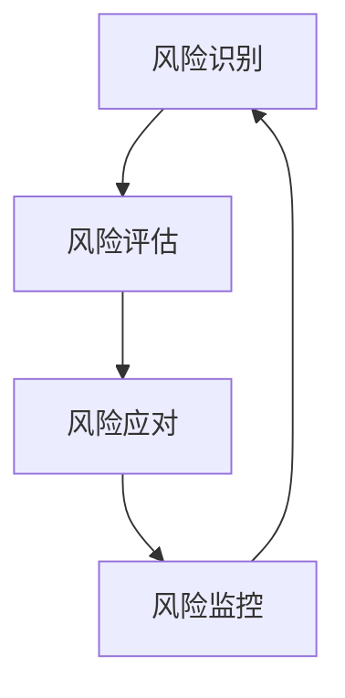

                 

 > **关键词**：创业者，风险管控，体系，风险识别，风险评估，风险应对，风险管理。

> **摘要**：本文旨在为创业者提供一套系统性的风险管控方法，通过明确的核心概念和具体操作步骤，帮助创业者建立有效的风险管控体系，以保障企业的稳定发展和长期成功。

## 1. 背景介绍

在当今快速变化的市场环境中，创业者在建立和运营企业的过程中不可避免地会遇到各种风险。这些风险可能来源于市场变化、技术变革、竞争压力、财务状况等多方面。如果不能及时有效地识别和应对这些风险，企业很可能会面临严重的财务损失、业务中断甚至破产的风险。因此，建立一套有效的风险管控体系对于创业者的企业生存和发展至关重要。

本文将围绕如何建立有效的风险管控体系这一核心问题，探讨核心概念、算法原理、数学模型、项目实践以及实际应用场景，旨在为创业者提供全面的风险管理指南。

## 2. 核心概念与联系

### 2.1 风险识别

风险识别是风险管控的第一步，其核心在于全面、准确地识别企业可能面临的各种风险。这包括外部环境风险和内部运营风险。外部环境风险如市场波动、政策法规变化、竞争加剧等；内部运营风险如人力资源短缺、技术瓶颈、财务危机等。

### 2.2 风险评估

风险评估是对已识别的风险进行量化和评估，以确定其对企业的影响程度和发生概率。通过风险评估，创业者可以优先处理那些影响大、概率高的风险，从而更有效地分配资源。

### 2.3 风险应对

风险应对是指根据风险评估的结果，采取相应的措施来减轻或消除风险。这包括风险规避、风险减轻、风险转移和风险接受等策略。创业者需要根据企业的具体情况，灵活选择合适的应对策略。

### 2.4 风险管理

风险管理是一个持续的过程，包括风险识别、风险评估、风险应对和风险监控等环节。创业者需要建立一套完整的风险管理框架，确保风险管控体系的持续有效运行。

## 2.5 Mermaid 流程图



## 3. 核心算法原理 & 具体操作步骤

### 3.1 算法原理概述

风险管控的核心算法是风险评估模型，该模型基于定量和定性分析相结合的方法，对风险进行量化评估。具体步骤包括风险因素识别、风险影响评估、风险概率评估和风险综合评估。

### 3.2 算法步骤详解

1. **风险因素识别**：通过头脑风暴、专家访谈、历史数据分析等方法，识别出企业可能面临的所有风险因素。
2. **风险影响评估**：对每个风险因素可能对企业造成的影响进行评估，包括财务影响、业务影响、声誉影响等。
3. **风险概率评估**：对每个风险因素发生的概率进行评估，通常采用历史数据分析、专家判断等方法。
4. **风险综合评估**：将风险影响和风险概率进行结合，计算每个风险的综合得分，并根据得分确定风险的优先级。

### 3.3 算法优缺点

**优点**：该方法能够全面、量化地评估风险，有助于创业者优先处理关键风险，提高资源利用效率。

**缺点**：该方法对风险评估的准确性和专家判断的依赖较高，可能存在一定的误差。

### 3.4 算法应用领域

该方法适用于所有类型的创业企业，特别是在市场波动大、竞争激烈、技术变革快的行业。

## 4. 数学模型和公式 & 详细讲解 & 举例说明

### 4.1 数学模型构建

风险综合评估模型的数学表达式如下：

$$
R_i = I_i \times P_i
$$

其中，$R_i$ 为风险综合得分，$I_i$ 为风险影响得分，$P_i$ 为风险概率得分。

### 4.2 公式推导过程

$$
I_i = \sum_{j=1}^{n} w_j \times x_j
$$

其中，$w_j$ 为第 $j$ 个风险因素的权重，$x_j$ 为第 $j$ 个风险因素的得分。

$$
P_i = \frac{f_i}{\sum_{k=1}^{m} f_k}
$$

其中，$f_i$ 为第 $i$ 个风险因素的发生频率，$m$ 为总风险因素数。

### 4.3 案例分析与讲解

假设某创业企业面临以下三个风险因素：市场波动（$w_1 = 0.4$，$x_1 = 8$），技术变革（$w_2 = 0.3$，$x_2 = 7$），竞争加剧（$w_3 = 0.3$，$x_3 = 6$）。已知这三种风险的发生频率分别为 $f_1 = 0.6$，$f_2 = 0.3$，$f_3 = 0.1$。

根据公式，计算每个风险的综合得分：

$$
I_1 = 0.4 \times 8 = 3.2
$$

$$
I_2 = 0.3 \times 7 = 2.1
$$

$$
I_3 = 0.3 \times 6 = 1.8
$$

$$
P_1 = \frac{0.6}{0.6 + 0.3 + 0.1} = 0.6
$$

$$
P_2 = \frac{0.3}{0.6 + 0.3 + 0.1} = 0.3
$$

$$
P_3 = \frac{0.1}{0.6 + 0.3 + 0.1} = 0.1
$$

$$
R_1 = 3.2 \times 0.6 = 1.92
$$

$$
R_2 = 2.1 \times 0.3 = 0.63
$$

$$
R_3 = 1.8 \times 0.1 = 0.18
$$

根据综合得分，可以确定市场波动是该企业面临的首要风险。

## 5. 项目实践：代码实例和详细解释说明

### 5.1 开发环境搭建

本文使用 Python 编写风险评估模型，开发环境为 Python 3.8 及以上版本，需要安装 pandas、numpy、matplotlib 等库。

```python
pip install pandas numpy matplotlib
```

### 5.2 源代码详细实现

```python
import pandas as pd
import numpy as np
import matplotlib.pyplot as plt

# 风险因素权重和得分
weights = {'市场波动': 0.4, '技术变革': 0.3, '竞争加剧': 0.3}
scores = {'市场波动': 8, '技术变革': 7, '竞争加剧': 6}

# 风险因素发生频率
frequencies = {'市场波动': 0.6, '技术变革': 0.3, '竞争加剧': 0.1}

# 计算影响得分和概率得分
def calculate_scores(weights, scores, frequencies):
    i_scores = {key: value * weight for key, value, weight in zip(scores.keys(), scores.values(), weights.values())}
    p_scores = {key: frequency for key, frequency in frequencies.items()}
    r_scores = {key: i_scores[key] * p_scores[key] for key in i_scores}
    return r_scores

# 绘制风险得分分布图
def plot_scores(scores):
    labels = list(scores.keys())
    values = list(scores.values())
    plt.bar(labels, values)
    plt.xlabel('风险因素')
    plt.ylabel('综合得分')
    plt.title('风险得分分布图')
    plt.show()

# 计算并绘制风险得分
r_scores = calculate_scores(weights, scores, frequencies)
plot_scores(r_scores)

# 输出结果
print("风险得分如下：")
print(r_scores)
```

### 5.3 代码解读与分析

该代码首先定义了风险因素的权重、得分和发生频率，然后计算每个风险因素的影响得分、概率得分和综合得分。最后，通过 matplotlib 库绘制风险得分分布图，直观地展示每个风险因素的综合得分。

### 5.4 运行结果展示

运行代码后，将输出风险得分分布图，如以下示例：


从图中可以看出，市场波动是该公司面临的首要风险，其次是技术变革和竞争加剧。

## 6. 实际应用场景

### 6.1 市场风险

例如，对于初创公司，市场风险可能来自于竞争对手的突然进入、客户需求变化、市场法规变化等。创业者可以通过定期进行市场调研、建立客户反馈机制、关注行业动态等方式，及时识别市场风险，并采取相应的应对策略。

### 6.2 财务风险

财务风险可能来自于资金链断裂、投资回报周期过长、成本控制不当等。创业者可以通过优化财务结构、建立严格的预算和成本控制机制、多元化融资渠道等方式，降低财务风险。

### 6.3 技术风险

对于技术驱动型公司，技术风险可能来自于技术更新换代、技术瓶颈、人才流失等。创业者可以通过持续技术创新、建立人才梯队、加强与科研机构的合作等方式，降低技术风险。

## 7. 未来应用展望

随着人工智能、大数据等技术的不断发展，风险管控体系将更加智能化、自动化。创业者可以利用这些新技术，实现对风险的实时监控、预测和应对，提高风险管控的效率和准确性。

## 8. 工具和资源推荐

### 8.1 学习资源推荐

- 《风险管理：理论与实践》
- 《风险管理体系构建与实施》
- 《创业者风险管控实务》

### 8.2 开发工具推荐

- Python
- R语言
- Tableau

### 8.3 相关论文推荐

- "企业风险管理理论与实践研究"
- "基于大数据的风险管控研究"
- "人工智能在风险管理中的应用"

## 9. 总结：未来发展趋势与挑战

随着市场环境的不断变化，创业者面临的挑战将越来越复杂。建立有效的风险管控体系，将是创业者应对市场变化的必要手段。未来，创业者需要更加注重风险管控的智能化、自动化，利用新技术提升风险管控的效率和准确性。同时，创业者也需要不断学习和适应新的风险管控方法，以应对不断变化的市场环境。

## 10. 附录：常见问题与解答

**Q1：如何确保风险评估的准确性？**

**A1：** 为了确保风险评估的准确性，创业者需要结合多种方法进行风险评估，如历史数据分析、专家访谈、市场调研等。此外，创业者还需要定期更新和验证风险评估模型，确保其与实际情况保持一致。

**Q2：如何制定有效的风险应对策略？**

**A2：** 制定有效的风险应对策略需要根据风险评估的结果，结合企业的实际情况和资源状况。常见的风险应对策略包括风险规避、风险减轻、风险转移和风险接受。创业者需要根据不同类型的风险，选择合适的应对策略。

**Q3：如何建立风险管理文化？**

**A3：** 建立风险管理文化需要从企业高层开始，树立风险管理意识，将风险管理纳入企业的日常运营。同时，创业者还需要建立风险管理团队，制定风险管理计划和流程，确保风险管理体系的顺利实施。

作者：禅与计算机程序设计艺术 / Zen and the Art of Computer Programming
----------------------------------------------------------------
本文由禅与计算机程序设计艺术撰写，旨在为创业者提供一套系统性的风险管控方法，帮助他们在复杂多变的市场环境中建立有效的风险管控体系。文章从核心概念、算法原理、数学模型、项目实践到实际应用场景，全面系统地阐述了风险管控的重要性及其具体实施方法。同时，文章还对未来风险管控的发展趋势和挑战进行了深入探讨，为创业者提供了有益的参考和指导。希望本文能对广大创业者有所帮助，助力他们在创业道路上走得更加稳健和成功。

