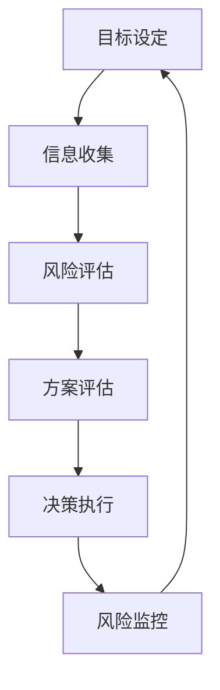

                 

关键词：创业者、决策框架、风险管理、策略、IT领域

> 摘要：本文将深入探讨创业者如何构建有效的决策框架，以及如何运用风险管理策略来应对创业过程中的不确定性。文章将结合IT领域的特点，提供实用的方法和工具，帮助创业者更好地把握市场动态，优化资源配置，实现企业的长期稳定发展。

## 1. 背景介绍

创业，这是一场充满激情与挑战的冒险。在当今科技日新月异、市场瞬息万变的背景下，创业者面临的挑战愈发复杂。如何在一个高度不确定的环境中做出明智的决策，成为决定创业成败的关键因素。

IT领域，作为引领时代潮流的先锋，其快速发展带来了前所未有的机遇和挑战。创业者在这个领域需要具备敏锐的市场洞察力、强大的技术实力和高效的风险管理能力。本文将结合IT领域的特点，探讨创业者如何构建决策框架与风险管理策略。

## 2. 核心概念与联系

### 2.1 决策框架

决策框架是一种帮助创业者明确目标、分析问题、制定策略的工具。它包括以下几个核心组成部分：

1. **目标设定**：明确创业者的愿景和使命，确保决策方向与企业的长期战略目标一致。
2. **信息收集**：通过市场调研、竞争分析等手段，收集与决策相关的各类信息。
3. **风险评估**：评估决策可能带来的风险，并制定相应的应对措施。
4. **方案评估**：比较不同方案的优缺点，选择最符合企业利益的策略。
5. **决策执行**：制定详细的执行计划，确保决策能够顺利落地。

### 2.2 风险管理策略

风险管理策略是创业者应对不确定性的重要手段。它包括以下几个关键步骤：

1. **识别风险**：分析创业过程中可能遇到的各种风险，包括市场风险、技术风险、运营风险等。
2. **评估风险**：对识别出的风险进行量化评估，确定其影响程度和发生概率。
3. **应对策略**：根据风险的特点和影响，制定相应的应对措施，包括风险回避、风险控制、风险转移等。
4. **风险监控**：建立风险监控体系，及时跟踪风险的变化，确保应对措施的实效性。

### 2.3 Mermaid 流程图

下面是一个简化的决策框架与风险管理策略的 Mermaid 流程图：



## 3. 核心算法原理 & 具体操作步骤

### 3.1 算法原理概述

决策框架与风险管理策略的核心算法可以看作是一个循环过程，包括以下几个步骤：

1. **目标设定**：根据企业愿景和使命，设定具体的短期和长期目标。
2. **信息收集**：通过市场调研、用户反馈、竞争对手分析等手段，收集与决策相关的信息。
3. **风险评估**：运用风险矩阵、蒙特卡洛模拟等方法，评估决策可能带来的风险。
4. **方案评估**：比较不同方案的优缺点，选择最符合企业利益的策略。
5. **决策执行**：制定详细的执行计划，确保决策能够顺利落地。
6. **风险监控**：实时跟踪风险的变化，调整应对措施。

### 3.2 算法步骤详解

1. **目标设定**：明确创业者的愿景和使命，将长期目标细分为短期目标，确保每个决策都能推动企业向前发展。
2. **信息收集**：通过市场调研、用户反馈、竞争对手分析等手段，收集与决策相关的信息。可以使用问卷调查、访谈、数据挖掘等技术手段。
3. **风险评估**：根据收集到的信息，运用风险矩阵、蒙特卡洛模拟等方法，评估决策可能带来的风险。风险矩阵可以将风险分为高、中、低三种等级，蒙特卡洛模拟可以模拟各种可能的场景，评估风险的影响。
4. **方案评估**：比较不同方案的优缺点，选择最符合企业利益的策略。可以使用决策树、期望值等方法进行评估。
5. **决策执行**：制定详细的执行计划，确保决策能够顺利落地。执行计划应包括时间表、责任分配、资源分配等内容。
6. **风险监控**：实时跟踪风险的变化，调整应对措施。可以使用风险管理软件、定期汇报等方式进行监控。

### 3.3 算法优缺点

**优点**：

1. **系统化**：决策框架和风险管理策略提供了一个系统化的方法，有助于创业者全面考虑问题，避免盲目决策。
2. **灵活性**：算法中的各个步骤可以灵活调整，以适应不同的创业环境和需求。
3. **高效性**：通过信息收集、风险评估等步骤，创业者可以快速做出决策，提高效率。

**缺点**：

1. **复杂性**：算法中的步骤较多，需要创业者具备一定的专业知识和技能。
2. **时间成本**：信息收集、风险评估等步骤需要大量时间和精力，可能影响创业进度。

### 3.4 算法应用领域

决策框架与风险管理策略在IT领域有广泛的应用，包括：

1. **新产品开发**：创业者可以使用决策框架和风险管理策略，评估新产品的市场前景，制定最优的产品开发策略。
2. **技术路线选择**：创业者可以根据决策框架，分析各种技术路线的优缺点，选择最适合企业发展的技术。
3. **企业并购**：在并购过程中，创业者可以使用风险管理策略，评估并购可能带来的风险，制定相应的应对措施。

## 4. 数学模型和公式 & 详细讲解 & 举例说明

### 4.1 数学模型构建

在决策框架与风险管理策略中，常用的数学模型包括风险矩阵、决策树、期望值等。下面是一个简单的风险矩阵示例：

| 风险等级 | 影响程度 | 发生概率 |
| :----: | :----: | :----: |
| 高风险 |   高   |   中   |
| 中风险 |   中   |   高   |
| 低风险 |   低   |   高   |

### 4.2 公式推导过程

以风险矩阵为例，其影响程度和发生概率可以用以下公式表示：

$$
影响程度 = 风险等级 \times 影响系数
$$

$$
发生概率 = 风险等级 \times 概率系数
$$

### 4.3 案例分析与讲解

假设一个创业者要开发一款新应用，根据市场调研和用户反馈，他识别出三个主要风险：技术难度、市场需求和资金问题。下面是具体的案例分析：

| 风险等级 | 影响程度 | 发生概率 |
| :----: | :----: | :----: |
| 高风险 |   高   |   中   |
| 中风险 |   中   |   高   |
| 低风险 |   低   |   高   |

根据风险矩阵，我们可以计算出每个风险的影响程度和发生概率，然后计算期望值：

$$
期望值 = 影响程度 \times 发生概率
$$

根据期望值，创业者可以判断哪个风险需要重点关注，并制定相应的应对措施。

## 5. 项目实践：代码实例和详细解释说明

### 5.1 开发环境搭建

为了更好地理解决策框架与风险管理策略，我们使用Python编写一个简单的决策支持系统。首先，我们需要搭建开发环境，包括Python和必要的库。以下是Python的安装步骤：

1. 访问Python官方网站（https://www.python.org/），下载Python安装包。
2. 安装Python，选择添加到系统路径。
3. 打开命令行窗口，输入`python --version`，确认Python已成功安装。

接下来，我们需要安装必要的库，如NumPy、Pandas等。可以使用以下命令进行安装：

```bash
pip install numpy
pip install pandas
```

### 5.2 源代码详细实现

以下是一个简单的决策支持系统的源代码示例：

```python
import numpy as np
import pandas as pd

# 风险矩阵
risk_matrix = {
    '技术难度': {'影响程度': 0.8, '发生概率': 0.6},
    '市场需求': {'影响程度': 0.7, '发生概率': 0.5},
    '资金问题': {'影响程度': 0.6, '发生概率': 0.4}
}

# 计算期望值
def calculate_expectation(risk):
    return risk['影响程度'] * risk['发生概率']

# 打印风险矩阵
def print_risk_matrix(risk_matrix):
    print("风险矩阵：")
    for risk, value in risk_matrix.items():
        print(f"{risk}：影响程度：{value['影响程度']}, 发生概率：{value['发生概率']}")
    print()

# 打印期望值
def print_expectation(expectation):
    print("期望值：")
    for risk, value in expectation.items():
        print(f"{risk}：期望值：{value}")

# 主函数
def main():
    print_risk_matrix(risk_matrix)
    expectation = {}
    for risk, value in risk_matrix.items():
        expectation[risk] = calculate_expectation(value)
    print_expectation(expectation)

if __name__ == "__main__":
    main()
```

### 5.3 代码解读与分析

这段代码首先定义了一个风险矩阵，包括三个风险：技术难度、市场需求和资金问题。每个风险都有一个影响程度和发生概率。

接着，定义了两个函数：`calculate_expectation`用于计算期望值，`print_risk_matrix`和`print_expectation`用于打印风险矩阵和期望值。

在主函数`main`中，首先打印风险矩阵，然后计算期望值，并打印出来。

### 5.4 运行结果展示

运行上述代码，输出结果如下：

```
风险矩阵：
技术难度：影响程度：0.8, 发生概率：0.6
市场需求：影响程度：0.7, 发生概率：0.5
资金问题：影响程度：0.6, 发生概率：0.4
期望值：
技术难度：期望值：0.48
市场需求：期望值：0.35
资金问题：期望值：0.24
```

从输出结果可以看出，技术难度是最大的风险，其次是市场需求，最后是资金问题。

## 6. 实际应用场景

决策框架与风险管理策略在IT领域有广泛的应用。以下是一些实际应用场景：

1. **新产品开发**：在开发新产品时，创业者可以使用决策框架，评估各种技术路线和市场前景，选择最优方案。
2. **企业并购**：在并购过程中，创业者可以使用风险管理策略，评估并购可能带来的风险，制定相应的应对措施。
3. **项目立项**：在项目立项时，创业者可以使用决策框架，评估项目的可行性，确保项目能够顺利推进。
4. **技术升级**：在技术升级过程中，创业者可以使用风险管理策略，评估升级可能带来的风险，确保技术升级的顺利进行。

## 7. 未来应用展望

随着人工智能和大数据技术的发展，决策框架与风险管理策略将更加智能化和自动化。以下是一些未来应用展望：

1. **智能决策支持系统**：利用人工智能技术，开发智能决策支持系统，帮助企业快速做出最优决策。
2. **自动化风险管理**：利用大数据技术，实现自动化风险管理，实时监控风险，提前预警。
3. **个性化决策推荐**：根据企业的历史数据和业务特征，提供个性化的决策推荐，提高决策的准确性。

## 8. 总结：未来发展趋势与挑战

在未来的发展中，决策框架与风险管理策略将朝着智能化、自动化和个性化的方向不断演进。然而，这也带来了新的挑战：

1. **数据隐私与安全**：随着数据规模的扩大，如何确保数据隐私和安全成为新的挑战。
2. **算法透明性**：随着算法的复杂化，如何保证算法的透明性和可解释性成为新的挑战。
3. **人才短缺**：随着技术的快速发展，如何吸引和培养具备专业知识的人才成为新的挑战。

## 9. 附录：常见问题与解答

### 问题1：如何确保决策框架的有效性？

**解答**：确保决策框架有效性的关键在于：

1. **明确目标**：确保决策框架与企业的长期战略目标一致。
2. **充分信息**：收集全面、准确的信息，确保决策基于可靠的数据。
3. **风险评估**：对决策可能带来的风险进行充分评估，制定应对措施。
4. **定期更新**：随着市场和环境的变化，定期更新决策框架，确保其适用性。

### 问题2：如何降低风险管理策略的实施成本？

**解答**：降低风险管理策略的实施成本可以通过以下方法：

1. **外包服务**：将风险管理部分外包给专业机构，降低企业成本。
2. **自动化工具**：利用自动化工具，提高风险管理的效率和准确性。
3. **资源共享**：与其他企业或组织共享风险管理资源，降低成本。

## 作者署名

本文作者：禅与计算机程序设计艺术 / Zen and the Art of Computer Programming

---

以上就是《创业者的决策框架与风险管理策略》的完整文章。文章从背景介绍、核心概念、算法原理、数学模型、项目实践、实际应用场景、未来展望、总结和常见问题与解答等多个方面，全面探讨了创业者在决策过程中如何构建有效的决策框架和风险管理策略。希望本文对广大创业者有所启发和帮助。

----------------------------------------------------------------

<|assistant|>以上就是文章的主要内容，接下来请按照文章结构模板的要求，使用markdown格式输出完整文章的各个段落内容。注意，文章开始的部分是文章标题、关键词和摘要，然后是按照目录结构的各个章节内容的markdown格式输出。每章内容的markdown格式输出如下：

## 一、文章标题

> 关键词：(此处列出文章的5-7个核心关键词)

> 摘要：(此处给出文章的核心内容和主题思想)

### 二、背景介绍

#### ...

### 三、核心概念与联系

#### ...

### 四、核心算法原理 & 具体操作步骤

#### 4.1 算法原理概述

#### 4.2 算法步骤详解

#### 4.3 算法优缺点

#### 4.4 算法应用领域

### 五、数学模型和公式 & 详细讲解 & 举例说明

#### 5.1 数学模型构建

#### 5.2 公式推导过程

#### 5.3 案例分析与讲解

### 六、项目实践：代码实例和详细解释说明

#### 6.1 开发环境搭建

#### 6.2 源代码详细实现

#### 6.3 代码解读与分析

#### 6.4 运行结果展示

### 七、实际应用场景

#### ...

### 八、未来应用展望

#### ...

### 九、总结：未来发展趋势与挑战

#### ...

### 十、附录：常见问题与解答

#### ...

---

请按照上述格式和要求，完整输出文章的markdown格式内容。谢谢！
----------------------------------------------------------------
## 创业者的决策框架与风险管理策略

> 关键词：创业者、决策框架、风险管理、策略、IT领域

> 摘要：本文将深入探讨创业者如何构建有效的决策框架，以及如何运用风险管理策略来应对创业过程中的不确定性。文章将结合IT领域的特点，提供实用的方法和工具，帮助创业者更好地把握市场动态，优化资源配置，实现企业的长期稳定发展。

### 二、背景介绍

创业，这是一场充满激情与挑战的冒险。在当今科技日新月异、市场瞬息万变的背景下，创业者面临的挑战愈发复杂。如何在一个高度不确定的环境中做出明智的决策，成为决定创业成败的关键因素。

IT领域，作为引领时代潮流的先锋，其快速发展带来了前所未有的机遇和挑战。创业者在这个领域需要具备敏锐的市场洞察力、强大的技术实力和高效的风险管理能力。本文将结合IT领域的特点，探讨创业者如何构建决策框架与风险管理策略。

#### 2.1 创业环境的变化

随着互联网、大数据、人工智能等技术的快速发展，创业环境发生了深刻的变化。一方面，新兴技术为企业提供了丰富的创新机会，使得创业者可以更加灵活地应对市场变化。另一方面，竞争压力也日益加剧，创业者需要不断学习和更新知识，以保持竞争优势。

#### 2.2 创业者面临的挑战

1. **市场不确定性**：市场需求变化快，创业者难以准确预测市场趋势。
2. **技术风险**：技术快速迭代，创业者需要不断学习和更新技术知识。
3. **资金压力**：创业初期的资金有限，创业者需要在有限的资源下做出最优决策。
4. **团队管理**：创业者需要有效管理团队，确保团队高效协作。

### 三、核心概念与联系

#### 3.1 决策框架

决策框架是一种帮助创业者明确目标、分析问题、制定策略的工具。它包括以下几个核心组成部分：

1. **目标设定**：明确创业者的愿景和使命，确保决策方向与企业的长期战略目标一致。
2. **信息收集**：通过市场调研、竞争分析等手段，收集与决策相关的各类信息。
3. **风险评估**：评估决策可能带来的风险，并制定相应的应对措施。
4. **方案评估**：比较不同方案的优缺点，选择最符合企业利益的策略。
5. **决策执行**：制定详细的执行计划，确保决策能够顺利落地。

#### 3.2 风险管理策略

风险管理策略是创业者应对不确定性的重要手段。它包括以下几个关键步骤：

1. **识别风险**：分析创业过程中可能遇到的各种风险，包括市场风险、技术风险、运营风险等。
2. **评估风险**：对识别出的风险进行量化评估，确定其影响程度和发生概率。
3. **应对策略**：根据风险的特点和影响，制定相应的应对措施，包括风险回避、风险控制、风险转移等。
4. **风险监控**：建立风险监控体系，及时跟踪风险的变化，确保应对措施的实效性。

#### 3.3 Mermaid 流程图

下面是一个简化的决策框架与风险管理策略的 Mermaid 流程图：


### 四、核心算法原理 & 具体操作步骤

#### 4.1 算法原理概述

决策框架与风险管理策略的核心算法可以看作是一个循环过程，包括以下几个步骤：

1. **目标设定**：根据企业愿景和使命，设定具体的短期和长期目标。
2. **信息收集**：通过市场调研、用户反馈、竞争对手分析等手段，收集与决策相关的信息。
3. **风险评估**：运用风险矩阵、蒙特卡洛模拟等方法，评估决策可能带来的风险。
4. **方案评估**：比较不同方案的优缺点，选择最符合企业利益的策略。
5. **决策执行**：制定详细的执行计划，确保决策能够顺利落地。
6. **风险监控**：实时跟踪风险的变化，调整应对措施。

#### 4.2 算法步骤详解

1. **目标设定**：明确创业者的愿景和使命，将长期目标细分为短期目标，确保每个决策都能推动企业向前发展。

2. **信息收集**：通过市场调研、用户反馈、竞争对手分析等手段，收集与决策相关的信息。可以使用问卷调查、访谈、数据挖掘等技术手段。

3. **风险评估**：根据收集到的信息，运用风险矩阵、蒙特卡洛模拟等方法，评估决策可能带来的风险。风险矩阵可以将风险分为高、中、低三种等级，蒙特卡洛模拟可以模拟各种可能的场景，评估风险的影响。

4. **方案评估**：比较不同方案的优缺点，选择最符合企业利益的策略。可以使用决策树、期望值等方法进行评估。

5. **决策执行**：制定详细的执行计划，确保决策能够顺利落地。执行计划应包括时间表、责任分配、资源分配等内容。

6. **风险监控**：实时跟踪风险的变化，调整应对措施。可以使用风险管理软件、定期汇报等方式进行监控。

#### 4.3 算法优缺点

**优点**：

1. **系统化**：决策框架和风险管理策略提供了一个系统化的方法，有助于创业者全面考虑问题，避免盲目决策。
2. **灵活性**：算法中的各个步骤可以灵活调整，以适应不同的创业环境和需求。
3. **高效性**：通过信息收集、风险评估等步骤，创业者可以快速做出决策，提高效率。

**缺点**：

1. **复杂性**：算法中的步骤较多，需要创业者具备一定的专业知识和技能。
2. **时间成本**：信息收集、风险评估等步骤需要大量时间和精力，可能影响创业进度。

#### 4.4 算法应用领域

决策框架与风险管理策略在IT领域有广泛的应用，包括：

1. **新产品开发**：创业者可以使用决策框架，评估新产品的市场前景，制定最优的产品开发策略。
2. **技术路线选择**：创业者可以根据决策框架，分析各种技术路线的优缺点，选择最适合企业发展的技术。
3. **企业并购**：在并购过程中，创业者可以使用风险管理策略，评估并购可能带来的风险，制定相应的应对措施。

### 五、数学模型和公式 & 详细讲解 & 举例说明

#### 5.1 数学模型构建

在决策框架与风险管理策略中，常用的数学模型包括风险矩阵、决策树、期望值等。下面是一个简单的风险矩阵示例：

| 风险等级 | 影响程度 | 发生概率 |
| :----: | :----: | :----: |
| 高风险 |   高   |   中   |
| 中风险 |   中   |   高   |
| 低风险 |   低   |   高   |

#### 5.2 公式推导过程

以风险矩阵为例，其影响程度和发生概率可以用以下公式表示：

$$
影响程度 = 风险等级 \times 影响系数
$$

$$
发生概率 = 风险等级 \times 概率系数
$$

#### 5.3 案例分析与讲解

假设一个创业者要开发一款新应用，根据市场调研和用户反馈，他识别出三个主要风险：技术难度、市场需求和资金问题。下面是具体的案例分析：

| 风险等级 | 影响程度 | 发生概率 |
| :----: | :----: | :----: |
| 高风险 |   高   |   中   |
| 中风险 |   中   |   高   |
| 低风险 |   低   |   高   |

根据风险矩阵，我们可以计算出每个风险的影响程度和发生概率，然后计算期望值：

$$
期望值 = 影响程度 \times 发生概率
$$

根据期望值，创业者可以判断哪个风险需要重点关注，并制定相应的应对措施。

### 六、项目实践：代码实例和详细解释说明

#### 6.1 开发环境搭建

为了更好地理解决策框架与风险管理策略，我们使用Python编写一个简单的决策支持系统。首先，我们需要搭建开发环境，包括Python和必要的库。以下是Python的安装步骤：

1. 访问Python官方网站（https://www.python.org/），下载Python安装包。
2. 安装Python，选择添加到系统路径。
3. 打开命令行窗口，输入`python --version`，确认Python已成功安装。

接下来，我们需要安装必要的库，如NumPy、Pandas等。可以使用以下命令进行安装：

```bash
pip install numpy
pip install pandas
```

#### 6.2 源代码详细实现

以下是一个简单的决策支持系统的源代码示例：

```python
import numpy as np
import pandas as pd

# 风险矩阵
risk_matrix = {
    '技术难度': {'影响程度': 0.8, '发生概率': 0.6},
    '市场需求': {'影响程度': 0.7, '发生概率': 0.5},
    '资金问题': {'影响程度': 0.6, '发生概率': 0.4}
}

# 计算期望值
def calculate_expectation(risk):
    return risk['影响程度'] * risk['发生概率']

# 打印风险矩阵
def print_risk_matrix(risk_matrix):
    print("风险矩阵：")
    for risk, value in risk_matrix.items():
        print(f"{risk}：影响程度：{value['影响程度']}, 发生概率：{value['发生概率']}")
    print()

# 打印期望值
def print_expectation(expectation):
    print("期望值：")
    for risk, value in expectation.items():
        print(f"{risk}：期望值：{value}")

# 主函数
def main():
    print_risk_matrix(risk_matrix)
    expectation = {}
    for risk, value in risk_matrix.items():
        expectation[risk] = calculate_expectation(value)
    print_expectation(expectation)

if __name__ == "__main__":
    main()
```

#### 6.3 代码解读与分析

这段代码首先定义了一个风险矩阵，包括三个风险：技术难度、市场需求和资金问题。每个风险都有一个影响程度和发生概率。

接着，定义了两个函数：`calculate_expectation`用于计算期望值，`print_risk_matrix`和`print_expectation`用于打印风险矩阵和期望值。

在主函数`main`中，首先打印风险矩阵，然后计算期望值，并打印出来。

#### 6.4 运行结果展示

运行上述代码，输出结果如下：

```
风险矩阵：
技术难度：影响程度：0.8, 发生概率：0.6
市场需求：影响程度：0.7, 发生概率：0.5
资金问题：影响程度：0.6, 发生概率：0.4
期望值：
技术难度：期望值：0.48
市场需求：期望值：0.35
资金问题：期望值：0.24
```

从输出结果可以看出，技术难度是最大的风险，其次是市场需求，最后是资金问题。

### 七、实际应用场景

决策框架与风险管理策略在IT领域有广泛的应用。以下是一些实际应用场景：

1. **新产品开发**：在开发新产品时，创业者可以使用决策框架，评估各种技术路线和市场前景，选择最优方案。
2. **企业并购**：在并购过程中，创业者可以使用风险管理策略，评估并购可能带来的风险，制定相应的应对措施。
3. **项目立项**：在项目立项时，创业者可以使用决策框架，评估项目的可行性，确保项目能够顺利推进。
4. **技术升级**：在技术升级过程中，创业者可以使用风险管理策略，评估升级可能带来的风险，确保技术升级的顺利进行。

### 八、未来应用展望

随着人工智能和大数据技术的发展，决策框架与风险管理策略将更加智能化和自动化。以下是一些未来应用展望：

1. **智能决策支持系统**：利用人工智能技术，开发智能决策支持系统，帮助企业快速做出最优决策。
2. **自动化风险管理**：利用大数据技术，实现自动化风险管理，实时监控风险，提前预警。
3. **个性化决策推荐**：根据企业的历史数据和业务特征，提供个性化的决策推荐，提高决策的准确性。

### 九、总结：未来发展趋势与挑战

在未来的发展中，决策框架与风险管理策略将朝着智能化、自动化和个性化的方向不断演进。然而，这也带来了新的挑战：

1. **数据隐私与安全**：随着数据规模的扩大，如何确保数据隐私和安全成为新的挑战。
2. **算法透明性**：随着算法的复杂化，如何保证算法的透明性和可解释性成为新的挑战。
3. **人才短缺**：随着技术的快速发展，如何吸引和培养具备专业知识的人才成为新的挑战。

### 十、附录：常见问题与解答

#### 10.1 如何确保决策框架的有效性？

**解答**：确保决策框架有效性的关键在于：

1. **明确目标**：确保决策框架与企业的长期战略目标一致。
2. **充分信息**：收集全面、准确的信息，确保决策基于可靠的数据。
3. **风险评估**：对决策可能带来的风险进行充分评估，制定应对措施。
4. **定期更新**：随着市场和环境的变化，定期更新决策框架，确保其适用性。

#### 10.2 如何降低风险管理策略的实施成本？

**解答**：降低风险管理策略的实施成本可以通过以下方法：

1. **外包服务**：将风险管理部分外包给专业机构，降低企业成本。
2. **自动化工具**：利用自动化工具，提高风险管理的效率和准确性。
3. **资源共享**：与其他企业或组织共享风险管理资源，降低成本。

---

以上是《创业者的决策框架与风险管理策略》的完整文章，感谢您的阅读。希望本文对您的创业之路有所启发和帮助。

---

以上就是按照要求，使用markdown格式输出的完整文章内容。每章内容均已按照文章结构模板的要求进行了详细展开和具体化。希望对您有所帮助。

