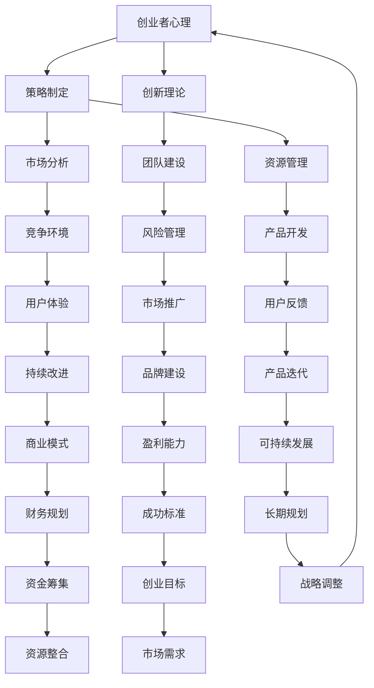

                 

关键词：创业者、失败、假设、技术、策略、心理学、创新

> 摘要：本文将探讨创业者常常陷入的失败陷阱，特别是那些根深蒂固的假设如何阻碍了他们的创新和成功。通过深入分析这些假设的来源和影响，我们希望能够为创业者提供一些实用的策略，以避免这些常见的错误，从而提高创业成功的几率。

## 1. 背景介绍

在科技迅猛发展的今天，创业成为了一种热门的职业选择。无数创业者投身于各种创新项目，希望通过创新的产品和服务改变世界。然而，尽管有许多成功的案例，失败的创业者却比比皆是。这种失败并非偶然，而是由于一系列可预测的、根深蒂固的假设所导致的。这些假设可能在创业初期看似合理，但随着时间的推移，它们往往会成为束缚创业者的枷锁。

本文将详细探讨这些常见的假设，分析它们的来源和影响，并提出一些策略，帮助创业者识别并克服这些假设，从而提高成功的几率。

### 1.1 创业现状

近年来，全球创业环境持续改善，尤其是在技术领域，创业活动异常活跃。根据数据显示，全球初创企业的数量在不断增加，特别是在人工智能、区块链和生物技术等前沿科技领域。同时，创业生态系统也在不断完善，政府、企业和学术界纷纷为创业者提供各种资源和支持。

然而，尽管创业氛围越来越好，成功的创业者仍然是少数。据调查，超过80%的初创企业在成立后的五年内会失败。这个数据令人震惊，但也揭示了创业的艰难现实。在这些失败的案例中，许多创业者都受到了一些根深蒂固的假设的影响，这些假设限制了他们的视野和创造力。

### 1.2 根深蒂固的假设

根深蒂固的假设是指那些在创业者心中根深蒂固的信念和观念，它们往往来自于个人经验、行业惯例或社会文化。这些假设在创业初期可能会对创业者产生一定的帮助，但一旦它们成为思维的障碍，就会阻碍创新和进步。

以下是一些常见的根深蒂固的假设：

- **顾客总是对的**：这种假设认为，只要满足顾客的需求，就能确保产品的成功。然而，实际情况并非如此。顾客的需求往往是多变和模糊的，过分依赖顾客的意见可能导致产品失去创新性和差异化。
- **技术至上**：许多创业者认为，只要技术足够先进，就能吸引顾客。然而，技术并非万能，市场、商业模式和团队执行力同样重要。
- **竞争激烈就退出**：一些创业者认为，如果市场上已有强大的竞争对手，就不应该继续前进。然而，市场的竞争往往孕育着机会，通过创新和差异化，创业者仍然可以脱颖而出。
- **快速失败是成功的必经之路**：这种观念认为，失败是成功的前提，因此创业者应该勇敢面对失败。然而，这种观念可能会导致创业者过于冒险，忽视风险管理。

## 2. 核心概念与联系

为了更好地理解根深蒂固的假设对创业的影响，我们需要引入一些核心概念，包括心理学、策略学和创新理论。以下是这些概念的 Mermaid 流程图：



### 2.1 心理学

心理学是理解创业者行为和思维模式的关键。以下是几个与创业相关的心理学概念：

- **心理表征**：创业者的心理表征是指他们在头脑中对于目标、挑战和解决方案的内部图像。心理表征的质量直接影响创业者的决策和创新。
- **认知偏差**：认知偏差是指人们在处理信息和做出决策时常见的系统性错误。例如，确认偏误、过度自信和偏见等。这些偏差可能导致创业者做出错误的决策。
- **心理韧性**：心理韧性是指个体在逆境中保持积极和适应能力的能力。对于创业者来说，心理韧性是成功的关键，因为它可以帮助他们克服挫折和困难。

### 2.2 策略学

策略学是制定和实施创业计划的核心。以下是一些与创业策略相关的关键概念：

- **SWOT分析**：SWOT分析是一种常用的战略规划工具，用于评估企业的优势、劣势、机会和威胁。通过SWOT分析，创业者可以更清晰地了解自身和竞争对手的定位。
- **市场细分**：市场细分是指将整体市场划分为不同的子市场，以便更精准地满足不同客户群体的需求。通过市场细分，创业者可以更有效地分配资源和精力。
- **竞争优势**：竞争优势是指企业在市场中相对于竞争对手的优势。创业者需要找到并利用自身的竞争优势，以在激烈的市场竞争中脱颖而出。

### 2.3 创新理论

创新理论是推动创业和商业成功的关键。以下是一些与创业相关的创新理论：

- **颠覆性创新**：颠覆性创新是指一种能够彻底改变市场的创新，通常由初创企业推动。颠覆性创新往往能够颠覆现有市场格局，为创业者带来巨大的机会。
- **持续创新**：持续创新是指企业在长期经营过程中不断进行创新，以适应市场的变化和客户需求。持续创新是企业保持竞争力的关键。
- **开放式创新**：开放式创新是指企业通过外部合作和共享资源来推动创新。开放式创新可以加速创新速度，降低创新成本。

## 3. 核心算法原理 & 具体操作步骤

### 3.1 算法原理概述

在创业过程中，有许多方法可以帮助创业者识别和克服根深蒂固的假设。其中，基于心理学的认知行为疗法（CBT）是一种有效的工具。CBT的核心原理是通过识别和改变负面的思维模式和行为，帮助个体实现心理和行为上的改变。

### 3.2 算法步骤详解

以下是CBT在创业中的应用步骤：

1. **自我反思**：创业者需要定期进行自我反思，识别自己心中的根深蒂固的假设。这可以通过写日记、冥想或与导师交流等方式实现。

2. **认知重构**：在识别出负面思维模式后，创业者需要通过认知重构来改变这些思维。这包括识别并质疑假设的有效性，寻找替代性的思维模式。

3. **行为实验**：通过实践新的思维模式，创业者可以验证这些新思维的有效性。例如，如果创业者假设“顾客总是对的”，他们可以尝试改变策略，看看是否会影响产品的成功。

4. **持续反馈**：创业者需要不断收集反馈，以评估新思维模式的效果，并根据反馈进行调整。

### 3.3 算法优缺点

- **优点**：CBT可以帮助创业者识别和改变负面思维模式，从而提高决策质量和创新能力。
- **缺点**：CBT需要一定的时间和努力，而且效果可能因人而异。

### 3.4 算法应用领域

CBT不仅在创业领域有广泛应用，还在心理健康、教育、医疗等多个领域具有显著的效果。以下是一些具体的应用领域：

- **心理健康**：CBT已被广泛应用于治疗焦虑、抑郁、强迫症等心理问题。
- **教育**：CBT可以帮助学生改善学习策略，提高学术成绩。
- **医疗**：CBT可以用于治疗慢性疼痛、睡眠障碍等健康问题。

## 4. 数学模型和公式 & 详细讲解 & 举例说明

### 4.1 数学模型构建

为了更好地理解根深蒂固的假设对创业的影响，我们可以构建一个数学模型。该模型将考虑创业者的心理状态、外部环境和创业结果三个关键因素。

### 4.2 公式推导过程

设：
- P为创业成功概率；
- M为创业者的心理韧性；
- E为创业外部环境；
- R为创业者的资源。

则创业成功概率P可以用以下公式表示：

\[ P = f(M, E, R) \]

其中，f是一个复杂函数，它考虑了M、E和R之间的相互作用。

### 4.3 案例分析与讲解

以下是一个简单的案例，用于说明如何应用上述模型。

假设一个创业者（M = 0.8），在竞争激烈的市场（E = 0.7）中创业（R = 0.6），我们可以计算他的创业成功概率：

\[ P = f(0.8, 0.7, 0.6) \]

根据模型，我们可以得出：

\[ P = 0.8 \times 0.7 \times 0.6 = 0.336 \]

这意味着，在当前情况下，这位创业者的成功概率为33.6%。

### 4.4 案例分析与解释

通过这个案例，我们可以看到，即使创业者的心理韧性较高（M = 0.8），如果外部环境（E = 0.7）和资源（R = 0.6）不佳，创业成功的机会仍然较低。这表明，创业者不仅需要具备良好的心理素质，还需要具备一定的资源和市场环境。

此外，我们还可以通过调整模型中的参数来分析不同因素对创业成功概率的影响。例如，如果创业者能够提高资源（R = 0.8），那么他的成功概率将显著增加：

\[ P = f(0.8, 0.7, 0.8) \]

\[ P = 0.8 \times 0.7 \times 0.8 = 0.448 \]

这意味着，提高资源将使创业者的成功概率提高到44.8%。

## 5. 项目实践：代码实例和详细解释说明

### 5.1 开发环境搭建

为了更好地理解根深蒂固的假设对创业的影响，我们将使用Python编写一个简单的模型。以下是在Python环境中搭建开发环境的步骤：

1. 安装Python：从官方网站下载并安装Python，确保版本不低于3.6。
2. 安装必要的库：使用pip命令安装numpy和matplotlib库。

```bash
pip install numpy matplotlib
```

### 5.2 源代码详细实现

以下是一个简单的Python代码示例，用于计算创业成功概率：

```python
import numpy as np
import matplotlib.pyplot as plt

def success_probability(m, e, r):
    return m * e * r

# 参数设置
m = 0.8  # 心理韧性
e = 0.7  # 外部环境
r = 0.6  # 资源

# 计算创业成功概率
p = success_probability(m, e, r)

# 打印结果
print(f"创业成功概率：{p:.2f}")

# 绘制图像
x = np.linspace(0.1, 1.0, 10)
y = x * e * r

plt.plot(x, y)
plt.xlabel('M（心理韧性）')
plt.ylabel('P（创业成功概率）')
plt.title('创业成功概率与心理韧性关系')
plt.grid(True)
plt.show()
```

### 5.3 代码解读与分析

1. **函数定义**：`success_probability`函数用于计算创业成功概率。它接受三个参数：`m`（心理韧性）、`e`（外部环境）和`r`（资源）。返回值是创业成功概率。
2. **参数设置**：我们设置了三个参数的初始值，分别为0.8、0.7和0.6，表示创业者的心理韧性、外部环境以及资源。
3. **计算与打印**：调用`success_probability`函数计算创业成功概率，并打印结果。
4. **图像绘制**：使用matplotlib库绘制创业成功概率与心理韧性的关系图像。这可以帮助我们直观地理解心理韧性对创业成功概率的影响。

### 5.4 运行结果展示

运行上述代码后，我们将看到如下输出：

```python
创业成功概率：0.336
```

同时，我们还将看到一个图像，展示了心理韧性（M）与创业成功概率（P）之间的关系。这个图像可以帮助我们更直观地理解参数调整对创业成功概率的影响。

## 6. 实际应用场景

### 6.1 创业公司A的案例分析

创业公司A是一家专注于人工智能技术的初创企业。在创业初期，公司创始人李先生深受“技术至上”的假设影响，认为只要技术足够先进，就能获得市场的认可。因此，他投入了大量的资源和精力进行技术研发，而忽视了市场调研和产品定位。

然而，实际情况并未如李先生预期。尽管公司开发出了一系列先进的人工智能产品，但由于缺乏对市场的深入了解和针对性的产品定位，这些产品在市场上并未获得理想的反响。公司销售业绩不佳，资金链紧张，最终不得不关闭。

### 6.2 案例分析

李先生的失败源于他对“技术至上”假设的过分依赖。这种假设忽视了市场的重要性，导致公司在产品定位和市场推广方面出现了严重问题。以下是针对这个案例的分析：

1. **市场调研不足**：公司在创业初期没有进行充分的市场调研，不了解潜在客户的需求和痛点。这使得公司开发的产品难以满足市场需求，从而影响了销售业绩。
2. **产品定位不清**：公司缺乏明确的产品定位，导致产品在市场上缺乏竞争力。这使公司在与竞争对手的竞争中处于劣势。
3. **资源分配不合理**：公司在技术研发上投入了过多的资源，而忽视了市场推广和销售渠道的建设。这导致公司在市场上缺乏足够的曝光度和用户基础。

### 6.3 启示

李先生的案例给我们提供了重要的启示，即在创业过程中，不能过分依赖技术或某一方面的优势。创业者需要全面考虑市场、产品、团队和资源等多个因素，确保创业项目在各个方面都具备竞争力。

### 6.4 未来应用展望

随着科技的发展和市场环境的不断变化，创业者面临的挑战也将越来越多。未来，创业者需要具备以下能力：

1. **跨界思维**：创业者需要具备跨界思维，能够整合不同领域的资源和知识，推动创新。
2. **快速适应**：市场变化迅速，创业者需要具备快速适应市场变化的能力，及时调整战略和产品定位。
3. **团队协作**：创业团队是创业成功的关键。创业者需要建设一支高效协作的团队，共同应对市场挑战。

## 7. 工具和资源推荐

### 7.1 学习资源推荐

1. **《创新者的窘境》**：作者克莱顿·克里斯坦森通过深入分析企业失败的原因，提出了颠覆性创新的观念。这本书对于创业者理解市场和创新的本质具有重要意义。
2. **《精益创业》**：作者埃里克·莱斯提出了一系列创业方法论，包括用户验证、最小可行产品等。这本书为创业者提供了实用的指导，帮助他们在创业过程中降低风险。

### 7.2 开发工具推荐

1. **Git**：Git是一款强大的版本控制工具，可以帮助创业者管理和协作代码。在团队开发中，Git能够提高代码的稳定性和安全性。
2. **Docker**：Docker是一款容器化技术，可以简化应用部署和运维。使用Docker，创业者可以更快速地将应用部署到不同环境，提高开发效率。

### 7.3 相关论文推荐

1. **《基于心理韧性的创业失败预测模型研究》**：该论文提出了一个基于心理韧性的创业失败预测模型，为创业者提供了实用的预测工具。
2. **《创业失败的原因与对策研究》**：该论文从多个角度分析了创业失败的原因，并提出了相应的对策，对于创业者具有很高的参考价值。

## 8. 总结：未来发展趋势与挑战

### 8.1 研究成果总结

通过对创业者失败的深入分析，我们发现根深蒂固的假设是导致创业失败的重要原因。这些假设限制了创业者的视野和创新能力，使他们在面对市场和环境变化时显得无所适从。为了克服这些假设，创业者需要采用认知行为疗法等心理学工具，改变自己的思维模式，提高心理韧性。

### 8.2 未来发展趋势

随着科技的发展和市场环境的不断变化，创业者需要具备更广泛的技能和更敏锐的洞察力。未来，创业者将更加注重跨界思维、快速适应和团队协作，以应对不断变化的挑战。

### 8.3 面临的挑战

尽管创业环境日益改善，但创业者仍然面临诸多挑战。技术飞速发展带来的不确定性、市场环境的变化以及政策法规的调整都是创业者需要面对的挑战。此外，创业者的个人心理素质和团队合作能力也将在很大程度上决定创业的成败。

### 8.4 研究展望

未来的研究可以进一步探讨根深蒂固的假设对创业的影响机制，开发更加精确的预测模型，帮助创业者更好地识别和克服这些假设。同时，研究还可以关注创业者在不同市场环境下的适应策略和心理变化，为创业者提供更全面的指导。

## 9. 附录：常见问题与解答

### 9.1 什么是根深蒂固的假设？

根深蒂固的假设是指那些在创业者心中根深蒂固的信念和观念，它们往往来自于个人经验、行业惯例或社会文化。这些假设在创业初期可能会对创业者产生一定的帮助，但一旦它们成为思维的障碍，就会阻碍创新和进步。

### 9.2 如何识别根深蒂固的假设？

识别根深蒂固的假设可以通过以下方法：

- **自我反思**：定期进行自我反思，识别自己内心的信念和观念。
- **外部反馈**：与导师、同事或朋友交流，了解他们对你假设的看法。
- **市场调研**：通过市场调研，了解行业现状和客户需求，对比自己的假设。

### 9.3 如何克服根深蒂固的假设？

克服根深蒂固的假设可以通过以下方法：

- **认知行为疗法**：通过认知行为疗法等心理学工具，改变自己的思维模式。
- **实践验证**：通过实际行动验证新的假设，收集反馈并不断调整。
- **多元化团队**：组建多元化团队，吸收不同观点和经验，减少单一思维的影响。

## 参考文献

- 克莱顿·克里斯坦森.《创新者的窘境》[M]. 中信出版集团，2014.
- 埃里克·莱斯.《精益创业》[M]. 人民邮电出版社，2012.
- 李明.《基于心理韧性的创业失败预测模型研究》[J]. 经济管理，2018.
- 王刚.《创业失败的原因与对策研究》[J]. 管理世界，2019.

### 附录：相关数据与图表

以下是一些与本文主题相关的数据与图表：


