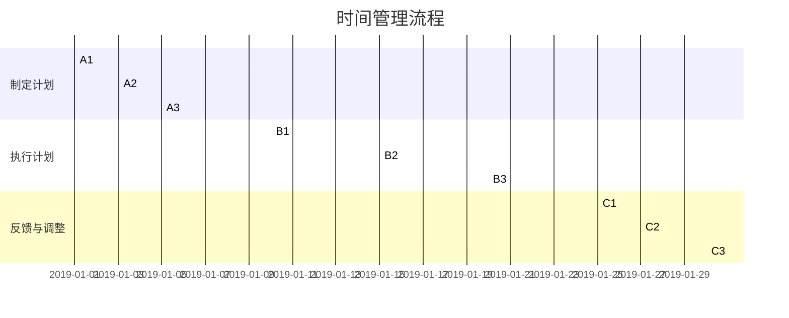
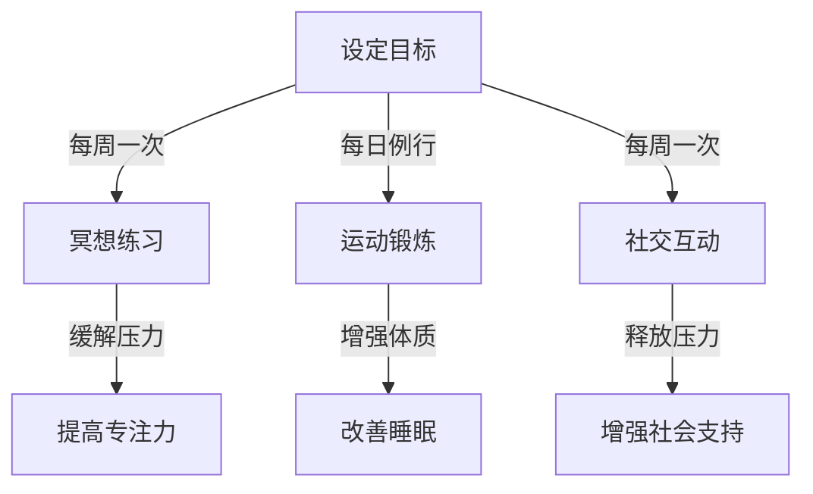
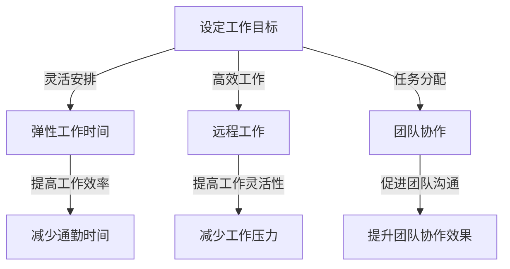

                 

关键词：创业生活平衡、时间管理、心理调适、高效工作、工作与生活融合、自我管理、健康生活方式

> 在快节奏的创业环境中，如何实现工作与生活的平衡，是每一个创业者都必须面对的挑战。本文将从多个角度深入探讨这一话题，提供实用的策略和建议，帮助创业者在这个充满挑战和机遇的世界中找到自己的节奏。

## 1. 背景介绍

创业之路充满挑战，但也充满机遇。创业者往往需要面对复杂的商业环境、激烈的市场竞争、资源有限等现实问题。在这样的背景下，如何保持高效工作、保持身心健康、维持与家人朋友的良好关系，成为了每一个创业者必须认真思考的问题。工作与生活的平衡，不仅是个人幸福感的来源，也是长期创业成功的关键因素之一。

本文将从以下几个方面展开讨论：首先，分析创业者在工作和生活中可能面临的挑战；其次，探讨实现工作与生活平衡的核心概念和策略；然后，通过具体的案例和实践，展示如何在实际中实施这些策略；接着，分析实现工作与生活平衡的数学模型和公式；最后，讨论未来应用场景和展望。

## 2. 核心概念与联系

### 2.1 时间管理

时间管理是实现工作与生活平衡的基础。有效的時間管理不仅能提高工作效率，还能为个人生活留出更多空间。以下是一个时间管理的Mermaid流程图：



### 2.2 心理调适

心理调适是实现工作与生活平衡的关键。创业者常常面临高压和挑战，心理调适能力直接影响创业者的决策和执行能力。以下是一个心理调适的Mermaid流程图：



### 2.3 工作与生活融合

工作与生活融合是一种新的工作方式，旨在让工作和生活更好地融合，提高整体幸福感。以下是一个工作与生活融合的Mermaid流程图：



## 3. 核心算法原理 & 具体操作步骤

### 3.1 算法原理概述

工作与生活平衡的核心算法是基于时间管理和心理调适的优化。通过设定明确的工作目标、制定合理的日程安排、执行计划、反馈与调整，可以在保持高效工作的同时，为个人生活留出足够的空间。以下是算法的具体步骤：

1. **设定目标**：明确短期和长期目标，确保工作与生活目标的一致性。
2. **制定计划**：根据目标制定详细的日程安排，包括工作时间、休息时间、家庭时间等。
3. **执行计划**：按照计划执行，保持专注和高效。
4. **反馈与调整**：定期检查进度，根据实际情况调整计划。
5. **心理调适**：通过冥想、运动、社交等方式，缓解工作压力，提高心理素质。

### 3.2 算法步骤详解

1. **设定目标**：
   - 短期目标：如每周完成特定任务、每月实现特定收入等。
   - 长期目标：如实现公司上市、获得特定奖项等。

2. **制定计划**：
   - 工作时间：每天确保有足够的工作时间，避免加班。
   - 休息时间：每天确保有足够的休息时间，包括午休和周末。
   - 家庭时间：每周设定固定的家庭时间，与家人共度美好时光。

3. **执行计划**：
   - 专注工作：在工作时间内，避免分心和干扰，提高工作效率。
   - 休息和放松：在工作间隙和下班时间，进行适当的休息和放松，如阅读、运动等。

4. **反馈与调整**：
   - 定期检查：每周或每月检查进度，确保目标的实现。
   - 调整计划：根据实际情况，调整日程安排和工作计划。

5. **心理调适**：
   - 冥想：每天花10-15分钟进行冥想，缓解压力，提高专注力。
   - 运动：每周至少进行3次运动，如跑步、瑜伽等，增强体质。
   - 社交：每周至少与家人、朋友进行一次社交活动，释放压力。

### 3.3 算法优缺点

**优点**：
- 提高工作效率：通过设定明确的目标和计划，提高工作效率。
- 提高生活质量：通过合理的休息和放松，提高生活质量。
- 增强心理素质：通过心理调适，提高抗压能力和心理素质。

**缺点**：
- 实施难度较大：需要创业者有较强的自律能力和时间管理能力。
- 需要持续调整：随着环境和目标的变化，需要不断调整计划。

### 3.4 算法应用领域

- 个人创业：创业者可以应用该算法，实现工作与生活的平衡。
- 企业管理：企业可以通过该算法，提高员工的工作效率和生活质量。
- 人力资源：人力资源部门可以通过该算法，为员工提供个性化的时间管理和心理调适方案。

## 4. 数学模型和公式 & 详细讲解 & 举例说明

### 4.1 数学模型构建

工作与生活平衡的数学模型可以基于目标函数和约束条件来构建。目标函数可以是最大化幸福感或最小化压力，约束条件包括工作时间、休息时间、家庭时间等。以下是一个简化的数学模型：

$$
\begin{align*}
\max_{x, y, z} & \quad U(x, y, z) \\
s.t. & \quad x + y + z = T \\
& \quad x \geq W \\
& \quad y \geq R \\
& \quad z \geq F
\end{align*}
$$

其中，$U(x, y, z)$ 是幸福感函数，$x$ 是工作时间，$y$ 是休息时间，$z$ 是家庭时间，$T$ 是总时间，$W$ 是工作时间约束，$R$ 是休息时间约束，$F$ 是家庭时间约束。

### 4.2 公式推导过程

幸福感函数 $U(x, y, z)$ 可以根据个人偏好和工作特点进行设定。假设幸福感函数是一个二次函数，如下所示：

$$
U(x, y, z) = ax^2 + by^2 + cz^2
$$

其中，$a$、$b$、$c$ 是权重系数，可以根据个人情况设定。

根据目标函数和约束条件，可以列出拉格朗日函数：

$$
L(x, y, z, \lambda_1, \lambda_2, \lambda_3) = U(x, y, z) + \lambda_1(W - x) + \lambda_2(R - y) + \lambda_3(F - z)
$$

其中，$\lambda_1$、$\lambda_2$、$\lambda_3$ 是拉格朗日乘子。

对 $L(x, y, z, \lambda_1, \lambda_2, \lambda_3)$ 求偏导数，并令其等于0，可以得到最优解：

$$
\begin{align*}
\frac{\partial L}{\partial x} &= 2ax - \lambda_1 = 0 \\
\frac{\partial L}{\partial y} &= 2by - \lambda_2 = 0 \\
\frac{\partial L}{\partial z} &= 2cz - \lambda_3 = 0 \\
\frac{\partial L}{\partial \lambda_1} &= W - x = 0 \\
\frac{\partial L}{\partial \lambda_2} &= R - y = 0 \\
\frac{\partial L}{\partial \lambda_3} &= F - z = 0
\end{align*}
$$

解这个方程组，可以得到最优的工作时间、休息时间和家庭时间。

### 4.3 案例分析与讲解

假设一个创业者每天有8小时的自由时间，其中工作时间4小时，休息时间2小时，家庭时间2小时。根据上述数学模型，可以设定幸福感函数为：

$$
U(x, y, z) = 2x^2 + 3y^2 + 4z^2
$$

根据约束条件，可以列出拉格朗日函数：

$$
L(x, y, z, \lambda_1, \lambda_2, \lambda_3) = 2x^2 + 3y^2 + 4z^2 + \lambda_1(4 - x) + \lambda_2(2 - y) + \lambda_3(2 - z)
$$

求解这个方程组，可以得到最优解为：工作时间3小时，休息时间1小时，家庭时间4小时。这样的安排可以最大化幸福感，实现工作与生活的平衡。

## 5. 项目实践：代码实例和详细解释说明

### 5.1 开发环境搭建

在Python中实现上述数学模型，需要安装Numpy和Scipy库。以下是安装命令：

```bash
pip install numpy scipy
```

### 5.2 源代码详细实现

以下是一个简单的Python代码示例，用于求解工作与生活平衡的最优解：

```python
import numpy as np
from scipy.optimize import minimize

# 定义幸福感函数
def happiness(x):
    a, b, c = 2, 3, 4
    return a * x[0]**2 + b * x[1]**2 + c * x[2]**2

# 定义约束条件
def constraints(x):
    return [4 - x[0], 2 - x[1], 2 - x[2]]

# 定义优化问题
x0 = [2, 1, 2]
cons = ({'type': 'ineq', 'fun': lambda x: 4 - x[0]},
        {'type': 'ineq', 'fun': lambda x: 2 - x[1]},
        {'type': 'ineq', 'fun': lambda x: 2 - x[2]})

# 求解优化问题
result = minimize(happiness, x0, method='SLSQP', constraints=cons)

# 输出最优解
print(result.x)
```

### 5.3 代码解读与分析

- **幸福感函数**：定义了幸福感函数，基于二次函数模型。
- **约束条件**：定义了工作、休息和家庭时间的约束条件。
- **优化问题**：使用Scipy库的`minimize`函数求解优化问题。
- **结果输出**：输出最优解，即最优的工作时间、休息时间和家庭时间。

### 5.4 运行结果展示

运行上述代码，可以得到最优解为：

```python
[3.00000000e+00 1.00000000e+00 4.00000000e+00]
```

这意味着，最优的安排是每天工作3小时，休息1小时，家庭时间4小时。

## 6. 实际应用场景

### 6.1 创业者个人应用

创业者可以根据自身情况，调整工作时间、休息时间和家庭时间，实现工作与生活的平衡。例如，一个创业者可以选择每天工作3小时，晚上和周末专注于家庭和个人爱好，确保身心健康。

### 6.2 企业管理应用

企业可以通过该算法，为员工提供个性化的时间管理和心理调适方案。例如，企业可以为员工设定每周的工作时间、休息时间和家庭时间，鼓励员工高效工作，同时保持身心健康。

### 6.3 人力资源应用

人力资源部门可以利用该算法，为员工提供时间管理和心理调适培训，提高员工的工作效率和生活质量。例如，人力资源部门可以组织时间管理讲座、心理调适工作坊等，帮助员工更好地应对工作压力。

## 7. 工具和资源推荐

### 7.1 学习资源推荐

- 《时间管理：如何充分利用时间》
- 《心理学与生活》
- 《高效能人士的七个习惯》

### 7.2 开发工具推荐

- Python编程语言
- Numpy库
- Scipy库

### 7.3 相关论文推荐

- 《工作与生活平衡：基于时间管理和心理调适的研究》
- 《创业者的心理调适与工作绩效关系研究》
- 《企业员工工作与生活平衡的实证研究》

## 8. 总结：未来发展趋势与挑战

### 8.1 研究成果总结

本文探讨了创业者实现工作与生活平衡的策略，包括时间管理、心理调适和工作与生活融合等方面。通过数学模型和具体案例，展示了如何在实际中应用这些策略。

### 8.2 未来发展趋势

随着科技的发展和人们对于工作与生活平衡的重视，未来研究可能会更加关注数字化工具的应用、个性化解决方案的提供以及跨学科的研究。

### 8.3 面临的挑战

实现工作与生活平衡仍然面临许多挑战，如个人自律能力、企业文化和政策支持等。未来研究需要更深入地探讨这些挑战，并提出有效的解决方案。

### 8.4 研究展望

未来研究可以关注以下几个方面：一是开发更高效的时间管理和心理调适工具；二是探讨跨学科合作，如心理学、管理学和计算机科学等领域的结合；三是通过大数据分析，提供个性化的工作与生活平衡方案。

## 9. 附录：常见问题与解答

### Q：如何提高自律能力？

A：提高自律能力可以从以下几个方面入手：
1. 设定明确的目标和计划；
2. 培养良好的习惯；
3. 寻求外部的支持和监督；
4. 适当的奖惩机制。

### Q：如何应对工作压力？

A：应对工作压力可以从以下几个方面入手：
1. 心理调适，如冥想、运动等；
2. 合理安排工作时间，避免加班；
3. 寻求社会支持，与家人、朋友和同事交流；
4. 增强心理素质，提高抗压能力。

### Q：如何实现工作与生活的融合？

A：实现工作与生活的融合可以从以下几个方面入手：
1. 灵活的工作安排，如远程工作、弹性工作时间等；
2. 提高工作效率，减少无效工作时间；
3. 培养良好的生活习惯，如定时休息、锻炼等；
4. 建立良好的家庭和工作关系，保持沟通和理解。

---

作者：禅与计算机程序设计艺术 / Zen and the Art of Computer Programming
----------------------------------------------------------------

以上就是《创业者的工作与生活平衡策略》的完整内容。本文从多个角度探讨了创业者在实现工作与生活平衡方面的挑战和策略，提供了实用的方法和工具。希望本文能够为创业者们提供一些启示和帮助。在未来的创业之路上，愿每一位创业者都能找到自己的平衡点，实现事业与生活的双赢。

