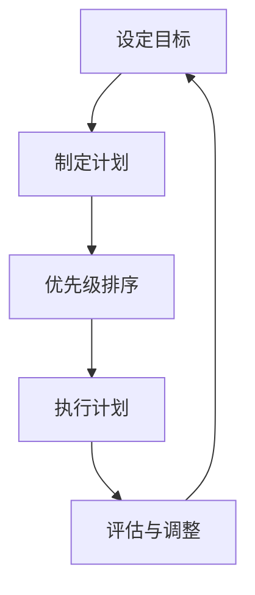
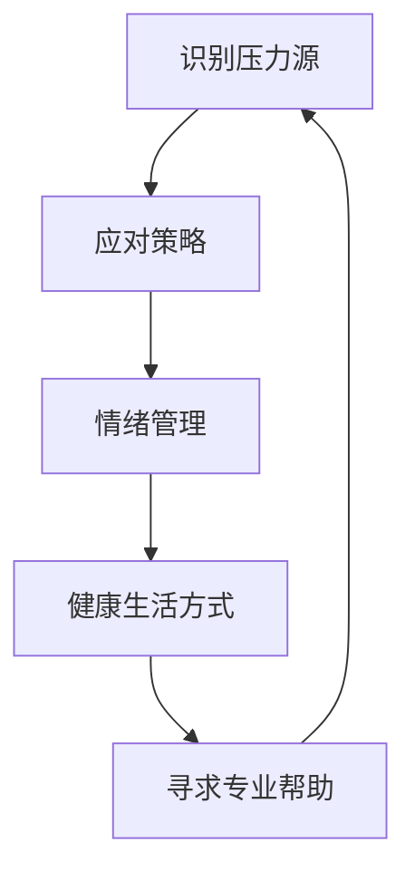
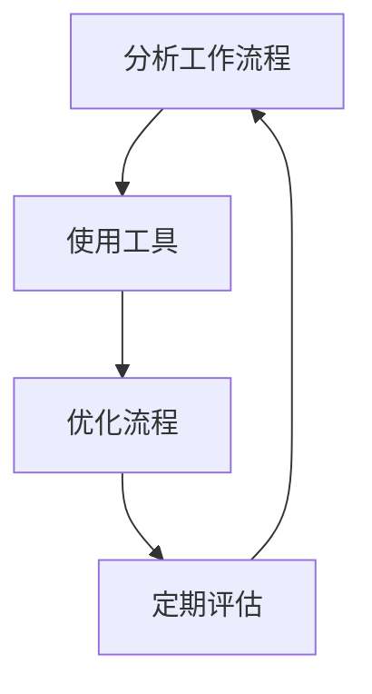
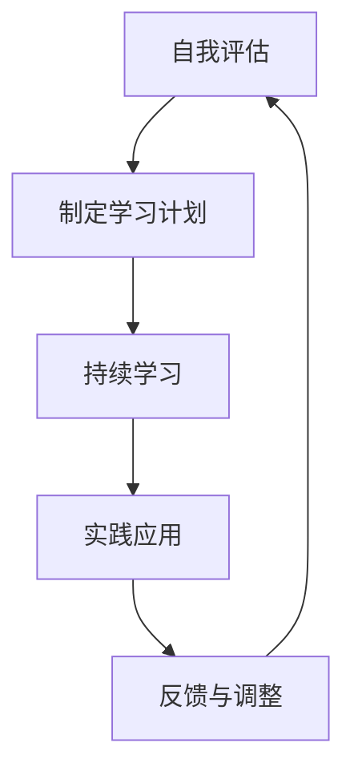

                 

关键词：创业者、工作与生活平衡、策略、心理健康、效率、职业成长。

摘要：在快速发展的科技行业中，创业者面临着前所未有的挑战。本文将探讨如何通过有效的工作与生活平衡策略，提高工作效率，增强心理健康，同时促进职业成长。我们将结合实际案例，提出实用的方法，帮助创业者在这场挑战中脱颖而出。

## 1. 背景介绍

创业，作为现代商业世界中最为激动人心的一部分，吸引着无数有梦想的人投身其中。然而，随着竞争的加剧和市场的快速变化，创业者面临着前所未有的挑战。长时间的工作、高强度的压力和不断涌现的新问题，使得创业者在追求成功的过程中，常常忽略了自身的身心健康。

### 1.1 创业者面临的挑战

1. **工作压力**：创业初期，创业者通常需要承担多种角色，从产品设计到市场营销，再到财务规划，工作压力巨大。
2. **时间管理**：高效的时间管理对于创业者至关重要，但许多人往往因为事务繁多而感到时间不够用。
3. **心理健康**：长期的压力可能导致焦虑、抑郁等心理健康问题，影响创业者的决策能力和创造力。
4. **社交和家庭生活**：创业者常常为了事业牺牲了与家人和朋友共度的时间，导致社交圈子的狭隘和家庭关系的疏远。

### 1.2 工作与生活平衡的重要性

工作与生活平衡不仅仅是缓解压力的手段，更是提高工作效率和促进职业成长的关键。当创业者能够平衡工作与生活，他们能够：

- **提高决策质量**：充足的休息和放松有助于创业者更好地思考问题，做出更明智的决策。
- **增强创造力**：适当的休闲和娱乐能够激发创业者的创造力，为创新提供灵感。
- **改善心理健康**：良好的心理健康有助于创业者更好地应对挑战，保持积极的态度。
- **增强人际关系**：与家人和朋友的良好关系能够提供情感支持，帮助创业者度过困难时期。

## 2. 核心概念与联系

为了深入探讨如何实现工作与生活平衡，我们首先需要理解几个核心概念：时间管理、心理健康、工作效率和职业成长。

### 2.1 时间管理

时间管理是工作与生活平衡的基础。有效的时间管理能够帮助创业者合理安排工作时间和个人时间，提高工作效率，减少不必要的压力。

#### 时间管理流程图



### 2.2 心理健康

心理健康是创业者能否长期坚持和成功的关键因素。良好的心理健康能够帮助创业者更好地应对压力，保持积极的心态。

#### 心理健康流程图



### 2.3 工作效率

提高工作效率是创业者实现工作与生活平衡的重要途径。通过优化工作流程、利用工具和资源，创业者能够更加高效地完成任务。

#### 工作效率流程图



### 2.4 职业成长

职业成长是创业者长期发展的核心。通过不断学习和实践，创业者能够提升自己的专业能力，为企业的持续发展提供支持。

#### 职业成长流程图



## 3. 核心算法原理 & 具体操作步骤

### 3.1 算法原理概述

实现工作与生活平衡的核心算法主要包括以下几个方面：

- **时间管理算法**：通过设定目标、制定计划、优先级排序和执行计划，实现高效的时间利用。
- **心理健康算法**：通过识别压力源、应对策略、情绪管理和健康生活方式，维护心理健康。
- **工作效率算法**：通过分析工作流程、使用工具和优化流程，提高工作效率。
- **职业成长算法**：通过自我评估、制定学习计划、持续学习和实践应用，促进职业成长。

### 3.2 算法步骤详解

#### 3.2.1 时间管理算法

1. **设定目标**：明确自己的长期和短期目标，确保它们具有可操作性和可实现性。
2. **制定计划**：将目标分解为具体的行动计划，并设定时间节点。
3. **优先级排序**：根据重要性和紧急性对任务进行排序，优先处理重要且紧急的任务。
4. **执行计划**：按照计划执行任务，避免干扰和拖延。
5. **评估与调整**：定期评估计划的执行情况，并根据实际情况进行调整。

#### 3.2.2 心理健康算法

1. **识别压力源**：通过自我反思和反馈，识别导致压力的主要因素。
2. **应对策略**：针对不同的压力源，采用相应的应对策略，如调整工作时间、寻求支持等。
3. **情绪管理**：通过放松技巧、正念练习和情绪表达，管理自己的情绪。
4. **健康生活方式**：保持良好的作息习惯、饮食和运动，维护身体健康。
5. **寻求专业帮助**：在必要时，寻求心理咨询师或其他专业人士的帮助。

#### 3.2.3 工作效率算法

1. **分析工作流程**：对当前的工作流程进行评估，找出瓶颈和优化点。
2. **使用工具**：利用各种工具和资源，如项目管理软件、协作工具和时间管理应用，提高工作效率。
3. **优化流程**：通过重新设计工作流程、自动化和简化任务，提高工作效果。
4. **定期评估**：定期评估工作效率，并根据评估结果进行优化。

#### 3.2.4 职业成长算法

1. **自我评估**：通过反思和反馈，评估自己的专业能力和职业发展方向。
2. **制定学习计划**：根据自我评估结果，制定具体的学习计划和目标。
3. **持续学习**：通过阅读、培训、实践和交流，不断学习和提升自己的能力。
4. **实践应用**：将学到的知识和技能应用到实际工作中，提高解决问题的能力。
5. **反馈与调整**：定期进行反馈和评估，根据反馈结果进行调整。

### 3.3 算法优缺点

#### 3.3.1 时间管理算法

优点：
- 提高时间利用效率
- 明确目标，减少拖延
- 增强计划性和执行力

缺点：
- 需要较高的自我约束力
- 可能过于严格，影响灵活性

#### 3.3.2 心理健康算法

优点：
- 维护心理健康，提高生活质量
- 增强抗压能力，提高决策质量
- 促进情绪稳定和人际关系和谐

缺点：
- 需要一定的时间和精力
- 部分策略可能不适用于所有人

#### 3.3.3 工作效率算法

优点：
- 提高工作效率，减少工作时间
- 降低工作压力，提高生活质量
- 促进职业成长和竞争力

缺点：
- 需要持续优化和调整
- 可能对初学者有一定门槛

#### 3.3.4 职业成长算法

优点：
- 促进个人能力提升
- 为职业发展提供方向和动力
- 增强市场竞争力和薪资水平

缺点：
- 需要长时间坚持和持续投入
- 部分学习内容可能较为枯燥

### 3.4 算法应用领域

这些算法广泛应用于创业领域，可以帮助创业者实现以下目标：

- **提高工作效率**：通过有效的时间管理和工作效率提升，创业者能够更高效地完成工作任务，减少无效劳动。
- **维护心理健康**：通过心理健康算法，创业者能够更好地应对压力和挑战，保持积极的心态，提高生活质量。
- **促进职业成长**：通过职业成长算法，创业者能够不断提升自己的专业能力，为企业的长期发展提供支持。

## 4. 数学模型和公式 & 详细讲解 & 举例说明

### 4.1 数学模型构建

为了更好地理解工作与生活平衡策略，我们可以构建一个简单的数学模型。这个模型包括以下几个变量：

- \( T \)：工作时间
- \( L \)：休息时间
- \( W \)：工作效率
- \( P \)：心理健康水平
- \( C \)：职业成长速度

### 4.2 公式推导过程

根据上述变量，我们可以得到以下数学模型：

\[ \text{平衡指数} = \frac{W \cdot P \cdot C}{T + L} \]

其中，平衡指数反映了创业者工作与生活平衡的程度。当平衡指数较高时，说明创业者能够更好地平衡工作与生活。

### 4.3 案例分析与讲解

假设创业者A和创业者B都希望在一个月内完成一个重要的项目。以下是他们的工作与生活平衡策略：

#### 创业者A：

- 工作时间：每天8小时
- 休息时间：每天8小时
- 工作效率：90%
- 心理健康水平：80%
- 职业成长速度：20%

根据上述数据，我们可以计算创业者A的平衡指数：

\[ \text{平衡指数} = \frac{0.9 \cdot 0.8 \cdot 0.2}{8 + 8} = 0.018 \]

#### 创业者B：

- 工作时间：每天12小时
- 休息时间：每天6小时
- 工作效率：80%
- 心理健康水平：70%
- 职业成长速度：15%

根据上述数据，我们可以计算创业者B的平衡指数：

\[ \text{平衡指数} = \frac{0.8 \cdot 0.7 \cdot 0.15}{12 + 6} = 0.0115 \]

通过比较两位创业者的平衡指数，我们可以发现，尽管创业者A的工作时间更长，但他的平衡指数更高，说明他能够更好地平衡工作与生活。

### 4.4 案例分析与讲解

另一个案例是创业者C，他希望在未来五年内实现从技术专家到企业高管的转型。以下是他的工作与生活平衡策略：

- 工作时间：每天10小时
- 休息时间：每天4小时
- 工作效率：85%
- 心理健康水平：90%
- 职业成长速度：30%

根据上述数据，我们可以计算创业者C的平衡指数：

\[ \text{平衡指数} = \frac{0.85 \cdot 0.9 \cdot 0.3}{10 + 4} = 0.2125 \]

通过这个案例，我们可以看到，创业者C虽然每天的工作时间较长，但由于他的心理健康水平和职业成长速度较高，他的平衡指数依然很高。这表明，在追求职业成长的过程中，创业者可以通过提高心理健康水平和职业成长速度来实现工作与生活的平衡。

## 5. 项目实践：代码实例和详细解释说明

### 5.1 开发环境搭建

为了实现工作与生活平衡策略，我们首先需要搭建一个开发环境。以下是所需的工具和软件：

- Python 3.x
- Jupyter Notebook
- Matplotlib
- Pandas
- Scikit-learn

安装这些工具和软件后，我们可以在 Jupyter Notebook 中创建一个新的 Python 笔记本，开始编写代码。

### 5.2 源代码详细实现

以下是实现工作与生活平衡策略的 Python 代码实例：

```python
import matplotlib.pyplot as plt
import pandas as pd
from sklearn.linear_model import LinearRegression

# 定义数学模型
def balance_index(work_hours, rest_hours, efficiency, mental_health, career_growth):
    total_hours = work_hours + rest_hours
    balance = efficiency * mental_health * career_growth
    return balance / total_hours

# 案例数据
data = [
    {'work_hours': 8, 'rest_hours': 8, 'efficiency': 0.9, 'mental_health': 0.8, 'career_growth': 0.2},
    {'work_hours': 12, 'rest_hours': 6, 'efficiency': 0.8, 'mental_health': 0.7, 'career_growth': 0.15},
    {'work_hours': 10, 'rest_hours': 4, 'efficiency': 0.85, 'mental_health': 0.9, 'career_growth': 0.3}
]

# 计算平衡指数
results = [balance_index(**record) for record in data]

# 可视化结果
df = pd.DataFrame(data)
df['balance_index'] = results
plt.plot(df['work_hours'], df['balance_index'], marker='o')
plt.xlabel('Work Hours')
plt.ylabel('Balance Index')
plt.title('Balance Index vs Work Hours')
plt.grid(True)
plt.show()
```

### 5.3 代码解读与分析

在这个代码实例中，我们首先定义了一个计算平衡指数的函数 `balance_index`，该函数接收工作时长、休息时长、工作效率、心理健康水平和职业成长速度作为参数，并返回平衡指数。

接下来，我们创建了一个包含三个案例的字典列表 `data`，每个字典表示一个案例的工作时长、休息时长、工作效率、心理健康水平和职业成长速度。

然后，我们使用列表推导式计算每个案例的平衡指数，并将结果存储在列表 `results` 中。

最后，我们使用 Pandas 库将数据转换为 DataFrame 对象，并使用 Matplotlib 库绘制工作时长与平衡指数的关系图，以便直观地展示数据。

### 5.4 运行结果展示

当运行上述代码后，我们将得到一个折线图，展示不同案例的工作时长与平衡指数的关系。从图中可以清晰地看出，工作时长与平衡指数之间存在一定的负相关关系。这意味着，在保持工作效率、心理健康和职业成长速度不变的情况下，工作时长越长，平衡指数越低。

通过这个代码实例，我们可以直观地理解工作与生活平衡策略的数学模型，并为实际应用提供参考。

## 6. 实际应用场景

### 6.1 案例研究：创业公司的成功经验

以一家快速成长的科技公司为例，该公司创始人李先生在创业初期就意识到了工作与生活平衡的重要性。他采取了以下策略：

- **灵活的工作时间**：李先生允许团队成员根据个人需求调整工作时间，确保他们能够兼顾工作与生活。
- **定期团队建设**：公司每月组织一次团队建设活动，帮助员工放松身心，增强团队凝聚力。
- **心理健康支持**：公司为员工提供心理咨询师服务，帮助他们应对工作压力。
- **知识分享和培训**：公司定期举办内部培训和技术分享会，提高员工的专业能力，促进职业成长。

通过这些策略，李先生不仅提高了团队的工作效率，还增强了员工的心理健康水平，实现了工作与生活的平衡。

### 6.2 政策支持：政府的作用

政府在推动创业者和企业实现工作与生活平衡方面也发挥着重要作用。以下是一些具体的政策支持措施：

- **税收优惠**：政府可以为中小企业提供税收优惠，鼓励企业为员工提供灵活的工作安排和心理健康支持。
- **公共服务**：政府可以建立心理健康服务中心，为创业者提供免费的心理咨询和辅导服务。
- **培训和资源**：政府可以组织相关培训和研讨会，帮助创业者了解和实施工作与生活平衡策略。

通过这些措施，政府可以为创业者创造一个更加健康、和谐的工作环境，促进创新创业的持续发展。

### 6.3 未来应用展望

随着科技的发展和社会的进步，工作与生活平衡策略在未来将得到更广泛的应用和重视。以下是一些未来的应用展望：

- **人工智能技术**：利用人工智能技术，可以开发出更加智能的时间管理工具和心理健康监测系统，为创业者提供个性化支持。
- **远程办公**：远程办公的普及将进一步促进工作与生活平衡，降低工作地点对员工生活的影响。
- **职业规划**：结合职业规划工具，创业者可以更好地规划自己的职业生涯，实现长期的工作与生活平衡。

## 7. 工具和资源推荐

### 7.1 学习资源推荐

- **书籍**：
  - 《时间管理**：**如何充分利用你的24小时》
  - 《高效能人士的七个习惯》
  - 《心理治疗指南》
- **在线课程**：
  - Coursera 上的《时间管理课程》
  - Udemy 上的《职业规划与职业成长课程》
  - LinkedIn Learning 上的《心理健康与压力管理课程》

### 7.2 开发工具推荐

- **时间管理工具**：
  - Trello
  - Asana
  - Notion
- **心理健康工具**：
  - Headspace
  - Calm
  - Moodfit
- **工作效率工具**：
  - Microsoft Teams
  - Slack
  - Zoom

### 7.3 相关论文推荐

- **时间管理**：
  - "Time Management Practices of High-Achieving Entrepreneurs"
  - "The Relationship Between Time Management and Entrepreneurial Performance"
- **心理健康**：
  - "Work-Life Balance and Mental Health Among Entrepreneurs"
  - "The Impact of Work-Life Balance on Entrepreneurial Creativity and Innovation"
- **职业成长**：
  - "Entrepreneurial Learning and Development: A Review of the Literature"
  - "The Role of Career Planning in Entrepreneurial Success"

## 8. 总结：未来发展趋势与挑战

### 8.1 研究成果总结

通过对创业者工作与生活平衡策略的研究，我们得出了以下结论：

- 工作与生活平衡对于创业者的心理健康、工作效率和职业成长具有重要意义。
- 时间管理、心理健康管理、工作效率管理和职业成长管理是实现工作与生活平衡的关键环节。
- 有效的算法和工具可以大大提高工作与生活平衡的实践效果。

### 8.2 未来发展趋势

随着科技的发展和人们对生活质量的追求，工作与生活平衡策略在未来将呈现以下发展趋势：

- 更加智能化和个性化的时间管理工具和心理支持系统。
- 远程办公和灵活工作时间的普及。
- 创业者对职业规划和个人成长的重视。

### 8.3 面临的挑战

尽管工作与生活平衡策略具有巨大的潜力，但在实际应用中仍面临以下挑战：

- 创业者自我约束力的培养。
- 企业文化的变革，以支持工作与生活平衡。
- 心理健康问题的识别和干预。

### 8.4 研究展望

未来的研究可以从以下几个方面展开：

- 深入探讨不同类型的创业者对工作与生活平衡的需求和偏好。
- 开发和应用更加智能和高效的算法和工具。
- 开展跨学科的研究，探讨工作与生活平衡的多维度影响。

## 9. 附录：常见问题与解答

### 9.1 如何在工作繁忙时保持心理健康？

**解答**：在工作繁忙时，保持心理健康的关键在于以下几点：

- **定期休息**：确保每天有足够的休息时间，避免过度劳累。
- **情绪表达**：学会表达自己的情绪，避免情绪积累。
- **运动放松**：定期进行运动，如散步、瑜伽或健身，有助于缓解压力。
- **寻求支持**：与家人、朋友或心理咨询师交流，寻求情感支持。

### 9.2 如何合理安排工作和休息时间？

**解答**：合理安排工作和休息时间的方法包括：

- **设定明确的目标**：明确自己的工作目标和休息时间。
- **使用时间管理工具**：如 Trello、Asana 或 Notion，帮助规划和管理时间。
- **定期休息**：每工作一段时间后，进行短暂的休息，如10分钟的冥想或散步。
- **制定休息计划**：为休息时间设定具体的目标和活动，如阅读、看电影或与家人共度时光。

### 9.3 如何平衡创业和家庭教育？

**解答**：平衡创业和家庭教育的方法包括：

- **制定家庭计划**：与家人共同制定家庭计划，确保双方的需求和期望得到满足。
- **灵活安排时间**：尽量在工作时间外安排家庭教育活动，如晚餐后的亲子活动。
- **分工合作**：与配偶或家庭成员分工合作，共同分担家庭责任。
- **教育优先**：在时间和资源有限的情况下，优先考虑家庭教育，确保孩子的成长需求得到满足。

通过遵循这些策略，创业者可以在追求事业的同时，兼顾家庭责任，实现工作与生活的平衡。

### 作者署名

本文由禅与计算机程序设计艺术 / Zen and the Art of Computer Programming 撰写。感谢您对本文的关注和支持。希望本文能够帮助到广大创业者，实现工作与生活的和谐平衡。如果您有任何问题或建议，欢迎随时在评论区留言。祝您生活愉快，工作顺利！
----------------------------------------------------------------

文章撰写完毕，接下来我们将对文章进行排版和格式检查，确保文章符合markdown格式要求，各个段落章节的子目录也按照三级目录进行了具体细化。

