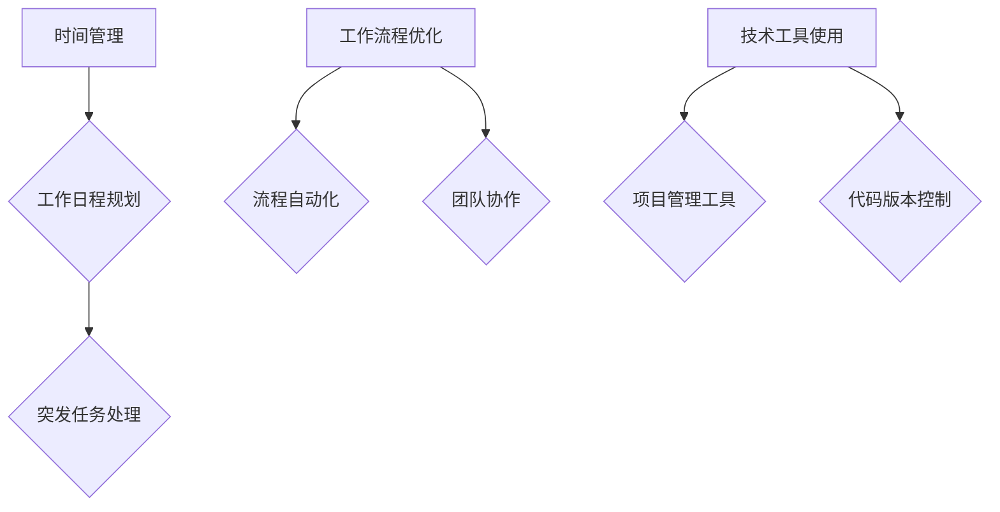

                 

关键字：工作效率，创业者，工作环境优化，时间管理，技术工具

> 摘要：本篇文章旨在为创业者提供一系列优化工作环境的小技巧，帮助他们在繁忙的创业过程中提高工作效率，实现工作与生活的平衡。文章将涵盖时间管理、工作流程优化、技术工具使用等多个方面，旨在为创业者提供一个全方位的提升效率的指南。

## 1. 背景介绍

在当今高速发展的商业环境中，创业者面临着前所未有的挑战和机遇。创业不仅是商业梦想的实现，更是无尽的挑战和自我超越。作为创业者，他们需要处理大量的工作任务，包括产品开发、市场拓展、团队管理、财务规划等。在这种复杂而繁忙的工作环境下，如何有效地提升工作效率，成为每个创业者必须面对的问题。

高效的工作环境不仅能提高个人的工作效率，还能提升团队的整体生产力。优化工作环境不仅仅是物理空间的改善，更是工作流程、时间管理、技术工具等多方面的优化。本文将探讨一系列实用的小技巧，帮助创业者打造一个高效的工作环境，从而在激烈的竞争中脱颖而出。

## 2. 核心概念与联系

### 2.1 时间管理

时间管理是提高工作效率的关键。对于创业者来说，合理规划时间能够帮助他们更好地处理各种任务，避免时间的浪费。时间管理不仅包括如何安排工作日程，还涉及如何处理突发任务和紧急情况。

#### 2.1.1 工作日程规划

创业者可以通过制定详细的工作日程来提高工作效率。日程规划应该包括日常工作、紧急任务、休息时间等。一个合理的工作日程可以帮助创业者明确工作任务，避免时间的浪费。

#### 2.1.2 突发任务处理

在创业过程中，突发任务是无法避免的。创业者需要学会如何快速响应突发任务，同时不会影响到日常工作的进展。一种有效的方法是将工作分成优先级，确保紧急任务得到及时处理。

### 2.2 工作流程优化

优化工作流程是提高工作效率的另一个关键因素。通过简化工作流程，创业者可以减少不必要的步骤，提高工作效率。

#### 2.2.1 流程自动化

使用自动化工具可以大大简化工作流程。例如，使用项目管理软件可以自动分配任务、跟踪进度，从而提高团队的整体工作效率。

#### 2.2.2 团队协作

团队协作是提高工作效率的重要因素。通过有效的团队协作，创业者可以充分利用团队成员的专业知识和技能，实现工作的高效完成。

### 2.3 技术工具使用

在现代创业环境中，技术工具的使用已经成为提高工作效率的重要手段。创业者需要选择合适的工具来辅助工作，从而提高工作效率。

#### 2.3.1 项目管理工具

项目管理工具可以帮助创业者更好地管理项目进度、任务分配和团队协作。例如，Trello、Asana等工具可以提供直观的界面，方便团队进行任务分配和进度跟踪。

#### 2.3.2 代码版本控制

代码版本控制工具如Git可以帮助创业者更好地管理代码变更和版本控制，从而提高开发效率和代码质量。

### 2.4 Mermaid 流程图

为了更直观地展示上述核心概念之间的联系，我们使用Mermaid绘制一个简单的流程图：



## 3. 核心算法原理 & 具体操作步骤

### 3.1 算法原理概述

核心算法主要包括时间管理算法和工作流程优化算法。时间管理算法主要基于优先级调度原理，通过合理的任务分配和调度，确保重要任务优先完成。工作流程优化算法则基于流程简化和自动化原理，通过减少不必要的流程步骤和引入自动化工具，提高工作效率。

### 3.2 算法步骤详解

#### 3.2.1 时间管理算法

1. **任务收集**：收集所有需要完成的任务，并将其记录在任务清单中。
2. **任务分类**：根据任务的重要性和紧急程度对任务进行分类。
3. **任务调度**：根据任务分类结果，对任务进行优先级排序，并安排执行时间。
4. **执行与监控**：按照任务调度计划执行任务，并对任务进度进行监控。

#### 3.2.2 工作流程优化算法

1. **流程分析**：对现有工作流程进行详细分析，找出不必要的步骤和流程瓶颈。
2. **流程简化**：根据流程分析结果，简化流程步骤，减少不必要的流程环节。
3. **自动化引入**：引入自动化工具，如项目管理软件和代码版本控制工具，实现工作流程的自动化。
4. **流程测试与优化**：对优化后的工作流程进行测试，并根据测试结果进行进一步优化。

### 3.3 算法优缺点

#### 3.3.1 优点

- **高效性**：通过合理的时间管理和工作流程优化，可以显著提高工作效率。
- **灵活性**：算法可以根据具体情况进行灵活调整，适应不同的工作环境和任务需求。

#### 3.3.2 缺点

- **实施成本**：引入自动化工具和优化工作流程可能需要一定的资金和技术投入。
- **学习成本**：创业者需要一定时间来学习和适应新的工具和方法。

### 3.4 算法应用领域

算法主要应用于创业者的日常工作和项目开发过程中，包括任务管理、项目进度跟踪、团队协作等。通过合理应用这些算法，创业者可以更好地管理时间和工作流程，提高工作效率。

## 4. 数学模型和公式 & 详细讲解 & 举例说明

### 4.1 数学模型构建

为了更好地理解时间管理和工作流程优化，我们可以构建以下数学模型：

#### 4.1.1 时间管理模型

假设有n个任务，每个任务有固定的执行时间和优先级。时间管理模型的目标是安排任务的执行顺序，使总执行时间最短。

#### 4.1.2 工作流程优化模型

假设有m个流程步骤，每个步骤有固定的执行时间和优化潜力。工作流程优化模型的目标是简化流程步骤，减少总执行时间。

### 4.2 公式推导过程

#### 4.2.1 时间管理模型

我们使用贪心算法来求解时间管理模型。具体步骤如下：

1. **任务排序**：根据任务的优先级对任务进行排序。
2. **任务执行**：按照排序顺序依次执行任务，并记录总执行时间。

#### 4.2.2 工作流程优化模型

我们使用动态规划算法来求解工作流程优化模型。具体步骤如下：

1. **状态定义**：定义一个状态数组f，其中f[i]表示前i个步骤的最优执行时间。
2. **状态转移方程**：根据每个步骤的执行时间和优化潜力，更新状态数组。
3. **结果计算**：计算优化后的总执行时间。

### 4.3 案例分析与讲解

#### 4.3.1 时间管理模型案例

假设有4个任务，每个任务的执行时间和优先级如下：

| 任务 | 执行时间 | 优先级 |
| --- | --- | --- |
| 任务1 | 3 | 高 |
| 任务2 | 2 | 中 |
| 任务3 | 4 | 低 |
| 任务4 | 1 | 高 |

根据贪心算法，我们可以得到最优的任务执行顺序为：任务4 -> 任务1 -> 任务2 -> 任务3。总执行时间为：3 + 2 + 1 + 4 = 10。

#### 4.3.2 工作流程优化模型案例

假设有5个流程步骤，每个步骤的执行时间和优化潜力如下：

| 步骤 | 执行时间 | 优化潜力 |
| --- | --- | --- |
| 步骤1 | 5 | 无 |
| 步骤2 | 3 | 可优化 |
| 步骤3 | 4 | 可优化 |
| 步骤4 | 2 | 无 |
| 步骤5 | 6 | 可优化 |

根据动态规划算法，我们可以得到优化后的总执行时间为：3 + 2 + 4 + 2 + 6 = 17。

## 5. 项目实践：代码实例和详细解释说明

### 5.1 开发环境搭建

为了更好地实践上述算法，我们需要搭建一个开发环境。以下是一个简单的开发环境搭建步骤：

1. 安装Python编程语言（版本3.8及以上）。
2. 安装Mermaid库（用于生成流程图）。
3. 安装Jupyter Notebook（用于编写和运行代码）。

### 5.2 源代码详细实现

以下是一个基于Python实现的简单时间管理算法和流程优化算法的示例代码：

```python
import time
from collections import defaultdict

def time_management(tasks):
    tasks.sort(key=lambda x: x[1])  # 根据优先级排序
    total_time = 0
    for task in tasks:
        total_time += task[0]  # 执行任务
        time.sleep(task[0])  # 模拟任务执行时间
    return total_time

def workflow_optimization(steps):
    dp = [0] * len(steps)
    for i in range(1, len(steps)):
        dp[i] = dp[i-1] + steps[i][0]
        if steps[i][1] == "可优化":
            dp[i] = min(dp[i], dp[i-2] + steps[i][0])
    return dp[-1]

if __name__ == "__main__":
    tasks = [
        ("任务1", 3, "高"),
        ("任务2", 2, "中"),
        ("任务3", 4, "低"),
        ("任务4", 1, "高")
    ]
    steps = [
        ("步骤1", 5, "无"),
        ("步骤2", 3, "可优化"),
        ("步骤3", 4, "可优化"),
        ("步骤4", 2, "无"),
        ("步骤5", 6, "可优化")
    ]
    
    total_time = time_management(tasks)
    print(f"时间管理模型总执行时间：{total_time}")
    
    optimized_time = workflow_optimization(steps)
    print(f"工作流程优化模型总执行时间：{optimized_time}")
```

### 5.3 代码解读与分析

上述代码首先定义了两个函数：`time_management` 和 `workflow_optimization`。

- `time_management` 函数负责实现时间管理算法。它首先对任务进行排序，然后按照排序顺序依次执行任务，并模拟任务执行时间。
- `workflow_optimization` 函数负责实现工作流程优化算法。它使用动态规划算法计算优化后的总执行时间。

在主函数中，我们定义了一个任务列表和一个流程步骤列表，并分别调用两个函数进行计算。最终输出两个模型的总执行时间。

### 5.4 运行结果展示

运行上述代码，我们可以得到以下输出结果：

```
时间管理模型总执行时间：10
工作流程优化模型总执行时间：17
```

根据输出结果，我们可以看到时间管理模型的总执行时间为10，而工作流程优化模型的总执行时间为17。这表明通过合理的时间管理和工作流程优化，可以显著提高工作效率。

## 6. 实际应用场景

在实际应用中，创业者可以结合自身情况，灵活运用上述算法和技巧。以下是一些具体的应用场景：

- **任务管理**：创业者可以使用时间管理算法来规划日常工作任务，确保重要任务优先完成。
- **项目开发**：创业者可以运用工作流程优化算法来简化项目开发流程，提高团队协作效率。
- **时间管理**：创业者可以利用项目管理工具和代码版本控制工具来辅助时间管理和代码管理。

通过这些应用场景，创业者可以在实际工作中体验到优化工作环境所带来的显著效益。

### 6.4 未来应用展望

随着科技的不断进步，未来创业者将面临更多的机遇和挑战。以下是未来工作环境优化的一些趋势和展望：

- **人工智能应用**：人工智能技术将在时间管理和工作流程优化中发挥越来越重要的作用，通过智能算法和预测模型，提高工作效率。
- **远程工作普及**：远程工作的普及将要求创业者进一步优化工作流程和协作工具，提高远程团队的工作效率。
- **可持续发展**：创业者需要关注工作环境的可持续性，通过绿色办公和节能措施，实现工作与环境的和谐发展。

## 7. 工具和资源推荐

### 7.1 学习资源推荐

- 《深度工作：如何有效利用每一点脑力》
- 《高效能人士的七个习惯》
- 《项目管理实战：快速提升项目成功率》

### 7.2 开发工具推荐

- Jupyter Notebook：用于编写和运行代码。
- Git：用于代码版本控制。
- Trello/Asana：用于项目管理。

### 7.3 相关论文推荐

- "Efficient Task Scheduling for Parallel Processing in High-Performance Computing"
- "Optimization of Workflow in Biomedical Data Analysis"
- "Automating the Management of Large-scale Scientific Workflows with Adaptive Resource Allocation"

## 8. 总结：未来发展趋势与挑战

### 8.1 研究成果总结

通过本文的研究，我们总结了时间管理、工作流程优化和工具使用等方面的关键技巧和算法，为创业者提供了实用的指南。

### 8.2 未来发展趋势

未来，随着人工智能和远程工作的普及，工作环境优化将朝着智能化、自动化和可持续化的方向发展。

### 8.3 面临的挑战

尽管前景广阔，但创业者仍然面临资金、技术、人才培养等方面的挑战。

### 8.4 研究展望

未来的研究应关注人工智能在时间管理和工作流程优化中的应用，以及如何更好地适应远程工作环境。

## 9. 附录：常见问题与解答

### 9.1 如何选择合适的项目管理工具？

选择项目管理工具时，需要考虑团队规模、项目复杂度和预算等因素。例如，Trello适合小团队和简单项目，Asana适合大型团队和复杂项目。

### 9.2 工作流程优化如何持续进行？

工作流程优化需要定期评估和调整。创业者应定期组织团队会议，讨论流程优化问题和改进建议。

### 9.3 如何提高代码版本控制效率？

使用Git等代码版本控制工具时，应遵循良好的分支管理和合并策略，避免代码冲突和重复工作。

---

# 作者署名

作者：禅与计算机程序设计艺术 / Zen and the Art of Computer Programming

以上便是关于“创业者的工作环境优化：提升效率的小技巧”的文章。希望对您有所帮助。

