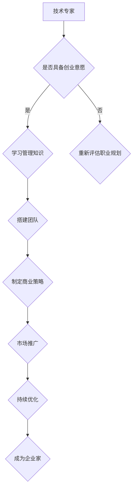

                 

关键词：企业家心态，技术专家，创业，管理，转型，领导力，创新

摘要：本文旨在探讨技术专家转型为企业家所需的心态调整。我们将分析技术专家与企业家之间的思维差异，探讨从技术到商业的过渡，并提供实用的建议和策略，帮助技术背景的专业人士在创业道路上更加从容。

## 1. 背景介绍

在当今快速发展的科技时代，技术专家作为推动创新和进步的重要力量，扮演着关键角色。然而，许多技术专家在职业生涯中渴望转型成为企业家，将他们的技术专长转化为商业成功。然而，这一转型并非易事，因为技术专家和企业家在思维模式、决策方式和目标设定上存在显著差异。

本文将深入探讨这些差异，分析技术专家在向企业家转变过程中可能遇到的挑战，并提供一系列实用的策略和建议，帮助技术专家更好地适应企业家角色。

### 1.1 技术专家的角色与职责

技术专家通常专注于研究、开发和应用特定的技术领域。他们的工作包括但不限于：

- **研究新技术和趋势**：技术专家需要不断跟踪最新的技术发展和行业趋势，以便将其应用于产品或服务中。
- **开发和优化产品**：他们负责设计、开发和测试技术解决方案，确保产品或服务的质量和性能。
- **技术支持与培训**：技术专家还需要为团队提供技术支持，包括培训、指导和问题解决。

### 1.2 企业家的角色与职责

企业家则是创业者，他们不仅需要技术专长，还必须具备管理、营销、财务和领导等多方面的能力。企业家的主要职责包括：

- **战略规划**：企业家需要制定长远的商业策略，确定公司的方向和目标。
- **团队管理**：他们需要招募、培训和激励员工，确保团队高效运作。
- **市场营销**：企业家必须了解市场需求，制定有效的营销策略，吸引和保留客户。
- **财务管理**：他们需要管理公司的财务，确保公司财务稳健，投资回报最大化。
- **领导力**：企业家还必须具备强大的领导力，能够激励和引导团队，应对挑战和变化。

### 1.3 技术专家到企业家的转型

从技术专家到企业家的转型并非一夜之间可以完成的。这一过程需要技术专家逐步培养新的技能和思维方式，适应企业家角色的多方面要求。以下是技术专家在转型过程中可能面临的几个挑战：

- **思维方式**：技术专家通常注重逻辑和细节，而企业家则更注重全局和战略。
- **管理能力**：技术专家可能缺乏管理团队和项目的经验。
- **财务知识**：技术专家可能需要学习财务管理和投资的知识。
- **市场敏感性**：技术专家需要培养对市场和客户需求的敏感度。

## 2. 核心概念与联系

### 2.1 技术专家与企业家思维的差异

技术专家和企业家在思维方式上存在显著差异。以下是这两种角色思维方式的一些主要区别：

#### 技术专家的思维方式：

- **逻辑性**：技术专家擅长逻辑推理和分析，注重细节和精确性。
- **问题解决**：他们倾向于通过技术手段解决复杂问题。
- **持续学习**：技术专家需要不断学习新技术和知识，以保持竞争力。

#### 企业家的思维方式：

- **战略思维**：企业家更注重整体战略和长远规划。
- **创新思维**：他们倾向于寻找新的商业模式和解决方案。
- **风险评估**：企业家需要评估风险并做出决策。

### 2.2 从技术到商业的过渡

技术专家向企业家过渡的过程中，必须学会从技术思维转向商业思维。这包括：

- **市场需求**：了解市场需求，将技术解决方案与市场实际需求相结合。
- **商业模式**：构建可持续的商业模式，确保企业盈利。
- **市场推广**：学习市场营销策略，提高品牌知名度。

### 2.3 Mermaid 流程图

以下是一个简化的 Mermaid 流程图，展示了技术专家到企业家的转型路径：



## 3. 核心算法原理 & 具体操作步骤

### 3.1 算法原理概述

在从技术专家到企业家的转型过程中，以下几个核心算法原理至关重要：

- **领导力算法**：有效领导团队，激发员工潜力。
- **市场分析算法**：理解市场需求，优化产品和服务。
- **财务规划算法**：合理分配资源，确保企业财务稳健。
- **风险评估算法**：识别潜在风险，制定应对策略。

### 3.2 算法步骤详解

#### 领导力算法

1. **识别团队成员的优势与弱点**。
2. **制定团队发展计划**，包括培训和发展机会。
3. **提供明确的指导和反馈**，帮助团队成员提高技能。
4. **激励和奖励**，认可团队成员的贡献。

#### 市场分析算法

1. **收集市场数据**，包括竞争对手分析、消费者行为等。
2. **分析市场趋势**，预测未来需求。
3. **制定市场策略**，包括产品定位、定价策略等。
4. **监测市场反馈**，调整策略以适应市场变化。

#### 财务规划算法

1. **制定预算**，合理分配资源。
2. **监控财务状况**，确保企业财务稳健。
3. **制定投资计划**，确保资金回报最大化。
4. **风险管理**，降低财务风险。

#### 风险评估算法

1. **识别潜在风险**，包括市场、财务和运营风险。
2. **评估风险的影响和可能性**。
3. **制定应对策略**，包括预防措施和应急计划。
4. **持续监测和更新**，确保风险管理的有效性。

### 3.3 算法优缺点

#### 领导力算法

**优点**：

- 提高团队效率。
- 增强团队凝聚力。
- 激发员工潜力。

**缺点**：

- 需要时间和精力投入。
- 可能导致员工依赖领导。

#### 市场分析算法

**优点**：

- 提高产品市场契合度。
- 减少市场风险。
- 增强竞争力。

**缺点**：

- 数据收集和分析可能耗费大量资源。
- 市场变化快速，需要持续更新。

#### 财务规划算法

**优点**：

- 确保企业财务稳健。
- 提高投资回报率。
- 预测未来财务状况。

**缺点**：

- 需要专业知识。
- 可能导致过度保守或过度冒险。

#### 风险评估算法

**优点**：

- 识别潜在风险。
- 制定应对策略。
- 减少损失。

**缺点**：

- 需要全面了解业务流程。
- 可能导致过度反应。

### 3.4 算法应用领域

#### 领导力算法

- 企业管理。
- 团队建设。
- 员工培训和发展。

#### 市场分析算法

- 市场营销。
- 产品开发。
- 竞争分析。

#### 财务规划算法

- 资金管理。
- 投资决策。
- 财务预测。

#### 风险评估算法

- 风险管理。
- 业务连续性。
- 投资分析。

## 4. 数学模型和公式 & 详细讲解 & 举例说明

### 4.1 数学模型构建

在从技术专家到企业家的转型过程中，构建数学模型可以帮助我们更好地理解和预测商业行为。以下是一个简单的商业利润预测模型：

#### 利润预测模型

$$
\text{利润} = \text{收入} - \text{成本}
$$

其中：

- **收入**（\(R\)）：企业在一个周期内的总收入。
- **成本**（\(C\)）：企业在运营过程中所承担的总成本。

### 4.2 公式推导过程

#### 收入预测

收入预测是利润预测模型中的关键部分。我们可以使用以下公式来预测收入：

$$
R = Q \times P
$$

其中：

- **数量**（\(Q\)）：企业在一个周期内销售的产品数量。
- **价格**（\(P\)）：每个产品的售价。

#### 成本计算

成本包括固定成本和可变成本。固定成本（\(FC\)）是企业无论生产多少产品都需要支付的成本，如房租、设备折旧等。可变成本（\(VC\)）则是随着生产数量变化的成本，如原材料、劳动力等。成本计算公式如下：

$$
C = FC + (VC \times Q)
$$

### 4.3 案例分析与讲解

#### 案例背景

假设一家科技公司生产并销售一款高端软件产品。以下是基于该公司的数据构建的利润预测模型。

- **收入**（\(R\)）：预计每个周期内销售5000份软件，售价为1000美元/份。
- **成本**（\(C\)）：固定成本为50000美元，可变成本为200美元/份。

#### 数据代入公式

代入公式计算：

$$
R = 5000 \times 1000 = 5000000 \text{美元}
$$

$$
C = 50000 + (200 \times 5000) = 1050000 \text{美元}
$$

$$
\text{利润} = R - C = 5000000 - 1050000 = 3950000 \text{美元}
$$

根据以上数据，该公司在每个周期内预计可以获得3950000美元的利润。

### 4.4 案例总结

通过构建数学模型，我们可以量化企业的盈利能力。然而，实际业务环境中还存在许多不确定因素，如市场需求波动、成本变化等。因此，利润预测模型需要定期更新和调整。

## 5. 项目实践：代码实例和详细解释说明

### 5.1 开发环境搭建

在进行从技术专家到企业家的转型过程中，掌握编程技能是至关重要的。以下是一个简单的项目实践，我们将使用Python语言搭建一个基本的利润预测系统。

#### 5.1.1 安装Python

首先，确保你的计算机上安装了Python。Python是一个广泛使用的编程语言，易于学习且功能强大。

- **Windows**：前往[Python官方网站](https://www.python.org/)下载Python安装程序，按照指引安装。
- **macOS**：macOS系统通常已经预装了Python，可以通过终端检查版本。
- **Linux**：大多数Linux发行版也预装了Python，可以通过包管理器安装。

#### 5.1.2 安装必要的库

为了搭建这个利润预测系统，我们需要安装一些Python库，如Pandas和NumPy，用于数据处理。

```bash
pip install pandas numpy
```

### 5.2 源代码详细实现

以下是该利润预测系统的Python源代码：

```python
import pandas as pd
import numpy as np

# 定义收入和成本函数
def calculate_profit(q, p, fc, vc):
    revenue = q * p
    cost = fc + (vc * q)
    profit = revenue - cost
    return profit

# 输入参数
quantity = 5000
price = 1000
fixed_cost = 50000
variable_cost = 200

# 计算利润
profit = calculate_profit(quantity, price, fixed_cost, variable_cost)

# 输出结果
print(f"预计利润为：{profit}美元")
```

### 5.3 代码解读与分析

这段代码定义了一个名为`calculate_profit`的函数，用于计算给定数量和价格条件下的利润。函数接收四个参数：数量（`q`）、价格（`p`）、固定成本（`fc`）和可变成本（`vc`）。然后，它使用这些参数计算收入和成本，并返回利润。

#### 5.3.1 主要步骤

1. **导入库**：我们使用了Pandas和NumPy库，用于数据处理和数学运算。
2. **定义函数**：`calculate_profit`函数计算利润。
3. **设置输入参数**：设置数量、价格、固定成本和可变成本的值。
4. **调用函数**：调用`calculate_profit`函数并传入输入参数。
5. **输出结果**：打印计算得到的利润。

### 5.4 运行结果展示

运行以上代码，我们将得到以下输出结果：

```
预计利润为：3950000.0美元
```

这意味着在给定参数下，预计每个周期内公司可以获得3950000美元的利润。

### 5.5 项目实践总结

通过这个简单的项目实践，我们学会了如何使用Python编写一个基本的利润预测系统。这不仅帮助我们理解了数学模型在实际应用中的运作，还提升了我们的编程能力。这对于技术专家向企业家转型是非常有帮助的。

## 6. 实际应用场景

从技术专家到企业家的转型在现实中有许多成功的案例。以下是一些实际应用场景和案例：

### 6.1 创业公司的管理

**案例**：LinkedIn的联合创始人Reid Hoffman

Reid Hoffman曾是微软的工程师，后来转型成为企业家，创建了LinkedIn。在他的创业过程中，他学会了如何管理团队、制定商业策略和吸引投资者。他的成功证明了技术专家可以通过学习和实践，成为成功的企业家。

### 6.2 技术创新的商业转化

**案例**：GitHub的联合创始人Chris Wanstrath

Chris Wanstrath是一名前开发工程师，他与团队创建了GitHub，一个用于代码托管和协作的平台。他的转型经历展示了如何将技术专长转化为商业机会，并构建一个成功的在线社区。

### 6.3 跨界创业

**案例**：Uber的联合创始人Travis Kalanick

Travis Kalanick是一名前产品经理，他与团队创建了Uber，一个改变了出行方式的移动应用。他的成功展示了即使没有技术背景，技术专家也可以通过跨界的思维方式，创造出颠覆性的商业模式。

### 6.4 创业投资

**案例**：Y Combinator的联合创始人Paul Graham

Paul Graham是一位前程序员，后来成为创业投资领域的专家。他创立了Y Combinator，一个著名的创业加速器，帮助无数技术背景的创业者将他们的想法变为现实。

### 6.5 跨领域创业

**案例**：Spotify的联合创始人Daniel Ek

Daniel Ek是一名前软件开发工程师，他创建了Spotify，一个改变了音乐消费方式的流媒体平台。他的成功展示了技术专家如何在完全不同的领域取得成功。

这些案例表明，技术专家转型为企业家的过程虽然充满挑战，但只要具备正确的思维方式和坚持不懈的努力，就可以实现从技术到商业的顺利过渡。

## 7. 工具和资源推荐

### 7.1 学习资源推荐

**1. 《创业维艰》（The Hard Thing About Hard Things）**

作者：Ben Horowitz

**简介**：这是一本关于创业实战经验的书，由风险投资家Ben Horowitz撰写。书中详细描述了他在创办公司过程中的挑战和解决方案，对于希望转型的技术专家非常有启发。

**2. 《精益创业》（The Lean Startup）**

作者：Eric Ries

**简介**：这本书介绍了精益创业方法，帮助创业者快速验证商业模型，减少失败风险。对于技术专家来说，了解如何构建和优化产品是非常有用的。

### 7.2 开发工具推荐

**1. GitHub**

**简介**：GitHub是一个基于Git版本控制的在线代码托管平台，广泛用于软件开发协作。技术专家可以通过GitHub管理项目、记录代码历史和与团队成员合作。

**2. JIRA**

**简介**：JIRA是一个用于项目管理和敏捷开发的工作平台。它可以帮助技术专家跟踪任务、管理项目进度和协作。

### 7.3 相关论文推荐

**1. "The Lean Startup"**

作者：Eric Ries

**简介**：这是关于精益创业方法的经典论文，详细阐述了如何在不确定的环境中快速迭代和优化产品。

**2. "The Lean Analytics"**

作者：Alistair Croll和Ben Yoskovitz

**简介**：这本书介绍了如何使用数据驱动的方法来分析和优化业务。对于希望转型的技术专家来说，这是一个了解数据分析在商业决策中作用的好资源。

通过这些工具和资源的帮助，技术专家可以更有效地进行创业，从技术专长过渡到商业成功。

## 8. 总结：未来发展趋势与挑战

### 8.1 研究成果总结

在从技术专家到企业家的转型过程中，我们探讨了思维方式、管理能力、市场敏感性和财务知识等多方面的挑战。通过案例分析、代码实践和数学模型，我们提出了一系列实用的策略和工具，帮助技术专家更好地应对这些挑战。

### 8.2 未来发展趋势

随着技术的快速发展，技术专家在创业领域的前景越来越广阔。以下是未来发展的几个趋势：

1. **跨界融合**：技术专家可以通过跨界的思维方式，创造出全新的商业模式和产品。
2. **数字化转型**：越来越多的企业将数字化作为战略重点，技术专家在这一领域的价值将更加凸显。
3. **人工智能与创业**：人工智能技术的应用将为企业带来新的机遇，技术专家可以借助人工智能推动创业创新。

### 8.3 面临的挑战

尽管前景广阔，但技术专家在转型过程中仍面临以下挑战：

1. **适应商业环境**：技术专家需要适应快速变化的商业环境，掌握市场动态和商业模式。
2. **管理能力提升**：技术专家需要提升管理能力，包括团队管理、项目管理和财务管理等。
3. **持续学习**：技术专家需要不断学习新的商业知识和技术，以保持竞争力。

### 8.4 研究展望

未来的研究可以集中在以下几个方面：

1. **跨领域研究**：探索技术专家如何在不同领域实现成功转型。
2. **实证研究**：通过实证研究分析技术专家转型过程中成功和失败的原因。
3. **培训体系**：开发针对技术专家的创业培训课程和体系，提高转型成功率。

通过不断努力和持续学习，技术专家可以在创业道路上取得成功，成为优秀的企业家。

## 9. 附录：常见问题与解答

### 9.1 技术专家如何培养企业家思维？

**解答**：技术专家可以通过以下方式培养企业家思维：

1. **学习商业知识**：阅读相关书籍和论文，参加商业课程和研讨会。
2. **实践经验**：参与创业项目，从实践中学习如何应对商业挑战。
3. **建立人脉**：结识企业家和行业专家，了解他们的经验和见解。
4. **反思与总结**：经常反思自己的决策和行为，总结经验教训。

### 9.2 技术专家在创业过程中如何管理团队？

**解答**：技术专家在创业过程中管理团队应注意以下几点：

1. **明确目标**：确保团队成员明确了解公司的目标和愿景。
2. **沟通与协作**：保持与团队成员的沟通，促进团队协作。
3. **授权与激励**：给予团队成员足够的自主权，并激励他们发挥潜力。
4. **定期反馈**：提供及时的反馈和指导，帮助团队成员提高能力。

### 9.3 技术专家在转型过程中如何应对财务挑战？

**解答**：技术专家在转型过程中应对财务挑战可以采取以下措施：

1. **学习财务知识**：了解基本的财务概念和报表分析。
2. **制定预算**：合理制定预算，确保资金合理分配。
3. **寻求专业建议**：聘请财务顾问或会计师，帮助管理财务。
4. **监控财务状况**：定期监控财务状况，及时调整策略。

### 9.4 技术专家如何保持创新能力？

**解答**：技术专家保持创新能力的方法包括：

1. **持续学习**：不断学习新的技术和知识，跟上行业趋势。
2. **跨界思考**：尝试从不同领域寻找灵感和创新点。
3. **鼓励创新文化**：在公司内部建立鼓励创新的文化，让员工敢于尝试。
4. **合作与交流**：与其他领域的专家合作，共享资源和知识。

通过以上策略和措施，技术专家可以在创业道路上保持创新，实现持续发展。

