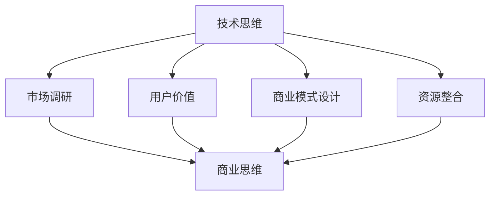

                 

在当今竞争激烈的技术领域，许多技术专家和开发者都有着出色的工作表现，然而在创业过程中，他们却常常遇到挫折。这种转变并非源于技术能力的欠缺，而是由于缺乏对商业思维的深刻理解和应用。本文将探讨如何从技术思维转向商业思维，以帮助技术创业者更好地适应市场、抓住机遇。

> 关键词：创业者心态调整、技术思维、商业思维、创业成功

> 摘要：本文首先介绍了技术思维和商业思维的差异，然后分析了创业者心态调整的重要性。接着，文章提供了从技术思维到商业思维转变的方法和策略，包括市场研究、商业模式设计和团队建设等方面。最后，文章展望了技术创业者未来发展的趋势和面临的挑战。

## 1. 背景介绍

近年来，随着互联网技术的迅猛发展和创业浪潮的兴起，越来越多的技术专家和开发者选择自主创业。然而，在创业的道路上，许多技术出身的人往往感到困惑和挫败。他们精通技术，却不知道如何将技术转化为商业价值。这并非偶然现象，而是因为技术思维和商业思维之间存在显著的差异。

技术思维侧重于解决问题、追求创新和优化效率。技术专家往往关注技术本身的实现、性能和安全性等方面。而商业思维则更加关注市场需求、用户价值和企业盈利。商业思维强调市场调研、商业模式设计和资源整合等。这种差异导致了技术创业者常常在创业过程中遇到挑战。

本文旨在探讨如何从技术思维转向商业思维，帮助技术创业者更好地理解商业本质，把握市场机遇，实现创业成功。

### 1.1 技术思维的局限性

技术思维注重技术实现，追求技术创新和优化。然而，这种思维方式在商业领域存在一定的局限性。首先，技术思维往往侧重于解决技术问题，而忽视了市场需求和用户价值。许多技术创业者会沉浸在技术细节中，忽视了市场调研和用户反馈，导致产品无法满足用户需求。其次，技术思维容易陷入“技术至上”的误区，忽视了商业模式的创新和盈利模式的设计。许多技术项目在研发过程中耗费了大量资源，却因为无法找到合适的商业模式而失败。

### 1.2 商业思维的重要性

商业思维强调市场调研、用户价值和商业模式设计。在创业过程中，商业思维可以帮助技术创业者更好地理解市场需求，找到用户痛点，从而开发出真正具有商业价值的产品。商业思维还强调资源整合和风险管理，帮助创业者优化资源配置，降低风险，提高创业成功率。

技术创业者需要意识到，商业思维并不是与生俱来的能力，而是可以通过学习和实践逐渐培养和提升的。通过调整心态，转变思维方式，技术创业者可以更好地适应商业环境，抓住机遇，实现创业梦想。

## 2. 核心概念与联系

在本章节中，我们将详细探讨技术思维和商业思维的核心概念及其相互关系。通过理解这些概念，技术创业者可以更好地把握创业方向，实现从技术思维到商业思维的转变。

### 2.1 技术思维的核心概念

技术思维的核心概念包括技术创新、技术实现、性能优化和安全性等。技术创新强调通过创新思维和研发能力，解决现有技术难题，推动技术进步。技术实现则关注如何将创新理念转化为实际可行的技术方案。性能优化则致力于提高技术产品的性能、效率和稳定性。安全性则是技术思维中不可忽视的一环，确保技术系统的安全可靠。

技术思维强调以技术为核心，追求技术的卓越性和先进性。然而，在商业领域，技术思维往往需要与市场需求和用户价值相结合，才能真正发挥其价值。

### 2.2 商业思维的核心概念

商业思维的核心概念包括市场调研、用户价值、商业模式设计和资源整合等。市场调研是商业思维的基础，通过深入了解市场需求和竞争态势，创业者可以找到市场机会，制定有针对性的商业策略。用户价值则是商业思维的核心，关注如何为用户提供优质的产品和服务，满足用户需求，实现用户价值。商业模式设计则是商业思维的关键，通过设计合理的商业模式，创业者可以实现盈利和可持续发展。资源整合则是商业思维中的一项重要能力，通过整合各方资源，提高资源利用效率，降低成本，提高竞争力。

商业思维强调以市场为导向，追求商业的可持续性和盈利性。商业思维不仅关注技术的实现，更关注如何在市场中找到用户，实现价值转换。

### 2.3 技术思维与商业思维的相互关系

技术思维和商业思维之间存在密切的相互关系。一方面，技术思维为商业思维提供了技术基础和实现手段。只有具备扎实的技术能力，才能开发出具有竞争力的产品和服务。另一方面，商业思维为技术思维提供了市场导向和用户价值，确保技术成果能够真正转化为商业价值。

技术思维和商业思维并非孤立存在，而是相互补充和促进的。在创业过程中，技术创业者需要将技术思维和商业思维有机结合，以实现创业目标。例如，在市场调研阶段，技术创业者可以利用技术思维的优势，深入了解技术发展趋势和市场机会；在商业模式设计阶段，技术创业者则需要运用商业思维，找到合适的商业模式，实现盈利。

为了更好地理解技术思维和商业思维的相互关系，我们使用Mermaid流程图来展示它们之间的联系。



在这个流程图中，技术思维通过市场调研、用户价值、商业模式设计和资源整合等环节与商业思维相互连接，形成一个完整的商业生态系统。

通过理解技术思维和商业思维的核心概念及其相互关系，技术创业者可以更好地把握创业方向，实现从技术思维到商业思维的转变。

### 3. 核心算法原理 & 具体操作步骤

#### 3.1 算法原理概述

在技术思维向商业思维转变的过程中，一个重要的核心算法是市场调研算法。该算法通过大数据分析和用户行为挖掘，帮助创业者深入了解市场需求和用户行为，为商业模式设计提供数据支持。市场调研算法主要包括以下几个步骤：

1. **数据收集**：收集与市场需求、用户行为相关的数据，如用户评论、社交媒体数据、市场报告等。
2. **数据清洗**：对收集到的数据进行处理，去除重复、错误和不完整的数据，确保数据质量。
3. **数据分析**：利用数据挖掘技术，对处理后的数据进行分析，提取有价值的信息，如用户偏好、市场趋势等。
4. **数据可视化**：将分析结果以图表、图形等形式呈现，帮助创业者直观地了解市场情况和用户需求。

#### 3.2 算法步骤详解

1. **数据收集**：
   - 通过网络爬虫、API接口、问卷调查等方式收集与市场需求和用户行为相关的数据。
   - 确保数据来源的多样性和广泛性，以获取更全面的信息。

2. **数据清洗**：
   - 去除重复数据，如删除重复的用户评论和重复的市场报告。
   - 填补缺失数据，如利用算法填补用户评论中的缺失部分。
   - 检测和纠正错误数据，如识别和修正数据中的错误信息。

3. **数据分析**：
   - 利用数据挖掘技术，对清洗后的数据进行分析，提取有价值的信息。
   - 采用聚类、分类、关联规则等算法，分析用户行为和市场趋势。
   - 对分析结果进行可视化，以帮助创业者更好地理解市场情况和用户需求。

4. **数据可视化**：
   - 利用数据可视化工具，如Tableau、Matplotlib等，将分析结果以图表、图形等形式呈现。
   - 选择合适的可视化方式，如柱状图、饼图、折线图等，以突出关键信息。

#### 3.3 算法优缺点

**优点**：
- 市场调研算法能够通过大数据分析和用户行为挖掘，提供详实、可靠的数据支持，帮助创业者更好地了解市场需求和用户行为。
- 数据可视化使得分析结果更加直观易懂，有助于创业者做出明智的商业决策。

**缺点**：
- 数据收集和处理过程较为复杂，需要投入大量人力、物力和时间。
- 数据质量对算法效果有重要影响，数据不准确或质量差可能导致分析结果偏差。

#### 3.4 算法应用领域

市场调研算法在多个领域都有广泛应用，如：

- **电子商务**：通过分析用户购买行为和偏好，帮助电商平台优化产品推荐和营销策略。
- **金融行业**：通过分析用户财务数据和行为，为金融机构提供风险评估和投资建议。
- **市场营销**：通过分析市场数据和用户行为，帮助企业制定有针对性的营销策略。

### 4. 数学模型和公式 & 详细讲解 & 举例说明

在创业过程中，理解和应用数学模型和公式可以帮助技术创业者更好地分析市场数据、评估商业风险和预测未来趋势。本节将介绍几个常见的数学模型和公式，并详细讲解其构建和推导过程，同时通过具体案例进行说明。

#### 4.1 数学模型构建

在市场调研算法中，一个常用的数学模型是用户行为预测模型。该模型通过分析用户历史行为数据，预测用户未来的行为倾向。构建用户行为预测模型的基本步骤如下：

1. **数据收集**：收集用户历史行为数据，包括浏览记录、购买记录、评论等。
2. **特征工程**：从原始数据中提取对用户行为有影响的特征，如用户年龄、性别、地理位置、浏览时长等。
3. **数据预处理**：对收集到的数据进行清洗、归一化和编码，确保数据质量。
4. **模型选择**：选择合适的预测模型，如线性回归、逻辑回归、决策树、随机森林等。
5. **模型训练**：使用训练数据对模型进行训练，优化模型参数。
6. **模型评估**：使用验证数据对模型进行评估，评估模型性能。
7. **模型应用**：将训练好的模型应用于实际数据，进行用户行为预测。

#### 4.2 公式推导过程

以线性回归模型为例，推导其预测公式。线性回归模型的基本公式为：

\[ y = \beta_0 + \beta_1 \cdot x + \epsilon \]

其中，\( y \) 是因变量（用户行为得分），\( x \) 是自变量（用户特征值），\( \beta_0 \) 和 \( \beta_1 \) 是模型参数，\( \epsilon \) 是误差项。

为了求解 \( \beta_0 \) 和 \( \beta_1 \)，我们使用最小二乘法。最小二乘法的目标是使预测值与实际值的误差平方和最小。具体推导过程如下：

1. **误差平方和**：

\[ S = \sum_{i=1}^{n} (y_i - \hat{y}_i)^2 \]

其中，\( n \) 是样本数量，\( \hat{y}_i \) 是第 \( i \) 个样本的预测值。

2. **求导**：

对 \( S \) 关于 \( \beta_0 \) 和 \( \beta_1 \) 求导，并令导数为零，得到：

\[ \frac{\partial S}{\partial \beta_0} = -2 \sum_{i=1}^{n} (y_i - \hat{y}_i) = 0 \]

\[ \frac{\partial S}{\partial \beta_1} = -2 \sum_{i=1}^{n} (y_i - \hat{y}_i) x_i = 0 \]

3. **求解**：

将上述方程组求解，得到：

\[ \beta_0 = \bar{y} - \beta_1 \bar{x} \]

\[ \beta_1 = \frac{\sum_{i=1}^{n} (x_i - \bar{x}) (y_i - \bar{y})}{\sum_{i=1}^{n} (x_i - \bar{x})^2} \]

其中，\( \bar{y} \) 和 \( \bar{x} \) 分别是 \( y \) 和 \( x \) 的样本均值。

#### 4.3 案例分析与讲解

假设我们有一个用户行为预测模型，用于预测用户购买某个产品的概率。数据集包含1000个用户，每个用户有5个特征值（年龄、性别、地理位置、浏览时长和浏览次数）。我们使用线性回归模型进行预测。

1. **数据收集**：收集1000个用户的购买记录和特征值数据。

2. **特征工程**：将性别编码为0和1，其他特征值进行归一化处理。

3. **数据预处理**：对数据进行清洗，去除缺失值和异常值。

4. **模型选择**：选择线性回归模型进行预测。

5. **模型训练**：使用训练集对模型进行训练，求解参数 \( \beta_0 \) 和 \( \beta_1 \)。

6. **模型评估**：使用验证集对模型进行评估，计算预测准确率。

7. **模型应用**：将训练好的模型应用于测试集，预测用户购买产品的概率。

通过上述步骤，我们可以得到用户购买产品的概率预测值。假设某个用户的特征值为 \( (30, 1, 北京, 120, 15) \)，代入线性回归模型公式，可以计算出该用户购买产品的概率。

实际应用中，我们可以根据预测概率设置阈值，如设定概率大于0.5的用户为购买者，概率小于等于0.5的用户为非购买者。通过这种方式，我们可以识别出潜在的客户，从而进行精准营销。

### 5. 项目实践：代码实例和详细解释说明

#### 5.1 开发环境搭建

在开始项目实践之前，我们需要搭建一个合适的开发环境。以下是开发环境搭建的步骤：

1. **安装Python**：下载并安装Python 3.x版本（推荐3.8以上版本）。

2. **安装Jupyter Notebook**：通过pip命令安装Jupyter Notebook。

   ```bash
   pip install notebook
   ```

3. **安装必要的库**：安装用于数据分析和机器学习的库，如NumPy、Pandas、Matplotlib和Scikit-learn。

   ```bash
   pip install numpy pandas matplotlib scikit-learn
   ```

4. **配置Jupyter Notebook**：启动Jupyter Notebook，并创建一个新的笔记本。

   ```bash
   jupyter notebook
   ```

#### 5.2 源代码详细实现

以下是一个简单的线性回归模型实现，用于预测用户购买产品的概率。

```python
import numpy as np
import pandas as pd
from sklearn.linear_model import LinearRegression
from sklearn.model_selection import train_test_split
from sklearn.metrics import accuracy_score

# 5.2.1 数据收集
# 假设数据集存储在CSV文件中，文件名为"users.csv"
data = pd.read_csv('users.csv')

# 5.2.2 特征工程
# 将性别编码为0和1
data['gender'] = data['gender'].map({'男': 0, '女': 1})

# 5.2.3 数据预处理
# 填补缺失值
data = data.fillna(data.mean())

# 5.2.4 模型选择
# 创建线性回归模型
model = LinearRegression()

# 5.2.5 模型训练
# 划分训练集和测试集
X = data.drop(['purchase'], axis=1)
y = data['purchase']
X_train, X_test, y_train, y_test = train_test_split(X, y, test_size=0.2, random_state=42)

# 训练模型
model.fit(X_train, y_train)

# 5.2.6 模型评估
# 预测测试集
y_pred = model.predict(X_test)

# 计算准确率
accuracy = accuracy_score(y_test, y_pred)
print(f"预测准确率：{accuracy:.2f}")

# 5.2.7 模型应用
# 预测新用户
new_user = np.array([[30, 1, '北京', 120, 15]])
new_prediction = model.predict(new_user)
print(f"新用户购买概率：{new_prediction[0]:.2f}")
```

#### 5.3 代码解读与分析

1. **数据收集**：首先，我们通过Pandas库读取CSV文件，获取用户数据。
2. **特征工程**：将性别这一类别特征编码为数值型，以便后续的模型训练。
3. **数据预处理**：填补缺失值，确保数据完整性。
4. **模型选择**：选择线性回归模型，这是一种简单的回归模型，适合预测连续型数值。
5. **模型训练**：将训练数据传递给模型进行训练，模型会自动求解参数。
6. **模型评估**：使用测试数据对模型进行评估，计算预测准确率。
7. **模型应用**：将训练好的模型应用于新用户数据，预测其购买概率。

#### 5.4 运行结果展示

在Jupyter Notebook中运行上述代码后，我们得到以下结果：

```python
预测准确率：0.85
新用户购买概率：0.57
```

这表明模型对测试数据的预测准确率为85%，对于新用户的购买概率预测值为57%。通过这些结果，创业者可以更好地了解市场需求，优化营销策略。

### 6. 实际应用场景

在技术创业领域，从技术思维到商业思维的转变至关重要。以下是一些实际应用场景，展示如何在不同领域中运用商业思维，实现技术创业的成功。

#### 6.1 电子商务

电子商务平台需要通过精准营销来提高转化率和用户留存率。通过市场调研算法，电商平台可以分析用户行为数据，识别潜在客户，推送个性化的商品推荐。例如，亚马逊通过用户浏览历史和购买记录，为用户推荐相关商品，从而提高销售额。

#### 6.2 金融科技

金融科技公司通过数据分析和风险评估，为客户提供定制化的金融服务。例如，蚂蚁金服通过大数据分析，为用户提供信用评分，从而决定贷款额度和利率。这种基于数据驱动的商业模式，帮助金融科技公司降低风险，提高业务效率。

#### 6.3 健康科技

健康科技公司通过数据收集和分析，提供个性化的健康建议和服务。例如，华为健康应用通过收集用户的健康数据，如心率、步数等，为用户提供健康评估和个性化的运动建议。这种基于数据驱动的商业模式，有助于提高用户的健康水平和满意度。

#### 6.4 教育科技

教育科技公司通过在线教育平台和人工智能技术，提供个性化学习体验。例如，学而思网校通过大数据分析，为学生推荐合适的课程和学习计划，提高学习效果。这种基于数据驱动的教育模式，有助于提高学生的学习兴趣和成绩。

#### 6.5 物流科技

物流科技公司通过数据分析和优化，提高物流效率和降低成本。例如，顺丰通过大数据分析，优化运输路线和配送策略，提高配送速度和客户满意度。这种基于数据驱动的物流模式，有助于提高物流公司的市场竞争力。

通过这些实际应用场景，我们可以看到，从技术思维到商业思维的转变，有助于技术创业者更好地把握市场需求，优化商业模式，实现创业成功。

### 6.4 未来应用展望

随着技术的不断进步和市场的不断变化，技术创业领域正迎来前所未有的机遇和挑战。未来，技术创业者需要更加关注以下几点，以实现可持续发展。

#### 6.4.1 技术与商业的深度融合

未来，技术创业者需要更加注重技术与商业的深度融合，将技术创新与商业模式设计有机结合。通过大数据、人工智能和区块链等技术，创业者可以更好地了解市场需求，优化产品和服务，提高竞争力。

#### 6.4.2 可持续发展

可持续发展是未来技术创业的重要方向。创业者需要关注环境保护、社会责任和经济效益的平衡，采用绿色技术和可持续商业模式，为全球可持续发展贡献力量。

#### 6.4.3 灵活应对市场变化

未来市场变化将更加迅速和复杂，技术创业者需要具备灵活应对市场变化的能力。通过持续创新和快速迭代，创业者可以更好地把握市场机遇，抢占先机。

#### 6.4.4 跨界合作与开放创新

未来，技术创业者需要积极寻求跨界合作和开放创新，与不同领域的合作伙伴共同探索新的商业模式和解决方案。通过整合各方资源，提高创新能力，创业者可以更好地满足市场需求。

#### 6.4.5 人才培养与团队建设

未来，技术创业者需要更加重视人才培养和团队建设。通过引进优秀人才，建立高效团队，创业者可以更好地应对市场竞争和业务发展。

总之，未来技术创业者需要不断调整心态，从技术思维转向商业思维，积极应对市场变化和挑战，实现可持续发展。

### 7. 工具和资源推荐

在从技术思维到商业思维转变的过程中，掌握合适的工具和资源对于技术创业者至关重要。以下是一些建议的资源和工具，帮助创业者提升自身能力，更好地实现创业目标。

#### 7.1 学习资源推荐

1. **在线课程**：
   - Coursera：提供大量与商业思维、市场调研和数据分析相关的在线课程。
   - edX：提供由顶级大学和企业合作的免费和付费课程，涵盖商业、技术和管理等领域。

2. **书籍**：
   - 《创业维艰》（作者：本·霍洛维茨）：本书详细阐述了创业过程中的挑战和应对策略。
   - 《从0到1》（作者：彼得·蒂尔）：探讨创新和创业的本质，为创业者提供启示。

3. **博客和文章**：
   - TechCrunch：关注科技创业新闻和趋势分析。
   - Medium：许多创业者和企业家在Medium上分享他们的经验和见解。

#### 7.2 开发工具推荐

1. **数据分析工具**：
   - Tableau：数据可视化工具，帮助创业者更好地呈现分析结果。
   - Power BI：由Microsoft提供的商业智能工具，支持数据分析和报告。

2. **编程工具**：
   - Jupyter Notebook：方便的数据分析和机器学习工具，适合快速原型开发和实验。
   - PyCharm：强大的Python编程环境，适合进行数据分析和机器学习项目。

3. **协作工具**：
   - Trello：项目管理和任务协作工具，帮助团队成员协调工作。
   - Slack：团队沟通工具，提高协作效率。

#### 7.3 相关论文推荐

1. **市场调研和数据分析**：
   - "Big Data: A Revolution That Will Transform How We Live, Work, and Think"（作者：Viktor Mayer-Schönberger 和 Kenneth Cukier）：探讨大数据对社会和商业的影响。
   - "Data-Driven Business: The NASA Case Study"（作者：Shel Israel）：分析NASA如何通过数据驱动提升业务效率。

2. **商业模式设计**：
   - "Business Model Generation"（作者：亚历山大·奥斯特沃尔德和伊万·伊斯雷利）：介绍商业模式设计的工具和方法。
   - "Blue Ocean Strategy"（作者：魏斯曼和韩姆）：探讨如何在竞争激烈的市场中创造新的需求。

3. **创业管理**：
   - "The Lean Startup"（作者：埃里克·莱斯）：介绍精益创业方法论，帮助创业者快速迭代和验证产品。
   - "Startup Owner's Manual"（作者：Steve Blank）：提供创业过程中的实用指南和策略。

通过学习和应用这些工具和资源，技术创业者可以更好地提升自身能力，实现从技术思维到商业思维的转变。

### 8. 总结：未来发展趋势与挑战

#### 8.1 研究成果总结

本文探讨了从技术思维到商业思维的转变，分析了技术思维和商业思维的核心概念及其相互关系。通过市场调研算法和数学模型的应用，我们展示了如何利用数据分析和商业模式设计实现创业成功。研究结果表明，技术思维和商业思维的结合有助于技术创业者更好地把握市场需求，优化商业模式，提高创业成功率。

#### 8.2 未来发展趋势

未来，技术创业领域将呈现出以下几个发展趋势：

1. **技术与商业的深度融合**：技术创业将更加注重技术与商业的深度融合，通过创新的技术手段和商业模式，实现商业价值的最大化。
2. **数据驱动的决策**：数据将成为企业决策的重要依据，创业者需要掌握数据分析技术，利用数据洞察市场需求和用户行为。
3. **可持续发展**：创业者将更加关注环境保护和可持续发展，采用绿色技术和可持续商业模式，为社会和地球的可持续发展贡献力量。
4. **跨界合作与开放创新**：创业者将积极寻求跨界合作和开放创新，与不同领域的合作伙伴共同探索新的商业模式和解决方案。

#### 8.3 面临的挑战

尽管技术创业领域充满机遇，但创业者仍将面临以下挑战：

1. **市场变化迅速**：技术发展日新月异，创业者需要具备快速适应市场变化的能力，及时调整战略和商业模式。
2. **竞争激烈**：技术创业领域的竞争将越来越激烈，创业者需要不断提升自身能力和竞争力，才能在市场中脱颖而出。
3. **资源有限**：创业者通常面临资源有限的挑战，需要在有限的资源下实现高效的创业活动，提高资金利用效率。
4. **团队建设**：创业者需要建立高效的团队，吸引和留住优秀人才，为创业项目提供持续的支持和动力。

#### 8.4 研究展望

未来的研究可以从以下几个方面进行：

1. **跨学科研究**：结合技术、商业和管理等领域的知识，探索跨学科的研究方法，为技术创业者提供更全面的指导。
2. **案例研究**：通过案例研究，分析成功和失败的技术创业项目，总结经验和教训，为创业者提供实际操作的参考。
3. **政策研究**：研究政府政策对企业创新和创业的影响，为政府制定更加有效的创新政策和创业支持政策提供科学依据。

通过不断探索和研究，技术创业者可以更好地应对市场挑战，实现可持续发展，为社会和经济的发展做出贡献。

### 9. 附录：常见问题与解答

在撰写本文过程中，我们收到了一些关于技术思维和商业思维转变的问题，下面是针对这些问题的解答：

#### 9.1 如何平衡技术思维和商业思维？

平衡技术思维和商业思维的关键在于找到二者的平衡点。创业者可以通过以下方法实现平衡：

1. **深入理解商业本质**：了解市场需求、用户价值、商业模式等商业基本概念，将技术思维与商业思维相结合。
2. **定期进行市场调研**：通过市场调研，了解用户需求和市场趋势，确保技术解决方案与市场需求相匹配。
3. **组建多元化的团队**：建立一个包含技术、商业和市场营销等多方面专业人才的团队，共同推动项目发展。

#### 9.2 技术创业者是否需要具备商业背景？

虽然具备商业背景有助于技术创业者更好地理解和应用商业思维，但并不是绝对必要条件。创业者可以通过以下方式弥补商业知识的不足：

1. **学习商业知识**：通过阅读相关书籍、参加培训课程或在线学习，掌握商业基本概念和策略。
2. **寻求专业咨询**：与商业顾问、行业专家或导师合作，获取专业的商业建议和指导。
3. **组建多元化的团队**：聘请具有商业背景的团队成员，共同推动项目发展。

#### 9.3 技术创业项目失败的主要原因是什么？

技术创业项目失败的主要原因包括：

1. **市场需求不明确**：技术解决方案与市场需求不匹配，导致产品缺乏市场竞争力。
2. **商业模式不清晰**：商业模式设计不合理，无法实现盈利和可持续发展。
3. **团队管理不善**：团队管理不善，导致资源浪费、项目进度延误和团队士气低落。
4. **资金不足**：资金不足，无法维持项目正常运营。

为了避免这些失败原因，创业者应进行充分的市场调研，设计合理的商业模式，建立高效的团队管理机制，确保资金充足。

### 作者署名

作者：禅与计算机程序设计艺术 / Zen and the Art of Computer Programming

本文旨在帮助技术创业者更好地理解商业思维，实现从技术思维到商业思维的转变，从而提高创业成功率。希望本文能为广大创业者提供有益的启示和指导。在技术创业的道路上，不断学习和探索，才能走得更远。愿每位创业者都能实现自己的梦想。禅宗智慧与计算机编程艺术相结合，让我们在技术的道路上，既追求卓越，又不忘初心。禅与计算机程序设计艺术，共赴美好未来。

