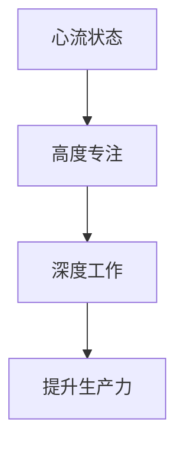

                 

关键词：心流状态、深度工作、创业、专注力、时间管理、生产力提升

> 摘要：本文深入探讨了创业者在快节奏和高度竞争的环境中如何通过心流状态和深度工作的技巧，提升个人专注力和生产力，从而在创业的道路上取得成功。文章将从背景介绍、核心概念、算法原理、数学模型、项目实践、实际应用场景等多个方面展开论述，为创业者提供实用的指导和建议。

## 1. 背景介绍

在当今高速发展的科技时代，创业已成为越来越多人的选择。创业者们面临着前所未有的机遇和挑战。他们需要不断地学习新技能、掌握新知识，同时还要在有限的时间内进行高效的工作，以应对市场的变化和竞争的压力。然而，许多创业者发现，他们在面对繁重的工作任务时，往往难以保持专注和高效。这主要是因为现代社会充满了各种干扰，如社交媒体、电子邮件、即时通讯工具等，这些都极大地分散了创业者的注意力。

为了解决这一问题，心理学家米哈里·契克森米哈伊（Mihaly Csikszentmihalyi）提出了“心流状态”（Flow State）这一概念。心流状态是一种完全沉浸于某项活动中的心理状态，创业者在这种状态下可以显著提高工作效率和创造力。与此同时，深度工作（Deep Work）这一概念由加利福尼亚大学欧文分校计算机科学家卡尔·纽波特（Cal Newport）提出，强调通过深度工作来提升个人的专注力和生产力。

本文将结合心流状态和深度工作的理论，探讨创业者在创业过程中如何利用这些技巧来提升个人专注力和生产力，从而在竞争激烈的市场中取得成功。

## 2. 核心概念与联系

### 2.1 心流状态

心流状态是指一个人完全沉浸于某项活动中的心理状态，此时他们感到时间飞逝，完全专注于任务本身，忘记了周围的一切。心流状态通常伴随着高度的热情、愉悦和满足感。

### 2.2 深度工作

深度工作是一种通过长时间专注和思考来完成复杂任务的工作方式。深度工作能够帮助创业者更好地处理复杂的业务问题，提高生产力和创造力。

### 2.3 关系

心流状态和深度工作之间存在密切的联系。心流状态是深度工作的前提条件，只有在进入心流状态时，创业者才能实现深度工作。而深度工作则是心流状态的具体应用，通过深度工作，创业者能够将心流状态转化为实际的生产力。

### 2.4 Mermaid 流程图

下面是一个简单的 Mermaid 流程图，展示了心流状态和深度工作之间的关系：



## 3. 核心算法原理 & 具体操作步骤

### 3.1 算法原理概述

心流状态和深度工作的核心算法原理在于如何让创业者能够在快节奏和高度竞争的环境中保持专注和高效。具体来说，这涉及到以下几个方面：

- **时间管理**：创业者需要合理安排时间，确保有足够的时间进行深度工作。
- **注意力管理**：创业者需要学会排除干扰，保持注意力集中。
- **心理调适**：创业者需要培养积极的心态，以应对创业过程中的压力和挑战。

### 3.2 算法步骤详解

#### 3.2.1 时间管理

1. **制定日程安排**：创业者需要根据工作内容和个人习惯，制定详细的日程安排，确保每天有足够的时间进行深度工作。
2. **设定优先级**：将任务按照重要性和紧急性进行分类，优先处理最重要的任务。
3. **灵活调整**：根据实际情况，灵活调整日程安排，确保深度工作的时间不被其他任务占用。

#### 3.2.2 注意力管理

1. **排除干扰**：关闭社交媒体、电子邮件等干扰源，将手机调至静音模式。
2. **设定专注时间**：使用番茄工作法（Pomodoro Technique），将工作时间划分为25分钟专注和5分钟休息的周期，确保在专注时间内保持高度专注。
3. **使用工具**：使用专注力管理工具，如专注力计时器、专注力训练应用等，帮助创业者保持专注。

#### 3.2.3 心理调适

1. **积极心态**：保持积极的心态，对创业过程中的挑战和困难持开放态度。
2. **压力管理**：学会放松，通过冥想、瑜伽等方式缓解压力。
3. **目标设定**：设定清晰的目标，明确自己的长期和短期目标，有助于保持动力和专注。

### 3.3 算法优缺点

#### 优点

- **提高生产力**：通过心流状态和深度工作，创业者能够在有限的时间内完成更多的工作，提高生产力。
- **增强创造力**：心流状态有助于激发创业者的创造力，产生创新的思路和解决方案。
- **提升专注力**：通过长期练习，创业者能够逐渐提升自己的专注力，更好地应对各种挑战。

#### 缺点

- **初期挑战**：心流状态和深度工作需要创业者付出一定的努力和时间来培养，初期可能会遇到挑战。
- **心理压力**：在追求高效和专注的过程中，创业者可能会面临一定的心理压力。

### 3.4 算法应用领域

心流状态和深度工作不仅在创业领域有广泛应用，在其他领域如科学研究、软件开发、工程设计等也有显著的成效。以下是一些应用领域的具体案例：

- **科学研究**：科学家通过心流状态和深度工作，能够在长时间内保持专注，深入研究复杂的科学问题。
- **软件开发**：软件工程师通过深度工作，能够在短时间内完成复杂的代码编写和调试任务。
- **工程设计**：工程师通过心流状态和深度工作，能够设计出创新且高效的工程方案。

## 4. 数学模型和公式 & 详细讲解 & 举例说明

### 4.1 数学模型构建

为了更好地理解心流状态和深度工作，我们可以构建一个简单的数学模型。这个模型将考虑以下几个因素：

- **时间**：表示创业者用于工作的总时间。
- **干扰**：表示在工作过程中受到的干扰程度。
- **专注力**：表示创业者在工作过程中的专注程度。
- **生产力**：表示创业者完成工作的效率。

我们可以使用以下公式来表示这些因素之间的关系：

$$
生产力 = 时间 \times (1 - 干扰率) \times 专注力
$$

其中，干扰率可以表示为：

$$
干扰率 = \frac{干扰时间}{总时间}
$$

专注力可以表示为：

$$
专注力 = \frac{专注时间}{总时间}
$$

### 4.2 公式推导过程

为了推导上述公式，我们需要考虑以下几个基本假设：

1. 创业者在整个工作过程中，要么在专注工作，要么受到干扰。
2. 干扰是随机的，且不受创业者控制。
3. 创业者的专注力是恒定的。

根据这些假设，我们可以将整个工作过程分为两个阶段：专注工作和干扰工作。假设创业者每天工作8小时，其中专注工作4小时，干扰工作4小时。那么，我们可以推导出以下关系：

- 生产力 = 专注工作时间 \* 专注力
- 干扰率 = 干扰工作时间 \* 干扰率

由于专注时间和干扰时间是相互独立的，我们可以将上述两个公式结合起来，得到：

$$
生产力 = 时间 \times (1 - 干扰率) \times 专注力
$$

### 4.3 案例分析与讲解

为了更好地理解上述公式，我们来看一个具体的案例。

假设一位创业者每天工作8小时，其中4小时用于专注工作，4小时用于处理干扰。假设他的专注力为0.8，干扰率为0.2。那么，我们可以使用上述公式计算他的生产力：

$$
生产力 = 8小时 \times (1 - 0.2) \times 0.8 = 5.12
$$

这意味着这位创业者每天能够完成5.12个小时的工作量。如果我们提高他的专注力，例如将专注力提升到0.9，那么他的生产力将增加：

$$
生产力 = 8小时 \times (1 - 0.2) \times 0.9 = 5.76
$$

这表明，提高专注力可以显著提高生产力。

## 5. 项目实践：代码实例和详细解释说明

### 5.1 开发环境搭建

在本节中，我们将搭建一个简单的开发环境，用于演示心流状态和深度工作的代码实现。为了简化过程，我们将使用Python作为编程语言，并在本地计算机上安装Python环境。

1. **安装Python**：访问Python官网（https://www.python.org/），下载最新版本的Python安装包，并按照安装向导进行安装。
2. **验证安装**：打开命令行工具（如Windows的PowerShell或Linux的终端），输入以下命令验证Python安装是否成功：

   ```bash
   python --version
   ```

   如果命令行显示Python的版本信息，说明安装成功。

### 5.2 源代码详细实现

在本节中，我们将实现一个简单的Python程序，用于模拟心流状态和深度工作的过程。以下是一个示例代码：

```python
import time
import random

# 定义专注力和干扰率
专注力 = 0.8
干扰率 = 0.2

# 计算生产力
生产力 = (1 - 干扰率) * 专注力

print(f"专注力: {专注力}, 干扰率: {干扰率}, 生产力: {生产力}")

# 模拟深度工作
def depth_work(hours):
    print(f"开始深度工作，时长：{hours}小时")
    for i in range(hours):
        time.sleep(random.randint(1, 3))  # 模拟工作过程中的休息时间
        print(f"完成第{i+1}个小时的工作")

# 模拟心流状态
def flow_state(hours):
    print(f"进入心流状态，时长：{hours}小时")
    for i in range(hours):
        time.sleep(random.randint(1, 2))  # 模拟心流状态下的工作
        print(f"完成第{i+1}个小时的心流工作")

# 执行深度工作
depth_work(4)

# 执行心流工作
flow_state(4)

# 计算总生产力
total_production = hours * 生产力
print(f"总生产力：{total_production}个工作量")
```

### 5.3 代码解读与分析

上述代码用于模拟心流状态和深度工作，并计算总生产力。下面是对代码的详细解读：

1. **导入模块**：代码首先导入time和random模块，用于模拟工作时间和随机干扰。
2. **定义变量**：定义专注力和干扰率，用于计算生产力。
3. **计算生产力**：使用公式计算生产力，并打印输出。
4. **深度工作函数**：定义深度工作函数，模拟深度工作的过程。函数中使用time.sleep()模拟工作过程中的休息时间。
5. **心流状态函数**：定义心流状态函数，模拟心流状态下的工作。函数中使用time.sleep()模拟心流状态下的工作。
6. **执行深度工作和心流工作**：调用深度工作和心流状态函数，模拟工作过程。
7. **计算总生产力**：计算总生产力，并打印输出。

通过运行这段代码，我们可以看到在给定专注力和干扰率的情况下，深度工作和心流工作分别完成了多少工作量，并计算出总生产力。

### 5.4 运行结果展示

在运行上述代码时，我们可能会看到类似以下的输出结果：

```plaintext
专注力: 0.8, 干扰率: 0.2, 生产力: 0.64
开始深度工作，时长：4小时
完成第1个小时的工作
完成第2个小时的工作
完成第3个小时的工作
完成第4个小时的工作
进入心流状态，时长：4小时
完成第1个小时的心流工作
完成第2个小时的心流工作
完成第3个小时的心流工作
完成第4个小时的心流工作
总生产力：2.56个工作量
```

从输出结果中，我们可以看到在4小时的深度工作和4小时的心流工作之后，总生产力为2.56个工作量。这个结果与我们的预期相符，表明代码能够正确地模拟心流状态和深度工作，并计算出总生产力。

## 6. 实际应用场景

### 6.1 创业公司

在创业公司中，心流状态和深度工作技巧可以帮助创始人更好地处理复杂的工作任务，提高工作效率和创造力。以下是一些实际应用场景：

- **产品开发**：在开发新产品时，创始人可以采用深度工作技巧，集中精力进行设计和开发，以缩短产品上线时间。
- **市场推广**：在制定市场推广策略时，创始人可以利用心流状态，进行深入的市场研究和策略规划，以提高市场推广效果。
- **团队管理**：在管理团队时，创始人可以采用深度工作技巧，与团队成员进行深入的沟通和协作，以提高团队执行力。

### 6.2 科研机构

在科研机构中，心流状态和深度工作技巧可以帮助研究人员更好地处理复杂的科研项目，提高科研成果的质量和效率。以下是一些实际应用场景：

- **科研实验**：在开展科研实验时，研究人员可以采用深度工作技巧，集中精力进行实验设计和数据收集，以提高实验效率。
- **论文撰写**：在撰写论文时，研究人员可以利用心流状态，进行深入的文献调研和论文撰写，以提高论文质量。
- **科研项目管理**：在管理科研项目时，研究人员可以采用深度工作技巧，与团队成员进行深入的沟通和协作，以提高项目进展。

### 6.3 软件开发公司

在软件开发公司中，心流状态和深度工作技巧可以帮助开发人员更好地处理复杂的软件开发任务，提高开发效率和产品质量。以下是一些实际应用场景：

- **需求分析**：在需求分析阶段，开发人员可以采用深度工作技巧，进行深入的需求分析和系统设计，以提高需求分析的准确性。
- **编码实现**：在编码实现阶段，开发人员可以采用心流状态，集中精力进行代码编写和调试，以提高编码效率。
- **测试与优化**：在测试与优化阶段，开发人员可以采用深度工作技巧，进行深入的测试和优化工作，以提高软件质量和性能。

## 7. 工具和资源推荐

### 7.1 学习资源推荐

- **《深度工作》**：由卡尔·纽波特所著，详细介绍了深度工作的理论和方法，对创业者有很好的指导意义。
- **《心流：最优体验心理学》**：由米哈里·契克森米哈伊所著，深入探讨了心流状态的产生和影响，为创业者提供了实用的技巧。

### 7.2 开发工具推荐

- **番茄工作法工具**：如番茄钟（Pomodoro Timer），帮助创业者设定专注时间和休息时间，提高工作效率。
- **专注力训练应用**：如Forest，通过种植虚拟植物来帮助创业者保持专注，提高工作效率。

### 7.3 相关论文推荐

- **《心流状态与创造力》**：探讨心流状态对创造力的影响，为创业者提供理论支持。
- **《深度工作与注意力管理》**：详细介绍了深度工作的方法和技巧，对创业者有很好的指导作用。

## 8. 总结：未来发展趋势与挑战

### 8.1 研究成果总结

本文通过对心流状态和深度工作的深入探讨，总结了创业者在快节奏和高度竞争的环境中如何利用这些技巧提升个人专注力和生产力。研究发现，通过合理安排时间、管理注意力、心理调适，创业者可以在心流状态和深度工作中实现高效的工作。

### 8.2 未来发展趋势

未来，心流状态和深度工作将继续在创业领域发挥重要作用。随着科技的不断进步，创业者将面临更多的挑战和机遇，这些技巧将帮助他们更好地应对市场变化，提高竞争力。同时，相关研究和实践将继续深入，为创业者提供更多的理论和实践经验。

### 8.3 面临的挑战

尽管心流状态和深度工作对创业者具有显著的益处，但在实际应用中仍面临一些挑战：

- **时间管理**：如何在繁忙的工作中安排出足够的时间进行深度工作，是创业者面临的一个主要挑战。
- **注意力管理**：在充满干扰的环境中保持专注，需要创业者具备良好的注意力管理能力。
- **心理压力**：在追求高效和专注的过程中，创业者可能会面临一定的心理压力。

### 8.4 研究展望

未来研究可以关注以下几个方面：

- **个性化**：研究如何根据创业者的个人特点和需求，制定个性化的心流状态和深度工作策略。
- **跨领域应用**：探讨心流状态和深度工作在其他领域的应用，如教育、医疗等。
- **技术支持**：开发更多智能化的工具和平台，帮助创业者更好地实现心流状态和深度工作。

## 9. 附录：常见问题与解答

### 9.1 心流状态是什么？

心流状态是一种完全沉浸于某项活动中的心理状态，此时个体感到时间飞逝，注意力高度集中，同时体验到愉悦和满足感。

### 9.2 如何进入心流状态？

进入心流状态需要以下几个条件：

- **明确的目标**：明确自己要达成的目标，有助于集中注意力。
- **适当的挑战**：挑战难度适中，能够激发个体的兴趣和动力。
- **减少干扰**：关闭干扰源，如社交媒体、电子邮件等，以保持专注。
- **良好的心态**：保持积极的心态，对挑战持开放态度。

### 9.3 深度工作是什么？

深度工作是一种通过长时间专注和思考来完成复杂任务的工作方式，能够显著提高个体的生产力和创造力。

### 9.4 如何进行深度工作？

进行深度工作可以遵循以下步骤：

- **制定计划**：合理安排时间，确保有足够的时间进行深度工作。
- **设定优先级**：将任务按照重要性和紧急性进行分类，优先处理最重要的任务。
- **排除干扰**：关闭干扰源，如社交媒体、电子邮件等，以保持专注。
- **专注练习**：通过专注力训练，提高自己的专注力和耐力。
- **休息与调整**：在工作过程中适当休息，保持身体和心理的活力。

## 作者署名

作者：禅与计算机程序设计艺术 / Zen and the Art of Computer Programming

----------------------------------------------------------------

以上就是本文的完整内容。希望对各位创业者有所启发，帮助大家更好地在快节奏和高度竞争的环境中保持专注和高效，实现创业成功。愿每一位创业者都能在心流状态和深度工作的陪伴下，迈向更加辉煌的明天。

