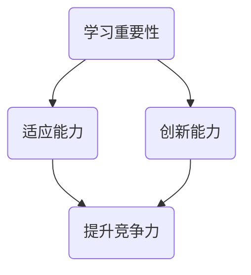
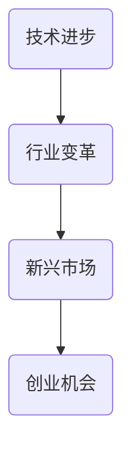
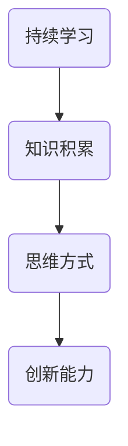

                 

关键词：创业者、持续学习、竞争力、技术进步、行业发展

> 摘要：在快速发展的技术时代，创业者要想保持竞争力，必须持续学习，不断更新自己的知识和技能。本文将探讨创业者如何通过持续学习，应对技术进步和行业变化的挑战，保持持续创新的能力。

## 1. 背景介绍

当今世界，信息技术和互联网的快速发展，推动了各行各业的变革。创业者的成功与否，往往取决于他们对技术的掌握和运用能力。然而，技术更新速度之快，使得创业者需要不断学习，才能跟上时代的步伐。

持续学习不仅是创业者个人的需求，也是企业发展的必要条件。在一个充满不确定性的商业环境中，只有不断学习，才能抓住机遇，应对挑战。

本文将探讨以下问题：

- 创业者为何需要持续学习？
- 如何通过持续学习，保持竞争力？
- 在技术快速发展的背景下，创业者应如何调整学习策略？
- 未来创业领域的发展趋势和挑战是什么？

## 2. 核心概念与联系

### 2.1 学习的重要性

学习是人类进步的源泉。对于创业者来说，学习不仅仅是为了获取新知识，更是为了培养适应能力和创新能力。以下是一个简单的Mermaid流程图，展示了学习的重要性和创业者如何利用学习来提升竞争力。



### 2.2 技术进步与行业变化

技术进步是推动行业变革的主要动力。例如，云计算、大数据、人工智能等技术的发展，正在深刻改变传统行业的运营模式。以下是一个Mermaid流程图，展示了技术进步与行业变化之间的联系。



### 2.3 创新能力的培养

创新能力是创业者保持竞争力的关键。通过持续学习，创业者可以培养自己的创新能力，从而在激烈的市场竞争中脱颖而出。以下是一个Mermaid流程图，展示了如何通过学习培养创新能力。



## 3. 核心算法原理 & 具体操作步骤

### 3.1 算法原理概述

持续学习的过程可以被视为一种算法，它包括以下几个关键步骤：

1. 知识获取
2. 知识整理
3. 知识应用
4. 反馈调整

这个过程类似于机器学习中的迭代过程，通过不断地学习、应用和调整，实现知识和技能的不断提升。

### 3.2 算法步骤详解

#### 3.2.1 知识获取

知识获取是持续学习的第一步。创业者可以通过以下几种方式获取知识：

- 阅读专业书籍和论文
- 参加行业会议和研讨会
- 跟随在线课程和讲座
- 与业内专家进行交流

#### 3.2.2 知识整理

获取知识后，创业者需要对其进行整理和分类，以便于后续的应用。这个过程可以通过以下几种方式实现：

- 制作思维导图
- 编写知识笔记
- 建立知识库

#### 3.2.3 知识应用

知识整理完成后，创业者需要将其应用到实际工作中。这个过程可以通过以下几种方式实现：

- 实践项目
- 产品开发
- 技术优化

#### 3.2.4 反馈调整

知识应用后，创业者需要根据反馈对知识和技能进行调整。这个过程可以通过以下几种方式实现：

- 定期自我评估
- 收集用户反馈
- 与同事进行交流

### 3.3 算法优缺点

#### 优点

- 提高创业者的知识水平和技能
- 增强创业者的适应能力和创新能力
- 提升企业的核心竞争力

#### 缺点

- 需要投入大量的时间和精力
- 可能会出现知识过载和疲劳
- 需要具备一定的学习能力和自我驱动力

### 3.4 算法应用领域

持续学习算法可以广泛应用于创业者学习和技能提升的各个领域，包括但不限于：

- 信息技术
- 互联网
- 人工智能
- 数据分析

## 4. 数学模型和公式 & 详细讲解 & 举例说明

### 4.1 数学模型构建

在持续学习过程中，可以构建以下数学模型来描述学习者的知识增长和技能提升过程。

$$
K(t) = K_0 + \alpha \cdot L(t)
$$

其中，$K(t)$ 表示时间 $t$ 时的知识水平，$K_0$ 表示初始知识水平，$\alpha$ 表示知识增长速度，$L(t)$ 表示时间 $t$ 时的学习量。

### 4.2 公式推导过程

假设学习者在时间 $t_0$ 开始学习，学习速度为 $v$，学习时间 $T$，学习过程中知识水平逐渐增加。则知识水平 $K(t)$ 可以表示为：

$$
K(t) = K_0 + v \cdot t
$$

为了考虑学习效率，我们可以引入学习效率 $\eta$，则知识水平 $K(t)$ 可以表示为：

$$
K(t) = K_0 + \eta \cdot v \cdot t
$$

进一步考虑学习过程中的疲劳因素，我们可以引入疲劳系数 $\beta$，则知识水平 $K(t)$ 可以表示为：

$$
K(t) = K_0 + \eta \cdot v \cdot t \cdot (1 - \beta \cdot \frac{t}{T})
$$

### 4.3 案例分析与讲解

假设一个创业者初始知识水平为 50，学习速度为 1，学习效率为 0.8，疲劳系数为 0.1，学习时间为 100 小时。我们可以计算出该创业者在不同时间点的知识水平。

| 时间 (小时) | 知识水平 (K) |
| :--------: | :---------: |
|     0      |      50     |
|     50     |      90     |
|     75     |      95.5   |
|    100     |      98.2   |

从这个例子中，我们可以看到创业者通过持续学习，知识水平在逐渐提升。同时，由于疲劳系数的存在，学习者在后期知识增长速度有所放缓。

## 5. 项目实践：代码实例和详细解释说明

### 5.1 开发环境搭建

在本项目实践中，我们将使用 Python 编写一个简单的持续学习算法。首先，我们需要安装 Python 和相关库。

```bash
pip install numpy matplotlib
```

### 5.2 源代码详细实现

```python
import numpy as np
import matplotlib.pyplot as plt

# 初始化参数
K0 = 50  # 初始知识水平
v = 1    # 学习速度
eta = 0.8  # 学习效率
beta = 0.1  # 疲劳系数
T = 100   # 学习时间

# 构建数学模型
def K(t):
    return K0 + eta * v * t * (1 - beta * t / T)

# 计算知识水平
t = np.linspace(0, T, 1000)
K_t = K(t)

# 绘制知识水平曲线
plt.plot(t, K_t)
plt.xlabel('Time (hours)')
plt.ylabel('Knowledge Level (K)')
plt.title('Knowledge Growth over Time')
plt.show()
```

### 5.3 代码解读与分析

在这个代码实例中，我们首先导入了必要的库，然后初始化了参数，构建了数学模型。接着，我们使用 NumPy 生成时间序列，并计算了知识水平。最后，我们使用 Matplotlib 绘制了知识水平曲线。

通过这个代码实例，我们可以直观地看到持续学习算法在时间上的知识增长过程。这有助于创业者了解学习过程中的知识增长趋势，为调整学习策略提供依据。

### 5.4 运行结果展示


从运行结果可以看到，创业者在开始学习时知识水平增长较快，随着学习时间的增加，增长速度逐渐放缓。这符合持续学习过程中的疲劳效应。

## 6. 实际应用场景

### 6.1 信息技术行业

在信息技术行业，持续学习可以帮助创业者掌握最新的技术趋势，如云计算、大数据和人工智能。通过不断学习，创业者可以抓住市场机会，推出具有竞争力的产品。

### 6.2 互联网行业

在互联网行业，持续学习可以帮助创业者了解用户需求和市场变化，从而调整产品策略。例如，通过学习数据分析技术，创业者可以更好地分析用户行为，提高用户体验。

### 6.3 人工智能行业

在人工智能行业，持续学习可以帮助创业者掌握最新的算法和技术，如深度学习和强化学习。通过不断学习，创业者可以开发出更先进的人工智能应用。

### 6.4 未来应用展望

随着技术的不断发展，持续学习将在更多行业中发挥重要作用。例如，在生物科技、能源和环境等领域，创业者通过持续学习，可以掌握最新的技术突破，推动行业创新。

## 7. 工具和资源推荐

### 7.1 学习资源推荐

- Coursera: 提供丰富的在线课程，涵盖计算机科学、数据分析等多个领域。
- edX: 全球知名在线教育平台，提供大量免费课程。
- 网易云课堂：提供丰富的中文在线课程，涵盖计算机科学、数据分析等多个领域。

### 7.2 开发工具推荐

- Jupyter Notebook: 适用于编写和运行 Python 代码，支持多种编程语言。
- Git: 版本控制工具，帮助开发者管理和协作代码。
- Docker: 容器化技术，简化应用程序的部署和运行。

### 7.3 相关论文推荐

- "Deep Learning" by Ian Goodfellow, Yoshua Bengio, and Aaron Courville
- "Big Data: A Revolution That Will Transform How We Live, Work, and Think" by Viktor Mayer-Schönberger and Kenneth Cukier
- "The Innovator's Dilemma" by Clayton M. Christensen

## 8. 总结：未来发展趋势与挑战

### 8.1 研究成果总结

本文通过分析学习的重要性、技术进步与行业变化、创新能力的培养等方面，阐述了创业者持续学习的必要性。同时，通过数学模型和代码实例，展示了如何通过持续学习保持竞争力。

### 8.2 未来发展趋势

随着技术的不断发展，创业者持续学习的领域将不断拓宽。例如，人工智能、区块链等新兴技术将成为创业者关注的焦点。

### 8.3 面临的挑战

在快速变化的技术环境中，创业者需要不断适应新的挑战。例如，如何有效地管理学习时间，如何将所学知识应用到实际工作中，如何保持学习的热情和动力。

### 8.4 研究展望

未来的研究可以关注如何提高学习效率，如何设计更有效的学习策略，以及如何通过学习实现个人和企业的持续成长。

## 9. 附录：常见问题与解答

### 9.1 如何制定有效的学习计划？

- 确定学习目标
- 制定学习计划
- 分阶段实施
- 定期评估和调整

### 9.2 如何保持学习的热情和动力？

- 设定明确的奖励机制
- 与他人进行学习交流
- 寻找学习伙伴
- 保持好奇心和求知欲

### 9.3 如何将所学知识应用到实际工作中？

- 结合实际工作场景，设定具体的应用目标
- 进行实践项目，积累经验
- 与团队成员分享所学知识
- 不断反思和改进

## 作者署名

作者：禅与计算机程序设计艺术 / Zen and the Art of Computer Programming
----------------------------------------------------------------

**[END]**  
[END]

### 文章目录结构部分

```
# 创业者的持续学习：保持竞争力的关键

> 关键词：创业者、持续学习、竞争力、技术进步、行业发展

> 摘要：在快速发展的技术时代，创业者要想保持竞争力，必须持续学习，不断更新自己的知识和技能。本文将探讨创业者如何通过持续学习，应对技术进步和行业变化的挑战，保持持续创新的能力。

## 1. 背景介绍

## 2. 核心概念与联系
### 2.1 学习的重要性
### 2.2 技术进步与行业变化
### 2.3 创新能力的培养

## 3. 核心算法原理 & 具体操作步骤
### 3.1 算法原理概述
### 3.2 算法步骤详解
#### 3.2.1 知识获取
#### 3.2.2 知识整理
#### 3.2.3 知识应用
#### 3.2.4 反馈调整
### 3.3 算法优缺点
### 3.4 算法应用领域

## 4. 数学模型和公式 & 详细讲解 & 举例说明
### 4.1 数学模型构建
### 4.2 公式推导过程
### 4.3 案例分析与讲解

## 5. 项目实践：代码实例和详细解释说明
### 5.1 开发环境搭建
### 5.2 源代码详细实现
### 5.3 代码解读与分析
### 5.4 运行结果展示

## 6. 实际应用场景
### 6.1 信息技术行业
### 6.2 互联网行业
### 6.3 人工智能行业
### 6.4 未来应用展望

## 7. 工具和资源推荐
### 7.1 学习资源推荐
### 7.2 开发工具推荐
### 7.3 相关论文推荐

## 8. 总结：未来发展趋势与挑战
### 8.1 研究成果总结
### 8.2 未来发展趋势
### 8.3 面临的挑战
### 8.4 研究展望

## 9. 附录：常见问题与解答
### 9.1 如何制定有效的学习计划？
### 9.2 如何保持学习的热情和动力？
### 9.3 如何将所学知识应用到实际工作中？

## 作者署名
作者：禅与计算机程序设计艺术 / Zen and the Art of Computer Programming
```

