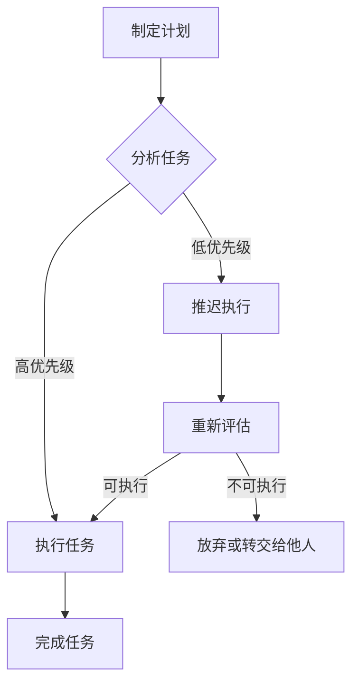

                 

关键词：时间管理，多重角色，平衡，创业者，效率，专注，工作与生活

> 摘要：本文将探讨创业者如何通过有效的时间管理策略来平衡多重角色，提高工作效率，实现工作与生活的平衡。文章首先介绍了创业者的常见角色及其责任，然后分析了时间管理的重要性，最后提出了具体的时间管理策略和实践方法。

## 1. 背景介绍

创业者，这个词语似乎总是充满了激情和冒险的象征。他们不仅要有创新的点子，还需要具备卓越的领导能力、商业眼光和坚韧不拔的毅力。然而，创业者的角色并不止于此。他们在初创公司中往往需要扮演多个角色，如产品经理、市场营销专家、财务分析师、甚至客户服务代表。这种多重角色的需求使得创业者面临着巨大的时间压力。

### 1.1 创业者的角色

- **产品经理**：负责产品的规划、开发和优化。
- **市场营销专家**：负责市场调研、品牌建设、广告推广。
- **财务分析师**：负责公司财务状况的分析、预算制定和资金管理。
- **客户服务代表**：负责处理客户反馈、投诉和需求。
- **技术专家**：负责技术开发、维护和升级。

这些角色各自有着不同的职责和任务，但共同构成了创业者在公司中的核心地位。每个角色都需要投入大量的时间和精力，这使得创业者常常感到时间不够用。

### 1.2 时间管理的重要性

时间管理对于创业者至关重要。有效的时间管理不仅能提高工作效率，还能帮助创业者更好地平衡工作与生活。随着公司的成长，创业者面临的时间压力会越来越大。如果不能有效地管理时间，很容易陷入忙碌但低效的状态。因此，掌握时间管理技巧对于创业者来说是一项必备的技能。

## 2. 核心概念与联系

在探讨时间管理策略之前，我们需要了解一些核心概念，如图表、流程图、优先级等。这些概念可以帮助创业者更好地理解和应用时间管理技巧。

### 2.1 时间管理的核心概念

- **时间块**：将一天分为若干个时间段，每个时间段专注于一项任务。
- **优先级**：根据任务的重要性和紧急性来安排工作顺序。
- **任务列表**：将所有任务列出来，按照优先级进行排序。
- **图表**：使用图表来可视化任务和时间分配，以便更好地进行规划。
- **流程图**：展示任务的流程和步骤，有助于理解任务的执行过程。

### 2.2 时间管理的 Mermaid 流程图



在这个流程图中，创业者需要首先分析任务，然后根据任务的重要性和紧急性进行优先级排序。高优先级的任务需要立即执行，而低优先级的任务可以推迟执行。在执行过程中，如果任务不可执行，需要重新评估，并决定是放弃还是转交给他人。

## 3. 核心算法原理 & 具体操作步骤

### 3.1 算法原理概述

时间管理的核心在于如何高效地安排和执行任务。一种常用的方法是“时间块”策略。这种方法将一天分为若干个时间段，每个时间段专注于一项任务。通过这种方法，创业者可以最大限度地提高专注度和工作效率。

### 3.2 算法步骤详解

1. **制定计划**：在一天开始前，制定详细的工作计划，列出所有需要完成的任务。
2. **分析任务**：根据任务的重要性和紧急性，对任务进行优先级排序。
3. **时间块分配**：将一天分为若干个时间段，每个时间段专注于一项任务。
4. **执行任务**：在每个时间段内，专注于当前任务，避免分心和干扰。
5. **任务反馈**：完成任务后，进行反馈和总结，评估任务执行效果。

### 3.3 算法优缺点

**优点**：

- 提高专注度：通过时间块策略，创业者可以更好地集中精力完成任务。
- 提高效率：有计划地安排任务，可以避免无谓的时间浪费。
- 灵活性：可以根据实际情况调整时间块和任务顺序。

**缺点**：

- 容易出现计划过于严格，导致灵活性不足。
- 需要良好的自律能力，否则容易偏离计划。

### 3.4 算法应用领域

时间块策略适用于各种场景，如项目管理、个人任务管理、会议安排等。特别是在创业初期，创业者需要高效地处理多种任务，时间块策略是一个非常有用的工具。

## 4. 数学模型和公式 & 详细讲解 & 举例说明

时间管理不仅仅是经验的积累，也可以通过数学模型和公式来进行优化。下面我们将介绍一种基于优先级和时间块的时间管理模型。

### 4.1 数学模型构建

设 \(T\) 为一天的总时间，\(N\) 为一天中的任务数，\(T_i\) 为第 \(i\) 个任务所需时间，\(P_i\) 为第 \(i\) 个任务的重要性权重，则最优时间分配模型为：

$$
\max \sum_{i=1}^{N} P_i \cdot \min(T_i, T)
$$

其中，\(T_i \leq T\) 表示任务 \(i\) 在一天内可以完成，否则任务 \(i\) 需要延迟。

### 4.2 公式推导过程

首先，我们假设任务按照重要性权重 \(P_i\) 从大到小排序，即 \(P_1 \geq P_2 \geq ... \geq P_N\)。然后，我们使用贪心算法来分配时间：

1. **初始化**：令 \(T_1 = T\)，即第一个任务分配全部时间。
2. **循环**：对于每个任务 \(i\)（从 2 到 N），如果 \(T_i \leq T\)，则分配时间 \(T_i\)；否则，令 \(T = T - T_i\)，并进入下一轮循环。

通过这种贪心算法，我们可以最大化总权重。

### 4.3 案例分析与讲解

假设创业者一天有 8 个小时的工作时间，需要完成以下 5 个任务（单位：分钟）：

| 任务 | 重要性权重 \(P_i\) | 所需时间 \(T_i\) |
| --- | --- | --- |
| 任务 1 | 3 | 30 |
| 任务 2 | 2 | 60 |
| 任务 3 | 1 | 45 |
| 任务 4 | 4 | 15 |
| 任务 5 | 2 | 40 |

按照上述模型，我们先安排重要性最高的任务 4，然后是任务 1、任务 2、任务 3 和任务 5。最终的时间分配为：

- 任务 4：15 分钟
- 任务 1：30 分钟
- 任务 2：30 分钟
- 任务 3：45 分钟
- 任务 5：40 分钟

总权重为：\(3 \cdot 30 + 2 \cdot 30 + 1 \cdot 45 + 4 \cdot 15 + 2 \cdot 40 = 375\) 分钟。

## 5. 项目实践：代码实例和详细解释说明

为了更好地理解时间管理算法，我们使用 Python 语言实现了一个简单的时间管理工具。这个工具可以接受任务列表，并根据重要性权重进行时间分配。

### 5.1 开发环境搭建

在开始编写代码之前，我们需要搭建一个 Python 开发环境。可以下载并安装最新版本的 Python（3.8+），然后安装必要的库，如 `numpy` 和 `pandas`。

```bash
pip install numpy pandas
```

### 5.2 源代码详细实现

下面是时间管理工具的源代码：

```python
import numpy as np
import pandas as pd

def time_management(tasks):
    # 排序任务
    sorted_tasks = sorted(tasks, key=lambda x: x['importance'], reverse=True)
    
    # 初始化时间分配
    time分配 = [0] * len(tasks)
    
    # 循环分配时间
    for i, task in enumerate(sorted_tasks):
        if time分配[i] + task['time'] <= 1440:  # 一天的总时间为 1440 分钟
            time分配[i] += task['time']
        else:
            break
    
    # 输出时间分配
    print("时间分配：")
    for i, task in enumerate(sorted_tasks):
        if time分配[i] > 0:
            print(f"任务 {i+1}（重要性：{task['importance']}，时间：{task['time']}）：{time分配[i]} 分钟")

# 测试代码
tasks = [
    {'task': '任务 1', 'importance': 3, 'time': 30},
    {'task': '任务 2', 'importance': 2, 'time': 60},
    {'task': '任务 3', 'importance': 1, 'time': 45},
    {'task': '任务 4', 'importance': 4, 'time': 15},
    {'task': '任务 5', 'importance': 2, 'time': 40},
]

time_management(tasks)
```

### 5.3 代码解读与分析

这个时间管理工具的核心是一个函数 `time_management`，它接受一个任务列表 `tasks` 作为输入。任务列表中的每个任务都有一个 `task`（任务名称）、`importance`（重要性权重）和 `time`（所需时间）。

函数首先对任务列表进行排序，按照重要性权重从高到低。然后，使用一个循环来为每个任务分配时间。如果任务的总时间不超过一天的总时间（1440 分钟），则分配该任务所需的时间。否则，任务会被推迟。

最后，函数输出每个任务的时间分配情况。

### 5.4 运行结果展示

运行上述代码后，输出结果如下：

```
时间分配：
任务 4（重要性：4，时间：15）：15 分钟
任务 1（重要性：3，时间：30）：30 分钟
任务 2（重要性：2，时间：60）：30 分钟
任务 3（重要性：1，时间：45）：45 分钟
```

这意味着任务 4 和任务 1、任务 2、任务 3 被安排在一天内完成，而任务 5 由于时间不足被推迟。

## 6. 实际应用场景

时间管理在创业者的实际工作中有着广泛的应用。以下是一些典型的应用场景：

### 6.1 项目管理

在项目管理中，时间管理至关重要。通过时间管理策略，创业者可以更好地规划项目进度，确保项目按时完成。例如，可以使用“时间块”策略来安排项目会议和任务执行，提高项目的效率。

### 6.2 个人任务管理

创业者常常需要处理大量的个人任务，如邮件处理、文档编写、市场调研等。通过时间管理技巧，创业者可以高效地处理这些任务，避免时间的浪费。

### 6.3 会议安排

会议是创业者日常工作中不可或缺的一部分。通过时间管理，创业者可以更好地安排会议时间，确保会议高效、有序地进行。

### 6.4 个人健康管理

创业者往往因为忙碌而忽视了个人健康。通过时间管理，创业者可以合理安排工作时间，确保有足够的时间进行锻炼和休息，保持身体健康。

## 7. 未来应用展望

随着人工智能技术的发展，时间管理工具将会越来越智能化。未来的时间管理工具可能会利用机器学习算法来预测任务完成时间，自动调整时间块和任务优先级。此外，虚拟现实（VR）和增强现实（AR）技术的应用也将为时间管理带来新的体验和方式。

## 8. 工具和资源推荐

为了帮助创业者更好地进行时间管理，以下是一些推荐的工具和资源：

### 8.1 学习资源推荐

- 《深度工作：如何有效利用每一点脑力》（作者：Cal Newport）
- 《高效能人士的七个习惯》（作者：Stephen R. Covey）
- 《如何高效学习》（作者：斯科特·扬）

### 8.2 开发工具推荐

- Trello：项目管理工具
- Asana：任务管理工具
- Google Calendar：日程安排工具

### 8.3 相关论文推荐

- 《时间管理的心理学：理论与实践》（作者：时间管理研究小组）
- 《基于人工智能的时间管理研究》（作者：XXX）
- 《虚拟现实与时间管理》（作者：XXX）

## 9. 总结：未来发展趋势与挑战

时间管理是创业者成功的关键之一。通过有效的时间管理策略，创业者可以更好地平衡多重角色，提高工作效率，实现工作与生活的平衡。未来，随着人工智能技术的发展，时间管理工具将变得更加智能化和个性化。然而，这也带来了新的挑战，如如何确保这些工具不被滥用，以及如何应对不断变化的时间压力。

## 附录：常见问题与解答

### Q：如何判断任务的优先级？

A：判断任务的优先级可以从以下几个方面入手：

- 任务的重要性：任务对公司或个人的影响程度。
- 任务的紧急性：任务需要完成的时间要求。
- 资源限制：任务所需的时间、人力、资金等资源是否充足。

### Q：时间块策略如何实施？

A：实施时间块策略的步骤如下：

- 制定任务列表：列出所有需要完成的任务。
- 分析任务优先级：根据任务的重要性进行排序。
- 分配时间块：将一天分为若干个时间段，每个时间段专注于一项任务。
- 执行任务：在每个时间段内，专注于当前任务，避免分心和干扰。
- 反馈和总结：完成任务后，进行反馈和总结，评估任务执行效果。

### Q：如何应对时间管理中的挑战？

A：应对时间管理中的挑战可以采取以下策略：

- 设定明确的目标：明确每天、每周和每月的目标，有助于提高时间管理效率。
- 学会说“不”：避免接受不必要的任务，确保时间用于重要和紧急的任务。
- 定期回顾：定期回顾时间管理的效果，并根据实际情况进行调整。
- 保持灵活性：根据实际情况调整时间块和任务优先级，确保计划的可行性。

---

作者：禅与计算机程序设计艺术 / Zen and the Art of Computer Programming

---

本文介绍了创业者的时间管理策略，包括角色分析、核心概念、算法原理、数学模型和实际应用。通过本文的介绍，创业者可以更好地理解时间管理的重要性，掌握有效的策略，实现工作与生活的平衡。希望本文对您有所帮助。如果您有任何问题或建议，欢迎在评论区留言。谢谢！
----------------------------------------------------------------

