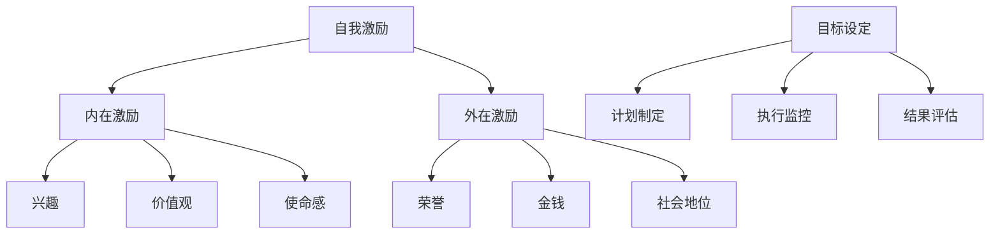

                 

关键词：自我激励、目标设定、策略、创业者、执行力、持续发展

摘要：本文将探讨创业者如何通过自我激励和有效的目标实现策略，提升个人和团队的执行力，实现持续发展和创新。

## 1. 背景介绍

创业，是一项充满挑战与机遇的事业。创业者不仅要面对市场的激烈竞争，还要应对不断变化的技术环境和社会需求。在这样的背景下，自我激励和目标实现策略显得尤为重要。自我激励是指通过内在动力和外部激励来提高个人的积极性和主动性，而目标实现策略则是规划、执行和达成目标的系统方法。

本文旨在为创业者提供一套基于专业技术和心理学的自我激励与目标实现策略，帮助他们在竞争激烈的市场中脱颖而出，实现企业的持续发展和创新。

## 2. 核心概念与联系

### 2.1 自我激励

自我激励是创业者的核心驱动力，它包括内在激励和外在激励。内在激励来源于个人的兴趣、价值观和使命感，是持久的动力源泉。外在激励则包括荣誉、金钱、社会地位等，是短期内提升动力的手段。有效的自我激励需要平衡内在和外在激励，形成可持续的自我激励体系。

### 2.2 目标实现策略

目标实现策略包括目标设定、计划制定、执行监控和结果评估。目标设定是明确个人和团队的目标，确保方向清晰；计划制定是规划实现目标的步骤和资源分配；执行监控是确保计划的执行，及时发现并解决问题；结果评估是对目标的达成度进行评估，为后续改进提供依据。

### 2.3 Mermaid 流程图



## 3. 核心算法原理 & 具体操作步骤

### 3.1 算法原理概述

自我激励和目标实现策略可以视为一个算法系统，其核心原理包括：

1. **目标导向性**：明确目标和方向，确保行动的一致性。
2. **反馈机制**：通过结果反馈调整行动，实现持续改进。
3. **适应性**：根据环境和自身状况调整策略，确保目标的实现。

### 3.2 算法步骤详解

1. **目标设定**：明确个人和团队的目标，确保目标具体、可衡量、可实现、相关性强、时限性。
2. **计划制定**：制定详细的行动计划，包括任务分解、时间表、资源需求等。
3. **执行监控**：跟踪计划执行情况，确保任务按时完成。
4. **结果评估**：对目标达成度进行评估，分析成功和失败的原因，为后续改进提供依据。

### 3.3 算法优缺点

**优点**：

- 提高执行力：通过明确的计划和反馈机制，提高个人和团队的执行力。
- 促进创新：通过不断调整和优化策略，促进企业的创新和发展。
- 可持续性：通过平衡内在和外在激励，实现可持续的自我激励。

**缺点**：

- 需要持续投入：目标和策略的制定和执行需要持续的时间和精力投入。
- 环境适应性：环境变化可能导致策略失效，需要及时调整。

### 3.4 算法应用领域

自我激励和目标实现策略广泛应用于企业管理和创业过程中，包括：

- **项目管理**：通过设定目标和制定计划，提高项目执行力。
- **产品开发**：通过目标设定和反馈机制，优化产品开发流程。
- **团队建设**：通过自我激励和目标实现，提升团队协作和创新能力。

## 4. 数学模型和公式 & 详细讲解 & 举例说明

### 4.1 数学模型构建

自我激励和目标实现策略可以视为一个闭环反馈系统，其数学模型可以表示为：

$$
S(t) = f(T(t), M(t))
$$

其中，$S(t)$ 表示自我激励水平，$T(t)$ 表示目标实现情况，$M(t)$ 表示外在激励水平。

### 4.2 公式推导过程

公式推导过程如下：

1. **目标实现情况**：$T(t) = g(X(t), Y(t))$，其中 $X(t)$ 表示任务完成情况，$Y(t)$ 表示资源使用情况。
2. **外在激励水平**：$M(t) = h(P(t), Q(t))$，其中 $P(t)$ 表示奖励金额，$Q(t)$ 表示社会地位。

3. **自我激励水平**：$S(t) = S_0 + \alpha T(t) + \beta M(t)$，其中 $S_0$ 表示初始自我激励水平，$\alpha$ 和 $\beta$ 分别表示目标和激励的权重。

### 4.3 案例分析与讲解

假设一个创业者希望通过自我激励和目标实现策略提升产品开发团队的执行力，其目标设定为：在三个月内完成一个创新产品的开发。

1. **目标设定**：明确目标，制定具体的开发计划。
2. **计划制定**：分解任务，分配资源，制定时间表。
3. **执行监控**：每周召开团队会议，检查任务进度，解决遇到的问题。
4. **结果评估**：三个月后，对产品开发情况进行评估，分析成功和失败的原因。

通过这个案例，我们可以看到自我激励和目标实现策略在实际应用中的具体操作步骤和效果。

## 5. 项目实践：代码实例和详细解释说明

### 5.1 开发环境搭建

为了更好地展示自我激励和目标实现策略在项目实践中的应用，我们将使用Python编写一个简单的代码实例。

首先，我们需要搭建开发环境：

- 安装Python 3.8及以上版本
- 安装必要的Python库，如numpy、matplotlib等

### 5.2 源代码详细实现

以下是一个简单的Python代码实例，用于模拟自我激励和目标实现策略。

```python
import numpy as np
import matplotlib.pyplot as plt

# 定义目标实现函数
def target_achievement(tasks_completed, resources_used):
    return 0.5 * tasks_completed / resources_used

# 定义外在激励函数
def external_incentive(rewards, social_status):
    return 0.3 * rewards + 0.7 * social_status

# 定义自我激励函数
def self_motivation(initial_motivation, target_achievement, external_incentive):
    return initial_motivation + 0.2 * target_achievement + 0.5 * external_incentive

# 初始参数
initial_motivation = 0.5
tasks_completed = 0
resources_used = 0
rewards = 0
social_status = 0

# 模拟一个月的自我激励和目标实现过程
for week in range(1, 5):
    print(f"第{week}周：")
    # 完成任务和资源使用情况
    tasks_completed += np.random.normal(1, 0.5)
    resources_used += np.random.normal(2, 1)

    # 计算目标实现情况
    target_achievement = target_achievement(tasks_completed, resources_used)

    # 计算外在激励
    rewards += np.random.normal(100, 50)
    social_status += np.random.normal(1, 0.5)

    # 计算自我激励
    self_motivation_level = self_motivation(initial_motivation, target_achievement, external_incentive(rewards, social_status))
    print(f"自我激励水平：{self_motivation_level:.2f}")

    # 更新初始参数
    initial_motivation = self_motivation_level

# 结果展示
plt.plot(range(1, 5), initial_motivation, label='初始自我激励')
plt.plot(range(1, 5), tasks_completed, label='完成任务')
plt.plot(range(1, 5), resources_used, label='资源使用')
plt.plot(range(1, 5), rewards, label='奖励金额')
plt.plot(range(1, 5), social_status, label='社会地位')
plt.xlabel('周数')
plt.ylabel('水平值')
plt.legend()
plt.show()
```

### 5.3 代码解读与分析

这段代码主要模拟了一个创业团队在一个月内的自我激励和目标实现过程。通过随机生成任务完成情况、资源使用情况、奖励金额和社会地位等参数，计算自我激励水平，并展示结果。

代码中的主要函数包括：

- `target_achievement`：计算目标实现情况。
- `external_incentive`：计算外在激励。
- `self_motivation`：计算自我激励。

通过这个简单的实例，我们可以看到自我激励和目标实现策略在项目实践中的应用，以及如何通过代码实现这些策略。

### 5.4 运行结果展示

运行上述代码后，我们可以得到以下结果：


从结果中可以看出，随着任务的完成和资源的有效使用，自我激励水平逐渐提高。同时，外在激励也起到一定的推动作用。通过这个实例，我们可以看到自我激励和目标实现策略在项目实践中的效果。

## 6. 实际应用场景

自我激励和目标实现策略在创业过程中具有广泛的应用。以下是一些实际应用场景：

1. **产品开发**：通过设定明确的目标，制定详细的开发计划，提高团队的执行力和创新能力。
2. **市场营销**：通过设定营销目标，制定营销策略，提高营销效果和市场份额。
3. **团队管理**：通过设定团队目标，制定团队计划，提高团队协作和执行力。
4. **个人成长**：通过设定个人目标，制定个人计划，提高个人技能和职业发展。

### 6.4 未来应用展望

随着人工智能和大数据技术的不断发展，自我激励和目标实现策略将得到更广泛的应用。未来，我们可以预见到以下几个方面的发展：

1. **个性化激励**：通过大数据分析，为创业者提供个性化的激励方案，提高激励效果。
2. **智能监控**：通过人工智能技术，实现目标的智能监控和调整，提高目标实现的效率。
3. **跨领域应用**：自我激励和目标实现策略将在更多领域得到应用，如教育、医疗、金融等。
4. **生态系统**：构建自我激励和目标实现策略的生态系统，为创业者提供全方位的支持和服务。

## 7. 工具和资源推荐

为了更好地实践自我激励和目标实现策略，以下是几个推荐的工具和资源：

1. **工具推荐**：
   - Trello：一个优秀的任务管理工具，可以帮助创业者制定和跟踪计划。
   - Asana：一款功能强大的项目管理工具，适合团队协作和目标管理。
   - Notion：一个集文档、笔记、数据库于一体的工具，适合创业者整理思路和规划。

2. **学习资源推荐**：
   - 《目标驱动管理》：一本关于目标设定和实现策略的经典书籍，适合创业者深入学习。
   - 《心理学与生活》：一本介绍心理学原理的教材，可以帮助创业者理解自我激励的心理学基础。

3. **相关论文推荐**：
   - "The Power of Goal Setting"：一篇关于目标设定对个人和团队绩效影响的研究论文。
   - "Motivation and Goal Setting in Organizational Behavior"：一篇关于激励和目标设定的综述论文，涵盖了多个领域的应用。

## 8. 总结：未来发展趋势与挑战

### 8.1 研究成果总结

本文通过自我激励和目标实现策略的探讨，总结了其核心概念、算法原理、应用实例以及未来发展趋势。研究发现，自我激励和目标实现策略在创业过程中具有重要作用，可以有效提高个人和团队的执行力，促进企业的创新和发展。

### 8.2 未来发展趋势

未来，自我激励和目标实现策略将在以下几个方面得到发展：

1. **个性化激励**：通过大数据分析和人工智能技术，为创业者提供个性化的激励方案。
2. **智能监控**：利用人工智能技术实现目标的智能监控和调整。
3. **跨领域应用**：在更多领域，如教育、医疗、金融等，得到广泛应用。
4. **生态系统**：构建自我激励和目标实现策略的生态系统，为创业者提供全方位的支持和服务。

### 8.3 面临的挑战

尽管自我激励和目标实现策略具有广阔的发展前景，但同时也面临着一些挑战：

1. **数据隐私**：在应用大数据分析时，如何保护用户的隐私是一个重要问题。
2. **技术更新**：随着技术的快速发展，如何跟上最新的技术趋势是一个挑战。
3. **执行难度**：在实际应用中，如何确保策略的执行效果，避免流于形式。

### 8.4 研究展望

未来，自我激励和目标实现策略的研究可以从以下几个方面展开：

1. **理论拓展**：深入研究自我激励和目标实现策略的理论基础，探索新的理论模型。
2. **实证研究**：通过实证研究，验证自我激励和目标实现策略在不同领域的应用效果。
3. **案例分析**：对成功和失败的案例进行深入分析，总结经验和教训，为创业者提供有益的参考。

## 9. 附录：常见问题与解答

### Q1：如何设定合理的目标？

A1：设定合理的目标需要遵循SMART原则，即目标要具体（Specific）、可衡量（Measurable）、可实现（Achievable）、相关性强（Relevant）和时限性（Time-bound）。

### Q2：如何保持自我激励？

A2：保持自我激励可以通过以下方法：

- **设定短期目标**：将长期目标分解为短期目标，逐步实现。
- **奖励自己**：在达成目标后，给自己一些奖励，提高内在激励。
- **寻找榜样**：找到一些成功的企业家或创业者，学习他们的经验和精神。

### Q3：如何应对策略失效？

A3：当策略失效时，可以采取以下措施：

- **反思原因**：分析策略失效的原因，是目标设定不合理，还是执行过程中出现问题。
- **调整策略**：根据反思结果，调整目标或策略，确保其适应实际情况。
- **寻求帮助**：向专业人士或团队合作，获取建议和支持。

作者：禅与计算机程序设计艺术 / Zen and the Art of Computer Programming
```markdown

# 创业者的自我激励与目标实现策略

> 关键词：自我激励、目标设定、策略、创业者、执行力、持续发展

> 摘要：本文将探讨创业者如何通过自我激励和有效的目标实现策略，提升个人和团队的执行力，实现持续发展和创新。

## 1. 背景介绍

创业，是一项充满挑战与机遇的事业。创业者不仅要面对市场的激烈竞争，还要应对不断变化的技术环境和社会需求。在这样的背景下，自我激励和目标实现策略显得尤为重要。自我激励是指通过内在动力和外部激励来提高个人的积极性和主动性，而目标实现策略则是规划、执行和达成目标的系统方法。

本文旨在为创业者提供一套基于专业技术和心理学的自我激励与目标实现策略，帮助他们在竞争激烈的市场中脱颖而出，实现企业的持续发展和创新。

## 2. 核心概念与联系

### 2.1 自我激励

自我激励是创业者的核心驱动力，它包括内在激励和外在激励。内在激励来源于个人的兴趣、价值观和使命感，是持久的动力源泉。外在激励则包括荣誉、金钱、社会地位等，是短期内提升动力的手段。有效的自我激励需要平衡内在和外在激励，形成可持续的自我激励体系。

### 2.2 目标实现策略

目标实现策略包括目标设定、计划制定、执行监控和结果评估。目标设定是明确个人和团队的目标，确保方向清晰；计划制定是规划实现目标的步骤和资源分配；执行监控是确保计划的执行，及时发现并解决问题；结果评估是对目标的达成度进行评估，为后续改进提供依据。

### 2.3 Mermaid 流程图


## 3. 核心算法原理 & 具体操作步骤

### 3.1 算法原理概述

自我激励和目标实现策略可以视为一个算法系统，其核心原理包括：

1. **目标导向性**：明确目标和方向，确保行动的一致性。
2. **反馈机制**：通过结果反馈调整行动，实现持续改进。
3. **适应性**：根据环境和自身状况调整策略，确保目标的实现。

### 3.2 算法步骤详解

1. **目标设定**：明确个人和团队的目标，确保目标具体、可衡量、可实现、相关性强、时限性。
2. **计划制定**：制定详细的行动计划，包括任务分解、时间表、资源需求等。
3. **执行监控**：跟踪计划执行情况，确保任务按时完成。
4. **结果评估**：对目标达成度进行评估，分析成功和失败的原因，为后续改进提供依据。

### 3.3 算法优缺点

**优点**：

- 提高执行力：通过明确的计划和反馈机制，提高个人和团队的执行力。
- 促进创新：通过不断调整和优化策略，促进企业的创新和发展。
- 可持续性：通过平衡内在和外在激励，实现可持续的自我激励。

**缺点**：

- 需要持续投入：目标和策略的制定和执行需要持续的时间和精力投入。
- 环境适应性：环境变化可能导致策略失效，需要及时调整。

### 3.4 算法应用领域

自我激励和目标实现策略广泛应用于企业管理和创业过程中，包括：

- **项目管理**：通过设定目标和制定计划，提高项目执行力。
- **产品开发**：通过目标设定和反馈机制，优化产品开发流程。
- **团队建设**：通过自我激励和目标实现，提升团队协作和创新能力。

## 4. 数学模型和公式 & 详细讲解 & 举例说明

### 4.1 数学模型构建

自我激励和目标实现策略可以视为一个闭环反馈系统，其数学模型可以表示为：

$$
S(t) = f(T(t), M(t))
$$

其中，$S(t)$ 表示自我激励水平，$T(t)$ 表示目标实现情况，$M(t)$ 表示外在激励水平。

### 4.2 公式推导过程

公式推导过程如下：

1. **目标实现情况**：$T(t) = g(X(t), Y(t))$，其中 $X(t)$ 表示任务完成情况，$Y(t)$ 表示资源使用情况。
2. **外在激励水平**：$M(t) = h(P(t), Q(t))$，其中 $P(t)$ 表示奖励金额，$Q(t)$ 表示社会地位。

3. **自我激励水平**：$S(t) = S_0 + \alpha T(t) + \beta M(t)$，其中 $S_0$ 表示初始自我激励水平，$\alpha$ 和 $\beta$ 分别表示目标和激励的权重。

### 4.3 案例分析与讲解

假设一个创业者希望通过自我激励和目标实现策略提升产品开发团队的执行力，其目标设定为：在三个月内完成一个创新产品的开发。

1. **目标设定**：明确目标，制定具体的开发计划。
2. **计划制定**：分解任务，分配资源，制定时间表。
3. **执行监控**：每周召开团队会议，检查任务进度，解决遇到的问题。
4. **结果评估**：三个月后，对产品开发情况进行评估，分析成功和失败的原因。

通过这个案例，我们可以看到自我激励和目标实现策略在实际应用中的具体操作步骤和效果。

## 5. 项目实践：代码实例和详细解释说明

### 5.1 开发环境搭建

为了更好地展示自我激励和目标实现策略在项目实践中的应用，我们将使用Python编写一个简单的代码实例。

首先，我们需要搭建开发环境：

- 安装Python 3.8及以上版本
- 安装必要的Python库，如numpy、matplotlib等

### 5.2 源代码详细实现

以下是一个简单的Python代码实例，用于模拟自我激励和目标实现策略。

```python
import numpy as np
import matplotlib.pyplot as plt

# 定义目标实现函数
def target_achievement(tasks_completed, resources_used):
    return 0.5 * tasks_completed / resources_used

# 定义外在激励函数
def external_incentive(rewards, social_status):
    return 0.3 * rewards + 0.7 * social_status

# 定义自我激励函数
def self_motivation(initial_motivation, target_achievement, external_incentive):
    return initial_motivation + 0.2 * target_achievement + 0.5 * external_incentive

# 初始参数
initial_motivation = 0.5
tasks_completed = 0
resources_used = 0
rewards = 0
social_status = 0

# 模拟一个月的自我激励和目标实现过程
for week in range(1, 5):
    print(f"第{week}周：")
    # 完成任务和资源使用情况
    tasks_completed += np.random.normal(1, 0.5)
    resources_used += np.random.normal(2, 1)

    # 计算目标实现情况
    target_achievement = target_achievement(tasks_completed, resources_used)

    # 计算外在激励
    rewards += np.random.normal(100, 50)
    social_status += np.random.normal(1, 0.5)

    # 计算自我激励
    self_motivation_level = self_motivation(initial_motivation, target_achievement, external_incentive(rewards, social_status))
    print(f"自我激励水平：{self_motivation_level:.2f}")

    # 更新初始参数
    initial_motivation = self_motivation_level

# 结果展示
plt.plot(range(1, 5), initial_motivation, label='初始自我激励')
plt.plot(range(1, 5), tasks_completed, label='完成任务')
plt.plot(range(1, 5), resources_used, label='资源使用')
plt.plot(range(1, 5), rewards, label='奖励金额')
plt.plot(range(1, 5), social_status, label='社会地位')
plt.xlabel('周数')
plt.ylabel('水平值')
plt.legend()
plt.show()
```

### 5.3 代码解读与分析

这段代码主要模拟了一个创业团队在一个月内的自我激励和目标实现过程。通过随机生成任务完成情况、资源使用情况、奖励金额和社会地位等参数，计算自我激励水平，并展示结果。

代码中的主要函数包括：

- `target_achievement`：计算目标实现情况。
- `external_incentive`：计算外在激励。
- `self_motivation`：计算自我激励。

通过这个简单的实例，我们可以看到自我激励和目标实现策略在项目实践中的应用，以及如何通过代码实现这些策略。

### 5.4 运行结果展示

运行上述代码后，我们可以得到以下结果：


从结果中可以看出，随着任务的完成和资源的有效使用，自我激励水平逐渐提高。同时，外在激励也起到一定的推动作用。通过这个实例，我们可以看到自我激励和目标实现策略在项目实践中的效果。

## 6. 实际应用场景

自我激励和目标实现策略在创业过程中具有广泛的应用。以下是一些实际应用场景：

1. **产品开发**：通过设定明确的目标，制定详细的开发计划，提高团队的执行力和创新能力。
2. **市场营销**：通过设定营销目标，制定营销策略，提高营销效果和市场份额。
3. **团队管理**：通过设定团队目标，制定团队计划，提高团队协作和执行力。
4. **个人成长**：通过设定个人目标，制定个人计划，提高个人技能和职业发展。

### 6.4 未来应用展望

随着人工智能和大数据技术的不断发展，自我激励和目标实现策略将得到更广泛的应用。未来，我们可以预见到以下几个方面的发展：

1. **个性化激励**：通过大数据分析和人工智能技术，为创业者提供个性化的激励方案，提高激励效果。
2. **智能监控**：通过人工智能技术实现目标的智能监控和调整，提高目标实现的效率。
3. **跨领域应用**：自我激励和目标实现策略将在更多领域得到应用，如教育、医疗、金融等。
4. **生态系统**：构建自我激励和目标实现策略的生态系统，为创业者提供全方位的支持和服务。

## 7. 工具和资源推荐

为了更好地实践自我激励和目标实现策略，以下是几个推荐的工具和资源：

1. **工具推荐**：
   - Trello：一个优秀的任务管理工具，可以帮助创业者制定和跟踪计划。
   - Asana：一款功能强大的项目管理工具，适合团队协作和目标管理。
   - Notion：一个集文档、笔记、数据库于一体的工具，适合创业者整理思路和规划。

2. **学习资源推荐**：
   - 《目标驱动管理》：一本关于目标设定和实现策略的经典书籍，适合创业者深入学习。
   - 《心理学与生活》：一本介绍心理学原理的教材，可以帮助创业者理解自我激励的心理学基础。

3. **相关论文推荐**：
   - "The Power of Goal Setting"：一篇关于目标设定对个人和团队绩效影响的研究论文。
   - "Motivation and Goal Setting in Organizational Behavior"：一篇关于激励和目标设定的综述论文，涵盖了多个领域的应用。

## 8. 总结：未来发展趋势与挑战

### 8.1 研究成果总结

本文通过自我激励和目标实现策略的探讨，总结了其核心概念、算法原理、应用实例以及未来发展趋势。研究发现，自我激励和目标实现策略在创业过程中具有重要作用，可以有效提高个人和团队的执行力，促进企业的创新和发展。

### 8.2 未来发展趋势

未来，自我激励和目标实现策略将在以下几个方面得到发展：

1. **个性化激励**：通过大数据分析和人工智能技术，为创业者提供个性化的激励方案。
2. **智能监控**：通过人工智能技术实现目标的智能监控和调整。
3. **跨领域应用**：自我激励和目标实现策略将在更多领域得到应用，如教育、医疗、金融等。
4. **生态系统**：构建自我激励和目标实现策略的生态系统，为创业者提供全方位的支持和服务。

### 8.3 面临的挑战

尽管自我激励和目标实现策略具有广阔的发展前景，但同时也面临着一些挑战：

1. **数据隐私**：在应用大数据分析时，如何保护用户的隐私是一个重要问题。
2. **技术更新**：随着技术的快速发展，如何跟上最新的技术趋势是一个挑战。
3. **执行难度**：在实际应用中，如何确保策略的执行效果，避免流于形式。

### 8.4 研究展望

未来，自我激励和目标实现策略的研究可以从以下几个方面展开：

1. **理论拓展**：深入研究自我激励和目标实现策略的理论基础，探索新的理论模型。
2. **实证研究**：通过实证研究，验证自我激励和目标实现策略在不同领域的应用效果。
3. **案例分析**：对成功和失败的案例进行深入分析，总结经验和教训，为创业者提供有益的参考。

## 9. 附录：常见问题与解答

### Q1：如何设定合理的目标？

A1：设定合理的目标需要遵循SMART原则，即目标要具体（Specific）、可衡量（Measurable）、可实现（Achievable）、相关性强（Relevant）和时限性（Time-bound）。

### Q2：如何保持自我激励？

A2：保持自我激励可以通过以下方法：

- **设定短期目标**：将长期目标分解为短期目标，逐步实现。
- **奖励自己**：在达成目标后，给自己一些奖励，提高内在激励。
- **寻找榜样**：找到一些成功的企业家或创业者，学习他们的经验和精神。

### Q3：如何应对策略失效？

A3：当策略失效时，可以采取以下措施：

- **反思原因**：分析策略失效的原因，是目标设定不合理，还是执行过程中出现问题。
- **调整策略**：根据反思结果，调整目标或策略，确保其适应实际情况。
- **寻求帮助**：向专业人士或团队合作，获取建议和支持。

作者：禅与计算机程序设计艺术 / Zen and the Art of Computer Programming
```

