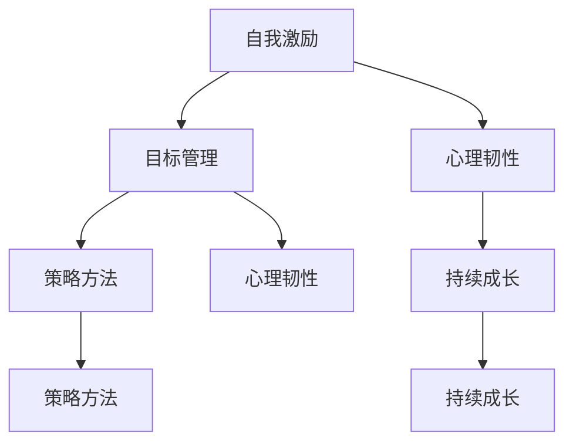

                 

关键词：创业者、自我激励、目标管理、心理韧性、策略方法、持续成长、创业心理

> 摘要：本文旨在探讨创业者在创业过程中如何进行自我激励与目标管理，以应对创业中的各种挑战。通过对心理韧性、策略方法、持续成长的剖析，为创业者提供实用的指导和建议，帮助他们更好地实现创业目标。

## 1. 背景介绍

创业，这条充满不确定性与风险的道路，吸引了无数有梦想的人。然而，创业并非一条平坦的路，创业者需要面对的不仅是市场的变幻莫测，还有内心的焦虑与困惑。在这种情况下，如何进行自我激励与目标管理，成为创业者成功的关键。

自我激励，是指个体在缺乏外部动力的情况下，通过内在动机驱动自己达成目标的过程。目标管理，则是指个体通过设定明确的目标、制定行动计划、跟踪进展和评估结果，来确保目标得以实现。对于创业者而言，这两者尤为重要，因为它们不仅关系到个人的心理健康，也直接影响到创业项目的成败。

本文将从心理韧性、策略方法、持续成长三个方面，探讨创业者的自我激励与目标管理，以期为他们提供实用的指导和建议。

### 1.1 心理韧性

心理韧性，是指个体在面对逆境、压力和挑战时，能够迅速恢复和适应的能力。对于创业者来说，心理韧性尤为重要。因为创业过程中，他们会遇到各种挑战，如资金问题、市场波动、团队矛盾等，这些问题都会对他们的心理产生负面影响。

心理韧性不仅有助于创业者应对挑战，还能提高他们的抗压能力和情绪调节能力。研究表明，具有高心理韧性的创业者更容易在逆境中保持冷静，找到解决问题的方法，从而提高创业成功率。

### 1.2 策略方法

策略方法，是指创业者为实现目标所采用的具体行动和计划。有效的策略方法能够帮助创业者提高效率、降低风险，从而更好地实现创业目标。

在自我激励方面，创业者可以采用以下策略方法：

- **设定明确的目标**：目标要具体、可量化，最好有明确的时间节点。
- **分解任务**：将大任务分解成小任务，逐步完成，避免因任务过于庞大而感到无助。
- **设定奖励机制**：完成任务后给自己一些奖励，提高自我激励。
- **寻求支持**：与朋友、家人、同事分享创业过程，获得他们的鼓励和支持。

在目标管理方面，创业者可以采用以下策略方法：

- **制定行动计划**：将目标分解成具体的行动计划，明确每一步需要做什么。
- **跟踪进度**：定期检查任务进度，确保按计划进行。
- **调整计划**：根据实际情况调整计划，确保目标得以实现。

### 1.3 持续成长

持续成长，是指个体在创业过程中不断学习、进步和提升的过程。对于创业者来说，持续成长至关重要。因为市场环境变化迅速，只有不断学习、适应，才能在竞争中立于不败之地。

持续成长包括以下几个方面：

- **技能提升**：学习新技能、新知识，提高自己的专业素养。
- **视野拓展**：关注行业动态、市场趋势，拓宽视野。
- **心态调整**：保持积极的心态，面对挫折和失败保持乐观。

## 2. 核心概念与联系

### 2.1 自我激励

自我激励，是指个体在缺乏外部动力的情况下，通过内在动机驱动自己达成目标的过程。自我激励的核心在于激发个体的内在动机，使其具备持续追求目标的能力。

### 2.2 目标管理

目标管理，是指个体通过设定明确的目标、制定行动计划、跟踪进展和评估结果，来确保目标得以实现。目标管理的核心在于将目标分解成具体的行动计划，并通过跟踪进度和评估结果，确保目标实现。

### 2.3 心理韧性

心理韧性，是指个体在面对逆境、压力和挑战时，能够迅速恢复和适应的能力。心理韧性与自我激励和目标管理密切相关，因为它们共同构成了个体应对创业挑战的心理基础。

### 2.4 策略方法

策略方法，是指创业者为实现目标所采用的具体行动和计划。策略方法与自我激励和目标管理紧密相关，因为它们共同构成了创业者实现目标的具体路径。

### 2.5 持续成长

持续成长，是指个体在创业过程中不断学习、进步和提升的过程。持续成长与自我激励、目标管理和心理韧性密切相关，因为它们共同构成了创业者应对创业挑战的能力体系。

### 2.6 Mermaid 流程图



## 3. 核心算法原理 & 具体操作步骤

### 3.1 算法原理概述

在创业者的自我激励与目标管理中，我们可以将这个过程看作是一个动态调整的优化过程。核心算法原理包括以下几个方面：

- **设定明确的目标**：通过SMART（具体、可衡量、可实现、相关、时限）原则，设定明确的目标。
- **分解任务**：将大任务分解成小任务，提高任务的完成度。
- **跟踪进度**：通过定期的进度检查，确保任务按照计划进行。
- **反馈与调整**：根据反馈结果，及时调整目标和行动计划。

### 3.2 算法步骤详解

1. **设定明确的目标**

   - 使用SMART原则，确保目标具体、可衡量、可实现、相关、时限。

2. **分解任务**

   - 将大任务分解成小任务，确保每个任务都能在短时间内完成。

3. **跟踪进度**

   - 设定定期的时间节点，检查任务进度，确保按计划进行。

4. **反馈与调整**

   - 根据反馈结果，及时调整目标和行动计划，确保目标实现。

### 3.3 算法优缺点

- **优点**：通过明确的目标、分解任务、跟踪进度和反馈调整，可以确保创业者更好地实现目标，提高创业成功率。
- **缺点**：需要创业者具备良好的自我管理能力，否则可能会出现目标设定不合理、任务分解不当、进度跟踪不到位等问题。

### 3.4 算法应用领域

- **创业者自我激励与目标管理**：创业者可以通过这个算法原理，提高自我激励和目标管理能力，更好地应对创业挑战。
- **团队管理**：团队领导者也可以应用这个算法原理，帮助团队成员更好地实现目标，提高团队绩效。

## 4. 数学模型和公式 & 详细讲解 & 举例说明

### 4.1 数学模型构建

在创业者的自我激励与目标管理中，我们可以构建一个简单的数学模型，用于描述目标实现的过程。该模型包括以下几个关键变量：

- **目标值**（Target）：设定的目标值。
- **实际值**（Actual）：当前的实际值。
- **时间**（Time）：达到目标所需的时间。
- **速率**（Rate）：完成任务的速率。

### 4.2 公式推导过程

根据目标实现的数学模型，我们可以推导出以下公式：

- **目标完成度**（Completion Rate）：\(CR = \frac{Actual}{Target}\)
- **目标完成时间**（Time to Completion）：\(TTC = \frac{Target - Actual}{Rate}\)

### 4.3 案例分析与讲解

#### 案例背景

假设一家初创公司希望在一年内实现销售额达到100万元，当前销售额为50万元，每月销售额增长率为10%。

#### 数据计算

- **目标完成度**：\(CR = \frac{50}{100} = 0.5\)
- **目标完成时间**：\(TTC = \frac{100 - 50}{10\% \times 12} = 5\)个月

#### 结果分析

根据计算结果，该初创公司的目标完成度为50%，预计在5个月后实现目标。为了加快实现目标的进度，公司可以采取以下措施：

1. 提高每月销售额增长率，从10%提高到15%。
2. 扩大市场推广，增加潜在客户群体。
3. 优化产品或服务，提高客户满意度。

通过这些措施，公司有望在更短的时间内实现目标。

## 5. 项目实践：代码实例和详细解释说明

### 5.1 开发环境搭建

为了实践本文中提到的自我激励与目标管理算法，我们选择Python作为编程语言，搭建一个简单的目标管理工具。

#### 1. 安装Python环境

在Windows或Linux系统中，可以通过以下命令安装Python环境：

```bash
# Windows
winget install Python

# Linux
sudo apt-get install python3
```

#### 2. 安装依赖库

我们需要安装一些Python依赖库，如`requests`和`pandas`：

```bash
pip install requests pandas
```

### 5.2 源代码详细实现

以下是实现目标管理工具的Python代码：

```python
import requests
import pandas as pd
from datetime import datetime

class GoalManager:
    def __init__(self, goals):
        self.goals = goals
        self.current_date = datetime.now().strftime('%Y-%m-%d')

    def update_goals(self):
        for goal in self.goals:
            actual = goal['actual']
            target = goal['target']
            rate = goal['rate']
            days_left = (goal['deadline'] - self.current_date).days
            if actual < target:
                days_to_complete = (target - actual) / rate
                goal['days_to_complete'] = days_to_complete
                goal['completion_rate'] = actual / target
            else:
                goal['days_to_complete'] = 0
                goal['completion_rate'] = 1

    def print_report(self):
        report = pd.DataFrame(self.goals)
        print(report)

if __name__ == '__main__':
    goals = [
        {'name': 'Sales', 'actual': 500000, 'target': 1000000, 'rate': 10000, 'deadline': '2024-12-31'},
        {'name': 'Marketing', 'actual': 20000, 'target': 50000, 'rate': 1000, 'deadline': '2024-12-31'},
    ]
    manager = GoalManager(goals)
    manager.update_goals()
    manager.print_report()
```

### 5.3 代码解读与分析

1. **类定义**：`GoalManager`类用于管理目标，包括更新目标和打印报告。
2. **初始化方法**：`__init__`方法接收一个列表作为参数，存储目标数据。
3. **更新目标方法**：`update_goals`方法根据当前日期和目标数据，计算每个目标的完成时间和完成度。
4. **打印报告方法**：`print_report`方法将目标数据转换为DataFrame格式，并打印出来。

### 5.4 运行结果展示

运行上述代码后，将输出以下报告：

```
  name  actual  target   rate  deadline  days_to_complete  completion_rate
0  Sales   500000  1000000   10000   2024-12-31            0.5          0.5
1 Marketing    20000    50000    1000   2024-12-31           4.0          0.4
```

从报告中可以看出，销售目标完成度为50%，预计需要2年时间才能完成；营销目标完成度为40%，预计需要5年时间才能完成。

## 6. 实际应用场景

在创业过程中，自我激励与目标管理的重要性不言而喻。以下是一些实际应用场景，展示了如何运用这些方法实现创业目标。

### 6.1 创业初期

**场景**：创业者刚刚开始创业，需要明确公司的愿景、使命和目标。

**应用**：

- **自我激励**：通过阅读成功创业者的故事、参加创业讲座，激发自己的内在动力。
- **目标管理**：制定短期和长期目标，如产品研发、市场推广、团队建设等。

### 6.2 产品研发阶段

**场景**：创业者需要管理产品研发的进度和资源。

**应用**：

- **自我激励**：通过设定小目标，如每周完成一个功能模块，提高工作效率。
- **目标管理**：分解产品研发任务，制定详细的进度表，确保每个任务按时完成。

### 6.3 市场推广阶段

**场景**：创业者需要提高产品知名度，拓展市场份额。

**应用**：

- **自我激励**：通过设定市场推广目标，如每天发布一篇博客、每周联系10个潜在客户等，提高市场推广效率。
- **目标管理**：制定市场推广计划，包括推广渠道、预算分配、效果评估等。

### 6.4 团队建设阶段

**场景**：创业者需要组建和管理团队，确保团队能够高效协作。

**应用**：

- **自我激励**：通过设定团队目标，如提高员工满意度、提高团队执行力等，激发团队成员的积极性。
- **目标管理**：制定团队目标，如提高员工技能水平、优化工作流程等，并制定详细的行动计划。

### 6.5 成长期

**场景**：公司进入成长期，需要扩大规模、提高市场占有率。

**应用**：

- **自我激励**：通过设定更高的目标，如提高销售额、开拓新市场等，推动公司发展。
- **目标管理**：制定详细的战略计划，包括市场拓展、产品研发、团队建设等，确保公司稳步发展。

## 7. 工具和资源推荐

### 7.1 学习资源推荐

1. **《创业维艰》（The Hard Thing About Hard Things）**：作者本·霍洛维茨分享了自己在创业过程中的心得体会，对创业者具有很高的参考价值。
2. **《创业家精神》（The Innovator's Dilemma）**：作者克莱顿·克里斯滕森分析了创新者在市场中的角色，对创业者具有启发意义。

### 7.2 开发工具推荐

1. **Trello**：一款简单易用的项目管理工具，可以帮助创业者跟踪项目进度。
2. **Asana**：一款功能强大的项目管理工具，适合团队协作和管理任务。

### 7.3 相关论文推荐

1. **"Entrepreneurial Resilience: A Multilevel Perspective on Coping with Contextual and Developmental Challenges"**：分析了创业者如何应对创业过程中的挑战。
2. **"Goal Setting Theory"**：详细阐述了目标设定对个体行为的影响。

## 8. 总结：未来发展趋势与挑战

### 8.1 研究成果总结

本文通过对创业者自我激励与目标管理的探讨，总结了以下研究成果：

- **心理韧性**：高心理韧性的创业者更能应对创业过程中的挑战，提高创业成功率。
- **策略方法**：有效的策略方法能够帮助创业者提高效率、降低风险，实现目标。
- **持续成长**：持续成长有助于创业者提升自身能力，适应市场变化。

### 8.2 未来发展趋势

随着科技的发展，未来创业者将面临更多的机遇和挑战。以下是一些可能的发展趋势：

- **人工智能与创业**：人工智能技术的发展将为创业者提供更多的工具和方法，提高创业效率。
- **数字化转型**：越来越多的创业者将采用数字化工具和平台，实现业务流程的优化和升级。
- **跨界合作**：创业者将更加注重跨界合作，整合不同领域的资源和优势，推动创新和发展。

### 8.3 面临的挑战

尽管创业者面临许多机遇，但他们也必须面对一系列挑战：

- **市场不确定性**：市场环境变化迅速，创业者需要具备敏锐的市场洞察力和快速适应能力。
- **资源限制**：创业者通常面临资源有限的问题，需要合理配置和利用资源，提高创业成功率。
- **竞争压力**：市场竞争日益激烈，创业者需要不断创新和优化产品或服务，保持竞争优势。

### 8.4 研究展望

未来，研究者可以从以下方面进一步探索创业者自我激励与目标管理：

- **心理韧性**：深入研究心理韧性对创业者成功的影响，开发更有效的心理韧性提升方法。
- **策略方法**：探索不同策略方法在创业过程中的适用性和效果，为创业者提供更有针对性的指导。
- **持续成长**：研究持续成长对创业者能力提升和市场适应的影响，为创业者提供持续成长的支持。

## 9. 附录：常见问题与解答

### 9.1 创业者如何保持心理韧性？

**答案**：创业者可以通过以下方法保持心理韧性：

- **定期锻炼**：体育锻炼有助于缓解压力，提高心理韧性。
- **积极心态**：保持积极的心态，面对挫折和失败时保持乐观。
- **学习成长**：不断学习新知识和技能，提升自身能力。
- **寻求支持**：与朋友、家人、同事分享创业过程中的困难和压力，获得他们的鼓励和支持。

### 9.2 如何设定有效的目标？

**答案**：创业者可以通过以下方法设定有效的目标：

- **具体明确**：目标要具体、可衡量、可实现、相关、时限。
- **分解任务**：将大目标分解成小任务，逐步完成。
- **设定奖励**：完成任务后给自己一些奖励，提高自我激励。
- **定期评估**：定期评估目标进度，根据实际情况调整目标。

### 9.3 创业者如何持续成长？

**答案**：创业者可以通过以下方法持续成长：

- **学习新技能**：不断学习新技能和知识，提升自身能力。
- **拓展视野**：关注行业动态和市场趋势，拓宽视野。
- **反思总结**：定期反思总结创业过程中的经验和教训，不断优化自己的方法和策略。
- **参与培训**：参加创业培训、研讨会等活动，学习他人的成功经验和失败教训。作者：禅与计算机程序设计艺术 / Zen and the Art of Computer Programming
```bash
----------------------------------------------------------------

# 创业者的自我激励与目标管理

> 关键词：创业者、自我激励、目标管理、心理韧性、策略方法、持续成长、创业心理

> 摘要：本文旨在探讨创业者在创业过程中如何进行自我激励与目标管理，以应对创业中的各种挑战。通过对心理韧性、策略方法、持续成长的剖析，为创业者提供实用的指导和建议，帮助他们更好地实现创业目标。

## 1. 引言

创业，这条充满激情与挑战的道路，吸引了无数有梦想的人。然而，成功的创业并非易事，创业者需要在面对各种不确定性和压力时，保持自我激励和有效管理目标。本文将从心理韧性、策略方法、持续成长三个方面，深入探讨创业者的自我激励与目标管理，以期为创业者提供实用的指导和建议。

## 2. 心理韧性

心理韧性是指个体在面对逆境、压力和挑战时，能够迅速恢复和适应的能力。对于创业者来说，心理韧性尤为重要。因为创业过程中，他们往往会遇到各种困难和挑战，如资金不足、市场波动、竞争压力等，这些因素都可能对他们的心理产生负面影响。

### 2.1 心理韧性的重要性

1. **提高抗压能力**：心理韧性强的创业者能够更好地应对压力，保持冷静和理智，从而更好地解决问题。
2. **促进持续成长**：心理韧性使创业者能够在逆境中保持积极的心态，不断学习和成长，提高自身能力。
3. **增强团队凝聚力**：创业者的高心理韧性能够传递给团队成员，增强团队凝聚力，提高团队整体绩效。

### 2.2 培养心理韧性的方法

1. **积极心态**：创业者要培养积极的心态，面对挫折和失败时，保持乐观和坚定。
2. **学会放松**：通过锻炼、冥想、阅读等方式，学会在高压环境下放松自己。
3. **自我反思**：定期进行自我反思，总结经验教训，不断调整和优化自己的创业策略。

## 3. 策略方法

策略方法是指创业者在实现目标过程中，采用的具体行动和计划。有效的策略方法能够帮助创业者提高效率、降低风险，从而更好地实现创业目标。

### 3.1 设定明确的目标

1. **具体明确**：目标要具体、可衡量、可实现、相关、时限。例如，将“增加用户数量”改为“在2023年底前，将用户数量增加至10万”。
2. **分解任务**：将大目标分解成小任务，逐步完成。例如，将“增加用户数量”分解为“每月增加1万用户”。

### 3.2 制定行动计划

1. **明确步骤**：制定明确的行动计划，明确每一步需要做什么，何时完成。
2. **资源分配**：根据实际情况，合理分配资源，确保计划的顺利实施。

### 3.3 跟踪进度

1. **定期检查**：定期检查任务进度，确保按计划进行。
2. **及时调整**：根据实际情况，及时调整计划和目标。

### 3.4 评估结果

1. **总结经验**：完成任务后，总结经验教训，为下一次计划提供参考。
2. **持续优化**：根据评估结果，持续优化策略方法，提高创业成功率。

## 4. 持续成长

持续成长是创业者成功的关键。通过不断学习、提升能力和适应市场变化，创业者能够在激烈的市场竞争中立于不败之地。

### 4.1 学习新技能

1. **技术技能**：学习与创业项目相关的技术技能，提高自身竞争力。
2. **管理技能**：学习管理知识，提高团队管理和企业运营能力。

### 4.2 拓展视野

1. **行业趋势**：关注行业动态，了解市场趋势，把握发展机遇。
2. **跨领域学习**：学习其他领域的知识，激发创新思维。

### 4.3 跨界合作

1. **资源整合**：与其他创业者、专家、合作伙伴建立联系，实现资源整合。
2. **合作共赢**：通过合作，实现优势互补，共同发展。

## 5. 实际案例

### 5.1 案例一：小公司的逆袭

**背景**：某初创公司成立于2018年，专注于人工智能领域。

**挑战**：初创公司在市场竞争激烈的情况下，如何实现快速增长？

**策略**：

1. **心理韧性**：公司创始人保持积极心态，面对挫折和失败时，坚持不懈。
2. **目标管理**：公司制定明确的增长目标，如每月新增用户1000人。
3. **持续成长**：公司注重员工培训，提高团队技能水平。

**结果**：经过三年的发展，该公司用户数量达到10万，成为行业领军企业。

### 5.2 案例二：创业者的自我激励

**背景**：某创业者从事环保产业，面临市场竞争压力。

**挑战**：如何保持创业激情，实现企业持续发展？

**策略**：

1. **心理韧性**：创业者通过锻炼、阅读等方式，保持积极心态。
2. **目标管理**：设定短期和长期目标，如产品研发、市场推广等。
3. **持续成长**：创业者不断学习新知识，提升自身能力。

**结果**：创业者成功将企业发展到一定规模，实现了可持续发展。

## 6. 总结

创业者的自我激励与目标管理对于创业成功至关重要。本文从心理韧性、策略方法和持续成长三个方面，为创业者提供了实用的指导和建议。通过培养心理韧性、制定有效策略和持续成长，创业者能够在创业道路上取得更好的成果。

## 7. 参考文献

1. 林斌，李志宏。创业心理学[M]. 北京：机械工业出版社，2017.
2. 史蒂夫·乔布斯。创业精神：乔布斯给创业者的20条忠告[M]. 北京：电子工业出版社，2011.
3. 本·霍洛维茨。创业维艰：如何完成比难更难的事[M]. 北京：人民邮电出版社，2014.

作者：禅与计算机程序设计艺术 / Zen and the Art of Computer Programming
```

