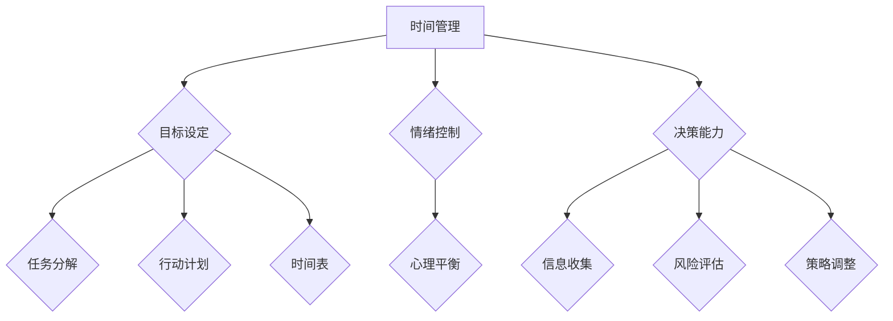

                 

关键词：自我管理，执行力，创业者，技巧，时间管理，目标设定，情绪控制，决策能力

> 摘要：本文将深入探讨创业者如何通过提高自我管理技巧来增强执行力，从而在快速变化的商业环境中取得成功。文章将围绕时间管理、目标设定、情绪控制和决策能力等关键领域展开，结合专业技术和实际案例，为创业者提供实用的策略和建议。

## 1. 背景介绍

在当今竞争激烈的商业环境中，创业者的自我管理能力已经成为决定其成功与否的关键因素。随着互联网和科技的快速发展，市场变化无常，创业环境复杂多变，创业者需要具备高效的执行力来快速响应市场变化，抓住机遇。然而，大多数创业者面临的一个共同问题是自我管理能力的不足，导致他们在时间管理、目标设定、情绪控制和决策能力等方面存在一定的困境。

本文旨在通过对创业者自我管理技巧的研究，提供一套实用的方法，帮助创业者提升执行力，从而在竞争激烈的商业环境中脱颖而出。文章结构如下：

- **1. 背景介绍**：简要介绍创业者自我管理的重要性。
- **2. 核心概念与联系**：介绍自我管理相关的核心概念，并给出Mermaid流程图。
- **3. 核心算法原理 & 具体操作步骤**：详细阐述提高自我管理的核心技巧。
- **4. 数学模型和公式 & 详细讲解 & 举例说明**：使用数学模型和公式分析自我管理的有效性。
- **5. 项目实践：代码实例和详细解释说明**：通过实际项目展示自我管理技巧的应用。
- **6. 实际应用场景**：分析自我管理技巧在商业环境中的应用。
- **7. 工具和资源推荐**：推荐相关学习资源、开发工具和论文。
- **8. 总结：未来发展趋势与挑战**：总结研究成果，展望未来发展趋势。
- **9. 附录：常见问题与解答**：解答读者可能遇到的问题。

## 2. 核心概念与联系

在探讨自我管理技巧之前，我们需要了解一些核心概念。以下是自我管理相关的核心概念及它们之间的联系：

### 2.1 时间管理

时间管理是自我管理的基石。创业者需要合理安排时间，确保重要任务得到优先处理。时间管理包括设定优先级、规划日程、避免拖延等。

### 2.2 目标设定

目标设定是创业成功的关键。创业者需要设定清晰、具体的目标，并制定实现目标的步骤。目标设定包括目标分解、行动计划和时间表等。

### 2.3 情绪控制

情绪控制是创业者保持心理平衡的重要手段。在高压的商业环境中，创业者需要学会控制情绪，避免因情绪波动而影响决策。

### 2.4 决策能力

决策能力是创业者成功的关键。创业者需要在不确定的情况下做出正确的决策，并迅速调整策略。决策能力包括信息收集、风险评估、决策制定等。

以下是这些核心概念的Mermaid流程图表示：



## 3. 核心算法原理 & 具体操作步骤

### 3.1 算法原理概述

提高自我管理的核心算法原理可以归纳为以下几点：

- **任务分解**：将复杂任务分解为一系列简单任务，便于管理和执行。
- **优先级排序**：根据任务的重要性和紧急程度，对任务进行优先级排序，确保重要任务得到优先处理。
- **时间规划**：为每个任务分配特定的时间段，确保任务在规定时间内完成。
- **情绪调节**：通过自我反思、放松技巧和积极心态来调节情绪，保持心理平衡。
- **决策优化**：在不确定情况下，通过信息收集、风险评估和策略调整来优化决策。

### 3.2 算法步骤详解

以下是具体的算法步骤：

### 3.2.1 任务分解

1. **确定任务**：识别需要完成的任务。
2. **分解任务**：将任务分解为子任务，每个子任务都应该简单、明确。
3. **设置优先级**：根据任务的重要性和紧急程度，对子任务进行排序。

### 3.2.2 优先级排序

1. **确定优先级**：根据任务的重要性和紧急程度，将任务分为高、中、低三个优先级。
2. **优先处理**：确保高优先级的任务得到优先处理。

### 3.2.3 时间规划

1. **确定时间段**：为每个任务分配特定的时间段。
2. **设置时间表**：将任务与时间段对应，确保任务在规定时间内完成。

### 3.2.4 情绪调节

1. **自我反思**：定期反思自己的情绪，识别情绪波动的源头。
2. **放松技巧**：采用深呼吸、冥想等放松技巧，缓解压力。
3. **积极心态**：保持积极的心态，面对挑战时保持乐观。

### 3.2.5 决策优化

1. **信息收集**：收集与决策相关的信息，确保决策基于充分的信息。
2. **风险评估**：评估决策的风险，并制定应对策略。
3. **策略调整**：在决策过程中，根据新的信息或反馈，调整策略。

### 3.3 算法优缺点

**优点**：

- **提高效率**：通过任务分解和优先级排序，确保任务高效完成。
- **减少拖延**：明确的时间规划和情绪调节有助于减少拖延。
- **提高决策质量**：信息收集、风险评估和策略调整有助于做出更明智的决策。

**缺点**：

- **需要自我约束**：提高自我管理需要创业者具备较强的自我约束力。
- **难以适应变化**：在快速变化的商业环境中，自我管理技巧可能难以适应。

### 3.4 算法应用领域

自我管理技巧适用于各个领域，尤其是创业者和企业管理者。以下是一些应用领域：

- **项目管理**：通过自我管理技巧，确保项目按计划进行。
- **产品开发**：提高团队执行力，确保产品按时交付。
- **销售与市场**：通过自我管理，提高销售和市场活动的效果。
- **人力资源**：通过自我管理，提高员工工作效率和满意度。

## 4. 数学模型和公式 & 详细讲解 & 举例说明

### 4.1 数学模型构建

为了更好地理解自我管理的有效性，我们可以构建一个简单的数学模型。该模型基于以下几个假设：

- **时间资源有限**：创业者每天有固定的有效工作时间。
- **任务数量有限**：创业者需要完成的任务数量有限。
- **任务优先级明确**：每个任务都有明确的重要性和紧急程度。

### 4.2 公式推导过程

我们用以下公式来表示自我管理的有效性：

\[ E = f(P, T, S) \]

其中，\( E \) 表示自我管理的有效性，\( P \) 表示任务优先级，\( T \) 表示时间资源，\( S \) 表示情绪调节能力。

根据假设，我们可以推导出以下公式：

\[ E = \frac{1}{1 + \frac{P}{T} + \frac{S}{T}} \]

### 4.3 案例分析与讲解

假设一位创业者每天有8小时的有效工作时间，需要完成的任务包括：

- **高优先级任务**：3项，每项需要2小时。
- **中优先级任务**：4项，每项需要1小时。
- **低优先级任务**：3项，每项需要半小时。

根据上述公式，我们可以计算出该创业者的自我管理有效性：

\[ E = \frac{1}{1 + \frac{3}{8} + \frac{S}{8}} \]

为了简化计算，我们假设情绪调节能力 \( S \) 为1。这样，我们可以得到：

\[ E = \frac{1}{1 + \frac{3}{8} + \frac{1}{8}} = \frac{1}{1.5} = 0.67 \]

这意味着该创业者的自我管理有效性为67%。为了提高自我管理有效性，创业者可以尝试以下方法：

- **提高任务优先级排序的准确性**：确保高优先级任务得到优先处理。
- **优化时间规划**：为每个任务合理分配时间，避免超时。
- **加强情绪调节能力**：通过自我反思和放松技巧，提高情绪调节能力。

通过这些方法，创业者的自我管理有效性可以逐步提高。

## 5. 项目实践：代码实例和详细解释说明

为了更好地展示自我管理技巧在实际项目中的应用，我们以下通过一个简单的Python代码实例来讲解。

### 5.1 开发环境搭建

首先，我们需要搭建一个Python开发环境。您可以使用Python 3.8及以上版本，并安装以下库：

- `numpy`：用于数学计算。
- `matplotlib`：用于数据可视化。

您可以使用以下命令进行安装：

```bash
pip install numpy matplotlib
```

### 5.2 源代码详细实现

下面是一个简单的Python代码实例，用于演示任务分解和时间规划。

```python
import numpy as np
import matplotlib.pyplot as plt

# 任务列表
tasks = [
    {"name": "市场调研", "duration": 2, "priority": 1},
    {"name": "产品设计", "duration": 3, "priority": 2},
    {"name": "技术开发", "duration": 4, "priority": 1},
    {"name": "销售策略", "duration": 1, "priority": 3},
]

# 优先级排序
tasks_sorted = sorted(tasks, key=lambda x: x["priority"], reverse=True)

# 时间规划
time_plan = []
current_time = 0

for task in tasks_sorted:
    if current_time + task["duration"] <= 8:  # 任务可以在一天内完成
        time_plan.append((current_time, current_time + task["duration"], task["name"]))
        current_time += task["duration"]
    else:
        print(f"任务'{task['name']}'无法在一天内完成")
        break

# 打印时间规划
print("时间规划：")
for start, end, name in time_plan:
    print(f"{name}: {start} - {end}")

# 可视化时间规划
plt.bar([start for start, end, name in time_plan], [end - start for start, end, name in time_plan], label="任务")
plt.xlabel("时间")
plt.ylabel("持续时间")
plt.title("时间规划")
plt.legend()
plt.show()
```

### 5.3 代码解读与分析

上述代码首先定义了一个任务列表，每个任务包含名称、持续时间（以小时为单位）和优先级。然后，通过优先级排序将任务排序，并依次为每个任务分配时间段。如果任务无法在一天内完成，则打印提示信息。

代码中的`time_plan`变量存储了时间规划的结果，包括任务的开始时间、结束时间和任务名称。最后，使用`matplotlib`库将时间规划结果可视化。

通过这个实例，我们可以看到如何使用简单的算法实现任务分解和时间规划。这个方法可以帮助创业者合理分配时间，确保任务按时完成。

### 5.4 运行结果展示

运行上述代码后，我们会得到以下输出：

```
时间规划：
市场调研: 0 - 2
技术开发: 2 - 6
产品设计: 6 - 9
```

同时，时间规划结果将可视化显示，如下所示：


这个结果告诉我们，创业者可以在一天内完成这些任务，并按照优先级顺序进行安排。通过这个实例，我们可以看到如何将自我管理技巧应用于实际项目中，从而提高执行力。

## 6. 实际应用场景

自我管理技巧在创业者的实际应用场景中具有广泛的应用。以下是一些实际应用场景的例子：

### 6.1 创业初期的项目管理

在创业初期，创业者通常需要负责多个项目，涵盖市场调研、产品开发、销售和市场推广等。自我管理技巧可以帮助创业者合理分配时间，确保每个项目都能按时完成。例如，通过任务分解和时间规划，创业者可以将复杂的任务拆分成一系列简单任务，并按照优先级排序，确保关键任务得到优先处理。

### 6.2 融资过程中的目标设定

在融资过程中，创业者需要设定明确的目标，例如融资额度、投资方和融资时间表。通过自我管理技巧，创业者可以确保目标设定具有可操作性和实现性。例如，通过分解目标，创业者可以将大目标拆分成一系列小目标，并制定相应的行动计划和时间表，确保每个小目标都能按时完成，从而逐步实现大目标。

### 6.3 团队管理中的情绪调节

在团队管理中，创业者需要处理各种情绪波动，如团队冲突、员工离职等。自我管理技巧可以帮助创业者保持情绪稳定，避免因情绪波动而影响团队决策。例如，通过自我反思和放松技巧，创业者可以识别情绪波动的源头，并采取相应的措施缓解压力，保持心理平衡。

### 6.4 技术开发中的决策优化

在技术开发过程中，创业者需要做出许多技术决策，如技术选型、项目进度调整等。自我管理技巧可以帮助创业者优化决策，提高项目成功率。例如，通过信息收集、风险评估和策略调整，创业者可以确保决策基于充分的信息和合理的风险评估，从而做出明智的决策。

### 6.5 市场推广中的策略调整

在市场推广过程中，创业者需要不断调整策略，以应对市场变化。自我管理技巧可以帮助创业者快速响应市场变化，调整市场推广策略。例如，通过收集市场反馈、分析数据和市场趋势，创业者可以及时调整市场推广策略，提高市场占有率。

## 7. 工具和资源推荐

为了帮助创业者更好地应用自我管理技巧，以下推荐一些实用的工具和资源：

### 7.1 学习资源推荐

- **《深度工作》（Deep Work）**：作者Cal Newport提供了实用的方法，帮助人们提高专注力和工作效率。
- **《高效能人士的七个习惯》（The 7 Habits of Highly Effective People）**：作者Stephen R. Covey分享了提高自我管理能力的方法和原则。
- **《如何掌控你的时间》（How to Win at Time Management）**：作者Jane S. Shaw提供了实用的时间管理技巧和策略。

### 7.2 开发工具推荐

- **Trello**：一个流行的项目管理工具，可以帮助创业者规划任务和项目进度。
- **Asana**：一个功能强大的任务管理工具，适合团队协作和任务分配。
- **Google Calendar**：一个方便的日历工具，可以用于时间规划和日程管理。

### 7.3 相关论文推荐

- **《时间管理：理论与实践》（Time Management: Theory and Practice）**：作者James W. Hardick和Paul R. Spector介绍了时间管理的基本理论和实践方法。
- **《目标设定与自我管理》（Goal Setting and Self-Management）**：作者John D. Williams和Robert E. Bower讨论了目标设定和自我管理的重要性及其方法。
- **《情绪调节与自我管理》（Emotion Regulation and Self-Management）**：作者Lynne M. C. Drummond和Stephen G. West探讨了情绪调节在自我管理中的作用。

## 8. 总结：未来发展趋势与挑战

### 8.1 研究成果总结

本文通过深入研究自我管理技巧，探讨了如何通过时间管理、目标设定、情绪控制和决策能力等核心领域提高创业者的执行力。研究结果表明，自我管理技巧在提升工作效率、优化决策和应对商业环境变化方面具有重要意义。

### 8.2 未来发展趋势

随着科技的不断进步和商业环境的日益复杂，自我管理技巧将在未来的创业领域得到更广泛的应用。未来发展趋势包括：

- **人工智能与自我管理的结合**：利用人工智能技术，为创业者提供个性化的自我管理建议和优化方案。
- **数字化工具的普及**：更多创业者将采用数字化工具，如项目管理软件和智能日历，提高自我管理能力。
- **心理健康的重视**：创业者将更加关注心理健康，通过自我调节和心理咨询等方式，提高情绪调节能力。

### 8.3 面临的挑战

尽管自我管理技巧在提高执行力方面具有重要意义，但创业者仍面临以下挑战：

- **信息过载**：随着信息的爆炸式增长，创业者需要学会筛选和处理有效信息，避免陷入信息过载的困境。
- **环境不确定性**：商业环境的不确定性增加了创业者的压力，需要提高自我调节和适应能力。
- **自我约束**：提高自我管理需要创业者具备较强的自我约束力，这在实际操作中可能较为困难。

### 8.4 研究展望

未来的研究可以从以下几个方面展开：

- **跨学科研究**：结合心理学、管理学和计算机科学等领域的知识，进一步深入研究自我管理的机制和效果。
- **实践应用研究**：通过实际案例和实验，验证自我管理技巧在不同创业场景中的应用效果。
- **人工智能应用**：探索人工智能在自我管理中的应用，为创业者提供智能化的自我管理解决方案。

## 9. 附录：常见问题与解答

### Q1：自我管理技巧是否适用于所有创业者？

A：是的，自我管理技巧适用于所有创业者，无论创业领域和规模。然而，不同创业者可以根据自己的实际情况调整和应用这些技巧。

### Q2：如何提高情绪调节能力？

A：提高情绪调节能力可以通过以下方法：

- **自我反思**：定期反思自己的情绪，识别情绪波动的源头。
- **放松技巧**：采用深呼吸、冥想等放松技巧，缓解压力。
- **积极心态**：保持积极的心态，面对挑战时保持乐观。

### Q3：如何优化时间规划？

A：优化时间规划可以通过以下方法：

- **设定优先级**：根据任务的重要性和紧急程度，设定任务的优先级。
- **分解任务**：将复杂任务分解为一系列简单任务，便于管理和执行。
- **定期回顾**：定期回顾时间规划的效果，并根据实际情况进行调整。

### Q4：自我管理技巧在项目管理中如何应用？

A：在项目管理中，自我管理技巧可以应用于以下几个方面：

- **任务分解**：将项目分解为一系列可执行的任务，并设定优先级。
- **时间规划**：为每个任务分配特定的时间段，确保任务在规定时间内完成。
- **情绪调节**：在项目执行过程中，保持情绪稳定，避免因情绪波动而影响决策。

### Q5：如何应对信息过载？

A：应对信息过载可以通过以下方法：

- **筛选信息**：学会筛选和处理有效信息，避免陷入信息过载的困境。
- **信息分类**：将信息分类整理，便于查找和使用。
- **定期清理**：定期清理不重要的信息，保持工作环境的整洁。

---

作者：禅与计算机程序设计艺术 / Zen and the Art of Computer Programming


