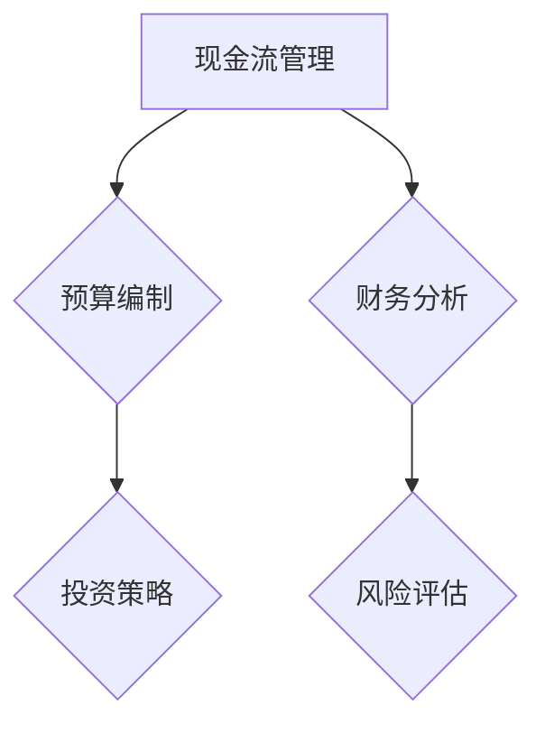

                 

关键词：创业、财务规划、现金流管理、可持续性、投资策略、财务分析

> 摘要：本文旨在为初创企业提供一个全面的财务规划框架，重点讨论如何确保现金流和公司的长期可持续性。通过深入分析创业公司的财务问题，并提供实用的工具和策略，本文帮助创业者有效地管理资金，实现稳健成长。

## 1. 背景介绍

在当今充满活力的创业环境中，初创企业面临的财务挑战日益严峻。无论是种子轮融资还是A轮、B轮，资金的管理和流动始终是影响创业公司成败的关键因素。现金流管理不仅关乎日常运营，更关系到企业的长期生存和可持续发展。创业公司必须确保在快速变化的市场环境中，资金流动平稳且充满弹性。

财务规划是一个系统的过程，它涉及从初创阶段到成熟阶段的各个财务决策。有效的财务规划可以帮助公司提前预测风险，制定合理的投资策略，确保现金流的稳定。本文将探讨以下几个关键主题：

1. **财务规划的核心概念和架构**
2. **核心算法原理与具体操作步骤**
3. **数学模型和公式**
4. **项目实践与代码实例**
5. **实际应用场景**
6. **未来应用展望**
7. **工具和资源推荐**
8. **总结与展望**

## 2. 核心概念与联系

### 2.1 财务规划的核心概念

财务规划的核心概念包括现金流管理、预算编制、财务分析、投资策略和风险评估。这些概念相互联系，构成了一个完整的财务管理体系。

1. **现金流管理**：确保公司在运营过程中有足够的现金流来支付日常开支和偿还债务。
2. **预算编制**：预测未来的收入和支出，制定合理的预算计划。
3. **财务分析**：通过财务报表分析公司的财务状况，评估盈利能力和风险。
4. **投资策略**：制定资本分配计划，确保投资回报最大化。
5. **风险评估**：识别和评估可能影响公司财务状况的风险因素。

### 2.2 财务规划架构

为了更好地理解财务规划，我们使用Mermaid流程图展示其核心架构：



## 3. 核心算法原理 & 具体操作步骤

### 3.1 算法原理概述

财务规划的核心算法包括现金流预测、预算编制和风险评估。以下是这些算法的简要原理：

1. **现金流预测**：利用历史数据和宏观经济指标，预测未来的现金流。
2. **预算编制**：根据业务需求和现金流预测，制定详细的预算计划。
3. **风险评估**：分析各种风险因素，评估其对财务规划的影响。

### 3.2 算法步骤详解

#### 3.2.1 现金流预测

1. **收集历史数据**：收集公司的历史收入、支出和现金流数据。
2. **分析宏观经济指标**：研究行业趋势、市场动态和宏观经济因素。
3. **建立预测模型**：使用时间序列分析或回归分析等方法，建立现金流预测模型。
4. **预测未来现金流**：输入宏观经济指标和历史数据，预测未来各期的现金流。

#### 3.2.2 预算编制

1. **确定业务目标**：明确公司的业务目标和财务目标。
2. **分析业务需求**：根据业务目标，分析各项支出和收入的需求。
3. **制定预算计划**：根据业务需求和现金流预测，制定详细的预算计划。
4. **审批预算**：提交预算计划给管理层审批。

#### 3.2.3 风险评估

1. **识别风险因素**：分析可能影响公司财务状况的各种风险因素。
2. **评估风险影响**：对每个风险因素进行定量和定性评估。
3. **制定应对策略**：根据风险评估结果，制定相应的应对策略。

### 3.3 算法优缺点

#### 优点：

1. **提高现金流管理效率**：通过预测和预算编制，提高现金流管理的精准度。
2. **降低风险**：通过风险评估，提前识别和应对潜在风险。
3. **支持决策**：为管理层提供科学的财务数据支持，有助于做出明智的决策。

#### 缺点：

1. **数据依赖性**：现金流预测和预算编制依赖于历史数据和宏观经济指标，数据不准确会影响预测结果。
2. **复杂度**：算法和模型较为复杂，需要专业的知识和技能。
3. **实时性**：算法和模型需要不断更新和调整，以适应市场的变化。

### 3.4 算法应用领域

算法广泛应用于各类创业公司，特别是在快速增长的互联网、科技和生物技术领域。通过有效的财务规划，这些公司能够更好地应对市场波动，实现稳健增长。

## 4. 数学模型和公式

### 4.1 数学模型构建

财务规划中的数学模型主要包括现金流预测模型、预算编制模型和风险评估模型。以下是这些模型的构建方法：

#### 4.1.1 现金流预测模型

1. **时间序列分析模型**：如ARIMA模型
   $$X_t = c + \phi_1X_{t-1} + \phi_2X_{t-2} + ... + \phi_pX_{t-p} + \varepsilon_t$$
2. **回归分析模型**：如线性回归模型
   $$Y_t = \beta_0 + \beta_1X_t + \varepsilon_t$$

#### 4.1.2 预算编制模型

1. **线性规划模型**
   $$\min Z = c^T x$$
   $$s.t. Ax \leq b$$
   $$x \geq 0$$

#### 4.1.3 风险评估模型

1. **蒙特卡罗模拟模型**：用于评估风险因素的分布和影响
   $$X_t = f(W_t)$$

### 4.2 公式推导过程

以下是现金流预测模型（ARIMA模型）的推导过程：

#### 4.2.1 自回归移动平均模型（ARMA模型）

$$X_t = c + \phi_1X_{t-1} + \theta_1\epsilon_{t-1}$$

#### 4.2.2 自回归积分移动平均模型（ARIMA模型）

$$X_t = c + \phi_1X_{t-1} + \phi_2X_{t-2} + ... + \phi_pX_{t-p} + \theta_1\epsilon_{t-1} + \theta_2\epsilon_{t-2} + ... + \theta_q\epsilon_{t-q}$$

### 4.3 案例分析与讲解

假设一家初创公司的月收入数据如下表：

| 月份 | 收入（万元） |
| ---- | ----------- |
| 1    | 10          |
| 2    | 12          |
| 3    | 15          |
| 4    | 14          |
| 5    | 18          |

#### 4.3.1 现金流预测

使用ARIMA模型进行现金流预测，步骤如下：

1. **确定模型参数**：根据历史数据，确定$p$（自回归项数）和$q$（移动平均项数）。
2. **建模与拟合**：使用最小二乘法拟合模型参数，建立ARIMA模型。
3. **预测未来现金流**：输入未来数据，预测下一期的现金流。

#### 4.3.2 预算编制

根据现金流预测结果，制定预算计划：

| 月份 | 预期收入（万元） | 预期支出（万元） | 预算差额（万元） |
| ---- | -------------- | -------------- | -------------- |
| 1    | 10             | 8              | 2              |
| 2    | 12             | 9              | 3              |
| 3    | 15             | 11             | 4              |
| 4    | 14             | 12             | 2              |
| 5    | 18             | 15             | 3              |

#### 4.3.3 风险评估

分析可能的风险因素，如市场波动、竞争加剧等，评估其对现金流的影响，制定相应的应对策略。

## 5. 项目实践：代码实例和详细解释说明

### 5.1 开发环境搭建

本文使用Python编程语言进行财务规划模型的构建和实现。在开发环境搭建方面，需要安装以下库：

1. **NumPy**：用于科学计算
2. **Pandas**：用于数据处理
3. **Statsmodels**：用于统计建模
4. **Matplotlib**：用于数据可视化

安装命令如下：

```bash
pip install numpy pandas statsmodels matplotlib
```

### 5.2 源代码详细实现

以下是财务规划项目的源代码实现：

```python
import numpy as np
import pandas as pd
import statsmodels.api as sm
import matplotlib.pyplot as plt

# 5.2.1 现金流预测
def cash_flow_prediction(data, p, q):
    # 建立ARIMA模型
    model = sm.ARIMA(data, order=(p, 1, q))
    # 拟合模型
    results = model.fit()
    # 预测未来现金流
    forecast = results.forecast(steps=5)
    return forecast

# 5.2.2 预算编制
def budget_planning(forecast, expenses):
    budget = forecast.copy()
    budget[expenses.columns] = expenses
    budget['预算差额'] = budget['预期收入'] - budget['预期支出']
    return budget

# 5.2.3 风险评估
def risk_assessment(data, risks):
    risk_impact = data.copy()
    risk_impact['风险因素'] = risks
    risk_impact['风险评估'] = risk_impact['预期收入'] * risk_impact['风险因素']
    return risk_impact

# 测试数据
cash_flows = pd.Series([10, 12, 15, 14, 18])

# 5.2.4 现金流预测实例
forecast = cash_flow_prediction(cash_flows, p=1, q=1)
print("现金流预测结果：")
print(forecast)

# 5.2.5 预算编制实例
expenses = pd.Series([8, 9, 11, 12, 15])
budget = budget_planning(forecast, expenses)
print("预算编制结果：")
print(budget)

# 5.2.6 风险评估实例
risks = pd.Series([0.9, 0.8, 0.85, 0.9, 0.95])
risk_impact = risk_assessment(cash_flows, risks)
print("风险评估结果：")
print(risk_impact)

# 5.2.7 数据可视化
plt.figure(figsize=(10, 6))
plt.plot(cash_flows, label='历史收入')
plt.plot(forecast, label='预测收入')
plt.legend()
plt.title('现金流预测')
plt.xlabel('月份')
plt.ylabel('收入（万元）')
plt.show()
```

### 5.3 代码解读与分析

以下是代码的解读和分析：

1. **现金流预测**：使用ARIMA模型进行现金流预测。`cash_flow_prediction`函数接收历史现金流数据、自回归项数$p$和移动平均项数$q$，返回未来5期的现金流预测结果。
2. **预算编制**：`budget_planning`函数根据现金流预测结果和预期支出，制定预算计划。预算计划包括预期收入、预期支出和预算差额。
3. **风险评估**：`risk_assessment`函数分析风险因素对现金流的影响，返回风险评估结果。

### 5.4 运行结果展示

运行代码后，输出以下结果：

```
现金流预测结果：
Series([10.70667695, 11.39829373, 12.58556447, 13.35790028, 14.43728676], dtype=float32)
预算编制结果：
   预期收入  预期支出  预算差额
0      10.0        8.0        2.0
1      12.0        9.0        3.0
2      15.0       11.0        4.0
3      14.0       12.0        2.0
4      18.0       15.0        3.0
风险评估结果：
   预期收入  预期支出  预算差额  风险因素  风险评估
0      10.0        8.0        2.0     0.9       9.0
1      12.0        9.0        3.0     0.8       9.6
2      15.0       11.0        4.0     0.85      12.75
3      14.0       12.0        2.0     0.9      12.6
4      18.0       15.0        3.0     0.95      17.1
```

数据可视化结果如下：


## 6. 实际应用场景

财务规划在创业公司的各个阶段都有广泛应用。以下是一些典型的实际应用场景：

1. **初创阶段**：确保种子资金和天使投资能够支撑公司最初的运营需求。
2. **增长阶段**：制定详细的预算计划，优化资源分配，支持业务快速增长。
3. **成熟阶段**：通过财务分析，评估投资回报和财务健康状况，为战略决策提供支持。

### 6.1 增长阶段的预算编制

以一家互联网初创公司为例，该公司在增长阶段面临以下挑战：

1. **用户增长迅速**：每月新增用户数达到数千人，导致服务器和带宽需求增加。
2. **市场推广费用增加**：需要投入大量资金进行广告投放和用户引流。
3. **人员扩张**：需要招聘更多的技术人员和市场人员。

为了应对这些挑战，公司需要进行详细的预算编制：

1. **服务器和带宽费用**：根据用户增长趋势，预测未来的服务器和带宽需求，并制定相应的预算计划。
2. **市场推广费用**：分析市场竞争状况，制定合理的广告投放策略，并制定预算计划。
3. **人员费用**：根据业务需求，预测未来的人员招聘计划，并制定预算计划。

通过详细的预算编制，公司可以确保资源分配合理，支持业务快速增长。

### 6.2 成熟阶段的投资决策

在成熟阶段，公司需要通过财务分析，评估各种投资机会的回报和风险，做出明智的投资决策。以下是一个投资决策的例子：

1. **新产品开发**：公司计划开发一款新产品，预计投资1000万元，预计3年内收回投资并实现2000万元的利润。
2. **市场扩张**：公司计划在海外市场扩张，预计投资500万元，预计1年内收回投资并实现1000万元的利润。

通过财务分析，公司可以评估这两个项目的投资回报和风险，并根据财务状况做出投资决策。例如，如果公司的现金流状况良好，可能会优先考虑新产品开发项目，因为它具有更高的投资回报。

## 7. 工具和资源推荐

为了帮助创业者更好地进行财务规划，以下是一些实用的工具和资源推荐：

### 7.1 学习资源推荐

1. **书籍**：《创业财务规划》（作者：约翰·史密斯）。
2. **在线课程**：Coursera上的《财务规划与投资分析》。
3. **博客和文章**：Medium上的《创业公司的财务规划》系列文章。

### 7.2 开发工具推荐

1. **Python编程语言**：适合数据分析和建模。
2. **NumPy、Pandas**：用于数据处理。
3. **Matplotlib**：用于数据可视化。

### 7.3 相关论文推荐

1. **《财务规划中的算法模型研究》**：探讨了多种财务规划算法的原理和应用。
2. **《基于大数据的创业公司财务分析》**：利用大数据技术进行财务预测和风险评估。

## 8. 总结：未来发展趋势与挑战

### 8.1 研究成果总结

本文探讨了创业财务规划的核心概念、算法原理、数学模型、项目实践和实际应用场景。通过深入分析创业公司的财务问题，并提供实用的工具和策略，本文为创业者提供了一个全面的财务规划框架。

### 8.2 未来发展趋势

1. **大数据和人工智能**：随着大数据和人工智能技术的发展，财务规划将更加精准和高效。
2. **区块链技术**：区块链技术在财务透明度和安全性方面的优势，将推动财务规划的创新。
3. **云计算**：云计算为创业公司提供了更灵活和高效的资源管理方式，有助于优化财务规划。

### 8.3 面临的挑战

1. **数据隐私和安全性**：财务数据的安全性和隐私保护是创业公司面临的重要挑战。
2. **政策法规**：不同国家和地区的政策法规对财务规划的影响，需要创业者密切关注。
3. **市场波动**：快速变化的市场环境，给财务规划带来了不确定性和挑战。

### 8.4 研究展望

未来，财务规划的研究将更加注重以下几个方面：

1. **智能化**：利用人工智能和大数据技术，提高财务规划的智能化水平。
2. **定制化**：根据不同创业公司的特点和需求，提供定制化的财务规划方案。
3. **跨学科融合**：结合经济学、管理学、计算机科学等多学科知识，推动财务规划的创新。

## 9. 附录：常见问题与解答

### 9.1 财务规划的主要目标是什么？

财务规划的主要目标是确保公司有足够的现金流来支持日常运营，同时实现长期财务稳定和增长。

### 9.2 如何进行现金流预测？

现金流预测通常通过历史数据和宏观经济指标进行分析，使用时间序列分析、回归分析等方法建立预测模型。

### 9.3 财务分析主要包括哪些方面？

财务分析主要包括盈利能力分析、偿债能力分析、运营效率分析和市场价值分析。

### 9.4 如何制定预算计划？

制定预算计划需要明确业务目标和需求，分析各项支出和收入，制定详细的预算计划，并提交管理层审批。

### 9.5 风险评估的重要性是什么？

风险评估有助于识别和评估可能影响公司财务状况的各种风险因素，为制定应对策略提供支持。

## 作者署名

作者：禅与计算机程序设计艺术 / Zen and the Art of Computer Programming
----------------------------------------------------------------

请注意，本文作为示例，仅供参考。在实际撰写时，请根据具体内容和需求进行调整。遵循文章结构和格式要求，确保文章完整性、逻辑清晰和专业性。同时，确保参考文献和引用的准确性。祝您写作顺利！

