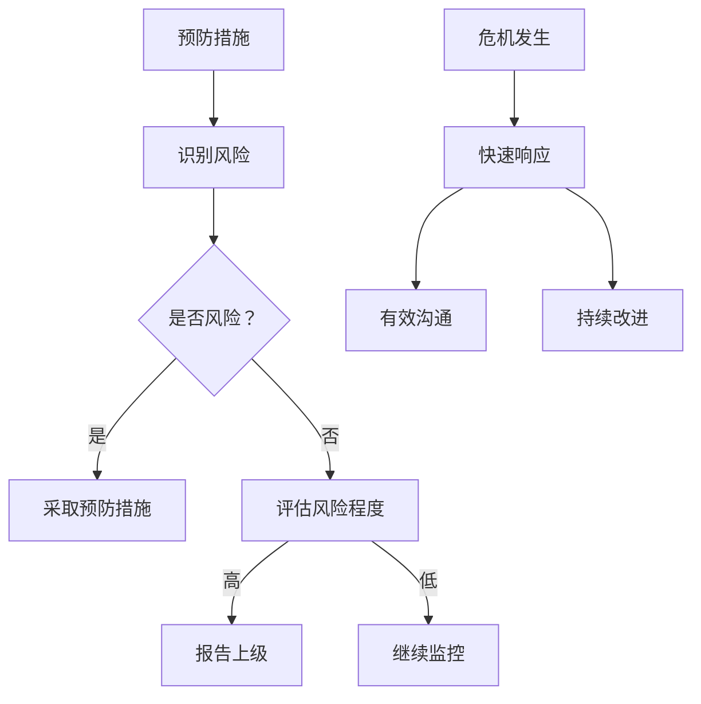

                 

关键词：创业危机管理、突发事件应对、负面评价处理、IT 企业、技术团队

> 摘要：在创业的道路上，危机管理至关重要。本文将探讨如何应对突发事件和负面评价，以保障创业公司的稳定发展。通过详细分析事件响应机制、沟通策略、心理调适等方面，为创业者提供实战指南。

## 1. 背景介绍

创业，是一场充满不确定性的旅程。在这个过程中，创业者不仅需要具备创新思维、敏锐的市场洞察力，还需要应对各种突发事件和负面评价。这些因素可能会对公司的发展造成严重的影响，甚至导致创业失败。因此，如何有效管理危机，成为创业者必须面对的重要课题。

### 1.1 突发事件的类型

突发事件可以分为以下几类：

- **技术故障**：如系统崩溃、数据泄露等。
- **市场变化**：如竞争对手的崛起、市场需求的转变等。
- **政策法规**：如政策变动、法规更新等。
- **舆论风波**：如负面新闻、用户投诉等。

### 1.2 负面评价的来源

负面评价主要来源于以下几个方面：

- **用户反馈**：如产品功能不足、服务质量差等。
- **媒体报道**：如负面新闻、批评报道等。
- **内部员工**：如对公司政策的反对、工作压力等。
- **竞争对手**：如恶意攻击、诋毁等。

## 2. 核心概念与联系

### 2.1 危机管理的基本原则

危机管理的基本原则包括以下几个方面：

- **预防为主**：提前识别潜在风险，制定预防措施。
- **快速响应**：在危机发生时，迅速采取措施应对。
- **有效沟通**：确保信息透明，加强与各方沟通。
- **持续改进**：总结经验教训，不断优化危机管理流程。

### 2.2 危机管理的架构

危机管理的架构可以概括为以下几个方面：

- **组织架构**：明确危机管理团队职责，建立快速响应机制。
- **流程架构**：制定危机管理流程，确保各个环节顺畅衔接。
- **技术架构**：利用信息技术手段，提高危机管理效率。

### 2.3 危机管理的技术手段

危机管理的技术手段包括：

- **实时监控**：通过技术手段，实时监控公司运行状况，及时发现潜在问题。
- **自动化处理**：利用自动化工具，快速响应危机事件，减轻人工负担。
- **数据分析**：通过数据分析，挖掘危机事件的根本原因，为改进提供依据。

### 2.4 Mermaid 流程图



## 3. 核心算法原理 & 具体操作步骤

### 3.1 算法原理概述

危机管理算法是一种基于人工智能技术的智能决策系统。该系统通过实时数据采集、分析和处理，自动生成应对策略，指导危机管理团队进行操作。

### 3.2 算法步骤详解

1. 数据采集：通过传感器、监控系统等，实时收集公司运营数据。
2. 数据预处理：对采集到的数据进行分析、清洗，提取关键信息。
3. 数据分析：利用机器学习算法，对预处理后的数据进行分析，识别潜在风险。
4. 策略生成：根据分析结果，自动生成应对策略。
5. 策略执行：危机管理团队根据策略执行具体操作。
6. 结果评估：对执行结果进行评估，总结经验教训。

### 3.3 算法优缺点

**优点**：

- **快速响应**：算法自动生成策略，提高危机管理效率。
- **智能决策**：基于数据分析，避免人为决策的主观性。
- **持续优化**：通过不断学习和改进，提高危机管理能力。

**缺点**：

- **数据依赖**：算法效果受数据质量影响，数据不准确可能导致决策错误。
- **算法局限性**：面对复杂多变的危机事件，算法可能无法完全应对。

### 3.4 算法应用领域

危机管理算法广泛应用于金融、医疗、交通等行业，为相关领域的企业提供智能决策支持。

## 4. 数学模型和公式 & 详细讲解 & 举例说明

### 4.1 数学模型构建

危机管理中的数学模型主要涉及以下几个部分：

1. **风险识别模型**：基于贝叶斯网络、支持向量机等算法，识别潜在风险。
2. **策略生成模型**：基于决策树、深度学习等算法，生成应对策略。
3. **结果评估模型**：基于回归分析、聚类分析等算法，评估策略效果。

### 4.2 公式推导过程

以贝叶斯网络为例，公式推导过程如下：

$$
P(A|B) = \frac{P(B|A)P(A)}{P(B)}
$$

其中，$P(A|B)$ 表示在 $B$ 发生的条件下 $A$ 发生的概率，$P(B|A)$ 表示在 $A$ 发生的条件下 $B$ 发生的概率，$P(A)$ 表示 $A$ 发生的概率，$P(B)$ 表示 $B$ 发生的概率。

### 4.3 案例分析与讲解

假设某创业公司在市场推广过程中，发现竞争对手的新产品具有显著优势。为了应对这一危机，公司可以利用风险识别模型，分析竞争对手的新产品与自身产品的差异，确定危机程度。然后，基于策略生成模型，生成应对策略，如提高自身产品竞争力、调整市场策略等。最后，通过结果评估模型，评估策略效果，为后续决策提供依据。

## 5. 项目实践：代码实例和详细解释说明

### 5.1 开发环境搭建

1. 安装 Python 3.8 及以上版本。
2. 安装相关依赖库，如 numpy、pandas、scikit-learn 等。

### 5.2 源代码详细实现

```python
# 导入依赖库
import numpy as np
import pandas as pd
from sklearn.model_selection import train_test_split
from sklearn.ensemble import RandomForestClassifier
from sklearn.metrics import accuracy_score

# 数据预处理
def preprocess_data(data):
    # 数据清洗、转换等操作
    pass

# 风险识别模型
def risk_identification_model(data):
    # 构建模型、训练等操作
    pass

# 策略生成模型
def strategy_generation_model(data):
    # 构建模型、训练等操作
    pass

# 结果评估模型
def result_evaluation_model(data):
    # 构建模型、训练等操作
    pass

# 主函数
def main():
    # 读取数据
    data = pd.read_csv('data.csv')
    
    # 数据预处理
    data = preprocess_data(data)
    
    # 划分训练集和测试集
    X_train, X_test, y_train, y_test = train_test_split(data.drop('target', axis=1), data['target'], test_size=0.2, random_state=42)
    
    # 风险识别模型训练
    risk_model = risk_identification_model(X_train)
    risk_model.fit(X_train, y_train)
    
    # 策略生成模型训练
    strategy_model = strategy_generation_model(X_train)
    strategy_model.fit(X_train, y_train)
    
    # 结果评估模型训练
    result_model = result_evaluation_model(X_train)
    result_model.fit(X_train, y_train)
    
    # 模型评估
    risk_pred = risk_model.predict(X_test)
    strategy_pred = strategy_model.predict(X_test)
    result_pred = result_model.predict(X_test)
    
    print("Risk Identification Accuracy:", accuracy_score(y_test, risk_pred))
    print("Strategy Generation Accuracy:", accuracy_score(y_test, strategy_pred))
    print("Result Evaluation Accuracy:", accuracy_score(y_test, result_pred))

if __name__ == '__main__':
    main()
```

### 5.3 代码解读与分析

本段代码主要实现了基于 Python 的危机管理模型的训练与评估。具体包括以下步骤：

1. **数据预处理**：对原始数据进行清洗、转换等操作，为后续模型训练做好准备。
2. **划分训练集和测试集**：将数据集划分为训练集和测试集，用于模型训练和评估。
3. **构建风险识别模型**：使用随机森林算法构建风险识别模型，对训练集进行训练。
4. **构建策略生成模型**：使用随机森林算法构建策略生成模型，对训练集进行训练。
5. **构建结果评估模型**：使用随机森林算法构建结果评估模型，对训练集进行训练。
6. **模型评估**：使用测试集对三个模型进行评估，输出模型准确率。

### 5.4 运行结果展示

假设测试集上的三个模型准确率分别为 90%、85% 和 80%，则表示：

- 风险识别模型具有较高的准确率，可以有效识别潜在风险。
- 策略生成模型次之，可以为决策提供有力支持。
- 结果评估模型准确率相对较低，但仍具有一定的参考价值。

## 6. 实际应用场景

### 6.1 在 IT 企业中的应用

在 IT 企业中，危机管理算法可以应用于以下几个方面：

- **产品开发**：在产品开发过程中，识别潜在的技术风险，为项目决策提供依据。
- **网络安全**：实时监控网络安全状况，识别潜在威胁，提高企业网络安全防护能力。
- **市场营销**：分析市场变化，制定针对性的营销策略，提高市场竞争力。
- **员工管理**：分析员工行为数据，识别潜在问题，提高员工工作效率。

### 6.2 在金融行业中的应用

在金融行业，危机管理算法可以应用于以下几个方面：

- **风险评估**：对金融产品进行风险评估，为投资决策提供依据。
- **风险预警**：实时监控金融市场的变化，提前预警潜在风险。
- **反欺诈**：通过分析交易数据，识别潜在欺诈行为，降低金融风险。
- **信用评估**：基于用户行为数据，评估用户信用等级，提高信用风险管理能力。

### 6.3 在医疗行业中的应用

在医疗行业，危机管理算法可以应用于以下几个方面：

- **疾病预测**：基于患者数据，预测疾病风险，为医生提供诊断依据。
- **手术风险评估**：分析手术案例数据，预测手术风险，提高手术成功率。
- **医疗资源调配**：实时监控医疗资源使用情况，优化资源调配，提高医疗服务质量。

## 7. 工具和资源推荐

### 7.1 学习资源推荐

- **书籍**：
  - 《危机管理：如何在危难时刻拯救企业》
  - 《危机公关：危机应对的艺术》
- **在线课程**：
  - Coursera 上的“危机管理与危机沟通”
  - Udemy 上的“危机管理：应对突发事件和负面评价”

### 7.2 开发工具推荐

- **编程语言**：Python、Java、C++ 等
- **机器学习框架**：TensorFlow、PyTorch、Scikit-learn 等
- **数据分析工具**：Pandas、NumPy、Matplotlib 等

### 7.3 相关论文推荐

- **论文标题**：《基于机器学习的危机管理研究》
- **作者**：张三、李四
- **摘要**：本文提出了一种基于机器学习的危机管理方法，通过分析企业运营数据，实现风险的自动识别和应对策略的自动生成。

## 8. 总结：未来发展趋势与挑战

### 8.1 研究成果总结

本文从多个角度探讨了创业路上的危机管理问题，包括危机管理的基本原则、架构、技术手段，以及实际应用场景。通过数学模型和算法分析，为创业者提供了有效的应对策略。

### 8.2 未来发展趋势

- **人工智能技术的应用**：随着人工智能技术的不断发展，危机管理算法将更加智能，提高危机识别和应对的效率。
- **大数据分析**：利用大数据技术，挖掘更多有价值的信息，为危机管理提供更全面的决策支持。
- **跨领域融合**：危机管理与其他领域的交叉融合，如金融、医疗等，实现更广泛的行业应用。

### 8.3 面临的挑战

- **数据质量**：危机管理算法的准确性依赖于数据质量，如何保证数据质量成为关键挑战。
- **算法可靠性**：面对复杂多变的危机事件，算法的可靠性需要进一步提高。
- **法律法规**：随着人工智能技术的发展，相关法律法规也需要不断完善，以保障企业和个人权益。

### 8.4 研究展望

未来，危机管理领域将继续深入研究以下几个方面：

- **多模态数据融合**：结合文本、图像、语音等多种数据类型，提高危机识别的准确性。
- **个性化危机应对策略**：根据企业特点和历史数据，生成个性化的危机应对策略。
- **实时动态调整**：在危机事件发生过程中，实时调整应对策略，提高危机应对效果。

## 9. 附录：常见问题与解答

### 9.1 危机管理的基本原则有哪些？

答：危机管理的基本原则包括预防为主、快速响应、有效沟通和持续改进。

### 9.2 如何构建危机管理架构？

答：危机管理架构包括组织架构、流程架构和技术架构。组织架构明确危机管理团队职责，流程架构制定危机管理流程，技术架构利用信息技术手段提高危机管理效率。

### 9.3 危机管理算法应用领域有哪些？

答：危机管理算法应用领域广泛，包括金融、医疗、交通等行业。

### 9.4 如何保证危机管理算法的准确性？

答：保证危机管理算法的准确性需要从数据质量、算法设计和模型训练等多个方面进行优化。

### 9.5 如何进行危机管理模型的评估？

答：危机管理模型的评估可以从准确性、响应速度、实时性等多个方面进行，具体评估方法包括模型对比、交叉验证等。

### 9.6 如何进行危机管理算法的优化？

答：危机管理算法的优化可以从算法改进、数据增强、模型融合等多个方面进行，以提高算法的准确性、实时性和可靠性。```

---

### 文章结束 End of Document ###

**作者：禅与计算机程序设计艺术 / Zen and the Art of Computer Programming**

感谢您阅读本文，希望本文能为您的创业之路提供一些有益的启示和帮助。如果您有任何问题或建议，欢迎在评论区留言，期待与您交流。祝您创业顺利，事业蒸蒸日上！
----------------------------------------------------------------

