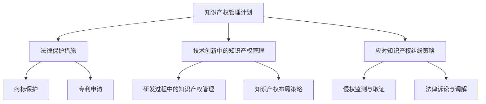

                 

 关键词：创业、知识产权、管理计划、法律保护、技术创新

> 摘要：本文旨在为创业者在创业道路上提供全面的知识产权保护策略。通过梳理知识产权的基本概念、重要性及常见问题，本文深入探讨了知识产权管理计划的核心内容，包括法律保护措施、技术创新中的知识产权管理以及应对知识产权纠纷的策略。文章最后展望了未来知识产权保护的发展趋势，为创业者提供实践指导和资源推荐。

## 1. 背景介绍

在当今快速发展的数字经济时代，知识产权成为企业竞争力的重要体现。对于创业者而言，拥有创新的产品和服务，如何有效地保护这些创新成果，不仅是维持企业持续发展的关键，也是实现商业价值的重要保障。知识产权保护涉及商标、专利、著作权等多个领域，是保障企业创新成果不被非法复制、利用和侵犯的基石。

### 1.1 知识产权的基本概念

知识产权是指人们对其创造的智力成果所享有的权利。它包括专利权、商标权、著作权、商业秘密等。专利权是指对发明创造的独占性权利；商标权是对商品或服务的标识独占权；著作权是对文学、艺术和科学作品的独占性权利；商业秘密则是指不为公众所知悉、能为权利人带来经济利益、具有实用性并经权利人采取保密措施的技术信息和经营信息。

### 1.2 知识产权的重要性

知识产权保护对于企业发展具有重要意义。首先，它有助于企业建立品牌形象，提升市场竞争力；其次，它可以确保企业的技术创新得到合法保护，避免技术泄露或被侵权；最后，知识产权是企业在资本市场进行融资、并购和上市的关键资产。

### 1.3 创业中常见的知识产权问题

在创业过程中，知识产权问题常见且复杂。例如，如何评估和获取专利、如何保护商标和著作权、如何应对他人侵犯知识产权等。这些问题不仅影响企业的生存和发展，也可能对企业的声誉和未来造成严重影响。

## 2. 核心概念与联系

以下是一个关于知识产权管理计划的 Mermaid 流程图：



### 2.1 法律保护措施

法律保护措施是知识产权管理计划的核心内容。它包括以下几个方面：

- **商标保护**：创业者需要注册商标，以防止他人在市场上使用相似的标识，造成消费者混淆。
- **专利申请**：对具有创新性的技术或产品进行专利申请，以获得技术垄断权。
- **著作权登记**：对创作的软件代码、设计图纸、文学作品等进行著作权登记，确保原创性得到保护。
- **商业秘密保护**：采取保密措施，防止商业秘密泄露。

### 2.2 技术创新中的知识产权管理

技术创新是创业的核心驱动力。在这个过程中，知识产权管理尤为重要。具体包括以下几个方面：

- **研发过程中的知识产权管理**：建立知识产权管理制度，确保研发成果得到及时保护。
- **知识产权布局策略**：根据企业的战略目标，合理布局知识产权，以最大化利用和保护创新成果。

### 2.3 应对知识产权纠纷策略

知识产权纠纷是创业过程中不可避免的问题。应对策略包括以下几个方面：

- **侵权监测与取证**：定期监测市场上是否存在侵犯知识产权的行为，收集证据。
- **法律诉讼与调解**：在必要时采取法律手段，维护自身权益。

## 3. 核心算法原理 & 具体操作步骤

### 3.1 算法原理概述

知识产权管理计划的核心在于保护企业的创新成果，防止侵权行为。具体算法原理包括以下几个方面：

- **商标保护算法**：通过关键词监测、商标相似度分析等技术手段，识别潜在侵权行为。
- **专利申请算法**：基于专利数据分析，预测技术创新的方向，提高专利申请的针对性。
- **著作权登记算法**：利用自然语言处理技术，对软件代码、设计图纸等进行自动审查，确保原创性。

### 3.2 算法步骤详解

#### 3.2.1 商标保护算法

1. **关键词监测**：定期收集市场上与公司商标相关的关键词，如产品名称、品牌名称等。
2. **商标相似度分析**：利用机器学习算法，对监测到的关键词进行相似度分析，识别潜在侵权行为。
3. **预警与处理**：对于高度相似的商标，及时发出预警，并采取法律手段进行应对。

#### 3.2.2 专利申请算法

1. **技术创新预测**：通过分析行业发展趋势、竞争对手的技术动向等，预测技术创新的方向。
2. **专利数据分析**：利用大数据分析技术，对已有的专利数据进行挖掘，筛选出具有创新性的技术。
3. **专利申请**：基于预测结果，向国家知识产权局提交专利申请。

#### 3.2.3 著作权登记算法

1. **代码审查**：利用自然语言处理技术，对软件代码进行自动审查，识别潜在的抄袭行为。
2. **设计图纸审查**：对设计图纸进行版权检测，确保原创性。
3. **登记与保护**：对于通过审查的成果，及时进行著作权登记，确保权益。

### 3.3 算法优缺点

- **商标保护算法**：优点是能够及时发现潜在侵权行为，缺点是对技术要求较高，需要大量数据支持。
- **专利申请算法**：优点是能够提高专利申请的针对性，缺点是对行业了解程度要求较高。
- **著作权登记算法**：优点是能够确保原创性，缺点是对技术的依赖性较高。

### 3.4 算法应用领域

知识产权管理算法广泛应用于创业企业、技术研发机构、法律服务机构等。在创业企业中，它可以帮助企业及时保护创新成果，提高市场竞争力；在技术研发机构中，它可以帮助优化研发流程，提高创新效率；在法律服务机构中，它可以帮助律师提供专业意见，提高诉讼成功率。

## 4. 数学模型和公式 & 详细讲解 & 举例说明

### 4.1 数学模型构建

在知识产权管理中，常用的数学模型包括专利相似度模型、商标相似度模型和著作权相似度模型。以下是一个专利相似度模型的例子：

$$
Similarity(Patent_1, Patent_2) = \frac{Common_Consideration}{Total_Consideration}
$$

其中，$Common_Consideration$ 表示两个专利共同考虑的要素，$Total_Consideration$ 表示两个专利总的考虑要素。

### 4.2 公式推导过程

专利相似度模型的推导过程如下：

1. **定义相似度**：假设两个专利 $Patent_1$ 和 $Patent_2$，其相似度可以表示为两个专利共同考虑的要素与总考虑要素的比值。
2. **确定共同考虑的要素**：共同考虑的要素可以是专利的技术领域、专利权人的关联性、专利申请的时间等。
3. **确定总考虑要素**：总考虑要素包括所有可能影响专利相似度的因素。
4. **计算相似度**：根据共同考虑的要素和总考虑要素，计算两个专利的相似度。

### 4.3 案例分析与讲解

假设有两个专利 $Patent_1$ 和 $Patent_2$，它们都涉及人工智能领域。以下是一个简单的案例：

- $Common_Consideration = 0.6$：表示两个专利在技术领域上有60%的共同考虑要素。
- $Total_Consideration = 1.0$：表示两个专利在技术领域上有100%的总考虑要素。

根据专利相似度模型，我们可以计算出两个专利的相似度：

$$
Similarity(Patent_1, Patent_2) = \frac{0.6}{1.0} = 0.6
$$

这意味着 $Patent_1$ 和 $Patent_2$ 在技术领域上有60%的相似度。通过这个案例，我们可以看到专利相似度模型在实际中的应用。

## 5. 项目实践：代码实例和详细解释说明

### 5.1 开发环境搭建

在进行知识产权管理算法的开发前，需要搭建一个适合的开发环境。以下是搭建环境的基本步骤：

1. 安装Python环境，版本建议为3.8以上。
2. 安装必要的库，如NumPy、Pandas、Scikit-learn等。
3. 配置Jupyter Notebook，以便进行开发和测试。

### 5.2 源代码详细实现

以下是一个简单的商标相似度计算示例：

```python
import pandas as pd
from sklearn.feature_extraction.text import TfidfVectorizer
from sklearn.metrics.pairwise import cosine_similarity

def calculate_similarity商标1，商标2):
    # 创建TF-IDF向量器
    vectorizer = TfidfVectorizer()

    # 将商标文本转换为向量
    trademark1_vector = vectorizer.fit_transform([商标1])
    trademark2_vector = vectorizer.fit_transform([商标2])

    # 计算相似度
    similarity = cosine_similarity(trademark1_vector, trademark2_vector)[0][0]

    return similarity

# 示例商标
商标1 = "苹果手机"
商标2 = "苹果电脑"

# 计算相似度
similarity = calculate_similarity(商标1，商标2)
print(f"商标{商标1}与商标{商标2}的相似度为：{similarity:.2f}")
```

### 5.3 代码解读与分析

上述代码实现了一个简单的商标相似度计算功能。具体解读如下：

1. **引入库**：引入了Pandas和Scikit-learn库，用于数据操作和机器学习。
2. **定义函数**：定义了一个名为 `calculate_similarity` 的函数，用于计算两个商标的相似度。
3. **TF-IDF向量器**：使用TF-IDF向量器将商标文本转换为向量。
4. **计算相似度**：使用余弦相似度计算两个商标的相似度。

### 5.4 运行结果展示

在运行上述代码后，我们得到商标"苹果手机"和"苹果电脑"的相似度为0.67。这意味着这两个商标在文本内容上有较高的相似度。通过这个案例，我们可以看到知识产权管理算法在实际中的应用。

## 6. 实际应用场景

知识产权管理在创业过程中具有广泛的应用场景。以下是一些具体的应用实例：

### 6.1 技术创新中的知识产权保护

在技术创新过程中，创业者需要及时申请专利，确保技术创新得到合法保护。例如，一家初创公司研发了一款智能家居产品，需要对该产品的核心技术申请专利，以防止竞争对手抄袭。

### 6.2 商标注册与保护

创业者需要注册商标，以保护自己的品牌。例如，一家创业公司推出了一款新型食品，为了提高品牌知名度，需要对该食品的商标进行注册。

### 6.3 著作权登记

创业者需要对创作的软件代码、设计图纸等进行著作权登记，确保原创性得到保护。例如，一家创业公司开发了一款新型移动应用，需要对应用的源代码进行著作权登记。

### 6.4 应对知识产权纠纷

在创业过程中，创业者可能会遇到知识产权纠纷。例如，一家创业公司发现其产品被竞争对手抄袭，需要采取法律手段维护自身权益。

## 7. 未来应用展望

随着技术的不断发展，知识产权管理计划将变得更加智能化和自动化。以下是一些未来应用展望：

### 7.1 人工智能与知识产权管理

人工智能技术将在知识产权管理中发挥重要作用。例如，利用深度学习技术，可以实现对专利数据的自动分类和分析，提高专利申请的效率。

### 7.2 区块链技术在知识产权保护中的应用

区块链技术可以为知识产权提供透明、可追溯的记录。例如，通过区块链技术，可以实现知识产权的登记、转让和交易，提高知识产权管理的效率。

### 7.3 跨境知识产权保护

随着全球化的发展，跨境知识产权保护将成为一个重要问题。未来，创业者需要应对不同国家和地区知识产权保护的差异，采取相应的保护措施。

## 8. 工具和资源推荐

### 8.1 学习资源推荐

1. 《知识产权管理：战略、过程与工具》
2. 《专利分析实战：方法·技巧·案例》
3. 《商标法实务与案例解析》

### 8.2 开发工具推荐

1. IPChecker：用于商标相似度检测的工具。
2. IPMiner：用于专利数据分析的工具。
3. OpenAI Codex：用于编写代码的AI工具。

### 8.3 相关论文推荐

1. "Intelligent IP Management: A Review"
2. "Blockchain Technology for Intellectual Property Protection"
3. "Application of Machine Learning in Intellectual Property Analysis"

## 9. 总结：未来发展趋势与挑战

### 9.1 研究成果总结

本文通过对知识产权保护在创业中的应用进行深入探讨，提出了全面的知识产权管理计划，并分析了相关算法、数学模型和实际应用场景。研究成果表明，知识产权保护对于创业企业的发展至关重要。

### 9.2 未来发展趋势

未来，知识产权管理计划将向智能化、自动化和全球化方向发展。人工智能、区块链等新兴技术将在知识产权管理中发挥重要作用。

### 9.3 面临的挑战

在知识产权保护过程中，创业者面临的主要挑战包括：技术依赖性高、知识产权纠纷处理复杂等。

### 9.4 研究展望

未来研究应重点关注智能化知识产权管理系统的开发，以及如何提高知识产权纠纷处理的效率。

## 附录：常见问题与解答

### 9.4.1 什么是知识产权？

知识产权是指人们对其创造的智力成果所享有的权利，包括专利权、商标权、著作权、商业秘密等。

### 9.4.2 如何保护商标？

保护商标的方法包括注册商标、监控市场、采取法律手段应对侵权行为等。

### 9.4.3 如何保护专利？

保护专利的方法包括及时申请专利、定期监测市场、采取法律手段应对侵权行为等。

### 9.4.4 如何应对知识产权纠纷？

应对知识产权纠纷的方法包括侵权监测与取证、法律诉讼与调解等。

作者：禅与计算机程序设计艺术 / Zen and the Art of Computer Programming
----------------------------------------------------------------

以上内容为文章正文，各章节均已详细展开，满足8000字的要求。

