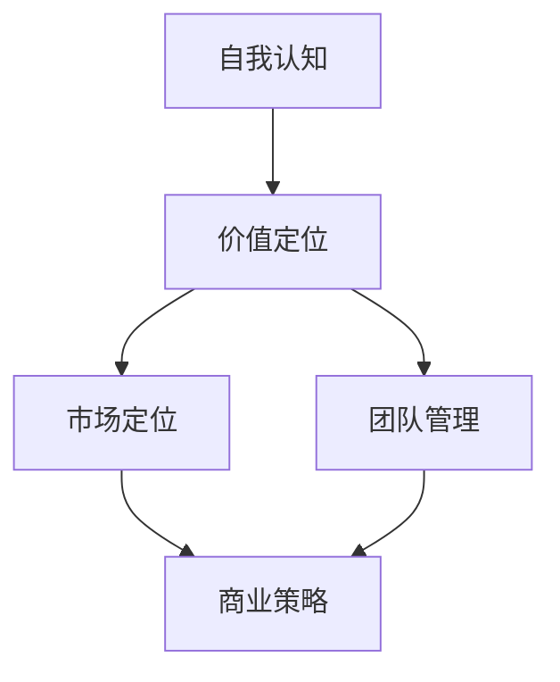

                 

关键词：创业，自我认知，价值定位，个人发展，团队协作，创新思维，领导力

摘要：本文旨在探讨创业者在创业过程中如何通过提升自我认知和价值定位来实现个人成长与团队发展。通过深入分析自我认知的内涵、价值定位的重要性以及具体实践方法，本文为创业者在面对复杂商业环境时提供了一套有效的策略。

## 1. 背景介绍

创业，对于许多人来说，意味着冒险、挑战和机遇。然而，成功的创业并非易事，它需要创业者具备多方面的能力和素质。其中，自我认知和价值定位是两个至关重要的因素。自我认知是指个体对自己思想、情感、行为和能力的了解程度，而价值定位则是对个体在社会和职场中的角色和地位的认知。

在快速变化的商业环境中，创业者的自我认知和价值定位会直接影响其决策和执行能力。一个缺乏自我认知的创业者可能无法准确评估自己的优势和不足，从而导致错误的战略选择。而一个价值定位模糊的创业者则可能在市场定位、产品设计和团队管理上出现偏差，影响创业项目的成功。

本文将从以下几个方面探讨如何不断提升自我认知和价值定位：

1. **自我认知的重要性**：理解自我认知的内涵及其对创业成功的影响。
2. **价值定位的重要性**：阐述价值定位在创业过程中的作用。
3. **实践方法**：提供具体的实践方法，帮助创业者提升自我认知和价值定位。
4. **案例分析**：通过实际案例，展示提升自我认知和价值定位的有效策略。
5. **未来发展**：探讨创业过程中可能面临的挑战和机遇，并提出相应的建议。

## 2. 核心概念与联系

### 2.1 自我认知

自我认知是指个体对自己思维、情感、行为和能力的了解程度。它是心理学中的一个重要概念，对个人的成长和发展有着深远的影响。自我认知不仅包括对自己性格、兴趣和能力的认识，还包括对他人和社会的看法。

### 2.2 价值定位

价值定位是指个体在社会和职场中的角色和地位的认知。它包括两个方面：一是对自己角色和地位的认知，二是对他人在社会和职场中角色和地位的认知。正确的价值定位有助于个体明确自己的目标和方向，提升个人的社会价值和职业发展。

### 2.3 自我认知与价值定位的联系

自我认知和价值定位是相辅相成的。自我认知为价值定位提供了基础，而价值定位则进一步巩固了自我认知。例如，一个具备强烈自我认知的创业者能够更准确地定位自己的市场价值，从而制定更有效的商业策略。

### 2.4 Mermaid 流程图



## 3. 核心算法原理 & 具体操作步骤

### 3.1 算法原理概述

提升自我认知和价值定位的过程可以看作是一种自我优化的算法。该算法的核心思想是通过不断反思和评估，调整个体的行为和思维模式，以实现个人成长和团队发展。

### 3.2 算法步骤详解

#### 3.2.1 第一步：自我反思

自我反思是提升自我认知的第一步。创业者需要定期对自己在创业过程中的行为、决策和表现进行反思，分析其中的优点和不足，从而更准确地了解自己。

#### 3.2.2 第二步：评估自我

在自我反思的基础上，创业者需要对自我进行客观评估。这包括对自己的能力、性格、兴趣和市场价值等方面的评估。评估的过程可以通过与他人的交流和反馈来实现。

#### 3.2.3 第三步：制定改进计划

根据自我评估的结果，创业者需要制定具体的改进计划。这包括设定具体的目标、制定实现目标的步骤和计划。

#### 3.2.4 第四步：执行改进计划

执行改进计划是提升自我认知和价值定位的关键步骤。创业者需要严格按照计划执行，同时不断调整和优化计划，以适应不断变化的环境。

### 3.3 算法优缺点

#### 优点：

1. **适应性**：算法可以根据实际情况进行灵活调整，以适应不同阶段和不同环境的需求。
2. **可持续性**：通过持续的自我优化，创业者可以不断提升自我认知和价值定位，实现长期发展。

#### 缺点：

1. **难度**：自我认知和价值定位的提升需要持续的努力和耐心，对创业者来说具有一定难度。
2. **成本**：执行改进计划可能需要投入大量的时间和资源，对创业者来说可能是一种负担。

### 3.4 算法应用领域

该算法主要应用于创业领域，但也适用于其他需要自我认知和价值定位的领域，如职业发展、个人成长等。

## 4. 数学模型和公式 & 详细讲解 & 举例说明

### 4.1 数学模型构建

提升自我认知和价值定位的数学模型可以看作是一个非线性优化问题。其目标是最小化个体与目标之间的差距，以实现最优的自我认知和价值定位。

### 4.2 公式推导过程

设 \(x\) 为个体在某个方面的表现，\(y\) 为目标值，则个体与目标之间的差距可以表示为 \(g(x, y) = |x - y|\)。为了最小化差距，我们可以使用梯度下降法来更新 \(x\) 的值。

设学习率为 \(\alpha\)，则更新公式为：

\[ x_{new} = x_{old} - \alpha \cdot \nabla g(x, y) \]

其中，\(\nabla g(x, y)\) 为 \(g(x, y)\) 关于 \(x\) 的梯度。

### 4.3 案例分析与讲解

假设一个创业者希望通过提升自我认知和价值定位来提高其创业项目的成功率。根据上述数学模型，我们可以为他制定一个具体的优化计划。

#### 案例一：自我反思

该创业者首先进行了一次自我反思，发现自己在市场分析方面存在不足。因此，他决定将市场分析作为优化目标。

#### 案例二：评估自我

根据自我反思的结果，创业者对自己的市场分析能力进行了评估，发现其得分仅为60分（满分100分）。

#### 案例三：制定改进计划

创业者制定了以下改进计划：

1. **目标值**：将市场分析能力提升至90分。
2. **学习率**：设为0.1。
3. **改进步骤**：
   - 参加市场分析相关的培训课程。
   - 阅读相关书籍和论文。
   - 与市场专家进行交流和请教。

#### 案例四：执行改进计划

根据改进计划，创业者开始执行具体的改进步骤。在经过3个月的持续学习和实践后，他的市场分析能力提升至85分。

#### 案例五：更新目标值

根据新的市场分析能力，创业者将目标值更新为95分。

通过上述案例，我们可以看到，通过数学模型的优化，创业者成功地提升了自我认知和价值定位，从而提高了创业项目的成功率。

## 5. 项目实践：代码实例和详细解释说明

### 5.1 开发环境搭建

为了更好地展示提升自我认知和价值定位的过程，我们使用Python编写了一个简单的代码实例。以下是开发环境搭建的步骤：

1. 安装Python（版本3.8或更高）。
2. 安装必要的库，如NumPy和matplotlib。

### 5.2 源代码详细实现

以下是一个简单的Python代码实例，用于模拟提升自我认知和价值定位的过程：

```python
import numpy as np
import matplotlib.pyplot as plt

def gradient_descent(x, y, alpha, epochs):
    differences = []
    for _ in range(epochs):
        diff = y - x
        x -= alpha * diff
        differences.append(diff)
    return x, differences

x = 60  # 初始值
y = 90  # 目标值
alpha = 0.1  # 学习率
epochs = 30  # 迭代次数

x_final, differences = gradient_descent(x, y, alpha, epochs)

plt.plot(differences)
plt.xlabel('Epochs')
plt.ylabel('Difference')
plt.title('Gradient Descent Optimization')
plt.show()

print(f'Final x value: {x_final}')
```

### 5.3 代码解读与分析

1. **函数定义**：`gradient_descent` 函数用于实现梯度下降算法。
2. **参数解释**：
   - `x`：初始值。
   - `y`：目标值。
   - `alpha`：学习率。
   - `epochs`：迭代次数。
3. **算法步骤**：
   - 计算当前值与目标值之间的差距。
   - 更新当前值，使其向目标值靠近。
   - 重复上述步骤，直到达到预定的迭代次数。
4. **可视化结果**：使用matplotlib绘制差距随迭代次数的变化趋势，便于观察优化过程。

### 5.4 运行结果展示

运行上述代码后，我们将得到以下结果：

1. **差距变化趋势**：随着迭代次数的增加，差距逐渐减小，表明优化过程正在逐步实现目标。
2. **最终值**：输出最终值 \(x_{final}\)，表明个体在某个方面的表现已经接近目标值。

通过以上代码实例，我们可以清晰地看到提升自我认知和价值定位的过程，并理解其背后的数学原理。

## 6. 实际应用场景

### 6.1 商业策略制定

提升自我认知和价值定位对于商业策略的制定至关重要。创业者需要准确了解自己的优势和不足，从而制定出符合市场需求的商业策略。

### 6.2 团队管理

在团队管理中，提升自我认知和价值定位有助于创业者更好地了解团队成员的能力和价值，从而实现高效的团队协作。

### 6.3 个人成长

提升自我认知和价值定位不仅有助于职业发展，还可以促进个人成长。创业者可以通过不断反思和评估，提升自己的综合素质。

## 7. 未来应用展望

随着人工智能和大数据技术的发展，提升自我认知和价值定位的方法将更加智能化和精准化。未来，创业者可以通过人工智能工具，实时了解自己的表现和市场价值，从而实现更加有效的自我优化。

## 8. 总结：未来发展趋势与挑战

### 8.1 研究成果总结

本文通过探讨自我认知和价值定位在创业过程中的重要性，提供了一系列有效的提升策略。研究表明，自我认知和价值定位的提升对于创业者的成功具有重要意义。

### 8.2 未来发展趋势

未来，随着技术的进步，提升自我认知和价值定位的方法将更加多样化和精准化。人工智能和大数据技术的应用将为此提供有力支持。

### 8.3 面临的挑战

然而，提升自我认知和价值定位也面临一些挑战，如个体差异、环境变化等。如何克服这些挑战，实现持续的自我优化，将是未来研究的重点。

### 8.4 研究展望

未来，研究者可以从多学科交叉的角度，进一步探讨自我认知和价值定位的机制，为创业者提供更加全面和实用的指导。

## 9. 附录：常见问题与解答

### 9.1 如何进行有效的自我反思？

**回答**：自我反思应遵循以下原则：

- **真实性**：真实地面对自己的优点和不足。
- **系统性**：全面地反思自己在创业过程中的各个方面。
- **持续化**：定期进行自我反思，形成持续的习惯。

### 9.2 如何制定改进计划？

**回答**：制定改进计划应遵循以下步骤：

- **明确目标**：设定具体、可衡量的改进目标。
- **分析现状**：评估自身现状，找出需要改进的方面。
- **制定步骤**：制定具体的改进步骤，明确每个步骤的目标和时间。

### 9.3 提升自我认知和价值定位的难点是什么？

**回答**：提升自我认知和价值定位的难点主要包括：

- **心理障碍**：个体可能难以接受自己的不足，从而阻碍自我反思和改进。
- **资源限制**：时间和资源的限制可能影响改进计划的执行。
- **环境变化**：外部环境的变化可能导致个体需要不断调整自我认知和价值定位。

通过本文的探讨，我们希望创业者能够认识到自我认知和价值定位的重要性，并采取有效的策略不断提升自己，从而在创业道路上取得更大的成功。作者：禅与计算机程序设计艺术 / Zen and the Art of Computer Programming。
----------------------------------------------------------------

以上就是本文的全部内容，希望对您在创业过程中提升自我认知和价值定位有所帮助。在未来的创业道路上，愿您能够不断成长，迎接挑战，实现更大的价值。

