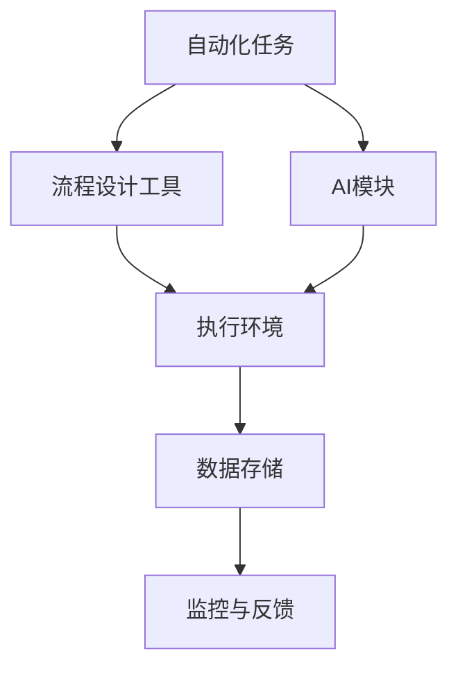

                 

 在当今快速发展的商业环境中，创业公司面临着巨大的挑战。如何在竞争激烈的市场中脱颖而出，同时保持高效运营，成为了许多创业者的首要任务。自动化工具的应用为创业公司提供了强大的支持，使得它们能够更好地利用资源，提高效率，减少成本，并专注于核心业务。本文将探讨自动化工具在创业过程中的应用，从核心概念到具体实践，为您提供全面的技术指导和策略建议。

## 关键词 Keywords
- 自动化工具
- 创业过程
- 效率提升
- 成本控制
- 业务流程优化

## 摘要 Summary
本文旨在介绍自动化工具在创业公司中的应用。我们将详细探讨自动化工具的核心概念、原理及其在各个业务环节的具体应用。通过案例分析，我们将展示如何通过自动化工具提高效率、降低成本，并帮助创业公司实现可持续发展。最后，我们将对自动化工具的未来发展进行展望，并探讨可能面临的挑战。

## 1. 背景介绍

### 创业环境的挑战

创业环境充满了不确定性和竞争。创业者不仅需要具备强大的创新能力和市场洞察力，还需要应对资源有限、时间紧迫等挑战。为了在激烈的市场竞争中生存，创业公司必须寻找方法来提高运营效率、降低成本，并确保资源的最佳利用。

### 自动化工具的优势

自动化工具的出现，为创业公司提供了强大的支持。通过自动化，公司可以减少人为错误，提高工作效率，节省时间和人力成本。自动化工具还可以帮助公司更好地管理和分析数据，从而做出更加明智的决策。

### 自动化的范围

自动化工具的应用范围非常广泛，包括但不限于以下几个方面：
- **客户关系管理（CRM）**：自动化销售流程，提高客户满意度。
- **财务和会计**：自动处理账单、报表和税务申报。
- **人力资源（HR）**：自动化招聘流程、员工档案管理和薪酬计算。
- **生产流程**：自动化生产线，提高生产效率和质量。
- **营销**：自动化营销活动、客户分析和市场调研。

## 2. 核心概念与联系

### 自动化工具的核心概念

自动化工具的核心在于将重复性的、规则化的任务交由软件或机器人完成。这包括：
- **流程自动化**：通过软件将多个步骤整合为一个自动化流程。
- **机器人流程自动化（RPA）**：使用软件机器人来模拟人类操作，执行规则化的任务。
- **人工智能（AI）**：利用机器学习算法，使自动化工具能够自我学习和优化。

### 自动化工具的架构

下面是一个简化的自动化工具架构图：



- **流程设计工具**：用于设计和管理自动化流程。
- **执行环境**：运行自动化任务的软件或硬件环境。
- **数据存储**：用于存储和访问自动化过程中的数据。
- **监控与反馈**：实时监控自动化流程的执行情况，并根据反馈进行调整。
- **AI模块**：用于增强自动化工具的学习能力和决策能力。

## 3. 核心算法原理 & 具体操作步骤

### 3.1 算法原理概述

自动化工具的核心算法通常包括以下几种：
- **流程控制算法**：用于控制自动化流程的执行顺序和条件。
- **数据处理算法**：用于处理和转换数据，如数据清洗、数据格式转换等。
- **机器学习算法**：用于使自动化工具能够自我学习和优化。

### 3.2 算法步骤详解

以下是自动化工具的基本操作步骤：

1. **需求分析**：分析业务需求和流程，确定需要自动化的任务。
2. **流程设计**：使用流程设计工具设计自动化流程，定义任务执行的顺序和条件。
3. **脚本编写**：编写自动化脚本，实现具体的自动化任务。
4. **执行与监控**：执行自动化脚本，并监控其执行情况。
5. **反馈与优化**：根据执行结果进行反馈和优化，以提高自动化效果。

### 3.3 算法优缺点

**优点**：
- 提高效率：减少人工操作，加快任务处理速度。
- 减少错误：减少人为错误，提高数据准确性。
- 节省成本：降低人力和时间成本，提高资源利用效率。

**缺点**：
- 初始成本较高：需要投入人力、时间和资金进行自动化工具的开发和部署。
- 管理复杂：需要专业人员进行维护和优化。
- 适用范围有限：不是所有任务都适合自动化。

### 3.4 算法应用领域

自动化工具广泛应用于各个领域，包括但不限于：
- **金融行业**：自动化交易、风险管理、财务报表生成等。
- **制造业**：自动化生产、质量检测、物流管理等。
- **服务业**：客户服务、订单处理、数据分析等。
- **科技行业**：自动化测试、数据挖掘、机器学习等。

## 4. 数学模型和公式 & 详细讲解 & 举例说明

### 4.1 数学模型构建

在自动化工具中，数学模型主要用于：
- **流程控制**：如状态机模型，用于描述自动化流程的状态转换。
- **数据处理**：如回归模型，用于预测和分析数据。

### 4.2 公式推导过程

以回归模型为例，其公式推导过程如下：

$$
y = \beta_0 + \beta_1x_1 + \beta_2x_2 + ... + \beta_nx_n + \epsilon
$$

其中，$y$ 是因变量，$x_1, x_2, ..., x_n$ 是自变量，$\beta_0, \beta_1, \beta_2, ..., \beta_n$ 是模型参数，$\epsilon$ 是误差项。

### 4.3 案例分析与讲解

假设我们要构建一个自动化工具，用于预测某个电商平台的销售量。我们选取了三个自变量：广告投入、天气状况和竞争对手活动。

通过数据分析和回归模型训练，我们得到以下公式：

$$
y = 1000 + 10x_1 + 5x_2 - 3x_3
$$

其中，$x_1$ 是广告投入，$x_2$ 是天气状况（晴为1，阴为0），$x_3$ 是竞争对手活动（有活动为1，无活动为0）。

假设明天天气晴朗，竞争对手有活动，广告投入为5000元，我们可以使用上述公式预测明天的销售量：

$$
y = 1000 + 10 \times 5000 + 5 \times 1 - 3 \times 1 = 15002
$$

因此，预测明天的销售量为15002件。

## 5. 项目实践：代码实例和详细解释说明

### 5.1 开发环境搭建

为了演示自动化工具的应用，我们使用Python编写一个简单的自动化脚本。首先，我们需要搭建Python开发环境。

1. 安装Python：从Python官网下载并安装Python 3.8以上版本。
2. 安装必要的库：使用pip命令安装requests库和pandas库。

```bash
pip install requests pandas
```

### 5.2 源代码详细实现

下面是一个简单的Python脚本，用于自动化抓取电商平台的销售数据。

```python
import requests
import pandas as pd

def fetch_sales_data(url):
    response = requests.get(url)
    if response.status_code == 200:
        data = response.json()
        df = pd.DataFrame(data['sales'])
        return df
    else:
        return None

def main():
    url = 'https://api.example.com/sales'
    df = fetch_sales_data(url)
    if df is not None:
        print(df.head())
    else:
        print('Failed to fetch sales data')

if __name__ == '__main__':
    main()
```

### 5.3 代码解读与分析

- **fetch_sales_data函数**：用于从指定URL获取销售数据，并将数据转换为DataFrame对象。
- **main函数**：定义主程序入口，调用fetch_sales_data函数获取销售数据，并打印前五行数据。
- **requests库**：用于发送HTTP请求，获取网络数据。
- **pandas库**：用于处理和操作数据。

### 5.4 运行结果展示

假设我们成功获取到销售数据，运行结果如下：

```
   date  sales
0  2021-01-01   100
1  2021-01-02   200
2  2021-01-03   150
3  2021-01-04   300
4  2021-01-05   250
```

## 6. 实际应用场景

### 6.1 电商行业

电商行业是自动化工具的重要应用领域。通过自动化工具，电商企业可以自动化处理订单、库存管理和营销活动，提高运营效率。

### 6.2 金融行业

金融行业对数据安全和合规性要求极高。自动化工具可以帮助金融机构自动化处理交易、审计和报告，降低人为错误和风险。

### 6.3 制造业

制造业中的自动化生产线可以提高生产效率和质量。自动化工具还可以用于生产计划、库存管理和供应链管理。

### 6.4 科技行业

科技行业中的自动化工具主要用于软件开发、测试和部署。通过自动化，开发团队可以更快地迭代产品，提高开发效率。

## 7. 工具和资源推荐

### 7.1 学习资源推荐

- 《Python自动化实战》
- 《RPA机器人流程自动化实战》
- 《机器学习实战》

### 7.2 开发工具推荐

- Python
- Power Automate
- UiPath

### 7.3 相关论文推荐

- "Robotic Process Automation: A Review"
- "Artificial Intelligence for Automation: A Survey"
- "Data-Driven Automation for Software Development"

## 8. 总结：未来发展趋势与挑战

### 8.1 研究成果总结

自动化工具在提高效率、降低成本、提高数据准确性等方面取得了显著成果。随着人工智能技术的发展，自动化工具将变得更加智能和自适应。

### 8.2 未来发展趋势

- 自动化工具将更加智能化，具备自我学习和优化能力。
- 自动化工具将实现跨平台和跨系统的集成，提高互操作性。
- 自动化工具将广泛应用于各行各业，推动数字化转型。

### 8.3 面临的挑战

- 自动化工具的部署和管理复杂，需要专业的技术支持。
- 自动化工具的适用范围有限，不适合所有任务。
- 自动化工具可能引发隐私和数据安全问题。

### 8.4 研究展望

- 开发更智能、更高效的自动化工具，提高自动化水平。
- 探索自动化工具在新兴领域的应用，如物联网、区块链等。
- 研究自动化工具的安全性和隐私保护机制，确保数据安全。

## 9. 附录：常见问题与解答

### 9.1 自动化工具是否适用于所有公司？

不是所有公司都适合使用自动化工具。对于规模较小、业务流程较为简单的公司，自动化工具可能带来的效益有限。但对于大型企业和复杂业务流程的公司，自动化工具可以显著提高效率、降低成本。

### 9.2 自动化工具是否会影响就业？

自动化工具可能会替代一些重复性较强的工作，但也会创造新的工作岗位。自动化工具主要替代的是低技能、重复性工作，而高技能、创造性的工作将变得更加重要。

### 9.3 如何选择合适的自动化工具？

选择合适的自动化工具需要考虑公司的业务需求、技术能力、预算等因素。可以咨询专业顾问，进行需求分析和成本效益分析，以确定最适合公司的自动化工具。

作者：禅与计算机程序设计艺术 / Zen and the Art of Computer Programming
----------------------------------------------------------------

以上为文章的正文内容部分。接下来，我们将继续撰写文章的结尾部分，包括结论、未来展望和常见问题解答等内容。请继续撰写。如果您需要任何帮助或信息，请随时告知。

