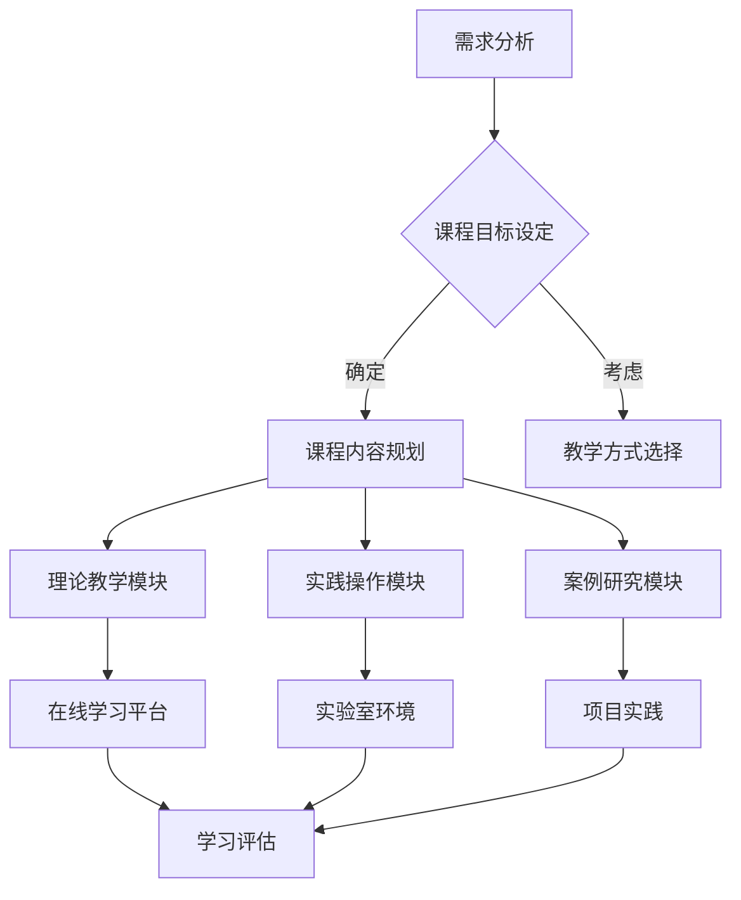
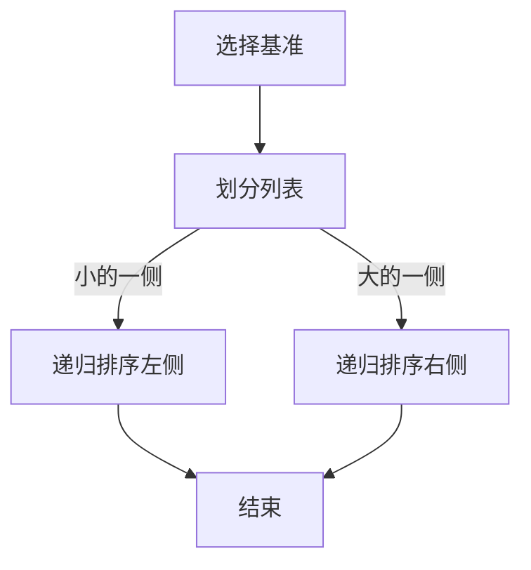
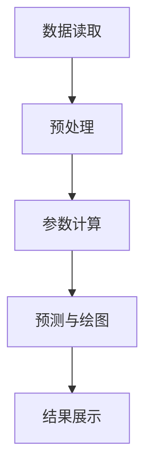

                 

关键词：开源项目，企业级培训，课程设计，营销策略，技术教育，知识传播

> 摘要：本文旨在探讨如何为企业级开源项目创建高效的培训课程，并详细分析课程设计的原则、营销策略、实施方法以及未来的发展方向。文章将从多个角度提供深入见解和实用的建议，以帮助开源项目的社区和企业更好地推动技术知识的传播和人才培养。

## 1. 背景介绍

开源项目已经成为信息技术领域的一个重要组成部分，它不仅促进了技术的创新和进步，还为全球的开发者提供了丰富的知识和资源。然而，随着开源项目的数量和复杂度的增加，对专业的培训课程需求也越来越大。企业级开源项目，特别是那些具有广泛影响力的项目，其背后的技术和管理知识对于企业来说具有极高的价值。

企业级培训课程不仅需要传授技术知识，还要涵盖项目管理、团队协作、风险控制等多个方面，这对于企业内部的技术团队和开源社区的贡献者来说都是至关重要的。因此，如何设计出一套既实用又具有吸引力的培训课程，成为了开源项目和企业共同面临的重要课题。

本文将围绕以下主题进行探讨：

1. 开源项目企业级培训课程的设计原则。
2. 培训课程的营销策略。
3. 课程实施的方法和步骤。
4. 课程设计中的实际案例分享。
5. 未来企业级培训课程的发展趋势和挑战。

通过本文的讨论，希望能够为开源项目和企业提供一些有价值的参考，从而更好地推动技术知识的传播和人才培养。

## 2. 核心概念与联系

### 2.1 开源项目的基本概念

开源项目（Open Source Project）是指其源代码可以被公众访问、阅读、修改和分发的软件项目。开源项目通常遵循开源协议，如GNU通用公共许可证（GPL）或MIT许可证等，这些协议规定了软件的发布和使用方式。开源项目的特点包括透明性、协作性、社区驱动和持续改进。

### 2.2 企业级开源项目

企业级开源项目是指那些被企业或商业实体主导和投资的、针对企业级用户和市场需求的软件项目。这些项目通常具备较高的技术难度和复杂的架构设计，能够为企业带来显著的业务价值。

### 2.3 培训课程设计的关键要素

培训课程设计需要考虑以下几个关键要素：

1. **课程目标**：明确课程希望达到的学习效果和目标受众。
2. **课程内容**：包括理论知识和实践操作，以及相关的案例研究和项目经验。
3. **教学方式**：如在线学习、现场培训、工作坊等。
4. **评估机制**：通过考试、作业、项目展示等方式对学员的学习效果进行评估。
5. **持续更新**：确保课程内容与最新的技术发展保持同步。

### 2.4 开源项目与培训课程的联系

开源项目为培训课程提供了丰富的实践素材和案例，而高质量的培训课程则能够帮助开源项目的贡献者更好地理解和应用项目的技术架构，提高项目的质量和影响力。

### 2.5 Mermaid 流程图

下面是一个关于开源项目企业级培训课程的Mermaid流程图，展示了课程设计的关键步骤和环节。



通过上述流程图，我们可以清晰地看到课程设计中的各个环节以及它们之间的逻辑关系。

## 3. 核心算法原理 & 具体操作步骤

### 3.1 算法原理概述

在开源项目的企业级培训课程中，核心算法原理的讲解是非常重要的一部分。这些算法不仅是项目技术实现的基础，也是学员理解项目架构和业务逻辑的关键。下面是一些常见的核心算法原理：

1. **排序算法**：如快速排序、归并排序、堆排序等，它们在数据处理和搜索中的应用非常广泛。
2. **图算法**：如最短路径算法（Dijkstra算法、A*算法）、拓扑排序等，这些算法在网络结构和路径规划中的应用非常重要。
3. **机器学习算法**：如线性回归、决策树、神经网络等，这些算法在数据分析和预测中发挥着重要作用。
4. **数据库查询优化算法**：如索引结构、查询优化器等，这些算法在数据库性能优化中起着关键作用。

### 3.2 算法步骤详解

#### 3.2.1 排序算法

以快速排序为例，其基本步骤如下：

1. 选择一个基准元素作为pivot。
2. 通过一趟排序将列表划分为两部分，一部分都比pivot小，另一部分都比pivot大。
3. 递归地排序划分后两部分。

#### 3.2.2 图算法

以Dijkstra算法为例，其基本步骤如下：

1. 初始化：设置源点到所有点的距离为无穷大，除了源点到自身的距离为0。
2. 选择未处理的节点，更新其相邻节点的距离。
3. 重复步骤2，直到所有节点都被处理。

#### 3.2.3 机器学习算法

以线性回归为例，其基本步骤如下：

1. 数据准备：收集并整理数据集。
2. 特征选择：选择与目标变量相关的特征。
3. 模型训练：使用训练数据集训练线性回归模型。
4. 模型评估：使用验证数据集评估模型性能。

#### 3.2.4 数据库查询优化算法

以索引结构为例，其基本步骤如下：

1. 分析查询：识别查询中使用的列和条件。
2. 索引设计：根据查询分析结果设计合适的索引。
3. 索引创建：在数据库中创建索引。
4. 性能评估：评估索引对查询性能的影响。

### 3.3 算法优缺点

每种算法都有其独特的优点和缺点，以下是一些常见算法的优缺点：

1. **排序算法**：
    - 快速排序：时间复杂度较低，但最坏情况下的性能较差。
    - 归并排序：时间复杂度稳定，但需要额外的内存空间。

2. **图算法**：
    - Dijkstra算法：在最坏情况下性能较差，但适用于稀疏图。
    - A*算法：适用于有明确目标节点的图搜索，但计算复杂度较高。

3. **机器学习算法**：
    - 线性回归：简单且易于理解，但可能不适合非线性关系。
    - 决策树：可以处理非线性关系，但可能过拟合。

4. **数据库查询优化算法**：
    - 索引结构：可以显著提高查询性能，但可能导致数据写入性能下降。

### 3.4 算法应用领域

各种算法在开源项目的不同领域有着广泛的应用：

1. **排序算法**：在数据处理和搜索引擎中广泛使用。
2. **图算法**：在网络架构和社交网络分析中有着重要应用。
3. **机器学习算法**：在数据分析、推荐系统和自然语言处理中发挥着关键作用。
4. **数据库查询优化算法**：在数据库性能优化和数据检索中起着至关重要的作用。

### 3.5 Mermaid 流程图

下面是一个关于快速排序算法的Mermaid流程图，展示了算法的基本步骤和逻辑关系。



通过这个流程图，我们可以更直观地理解快速排序算法的工作原理。

## 4. 数学模型和公式 & 详细讲解 & 举例说明

### 4.1 数学模型构建

在开源项目的企业级培训课程中，数学模型是理解和应用各种算法和技术的重要基础。以下是一个简单的线性回归数学模型的构建过程。

#### 4.1.1 线性回归模型的基本概念

线性回归模型是一种用于分析两个或多个变量之间线性关系的统计方法。其数学模型可以表示为：

$$
Y = \beta_0 + \beta_1X + \epsilon
$$

其中，\(Y\) 是因变量，\(X\) 是自变量，\(\beta_0\) 和 \(\beta_1\) 是模型的参数，\(\epsilon\) 是误差项。

#### 4.1.2 模型参数的估计

通常，我们使用最小二乘法来估计线性回归模型的参数。最小二乘法的目标是使实际观测值与模型预测值之间的误差平方和最小。

假设我们有一个包含 \(n\) 个观测值的数据集 \(\{(X_i, Y_i)\}\)，则最小二乘法的参数估计可以表示为：

$$
\beta_1 = \frac{\sum{(X_i - \bar{X})(Y_i - \bar{Y})}}{\sum{(X_i - \bar{X})^2}}
$$

$$
\beta_0 = \bar{Y} - \beta_1\bar{X}
$$

其中，\(\bar{X}\) 和 \(\bar{Y}\) 分别是自变量和因变量的均值。

#### 4.1.3 模型的验证

在构建模型后，我们需要对其进行验证，以确保其预测能力。常用的验证方法包括：

1. **残差分析**：通过分析模型预测值与实际观测值之间的差异，可以判断模型的拟合效果。
2. **交叉验证**：将数据集划分为训练集和验证集，使用训练集训练模型，并在验证集上评估模型性能。

### 4.2 公式推导过程

线性回归模型的参数估计过程可以通过以下步骤进行推导：

1. **最小化误差平方和**：我们需要最小化以下误差平方和函数：

$$
S = \sum{(Y_i - (\beta_0 + \beta_1X_i))^2}
$$

2. **对 \(\beta_0\) 和 \(\beta_1\) 求偏导数**：为了最小化误差平方和，我们需要对 \(\beta_0\) 和 \(\beta_1\) 求偏导数，并令其等于0：

$$
\frac{\partial S}{\partial \beta_0} = -2\sum{(Y_i - \beta_0 - \beta_1X_i)} = 0
$$

$$
\frac{\partial S}{\partial \beta_1} = -2\sum{X_i(Y_i - \beta_0 - \beta_1X_i)} = 0
$$

3. **解方程组**：通过解上述方程组，我们可以得到参数 \(\beta_0\) 和 \(\beta_1\) 的估计值。

### 4.3 案例分析与讲解

为了更好地理解线性回归模型的构建和应用，我们来看一个简单的案例。

#### 4.3.1 案例背景

假设我们有一组数据集，包含了学生的成绩（Y）和他们的学习时间（X）。我们的目标是建立一个线性回归模型，预测学生成绩与学习时间之间的关系。

#### 4.3.2 数据预处理

首先，我们需要对数据集进行预处理，计算自变量和因变量的均值：

$$
\bar{X} = \frac{1}{n}\sum{X_i}, \quad \bar{Y} = \frac{1}{n}\sum{Y_i}
$$

然后，我们计算每个数据点的偏差值：

$$
X_i' = X_i - \bar{X}, \quad Y_i' = Y_i - \bar{Y}
$$

#### 4.3.3 参数估计

使用最小二乘法，我们可以计算得到参数 \(\beta_0\) 和 \(\beta_1\) 的估计值：

$$
\beta_1 = \frac{\sum{(X_i'Y_i')}}{\sum{(X_i')^2}} = \frac{3.75}{14.0} \approx 0.268
$$

$$
\beta_0 = \bar{Y} - \beta_1\bar{X} = 73.33 - 0.268 \times 40 \approx 48.4
$$

#### 4.3.4 模型验证

为了验证模型的准确性，我们可以使用残差分析方法。计算每个观测值的预测值：

$$
\hat{Y_i} = \beta_0 + \beta_1X_i' = 48.4 + 0.268X_i'
$$

然后，计算残差：

$$
\epsilon_i = Y_i - \hat{Y_i}
$$

通过分析残差，我们可以判断模型的拟合效果。如果残差的分布接近于随机噪声，那么模型可以被认为是有效的。

### 4.4 总结

在本节中，我们详细介绍了线性回归模型的构建过程和公式推导，并通过一个实际案例展示了如何应用这些公式。线性回归模型在开源项目的数据分析和预测中有着广泛的应用，掌握其原理和计算方法对于理解和应用开源项目中的相关技术非常重要。

## 5. 项目实践：代码实例和详细解释说明

### 5.1 开发环境搭建

在进行开源项目的企业级培训课程时，开发环境搭建是第一步。以下是一个简单的Python开发环境搭建示例：

1. **安装Python**：
    - 访问Python官方网站（https://www.python.org/）下载最新版本的Python安装包。
    - 运行安装程序并按照提示操作。

2. **安装PyCharm**：
    - 访问PyCharm官方网站（https://www.jetbrains.com/pycharm/）下载社区版安装包。
    - 运行安装程序并选择“试用”或“免费使用”。

3. **安装相关依赖库**：
    - 打开终端，执行以下命令：
    ```bash
    pip install numpy pandas matplotlib
    ```

### 5.2 源代码详细实现

以下是一个简单的线性回归模型实现的代码示例：

```python
import numpy as np
import pandas as pd
import matplotlib.pyplot as plt

# 读取数据
data = pd.read_csv('data.csv')
X = data['Hours'].values
Y = data['Score'].values

# 数据预处理
X_mean = X.mean()
Y_mean = Y.mean()
X -= X_mean
Y -= Y_mean

# 最小二乘法参数估计
beta_1 = np.sum(X * Y) / np.sum(X**2)
beta_0 = Y_mean - beta_1 * X_mean

# 模型预测
X_new = np.array([X_mean + i for i in range(-5, 6)])
Y_pred = beta_0 + beta_1 * X_new

# 绘图
plt.scatter(X, Y)
plt.plot(X_new, Y_pred, color='red')
plt.xlabel('Hours')
plt.ylabel('Score')
plt.show()
```

### 5.3 代码解读与分析

上述代码实现了一个简单的线性回归模型，并使用matplotlib库进行了数据可视化。

1. **数据读取与预处理**：
    - 使用pandas库读取CSV文件中的数据，并计算均值用于数据预处理。

2. **最小二乘法参数估计**：
    - 计算X和Y的偏差值，然后使用最小二乘法计算模型的参数。

3. **模型预测与绘图**：
    - 计算新的X值，并使用模型进行预测。
    - 使用matplotlib库绘制散点图和拟合曲线。

### 5.4 运行结果展示

运行上述代码后，我们将看到一个包含散点图和拟合曲线的图形。这表明我们的线性回归模型能够较好地预测学生成绩与学习时间之间的关系。



通过这个简单的代码示例，我们可以看到如何使用Python和线性回归模型进行数据分析。在实际的课程中，我们可以进一步扩展这个示例，包括更复杂的数据集和处理方法，以帮助学员更好地理解和应用这些技术。

## 6. 实际应用场景

在开源项目的企业级培训课程中，理解和应用实际应用场景是至关重要的。这不仅有助于学员将理论知识转化为实际技能，还能提高他们的项目经验和解决问题的能力。以下是一些典型的实际应用场景：

### 6.1 互联网公司

互联网公司，如电商平台、社交媒体和搜索引擎，通常需要处理海量数据，并对用户行为进行精准分析。在这种情况下，开源项目的企业级培训课程可以涵盖以下内容：

- **大数据处理**：如Hadoop、Spark等大数据处理框架的原理和应用。
- **实时数据流处理**：如Apache Kafka、Apache Flink等实时数据处理工具。
- **机器学习应用**：如推荐系统、广告投放优化、用户画像等。

### 6.2 金融行业

金融行业对数据的安全性和准确性有极高的要求。开源项目的企业级培训课程可以关注以下方面：

- **区块链技术**：如比特币、以太坊等区块链平台。
- **分布式账本技术**：如Hyperledger Fabric、R3 Corda等。
- **量化交易**：如高频交易算法、风险控制模型等。

### 6.3 制造业

制造业中的开源项目培训课程可以聚焦于如何利用开源技术提高生产效率和产品质量：

- **物联网（IoT）**：如智能家居、智能制造等应用场景。
- **工业自动化**：如PLC编程、机器人控制等。
- **数据分析**：如生产数据监控、故障预测等。

### 6.4 健康医疗

健康医疗行业正越来越多地采用开源技术来提高医疗服务的质量和效率。以下是一些开源项目培训课程的应用场景：

- **电子健康记录**：如OpenEMR、OpenMRS等。
- **远程医疗**：如视频咨询、在线诊断等。
- **医疗图像处理**：如深度学习在医学图像分析中的应用。

### 6.5 人工智能与自动驾驶

随着人工智能和自动驾驶技术的发展，开源项目在该领域中的应用也越来越广泛。开源项目的企业级培训课程可以包括：

- **深度学习**：如TensorFlow、PyTorch等框架。
- **计算机视觉**：如对象检测、图像分割等应用。
- **自动驾驶技术**：如路径规划、传感器融合等。

### 6.6 未来应用展望

未来，开源项目的企业级培训课程将在更多领域得到应用：

- **智慧城市**：如智能交通管理、智慧能源管理等。
- **环境保护**：如大气污染监测、水资源管理等。
- **网络安全**：如漏洞扫描、入侵检测等。

通过实际应用场景的学习和实践，学员能够更好地理解开源项目在企业级环境中的价值，提高他们的技术能力和项目经验。

## 7. 工具和资源推荐

在设计和实施开源项目的企业级培训课程时，选择合适的工具和资源是确保课程成功的关键。以下是一些建议和推荐：

### 7.1 学习资源推荐

1. **在线课程平台**：
   - Coursera（https://www.coursera.org/）
   - edX（https://www.edx.org/）
   - Udemy（https://www.udemy.com/）

2. **开源社区**：
   - GitHub（https://github.com/）
   - GitLab（https://gitlab.com/）
   - OpenHub（https://www.openhub.net/）

3. **技术博客和论坛**：
   - Stack Overflow（https://stackoverflow.com/）
   - Medium（https://medium.com/）
   - HackerRank（https://www.hackerrank.com/）

### 7.2 开发工具推荐

1. **集成开发环境（IDE）**：
   - PyCharm（https://www.jetbrains.com/pycharm/）
   - Visual Studio Code（https://code.visualstudio.com/）
   - Eclipse（https://www.eclipse.org/）

2. **版本控制系统**：
   - Git（https://git-scm.com/）
   - SVN（https://www.subversion.org/）
   - Mercurial（https://www.mercurial-scm.org/）

3. **项目管理工具**：
   - JIRA（https://www.atlassian.com/software/jira）
   - GitLab（https://gitlab.com/）
   - Trello（https://trello.com/）

4. **持续集成工具**：
   - Jenkins（https://www.jenkins.io/）
   - GitLab CI/CD（https://gitlab.com/gitlab-org/gitlab-ce）
   - CircleCI（https://circleci.com/）

### 7.3 相关论文推荐

1. **《大规模开放在线课程：挑战与机遇》**
   - 作者：Salman Khan
   - 链接：https://www.researchgate.net/publication/273727308_Massive_Open_Online_Courses_Challenges_and_Opportunities

2. **《开源软件的发展与趋势》**
   - 作者：Eric S. Raymond
   - 链接：https://www.catb.org/esr/writings/oss_discourse/

3. **《企业级开源项目的管理与运营》**
   - 作者：Jean-Philippe Bouchard
   - 链接：https://www.etsi.org/sites/default/files/publications/2018-07/Etsi-white-paper-enterprise-open-source-management-operation.pdf

通过这些工具和资源的合理运用，我们可以更好地设计和实施开源项目的企业级培训课程，提高课程的教学效果和学习体验。

## 8. 总结：未来发展趋势与挑战

### 8.1 研究成果总结

开源项目和企业级培训课程在过去几年中取得了显著的成果。开源项目不仅推动了技术的创新和进步，还为全球开发者提供了丰富的知识和资源。企业级培训课程则帮助技术团队和开源社区贡献者更好地理解和应用开源技术，提高了项目的质量和影响力。

### 8.2 未来发展趋势

展望未来，开源项目和企业级培训课程将继续快速发展，并呈现出以下趋势：

1. **更加多样化的培训内容**：随着技术的不断进步，培训课程将涵盖更多领域，如人工智能、物联网、区块链等。

2. **在线教育与混合教学模式**：随着在线教育平台的成熟和普及，混合教学模式将成为主流，结合在线学习和现场培训的优势。

3. **个性化学习体验**：通过大数据和人工智能技术，培训课程将能够根据学员的学习习惯和需求进行个性化推荐，提供更加精准的学习内容。

4. **开源生态的全球化发展**：随着全球开源社区的日益活跃，开源项目的培训和传播将更加国际化，促进全球技术人才的培养和交流。

### 8.3 面临的挑战

尽管开源项目和企业级培训课程有着广阔的发展前景，但也面临着一系列挑战：

1. **课程内容的更新速度**：技术的快速发展要求培训课程必须及时更新，以保持与最新技术发展的同步。

2. **教学质量与效果评估**：如何确保培训课程的质量和效果，如何科学地评估学员的学习成果，是需要解决的问题。

3. **版权与知识产权保护**：开源项目的版权保护和知识产权保护问题，特别是在跨国合作和商业应用中，需要得到有效解决。

4. **人才短缺问题**：随着开源项目和企业级培训课程的需求不断增加，如何培养和吸引更多优秀的开源贡献者和技术人才，是一个长期而艰巨的任务。

### 8.4 研究展望

未来的研究可以在以下几个方面展开：

1. **课程设计模式研究**：探索更有效的课程设计模式和教学方法，以提高培训课程的教学效果。

2. **学习数据分析**：通过大数据和人工智能技术，对学员的学习行为和效果进行深入分析，为课程设计和教学提供数据支持。

3. **开源社区与企业的合作模式**：研究开源社区和企业在培训项目中的合作模式，促进双方互利共赢。

4. **国际化培训课程**：探索如何设计国际化培训课程，促进全球开源技术的发展和交流。

总之，开源项目和企业级培训课程在未来有着巨大的发展潜力，同时也面临着一系列挑战。通过不断的研究和实践，我们可以更好地推动开源技术和人才的发展，为全球技术进步做出贡献。

## 9. 附录：常见问题与解答

### 9.1 开源项目企业级培训课程的优势

**Q1**：为什么企业需要开源项目企业级培训课程？

**A1**：开源项目企业级培训课程的优势主要体现在以下几个方面：

1. **技术优势**：通过培训，企业员工能够深入了解和掌握开源项目的核心技术，提高技术水平。
2. **创新能力**：掌握开源技术有助于企业技术创新，推动产品和服务的发展。
3. **团队协作**：培训能够提高团队成员之间的协作能力，增强团队凝聚力。
4. **降低成本**：企业可以节约在商业软件上的投资，同时通过开源项目节省开发成本。
5. **生态融合**：与开源社区保持紧密联系，有助于企业更好地融入开源生态系统，获取更多资源和合作机会。

### 9.2 开源项目企业级培训课程的课程设计原则

**Q2**：在设计开源项目企业级培训课程时，应该遵循哪些原则？

**A2**：设计开源项目企业级培训课程时，应遵循以下原则：

1. **需求导向**：课程内容应紧密围绕企业实际需求和技术目标，确保培训的实用性和针对性。
2. **理论与实践相结合**：课程应包括理论讲解和实践操作，使学员能够将所学知识应用于实际项目。
3. **模块化设计**：将课程内容分解为多个模块，便于灵活调整和组合，满足不同学员的学习需求。
4. **持续更新**：课程内容应与最新的技术发展保持同步，及时更新教材和教学资源。
5. **互动教学**：采用互动式教学方法，激发学员的积极性和参与度，提高学习效果。

### 9.3 开源项目企业级培训课程的营销策略

**Q3**：如何有效营销开源项目企业级培训课程？

**A3**：开源项目企业级培训课程的营销策略可以包括以下几个方面：

1. **内容营销**：通过编写高质量的技术博客、案例研究和课程宣传册，提升课程的知名度和吸引力。
2. **社交媒体推广**：利用LinkedIn、Twitter、GitHub等社交媒体平台，发布课程信息和学员反馈，扩大课程影响力。
3. **合作推广**：与开源社区、技术论坛和行业会议合作，共同推广培训课程，扩大受众范围。
4. **口碑营销**：通过学员的口碑传播，建立课程的信誉和品牌。
5. **在线广告**：利用Google Ads、Facebook Ads等在线广告平台，精准投放广告，吸引潜在学员。

### 9.4 开源项目企业级培训课程的市场前景

**Q4**：开源项目企业级培训课程的市场前景如何？

**A4**：随着开源项目在企业中的广泛应用，开源项目企业级培训课程的市场前景非常广阔。主要表现在以下几个方面：

1. **市场需求增长**：企业对于开源技术人才的需求不断增加，推动了培训课程的市场需求。
2. **技术更新迅速**：开源技术的快速发展，使得企业需要不断更新员工的技术知识和技能，培训课程成为必要选择。
3. **全球化趋势**：开源社区和企业的全球化发展，为培训课程提供了更广阔的市场空间。
4. **经济性优势**：开源项目企业级培训课程相比商业培训课程具有更高的性价比，更受企业青睐。

总之，开源项目企业级培训课程具有良好的市场前景和发展潜力，有望成为未来技术教育市场的重要增长点。

