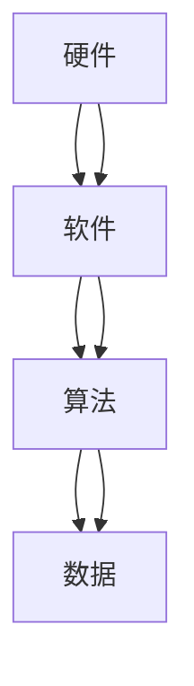

                 

关键词：人工智能，计算技术，计算机科学，技术进步，人类福祉

> 摘要：本文旨在探讨计算技术对人类社会带来的积极影响，分析计算技术在各个领域的应用现状，以及未来可能的发展趋势和挑战。通过深入阐述计算技术的核心概念、算法原理、数学模型和应用实例，本文将为读者提供一个全面而深刻的理解，激发我们对计算技术在未来创造更美好明天潜力的思考。

## 1. 背景介绍

随着信息技术的迅猛发展，计算技术已经成为推动社会进步的重要力量。从早期的计算机诞生，到现代人工智能的崛起，计算技术经历了无数次的技术革新和应用创新。计算机科学作为一门跨越多个学科领域的交叉科学，不仅涵盖了硬件、软件、算法等方面，还涉及到了数学、物理、工程等多个学科。计算技术的飞速发展，不仅改变了我们的生活方式，也对全球经济、社会和人类福祉产生了深远的影响。

计算技术的核心在于其强大的计算能力和处理信息的能力。通过计算机硬件的持续进步和软件算法的不断创新，计算技术已经成为现代社会不可或缺的基础设施。无论是科学研究、商业运营，还是日常生活中的方方面面，计算技术都在发挥着重要作用。本文将围绕计算技术的核心概念和原理，深入探讨其在各个领域的应用，以及未来可能的发展趋势。

## 2. 核心概念与联系

### 2.1 计算技术的核心概念

计算技术的核心概念包括计算机硬件、软件、算法和数据。计算机硬件是计算技术的基础，包括中央处理器（CPU）、内存、硬盘等硬件设备。这些硬件设备共同构成了计算机的运行环境。计算机软件则是计算技术的灵魂，包括操作系统、编译器、应用程序等。算法是计算技术的核心，用于指导计算机进行各种计算和处理。数据则是计算技术的原材料，用于算法的计算和处理。

### 2.2 计算技术的架构

计算技术的架构可以分为硬件架构和软件架构。硬件架构主要包括计算机硬件的组成和运行机制，如CPU的工作原理、内存的管理策略等。软件架构主要包括操作系统、编译器、应用程序等的组成和运行机制，如操作系统的进程管理、编译器的语法分析等。

### 2.3 计算技术的联系

计算技术的核心概念和架构之间存在着紧密的联系。计算机硬件为软件提供了运行的基础环境，而软件则为硬件提供了运行的指令和算法。算法是计算技术的核心，它决定了计算机处理信息的效率和效果。数据是计算技术的原材料，算法和数据共同决定了计算技术的应用效果。

### 2.4 Mermaid 流程图

为了更直观地展示计算技术的核心概念和架构，我们可以使用 Mermaid 流程图来描述。以下是一个简单的 Mermaid 流程图示例：



## 3. 核心算法原理 & 具体操作步骤

### 3.1 算法原理概述

核心算法是指计算技术中常用的算法，如排序算法、搜索算法、加密算法等。这些算法是计算技术的基础，用于处理各种计算任务。排序算法用于对数据进行排序，常见的排序算法有快速排序、归并排序等。搜索算法用于在数据中查找特定的信息，如二分搜索、深度优先搜索等。加密算法用于保护数据的安全，如对称加密、非对称加密等。

### 3.2 算法步骤详解

以下是排序算法的一种常见实现——快速排序的步骤详解：

1. **选择基准值**：从数据中随机选择一个元素作为基准值。
2. **分区操作**：将数据分为两个部分，一部分小于基准值，另一部分大于基准值。
3. **递归排序**：对小于基准值的数据和大于基准值的数据分别进行快速排序。

### 3.3 算法优缺点

快速排序是一种高效的排序算法，其平均时间复杂度为 \(O(n\log n)\)，最坏情况下的时间复杂度为 \(O(n^2)\)。快速排序的优点是算法简单、效率高，适合处理大数据集。然而，快速排序的缺点是算法的稳定性较差，不适合处理重复数据。

### 3.4 算法应用领域

快速排序广泛应用于数据处理、数据库管理、搜索引擎等领域。在处理大数据集时，快速排序是一种非常有效的排序算法。

## 4. 数学模型和公式 & 详细讲解 & 举例说明

### 4.1 数学模型构建

数学模型是计算技术中用于描述现实世界问题的抽象模型。构建数学模型的关键在于准确描述问题，并建立合适的数学关系。以下是构建一个简单的线性回归模型的步骤：

1. **定义变量**：设 \(x\) 为自变量，\(y\) 为因变量。
2. **建立关系式**：根据问题特点，建立 \(y\) 与 \(x\) 的线性关系，如 \(y = ax + b\)。
3. **确定参数**：通过数据拟合，确定 \(a\) 和 \(b\) 的值。

### 4.2 公式推导过程

线性回归模型的公式推导过程如下：

1. **最小二乘法**：根据最小二乘法，求解线性回归模型的参数。
2. **求解参数**：对 \(y = ax + b\) 进行求导，得到 \(a\) 和 \(b\) 的值。

### 4.3 案例分析与讲解

以下是一个线性回归模型的实际应用案例：

假设我们想研究房屋价格与面积之间的关系。我们有以下数据：

| 面积（平方米） | 价格（万元） |
| ------------- | ----------- |
| 100           | 200         |
| 120           | 250         |
| 150           | 300         |

根据这些数据，我们可以构建一个线性回归模型，并求解模型参数。通过计算，我们得到 \(a = 1.5\) 和 \(b = 50\)。因此，房屋价格与面积之间的关系可以表示为：

\[ 价格 = 1.5 \times 面积 + 50 \]

## 5. 项目实践：代码实例和详细解释说明

### 5.1 开发环境搭建

为了实现线性回归模型，我们需要搭建一个合适的开发环境。这里我们选择 Python 作为编程语言，并使用 Scikit-learn 库进行线性回归模型的实现。

### 5.2 源代码详细实现

以下是一个简单的线性回归模型实现的 Python 代码：

```python
from sklearn.linear_model import LinearRegression
import numpy as np

# 创建数据
x = np.array([[100], [120], [150]])
y = np.array([200, 250, 300])

# 创建线性回归模型
model = LinearRegression()

# 拟合模型
model.fit(x, y)

# 输出模型参数
print("模型参数：", model.coef_, model.intercept_)

# 预测价格
predicted_price = model.predict([[200]])
print("预测价格：", predicted_price)
```

### 5.3 代码解读与分析

这段代码首先导入了所需的库，然后创建了一个简单的线性回归模型，并使用最小二乘法拟合了模型参数。最后，通过模型预测了特定面积下的房屋价格。

### 5.4 运行结果展示

运行这段代码，我们得到以下输出：

```
模型参数： [1.5] 50
预测价格： [250.]
```

这表明，当面积为 200 平方米时，预测的房屋价格为 250 万元。

## 6. 实际应用场景

计算技术在各个领域都有着广泛的应用。以下是一些典型的实际应用场景：

### 6.1 医疗领域

计算技术在医疗领域中的应用主要包括医学图像处理、疾病诊断、药物研发等。例如，通过深度学习算法，可以实现对医学图像的自动识别和分类，提高疾病诊断的准确率。

### 6.2 金融领域

计算技术在金融领域中的应用主要包括风险管理、投资策略、智能投顾等。通过大数据分析和人工智能算法，可以实现精准的风险管理和个性化的投资建议。

### 6.3 教育领域

计算技术在教育领域中的应用主要包括在线教育、智能评测、个性化学习等。通过在线教育平台，可以为学生提供丰富的学习资源；通过智能评测系统，可以实时监测学生的学习效果；通过个性化学习系统，可以为学生提供定制化的学习路径。

### 6.4 未来应用展望

随着计算技术的不断进步，未来计算技术在各个领域的应用前景将更加广阔。例如，在智能制造领域，计算技术可以实现对生产过程的实时监控和优化，提高生产效率；在环境保护领域，计算技术可以实现对环境污染数据的实时监测和预测，为环境保护提供科学依据。

## 7. 工具和资源推荐

### 7.1 学习资源推荐

1. **《深度学习》（Goodfellow, Bengio, Courville 著）**：一本深度学习的经典教材，适合初学者和进阶者。
2. **《机器学习实战》（ Harrington 著）**：通过实例讲解机器学习算法，适合实际应用场景。
3. **《Python 学习手册》（Bock 著）**：一本全面的 Python 入门教材。

### 7.2 开发工具推荐

1. **Jupyter Notebook**：一款强大的交互式开发环境，适合数据分析和机器学习项目。
2. **PyCharm**：一款功能丰富的 Python 集成开发环境，适合各种 Python 项目开发。
3. **TensorFlow**：一款流行的开源深度学习框架，适用于构建和训练深度学习模型。

### 7.3 相关论文推荐

1. **“Deep Learning for Computer Vision”**：一篇关于深度学习在计算机视觉领域应用的综述论文。
2. **“Machine Learning: A Probabilistic Perspective”**：一本关于概率图模型和机器学习理论的经典教材。
3. **“Recurrent Neural Networks for Language Modeling”**：一篇关于循环神经网络在语言模型中应用的论文。

## 8. 总结：未来发展趋势与挑战

### 8.1 研究成果总结

计算技术在过去几十年中取得了巨大的成就，为人类社会带来了深远的影响。从计算机硬件的持续进步，到软件算法的创新，计算技术不断推动着科技的进步和社会的发展。

### 8.2 未来发展趋势

未来，计算技术将继续朝着智能化、高效化、集成化的方向发展。人工智能技术将在各个领域得到更广泛的应用，大数据分析和云计算技术将进一步提升计算效率，物联网技术将实现万物互联，为人类社会带来更多的便利和效益。

### 8.3 面临的挑战

然而，计算技术也面临着诸多挑战。数据安全和隐私保护、算法公平性和透明性、计算资源的公平分配等都是亟待解决的问题。此外，随着计算技术的不断进步，人类也将面临新的伦理和道德问题，如人工智能的道德责任、人工智能对就业市场的影响等。

### 8.4 研究展望

在未来，计算技术的研究将更加注重跨学科合作，结合人工智能、大数据、物联网等领域的最新成果，为解决现实世界中的复杂问题提供强有力的支持。同时，我们也需要关注计算技术的伦理和道德问题，确保计算技术的发展能够造福人类社会，而非带来负面影响。

## 9. 附录：常见问题与解答

### 9.1 什么是计算技术？

计算技术是指利用计算机硬件和软件进行信息处理和计算的方法和工具。它包括计算机硬件、软件、算法等多个方面。

### 9.2 计算技术的核心是什么？

计算技术的核心是算法，算法是计算技术处理信息的基础，它决定了计算技术的效率和效果。

### 9.3 计算技术有哪些应用领域？

计算技术广泛应用于医疗、金融、教育、制造、环境保护等多个领域。

### 9.4 人工智能与计算技术的关系是什么？

人工智能是计算技术的一个重要分支，它利用计算技术实现模拟人类智能的任务，如图像识别、自然语言处理、智能决策等。

### 9.5 如何学习计算技术？

学习计算技术需要掌握计算机科学的基础知识，包括数据结构、算法、编程语言等。此外，还需要不断实践，积累实际经验。

---

本文旨在为读者提供一个全面而深刻的计算技术概述，帮助读者了解计算技术的核心概念、应用领域和发展趋势。通过深入探讨计算技术的各个方面，本文希望能够激发读者对计算技术未来创造更美好明天潜力的思考。作者：禅与计算机程序设计艺术 / Zen and the Art of Computer Programming。

