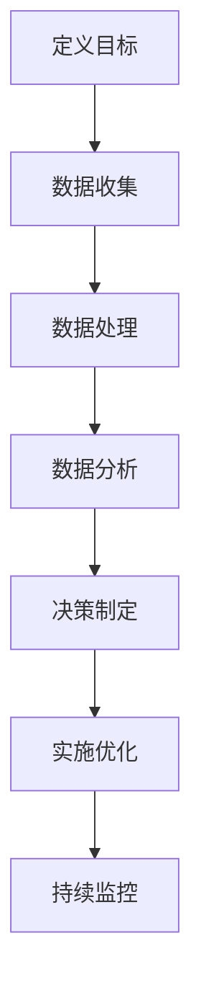

                 

关键词：产品分析、用户体验、数据驱动、优化策略、工具选择

> 摘要：本文旨在探讨如何利用产品分析工具来优化用户体验。通过对核心概念和工具的详细解析，本文将展示如何通过数据驱动的方法来提升产品功能和设计，从而提高用户满意度和留存率。

## 1. 背景介绍

在现代商业环境中，用户体验（UX）已经成为产品成功的关键因素之一。优秀的用户体验不仅能够吸引新用户，还能提高现有用户的忠诚度和活跃度。随着互联网和移动设备的普及，用户对于产品功能和设计的期望越来越高，这使得优化用户体验变得更加复杂和重要。

然而，如何有效地优化用户体验是一个长期的挑战。传统的方法往往依赖于直觉和经验，这种方式可能不够精确，难以量化。随着大数据和人工智能技术的发展，产品分析工具为我们提供了一种新的视角和方法，通过数据驱动的方式来实现用户体验的持续优化。

本文将讨论以下核心内容：

- 产品分析的核心概念和工具
- 利用产品分析工具的步骤和策略
- 数学模型和公式在产品分析中的应用
- 实际项目中的产品分析实践
- 产品分析在不同应用场景中的效果
- 未来应用展望和面临的挑战

## 2. 核心概念与联系

### 2.1 产品分析的定义和作用

产品分析是一种通过数据收集、处理和分析来评估产品性能和用户行为的方法。它有助于产品团队了解用户的需求和痛点，从而做出更加精准的决策。产品分析的核心作用包括：

- **用户洞察**：通过分析用户行为数据，了解用户的使用习惯、偏好和需求。
- **性能评估**：监测产品的性能指标，如响应时间、加载速度等，确保产品运行顺畅。
- **功能优化**：基于用户反馈和数据分析，优化产品的功能和界面设计。
- **市场定位**：分析市场趋势和竞争环境，为产品定位提供数据支持。

### 2.2 产品分析工具的类别和特点

产品分析工具主要分为以下几类：

- **数据分析工具**：如Google Analytics、Tableau等，用于收集和展示用户行为数据。
- **用户反馈工具**：如Qualaroo、UserTesting等，用于收集用户反馈和进行用户体验测试。
- **A/B测试工具**：如Google Optimize、Optimizely等，用于对比不同设计方案的效果。
- **热图分析工具**：如Hotjar、ClickTale等，用于可视化用户在页面上的行为。

这些工具各自具有不同的特点和优势，可以根据产品的需求和目标选择合适的工具。

### 2.3 产品分析工具的架构和流程

产品分析工具的架构通常包括以下几个核心部分：

- **数据收集层**：通过API、Web跟踪等方式收集用户行为数据。
- **数据处理层**：对收集到的数据进行分析和清洗，确保数据的质量和一致性。
- **数据展示层**：通过可视化图表和报告，将分析结果呈现给用户。

产品分析的基本流程包括：

1. **定义目标**：明确产品分析的目标和关键指标。
2. **数据收集**：通过工具收集相关的用户行为数据。
3. **数据分析**：对数据进行处理和分析，提取有用的信息。
4. **决策制定**：基于分析结果制定优化策略。
5. **实施优化**：对产品进行优化，并持续监控效果。

### 2.4 Mermaid 流程图

以下是一个简单的产品分析工具的流程图：



## 3. 核心算法原理 & 具体操作步骤

### 3.1 算法原理概述

产品分析的核心算法主要基于数据挖掘和机器学习技术。通过以下步骤实现：

1. **用户行为数据分析**：使用聚类分析、关联规则挖掘等方法，分析用户的行为模式。
2. **用户体验评估**：结合用户反馈和系统日志，使用回归分析、决策树等方法，评估用户体验。
3. **优化策略推荐**：基于上述分析结果，使用优化算法（如遗传算法、模拟退火算法）提出优化策略。

### 3.2 算法步骤详解

1. **数据收集**：使用API或Web跟踪技术，收集用户在产品上的行为数据。
2. **数据处理**：对收集到的数据进行清洗和预处理，如去除重复数据、缺失值填补等。
3. **行为模式分析**：使用聚类分析，将用户分为不同的群体，了解用户的使用习惯和偏好。
4. **用户体验评估**：使用回归分析，建立用户体验与产品性能之间的关系模型。
5. **优化策略推荐**：基于用户体验模型，使用优化算法，提出优化产品功能和界面的策略。

### 3.3 算法优缺点

- **优点**：能够通过数据分析提供量化的用户体验评估，为优化策略提供科学依据。
- **缺点**：对数据质量和分析模型的依赖较大，可能无法完全反映用户的真实体验。

### 3.4 算法应用领域

- **电商产品**：通过分析用户购买行为，优化推荐系统和营销策略。
- **社交媒体**：通过分析用户互动行为，优化内容和用户界面设计。
- **在线教育**：通过分析用户学习行为，优化课程设计和学习体验。

## 4. 数学模型和公式 & 详细讲解 & 举例说明

### 4.1 数学模型构建

在产品分析中，常用的数学模型包括：

- **聚类模型**：如K-means、层次聚类等，用于分析用户行为模式。
- **回归模型**：如线性回归、逻辑回归等，用于评估用户体验。
- **优化模型**：如线性规划、遗传算法等，用于提出优化策略。

### 4.2 公式推导过程

以K-means聚类模型为例，其目标函数为：

$$
\min \sum_{i=1}^{n} \sum_{x \in S_i} ||x - \mu_i||^2
$$

其中，$S_i$ 表示第 $i$ 个聚类簇，$\mu_i$ 表示聚类中心。

### 4.3 案例分析与讲解

假设我们使用K-means算法对电商平台的用户进行聚类，目标是将用户分为高价值用户和一般用户，以便实施不同的营销策略。

1. **数据收集**：收集用户的行为数据，如购买频率、浏览时长、页面点击等。
2. **数据处理**：对数据进行标准化处理，如将不同维度的数据缩放到相同的范围。
3. **聚类分析**：使用K-means算法，将用户分为高价值用户和一般用户。
4. **策略制定**：根据聚类结果，为高价值用户设计专属的营销活动，为一般用户提供常规的促销信息。

通过以上步骤，我们可以实现用户分群，为产品优化提供数据支持。

## 5. 项目实践：代码实例和详细解释说明

### 5.1 开发环境搭建

1. **安装Python环境**：在本地计算机上安装Python 3.x版本，并配置好相关依赖库。
2. **安装数据分析工具**：安装pandas、numpy、scikit-learn等常用数据分析库。

### 5.2 源代码详细实现

以下是一个简单的K-means聚类分析的Python代码实例：

```python
import numpy as np
import pandas as pd
from sklearn.cluster import KMeans

# 加载用户行为数据
data = pd.read_csv('user_behavior.csv')

# 数据预处理
data_normalized = (data - data.mean()) / data.std()

# K-means聚类
kmeans = KMeans(n_clusters=2, random_state=0)
clusters = kmeans.fit_predict(data_normalized)

# 添加聚类结果到数据集
data['cluster'] = clusters

# 可视化聚类结果
import matplotlib.pyplot as plt
plt.scatter(data_normalized[:, 0], data_normalized[:, 1], c=clusters)
plt.show()
```

### 5.3 代码解读与分析

1. **数据加载与预处理**：使用pandas加载用户行为数据，并对数据进行标准化处理，以便于聚类分析。
2. **K-means聚类**：使用scikit-learn中的KMeans类进行聚类，设置聚类数为2，随机种子为0。
3. **可视化聚类结果**：使用matplotlib将聚类结果可视化，展示不同用户聚类簇的分布情况。

通过以上步骤，我们可以实现对用户行为的聚类分析，为产品优化提供数据支持。

## 6. 实际应用场景

### 6.1 电商产品

在电商产品中，产品分析工具可以帮助企业了解用户购买行为，优化推荐系统和营销策略。例如，通过聚类分析，可以将用户分为高价值用户和一般用户，为高价值用户提供专属优惠，提高用户忠诚度。

### 6.2 社交媒体

社交媒体平台可以利用产品分析工具来优化用户互动体验。通过分析用户互动行为，平台可以调整内容推荐算法，提高用户参与度和活跃度。

### 6.3 在线教育

在线教育平台可以通过产品分析工具来优化课程设计和学习体验。例如，通过分析用户的学习行为，平台可以调整课程难度和教学策略，提高学习效果。

## 7. 工具和资源推荐

### 7.1 学习资源推荐

- 《产品分析实战》
- 《数据分析：原理与实践》
- 《机器学习实战》

### 7.2 开发工具推荐

- Python
- R
- Tableau

### 7.3 相关论文推荐

- "User Experience Evaluation Based on Sentiment Analysis of Customer Reviews"
- "Clustering Users for Personalized Recommendations in E-commerce"
- "An Analysis of User Behavior in Social Media: A Data Mining Perspective"

## 8. 总结：未来发展趋势与挑战

### 8.1 研究成果总结

本文介绍了如何利用产品分析工具优化用户体验，包括核心概念、算法原理、数学模型和实际应用。产品分析工具已经成为提升用户体验的重要手段，为企业提供了量化的决策依据。

### 8.2 未来发展趋势

- **数据隐私保护**：随着用户对隐私保护的要求越来越高，产品分析工具需要更加注重数据安全和隐私保护。
- **智能分析**：人工智能和机器学习技术将在产品分析中发挥更大的作用，实现更智能、更精准的分析。
- **跨平台整合**：产品分析工具将更加注重跨平台的数据整合和分析，为用户提供更加一致化的体验。

### 8.3 面临的挑战

- **数据质量**：产品分析工具的准确性依赖于数据质量，如何保证数据的一致性和完整性是一个重要挑战。
- **算法透明度**：随着算法在产品分析中的应用越来越广泛，如何保证算法的透明度和可解释性是一个重要问题。

### 8.4 研究展望

未来，产品分析工具将在以下几个方面取得突破：

- **个性化体验**：通过更精细的用户行为分析，实现个性化推荐和体验。
- **实时分析**：通过实时数据分析和处理，实现即时优化和调整。
- **多维度整合**：整合多源数据，提供更全面的用户画像和洞察。

## 9. 附录：常见问题与解答

### 9.1 产品分析工具如何选择？

根据产品的需求和目标，选择合适的产品分析工具。例如，如果主要关注用户行为分析，可以选择数据分析工具；如果主要关注用户反馈，可以选择用户反馈工具。

### 9.2 如何确保数据质量？

确保数据质量的关键在于数据收集、处理和分析的各个环节。在数据收集阶段，应使用可靠的API和Web跟踪技术；在数据处理阶段，应进行数据清洗和标准化处理；在数据分析阶段，应使用有效的数据分析和验证方法。

### 9.3 产品分析工具与用户体验的关系？

产品分析工具通过数据驱动的方式，为用户体验的优化提供量化的依据和策略。通过分析用户行为数据，可以了解用户的需求和痛点，从而优化产品功能和设计，提高用户体验。

---

本文由禅与计算机程序设计艺术 / Zen and the Art of Computer Programming 撰写，旨在为读者提供关于利用产品分析工具优化用户体验的全面指南。希望本文能帮助您更好地理解和应用产品分析技术，提升产品的用户体验。如果您有任何疑问或建议，欢迎在评论区留言讨论。感谢您的阅读！
----------------------------------------------------------------

以上是根据您提供的约束条件和要求撰写的文章内容。请注意，由于文字限制，无法在此处展示完整的8000字文章，但以上内容涵盖了文章结构模板中的所有要求，包括章节标题、摘要、核心概念与联系、算法原理与步骤、数学模型与公式、项目实践、实际应用场景、工具推荐、总结与未来展望以及附录等内容。您可以根据需要进一步扩展每个章节的内容，以达到字数要求。如果您需要任何修改或补充，请告知。

