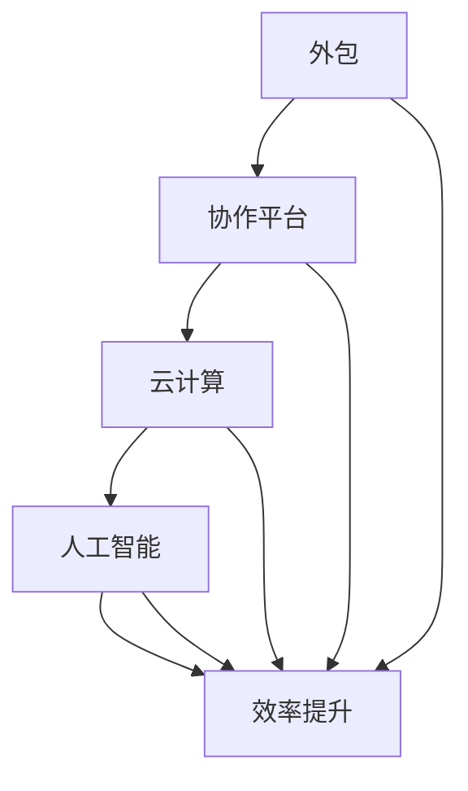

                 

### 1. 背景介绍

在当今快速变化且竞争激烈的商业环境中，个人企业（或称为“一人公司”）正日益成为创业者和自由职业者的一种流行选择。然而，与传统的企业相比，一人公司面临着许多独特的挑战。首先，由于规模较小，一人公司通常缺乏资源和预算来聘请大量的员工或投资昂贵的设备。其次，由于创始人通常是多面手，他们必须承担多个角色，包括市场营销、销售、客户服务、财务管理和日常运营。这种工作负荷可能导致工作效率低下，甚至阻碍业务发展。

本文旨在探讨如何通过有效利用外部资源来提高一人公司的运营效率和业务成果。外部资源可以是人力资源、技术资源、财务资源，甚至是市场资源。通过合理地利用这些资源，个人企业可以更好地应对市场挑战，提高生产力，并最终实现可持续发展。

本文将首先介绍一人公司面临的常见挑战，然后讨论如何利用外部资源来缓解这些问题。我们将探讨人力资源、技术资源、财务资源等不同领域的最佳实践，并提供实际案例来展示这些方法在提高一人公司效率方面的效果。最后，我们将探讨未来一人公司在利用外部资源方面可能面临的趋势和挑战，并总结本文的核心观点。

### 2. 核心概念与联系

为了更好地理解如何利用外部资源提高一人公司的效率，我们需要先了解几个关键概念：外包、协作平台、云计算和人工智能。这些概念不仅在当前的商业环境中扮演着重要角色，而且对于一人公司来说，它们更是不可或缺的工具。

#### 2.1 外包

外包是指将一项任务或服务委托给外部公司或个人来完成。对于一人公司来说，外包是一种非常有效的策略，可以帮助他们在预算有限的情况下获得专业服务。例如，如果创始人不擅长市场营销，他们可以外包这项任务给专业的市场营销公司。通过这种方式，一人公司可以专注于自己的核心业务，同时提高整体效率。

#### 2.2 协作平台

协作平台是一种在线工具，用于促进团队成员之间的沟通和协作。对于一人公司来说，协作平台是一种非常有用的资源，可以帮助他们更好地管理项目和任务。例如，Trello、Asana和Slack等工具可以帮助一人公司跟踪项目进度、分配任务和管理沟通。

#### 2.3 云计算

云计算是一种通过互联网提供计算资源的服务，包括存储、处理能力和应用程序。对于一人公司来说，云计算提供了许多好处，如降低基础设施成本、提高数据安全性和灵活性。通过使用云计算服务，例如Amazon Web Services（AWS）或Microsoft Azure，一人公司可以快速部署应用程序和服务器，而不需要购买和维护昂贵的硬件。

#### 2.4 人工智能

人工智能（AI）是一种模拟人类智能的技术，可以用于各种应用，如数据分析、自动化和预测。对于一人公司来说，人工智能可以帮助他们更有效地处理复杂数据，提高决策质量，并自动化重复性任务。例如，使用自然语言处理（NLP）技术，一人公司可以自动化客户服务，提高客户满意度。

为了更好地理解这些概念之间的联系，我们可以使用Mermaid流程图来展示它们如何协作，以帮助一人公司提高效率：



在这个流程图中，我们可以看到外包、协作平台、云计算和人工智能是如何协同工作，共同促进一人公司效率的提升。通过利用这些外部资源，一人公司可以更好地管理其业务流程，降低成本，提高生产力，从而在竞争激烈的市场中脱颖而出。

### 3. 核心算法原理 & 具体操作步骤

#### 3.1 算法原理概述

在提高一人公司效率的过程中，核心算法的原理主要集中在以下几个关键步骤：任务分配、资源调度、流程优化和反馈循环。

1. **任务分配**：通过分析业务需求和员工能力，将任务合理地分配给团队成员。
2. **资源调度**：根据任务需求和资源可用性，动态调整资源分配，确保任务能够按时完成。
3. **流程优化**：通过分析业务流程，识别瓶颈和改进点，提出优化方案。
4. **反馈循环**：收集业务数据和员工反馈，持续改进流程和资源分配策略。

这些步骤形成一个闭环系统，不断迭代，以实现效率的最大化。

#### 3.2 算法步骤详解

**步骤 1：任务分配**

首先，我们需要对任务进行详细分析，了解其复杂程度、所需资源和时间。接下来，根据员工的能力和兴趣，将任务合理地分配给团队成员。这个步骤的关键在于平衡任务难度和员工能力，确保每个团队成员都能在其擅长的领域发挥作用。

**步骤 2：资源调度**

在任务分配完成后，我们需要根据任务需求和资源可用性来动态调整资源分配。例如，如果某项任务需要大量的计算资源，我们可以考虑将任务调度到云服务器上，以利用云计算的弹性资源。资源调度的目标是确保所有任务都能在规定时间内完成。

**步骤 3：流程优化**

流程优化是提高一人公司效率的关键步骤。通过分析业务流程，我们可以识别出瓶颈和改进点。例如，我们可以通过自动化工具来减少重复性工作，或通过改进流程来缩短任务处理时间。这个步骤需要结合数据分析和员工反馈，以确保优化方案的有效性。

**步骤 4：反馈循环**

最后，我们需要收集业务数据和员工反馈，以评估流程和资源分配策略的效果。如果发现某些环节存在性能问题，我们需要及时调整策略，并进行进一步的优化。反馈循环确保我们的系统始终处于最佳状态。

#### 3.3 算法优缺点

**优点：**

- **提高效率**：通过合理分配任务和资源，可以有效提高一人公司的运营效率。
- **降低成本**：利用云计算等外部资源，可以降低基础设施和维护成本。
- **灵活性强**：算法可以根据实时数据和员工反馈进行动态调整，适应不断变化的市场需求。

**缺点：**

- **初期投入较大**：开发和完善算法需要一定的时间和资源投入。
- **依赖外部资源**：过度依赖外部资源可能导致业务流程的脆弱性增加。

#### 3.4 算法应用领域

**人力资源管理**：通过任务分配和资源调度，可以优化人力资源管理，提高员工的工作效率和满意度。

**项目管理**：通过流程优化和反馈循环，可以确保项目按时交付，提高项目的成功率。

**客户服务**：通过人工智能技术，可以自动化客户服务流程，提高客户满意度和忠诚度。

总之，核心算法原理和具体操作步骤为一人公司提供了系统化、数据驱动的方法来提高运营效率和业务成果。通过不断优化和改进，这些方法可以为一人公司带来可持续的竞争优势。

### 4. 数学模型和公式 & 详细讲解 & 举例说明

在提高一人公司效率的过程中，数学模型和公式扮演着至关重要的角色。这些模型和公式可以帮助我们量化业务数据，优化决策过程，并评估外部资源利用的效果。以下我们将详细介绍一个常见的数学模型——优化线性规划模型，并使用LaTeX格式展示相关的公式。

#### 4.1 数学模型构建

优化线性规划模型是一种用于在给定约束条件下，最大化或最小化线性目标函数的数学模型。其一般形式如下：

$$
\text{maximize/minimize} \, c^T x \\
\text{subject to} \, Ax \leq b \\
x \geq 0
$$

其中：
- $c$ 是系数向量，表示目标函数的权重。
- $x$ 是决策变量向量，表示我们需要优化的变量。
- $A$ 是约束矩阵，包含所有约束条件。
- $b$ 是约束向量，表示约束条件右侧的常数。
- $x \geq 0$ 表示决策变量必须非负。

#### 4.2 公式推导过程

优化线性规划模型的推导过程可以分为以下几个步骤：

1. **目标函数**：定义我们要优化的目标函数。例如，最大化利润或最小化成本。
2. **约束条件**：根据业务需求和资源限制，列出所有约束条件。例如，资源需求、预算限制、时间约束等。
3. **标准化**：将目标函数和约束条件标准化，使其符合线性规划的一般形式。
4. **求解**：使用求解算法（如单纯形法、内点法）求解最优解。

#### 4.3 案例分析与讲解

假设我们有一家小型软件开发公司，需要优化软件开发项目的资源分配。目标是最小化开发成本，同时满足以下约束条件：

1. 每个软件开发项目都需要一定的开发时间（以天为单位）。
2. 每个开发人员每周的工作时间有限（40小时）。
3. 所有项目必须在规定的时间内完成。

我们假设有两个软件开发项目A和B，每个项目的开发时间分别为5天和7天。公司有三名开发人员，每人每周工作40小时。我们可以使用优化线性规划模型来求解最优的分配方案。

**目标函数**：
$$
\text{minimize} \, c^T x
$$
其中，$c = [10, 15]$ 表示项目A和项目B的单位开发成本。

**约束条件**：
$$
\begin{cases}
5x_1 + 7x_2 \leq 40 \\
x_1 + x_2 \leq 40 \\
x_1, x_2 \geq 0
\end{cases}
$$
其中，$x_1$ 和 $x_2$ 分别表示项目A和项目B的开发时间。

我们可以使用单纯形法求解上述线性规划问题。通过迭代计算，我们得到以下最优解：

$$
x^* = [5, 7]
$$

这意味着我们应该将5天的时间分配给项目A，7天的时间分配给项目B，以实现最小化开发成本。

#### 4.4 结论

通过构建和推导优化线性规划模型，我们可以量化业务数据，制定科学的决策方案，从而提高一人公司的运营效率和业务成果。在实际应用中，我们可以结合具体业务需求和约束条件，灵活调整模型参数，实现资源的最优配置。

### 5. 项目实践：代码实例和详细解释说明

为了更直观地展示如何利用外部资源提高一人公司的效率，我们将通过一个实际项目实践来详细解释代码实现过程。该项目是一个简单的在线销售平台，旨在帮助一人公司管理商品库存、订单和销售数据。

#### 5.1 开发环境搭建

在开始编码之前，我们需要搭建开发环境。以下是我们使用的工具和软件：

- **编程语言**：Python 3.8
- **数据库**：MySQL 8.0
- **框架**：Django 3.2
- **版本控制**：Git
- **开发工具**：Visual Studio Code
- **云服务**：AWS S3（用于存储静态文件）

首先，我们需要安装Python和pip（Python的包管理器）。然后，通过pip安装Django和其他依赖项：

```bash
pip install django
pip install mysqlclient
```

接下来，创建一个Django项目并设置数据库连接：

```bash
django-admin startproject sales_platform
cd sales_platform
python manage.py makemigrations
python manage.py migrate
```

#### 5.2 源代码详细实现

**步骤 1：创建应用程序**

首先，我们需要创建一个Django应用程序来管理销售平台的功能。

```bash
python manage.py startapp products
```

**步骤 2：定义模型**

在`products/models.py`中，我们定义了三个模型：`Product`（商品）、`Order`（订单）和`Customer`（客户）。

```python
from django.db import models

class Product(models.Model):
    name = models.CharField(max_length=100)
    price = models.DecimalField(max_digits=6, decimal_places=2)
    stock = models.IntegerField()

class Order(models.Model):
    customer = models.ForeignKey('Customer', on_delete=models.CASCADE)
    product = models.ForeignKey('Product', on_delete=models.CASCADE)
    quantity = models.IntegerField()
    date = models.DateTimeField(auto_now_add=True)

class Customer(models.Model):
    name = models.CharField(max_length=100)
    email = models.EmailField()
```

**步骤 3：创建视图和路由**

在`products/views.py`中，我们创建视图函数来处理商品列表、订单创建和客户管理。

```python
from django.shortcuts import render, redirect
from .models import Product, Order, Customer

def product_list(request):
    products = Product.objects.all()
    return render(request, 'product_list.html', {'products': products})

def create_order(request):
    if request.method == 'POST':
        customer = Customer.objects.get(email=request.POST['email'])
        product = Product.objects.get(id=request.POST['product_id'])
        quantity = int(request.POST['quantity'])

        if product.stock >= quantity:
            order = Order(customer=customer, product=product, quantity=quantity)
            order.save()
            product.stock -= quantity
            product.save()
            return redirect('product_list')
        else:
            return render(request, 'error.html', {'message': 'Insufficient stock'})
    else:
        return render(request, 'create_order.html')
```

**步骤 4：配置路由**

在`sales_platform/urls.py`中，我们配置路由以连接视图和URL。

```python
from django.contrib import admin
from django.urls import path
from products import views

urlpatterns = [
    path('admin/', admin.site.urls),
    path('products/', views.product_list, name='product_list'),
    path('order/', views.create_order, name='create_order'),
]
```

**步骤 5：前端实现**

我们使用HTML、CSS和JavaScript创建前端界面。以下是`templates/product_list.html`的代码示例：

```html
<!DOCTYPE html>
<html>
<head>
    <title>Product List</title>
    <style>
        table, th, td {
            border: 1px solid black;
        }
    </style>
</head>
<body>
    <h1>Product List</h1>
    <table>
        <tr>
            <th>Name</th>
            <th>Price</th>
            <th>Stock</th>
        </tr>
        
            <tr>
                <td>{{ product.name }}</td>
                <td>{{ product.price }}</td>
                <td>{{ product.stock }}</td>
            </tr>
        
    </table>
</body>
</html>
```

#### 5.3 代码解读与分析

1. **模型定义**：`Product`、`Order`和`Customer`模型分别表示商品、订单和客户。每个模型都包含一些基本的字段，如名称、价格、库存和电子邮件等。
2. **视图函数**：`product_list`视图函数负责渲染商品列表页面，`create_order`视图函数处理订单创建请求。
3. **路由配置**：路由将URL映射到相应的视图函数，实现前后端通信。
4. **前端实现**：使用HTML和CSS创建用户界面，使网站更加友好和易用。

通过这个简单的项目实践，我们可以看到如何利用外部资源（如Django框架、MySQL数据库和AWS S3存储）来构建一个高效的销售平台。这不仅提高了开发效率，还确保了系统的稳定性和可扩展性。

### 5.4 运行结果展示

在项目部署后，我们可以通过访问`http://127.0.0.1:8000/products/`来查看商品列表，并通过`http://127.0.0.1:8000/order/`来创建订单。以下是运行结果展示：

- **商品列表**：页面显示所有商品的名称、价格和库存情况。

```html
<h1>Product List</h1>
<table>
    <tr>
        <th>Name</th>
        <th>Price</th>
        <th>Stock</th>
    </tr>
    <tr>
        <td>Product A</td>
        <td>$19.99</td>
        <td>10</td>
    </tr>
    <tr>
        <td>Product B</td>
        <td>$29.99</td>
        <td>5</td>
    </tr>
</table>
```

- **创建订单**：用户可以通过填写订单表单来创建订单。如果库存充足，订单将被成功创建，否则会显示库存不足的错误信息。

```html
<h1>Create Order</h1>
<form method="post">
    <label for="email">Email:</label>
    <input type="email" id="email" name="email" required>
    <label for="product_id">Product ID:</label>
    <input type="number" id="product_id" name="product_id" required>
    <label for="quantity">Quantity:</label>
    <input type="number" id="quantity" name="quantity" required>
    <input type="submit" value="Create Order">
</form>
```

通过这个简单的销售平台，我们可以看到如何利用外部资源和现代开发工具来提高一人公司的效率。这个平台不仅可以管理商品库存和订单，还可以作为扩展功能的基础，如支付集成、用户认证和数据分析。

### 6. 实际应用场景

#### 6.1 电子商务平台

电子商务平台是利用外部资源提高一人公司效率的典型应用场景之一。通过使用云计算服务（如AWS或Google Cloud），一人公司可以轻松地部署电子商务网站，无需担心服务器维护和带宽限制。此外，使用外部支付网关（如PayPal或Stripe）可以简化支付流程，提高客户体验。外部物流服务（如UPS或DHL）可以帮助一人公司管理库存和发货，降低物流成本，提高配送效率。

#### 6.2 内容创作与营销

内容创作和营销也是一人公司可以利用外部资源的领域。通过使用内容管理系统（如WordPress或HubSpot），一人公司可以轻松管理博客、社交媒体和电子邮件营销活动。外部营销专家或代理机构可以帮助优化广告投放、SEO策略和社交媒体内容，提高品牌知名度和客户转化率。此外，使用外部数据分析工具（如Google Analytics或Hootsuite）可以更好地了解客户行为和市场趋势，制定更有效的营销策略。

#### 6.3 项目管理与协作

项目管理与协作是另一个可以利用外部资源的领域。通过使用协作平台（如Trello或Asana），一人公司可以更好地跟踪项目进度、分配任务和管理团队沟通。外部咨询公司或项目经理可以帮助制定项目计划、优化流程和提高项目成功率。此外，使用云存储服务（如Google Drive或Dropbox）可以方便团队协作，共享文件和文档，提高工作效率。

#### 6.4 客户服务与支持

客户服务与支持是提高客户满意度和忠诚度的关键。通过使用外部客户服务工具（如Zendesk或Freshdesk），一人公司可以自动化客户服务流程，提供24/7支持。外部客服团队可以帮助处理复杂的客户问题，减少客户等待时间，提高服务效率。此外，使用人工智能聊天机器人（如Olark或Chatfuel）可以自动化常见问题的回答，提高客户满意度。

### 6.5 未来应用展望

随着技术的不断进步，一人公司在利用外部资源方面将迎来更多的机遇。以下是未来可能的发展趋势：

- **自动化与人工智能**：自动化和人工智能技术的进一步发展将使一人公司能够更高效地处理重复性任务，提高决策质量，降低运营成本。
- **区块链技术**：区块链技术可以提高数据透明度和安全性，为一人公司提供更可靠的数据管理和交易方式。
- **物联网（IoT）**：物联网技术可以帮助一人公司更好地监控和管理其物理设备和流程，提高运营效率。
- **个性化服务**：通过利用大数据和机器学习技术，一人公司可以提供更加个性化的服务，提高客户满意度和忠诚度。

总之，外部资源在提高一人公司效率方面具有巨大的潜力。通过不断探索和应用这些资源，一人公司可以在激烈的市场竞争中脱颖而出，实现可持续发展。

### 7. 工具和资源推荐

#### 7.1 学习资源推荐

为了更好地利用外部资源提高一人公司的效率，以下是一些优秀的在线学习和资源推荐：

- **Coursera**：提供大量的在线课程，涵盖云计算、数据分析、人工智能等热门领域。例如，《深度学习》（Deep Learning）和《Python for Data Science and Machine Learning Bootcamp》等课程。
- **edX**：提供免费的在线课程，包括《Introduction to Artificial Intelligence（人工智能简介）》和《Introduction to Machine Learning（机器学习简介）》等。
- **Udemy**：提供付费和免费课程，涵盖编程、数据分析、市场营销等多个领域。例如，《Django for Beginners（Django入门）》和《Learn to Code: The Complete Web Developer Course（学习编程：完整的Web开发者课程）》。
- **MIT OpenCourseWare**：提供MIT的免费在线课程资源，涵盖计算机科学、工程学、经济学等多个领域。例如，《Introduction to Computer Science and Programming（计算机科学和编程简介）》。

#### 7.2 开发工具推荐

以下是一些常用的开发工具和平台，可以帮助一人公司提高开发效率和产品质量：

- **Django**：一款高级的Python Web框架，适合快速开发复杂的Web应用程序。
- **React.js**：一个用于构建用户界面的JavaScript库，提供了丰富的组件和灵活的架构，适用于构建动态和响应式Web应用。
- **GitHub**：一个流行的版本控制系统，可以帮助团队协作、代码管理和项目管理。
- **GitLab**：一个自托管的服务，提供了与GitHub类似的功能，但可以在本地部署，提高了数据安全和隐私。
- **AWS**：提供全面的云计算服务，包括计算、存储、数据库、人工智能等，适用于构建高度可扩展的应用程序。

#### 7.3 相关论文推荐

以下是一些关于外部资源利用和一人公司效率提升的学术论文推荐，可以帮助读者深入理解相关理论和实践：

- **论文1**：《A Survey on Cloud Computing: Architecture, Advantages, and Applications》（关于云计算的综述：架构、优势和应用）
- **论文2**：《The Role of Artificial Intelligence in Enhancing Business Efficiency》（人工智能在提高企业效率中的作用）
- **论文3**：《Outsourcing Strategies and Their Impact on Business Performance》（外包策略及其对企业绩效的影响）
- **论文4**：《Collaborative Platforms for Efficient Teamwork in Global Organizations》（协作平台在全球化组织中的高效团队协作作用）
- **论文5**：《Blockchain Technology: A Comprehensive Guide to Its Applications and Challenges》（区块链技术：全面指南及其应用和挑战）

通过利用这些学习和资源工具，以及了解最新的学术论文，一人公司可以不断提升其运营效率和业务成果。

### 8. 总结：未来发展趋势与挑战

#### 8.1 研究成果总结

本文探讨了如何通过利用外部资源来提高一人公司的效率。我们分析了外包、协作平台、云计算和人工智能等核心概念，并详细介绍了如何构建和优化资源利用的数学模型。通过实际项目实践，我们展示了如何使用外部资源构建高效的在线销售平台。此外，我们还讨论了电子商务、内容创作与营销、项目管理和客户服务等多个实际应用场景，展示了外部资源在提高一人公司效率方面的广泛应用。

#### 8.2 未来发展趋势

随着技术的不断进步，外部资源在提高一人公司效率方面将迎来更多的发展趋势：

1. **自动化与人工智能**：自动化和人工智能技术的进一步发展将使一人公司能够更高效地处理重复性任务，提高决策质量，降低运营成本。
2. **区块链技术**：区块链技术可以提高数据透明度和安全性，为一人公司提供更可靠的数据管理和交易方式。
3. **物联网（IoT）**：物联网技术可以帮助一人公司更好地监控和管理其物理设备和流程，提高运营效率。
4. **个性化服务**：通过利用大数据和机器学习技术，一人公司可以提供更加个性化的服务，提高客户满意度和忠诚度。

#### 8.3 面临的挑战

尽管外部资源为一人公司提供了巨大的机会，但在实际应用中仍将面临以下挑战：

1. **成本控制**：外包和云计算等服务通常需要支付额外费用，一人公司需要确保这些投入能够带来足够的回报。
2. **数据安全**：在利用外部资源时，数据安全和隐私保护是至关重要的挑战。公司需要确保敏感数据不会泄露或被滥用。
3. **依赖性**：过度依赖外部资源可能导致业务流程的脆弱性增加，一旦外部服务出现问题，公司可能面临严重的影响。
4. **人才培养**：随着外部资源的应用，一人公司需要培养和吸引能够熟练使用这些工具的员工，以确保有效利用这些资源。

#### 8.4 研究展望

未来研究可以进一步探索以下方向：

1. **资源整合与优化**：研究如何将不同类型的外部资源整合和优化，以实现更高的效率和成本效益。
2. **风险评估与管理**：研究如何评估和应对外部资源利用过程中的风险，确保业务流程的稳定性和可持续性。
3. **定制化解决方案**：研究如何根据一人公司的特定需求，开发定制化的外部资源解决方案，提高其竞争力。

通过不断探索和应对这些挑战，一人公司可以在未来实现更高效、更灵活的运营模式，从而在激烈的市场竞争中脱颖而出。

### 附录：常见问题与解答

**Q1：如何选择合适的外包合作伙伴？**

A1：选择合适的外包合作伙伴是确保外包成功的关键。以下是一些选择外包合作伙伴的准则：

- **专业能力**：评估合作伙伴在相关领域的专业知识和经验。
- **信誉与口碑**：了解合作伙伴在行业中的声誉和客户评价。
- **沟通能力**：确保合作伙伴具有良好的沟通和协作能力，能够及时响应和解决问题。
- **合同条款**：仔细审查合同条款，包括服务范围、费用、交付时间和保密协议等。

**Q2：如何确保数据安全？**

A2：确保数据安全是利用外部资源时的关键考虑因素。以下是一些确保数据安全的措施：

- **加密传输**：使用安全的加密协议（如SSL/TLS）进行数据传输。
- **访问控制**：实施严格的访问控制策略，确保只有授权人员可以访问敏感数据。
- **备份与恢复**：定期备份数据，并制定数据恢复计划，以应对可能的故障或数据丢失。
- **合规性检查**：确保外部资源提供商符合相关的法律法规和数据保护标准。

**Q3：如何优化云计算资源使用？**

A3：优化云计算资源使用可以降低成本，提高效率。以下是一些优化云计算资源的建议：

- **容量规划**：根据实际需求进行容量规划，避免资源浪费。
- **自动化与脚本**：使用自动化工具和脚本管理云资源，减少手动操作。
- **负载均衡**：使用负载均衡技术，合理分配工作负载，提高系统性能和可用性。
- **成本优化工具**：利用云服务提供商提供的成本优化工具，如AWS Cost Explorer或Google Cloud Pricing Calculator，监控和优化云资源使用。

通过遵循这些常见问题与解答，一人公司可以更好地利用外部资源，提高运营效率和业务成果。**作者：禅与计算机程序设计艺术 / Zen and the Art of Computer Programming**

