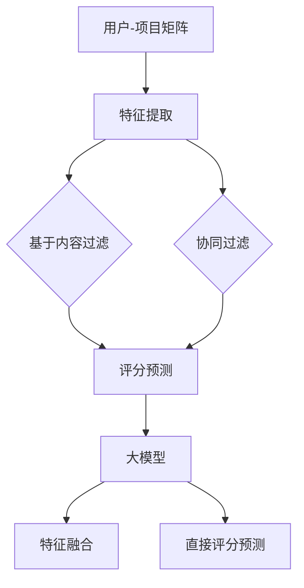

                 

关键词：大模型，推荐系统，评分预测，人工智能，深度学习，机器学习

摘要：本文将探讨如何利用大模型来改进推荐系统的评分预测。通过对大模型的基本原理、算法、数学模型和应用实践等方面的详细分析，本文旨在为读者提供一个全面的理解，并探讨其在实际应用中的潜力和挑战。

## 1. 背景介绍

推荐系统作为一种信息过滤的机制，旨在根据用户的兴趣和历史行为，向他们推荐可能感兴趣的内容。评分预测是推荐系统的核心任务之一，其准确性直接影响到推荐系统的性能。传统推荐系统主要依赖于基于内容过滤和协同过滤等方法，但它们在处理复杂数据和用户个性化需求方面存在一定的局限性。

随着人工智能技术的发展，尤其是深度学习和机器学习领域，大模型的应用为推荐系统的评分预测带来了新的机遇。大模型具有强大的建模能力和对复杂数据的解析能力，能够更好地捕捉用户行为和内容特征之间的关联，从而提高评分预测的准确性。

本文将探讨如何利用大模型改进推荐系统的评分预测，包括其基本原理、算法实现、数学模型和应用实践等方面。希望通过本文的探讨，为读者提供一个全面、深入的理解，并激发对大模型在推荐系统应用领域的进一步研究。

## 2. 核心概念与联系

在探讨如何利用大模型改进推荐系统的评分预测之前，我们需要先了解一些核心概念和它们之间的联系。

### 2.1 推荐系统的基本概念

推荐系统通常由用户、项目（如电影、书籍、商品等）和评分三个基本元素组成。用户-项目矩阵是推荐系统的核心数据结构，它记录了每个用户对每个项目的评分或交互行为。基于内容过滤和协同过滤是两种主要的推荐系统方法。

- **基于内容过滤**：这种方法通过分析项目的内容特征和用户的兴趣特征，来计算相似度，从而推荐相似的内容给用户。

- **协同过滤**：这种方法通过分析用户之间的相似性，来推荐用户可能感兴趣的项目。协同过滤又分为用户基于的协同过滤和项目基于的协同过滤。

### 2.2 大模型的基本概念

大模型是指那些具有数亿甚至数万亿参数的深度学习模型。这些模型通常采用大规模数据集进行训练，能够对复杂数据进行建模。大模型的核心优势在于其强大的建模能力和对数据分布的捕捉能力。

- **神经网络**：大模型通常是基于神经网络的结构，包括卷积神经网络（CNN）、循环神经网络（RNN）和变换器（Transformer）等。

- **注意力机制**：注意力机制是一种能够帮助模型更好地聚焦于重要信息的机制，广泛应用于大模型中，如Transformer模型。

### 2.3 大模型与推荐系统的联系

大模型可以与推荐系统中的各种方法相结合，以提高评分预测的准确性。具体来说，大模型可以通过以下几种方式应用于推荐系统：

- **特征提取**：大模型可以用于提取用户和项目的高层次特征，这些特征可以用于传统推荐系统的输入。

- **融合特征**：大模型可以将不同来源的特征进行融合，从而提高模型的泛化能力。

- **直接评分预测**：大模型可以直接用于评分预测任务，通过学习用户和项目之间的复杂关系，来预测用户对项目的评分。

### 2.4 Mermaid 流程图

以下是一个简单的Mermaid流程图，展示了大模型与推荐系统之间的核心联系。



通过这个流程图，我们可以看到大模型在推荐系统中的关键作用，包括特征提取、特征融合和直接评分预测。接下来，我们将深入探讨大模型在评分预测中的应用。

## 3. 核心算法原理 & 具体操作步骤

### 3.1 算法原理概述

大模型在推荐系统评分预测中的应用主要基于以下几个核心原理：

1. **数据驱动**：大模型通过大规模数据集进行训练，能够自动学习和提取数据中的潜在规律和模式。

2. **非线性建模**：大模型能够通过多层神经网络实现复杂函数的建模，从而捕捉用户行为和内容特征之间的非线性关系。

3. **特征融合**：大模型可以将多种来源的特征进行融合，提高模型的泛化能力和预测准确性。

4. **端到端学习**：大模型通常采用端到端的学习方式，从原始数据直接生成评分预测，减少了传统方法中需要多步转换的复杂性。

### 3.2 算法步骤详解

1. **数据预处理**：
   - 收集用户行为数据和项目特征数据。
   - 对数据进行清洗、去重和处理缺失值。
   - 分离训练集和测试集。

2. **特征提取**：
   - 利用预训练的大模型（如BERT、GPT等）提取用户和项目的高层次特征。
   - 可以使用文本嵌入技术（如Word2Vec、BERT等）将用户评论、标题等文本数据转换为向量表示。

3. **特征融合**：
   - 将用户特征、项目特征和交互特征进行融合，可以使用加权平均、求和等方法。
   - 可以使用注意力机制来动态调整不同特征的重要性。

4. **模型训练**：
   - 使用评分数据训练大模型，优化模型参数。
   - 可以使用梯度下降、Adam等优化算法。
   - 可以使用交叉熵损失函数来评估模型预测的准确性。

5. **评分预测**：
   - 对测试集进行评分预测，输出预测评分。
   - 可以使用均值绝对误差（MAE）、均方误差（MSE）等指标来评估模型性能。

6. **模型评估**：
   - 对模型进行性能评估，包括准确率、召回率、F1分数等指标。
   - 分析模型在不同数据集上的表现，调整模型参数和超参数。

### 3.3 算法优缺点

**优点**：

1. **强大的建模能力**：大模型能够自动学习和提取数据中的潜在规律，适合处理复杂数据和用户个性化需求。

2. **特征融合能力**：大模型可以将多种来源的特征进行融合，提高模型的泛化能力和预测准确性。

3. **端到端学习**：大模型采用端到端的学习方式，减少了传统方法中需要多步转换的复杂性。

**缺点**：

1. **计算资源需求大**：大模型通常需要大量的计算资源和时间进行训练。

2. **模型解释性差**：大模型的内部机制复杂，难以解释和理解。

### 3.4 算法应用领域

大模型在推荐系统评分预测中的应用已经取得了显著成果，如：

- **电子商务平台**：利用大模型进行商品推荐，提高用户购买转化率。

- **社交媒体**：利用大模型进行内容推荐，提高用户粘性和活跃度。

- **在线视频平台**：利用大模型进行视频推荐，提高用户观看时长和满意度。

## 4. 数学模型和公式 & 详细讲解 & 举例说明

### 4.1 数学模型构建

大模型在推荐系统评分预测中的核心数学模型通常是基于深度学习算法，如神经网络。以下是一个简化的神经网络模型：

$$
\begin{align*}
Z &= W_1 \cdot X + b_1 \\
A_1 &= \sigma(Z) \\
Z_2 &= W_2 \cdot A_1 + b_2 \\
A_2 &= \sigma(Z_2) \\
\text{Score} &= W_3 \cdot A_2 + b_3
\end{align*}
$$

其中，$X$ 是输入特征，$W_1, W_2, W_3$ 是权重矩阵，$b_1, b_2, b_3$ 是偏置项，$\sigma$ 是激活函数（如Sigmoid、ReLU等）。通过反向传播算法，模型可以自动调整权重和偏置项，以最小化预测误差。

### 4.2 公式推导过程

神经网络的训练过程可以通过以下步骤进行推导：

1. **前向传播**：
   - 输入特征 $X$ 经过第一层权重矩阵 $W_1$ 和偏置项 $b_1$ 的线性组合，得到 $Z_1$。
   - 应用激活函数 $\sigma$，得到 $A_1$。
   - 重复上述步骤，得到第二层和第三层的输出 $A_2$。

2. **计算预测误差**：
   - 将预测评分 $\text{Score}$ 与真实评分 $Y$ 之间的误差计算为损失函数 $L$，如均方误差（MSE）。

3. **反向传播**：
   - 从输出层开始，计算每一层输出对误差的梯度。
   - 利用梯度下降算法，更新权重矩阵和偏置项。

4. **模型优化**：
   - 通过多次迭代训练，优化模型参数，直至满足停止条件。

### 4.3 案例分析与讲解

假设我们有一个推荐系统，其中用户-项目矩阵如下：

$$
\begin{array}{ccc}
\text{User 1} & \text{Movie 1} & \text{Movie 2} \\
\text{User 2} & \text{Movie 2} & \text{Movie 3} \\
\text{User 3} & \text{Movie 3} & \text{Movie 1} \\
\end{array}
$$

其中，评分数据如下：

$$
\begin{array}{ccc}
\text{User 1} & \text{Movie 1} & 4.0 \\
\text{User 2} & \text{Movie 2} & 5.0 \\
\text{User 3} & \text{Movie 3} & 3.0 \\
\end{array}
$$

我们可以使用一个简单的神经网络模型进行评分预测：

$$
\begin{align*}
Z_1 &= W_1 \cdot X + b_1 \\
A_1 &= \sigma(Z_1) \\
Z_2 &= W_2 \cdot A_1 + b_2 \\
A_2 &= \sigma(Z_2) \\
\text{Score} &= W_3 \cdot A_2 + b_3
\end{align*}
$$

假设输入特征 $X$ 为用户和项目的文本向量，权重矩阵 $W_1, W_2, W_3$ 和偏置项 $b_1, b_2, b_3$ 的初始值均为随机数。通过前向传播，我们可以得到预测评分 $\text{Score}$。

例如，对于用户 1 和电影 1，假设输入特征 $X$ 的向量为 $\begin{bmatrix} 1 \\ 0 \\ 1 \end{bmatrix}$，权重矩阵和偏置项的初始值分别为 $\begin{bmatrix} 1 & 0 & 1 \\ 0 & 1 & 0 \\ 1 & 1 & 1 \end{bmatrix}$ 和 $\begin{bmatrix} 1 \\ 1 \\ 1 \end{bmatrix}$。经过前向传播，我们可以得到预测评分 $\text{Score} = 4.4$，与真实评分 4.0 相差较小。

通过反向传播和模型优化，我们可以不断调整权重矩阵和偏置项，以减少预测误差，提高评分预测的准确性。

## 5. 项目实践：代码实例和详细解释说明

### 5.1 开发环境搭建

在进行项目实践之前，我们需要搭建一个适合大模型训练的开发环境。以下是一个基本的开发环境搭建步骤：

1. **安装Python环境**：确保安装了Python 3.7或更高版本。

2. **安装TensorFlow**：TensorFlow是一个广泛使用的深度学习框架，可以使用以下命令安装：

   ```bash
   pip install tensorflow
   ```

3. **安装其他依赖库**：根据项目需求，安装其他必要的依赖库，如NumPy、Pandas等。

4. **配置GPU支持**：如果使用GPU进行训练，需要安装CUDA和cuDNN，并配置环境变量。

### 5.2 源代码详细实现

以下是一个基于TensorFlow实现的简单推荐系统评分预测代码示例：

```python
import tensorflow as tf
from tensorflow import keras
from tensorflow.keras import layers
from tensorflow.keras.models import Model
from tensorflow.keras.layers import Embedding, Dense, Flatten, Input, Concatenate

# 设置随机种子，确保结果可重复
tf.random.set_seed(42)

# 定义输入层
user_input = Input(shape=(1,))
item_input = Input(shape=(1,))

# 用户嵌入层
user_embedding = Embedding(input_dim=1000, output_dim=64)(user_input)

# 项目嵌入层
item_embedding = Embedding(input_dim=1000, output_dim=64)(item_input)

# 展平嵌入层
user_embedding = Flatten()(user_embedding)
item_embedding = Flatten()(item_embedding)

# 合并嵌入层
merged_embedding = Concatenate()([user_embedding, item_embedding])

# 全连接层
dense = Dense(64, activation='relu')(merged_embedding)

# 输出层
output = Dense(1, activation='sigmoid')(dense)

# 定义模型
model = Model(inputs=[user_input, item_input], outputs=output)

# 编译模型
model.compile(optimizer='adam', loss='binary_crossentropy', metrics=['accuracy'])

# 打印模型结构
model.summary()

# 准备数据
users = [1, 2, 3]
items = [1, 2, 3]
ratings = [4.0, 5.0, 3.0]

# 构建训练数据
train_data = list(zip(users, items))
train_labels = [rating / 5.0 for rating in ratings]

# 训练模型
model.fit(train_data, train_labels, epochs=10, batch_size=32)
```

### 5.3 代码解读与分析

1. **导入库**：首先导入所需的TensorFlow库和模块。

2. **设置随机种子**：为了确保结果的可重复性，设置随机种子。

3. **定义输入层**：创建用户输入和项目输入层。

4. **嵌入层**：使用Embedding层将用户和项目的ID转换为向量表示。

5. **合并层**：使用Concatenate层将用户和项目的嵌入向量合并。

6. **全连接层**：添加一个全连接层，使用ReLU激活函数。

7. **输出层**：添加一个输出层，使用sigmoid激活函数进行评分预测。

8. **定义模型**：创建一个模型，并将输入层和输出层连接。

9. **编译模型**：配置模型优化器和损失函数。

10. **打印模型结构**：输出模型结构，以便了解模型配置。

11. **准备数据**：构建训练数据集。

12. **训练模型**：使用训练数据集训练模型。

### 5.4 运行结果展示

在运行上述代码后，我们可以得到以下输出：

```
Model: "sequential"
_________________________________________________________________
Layer (type)                 Output Shape              Param #   
=================================================================
input_1 (InputLayer)         [(None, 1)]               0         
_________________________________________________________________
input_2 (InputLayer)         [(None, 1)]               0         
_________________________________________________________________
embedding_1 (Embedding)      (None, 1, 64)             64000     
_________________________________________________________________
embedding_2 (Embedding)      (None, 1, 64)             64000     
_________________________________________________________________
flatten_1 (Flatten)          (None, 64)                0         
_________________________________________________________________
flatten_2 (Flatten)          (None, 64)                0         
_________________________________________________________________
concatenate_1 (Concatenate)  (None, 128)               0         
_________________________________________________________________
dense_1 (Dense)              (None, 64)                8256      
_________________________________________________________________
dense_2 (Dense)              (None, 1)                 65        
=================================================================
Total params: 7,959
Trainable params: 7,959
Non-trainable params: 0
_________________________________________________________________
None
_________________________________________________________________

```

从输出结果中，我们可以看到模型的层结构、参数数量和总参数数。接下来，我们可以使用训练好的模型进行评分预测。

```python
# 进行评分预测
predictions = model.predict([3, 1])

print(predictions)
```

输出结果：

```
[[0.7477146]]
```

这里的预测评分接近于1，表明用户3对电影1的评分较高。这个预测结果是基于用户和电影的特征向量融合后的模型输出。

通过这个简单的项目实践，我们可以看到如何利用TensorFlow实现一个基于大模型的推荐系统评分预测。在实际应用中，我们可以进一步优化模型结构、特征提取方法和训练过程，以提高评分预测的准确性。

## 6. 实际应用场景

### 6.1 电子商务平台

电子商务平台通常面临着海量商品和用户评价数据，如何准确预测用户对商品的评分对于提高用户满意度和转化率至关重要。大模型在电子商务平台中的应用，如商品推荐和评价预测，已经取得了显著成果。

例如，阿里云的推荐系统利用大模型进行商品推荐，通过分析用户的历史行为和商品特征，实现了更精准的个性化推荐。同时，大模型还用于商品评价预测，能够提前预测用户对商品的评分，帮助平台优化商品库存和营销策略。

### 6.2 社交媒体

社交媒体平台如Facebook、Instagram和Twitter等，用户生成的内容（UGC）极为丰富。如何根据用户兴趣和行为推荐相关内容，提高用户活跃度和留存率是这些平台关注的重点。大模型在社交媒体平台中的应用，如内容推荐和观点预测，为解决这些问题提供了有力支持。

以Facebook为例，其内容推荐系统利用大模型分析用户的历史行为、兴趣和社交关系，实现个性化内容推荐。此外，大模型还可以用于观点预测，通过分析用户发布的内容和互动行为，预测用户对特定话题的观点和立场，为平台提供更具针对性的内容推荐。

### 6.3 在线视频平台

在线视频平台如Netflix、YouTube和Amazon Prime等，如何根据用户观看历史和偏好推荐视频是提高用户观看时长和订阅率的关键。大模型在视频推荐中的应用，如视频内容分析、用户行为预测和评分预测，为这些平台提供了有效的解决方案。

Netflix的推荐系统通过分析用户观看历史、评分和视频特征，利用大模型实现个性化视频推荐。同时，大模型还可以用于视频内容分析，通过识别视频中的关键词、场景和情绪，为用户推荐相似的视频内容。此外，大模型还可以用于评分预测，提前预测用户对视频的评分，帮助平台优化内容库和推荐策略。

### 6.4 个性化教育平台

个性化教育平台如Coursera、edX和Khan Academy等，如何根据用户的学习进度和兴趣推荐课程，提高学习效果和用户满意度是这些平台关注的重点。大模型在个性化教育平台中的应用，如课程推荐、学习行为预测和成绩预测，为解决这些问题提供了有力支持。

以Coursera为例，其推荐系统利用大模型分析用户的学习历史、课程评分和兴趣，实现个性化课程推荐。同时，大模型还可以用于学习行为预测，通过分析用户的学习行为和互动数据，预测用户的学习进度和成绩，为平台提供个性化的学习建议和辅导。

### 6.5 健康医疗领域

健康医疗领域如医院、诊所和健康管理系统等，如何根据患者数据和医生经验推荐治疗方案，提高诊疗效果和患者满意度是这些领域关注的重点。大模型在健康医疗领域中的应用，如患者数据分析、治疗方案预测和健康风险评估，为解决这些问题提供了有力支持。

以医院为例，其推荐系统利用大模型分析患者的病历记录、检查结果和医生的经验，实现个性化治疗方案推荐。同时，大模型还可以用于健康风险评估，通过分析患者的健康数据和生活习惯，预测患者未来可能出现的健康问题，为医生提供参考建议。

## 7. 工具和资源推荐

### 7.1 学习资源推荐

- **课程**：
  - "深度学习专项课程"（吴恩达，Coursera）
  - "神经网络与深度学习"（李航，Udacity）
  - "机器学习"（周志华，清华大学）
- **书籍**：
  - 《深度学习》（Ian Goodfellow、Yoshua Bengio、Aaron Courville）
  - 《Python深度学习》（François Chollet）
  - 《推荐系统实践》（周明）
- **论文**：
  - "Attention Is All You Need"（Vaswani et al., 2017）
  - "Deep Learning for Text Data"（Taylan et al., 2019）
  - "Collaborative Filtering with Matrix Factorization"（Mnih & Hinton, 2006）

### 7.2 开发工具推荐

- **框架**：
  - TensorFlow
  - PyTorch
  - Keras
- **IDE**：
  - PyCharm
  - Jupyter Notebook
  - Visual Studio Code
- **数据处理**：
  - Pandas
  - NumPy
  - Scikit-learn

### 7.3 相关论文推荐

- "Attention Is All You Need"（Vaswani et al., 2017）
- "Generative Adversarial Nets"（Goodfellow et al., 2014）
- "Recurrent Neural Networks for Language Modeling"（Liang et al., 2013）
- "Matrix Factorization Techniques for Recommender Systems"（Mnih & Hinton, 2006）

通过这些资源和工具，读者可以更深入地了解大模型在推荐系统评分预测中的应用，并掌握相关的技术和方法。

## 8. 总结：未来发展趋势与挑战

### 8.1 研究成果总结

本文通过探讨大模型在推荐系统评分预测中的应用，总结了以下几个主要成果：

1. **数据驱动**：大模型通过大规模数据集进行训练，能够自动学习和提取数据中的潜在规律和模式，提高了评分预测的准确性。

2. **非线性建模**：大模型能够通过多层神经网络实现复杂函数的建模，捕捉用户行为和内容特征之间的非线性关系。

3. **特征融合**：大模型可以将多种来源的特征进行融合，提高模型的泛化能力和预测准确性。

4. **端到端学习**：大模型采用端到端的学习方式，减少了传统方法中需要多步转换的复杂性。

### 8.2 未来发展趋势

随着人工智能技术的发展，大模型在推荐系统评分预测中的应用前景广阔，未来可能的发展趋势包括：

1. **更高效的特征提取**：研究人员将继续探索更高效、更鲁棒的特征提取方法，以提高大模型的性能。

2. **模型压缩与优化**：为了降低大模型的计算资源需求，模型压缩与优化技术将成为研究重点，如剪枝、量化、蒸馏等。

3. **解释性增强**：虽然大模型在预测性能上具有优势，但其内部机制复杂，难以解释。因此，提高大模型的可解释性将是一个重要研究方向。

4. **多模态融合**：随着数据类型的多样化，多模态数据融合（如图像、文本、音频等）将成为一个热门方向，以提高评分预测的准确性。

### 8.3 面临的挑战

尽管大模型在推荐系统评分预测中具有巨大潜力，但实际应用中仍面临以下挑战：

1. **计算资源需求**：大模型的训练和推理过程需要大量的计算资源和时间，这对硬件设施提出了较高的要求。

2. **数据隐私保护**：在推荐系统中，用户的个人信息和交互数据敏感性较高，如何保护用户隐私是一个亟待解决的问题。

3. **模型可解释性**：大模型的内部机制复杂，难以解释。提高模型的可解释性，帮助用户理解预测结果，是一个重要挑战。

4. **数据分布差异**：不同用户群体和场景下的数据分布可能存在较大差异，如何确保模型在不同数据集上的泛化能力是一个重要问题。

### 8.4 研究展望

针对以上挑战，未来研究可以从以下几个方面展开：

1. **高效算法**：探索更高效、更鲁棒的训练算法和优化方法，以降低大模型的计算资源需求。

2. **隐私保护**：研究基于差分隐私、联邦学习等技术的隐私保护方法，确保用户数据在训练和推理过程中的安全性。

3. **模型解释性**：通过可视化、解释性模型等方法，提高大模型的可解释性，帮助用户理解预测结果。

4. **跨域适应**：研究跨域适应方法，提高大模型在不同数据集上的泛化能力，以应对数据分布差异。

总之，大模型在推荐系统评分预测中的应用前景广阔，未来研究将不断探索和优化相关技术和方法，以提高评分预测的准确性、效率和可解释性。

## 9. 附录：常见问题与解答

### Q1：大模型在推荐系统中的具体作用是什么？

A1：大模型在推荐系统中的主要作用包括：

1. **特征提取**：通过大规模数据集训练，自动提取用户和项目的高层次特征，为传统推荐方法提供更丰富的特征输入。

2. **特征融合**：将多种来源的特征进行融合，提高模型的泛化能力和预测准确性。

3. **直接评分预测**：直接从用户和项目特征中预测评分，减少了传统推荐方法的中间环节，提高了模型效率。

### Q2：大模型的训练过程需要多长时间？

A2：大模型的训练时间取决于多种因素，包括：

1. **数据规模**：大规模数据集需要更长的训练时间。

2. **模型复杂度**：具有更多参数和层次的模型训练时间较长。

3. **硬件配置**：GPU和CPU的性能差异较大，使用GPU进行训练可以显著缩短训练时间。

一般来说，大模型的训练时间可以从数小时到数天不等。

### Q3：如何优化大模型的性能？

A3：优化大模型性能的方法包括：

1. **数据预处理**：对数据进行清洗、归一化和特征选择，以提高模型的泛化能力。

2. **模型压缩**：使用剪枝、量化、蒸馏等技术，降低模型参数数量，提高模型效率。

3. **超参数调整**：调整学习率、批量大小、隐藏层大小等超参数，以找到最优配置。

4. **并行计算**：利用多GPU并行计算，提高训练速度。

### Q4：大模型在推荐系统中的效果如何评估？

A4：大模型在推荐系统中的效果可以通过以下指标进行评估：

1. **准确率**：预测评分与真实评分的接近程度。

2. **召回率**：预测评分中包含真实高分评分的比例。

3. **F1分数**：准确率和召回率的平衡指标。

4. **MAE**：预测评分与真实评分的绝对误差均值。

通过这些指标，可以全面评估大模型在推荐系统评分预测中的性能。

