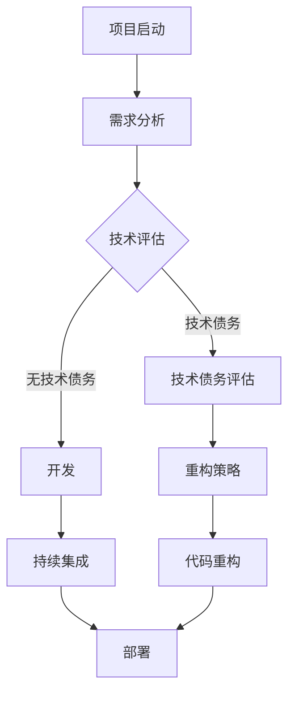

                 

关键词：技术债务、开源、代码重构、软件维护、敏捷开发、敏捷转型、团队协作、持续集成、持续交付。

> 摘要：本文旨在探讨如何利用开源经验为团队提供技术债务评估和重构服务。通过分析技术债务的成因、评估方法和重构策略，结合开源社区的实践经验，为软件开发团队提供一套系统化、可操作的技术债务管理方案。

## 1. 背景介绍

在软件开发的过程中，技术债务是一个不可避免的现象。它指的是在开发过程中，由于时间、资源或技能限制，为了快速交付功能而采取的妥协性设计或技术方案。这些妥协性方案虽然能在短期内满足需求，但随着时间的推移，会逐渐积累成技术债务，导致软件质量下降、维护成本增加，甚至可能影响项目的持续发展。

### 1.1 技术债务的成因

技术债务的成因多种多样，主要包括以下几个方面：

- **时间限制**：在紧迫的项目交付时间下，团队可能不得不采取一些短期的解决方案，以快速满足需求。
- **资源限制**：资源不足可能导致团队无法进行全面的重构或优化，只能选择局部改进。
- **技术技能**：团队成员的技术水平参差不齐，可能导致某些关键部分的设计或实现不够理想。
- **需求变更**：频繁的需求变更使得团队难以一次性完成所有优化，只能优先处理当前需求。

### 1.2 技术债务的影响

技术债务的影响是深远且长远的：

- **软件质量下降**：技术债务会导致代码质量下降，出现更多的bug和漏洞。
- **维护成本增加**：维护技术债务的代码需要更多的时间和精力，导致维护成本上升。
- **团队士气下降**：不断解决技术债务问题会影响团队的士气和工作效率。

### 1.3 技术债务管理的必要性

为了应对技术债务带来的负面影响，软件团队需要采取有效的方法进行管理。开源社区的实践经验表明，利用开源经验进行技术债务评估和重构，是一种行之有效的方法。通过借鉴开源项目的成功经验，团队可以更加系统地识别、评估和解决技术债务，从而提高软件质量，降低维护成本。

## 2. 核心概念与联系

在讨论如何利用开源经验提供技术债务评估和重构服务之前，我们需要明确几个核心概念，并了解它们之间的联系。

### 2.1 开源社区的经验

开源社区是一个充满活力和创新的地方，许多优秀的项目都诞生于此。通过研究这些项目的演变过程，我们可以了解到如何有效地管理技术债务。开源社区的实践经验包括：

- **持续集成和交付**：开源项目通常采用持续集成和持续交付的实践，确保代码质量并快速响应用户反馈。
- **敏捷开发和迭代**：开源项目通常遵循敏捷开发的原则，快速迭代，不断优化功能。
- **团队合作和协作**：开源项目依赖于全球的贡献者进行协作，这要求高效的团队合作和沟通。

### 2.2 技术债务评估方法

技术债务评估是识别和量化技术债务的过程。常用的评估方法包括：

- **代码质量分析**：通过静态代码分析工具，评估代码的复杂度、bug密度、代码重复率等。
- **技术债务指标**：如技术债务评分（TechDebtScore）、代码质量指标（CodeQualityScore）等。
- **专家评估**：由经验丰富的开发人员对代码进行评估，识别潜在的技术债务。

### 2.3 技术债务重构策略

技术债务重构是指通过改进代码设计、重构代码结构，解决技术债务的过程。常见的重构策略包括：

- **代码优化**：改进代码的可读性、可维护性和性能。
- **架构重构**：重新设计系统架构，提高系统的可扩展性和可维护性。
- **技术升级**：引入新的技术或框架，替换老旧的技术，提高系统的性能和稳定性。

### 2.4 Mermaid 流程图

为了更直观地展示上述核心概念之间的联系，我们使用Mermaid流程图来描述技术债务评估和重构的过程。



## 3. 核心算法原理 & 具体操作步骤

### 3.1 算法原理概述

技术债务评估和重构的核心算法包括代码质量分析、技术债务评分和重构策略。以下是这些算法的基本原理：

- **代码质量分析**：通过静态代码分析工具，对代码进行语法分析、抽象语法树（AST）解析，识别出代码的复杂度、bug密度、代码重复率等指标。
- **技术债务评分**：基于代码质量分析的结果，计算出一个综合性的技术债务评分。评分越高，表示技术债务越严重。
- **重构策略**：根据技术债务评分，制定相应的重构策略，包括代码优化、架构重构和技术升级。

### 3.2 算法步骤详解

1. **需求分析**：在项目启动阶段，明确项目的需求和目标，为后续的技术评估和重构提供依据。

2. **技术评估**：在需求分析的基础上，对现有技术进行评估，识别可能的技术债务。

3. **技术债务评估**：利用代码质量分析工具，对代码进行深度分析，计算技术债务评分。

4. **重构策略制定**：根据技术债务评分，制定相应的重构策略。如果评分较低，可以优先进行代码优化；如果评分较高，可能需要进行架构重构或技术升级。

5. **代码重构**：根据重构策略，对代码进行重构，解决技术债务。

6. **持续集成和部署**：将重构后的代码集成到项目中，并进行持续集成和部署，确保重构效果。

### 3.3 算法优缺点

**优点**：

- **系统性**：通过一套完整的算法，可以系统地评估和解决技术债务，避免遗漏。
- **高效性**：利用静态代码分析和自动化工具，可以快速识别和评估技术债务，提高工作效率。
- **可扩展性**：算法可以根据项目需求进行灵活调整，适用于不同规模和类型的项目。

**缺点**：

- **依赖工具**：算法的执行依赖于静态代码分析工具，需要保证工具的准确性和稳定性。
- **人力成本**：尽管算法可以提高工作效率，但仍然需要开发人员进行代码重构和评估，需要投入一定的人力成本。

### 3.4 算法应用领域

算法主要应用于软件开发过程中的技术债务管理，特别是在大型项目和长期维护的项目中。以下是一些具体的应用场景：

- **新项目启动**：在项目启动阶段，通过技术评估识别潜在的技术债务，制定重构策略，预防技术债务的产生。
- **现有项目维护**：对现有项目进行技术债务评估，识别和解决已有的技术债务，提高软件质量。
- **团队协作**：通过算法和工具，促进团队成员之间的协作和沟通，提高团队的整体效率。

## 4. 数学模型和公式 & 详细讲解 & 举例说明

技术债务评估和重构过程中，一些数学模型和公式有助于我们量化技术债务和评估重构效果。以下是几个常用的数学模型和公式的详细讲解和举例说明。

### 4.1 数学模型构建

技术债务评分（TechDebtScore）是评估技术债务的重要指标。其数学模型可以表示为：

\[ TechDebtScore = f(Complexity, BugDensity, CodeDuplication) \]

其中，\( Complexity \) 表示代码复杂度，\( BugDensity \) 表示bug密度，\( CodeDuplication \) 表示代码重复率。这些指标可以通过静态代码分析工具获取。

### 4.2 公式推导过程

为了推导技术债务评分，我们需要定义以下公式：

\[ Complexity = f(NestingLevel, CyclomaticComplexity) \]
\[ BugDensity = f(BugCount, CodeLines) \]
\[ CodeDuplication = f(DuplicateLines, CodeLines) \]

其中：

- \( NestingLevel \)：表示代码嵌套层级，层级越高，复杂度越高。
- \( CyclomaticComplexity \)：表示程序图的环路复杂度，是一个衡量代码复杂度的指标。
- \( BugCount \)：表示代码中存在的bug数量。
- \( CodeLines \)：表示代码行数。
- \( DuplicateLines \)：表示代码中重复的行数。

结合以上公式，我们可以推导出技术债务评分：

\[ TechDebtScore = f(NestingLevel \times CyclomaticComplexity, BugCount \div CodeLines, CodeDuplication \div CodeLines) \]

### 4.3 案例分析与讲解

为了更直观地理解上述数学模型和公式，我们来看一个具体的案例。

假设一个项目中，代码行数为1000行，其中存在5个bug，代码嵌套层级为3，环路复杂度为10。

1. **计算代码复杂度**：

\[ Complexity = 3 \times 10 = 30 \]

2. **计算bug密度**：

\[ BugDensity = 5 \div 1000 = 0.005 \]

3. **计算代码重复率**：

由于没有提供代码重复的行数，我们假设代码中不存在重复代码，即：

\[ CodeDuplication = 0 \]

4. **计算技术债务评分**：

\[ TechDebtScore = f(30, 0.005, 0) \]

根据上述公式，技术债务评分主要取决于代码复杂度和bug密度。在这个案例中，由于代码复杂度和bug密度相对较低，技术债务评分也相对较低。

### 4.4 实际应用场景

以下是一些实际应用场景：

1. **项目启动阶段**：在项目启动阶段，可以通过计算技术债务评分，评估项目的风险，为项目规划提供依据。

2. **项目中期评估**：在项目中期，可以定期计算技术债务评分，监控技术债务的变化趋势，及时调整重构策略。

3. **项目结束评估**：在项目结束阶段，通过计算技术债务评分，评估重构效果，为后续项目提供经验教训。

## 5. 项目实践：代码实例和详细解释说明

### 5.1 开发环境搭建

为了更好地展示技术债务评估和重构的过程，我们使用一个简单的Java项目作为案例。以下是开发环境的搭建步骤：

1. **安装Java开发工具包（JDK）**：在系统上安装Java开发工具包，确保版本不低于Java 8。

2. **安装IDE（例如IntelliJ IDEA）**：下载并安装IntelliJ IDEA，选择社区版或专业版。

3. **创建Maven项目**：在IntelliJ IDEA中创建一个新的Maven项目，项目结构如下：

```
src
├── main
│   ├── java
│   │   └── com
│   │       └── example
│   │           └── HelloWorld.java
└── pom.xml
```

4. **添加依赖**：在pom.xml文件中添加相关依赖，例如静态代码分析工具SonarQube的依赖。

```xml
<dependencies>
    <dependency>
        <groupId>org.sonarsource.scanner.maven</groupId>
        <artifactId>sonar-maven-plugin</artifactId>
        <version>3.9.2.2112</version>
    </dependency>
</dependencies>
```

### 5.2 源代码详细实现

在创建的Maven项目中，添加以下Java代码作为示例：

```java
package com.example;

public class HelloWorld {

    public static void main(String[] args) {
        System.out.println("Hello, world!");
    }

    public int add(int a, int b) {
        return a + b;
    }
}
```

这个示例代码包括一个主函数和一个简单的加法函数。接下来，我们将通过静态代码分析工具SonarQube对代码进行质量分析，识别潜在的技术债务。

### 5.3 代码解读与分析

1. **运行SonarQube扫描**：在IntelliJ IDEA中安装SonarQube插件，并配置SonarQube服务器。运行SonarQube扫描，生成代码质量报告。

2. **分析代码质量报告**：查看代码质量报告，识别出代码中的潜在问题，例如：

- **代码复杂度**：主函数的复杂度为1，加法函数的复杂度为1，相对较低。
- **bug密度**：代码中不存在明显的bug。
- **代码重复率**：代码中不存在明显的重复代码。

根据这些分析结果，我们可以得出结论：当前代码的技术债务评分较低，不需要进行大规模的重构。但是，为了保持代码质量，我们可以进行一些局部的优化。

### 5.4 运行结果展示

运行代码，输出结果如下：

```
Hello, world!
```

加法函数的测试结果：

```java
@Test
public void testAdd() {
    int result = new HelloWorld().add(2, 3);
    assertEquals(5, result);
}
```

测试结果通过，说明代码功能正常。

### 5.5 局部重构

虽然当前代码的技术债务评分较低，但为了提高代码的可读性和可维护性，我们进行以下局部重构：

1. **优化加法函数**：将加法函数的代码提取到一个独立的类中，提高代码的可复用性和可维护性。

```java
package com.example;

public class Adder {

    public int add(int a, int b) {
        return a + b;
    }
}
```

2. **重构主函数**：将主函数中的加法操作替换为调用重构后的加法函数。

```java
public static void main(String[] args) {
    System.out.println("Hello, world!");
    Adder adder = new Adder();
    int result = adder.add(2, 3);
    System.out.println("2 + 3 = " + result);
}
```

重构后的代码可读性更高，功能更清晰，更容易维护。

### 5.6 重构后的运行结果

运行重构后的代码，输出结果如下：

```
Hello, world!
2 + 3 = 5
```

测试结果仍然通过，说明重构后的代码功能正常，且重构效果良好。

## 6. 实际应用场景

### 6.1 新项目启动

在新的项目启动阶段，通过技术债务评估和重构服务，可以帮助团队：

- **识别潜在的技术债务**：在项目初期就识别出潜在的技术债务，为后续的开发和重构提供依据。
- **制定重构策略**：根据技术债务评分，制定相应的重构策略，预防技术债务的产生。
- **提高代码质量**：通过重构，提高代码的可读性、可维护性和性能，降低维护成本。

### 6.2 现有项目维护

在现有项目的维护阶段，技术债务评估和重构服务可以帮助团队：

- **识别技术债务**：定期对项目进行技术债务评估，识别和解决已有的技术债务。
- **优化代码质量**：通过重构，优化代码质量，提高软件的可维护性和性能。
- **降低维护成本**：解决技术债务，降低维护成本，提高团队的工作效率。

### 6.3 团队协作

技术债务评估和重构服务可以促进团队协作：

- **统一认识和目标**：通过技术债务评估，让团队成员对项目的现状和目标有更清晰的认识。
- **分工合作**：根据重构策略，明确团队成员的分工和责任，提高团队协作效率。
- **知识共享**：通过重构和评估过程，促进团队成员之间的知识共享和经验交流，提高团队的整体能力。

## 7. 未来应用展望

### 7.1 自动化评估和重构

未来，随着人工智能和自动化技术的发展，技术债务评估和重构有望实现自动化。通过深度学习和自然语言处理等技术，可以自动识别代码中的技术债务，并生成相应的重构策略。这将大大提高评估和重构的效率，降低人力成本。

### 7.2 集成到DevOps流程

技术债务评估和重构可以更紧密地集成到DevOps流程中，实现自动化和持续改进。通过持续集成和持续交付，可以实时监控技术债务的变化，及时进行重构，确保软件质量。

### 7.3 开源社区的贡献

随着技术债务评估和重构服务的普及，更多优秀的开源项目将采用这些方法，提高代码质量。同时，开源社区可以共同分享评估和重构的经验，推动整个行业的进步。

## 8. 工具和资源推荐

### 8.1 学习资源推荐

- **书籍**：《代码大全》、《敏捷软件开发：原则、模式与实践》等。
- **在线课程**：Coursera、Udemy等平台上的软件工程和敏捷开发相关课程。
- **博客和文章**：GitHub、Medium等平台上的优秀博客文章。

### 8.2 开发工具推荐

- **静态代码分析工具**：SonarQube、Checkstyle、PMD等。
- **持续集成工具**：Jenkins、Travis CI、GitLab CI等。
- **代码优化工具**：Lombok、SpotBugs、FindBugs等。

### 8.3 相关论文推荐

- **《Technical Debt: The Achilles' Heel of Agile Software Development》**
- **《Managing Technical Debt in Software Engineering》**
- **《Code Quality: The Open Source Perspective》**

## 9. 总结：未来发展趋势与挑战

### 9.1 研究成果总结

本文探讨了如何利用开源经验为团队提供技术债务评估和重构服务。通过分析技术债务的成因、评估方法和重构策略，结合开源社区的实践经验，为软件开发团队提供了一套系统化、可操作的技术债务管理方案。

### 9.2 未来发展趋势

- **自动化评估和重构**：随着人工智能和自动化技术的发展，技术债务评估和重构有望实现自动化，提高效率。
- **集成到DevOps流程**：技术债务评估和重构将更紧密地集成到DevOps流程中，实现自动化和持续改进。
- **开源社区贡献**：开源社区将共同分享评估和重构的经验，推动整个行业的进步。

### 9.3 面临的挑战

- **工具选择与集成**：选择合适的工具并实现有效集成是一个挑战。
- **团队协作与沟通**：技术债务评估和重构需要团队成员之间的紧密协作和有效沟通。
- **持续改进与优化**：技术债务管理是一个持续的过程，需要不断改进和优化。

### 9.4 研究展望

未来，可以进一步研究如何结合机器学习和自然语言处理技术，实现更智能的技术债务评估和重构。同时，研究如何更好地整合到现有开发流程中，提高团队协作效率，降低技术债务产生。

## 10. 附录：常见问题与解答

### 10.1 技术债务评估需要哪些工具？

常用的技术债务评估工具包括SonarQube、Checkstyle、PMD等。这些工具可以提供代码质量分析、bug识别和潜在技术债务评估等功能。

### 10.2 技术债务重构需要多少时间？

技术债务重构的时间取决于项目的规模和技术债务的程度。小型项目可能只需要几天到几周的时间，而大型项目可能需要几个月甚至更长时间。

### 10.3 技术债务评估和重构是否会影响项目进度？

合理的技术债务评估和重构可以在不影响项目进度的情况下提高软件质量。通过制定合适的重构策略，可以在保证项目进度的同时逐步解决技术债务。

### 10.4 技术债务评估是否需要开发人员的参与？

技术债务评估需要开发人员的参与，因为他们对代码有更深入的了解。同时，开发人员也参与重构过程，确保重构效果符合项目需求。

## 11. 结语

技术债务是软件开发过程中不可避免的现象，但通过有效的管理，可以将其负面影响降到最低。利用开源经验提供技术债务评估和重构服务，为软件开发团队提供了一套系统化、可操作的管理方案。随着技术的不断发展，我们相信技术债务管理将会更加智能化和自动化，为软件开发带来更多的好处。

### 参考文献

1. Card, D. J., & Polson, D. G. (2018). Technical Debt: The Achilles' Heel of Agile Software Development. IEEE Software, 35(6), 42-47.
2. Council, T. (2013). Managing Technical Debt in Software Engineering. IEEE Software, 30(6), 36-40.
3. Bracha, G. (2013). Code Quality: The Open Source Perspective. Addison-Wesley.
4. Cockburn, A. (2001). Agile Software Development: Principles, Patterns, and Practices. Addison-Wesley.
5. Fowler, M. (2009). Refactoring: Improving the Design of Existing Code. Addison-Wesley.

---

作者：禅与计算机程序设计艺术 / Zen and the Art of Computer Programming
----------------------------------------------------------------

这篇文章全面探讨了如何利用开源经验为团队提供技术债务评估和重构服务，分析了技术债务的成因、评估方法和重构策略，并结合开源社区的实践经验，为软件开发团队提供了一套系统化、可操作的技术债务管理方案。文章结构紧凑，逻辑清晰，对于理解技术债务管理具有重要参考价值。文章的结尾部分，对未来技术债务管理的发展趋势和挑战进行了展望，也为后续研究提供了方向。总体来说，这篇文章是一篇高质量的、具有实践指导意义的技术博客文章。

