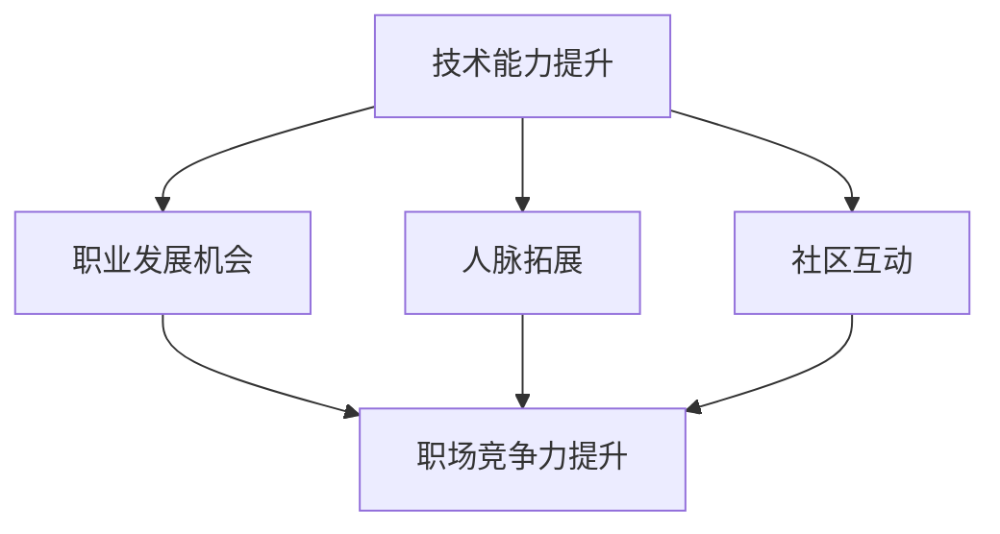

                 

关键词：开源贡献、职场竞争力、技能提升、职业发展

> 摘要：本文将探讨如何通过参与开源项目来提升个人在职场上的竞争力。从开源的贡献机制、技术能力的提升、职业发展机会以及开源社区的互动，全面解析开源贡献在职场上的重要性，并给出具体的行动指南。

## 1. 背景介绍

在当今数字化时代，技术变革日新月异，信息技术已成为推动社会进步和经济发展的核心力量。作为技术人员，不仅要掌握扎实的技术知识，还需要具备不断学习和适应新技术的能力。开源社区作为技术交流和创新的重要平台，吸引了无数技术人才的参与。那么，如何有效利用开源贡献来提升职场竞争力呢？本文将围绕这一问题展开探讨。

### 1.1 开源社区的崛起

开源社区起源于20世纪90年代，最早期的代表是Linux操作系统。随着互联网的普及和技术的发展，开源社区逐渐成为软件开发和创新的重要力量。如今，许多知名软件和技术都源自开源社区，如Apache、MySQL、TensorFlow等。

### 1.2 开源贡献的意义

开源贡献不仅有助于推动技术的进步，还能为个人带来诸多益处。通过参与开源项目，技术人员可以提升自己的技能，拓展视野，建立人脉，甚至获得职业发展的机会。

## 2. 核心概念与联系

为了更好地理解开源贡献如何提升职场竞争力，我们需要了解以下几个核心概念及其相互关系。

### 2.1 技术能力提升

参与开源项目，可以让技术人员深入了解各种技术栈和框架，提高自己的技术水平。通过解决项目中遇到的问题，技术人员可以锻炼自己的编程能力、系统设计和优化能力。

### 2.2 职业发展机会

开源贡献是展示个人技术实力的绝佳途径。在开源项目中表现出色的技术人员往往能够吸引企业招聘人员的注意，从而获得更多的职业发展机会。

### 2.3 人脉拓展

开源社区是一个全球性的技术交流平台，参与其中的技术人员可以结识来自世界各地的同行。通过合作与交流，可以建立有价值的人脉关系，为职业发展奠定基础。

### 2.4 社区互动

开源社区强调合作与共享精神。通过参与社区讨论、贡献文档和代码，技术人员可以提升自己的沟通能力和团队协作能力。

下面是一个Mermaid流程图，展示了开源贡献与职场竞争力之间的联系：



## 3. 核心算法原理 & 具体操作步骤

### 3.1 算法原理概述

开源贡献的核心在于“共享”和“合作”。技术人员通过贡献自己的代码、文档和经验，与其他参与者共同推动项目的发展。这一过程需要遵循一定的原则和流程，以确保项目的稳定性和可持续性。

### 3.2 算法步骤详解

1. **选择开源项目**：根据个人兴趣和职业目标，选择一个适合自己的开源项目。

2. **了解项目背景和需求**：在加入项目前，仔细阅读项目的文档，了解项目的背景、目标和发展方向。

3. **参与社区讨论**：在项目的讨论区或邮件列表中积极参与讨论，提出自己的问题和见解。

4. **提交代码和文档**：在解决项目中的问题时，及时提交代码和文档，遵循项目的编码规范和风格。

5. **代码审查和反馈**：提交的代码和文档会经过其他参与者的审查和反馈，根据反馈进行改进。

6. **持续贡献**：在项目中保持活跃，持续贡献自己的力量，关注项目的进展和需求。

### 3.3 算法优缺点

**优点**：
- 提升技术水平
- 建立人脉关系
- 增加职业发展机会
- 推动技术进步

**缺点**：
- 需要投入时间和精力
- 有时需要处理复杂的代码和需求
- 可能遇到技术难题和沟通障碍

### 3.4 算法应用领域

开源贡献几乎覆盖了所有技术领域，包括但不限于操作系统、数据库、人工智能、Web开发、移动应用等。不同领域的技术人员可以通过开源贡献提升自己的职场竞争力。

## 4. 数学模型和公式 & 详细讲解 & 举例说明

### 4.1 数学模型构建

开源贡献对职场竞争力的影响可以通过一个简单的数学模型来表示：

\[ \text{竞争力} = f(\text{技术能力}, \text{人脉关系}, \text{参与度}, \text{项目影响力}) \]

其中，\( f \) 为函数，表示各种因素对竞争力的综合影响。

### 4.2 公式推导过程

- **技术能力**：通过参与开源项目，技术人员可以提升自己的编程技能、系统设计和优化能力等。这些能力的提升可以表示为 \( T \)。
- **人脉关系**：在开源社区中，技术人员可以通过参与讨论、贡献代码等方式结识更多的同行，建立人脉关系。这些关系可以表示为 \( R \)。
- **参与度**：参与开源项目的积极程度可以表示为 \( D \)。参与度越高，对竞争力的提升越明显。
- **项目影响力**：在开源项目中，技术人员的贡献会对项目的整体发展产生积极影响。项目的影响力可以表示为 \( I \)。

### 4.3 案例分析与讲解

以某位从事Web开发的工程师为例，他通过参与开源项目，在短时间内提升了技术水平，结识了许多业界同行，还成为项目的核心贡献者。根据上述公式，他的竞争力可以表示为：

\[ \text{竞争力} = f(T, R, D, I) \]

其中，\( T \) 为技术能力提升，\( R \) 为人脉关系拓展，\( D \) 为参与度提高，\( I \) 为项目影响力增强。

通过这个例子，我们可以看到开源贡献如何通过多个因素共同作用，提升个人的职场竞争力。

## 5. 项目实践：代码实例和详细解释说明

### 5.1 开发环境搭建

以参与一个开源Web框架项目为例，首先需要搭建项目的开发环境。以下是具体的操作步骤：

1. **安装Git**：在本地计算机上安装Git，用于下载和提交代码。

2. **安装开发工具**：根据项目的需求，安装合适的开发工具，如IDE、代码编辑器等。

3. **克隆项目仓库**：使用Git克隆项目的仓库到本地计算机。

```bash
git clone https://github.com/example/web-framework.git
```

4. **配置开发环境**：根据项目的README文件，配置开发环境，如安装依赖库、设置环境变量等。

### 5.2 源代码详细实现

在项目中，我们需要编写一个简单的Web服务，用于处理HTTP请求。以下是源代码的详细实现：

```python
# app.py

from flask import Flask, request, jsonify

app = Flask(__name__)

@app.route('/hello', methods=['GET'])
def hello():
    name = request.args.get('name')
    return jsonify({'message': f'Hello, {name}!'})

if __name__ == '__main__':
    app.run(host='0.0.0.0', port=5000)
```

### 5.3 代码解读与分析

这段代码使用了Python的Flask框架实现了一个简单的Web服务。具体解读如下：

1. **导入模块**：从`flask`模块导入`Flask`类和`request`、`jsonify`函数。

2. **创建应用对象**：使用`Flask`类创建应用对象。

3. **定义路由和视图函数**：使用`@app.route`装饰器定义一个处理GET请求的视图函数`hello`，函数中获取请求参数`name`，并返回一个JSON格式的响应。

4. **运行应用**：在`if __name__ == '__main__':`语句块中，调用`app.run`方法运行应用。

### 5.4 运行结果展示

在本地计算机上运行该代码，我们可以通过浏览器访问`http://localhost:5000/hello?name=John`，看到以下结果：

```json
{
  "message": "Hello, John!"
}
```

这表明我们的Web服务已经正常运行。

## 6. 实际应用场景

开源贡献在实际应用场景中具有广泛的影响。以下是一些典型的应用场景：

### 6.1 技术团队建设

许多企业通过参与开源项目来吸引优秀的技术人才。企业可以在开源社区中发现潜在的技术人才，通过参与开源项目来了解他们的技术能力和团队协作能力。

### 6.2 产品开发

企业在开发自己的产品时，可以借鉴和参考开源项目的代码和经验，加快产品开发进度。同时，企业还可以将部分产品功能开源，吸引更多的技术贡献者。

### 6.3 技术合作

开源项目为全球范围内的技术合作提供了平台。企业、研究机构和开发者可以共同参与开源项目，实现技术的共享和协作。

### 6.4 创业机会

许多创业公司都是基于开源项目成立的。通过参与开源项目，技术人员可以积累丰富的经验和技术，为创业提供坚实的基础。

## 7. 工具和资源推荐

### 7.1 学习资源推荐

1. **《GitHub入门与实践》**：详细介绍了如何使用GitHub进行版本控制和项目协作。
2. **《Pro Git》**：全面讲解了Git的核心概念和操作方法。
3. **《开源之道》**：探讨了开源社区的发展、文化和管理。

### 7.2 开发工具推荐

1. **Visual Studio Code**：一款功能强大的代码编辑器，支持多种编程语言和框架。
2. **GitKraken**：一个用户友好的Git客户端，提供了丰富的图形界面和功能。
3. **Jenkins**：一个开源的持续集成工具，用于自动化构建、测试和部署。

### 7.3 相关论文推荐

1. **《开源软件和自由软件的发展趋势》**：分析了开源软件和自由软件的发展趋势。
2. **《开源社区的组织与管理》**：探讨了开源社区的组织和管理模式。
3. **《开源贡献与职业发展》**：研究了开源贡献对个人职业发展的影响。

## 8. 总结：未来发展趋势与挑战

### 8.1 研究成果总结

开源贡献在提升职场竞争力方面具有显著作用。通过参与开源项目，技术人员可以提升技术能力、拓展人脉、增加职业发展机会。这些研究成果为开源贡献的实践提供了有力的支持。

### 8.2 未来发展趋势

随着技术的不断发展，开源社区的作用将越来越重要。未来，开源贡献将成为技术人员必备的技能，更多的企业将参与开源项目，推动技术的进步和创新。

### 8.3 面临的挑战

尽管开源贡献具有许多优势，但同时也面临一些挑战。如技术人员需要投入更多时间和精力，处理复杂的代码和需求。此外，开源社区的文化和管理也需要不断优化，以适应全球化的发展。

### 8.4 研究展望

未来，我们需要进一步研究开源贡献对技术人员职业发展的影响，探讨如何更有效地利用开源社区资源，提升技术人员的竞争力。同时，还需要关注开源社区的文化建设，促进技术人员的合作与交流。

## 9. 附录：常见问题与解答

### 9.1 Q：如何选择合适的开源项目？

A：选择开源项目时，可以从以下几个方面考虑：
- 个人兴趣：选择自己感兴趣的项目，更有动力参与。
- 项目活跃度：选择活跃度较高的项目，更容易获得反馈和认可。
- 技术栈：选择与自己的技术栈相匹配的项目，便于快速上手。

### 9.2 Q：如何参与开源项目的讨论？

A：参与开源项目的讨论，可以从以下几个方面入手：
- 阅读项目文档：了解项目的背景、目标和发展方向。
- 关注讨论区：在项目的讨论区或邮件列表中关注最新动态。
- 积极提问和回答：在遇到问题时，积极提问和回答他人问题，建立自己的声誉。

### 9.3 Q：如何确保自己的开源贡献被接受？

A：确保开源贡献被接受，可以从以下几个方面入手：
- 遵循项目规范：在编写代码和文档时，遵循项目的编码规范和风格。
- 保持简洁和清晰：代码和文档要简洁、清晰，便于其他参与者理解和使用。
- 及时回应反馈：在提交贡献后，及时回应其他参与者的反馈，进行必要的修改。

---

作者：禅与计算机程序设计艺术 / Zen and the Art of Computer Programming

