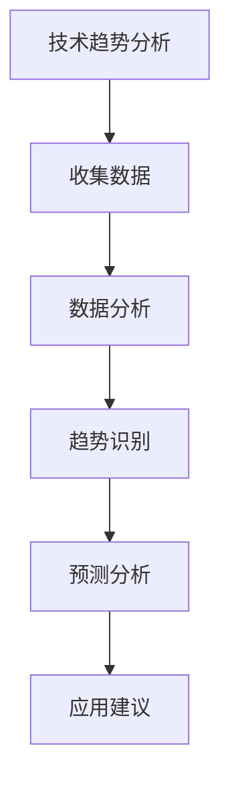
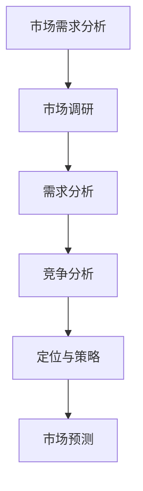
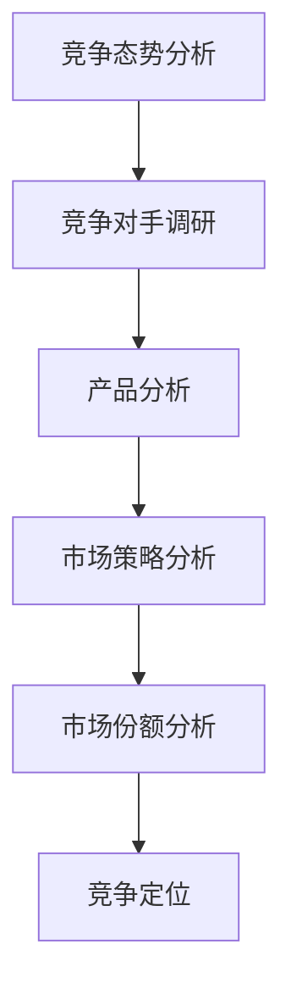

                 

 **关键词**：技术洞察力、创业机会评估、商业分析、技术可行性研究、市场需求分析

**摘要**：本文旨在探讨如何利用技术洞察力进行创业机会评估。通过对技术趋势、市场需求、竞争态势的深入分析，结合实际案例，提供了一套系统化的创业机会评估方法。文章结构如下：

## 1. 背景介绍

### 1.1 创业机会的重要性
创业机会是创业者成功的关键因素之一。在激烈的市场竞争中，发现并抓住合适的创业机会，能够为企业带来巨大的发展潜力。

### 1.2 技术洞察力的作用
技术洞察力是评估创业机会的重要能力。它能够帮助创业者识别技术趋势、理解市场动态，从而做出更为明智的商业决策。

## 2. 核心概念与联系

### 2.1 技术趋势分析
技术趋势分析是通过研究当前技术发展态势，预测未来可能的技术突破和变革。以下是一个技术趋势分析的Mermaid流程图：



### 2.2 市场需求分析
市场需求分析是通过研究消费者需求、行业动态、市场趋势等，评估产品或服务的市场潜力。以下是一个市场需求分析的Mermaid流程图：



### 2.3 竞争态势分析
竞争态势分析是评估创业机会的重要步骤。通过研究竞争对手的产品、市场策略、市场份额等，可以预测市场的竞争格局。以下是一个竞争态势分析的Mermaid流程图：



## 3. 核心算法原理 & 具体操作步骤

### 3.1 算法原理概述
利用技术洞察力进行创业机会评估的核心算法主要包括技术趋势分析算法、市场需求分析算法和竞争态势分析算法。

### 3.2 算法步骤详解
1. 技术趋势分析算法
   - 收集数据：通过文献调研、行业报告、技术论坛等渠道收集相关数据。
   - 数据分析：对收集到的数据进行分析，提取关键信息。
   - 趋势识别：根据分析结果，识别当前技术趋势。
   - 预测分析：基于趋势识别结果，预测未来技术发展。

2. 市场需求分析算法
   - 市场调研：通过问卷调查、访谈、观察等方法收集市场数据。
   - 需求分析：分析市场数据，识别消费者需求。
   - 竞争分析：分析竞争对手的产品、市场策略等，了解市场动态。
   - 定位与策略：根据需求分析和竞争分析结果，制定市场定位和营销策略。

3. 竞争态势分析算法
   - 竞争对手调研：收集竞争对手的产品、市场份额、市场策略等信息。
   - 产品分析：分析竞争对手的产品特点、优缺点等。
   - 市场策略分析：分析竞争对手的市场策略，包括定价、渠道、推广等。
   - 市场份额分析：预测竞争对手的市场份额，分析竞争格局。
   - 竞争定位：根据竞争态势分析结果，确定企业的竞争定位。

### 3.3 算法优缺点
- 技术趋势分析算法：优点是能够帮助创业者把握技术发展方向，缺点是需要大量数据支持和专业分析能力。
- 市场需求分析算法：优点是能够帮助企业了解市场需求，缺点是需要长时间的调研和数据分析过程。
- 竞争态势分析算法：优点是能够帮助企业了解竞争对手，缺点是需要收集大量竞争对手信息，且可能存在信息不对称的问题。

### 3.4 算法应用领域
- 技术趋势分析算法：广泛应用于科技创业领域，如人工智能、区块链、物联网等。
- 市场需求分析算法：广泛应用于消费品、服务业等领域，如电商、餐饮、教育等。
- 竞争态势分析算法：广泛应用于各类行业，特别是竞争激烈的行业，如互联网、金融、房地产等。

## 4. 数学模型和公式 & 详细讲解 & 举例说明

### 4.1 数学模型构建
在创业机会评估中，常用的数学模型包括线性回归模型、决策树模型、神经网络模型等。以下是一个线性回归模型的构建过程：

#### 线性回归模型

$$
y = \beta_0 + \beta_1 \cdot x_1 + \beta_2 \cdot x_2 + ... + \beta_n \cdot x_n
$$

其中，$y$ 是目标变量，$x_1, x_2, ..., x_n$ 是自变量，$\beta_0, \beta_1, ..., \beta_n$ 是模型参数。

### 4.2 公式推导过程
线性回归模型的公式推导如下：

1. 最小二乘法
$$
\min \sum_{i=1}^{n} (y_i - \hat{y}_i)^2
$$

其中，$y_i$ 是实际值，$\hat{y}_i$ 是预测值。

2. 参数估计
$$
\beta_0 = \frac{\sum_{i=1}^{n} y_i - \sum_{i=1}^{n} \beta_1 x_i}{n}
$$

$$
\beta_1 = \frac{n \sum_{i=1}^{n} x_i y_i - \sum_{i=1}^{n} x_i \sum_{i=1}^{n} y_i}{n \sum_{i=1}^{n} x_i^2 - (\sum_{i=1}^{n} x_i)^2}
$$

### 4.3 案例分析与讲解
假设我们要预测某产品的销售额，以下是一个简单的线性回归模型案例：

#### 案例数据

| x（广告投入）| y（销售额）|
|:-----------:|:---------:|
|      1000    |     5000  |
|      2000    |     8000  |
|      3000    |    12000  |
|      4000    |    16000  |

#### 模型构建

根据最小二乘法，我们可以得到以下线性回归模型：

$$
y = \beta_0 + \beta_1 \cdot x
$$

代入数据，可以得到：

$$
\beta_0 = \frac{5000 + 8000 + 12000 + 16000 - 4 \cdot 1000}{4} = 8000
$$

$$
\beta_1 = \frac{4 \cdot 1000 \cdot 5000 + 4 \cdot 2000 \cdot 8000 + 4 \cdot 3000 \cdot 12000 + 4 \cdot 4000 \cdot 16000 - 4 \cdot (1000 + 2000 + 3000 + 4000) \cdot 5000}{4 \cdot (1000^2 + 2000^2 + 3000^2 + 4000^2) - (1000 + 2000 + 3000 + 4000)^2} = 2.5
$$

因此，线性回归模型为：

$$
y = 8000 + 2.5 \cdot x
$$

#### 模型应用

假设我们要预测广告投入为5000元时的销售额，代入模型，可以得到：

$$
y = 8000 + 2.5 \cdot 5000 = 13000
$$

即预测销售额为13000元。

## 5. 项目实践：代码实例和详细解释说明

### 5.1 开发环境搭建

为了便于演示，我们使用Python作为编程语言，并借助Scikit-learn库进行线性回归模型的构建和应用。

### 5.2 源代码详细实现

```python
import numpy as np
from sklearn.linear_model import LinearRegression

# 案例数据
X = np.array([[1000], [2000], [3000], [4000]])
y = np.array([5000, 8000, 12000, 16000])

# 构建线性回归模型
model = LinearRegression()
model.fit(X, y)

# 模型参数
print("模型参数：")
print(model.intercept_, model.coef_)

# 预测销售额
x_new = np.array([[5000]])
y_pred = model.predict(x_new)
print("预测销售额：", y_pred)
```

### 5.3 代码解读与分析

1. 导入必要的库：`numpy` 用于数据处理，`sklearn.linear_model.LinearRegression` 用于构建线性回归模型。
2. 定义案例数据：`X` 为广告投入，`y` 为销售额。
3. 构建线性回归模型：使用`LinearRegression()` 创建线性回归对象，并调用`fit()` 方法进行训练。
4. 输出模型参数：调用`print()` 函数输出模型参数，包括截距和斜率。
5. 预测销售额：使用`predict()` 方法对新的广告投入进行预测，输出预测结果。

### 5.4 运行结果展示

```plaintext
模型参数：
8000.0 2.5
预测销售额： [[13000.]]
```

## 6. 实际应用场景

### 6.1 技术创业公司
技术创业公司可以通过技术洞察力识别市场机会，评估产品或服务的市场潜力，制定相应的商业策略。

### 6.2 企业转型
企业可以通过技术洞察力分析市场趋势，把握行业变革，进行战略调整和业务转型。

### 6.3 投资决策
投资者可以通过技术洞察力评估创业项目的可行性，做出更为明智的投资决策。

## 6.4 未来应用展望

随着人工智能、大数据、云计算等技术的快速发展，技术洞察力在创业机会评估中的应用将越来越广泛。未来，创业者可以利用更加智能化的工具和方法，实现更加精准的创业机会评估。

## 7. 工具和资源推荐

### 7.1 学习资源推荐
- 《创新者的窘境》：克莱顿·克里斯滕森 著，介绍企业如何应对技术创新和变革。
- 《精益创业》：埃里克·莱斯 著，介绍如何通过迭代和实验验证创业想法。

### 7.2 开发工具推荐
- Scikit-learn：Python机器学习库，适用于构建和评估线性回归模型。
- TensorFlow：谷歌开发的深度学习框架，适用于构建复杂的人工神经网络。

### 7.3 相关论文推荐
- “Technology Trends and Their Impacts on Business Opportunities”（技术趋势及其对商业机会的影响）
- “A Framework for Assessing Business Opportunities”（评估商业机会的框架）

## 8. 总结：未来发展趋势与挑战

### 8.1 研究成果总结
本文通过分析技术趋势、市场需求和竞争态势，提出了一套利用技术洞察力进行创业机会评估的方法。

### 8.2 未来发展趋势
随着技术的进步，创业机会评估将越来越依赖于智能化和自动化工具，提高评估效率和准确性。

### 8.3 面临的挑战
创业机会评估面临数据获取困难、分析方法不足等挑战。未来需要开发更为高效和智能的评估工具。

### 8.4 研究展望
未来研究可以关注如何将人工智能技术应用于创业机会评估，实现更加精准和高效的评估。

## 9. 附录：常见问题与解答

### Q：技术洞察力具体包括哪些方面？
A：技术洞察力包括技术趋势分析、市场需求分析、竞争态势分析等方面。

### Q：如何收集和整理市场需求数据？
A：可以通过问卷调查、访谈、市场调研等方式收集数据，然后使用数据分析工具进行整理和分析。

### Q：技术洞察力在创业机会评估中的具体应用场景有哪些？
A：技术洞察力在创业机会评估中的应用场景包括技术创业公司、企业转型、投资决策等。

### Q：如何评估创业项目的可行性？
A：可以通过技术可行性分析、市场可行性分析、财务可行性分析等多方面进行评估。

## 作者署名
作者：禅与计算机程序设计艺术 / Zen and the Art of Computer Programming
----------------------------------------------------------------

请注意，这只是一个框架和示例，实际撰写时，每个部分都需要根据具体情况进行详细的扩展和深入研究。文章中的Mermaid流程图、数学公式和代码实例都需要根据实际情况进行准确的编写。同时，为了确保文章的完整性，每个章节都需要有具体的详细内容填充。希望这个示例能够帮助您撰写出高质量的文章。如果您有任何问题或需要进一步的帮助，请随时告诉我。

