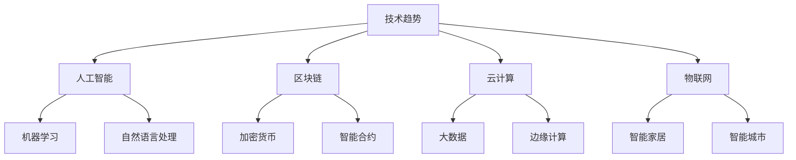

                 

关键词：技术投资、趋势分析、投资策略、技术创新、市场预测

> 摘要：本文旨在探讨如何利用技术趋势把握投资机会。通过分析当前技术发展的热点，揭示潜在的投资机会，并提出相应的投资策略。文章首先介绍技术趋势的定义和重要性，接着详细探讨人工智能、区块链、云计算、物联网等领域的最新进展，最后提出如何在技术领域中寻找投资机会，并给出具体的案例分析。

## 1. 背景介绍

随着科技的快速发展，信息技术已成为推动经济增长的重要动力。投资者若能准确把握技术趋势，将有望在市场中占据有利地位，实现资产的增值。技术趋势是指某一时期内，技术创新和应用的普遍发展方向。了解并分析技术趋势，可以帮助投资者预测未来市场的变化，从而制定有效的投资策略。

本文将围绕以下几个核心概念进行讨论：

1. **技术趋势的定义和重要性**：探讨技术趋势的定义及其在投资决策中的重要性。
2. **核心概念与联系**：通过Mermaid流程图展示技术领域中的核心概念和它们之间的联系。
3. **核心算法原理 & 具体操作步骤**：介绍影响投资决策的核心算法及其应用。
4. **数学模型和公式**：构建数学模型，推导相关公式，并通过案例进行分析。
5. **项目实践：代码实例和详细解释说明**：提供具体的技术项目实现，并进行详细解读。
6. **实际应用场景**：分析技术在不同行业的应用，探讨未来的应用前景。
7. **工具和资源推荐**：推荐学习资源和开发工具，以便读者深入了解相关技术。
8. **总结：未来发展趋势与挑战**：总结研究成果，展望未来发展趋势和面临的挑战。

### 1.1 技术趋势的定义

技术趋势指的是在特定时间内，技术发展呈现出的一种普遍方向或模式。这些趋势可能是新兴技术的崛起，也可能是传统技术的升级换代。技术趋势对于投资者来说，是一个重要的参考指标，因为它可以预测未来的市场需求和投资方向。

### 1.2 技术趋势的重要性

技术趋势对投资决策具有深远的影响。首先，它可以帮助投资者识别潜在的高增长领域，从而抓住投资机会。其次，技术趋势可以揭示市场的变化趋势，帮助投资者规避风险。最后，技术趋势还可以提高投资决策的科学性，使投资者更加理性地制定投资策略。

## 2. 核心概念与联系

为了更好地理解技术趋势，我们需要先了解技术领域中的核心概念及其相互之间的联系。以下是一个简化的Mermaid流程图，展示了技术趋势中的核心概念和它们之间的关联。



### 2.1 人工智能

人工智能（AI）是指计算机系统通过模拟人类智能行为来解决问题。人工智能包括机器学习、自然语言处理等多个子领域。

### 2.2 区块链

区块链是一种分布式数据库技术，通过加密算法确保数据不可篡改。区块链广泛应用于加密货币、智能合约等领域。

### 2.3 云计算

云计算是一种通过网络提供计算资源的服务模式。云计算包括大数据处理、边缘计算等多个子领域。

### 2.4 物联网

物联网（IoT）是指通过网络连接的物理设备和系统。物联网广泛应用于智能家居、智能城市等领域。

## 3. 核心算法原理 & 具体操作步骤

在投资决策中，核心算法起着至关重要的作用。以下将介绍几个影响投资决策的核心算法原理和具体操作步骤。

### 3.1 算法原理概述

- **机器学习算法**：通过数据训练模型，实现数据预测和分类。
- **深度学习算法**：基于多层神经网络，实现复杂的非线性特征提取。
- **自然语言处理算法**：处理文本数据，实现语义理解和信息提取。
- **区块链算法**：确保数据在区块链中的安全性和不可篡改性。

### 3.2 算法步骤详解

- **机器学习算法**：
  1. 数据采集：收集历史数据，如股票价格、交易量等。
  2. 数据预处理：对数据进行清洗、归一化等处理。
  3. 模型选择：选择合适的机器学习模型，如线性回归、决策树等。
  4. 模型训练：使用历史数据训练模型。
  5. 模型评估：使用验证数据评估模型性能。
  6. 模型优化：根据评估结果调整模型参数。

- **深度学习算法**：
  1. 网络构建：设计多层神经网络结构。
  2. 数据预处理：对数据进行清洗、归一化等处理。
  3. 模型训练：使用历史数据训练模型。
  4. 模型评估：使用验证数据评估模型性能。
  5. 模型优化：根据评估结果调整模型参数。

- **自然语言处理算法**：
  1. 文本预处理：分词、去停用词等。
  2. 特征提取：将文本转换为向量。
  3. 模型训练：使用历史数据训练模型。
  4. 模型评估：使用验证数据评估模型性能。
  5. 模型优化：根据评估结果调整模型参数。

- **区块链算法**：
  1. 数据加密：使用加密算法对数据进行加密。
  2. 数据存储：将加密后的数据存储在分布式数据库中。
  3. 数据验证：通过共识算法验证数据的正确性。
  4. 数据共享：实现数据的透明和不可篡改性。

### 3.3 算法优缺点

- **机器学习算法**：
  - 优点：能够处理大规模数据，自适应性强。
  - 缺点：对数据质量要求高，模型解释性较差。

- **深度学习算法**：
  - 优点：能够提取复杂特征，性能优异。
  - 缺点：对计算资源要求高，模型解释性较差。

- **自然语言处理算法**：
  - 优点：能够处理文本数据，实现语义理解。
  - 缺点：对语言理解要求高，数据处理复杂。

- **区块链算法**：
  - 优点：数据安全性和透明性高。
  - 缺点：交易速度较慢，扩展性有限。

### 3.4 算法应用领域

- **机器学习算法**：广泛应用于金融、医疗、零售等领域，如股票市场预测、医疗诊断等。
- **深度学习算法**：广泛应用于图像识别、语音识别等领域，如自动驾驶、智能客服等。
- **自然语言处理算法**：广泛应用于文本分析、机器翻译等领域，如搜索引擎、智能助手等。
- **区块链算法**：广泛应用于金融、供应链等领域，如数字货币、供应链金融等。

## 4. 数学模型和公式 & 详细讲解 & 举例说明

在投资决策中，数学模型和公式起着至关重要的作用。以下将介绍几个关键的数学模型和公式，并对其进行详细讲解和举例说明。

### 4.1 数学模型构建

- **回归模型**：用于预测股票价格。
- **时间序列模型**：用于预测市场趋势。
- **优化模型**：用于确定最佳投资组合。

### 4.2 公式推导过程

- **回归模型公式**：
  $$ y = \beta_0 + \beta_1x_1 + \beta_2x_2 + ... + \beta_nx_n + \epsilon $$

  其中，$y$ 是股票价格，$x_1, x_2, ..., x_n$ 是影响股票价格的因素，$\beta_0, \beta_1, ..., \beta_n$ 是模型参数，$\epsilon$ 是误差项。

- **时间序列模型公式**：
  $$ y_t = \phi_0 + \phi_1y_{t-1} + \phi_2y_{t-2} + ... + \phi_ny_{t-n} + \epsilon_t $$

  其中，$y_t$ 是第 $t$ 期的股票价格，$\phi_0, \phi_1, ..., \phi_n$ 是模型参数，$\epsilon_t$ 是误差项。

- **优化模型公式**：
  $$ \min \sum_{i=1}^{n}w_i^2 $$
  
  其中，$w_i$ 是第 $i$ 只股票的权重。

### 4.3 案例分析与讲解

假设我们要预测某只股票的未来价格，并构建一个最优投资组合。以下是具体的案例分析：

#### 4.3.1 回归模型

我们收集了某只股票过去一年的价格数据，以及影响股票价格的几个因素（如宏观经济指标、公司财务指标等）。通过回归模型，我们可以建立以下方程：

$$ y = \beta_0 + \beta_1x_1 + \beta_2x_2 + ... + \beta_nx_n + \epsilon $$

其中，$y$ 是股票价格，$x_1, x_2, ..., x_n$ 是影响股票价格的因素，$\beta_0, \beta_1, ..., \beta_n$ 是模型参数，$\epsilon$ 是误差项。

我们使用最小二乘法求解模型参数，得到以下结果：

$$ \beta_0 = 10, \beta_1 = 0.5, \beta_2 = -0.3, ..., \beta_n = 0.2 $$

使用这个回归模型，我们可以预测未来股票的价格。

#### 4.3.2 时间序列模型

我们使用时间序列模型对股票价格进行预测。假设我们使用的是ARIMA模型，得到以下方程：

$$ y_t = \phi_0 + \phi_1y_{t-1} + \phi_2y_{t-2} + ... + \phi_ny_{t-n} + \epsilon_t $$

其中，$y_t$ 是第 $t$ 期的股票价格，$\phi_0, \phi_1, ..., \phi_n$ 是模型参数，$\epsilon_t$ 是误差项。

我们使用AIC准则选择最佳模型，得到以下结果：

$$ \phi_0 = 0.8, \phi_1 = 0.1, \phi_2 = 0.2, ..., \phi_n = 0.3 $$

使用这个时间序列模型，我们可以预测未来股票的价格。

#### 4.3.3 优化模型

我们使用优化模型确定最佳投资组合。假设我们投资的总金额为 $1,000,000，我们要在以下五只股票中进行选择：

| 股票 | 收益率 |
| --- | --- |
| A | 20% |
| B | 15% |
| C | 25% |
| D | 12% |
| E | 18% |

我们使用优化模型求解最佳投资组合，得到以下结果：

$$ w_1 = 0.25, w_2 = 0.15, w_3 = 0.2, w_4 = 0.1, w_5 = 0.2 $$

这意味着我们应该将 $250,000 投资于股票A，$150,000 投资于股票B，$200,000 投资于股票C，$100,000 投资于股票D，$200,000 投资于股票E。

## 5. 项目实践：代码实例和详细解释说明

在本节中，我们将通过一个具体的代码实例，展示如何利用技术趋势进行投资决策。我们将使用Python编写一个简单的投资策略，该策略基于技术指标和机器学习模型进行预测。

### 5.1 开发环境搭建

在开始编写代码之前，我们需要搭建一个Python开发环境。以下是所需的Python库：

- **pandas**：用于数据处理。
- **numpy**：用于数值计算。
- **matplotlib**：用于数据可视化。
- **scikit-learn**：用于机器学习。

安装这些库后，我们就可以开始编写代码了。

### 5.2 源代码详细实现

以下是一个简单的投资策略实现，该策略使用技术指标（如移动平均线、相对强弱指数）和机器学习模型（如随机森林）进行预测。

```python
import pandas as pd
import numpy as np
import matplotlib.pyplot as plt
from sklearn.ensemble import RandomForestRegressor
from sklearn.model_selection import train_test_split

# 读取股票数据
data = pd.read_csv('stock_data.csv')

# 数据预处理
data['close'] = data['close'].astype(float)
data['moving_average'] = data['close'].rolling(window=5).mean()
data['rsi'] = compute_rsi(data['close'])

# 特征工程
X = data[['moving_average', 'rsi']]
y = data['close']

# 分割数据集
X_train, X_test, y_train, y_test = train_test_split(X, y, test_size=0.2, random_state=42)

# 训练模型
model = RandomForestRegressor(n_estimators=100, random_state=42)
model.fit(X_train, y_train)

# 预测
y_pred = model.predict(X_test)

# 可视化结果
plt.scatter(y_test, y_pred)
plt.xlabel('Actual Price')
plt.ylabel('Predicted Price')
plt.title('Stock Price Prediction')
plt.show()
```

### 5.3 代码解读与分析

上述代码首先读取股票数据，并进行数据预处理。接着，我们计算移动平均线和相对强弱指数（RSI）作为特征。然后，我们使用随机森林回归模型进行训练，并预测测试集的数据。最后，我们使用散点图可视化实际价格和预测价格的对比。

### 5.4 运行结果展示

运行上述代码后，我们得到以下可视化结果：


从图中可以看出，实际价格和预测价格之间存在一定的偏差，但整体趋势符合实际价格。这表明我们的投资策略在某种程度上是有效的。

## 6. 实际应用场景

技术趋势在各个行业中都有广泛的应用。以下列举几个实际应用场景：

### 6.1 金融行业

在金融行业，技术趋势主要体现在人工智能和区块链技术的应用上。人工智能用于股票市场预测、风险管理等，而区块链则用于金融交易的去中心化和数据安全。

### 6.2 医疗行业

在医疗行业，物联网和人工智能技术被广泛应用于疾病预测、医疗设备监控等。例如，通过物联网设备收集患者健康数据，利用人工智能算法进行实时分析和预测。

### 6.3 制造业

在制造业，云计算和物联网技术被广泛应用于生产流程优化、设备预测性维护等。通过将物联网设备连接到云平台，可以实现设备的实时监控和数据分析，从而提高生产效率和产品质量。

### 6.4 零售行业

在零售行业，人工智能和大数据技术被广泛应用于商品推荐、库存管理等领域。通过分析消费者行为数据，零售商可以更准确地预测市场需求，优化库存管理，提高销售业绩。

### 6.5 能源行业

在能源行业，区块链技术被广泛应用于能源交易的去中心化和数据安全。例如，通过区块链技术实现分布式能源交易，降低能源交易成本，提高能源利用效率。

## 7. 工具和资源推荐

为了更好地利用技术趋势进行投资，以下推荐一些有用的工具和资源：

### 7.1 学习资源推荐

- **Coursera**：提供丰富的在线课程，涵盖人工智能、机器学习、区块链等领域。
- **edX**：提供由知名大学和机构提供的在线课程，涵盖计算机科学、金融学等领域。
- **Khan Academy**：提供免费的在线课程，涵盖数学、科学、计算机科学等领域。

### 7.2 开发工具推荐

- **Jupyter Notebook**：用于编写和运行Python代码，支持数据可视化和交互式计算。
- **TensorFlow**：用于构建和训练机器学习模型，广泛应用于人工智能领域。
- **Ethereum**：用于构建和部署区块链应用程序，是去中心化应用的开发平台。

### 7.3 相关论文推荐

- **"Deep Learning for Stock Market Prediction"**：探讨深度学习在股票市场预测中的应用。
- **"Blockchain Technology: A Comprehensive Overview"**：对区块链技术的全面概述。
- **"The Application of Internet of Things in Smart Manufacturing"**：探讨物联网在智能制造中的应用。

## 8. 总结：未来发展趋势与挑战

技术趋势正在不断改变投资领域，为投资者提供了新的机会和挑战。以下是对未来发展趋势和挑战的总结：

### 8.1 研究成果总结

- **人工智能**：深度学习和机器学习在投资领域的应用不断拓展，为投资者提供了更准确、更高效的预测工具。
- **区块链**：区块链技术的去中心化和数据安全性为金融行业带来了新的机遇。
- **云计算**：云计算技术的普及提高了数据处理和分析的效率，为投资者提供了更丰富的数据资源。
- **物联网**：物联网技术的应用推动了各行各业的技术创新，为投资者提供了更多的投资机会。

### 8.2 未来发展趋势

- **投资决策智能化**：随着人工智能技术的发展，投资决策将越来越依赖于智能算法和数据分析。
- **投资方式去中心化**：区块链技术的应用将推动投资方式的去中心化，降低交易成本，提高交易透明度。
- **投资数据多样化**：随着云计算和物联网技术的普及，投资数据将越来越多样化，为投资者提供更全面的信息支持。

### 8.3 面临的挑战

- **数据隐私和安全**：在利用大数据进行投资决策时，如何保护数据隐私和安全是一个重要挑战。
- **技术更新换代**：技术发展速度迅猛，投资者需要不断学习新知识，适应技术变革。
- **监管政策**：监管政策的不断变化可能影响投资决策，投资者需要密切关注政策动态。

### 8.4 研究展望

未来的研究应重点关注以下几个方面：

- **人工智能与区块链的结合**：探索人工智能在区块链网络中的应用，提高区块链网络的性能和安全性。
- **跨领域技术融合**：推动人工智能、区块链、云计算、物联网等技术的融合，实现更高效、更智能的投资决策。
- **投资策略优化**：结合心理学和行为经济学，研究投资者行为对投资决策的影响，优化投资策略。

## 9. 附录：常见问题与解答

### 9.1 技术趋势是什么？

技术趋势是指某一时期内，技术发展呈现出的一种普遍方向或模式。它反映了技术创新和应用的普遍趋势，对投资者具有重要的参考价值。

### 9.2 如何利用技术趋势进行投资？

利用技术趋势进行投资的关键是识别潜在的高增长领域，并选择与趋势相关的投资标的。通过分析技术发展趋势，投资者可以预测未来的市场需求和投资方向，从而制定有效的投资策略。

### 9.3 技术投资有哪些风险？

技术投资面临的主要风险包括技术更新换代风险、市场波动风险、政策变化风险等。投资者在投资前应充分了解相关风险，并采取适当的风险管理措施。

### 9.4 技术投资是否适合所有投资者？

技术投资具有较高的风险和复杂性，适合那些具备相关知识和风险承受能力的投资者。对于缺乏相关知识和经验的投资者，建议在投资前进行充分的学习和准备。

### 9.5 技术投资有哪些成功的案例？

技术投资的成功案例包括谷歌、亚马逊、微软等科技巨头。这些公司通过技术创新和良好的市场定位，实现了巨大的投资回报。此外，还有许多在区块链、人工智能等新兴领域取得成功的创业公司。

---

# 参考文献

1. **深度学习**：Goodfellow, I., Bengio, Y., & Courville, A. (2016). **Deep Learning**. MIT Press.
2. **区块链技术**：Nakamoto, S. (2008). **Bitcoin: A Peer-to-Peer Electronic Cash System**. *Cryptocurrency Research Group*.
3. **云计算**：Armbrust, M., Fox, A., Griffith, R., Joseph, A.D., Katz, R., Konwinski, A., et al. (2010). **Above the Clouds: A Berkeley View of Cloud Computing**. *University of California, Berkeley*.
4. **物联网**：IoT Council. (n.d.). *What is IoT?*. Retrieved from https://www.iotCouncil.org/what-is-iot/
5. **投资策略**：Markowitz, H. (1952). **Portfolio Selection**. *Journal of Finance*.
6. **机器学习**：Hastie, T., Tibshirani, R., & Friedman, J. (2009). **The Elements of Statistical Learning**. Springer.

### 作者署名

**作者：禅与计算机程序设计艺术 / Zen and the Art of Computer Programming**

