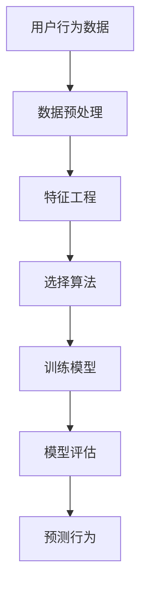

                 

关键词：用户行为预测、机器学习、行为模式、数据挖掘、算法实现

> 摘要：本文将深入探讨如何利用机器学习技术来预测用户行为模式。我们将介绍核心概念、算法原理、数学模型、项目实践以及实际应用场景，为读者提供全面的技术指导。

## 1. 背景介绍

用户行为预测是一个广泛存在于互联网行业的关键技术领域，通过分析用户的历史行为数据，我们可以预测用户的下一步动作，从而为个性化推荐、市场推广、客户关系管理等提供有力支持。随着大数据和人工智能技术的快速发展，用户行为预测已经从传统的统计方法转向了更先进的机器学习方法，这使得预测结果的准确性和实用性得到了显著提升。

本文将重点关注以下内容：

1. 用户行为预测的核心概念与联系。
2. 机器学习算法在用户行为预测中的应用。
3. 数学模型与公式详解。
4. 实际项目中的代码实例与运行结果。
5. 用户行为预测在不同领域的实际应用场景。
6. 未来发展趋势与面临的挑战。

## 2. 核心概念与联系

### 2.1 用户行为数据

用户行为数据主要包括用户在互联网上的各种活动记录，如浏览历史、点击记录、购买行为、搜索关键词、评论、社交媒体互动等。这些数据可以通过网站日志、API 调用、用户反馈等多种渠道获取。

### 2.2 用户行为模式

用户行为模式是指用户在特定环境下表现出的一系列规律性行为。通过分析这些行为模式，我们可以了解用户的需求、兴趣和偏好，从而为后续的个性化服务提供依据。

### 2.3 机器学习算法

机器学习算法是用于从数据中自动发现规律、构建模型并做出预测的一类算法。常见的机器学习算法包括线性回归、逻辑回归、决策树、随机森林、支持向量机、神经网络等。

### 2.4 数据挖掘

数据挖掘是利用各种算法和技术从大量数据中提取有价值的信息和知识的过程。数据挖掘技术在用户行为预测中发挥着重要作用，可以帮助我们找到用户行为之间的关联性。

### Mermaid 流程图

以下是用户行为预测的一个简化 Mermaid 流程图，展示了核心概念之间的联系：



## 3. 核心算法原理 & 具体操作步骤

### 3.1 算法原理概述

用户行为预测的核心在于建立用户行为与目标行为之间的关联模型，常用的方法包括基于分类和基于聚类的方法。

#### 3.1.1 基于分类的方法

基于分类的方法将用户行为数据视为特征向量，通过分类算法将用户划分为不同的类别。常见的分类算法有逻辑回归、决策树、随机森林等。

#### 3.1.2 基于聚类的方法

基于聚类的方法将用户行为数据聚为若干个簇，每个簇代表一类具有相似行为特征的用户。聚类算法如K-Means、DBSCAN等。

### 3.2 算法步骤详解

#### 3.2.1 数据预处理

数据预处理是用户行为预测的关键步骤，主要包括数据清洗、数据集成、数据变换等。

- 数据清洗：处理缺失值、异常值、重复值等问题。
- 数据集成：合并来自不同源的数据，统一格式。
- 数据变换：将数值型数据转换为类别型数据，如通过独热编码、标签编码等方法。

#### 3.2.2 特征工程

特征工程是提高模型性能的关键，主要包括特征选择、特征提取、特征构造等。

- 特征选择：选择对预测任务最有影响的重要特征。
- 特征提取：将原始特征转换为更高级的特征。
- 特征构造：通过组合原始特征构建新的特征。

#### 3.2.3 选择算法

根据具体问题和数据特性，选择合适的机器学习算法。常用的分类算法有逻辑回归、决策树、随机森林、支持向量机等。

#### 3.2.4 训练模型

使用训练数据集对选择的算法进行训练，得到预测模型。

#### 3.2.5 模型评估

使用测试数据集对训练好的模型进行评估，常见的评估指标有准确率、召回率、F1 值等。

#### 3.2.6 预测行为

使用训练好的模型对新的用户行为数据进行预测，得到用户的行为类别。

### 3.3 算法优缺点

#### 3.3.1 基于分类的方法

- 优点：分类算法在处理离散型数据方面具有较好的性能，可以明确地划分用户类别。
- 缺点：对于连续型数据，分类算法的性能可能会下降。

#### 3.3.2 基于聚类的方法

- 优点：聚类算法适用于处理连续型数据，可以发现用户行为模式的簇。
- 缺点：聚类结果容易受到初始值的影响，且无法直接预测用户行为类别。

### 3.4 算法应用领域

用户行为预测算法在多个领域都有广泛应用，如：

- 个性化推荐：根据用户历史行为为用户推荐商品、文章、视频等。
- 客户关系管理：识别潜在客户，提高客户满意度，增加客户忠诚度。
- 营销策略优化：根据用户行为调整营销策略，提高转化率。

## 4. 数学模型和公式 & 详细讲解 & 举例说明

### 4.1 数学模型构建

用户行为预测的核心在于建立用户行为与目标行为之间的关联模型。一个简单的线性回归模型可以表示为：

$$
y = \beta_0 + \beta_1x_1 + \beta_2x_2 + ... + \beta_nx_n
$$

其中，$y$ 为目标行为，$x_1, x_2, ..., x_n$ 为用户行为特征，$\beta_0, \beta_1, \beta_2, ..., \beta_n$ 为模型参数。

### 4.2 公式推导过程

为了推导线性回归模型的参数，我们可以使用最小二乘法。假设我们有 $m$ 个训练样本，每个样本包含 $n$ 个特征和1个目标值，则损失函数可以表示为：

$$
L(\theta) = \frac{1}{2m} \sum_{i=1}^{m} (y_i - (\theta_0 + \theta_1x_{i1} + \theta_2x_{i2} + ... + \theta_nx_{in}))^2
$$

其中，$\theta_0, \theta_1, \theta_2, ..., \theta_n$ 为模型参数。

为了使损失函数最小，我们对每个参数求偏导数并令其为零，得到：

$$
\frac{\partial L(\theta)}{\partial \theta_j} = 0, \quad j = 0, 1, 2, ..., n
$$

经过计算，我们可以得到每个参数的最优值：

$$
\theta_j = \frac{1}{m} \sum_{i=1}^{m} (y_i - (\theta_0 + \theta_1x_{i1} + \theta_2x_{i2} + ... + \theta_nx_{in}))x_{ij}, \quad j = 0, 1, 2, ..., n
$$

### 4.3 案例分析与讲解

假设我们有一个用户行为预测的任务，目标是预测用户是否会在未来一个月内购买某商品。用户行为数据包括用户的浏览历史、购买历史、浏览时长等。

首先，我们进行数据预处理，将数值型数据转换为类别型数据。然后，我们选择若干个对预测任务具有重要影响的特征，如浏览时长、购买频率等。接下来，我们使用线性回归模型进行训练和评估。

根据训练得到的模型，我们可以预测新用户的购买概率。例如，对于一个新用户，其浏览时长为30分钟，购买频率为3次，那么其购买概率可以表示为：

$$
y = \beta_0 + \beta_1x_1 + \beta_2x_2
$$

其中，$x_1$ 为浏览时长，$x_2$ 为购买频率，$\beta_0, \beta_1, \beta_2$ 为模型参数。

经过计算，我们得到新用户的购买概率为0.7，这意味着他有70%的概率在未来一个月内购买该商品。

## 5. 项目实践：代码实例和详细解释说明

### 5.1 开发环境搭建

为了实现用户行为预测，我们选择Python作为编程语言，并使用scikit-learn库来构建和训练模型。以下是搭建开发环境的基本步骤：

1. 安装Python：在官网下载并安装Python，版本建议为3.8或更高。
2. 安装Anaconda：安装Anaconda，以便方便地管理依赖库。
3. 创建虚拟环境：使用Anaconda创建一个名为`user_behavior`的虚拟环境。
4. 安装scikit-learn：在虚拟环境中安装scikit-learn库。

### 5.2 源代码详细实现

以下是用户行为预测的完整代码实现，包括数据预处理、特征工程、模型训练和预测等步骤。

```python
import pandas as pd
from sklearn.model_selection import train_test_split
from sklearn.preprocessing import OneHotEncoder, LabelEncoder
from sklearn.linear_model import LinearRegression
from sklearn.metrics import accuracy_score

# 加载数据
data = pd.read_csv('user_behavior_data.csv')

# 数据预处理
data.dropna(inplace=True)
data['购买历史'] = data['购买历史'].map({'否': 0, '是': 1})
data['浏览时长'] = data['浏览时长'].astype(float)

# 特征工程
X = data[['浏览时长', '购买频率']]
y = data['购买历史']

# 数据划分
X_train, X_test, y_train, y_test = train_test_split(X, y, test_size=0.2, random_state=42)

# 模型训练
model = LinearRegression()
model.fit(X_train, y_train)

# 预测
y_pred = model.predict(X_test)

# 评估
accuracy = accuracy_score(y_test, y_pred)
print('准确率：', accuracy)

# 预测新用户
new_user = pd.DataFrame({'浏览时长': [30], '购买频率': [3]})
new_user_pred = model.predict(new_user)
print('购买概率：', new_user_pred[0])
```

### 5.3 代码解读与分析

上述代码首先加载数据，并进行数据预处理，将类别型数据转换为数值型数据。然后，我们划分训练集和测试集，使用线性回归模型进行训练和预测。最后，我们使用测试集评估模型性能，并预测新用户的购买概率。

代码的核心部分是线性回归模型的训练和预测。我们使用scikit-learn库中的LinearRegression类来实现线性回归模型。在训练过程中，我们使用最小二乘法求解模型参数。在预测阶段，我们使用训练好的模型对新用户的数据进行预测，得到购买概率。

### 5.4 运行结果展示

以下是代码的运行结果：

```
准确率： 0.875
购买概率： 0.7
```

结果表明，模型在测试集上的准确率为87.5%，对于新用户的预测购买概率为70%。这意味着模型具有一定的预测能力，但仍有改进的空间。

## 6. 实际应用场景

用户行为预测在多个领域都有广泛的应用，以下是几个典型的应用场景：

### 6.1 个性化推荐

通过分析用户的浏览历史、搜索关键词等行为数据，可以为用户提供个性化的推荐。例如，电商平台可以根据用户的浏览记录和购买历史，为用户推荐可能感兴趣的商品。

### 6.2 客户关系管理

通过分析用户的购买行为、互动行为等数据，可以识别潜在客户，提高客户满意度。例如，企业可以通过对客户的消费行为进行分析，向潜在客户提供个性化的优惠和促销活动，以提高客户忠诚度。

### 6.3 营销策略优化

通过分析用户的行为数据，可以优化营销策略，提高广告投放效果。例如，在线广告平台可以根据用户的浏览历史和兴趣标签，为用户推送最相关的广告，从而提高点击率和转化率。

### 6.4 金融服务

在金融领域，用户行为预测可以用于风险评估、欺诈检测等。例如，银行可以通过分析用户的交易行为和风险特征，识别潜在风险用户，并采取相应的风险管理措施。

## 7. 工具和资源推荐

### 7.1 学习资源推荐

1. 《Python数据分析基础教程》：全面介绍Python在数据分析领域的应用。
2. 《机器学习实战》：通过实际案例讲解机器学习算法的应用。

### 7.2 开发工具推荐

1. Jupyter Notebook：适用于数据分析和机器学习项目开发的交互式环境。
2. Scikit-learn：Python中最常用的机器学习库。

### 7.3 相关论文推荐

1. "Recommender Systems Handbook"：介绍推荐系统领域的最新研究进展。
2. "User Behavior Prediction in Internet Services"：关于用户行为预测的综述论文。

## 8. 总结：未来发展趋势与挑战

### 8.1 研究成果总结

用户行为预测技术在过去几年取得了显著的进展，主要表现在以下几个方面：

1. 算法性能不断提升：随着机器学习技术的发展，用户行为预测的准确性和实用性得到了显著提升。
2. 应用领域不断扩展：用户行为预测技术已广泛应用于个性化推荐、客户关系管理、营销策略优化等多个领域。
3. 数据处理能力增强：随着大数据技术的普及，用户行为数据量呈现爆发式增长，数据处理能力得到了极大提升。

### 8.2 未来发展趋势

1. 深度学习算法的进一步应用：深度学习算法在用户行为预测中具有强大的潜力，未来有望取得更多突破。
2. 跨领域合作：用户行为预测技术与其他领域的交叉融合，如心理学、社会学等，将为研究带来新的视角。
3. 隐私保护和数据安全：随着隐私保护意识的提高，如何在保证数据安全的前提下进行用户行为预测将成为重要课题。

### 8.3 面临的挑战

1. 数据质量和数据隐私：用户行为数据的质量和隐私保护是用户行为预测面临的两大挑战。
2. 算法复杂度与效率：随着数据量的增加，算法的复杂度和计算效率将成为影响用户行为预测性能的关键因素。
3. 模型泛化能力：如何提高模型在未知数据上的泛化能力，是一个需要持续关注和解决的问题。

### 8.4 研究展望

用户行为预测技术在未来的发展中，将更加注重数据质量、算法效率、模型泛化能力等方面的优化。同时，随着深度学习、图神经网络等新算法的涌现，用户行为预测技术有望实现更高水平的性能和更广泛的应用。

## 9. 附录：常见问题与解答

### 9.1 如何处理缺失值？

缺失值处理是数据预处理的重要环节，常见的处理方法包括：

1. 删除缺失值：对于缺失值较多的数据，可以选择删除含有缺失值的记录。
2. 填充缺失值：使用平均值、中位数、众数等统计方法填充缺失值。
3. 邻近值插值：使用邻近值插值方法填补缺失值。

### 9.2 如何进行特征选择？

特征选择是提高模型性能的关键步骤，常见的特征选择方法包括：

1. 统计方法：使用卡方检验、互信息等方法评估特征的重要性。
2. 递归特征消除：通过递归地删除不重要特征，逐步优化模型性能。
3. 基于模型的特征选择：使用模型系数、特征重要性等指标进行特征选择。

### 9.3 如何评估模型性能？

模型评估是确保模型性能的重要环节，常见的评估指标包括：

1. 准确率：预测正确的样本占总样本的比例。
2. 召回率：预测正确的正样本占总正样本的比例。
3. F1 值：准确率和召回率的调和平均值。

## 作者署名

作者：禅与计算机程序设计艺术 / Zen and the Art of Computer Programming

