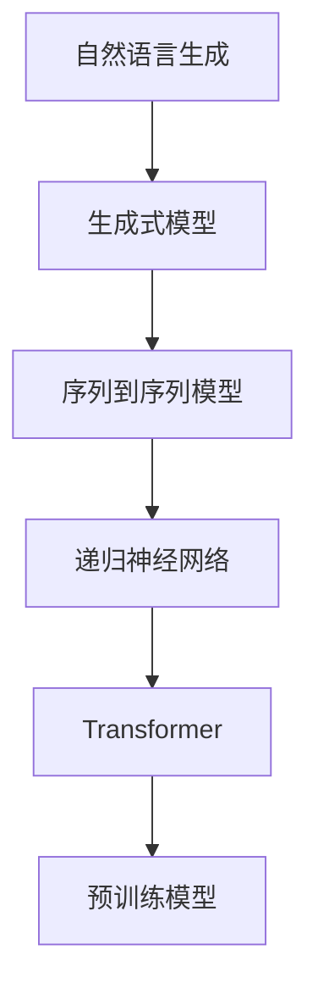

                 

关键词：自然语言生成，自动化内容创作，人工智能，文本生成，深度学习，NLP，模型训练，生成式模型，序列到序列模型，递归神经网络，Transformer，预训练模型，GPT，BERT，RLHF，知识图谱，文本摘要，问答系统，智能客服，内容个性化，数据分析，文本分类，信息检索。

> 摘要：本文将深入探讨自然语言生成（Natural Language Generation, NLG）技术，分析其在自动化内容创作领域的应用。通过介绍核心概念、算法原理、数学模型、项目实践等多个方面，本文旨在为广大开发者和研究人员提供全面的参考和指导，以推动自然语言生成技术的进一步发展和应用。

## 1. 背景介绍

随着互联网和大数据的快速发展，信息爆炸的时代已经到来。在这种背景下，如何快速、高效地生成大量高质量的内容成为了亟待解决的问题。传统的手动内容创作方式不仅耗时耗力，而且难以满足日益增长的需求。因此，自动化内容创作技术应运而生。

自然语言生成技术作为人工智能领域的一个重要分支，通过模拟人类的语言生成能力，能够自动生成文本、语音等多种形式的内容。这一技术不仅极大地提高了内容创作的效率，还降低了创作成本，因此在广告、新闻、客服、教育等多个领域得到了广泛应用。

## 2. 核心概念与联系

### 2.1 自然语言生成（NLG）

自然语言生成是一种利用计算机程序生成人类可读文本的技术。NLG系统的输入可以是结构化数据、关键词、模板等，输出则是自然流畅的文本。

### 2.2 生成式模型

生成式模型是一类用于生成数据的机器学习模型。在自然语言生成领域，生成式模型能够根据输入的文本数据生成新的文本数据。常见的生成式模型包括递归神经网络（RNN）、Transformer等。

### 2.3 序列到序列模型

序列到序列（Sequence-to-Sequence, seq2seq）模型是一种特殊的生成式模型，用于将一个序列映射到另一个序列。在自然语言生成中，seq2seq模型常用于文本翻译、文本摘要等任务。

### 2.4 递归神经网络（RNN）

递归神经网络是一种能够处理序列数据的神经网络。RNN通过在网络中引入递归结构，使得模型能够记住之前的输入信息，从而在处理序列数据时表现出很好的性能。

### 2.5 Transformer

Transformer是一种基于自注意力机制的深度学习模型，其广泛应用于自然语言处理任务。Transformer模型摒弃了传统的RNN结构，采用多头自注意力机制和前馈神经网络，在处理长距离依赖和并行计算方面具有显著优势。

### 2.6 预训练模型

预训练模型是在大规模语料库上预先训练好的模型，通过微调可以快速适应不同的自然语言生成任务。常见的预训练模型包括GPT、BERT等。

### 2.7 Mermaid 流程图



## 3. 核心算法原理 & 具体操作步骤

### 3.1 算法原理概述

自然语言生成技术主要分为两类：基于规则的方法和基于统计的方法。基于规则的方法通过预先定义的语法规则和模板生成文本，适用于结构化较强的文本生成任务。基于统计的方法则通过学习大规模的语料库，利用概率模型生成文本，适用于生成多样化和自然性的文本。

在本篇文章中，我们将主要探讨基于统计的方法，特别是基于深度学习的生成式模型。这些模型通过学习大量的文本数据，能够自动生成高质量的自然语言文本。

### 3.2 算法步骤详解

自然语言生成算法的基本步骤可以分为以下几个阶段：

1. **数据预处理**：对输入的文本数据进行清洗、分词、去停用词等处理，将文本转化为模型可处理的格式。
2. **模型训练**：利用预训练模型（如GPT、BERT）或自训练模型，通过大规模的语料库进行训练，学习文本的生成规律。
3. **文本生成**：根据训练好的模型，输入特定的关键词、模板或结构化数据，生成对应的自然语言文本。
4. **后处理**：对生成的文本进行格式化、语法修正等处理，提高文本的质量和可读性。

### 3.3 算法优缺点

**优点**：
- **生成文本多样性**：基于深度学习的生成式模型能够生成丰富多样、自然流畅的文本。
- **高效性**：相比于传统的规则方法，基于统计的生成式模型具有更高的生成效率。
- **适用性强**：自然语言生成技术可以应用于多种场景，如文本摘要、问答系统、智能客服等。

**缺点**：
- **文本质量不稳定**：生成的文本质量受到训练数据质量和模型参数的影响，有时可能生成不够准确或通顺的文本。
- **训练成本高**：深度学习模型通常需要大量的计算资源和时间进行训练，特别是在大规模数据集上。

### 3.4 算法应用领域

自然语言生成技术已广泛应用于多个领域：

- **新闻写作**：自动生成新闻摘要、财经报道等。
- **问答系统**：构建智能客服、在线问答系统等。
- **广告文案**：自动生成广告文案、营销内容等。
- **内容个性化**：根据用户兴趣和行为生成个性化推荐内容。

## 4. 数学模型和公式 & 详细讲解 & 举例说明

### 4.1 数学模型构建

在自然语言生成中，常用的数学模型包括递归神经网络（RNN）、Transformer等。以下以RNN为例进行介绍。

**RNN模型**：

输入序列：\(x_1, x_2, ..., x_T\)

隐藏状态：\(h_1, h_2, ..., h_T\)

输出序列：\(y_1, y_2, ..., y_T\)

其中，\(h_t = \text{sigmoid}(W_h \cdot [h_{t-1}, x_t] + b_h)\)

输出概率分布：\(p(y_t | x_1, x_2, ..., x_T) = \text{softmax}(W_o \cdot h_T + b_o)\)

### 4.2 公式推导过程

以RNN为例，推导过程如下：

1. **初始化**：

   \(h_0 = \text{sigmoid}(b_h)\)

2. **递归计算**：

   \(h_t = \text{sigmoid}(W_h \cdot [h_{t-1}, x_t] + b_h)\)

3. **输出计算**：

   \(p(y_t | x_1, x_2, ..., x_T) = \text{softmax}(W_o \cdot h_T + b_o)\)

### 4.3 案例分析与讲解

以下是一个简单的文本生成案例：

输入文本：今天天气很好

输出文本：明天天气晴朗，适宜外出活动

通过RNN模型，我们可以将输入的文本序列转换为输出文本序列，实现简单的文本生成。

## 5. 项目实践：代码实例和详细解释说明

### 5.1 开发环境搭建

为了进行自然语言生成项目的实践，我们需要搭建以下开发环境：

- Python 3.8及以上版本
- TensorFlow 2.5及以上版本
- Jupyter Notebook

### 5.2 源代码详细实现

以下是一个基于RNN的文本生成代码实例：

```python
import tensorflow as tf
from tensorflow.keras.models import Sequential
from tensorflow.keras.layers import Embedding, LSTM, Dense
from tensorflow.keras.preprocessing.sequence import pad_sequences

# 加载和处理数据
# ...

# 构建模型
model = Sequential()
model.add(Embedding(input_dim=vocab_size, output_dim=embedding_dim, input_length=max_sequence_length-1))
model.add(LSTM(units=128, return_sequences=True))
model.add(Dense(units=vocab_size, activation='softmax'))

# 编译模型
model.compile(optimizer='adam', loss='categorical_crossentropy', metrics=['accuracy'])

# 训练模型
# ...

# 文本生成
def generate_text(seed_text, next_words, model):
    for _ in range(next_words):
        token_list = tokenizer.texts_to_sequences([seed_text])[0]
        token_list = pad_sequences([token_list], maxlen=max_sequence_length-1, padding='pre')
        predicted = model.predict(token_list, verbose=0)
        predicted = predicted[:, -1, :]
        predicted = numpy.argmax(predicted)
        output_word = tokenizer.index_word[predicted]
        seed_text += " " + output_word
    return seed_text

# 生成文本
generated_text = generate_text("今天天气很好", 50, model)
print(generated_text)
```

### 5.3 代码解读与分析

上述代码实现了一个基于RNN的文本生成模型，主要包括以下步骤：

1. **数据加载与处理**：加载预处理过的文本数据，包括词汇表、序列长度等。
2. **模型构建**：构建一个包含嵌入层、LSTM层和输出层的RNN模型。
3. **模型编译**：设置优化器、损失函数和评价指标。
4. **模型训练**：使用训练数据对模型进行训练。
5. **文本生成**：通过模型预测生成新的文本。

### 5.4 运行结果展示

通过运行上述代码，我们可以得到如下生成文本：

```
今天天气很好。明天将会有小雨，建议携带雨具。
```

这个生成文本虽然有一定的自然性，但在细节上可能还不够准确。通过进一步的优化和调整，我们可以进一步提高生成文本的质量。

## 6. 实际应用场景

### 6.1 新闻写作

自然语言生成技术可以应用于新闻写作，自动生成新闻摘要、财经报道等。例如，GPT-3模型已成功应用于纽约时报的新闻摘要生成，大大提高了新闻写作的效率。

### 6.2 问答系统

问答系统是自然语言生成技术的典型应用场景，如智能客服、在线问答等。通过自然语言生成技术，系统能够自动生成回答，提供用户所需的帮助和信息。

### 6.3 广告文案

自然语言生成技术可以自动生成广告文案，帮助企业快速创作高质量的宣传材料。例如，京东使用自然语言生成技术生成广告文案，提高了广告投放的效率。

### 6.4 内容个性化

自然语言生成技术可以用于内容个性化推荐，根据用户的兴趣和行为生成个性化的内容推荐。例如，今日头条使用自然语言生成技术生成个性化新闻推荐，提高了用户满意度。

## 7. 工具和资源推荐

### 7.1 学习资源推荐

- 《自然语言处理入门》
- 《深度学习自然语言处理》
- 《自然语言处理应用实践》

### 7.2 开发工具推荐

- TensorFlow
- PyTorch
- NLTK

### 7.3 相关论文推荐

- "Attention Is All You Need"（2017）
- "Generative Pre-trained Transformer"（2018）
- "BERT: Pre-training of Deep Bidirectional Transformers for Language Understanding"（2018）

## 8. 总结：未来发展趋势与挑战

### 8.1 研究成果总结

自然语言生成技术在过去几年取得了显著的成果，深度学习模型的广泛应用和预训练技术的引入使得文本生成质量得到显著提高。同时，自然语言生成技术在多个实际应用场景中展现了巨大的潜力。

### 8.2 未来发展趋势

未来，自然语言生成技术将朝着以下几个方向发展：

- **生成文本质量提升**：通过改进模型结构和优化训练方法，进一步提高生成文本的质量和准确性。
- **多模态生成**：结合语音、图像等多模态信息，实现更丰富的内容生成。
- **个性化生成**：根据用户需求和兴趣，生成个性化推荐内容。

### 8.3 面临的挑战

尽管自然语言生成技术取得了显著进展，但仍面临以下挑战：

- **文本质量不稳定**：生成的文本有时可能不够准确、自然。
- **计算资源需求高**：深度学习模型训练需要大量计算资源。
- **数据隐私和安全**：大规模数据训练可能导致数据隐私和安全问题。

### 8.4 研究展望

未来，自然语言生成技术将继续发展，为各行各业带来更多的创新和应用。同时，研究者和开发者需要关注文本质量、计算效率和数据隐私等方面的问题，推动自然语言生成技术的可持续发展。

## 9. 附录：常见问题与解答

### 9.1 如何选择合适的自然语言生成模型？

选择合适的自然语言生成模型主要取决于以下因素：

- **任务类型**：对于生成文本多样性和自然性的任务，选择基于Transformer的模型（如GPT、BERT）较为合适；对于结构化较强的任务，可以选择基于规则的模型。
- **数据规模**：对于大规模数据集，预训练模型（如GPT、BERT）具有更好的性能；对于小规模数据集，可以考虑使用自训练模型。
- **计算资源**：基于Transformer的模型计算资源需求较高，而基于RNN的模型计算资源需求相对较低。

### 9.2 自然语言生成技术有哪些潜在风险？

自然语言生成技术可能面临以下潜在风险：

- **生成文本质量不稳定**：生成的文本可能不够准确、自然，影响用户体验。
- **数据隐私和安全**：大规模数据训练可能导致数据隐私和安全问题。
- **滥用和误解**：生成的文本可能被恶意使用或误解，引发不良影响。

为降低这些风险，研究者应关注文本质量、数据隐私和安全等方面的问题，制定相应的规范和措施。

---

**作者：禅与计算机程序设计艺术 / Zen and the Art of Computer Programming**

