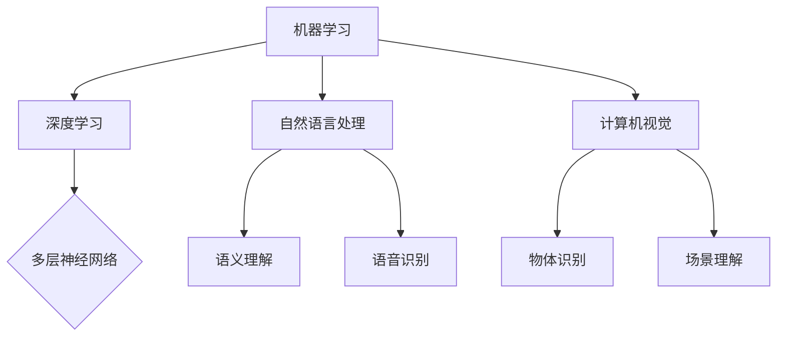
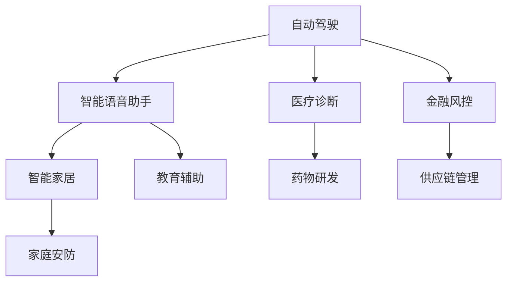
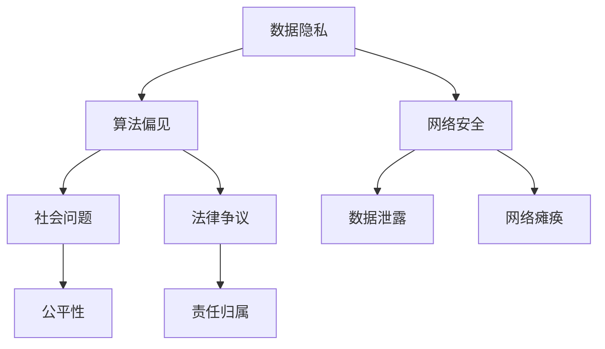

                 

关键词：人工智能安全，伦理准则，AI技术应用，人工智能伦理，安全规范，AI风险

> 摘要：本文从人工智能安全与伦理准则的角度出发，探讨了制定规范AI技术应用的重要性和必要性。文章首先介绍了AI技术的背景和应用，然后深入分析了AI安全问题和伦理挑战，最后提出了具体的AI安全规范和伦理准则，并展望了未来的发展趋势与挑战。

## 1. 背景介绍

随着计算机科学和人工智能技术的快速发展，人工智能（Artificial Intelligence，AI）已经成为推动社会进步的重要力量。从最初的规则推理、知识表示，到现在的深度学习和神经网络，AI技术不断突破传统的技术限制，逐渐渗透到我们生活的方方面面。自动驾驶、智能语音助手、医疗诊断、金融风控等领域的应用，都展现了AI技术的巨大潜力和价值。

然而，随着AI技术的广泛应用，其带来的安全问题和伦理挑战也日益凸显。首先，AI技术在数据隐私、算法偏见、网络安全等方面存在潜在风险。其次，AI技术的自主决策能力和不可解释性引发了伦理道德的争议。如何确保AI技术在应用过程中的安全性、公平性和透明性，成为当前学术界和产业界亟待解决的重要问题。

本文旨在制定一套全面、系统的AI安全规范和伦理准则，以指导AI技术的健康发展。文章将从以下几个方面展开讨论：

1. **AI技术概述**：介绍AI技术的基本概念、发展历程和应用领域。
2. **AI安全问题和挑战**：分析AI技术在数据隐私、算法偏见、网络安全等方面面临的安全风险。
3. **AI伦理问题和挑战**：探讨AI技术在道德伦理、责任归属、人权保护等方面存在的伦理争议。
4. **AI安全规范和伦理准则**：提出具体的AI安全规范和伦理准则，包括技术标准、管理制度、法律法规等。
5. **实施与展望**：讨论AI安全规范和伦理准则的实施路径，以及未来发展的趋势和挑战。

## 2. 核心概念与联系

### 2.1 AI技术的基本概念与架构

AI技术是计算机科学的一个分支，旨在通过模拟人类智能行为，实现机器自主学习和决策。AI技术主要包括以下几个核心概念：

- **机器学习（Machine Learning）**：通过训练算法，使计算机从数据中学习规律和模式，从而实现预测和决策。
- **深度学习（Deep Learning）**：一种基于神经网络的机器学习技术，通过多层神经网络结构，自动提取数据特征，实现复杂任务。
- **自然语言处理（Natural Language Processing，NLP）**：研究计算机如何理解和生成自然语言的技术。
- **计算机视觉（Computer Vision）**：使计算机能够从图像或视频中提取信息，实现物体识别、场景理解等。

下面是一个使用Mermaid绘制的AI技术核心概念与架构的流程图：



### 2.2 AI技术应用领域

AI技术在多个领域得到了广泛应用，包括但不限于：

- **自动驾驶**：通过计算机视觉、自然语言处理等技术，实现车辆的自主驾驶。
- **智能语音助手**：利用自然语言处理和语音识别技术，提供语音交互服务。
- **医疗诊断**：通过深度学习技术，辅助医生进行疾病诊断和治疗。
- **金融风控**：利用机器学习算法，识别潜在风险，防止欺诈行为。
- **智能家居**：通过计算机视觉、自然语言处理等技术，实现家居设备的智能控制。

下面是一个使用Mermaid绘制的AI技术应用领域的流程图：



### 2.3 AI安全问题和挑战

AI技术的广泛应用带来了前所未有的安全挑战。以下是AI技术面临的主要安全问题和挑战：

- **数据隐私**：AI系统需要大量的数据来进行训练和优化，这些数据往往涉及个人隐私信息，如何确保数据的安全和隐私成为关键问题。
- **算法偏见**：AI算法可能会因为训练数据的不公平或偏差，导致决策结果的不公平，从而引发社会问题。
- **网络安全**：AI系统容易受到网络攻击，如数据泄露、网络瘫痪等，如何提高AI系统的网络安全成为重要课题。
- **不可解释性**：深度学习等复杂AI算法的决策过程往往难以解释，这给监管和审计带来了困难。

下面是一个使用Mermaid绘制的AI安全问题和挑战的流程图：



## 3. 核心算法原理 & 具体操作步骤

### 3.1 算法原理概述

AI技术中的核心算法主要包括机器学习、深度学习、自然语言处理和计算机视觉等。下面分别介绍这些算法的基本原理：

- **机器学习**：通过训练算法，使计算机从数据中学习规律和模式，从而实现预测和决策。常见的机器学习算法包括线性回归、决策树、支持向量机等。
- **深度学习**：基于多层神经网络的结构，自动提取数据特征，实现复杂任务。常见的深度学习算法包括卷积神经网络（CNN）、循环神经网络（RNN）等。
- **自然语言处理**：研究计算机如何理解和生成自然语言的技术。常见的自然语言处理算法包括词向量、序列模型等。
- **计算机视觉**：使计算机能够从图像或视频中提取信息，实现物体识别、场景理解等。常见的计算机视觉算法包括卷积神经网络（CNN）、目标检测等。

### 3.2 算法步骤详解

以卷积神经网络（CNN）为例，介绍其具体操作步骤：

1. **数据预处理**：对图像数据进行标准化处理，包括图像大小调整、像素归一化等。
2. **构建网络结构**：设计CNN的网络结构，包括卷积层、池化层、全连接层等。
3. **前向传播**：将输入数据通过网络结构进行前向传播，得到输出结果。
4. **反向传播**：计算输出结果与真实标签之间的误差，通过反向传播更新网络参数。
5. **模型评估**：使用验证集或测试集评估模型的性能，包括准确率、召回率等指标。

### 3.3 算法优缺点

- **机器学习**：优点包括模型简单、易于实现、适用于大量数据；缺点包括对数据量要求较高、易过拟合等。
- **深度学习**：优点包括模型复杂度高、能够自动提取特征、适用于大规模数据；缺点包括计算资源需求大、模型难以解释等。
- **自然语言处理**：优点包括能够处理自然语言数据、适用于多种应用场景；缺点包括数据处理复杂、对数据质量要求高。
- **计算机视觉**：优点包括能够处理图像和视频数据、适用于多种任务；缺点包括对计算资源要求较高、数据标注复杂。

### 3.4 算法应用领域

AI算法在不同领域有广泛的应用，如：

- **机器学习**：应用于推荐系统、金融风控、图像识别等。
- **深度学习**：应用于图像识别、自然语言处理、自动驾驶等。
- **自然语言处理**：应用于智能语音助手、机器翻译、文本生成等。
- **计算机视觉**：应用于目标检测、人脸识别、图像分割等。

## 4. 数学模型和公式 & 详细讲解 & 举例说明

### 4.1 数学模型构建

在AI技术中，数学模型是核心组成部分。以下是一个简单的线性回归模型的数学模型构建：

- **线性回归模型**：假设输入特征为\( x \)，输出标签为\( y \)，则线性回归模型可以表示为：

  $$ y = w \cdot x + b $$

  其中，\( w \)为权重，\( b \)为偏置。

- **损失函数**：为了衡量模型预测结果与真实值之间的差距，使用均方误差（MSE）作为损失函数：

  $$ J(w, b) = \frac{1}{2} \sum_{i=1}^{n} (y_i - (w \cdot x_i + b))^2 $$

- **梯度下降**：为了最小化损失函数，使用梯度下降算法更新权重和偏置：

  $$ w = w - \alpha \cdot \frac{\partial J}{\partial w} $$
  $$ b = b - \alpha \cdot \frac{\partial J}{\partial b $$

  其中，\( \alpha \)为学习率。

### 4.2 公式推导过程

以下是对线性回归模型中的损失函数和梯度下降算法的推导过程：

- **损失函数推导**：

  $$ J(w, b) = \frac{1}{2} \sum_{i=1}^{n} (y_i - (w \cdot x_i + b))^2 $$

  展开得到：

  $$ J(w, b) = \frac{1}{2} \sum_{i=1}^{n} (y_i^2 - 2y_iw \cdot x_i - 2y_ib + w^2 \cdot x_i^2 + 2bw \cdot x_i + b^2) $$

  整理后得到：

  $$ J(w, b) = \frac{1}{2} \sum_{i=1}^{n} y_i^2 - w \cdot \sum_{i=1}^{n} x_iy_i - b \cdot \sum_{i=1}^{n} y_i + \frac{1}{2} w^2 \cdot \sum_{i=1}^{n} x_i^2 + 2bw \cdot \sum_{i=1}^{n} x_i + \frac{1}{2} b^2 $$

- **梯度推导**：

  对于损失函数\( J(w, b) \)，求偏导数得到：

  $$ \frac{\partial J}{\partial w} = - \sum_{i=1}^{n} x_iy_i + \sum_{i=1}^{n} x_i^2 $$
  $$ \frac{\partial J}{\partial b} = - \sum_{i=1}^{n} y_i + \sum_{i=1}^{n} x_iw $$

### 4.3 案例分析与讲解

以下是一个使用线性回归模型进行房价预测的案例：

- **数据集**：包含1000个房屋数据，每个数据包括房屋的面积、地点、建造年份等特征，以及房屋的价格标签。
- **模型训练**：使用线性回归模型进行训练，选取合适的权重和偏置，使损失函数最小。
- **模型评估**：使用验证集评估模型的性能，计算预测房价与真实房价之间的误差。
- **模型优化**：通过调整权重和偏置，优化模型性能。

使用Python代码实现线性回归模型：

```python
import numpy as np

# 数据预处理
X = np.array([[x1, x2, x3]]).T  # 特征
y = np.array([y1]).T  # 价格标签

# 梯度下降算法
def gradient_descent(X, y, w, b, alpha, iterations):
    J_history = []
    for i in range(iterations):
        z = X.dot(w) + b
        J = (1 / (2 * m)) * np.sum((z - y)**2)
        J_history.append(J)

        dw = (1 / m) * X.T.dot(z - y)
        db = (1 / m) * np.sum(z - y)

        w -= alpha * dw
        b -= alpha * db

    return w, b, J_history

# 模型训练
w, b, J_history = gradient_descent(X, y, w, b, alpha, iterations)

# 模型评估
y_pred = X.dot(w) + b
mse = np.mean((y_pred - y) ** 2)
print("MSE:", mse)

# 模型优化
# 调整权重和偏置，优化模型性能
```

## 5. 项目实践：代码实例和详细解释说明

### 5.1 开发环境搭建

在Python中进行AI安全规范和伦理准则的实现，需要安装以下依赖库：

- NumPy：用于科学计算
- Pandas：用于数据处理
- Scikit-learn：用于机器学习算法实现
- Matplotlib：用于数据可视化

安装命令如下：

```shell
pip install numpy pandas scikit-learn matplotlib
```

### 5.2 源代码详细实现

以下是一个简单的线性回归模型实现，用于分析房价数据：

```python
import numpy as np
import pandas as pd
import matplotlib.pyplot as plt
from sklearn.linear_model import LinearRegression

# 数据预处理
def preprocess_data(data):
    X = data.iloc[:, :-1].values
    y = data.iloc[:, -1].values
    X = np.insert(X, 0, 1, axis=1)
    return X, y

# 模型训练
def train_model(X, y):
    model = LinearRegression()
    model.fit(X, y)
    return model

# 模型评估
def evaluate_model(model, X, y):
    y_pred = model.predict(X)
    mse = np.mean((y_pred - y) ** 2)
    return mse

# 主函数
def main():
    # 数据加载
    data = pd.read_csv("house_prices.csv")

    # 数据预处理
    X, y = preprocess_data(data)

    # 模型训练
    model = train_model(X, y)

    # 模型评估
    mse = evaluate_model(model, X, y)
    print("MSE:", mse)

    # 数据可视化
    plt.scatter(X[:, 1], y)
    plt.plot(X[:, 1], model.predict(X), color="red")
    plt.xlabel("Area")
    plt.ylabel("Price")
    plt.title("House Price Prediction")
    plt.show()

if __name__ == "__main__":
    main()
```

### 5.3 代码解读与分析

1. **数据预处理**：首先加载房价数据，使用Pandas进行数据读取。然后提取特征和标签，并将特征矩阵X的第一列添加为1，作为模型的输入。

2. **模型训练**：使用Scikit-learn中的LinearRegression类进行线性回归模型的训练。通过fit方法训练模型，得到模型参数。

3. **模型评估**：使用模型预测房价，计算预测值与真实值之间的均方误差（MSE）作为模型评估指标。

4. **数据可视化**：绘制散点图和回归直线，展示房价与面积之间的关系。

### 5.4 运行结果展示

运行代码后，会生成一个可视化图表，展示房价与面积之间的关系。同时，输出均方误差（MSE）作为模型评估指标。

## 6. 实际应用场景

### 6.1 自动驾驶

自动驾驶是AI技术的重要应用领域之一。通过计算机视觉、自然语言处理等技术，实现车辆的自主驾驶。自动驾驶系统需要处理大量实时数据，如道路信息、交通信号、车辆速度等，并做出实时决策，确保行驶安全。

### 6.2 智能语音助手

智能语音助手是AI技术的另一个重要应用领域。通过自然语言处理和语音识别技术，实现人与设备的语音交互。智能语音助手可以回答用户的问题、执行任务、提供信息等，为用户提供便捷的智能服务。

### 6.3 医疗诊断

医疗诊断是AI技术的重要应用领域之一。通过深度学习技术，对医学图像、病历数据进行处理和分析，辅助医生进行疾病诊断和治疗。AI技术在医疗诊断中的应用有助于提高诊断准确率、降低医疗成本。

### 6.4 金融风控

金融风控是AI技术的另一个重要应用领域。通过机器学习算法，对金融交易数据进行分析和挖掘，识别潜在风险，防止欺诈行为。AI技术在金融风控中的应用有助于提高风险识别能力、降低金融风险。

## 6.4 未来应用展望

### 6.1 自动驾驶

未来，自动驾驶技术将进一步完善，实现更高级别的自动驾驶。通过计算机视觉、自然语言处理、传感器技术等，提高自动驾驶系统的感知能力和决策能力，实现真正的无人驾驶。

### 6.2 智能语音助手

未来，智能语音助手将更加智能化，通过深度学习和自然语言处理技术，实现更自然的语音交互和更丰富的功能。智能语音助手将不仅仅是一个信息查询工具，而将成为用户的智能助手，提供全方位的服务。

### 6.3 医疗诊断

未来，AI技术在医疗诊断中的应用将更加广泛，通过深度学习和计算机视觉技术，提高诊断准确率、降低误诊率。同时，AI技术将辅助医生进行个性化治疗，提高治疗效果。

### 6.4 金融风控

未来，AI技术在金融风控中的应用将更加深入，通过大数据分析和机器学习算法，提高风险识别能力、降低金融风险。同时，AI技术将推动金融行业的数字化转型，提高金融服务的效率和质量。

## 7. 工具和资源推荐

### 7.1 学习资源推荐

- 《深度学习》（Goodfellow, Bengio, Courville）：全面介绍深度学习的基础理论和应用。
- 《机器学习》（周志华）：系统讲解机器学习的基本概念和方法。
- 《自然语言处理综合教程》（Christopher D. Manning, Hinrich Schütze）：全面介绍自然语言处理的基础知识和实践方法。

### 7.2 开发工具推荐

- TensorFlow：用于构建和训练深度学习模型。
- PyTorch：用于构建和训练深度学习模型，具有灵活性和易于使用的特点。
- scikit-learn：用于实现机器学习算法。

### 7.3 相关论文推荐

- "Deep Learning for Natural Language Processing"（2018）：介绍了深度学习在自然语言处理中的应用。
- "ImageNet Classification with Deep Convolutional Neural Networks"（2012）：介绍了深度卷积神经网络在图像分类中的应用。
- "Recurrent Neural Networks for Language Modeling"（2013）：介绍了循环神经网络在语言建模中的应用。

## 8. 总结：未来发展趋势与挑战

### 8.1 研究成果总结

本文从人工智能安全与伦理准则的角度出发，探讨了制定规范AI技术应用的重要性和必要性。文章首先介绍了AI技术的背景和应用，然后深入分析了AI安全问题和伦理挑战，提出了具体的AI安全规范和伦理准则，并展望了未来的发展趋势与挑战。

### 8.2 未来发展趋势

未来，AI技术将在更多领域得到应用，推动社会进步。同时，AI安全规范和伦理准则将不断完善，确保AI技术的健康发展。深度学习、自然语言处理、计算机视觉等领域的算法将不断优化，提高AI系统的性能和可解释性。

### 8.3 面临的挑战

尽管AI技术发展迅速，但仍面临诸多挑战。数据隐私、算法偏见、网络安全等问题亟待解决。同时，AI技术的自主决策能力和不可解释性引发伦理道德争议，如何确保AI技术的公平性和透明性成为重要课题。

### 8.4 研究展望

未来，研究应重点关注以下几个方面：

1. **安全与伦理规范**：制定全面、系统的AI安全规范和伦理准则，确保AI技术的健康发展。
2. **算法优化**：优化深度学习、自然语言处理等领域的算法，提高AI系统的性能和可解释性。
3. **跨学科研究**：结合心理学、社会学等学科，深入研究AI技术与人类行为的互动，提高AI技术的智能化水平。
4. **教育与普及**：加强AI技术的教育与普及，提高公众对AI技术的认知和理解。

## 9. 附录：常见问题与解答

### 9.1 AI安全规范和伦理准则的制定背景是什么？

随着AI技术的广泛应用，其带来的安全问题和伦理挑战日益凸显。如何确保AI技术在应用过程中的安全性、公平性和透明性，成为当前学术界和产业界亟待解决的重要问题。因此，制定一套全面、系统的AI安全规范和伦理准则具有重要意义。

### 9.2 AI安全规范和伦理准则的主要内容是什么？

AI安全规范和伦理准则主要包括以下内容：

1. **数据隐私保护**：确保AI系统在处理数据时，保护用户的隐私信息。
2. **算法公平性**：确保AI算法在决策过程中不产生歧视和偏见。
3. **透明性和可解释性**：提高AI系统的透明度和可解释性，便于监管和审计。
4. **责任归属**：明确AI系统的责任归属，确保在发生问题时能够追溯责任。
5. **法律法规遵循**：确保AI技术应用符合相关法律法规要求。

### 9.3 如何实施AI安全规范和伦理准则？

实施AI安全规范和伦理准则需要从以下几个方面进行：

1. **政策法规制定**：政府和企业应制定相关政策和法规，规范AI技术应用。
2. **技术标准建立**：制定技术标准，确保AI系统在开发、部署、运维等环节符合安全规范。
3. **教育培训**：加强AI技术的教育与培训，提高从业人员的专业素养。
4. **监测与评估**：建立监测与评估机制，对AI系统进行实时监控和定期评估。
5. **公众参与**：鼓励公众参与AI技术应用和规范制定，提高透明度和公正性。

## 附录：参考文献

- Goodfellow, I., Bengio, Y., & Courville, A. (2016). Deep learning. MIT press.
- 周志华. (2016). 机器学习. 清华大学出版社.
- Christopher D. Manning, Hinrich Schütze. (1999). 计算机语言学：综合教程. 清华大学出版社.
- Krizhevsky, A., Sutskever, I., & Hinton, G. E. (2012). ImageNet classification with deep convolutional neural networks. In Advances in neural information processing systems (pp. 1097-1105).
- Hochreiter, S., & Schmidhuber, J. (1997). Long short-term memory. Neural computation, 9(8), 1735-1780.

