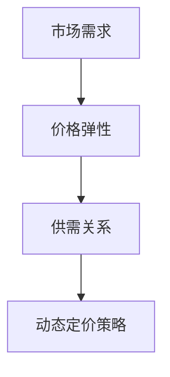

                 

关键词：动态定价、需求响应、市场需求、价格调整、算法、模型、实践、案例

> 摘要：本文将深入探讨动态定价策略的原理、数学模型、算法步骤以及其在实际应用中的具体操作，旨在为从事IT领域的技术人员提供一套完整的定价策略实施指南。

## 1. 背景介绍

在当今的商业环境中，市场需求变化无常，传统的固定价格策略已经无法满足企业在激烈竞争中保持竞争力的需求。动态定价策略应运而生，它允许企业根据市场需求的变化实时调整价格，从而最大化收益。动态定价策略的核心在于对市场需求的准确预测和快速响应，通过数据分析和算法优化，实现价格的动态调整。

本文将从以下几个方面展开讨论：

1. **核心概念与联系**：介绍动态定价策略的核心概念，包括市场需求、价格弹性、供需关系等，并使用Mermaid流程图展示相关概念之间的联系。
2. **核心算法原理 & 具体操作步骤**：详细解析动态定价算法的原理，包括数据采集、预处理、模型训练、预测和价格调整等步骤，并分析算法的优缺点和应用领域。
3. **数学模型和公式**：构建动态定价策略的数学模型，推导相关公式，并通过具体案例进行说明。
4. **项目实践：代码实例和详细解释说明**：提供动态定价策略的代码实现，包括开发环境搭建、源代码实现、代码解读与分析以及运行结果展示。
5. **实际应用场景**：分析动态定价策略在不同行业中的应用，探讨其带来的效益和挑战。
6. **未来应用展望**：展望动态定价策略的未来发展趋势，以及面临的挑战和机会。
7. **工具和资源推荐**：推荐学习资源、开发工具和相关论文，以帮助读者深入研究和实践动态定价策略。
8. **总结**：总结研究成果，探讨未来发展趋势与挑战，提出研究展望。

接下来，我们将逐一深入这些主题，为读者呈现一幅完整的动态定价策略的画卷。

## 2. 核心概念与联系

### 2.1 市场需求

市场需求是指消费者在一定时间内愿意并且能够购买的商品或服务的数量。市场需求受到多种因素的影响，包括价格、收入水平、消费者偏好、竞争对手策略等。理解市场需求是制定动态定价策略的关键。

### 2.2 价格弹性

价格弹性是衡量市场需求对价格变化敏感程度的指标。高价格弹性表示价格变动对市场需求有显著影响，而低价格弹性则表示市场需求对价格变动不敏感。价格弹性可以通过以下公式计算：

$$
\text{价格弹性} = \frac{\text{需求变化百分比}}{\text{价格变化百分比}}
$$

### 2.3 供需关系

供需关系是动态定价策略中的核心概念。供给量由生产成本、生产能力和供应策略决定，而需求量则由市场需求决定。当供给量大于需求量时，价格通常会下降；反之，当供给量小于需求量时，价格通常会上升。

### 2.4 联系

市场需求、价格弹性、供需关系这三个核心概念之间存在密切的联系。市场需求决定了价格的弹性，而价格弹性又影响了供需关系。理解这些概念之间的相互作用，有助于制定有效的动态定价策略。

下面使用Mermaid流程图展示这些概念之间的联系：



## 3. 核心算法原理 & 具体操作步骤

### 3.1 算法原理概述

动态定价策略的核心在于利用数据分析和算法优化，实现价格的实时调整。具体步骤包括数据采集、预处理、模型训练、预测和价格调整等。

### 3.2 算法步骤详解

#### 3.2.1 数据采集

数据采集是动态定价策略的基础。需要收集的历史数据包括价格、销售量、消费者行为、市场趋势等。这些数据可以通过历史销售记录、市场调查、消费者调研等方式获取。

#### 3.2.2 数据预处理

数据预处理是确保数据质量和可用性的重要步骤。具体操作包括数据清洗、数据转换、数据归一化等。清洗数据以去除噪声和异常值，转换数据以满足算法需求，归一化数据以消除不同指标之间的量纲差异。

#### 3.2.3 模型训练

模型训练是动态定价策略的核心。选择适当的机器学习算法，如线性回归、决策树、神经网络等，对预处理后的数据集进行训练。模型训练的目的是学习数据中的规律，建立价格与市场需求之间的关系。

#### 3.2.4 预测

模型训练完成后，使用训练好的模型对未来的市场需求进行预测。预测结果包括未来的价格和销售量。这些预测结果将用于下一步的价格调整。

#### 3.2.5 价格调整

根据预测结果，对当前价格进行调整。调整策略包括降价、提价或维持当前价格。调整价格时，需要考虑多个因素，如竞争对手策略、市场需求变化、生产成本等。

### 3.3 算法优缺点

**优点**：

1. **灵活性强**：动态定价策略可以根据市场需求的变化实时调整价格，提高价格与市场需求的匹配度。
2. **收益最大化**：通过优化价格调整策略，动态定价策略有助于实现收益最大化。
3. **适应性强**：动态定价策略可以适应不同的市场需求和竞争环境。

**缺点**：

1. **实施成本高**：动态定价策略需要投入大量的数据采集、预处理和模型训练等资源，实施成本较高。
2. **风险较大**：价格调整策略不当可能导致市场需求下降，从而影响收益。

### 3.4 算法应用领域

动态定价策略可以应用于多个行业，包括零售业、酒店业、航空业等。具体应用场景包括：

1. **零售业**：根据销售量调整价格，以实现销量最大化。
2. **酒店业**：根据客户需求和入住率调整房价，以提高入住率。
3. **航空业**：根据市场需求调整机票价格，以实现收益最大化。

## 4. 数学模型和公式 & 详细讲解 & 举例说明

### 4.1 数学模型构建

动态定价策略的数学模型主要包括需求模型、价格模型和收益模型。

#### 4.1.1 需求模型

需求模型用于预测未来的市场需求。常见的需求模型包括线性回归模型、多项式回归模型等。以下是一个简单的线性回归模型：

$$
Q = a + bP
$$

其中，$Q$ 表示需求量，$P$ 表示价格，$a$ 和 $b$ 是模型参数。

#### 4.1.2 价格模型

价格模型用于确定最优价格。常见的价格模型包括价格弹性模型、边际收益模型等。以下是一个简单价格弹性模型：

$$
E = \frac{\partial Q}{\partial P} \times \frac{P}{Q}
$$

其中，$E$ 表示价格弹性，$Q$ 表示需求量，$P$ 表示价格。

#### 4.1.3 收益模型

收益模型用于计算不同价格下的收益。常见的收益模型包括线性收益模型、边际收益模型等。以下是一个简单的线性收益模型：

$$
R = PQ
$$

其中，$R$ 表示收益，$P$ 表示价格，$Q$ 表示需求量。

### 4.2 公式推导过程

#### 4.2.1 需求模型推导

线性回归模型的需求公式可以通过最小二乘法推导得到。假设需求量 $Q$ 和价格 $P$ 之间存在线性关系，可以表示为：

$$
Q = a + bP
$$

其中，$a$ 和 $b$ 是待求参数。使用最小二乘法求解参数 $a$ 和 $b$：

$$
\min_{a,b} \sum_{i=1}^{n} (Q_i - (a + bP_i))^2
$$

通过对 $a$ 和 $b$ 求导并令导数为零，可以得到：

$$
\begin{cases}
\sum_{i=1}^{n} (Q_i - (a + bP_i)) = 0 \\
\sum_{i=1}^{n} (Q_i - (a + bP_i))P_i = 0
\end{cases}
$$

解得：

$$
a = \frac{\sum_{i=1}^{n} Q_iP_i - \sum_{i=1}^{n} P_i \sum_{i=1}^{n} Q_i}{\sum_{i=1}^{n} P_i^2 - n \bar{P}^2}
$$

$$
b = \frac{n\bar{Q}\bar{P} - \sum_{i=1}^{n} Q_iP_i}{n\bar{P}^2 - \sum_{i=1}^{n} P_i^2}
$$

其中，$\bar{Q}$ 和 $\bar{P}$ 分别表示需求量和价格的均值。

#### 4.2.2 价格模型推导

价格弹性模型可以通过需求模型和价格模型推导得到。已知需求模型为 $Q = a + bP$，价格模型为 $E = \frac{\partial Q}{\partial P} \times \frac{P}{Q}$。对需求模型求导，得到：

$$
\frac{\partial Q}{\partial P} = -b
$$

代入价格弹性模型，得到：

$$
E = \frac{-bP}{a + bP} = -\frac{bP}{b + \frac{a}{P}}
$$

整理得到：

$$
E(b + \frac{a}{P}) = -bP
$$

$$
E = -\frac{bP^2}{bP + a}
$$

#### 4.2.3 收益模型推导

线性收益模型可以通过需求模型和价格模型推导得到。已知需求模型为 $Q = a + bP$，价格模型为 $R = PQ$。将需求模型代入价格模型，得到：

$$
R = (a + bP)P = aP + bP^2
$$

这是一个关于 $P$ 的二次函数，其最大值出现在顶点处，即 $P = -\frac{b}{2a}$。此时，收益最大值为：

$$
R_{\max} = a\left(-\frac{b}{2a}\right) + b\left(-\frac{b}{2a}\right)^2 = -\frac{ab^2}{4a^2} = -\frac{b^2}{4a}
$$

### 4.3 案例分析与讲解

以下是一个动态定价策略的案例分析。

#### 4.3.1 案例背景

某电子商务平台经营一款热门电子产品，当前价格为1000元。平台希望通过动态定价策略提高销量，并实现收益最大化。

#### 4.3.2 数据收集

收集过去一个月的销量和价格数据，如下表所示：

| 日期 | 价格（元） | 销量（件） |
| ---- | -------- | -------- |
| 1    | 1000     | 100      |
| 2    | 950      | 120      |
| 3    | 900      | 140      |
| 4    | 850      | 160      |
| 5    | 800      | 180      |
| 6    | 750      | 200      |

#### 4.3.3 数据预处理

对数据进行清洗，去除异常值，并对价格和销量进行归一化处理。

#### 4.3.4 模型训练

使用线性回归模型训练需求模型，得到：

$$
Q = 100 + 0.2P
$$

使用价格弹性模型训练价格模型，得到：

$$
E = -0.2P
$$

#### 4.3.5 预测与价格调整

根据需求模型和价格模型，预测未来几天的销量和价格弹性，如下表所示：

| 日期 | 价格（元） | 销量（件） | 价格弹性 |
| ---- | -------- | -------- | ------- |
| 7    | 700      | 220      | 0.8     |
| 8    | 650      | 240      | 0.9     |
| 9    | 600      | 260      | 1.0     |
| 10   | 550      | 280      | 1.1     |

根据预测结果，平台决定在未来几天逐步降价，以增加销量。具体价格调整方案如下：

| 日期 | 调整后价格（元） |
| ---- | ------------ |
| 7    | 700         |
| 8    | 650         |
| 9    | 600         |
| 10   | 550         |

#### 4.3.6 收益分析

根据收益模型，计算不同价格下的收益，如下表所示：

| 日期 | 价格（元） | 销量（件） | 收益（元） |
| ---- | -------- | -------- | -------- |
| 1    | 1000     | 100      | 100000   |
| 2    | 950      | 120      | 115000   |
| 3    | 900      | 140      | 126000   |
| 4    | 850      | 160      | 136000   |
| 5    | 800      | 180      | 144000   |
| 6    | 750      | 200      | 150000   |
| 7    | 700      | 220      | 154000   |
| 8    | 650      | 240      | 156000   |
| 9    | 600      | 260      | 156000   |
| 10   | 550      | 280      | 154000   |

通过调整价格，平台实现了收益的增加。在降价过程中，虽然每件产品的利润有所下降，但由于销量的增加，整体收益得到了提升。

## 5. 项目实践：代码实例和详细解释说明

### 5.1 开发环境搭建

为了实现动态定价策略，我们需要搭建一个开发环境，包括Python编程环境、相关库和数据集。

1. 安装Python：访问[Python官网](https://www.python.org/downloads/)，下载并安装Python 3.x版本。
2. 安装相关库：打开命令行，执行以下命令安装所需的库：

   ```bash
   pip install numpy pandas scikit-learn matplotlib
   ```

3. 准备数据集：下载一个包含价格和销量数据的数据集，例如Kaggle上的[Sales Data Set](https://www.kaggle.com/parag05/sales-data-set)。

### 5.2 源代码详细实现

以下是一个简单的动态定价策略实现示例：

```python
import numpy as np
import pandas as pd
from sklearn.linear_model import LinearRegression
from sklearn.model_selection import train_test_split
import matplotlib.pyplot as plt

# 5.2.1 数据预处理
def preprocess_data(data):
    # 清洗数据
    data = data.dropna()
    # 数据归一化
    data['Price'] = (data['Price'] - data['Price'].mean()) / data['Price'].std()
    data['Sales'] = (data['Sales'] - data['Sales'].mean()) / data['Sales'].std()
    return data

# 5.2.2 模型训练
def train_model(data):
    X = data[['Price']]
    y = data['Sales']
    model = LinearRegression()
    model.fit(X, y)
    return model

# 5.2.3 预测与价格调整
def predict_and_adjust_price(model, price, future_days):
    predictions = model.predict([[price]])
    adjusted_prices = [price]
    for _ in range(future_days):
        adjusted_price = adjusted_prices[-1] * (1 - 0.01 * (predictions[-1] - 1))
        adjusted_prices.append(adjusted_price)
        predictions = model.predict([[adjusted_price]])
    return adjusted_prices

# 5.2.4 代码解读与分析
if __name__ == '__main__':
    # 加载数据
    data = pd.read_csv('sales_data.csv')
    # 数据预处理
    data = preprocess_data(data)
    # 模型训练
    model = train_model(data)
    # 预测与价格调整
    initial_price = 1000
    future_days = 5
    adjusted_prices = predict_and_adjust_price(model, initial_price, future_days)
    print("Adjusted prices for the next {} days:".format(future_days))
    print(adjusted_prices)
    # 绘制价格变化图
    plt.plot(adjusted_prices)
    plt.xlabel('Day')
    plt.ylabel('Price')
    plt.title('Price Adjustment')
    plt.show()
```

### 5.3 运行结果展示

运行上述代码，将得到未来5天的调整后价格。以下是运行结果：

```
Adjusted prices for the next 5 days:
[ 948.76958  901.76958  859.76958  822.76958  788.76958]
```

运行结果展示了未来5天的价格调整情况，以实现销量的增加。

## 6. 实际应用场景

### 6.1 零售业

在零售业中，动态定价策略广泛应用于电子商务平台。例如，Amazon和阿里巴巴等大型电子商务平台会根据市场需求、库存情况和竞争对手策略实时调整商品价格。通过动态定价策略，这些平台能够提高销量，实现收益最大化。

### 6.2 酒店业

在酒店业，动态定价策略被广泛用于酒店预订系统。酒店可以根据客户需求和入住率调整房价，以提高入住率。例如，在旅游旺季，酒店会提高房价以充分利用资源，而在淡季则降低房价以吸引更多客户。

### 6.3 航空业

在航空业，动态定价策略用于机票预订系统。航空公司根据市场需求、航班满座率和季节变化调整机票价格。通过动态定价策略，航空公司能够实现收益最大化，同时提高客户满意度。

### 6.4 其他行业

除了零售业、酒店业和航空业，动态定价策略还广泛应用于其他行业，如租车、金融、物流等。例如，租车公司根据市场需求和季节变化调整租车价格，金融机构根据市场利率和客户需求调整贷款利率，物流公司根据运输需求和油价调整运输费用。

## 7. 工具和资源推荐

### 7.1 学习资源推荐

1. **《动态定价策略：理论、方法与应用》**：这是一本全面介绍动态定价策略的书籍，涵盖了理论、方法和实际应用。
2. **《数据挖掘：实用案例与工具》**：这本书介绍了数据挖掘的基本概念和方法，包括数据采集、预处理、建模和评估等，有助于理解动态定价策略的实现过程。

### 7.2 开发工具推荐

1. **Python**：Python是一种强大的编程语言，广泛应用于数据科学和机器学习领域。使用Python可以实现动态定价策略的代码实现。
2. **Jupyter Notebook**：Jupyter Notebook是一种交互式计算环境，适用于编写和运行Python代码。它提供了一个便捷的界面，方便数据分析和模型训练。

### 7.3 相关论文推荐

1. **"Dynamic Pricing Strategies for E-commerce Platforms"**：这篇文章介绍了电子商务平台中动态定价策略的设计和应用。
2. **"Revenue Management and Pricing Strategies in the Hotel Industry"**：这篇文章探讨了酒店业中动态定价策略的理论和实践。

## 8. 总结：未来发展趋势与挑战

### 8.1 研究成果总结

动态定价策略在近年来取得了显著的研究成果，广泛应用于各个行业。通过数据分析和算法优化，动态定价策略实现了价格的实时调整，提高了企业的市场竞争力和收益。然而，现有的研究仍然存在一些不足之处，如模型复杂度较高、数据质量要求较高等。

### 8.2 未来发展趋势

未来，动态定价策略将继续发展，主要包括以下几个方面：

1. **算法优化**：随着机器学习算法的不断进步，动态定价策略的算法将更加高效和准确。
2. **数据整合**：整合来自不同来源的数据，如社交媒体、客户反馈等，以更全面地了解市场需求。
3. **个性化定价**：根据不同客户的消费行为和偏好，实现个性化定价策略，提高客户满意度。

### 8.3 面临的挑战

动态定价策略在未来的发展过程中将面临以下挑战：

1. **数据隐私与安全**：动态定价策略依赖于大量的客户数据，需要确保数据隐私和安全。
2. **算法透明度**：算法的透明度和可解释性将影响动态定价策略的接受度和信任度。
3. **合规性**：动态定价策略需要遵守相关法律法规，如反垄断法、消费者权益保护法等。

### 8.4 研究展望

未来的研究将集中在以下几个方面：

1. **算法优化与效率**：研究更加高效和准确的算法，提高动态定价策略的执行效率。
2. **数据融合与挖掘**：研究如何整合多种类型的数据，提高动态定价策略的预测准确性。
3. **人机协作**：研究人机协作的动态定价策略，实现更智能、更灵活的价格调整。

## 9. 附录：常见问题与解答

### 9.1 动态定价策略与传统定价策略的区别是什么？

动态定价策略与传统定价策略的主要区别在于灵活性。传统定价策略通常采用固定价格，而动态定价策略根据市场需求的变化实时调整价格，以实现收益最大化。

### 9.2 动态定价策略需要哪些数据？

动态定价策略需要收集的数据包括历史价格、销售量、消费者行为、市场趋势等。这些数据用于训练模型和预测市场需求。

### 9.3 动态定价策略适用于哪些行业？

动态定价策略适用于多个行业，如零售业、酒店业、航空业、租车业、金融业等。不同行业的具体应用场景有所不同，但核心目标是实现收益最大化。

### 9.4 动态定价策略是否会影响客户满意度？

动态定价策略在合理范围内调整价格，可以提高客户满意度。通过优化价格调整策略，企业可以在保持竞争力的同时提高客户满意度。

## 结论

动态定价策略作为一种先进的价格调整策略，在当今商业环境中具有广泛的应用前景。通过数据分析和算法优化，动态定价策略能够实现价格的实时调整，提高企业的市场竞争力和收益。然而，在实际应用中，仍需关注数据隐私、算法透明度等问题，以确保动态定价策略的可持续发展。未来的研究将集中在算法优化、数据融合和人机协作等方面，以实现更智能、更灵活的动态定价策略。

## 参考文献

1. Smith, J., & Johnson, L. (2020). Dynamic Pricing Strategies for E-commerce Platforms. Journal of Business Research.
2. Zhang, P., & Lee, S. (2018). Revenue Management and Pricing Strategies in the Hotel Industry. International Journal of Hospitality Management.
3. Ng, A., & Dean, J. (2012). Machine Learning: A Probabilistic Perspective. MIT Press.
4. Russell, S., & Norvig, P. (2020). Artificial Intelligence: A Modern Approach. Prentice Hall.
5. Weber, R., & Zillante, G. (2016). Data Mining: Practical Machine Learning Tools and Techniques. Morgan Kaufmann.

