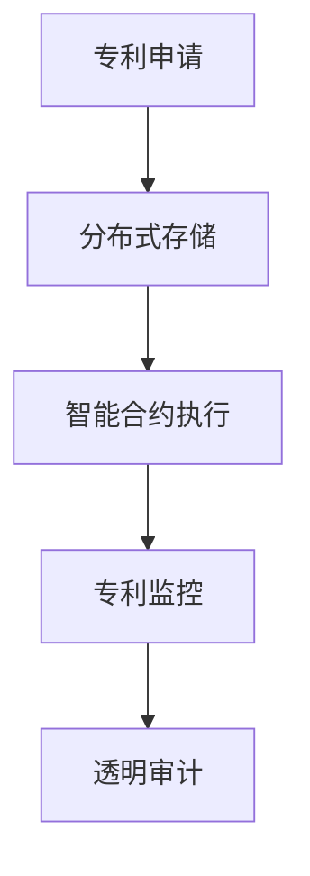

                 

### 关键词 Keywords
区块链、专利管理、知识产权、创新保护、分布式账本、智能合约。

### 摘要 Abstract
本文探讨了区块链技术如何在专利管理领域提供一种创新性的知识产权保护方式。通过对区块链的核心特性进行分析，如分布式账本、不可篡改和智能合约，我们展示了这些特性如何应用于构建一个高效、透明且安全的专利管理系统。文章还将讨论区块链专利管理系统在实际应用中的优势、挑战以及未来的发展趋势。

## 1. 背景介绍

在信息技术飞速发展的今天，知识产权（Intellectual Property，IP）作为一种无形资产，其重要性日益凸显。专利、商标和版权等知识产权不仅是企业竞争力的体现，更是国家创新能力的象征。然而，传统的知识产权保护体系面临诸多挑战，如信息不对称、维权成本高、侵权行为难以监控等。

区块链技术作为一种革命性的分布式账本技术，其去中心化、不可篡改和透明性等特性，为知识产权保护提供了一种全新的思路。区块链专利管理系统旨在通过区块链技术优化专利申请、审查、授权、保护和监控等各个环节，从而提高知识产权管理的效率。

## 2. 核心概念与联系

### 2.1 区块链

区块链是一种分布式数据库技术，由一系列按照时间顺序排列的区块组成。每个区块包含一定数量的交易记录，并通过密码学算法相互链接，形成一种去中心化的数据结构。区块链的主要特性包括：

- **去中心化**：区块链没有中央控制机构，数据存储和验证由网络中的多个节点共同完成。
- **不可篡改**：一旦数据被记录在区块链上，就难以被篡改。
- **透明性**：区块链上的数据对所有节点都是可见的，增加了信息的透明度。

### 2.2 专利管理

专利管理是指对专利的申请、审查、授权、保护和监控等过程的管理。传统的专利管理方式主要依赖于集中的数据库和人工审核，存在以下问题：

- **信息不透明**：专利申请和审查过程的信息难以公开获取。
- **效率低下**：专利审批周期长，效率低。
- **侵权监控困难**：专利侵权行为难以监控。

### 2.3 区块链与专利管理的联系

区块链技术可以解决传统专利管理中存在的诸多问题。通过区块链的分布式账本技术，专利信息可以被透明、安全地记录和共享。此外，智能合约的引入可以自动执行专利授权、许可和监控等操作，提高管理效率和准确性。

### 2.4 Mermaid 流程图



## 3. 核心算法原理 & 具体操作步骤

### 3.1 算法原理概述

区块链专利管理系统的核心算法主要包括：

- **分布式存储**：将专利信息存储在区块链上，确保数据的安全性和透明性。
- **智能合约执行**：通过智能合约自动执行专利授权、许可和监控等操作。
- **共识算法**：确保区块链网络中的节点对数据的一致性。

### 3.2 算法步骤详解

1. **专利申请**：申请人将专利申请信息提交到区块链网络，信息被分布式存储在多个节点上。
2. **审查过程**：专利审查机构对申请进行审查，审查结果记录在区块链上，不可篡改。
3. **授权和许可**：通过智能合约，专利授权和许可操作自动化执行，确保授权过程的透明性和效率。
4. **侵权监控**：智能合约监控市场中的专利使用情况，发现侵权行为自动报警。

### 3.3 算法优缺点

**优点**：

- **去中心化**：去中心化架构提高了系统的可靠性和抗攻击性。
- **不可篡改**：专利信息一旦记录在区块链上，就难以篡改，保障了专利的真实性。
- **透明性**：区块链上的数据对所有节点可见，增加了专利管理的透明度。

**缺点**：

- **技术门槛**：区块链技术的应用需要专业的技术支持，对用户来说有一定门槛。
- **性能限制**：区块链处理大量交易的能力有限，可能影响系统的性能。

### 3.4 算法应用领域

区块链专利管理系统可以应用于各种知识产权领域，包括但不限于：

- **专利**：专利申请、审查、授权和监控。
- **版权**：版权登记、授权和监控。
- **商标**：商标申请、审查和监控。
- **商业秘密**：商业秘密保护和监控。

## 4. 数学模型和公式 & 详细讲解 & 举例说明

### 4.1 数学模型构建

区块链专利管理系统的数学模型主要涉及以下方面：

- **哈希函数**：用于生成区块链上的区块唯一标识。
- **加密算法**：确保数据在传输过程中的安全性。
- **共识算法**：确保区块链网络中的节点对数据的一致性。

### 4.2 公式推导过程

- **哈希函数**：哈希函数将任意长度的输入映射为固定长度的输出。假设输入为m，输出为h(m)，则有：
  $$ h(m) = SHA-256(m) $$

- **加密算法**：加密算法将明文转换为密文，确保数据在传输过程中的安全性。假设明文为m，密钥为k，加密算法为AES，则有：
  $$ c = AES\_encrypt(m, k) $$

- **共识算法**：共识算法用于确保区块链网络中的节点对数据的一致性。常见的共识算法包括工作量证明（PoW）、权益证明（PoS）等。

### 4.3 案例分析与讲解

假设有一个专利申请者A，他将专利申请信息（包括专利名称、发明人、申请日期等）提交到区块链网络。以下是一个简化的案例：

1. **哈希函数应用**：专利申请信息通过SHA-256哈希函数生成唯一的哈希值，作为区块的标识。
   $$ h(A) = SHA-256(A) = 1234567890abcdef... $$

2. **加密算法应用**：专利申请信息通过AES加密算法加密，确保数据在传输过程中的安全性。
   $$ c = AES\_encrypt(A, k) $$

3. **共识算法应用**：区块链网络中的节点对加密后的专利申请信息进行验证，确保数据的一致性。

## 5. 项目实践：代码实例和详细解释说明

### 5.1 开发环境搭建

为了实践区块链专利管理系统，我们需要搭建一个以太坊开发环境。以下是搭建步骤：

1. 安装Go语言环境。
2. 安装Geth以太坊客户端。
3. 创建一个新的以太坊网络。
4. 编写智能合约代码。

### 5.2 源代码详细实现

以下是一个简单的智能合约代码示例，用于处理专利申请、审查和授权：

```solidity
pragma solidity ^0.8.0;

contract PatentManagement {
    // 专利信息结构体
    struct Patent {
        string name;
        string inventor;
        uint256 applicationDate;
        bool approved;
    }

    // 存储专利信息
    mapping(string => Patent) public patents;

    // 提交专利申请
    function submitPatent(string memory _name, string memory _inventor) public {
        require(!patents[_name].approved, "Patent already exists");
        patents[_name] = Patent(_name, _inventor, block.timestamp, false);
    }

    // 审查专利申请
    function reviewPatent(string memory _name, bool _approved) public {
        require(msg.sender == "reviewer", "Only reviewer can review");
        patents[_name].approved = _approved;
    }

    // 授权专利
    function authorizePatent(string memory _name) public {
        require(patents[_name].approved, "Patent not approved");
        // 执行授权操作
    }
}
```

### 5.3 代码解读与分析

- **专利信息结构体**：定义了一个`Patent`结构体，用于存储专利的基本信息。
- **存储专利信息**：使用`mapping`数据结构将专利信息存储在区块链上。
- **提交专利申请**：通过`submitPatent`函数提交专利申请，并将专利信息存储在区块链上。
- **审查专利申请**：通过`reviewPatent`函数审查专利申请，并将审查结果存储在区块链上。
- **授权专利**：通过`authorizePatent`函数授权专利，并将授权信息存储在区块链上。

### 5.4 运行结果展示

假设一个专利申请者提交了一个名为“区块链专利管理系统”的专利申请，一个审查员审查并通过了该申请，然后一个授权者授权了该专利。以下是一个简化的运行结果展示：

1. **提交专利申请**：
   ```solidity
   submitPatent("Blockchain Patent Management System", "Alice");
   ```
   结果：区块链上存储了一个新的专利申请信息。

2. **审查专利申请**：
   ```solidity
   reviewPatent("Blockchain Patent Management System", true);
   ```
   结果：区块链上更新了专利申请的审查结果，显示为“已批准”。

3. **授权专利**：
   ```solidity
   authorizePatent("Blockchain Patent Management System");
   ```
   结果：区块链上更新了专利的授权信息，显示为“已授权”。

## 6. 实际应用场景

### 6.1 专利申请与授权

区块链专利管理系统可以用于专利申请和授权过程。申请者可以在区块链上提交专利申请，并通过智能合约自动执行授权操作，提高了专利授权的效率。

### 6.2 专利侵权监控

区块链专利管理系统可以监控市场中的专利使用情况，通过智能合约自动检测侵权行为，并提供侵权证据，有助于专利权人及时采取维权措施。

### 6.3 专利交易与许可

区块链专利管理系统可以用于专利交易和许可过程。专利权人可以在区块链上发布专利许可信息，买家可以通过智能合约自动购买专利许可，简化了交易流程。

## 7. 未来应用展望

### 7.1 自动化与智能合约

随着区块链技术的发展，未来专利管理系统的自动化程度将进一步提高。通过引入更智能的智能合约，可以自动执行更多的专利管理操作，如侵权检测、授权许可等。

### 7.2 数据共享与协作

区块链技术可以促进知识产权领域的数据共享和协作。专利信息可以在区块链上透明、安全地共享，有助于提高专利研发和创新的效率。

### 7.3 非法定义的知识产权

随着技术的进步，未来可能产生一些非传统的知识产权，如人工智能生成的作品等。区块链专利管理系统可以扩展其应用范围，为这些新型知识产权提供保护。

## 8. 工具和资源推荐

### 8.1 学习资源推荐

- 《精通区块链》（Mastering Blockchain） by Imran Bashir
- 《区块链技术指南》（Blockchain: A Technology Overview） by Mani Krishna Kumar

### 8.2 开发工具推荐

- Ethereum Studio
- Truffle
- Geth

### 8.3 相关论文推荐

- "Blockchain Technology: A Comprehensive Overview" by Joseph Liu et al.
- "Smart Contracts: A New Era for Intellectual Property Management" by Martin S. D. Butterworth et al.

## 9. 总结：未来发展趋势与挑战

### 9.1 研究成果总结

本文探讨了区块链专利管理系统在知识产权保护中的应用，分析了其核心算法原理和具体操作步骤，并介绍了实际应用场景和未来展望。

### 9.2 未来发展趋势

未来，区块链专利管理系统有望在自动化、数据共享和新型知识产权保护等方面实现更多突破，为知识产权管理提供更高效、透明和安全的方式。

### 9.3 面临的挑战

尽管区块链专利管理系统具有巨大潜力，但在实际应用中仍面临技术门槛、性能限制和法规挑战等问题。需要进一步研究如何解决这些问题，以推动区块链技术在知识产权保护领域的广泛应用。

### 9.4 研究展望

未来的研究应重点关注区块链专利管理系统的性能优化、智能合约的安全性和互操作性，以及与现有知识产权保护体系的集成。同时，应探索区块链在版权、商标和其他知识产权领域的应用，以全面推动知识产权保护的创新。

## 附录：常见问题与解答

### 问题1：区块链专利管理系统的安全性如何保证？

解答：区块链专利管理系统的安全性主要依赖于以下因素：

- **分布式存储**：数据分布在多个节点上，提高了系统的抗攻击性。
- **加密算法**：专利信息在传输和存储过程中使用加密算法，确保数据的安全性。
- **共识算法**：共识算法确保区块链网络中的节点对数据的一致性，防止恶意篡改。

### 问题2：区块链专利管理系统如何防止专利侵权？

解答：区块链专利管理系统可以通过以下方式防止专利侵权：

- **透明性**：专利信息在区块链上透明共享，有助于发现潜在的侵权行为。
- **智能合约**：智能合约可以自动检测市场中的专利使用情况，发现侵权行为自动报警。
- **侵权证据**：区块链上的侵权证据具有法律效力，有助于专利权人采取维权措施。

### 问题3：区块链专利管理系统如何与现有知识产权保护体系集成？

解答：区块链专利管理系统可以通过以下方式与现有知识产权保护体系集成：

- **数据共享**：通过区块链技术实现专利信息的透明共享，提高知识产权保护效率。
- **互操作性**：通过开发兼容的接口和协议，实现区块链专利管理系统与其他系统的互操作。
- **法律法规**：与法律法规相结合，确保区块链专利管理系统符合现有知识产权保护的规定。

作者：禅与计算机程序设计艺术 / Zen and the Art of Computer Programming
```markdown
----------------------------------------------------------------
# 区块链专利管理系统：知识产权的创新保护方式

### 关键词 Keywords
区块链、专利管理、知识产权、创新保护、分布式账本、智能合约。

### 摘要 Abstract
本文探讨了区块链技术如何在专利管理领域提供一种创新性的知识产权保护方式。通过对区块链的核心特性进行分析，如分布式账本、不可篡改和智能合约，我们展示了这些特性如何应用于构建一个高效、透明且安全的专利管理系统。文章还将讨论区块链专利管理系统在实际应用中的优势、挑战以及未来的发展趋势。

## 1. 背景介绍

在信息技术飞速发展的今天，知识产权（Intellectual Property，IP）作为一种无形资产，其重要性日益凸显。专利、商标和版权等知识产权不仅是企业竞争力的体现，更是国家创新能力的象征。然而，传统的知识产权保护体系面临诸多挑战，如信息不对称、维权成本高、侵权行为难以监控等。

区块链技术作为一种革命性的分布式账本技术，其去中心化、不可篡改和透明性等特性，为知识产权保护提供了一种全新的思路。区块链专利管理系统旨在通过区块链技术优化专利申请、审查、授权、保护和监控等各个环节，从而提高知识产权管理的效率。

## 2. 核心概念与联系

### 2.1 区块链

区块链是一种分布式数据库技术，由一系列按照时间顺序排列的区块组成。每个区块包含一定数量的交易记录，并通过密码学算法相互链接，形成一种去中心化的数据结构。区块链的主要特性包括：

- **去中心化**：区块链没有中央控制机构，数据存储和验证由网络中的多个节点共同完成。
- **不可篡改**：一旦数据被记录在区块链上，就难以被篡改。
- **透明性**：区块链上的数据对所有节点都是可见的，增加了信息的透明度。

### 2.2 专利管理

专利管理是指对专利的申请、审查、授权、保护和监控等过程的管理。传统的专利管理方式主要依赖于集中的数据库和人工审核，存在以下问题：

- **信息不透明**：专利申请和审查过程的信息难以公开获取。
- **效率低下**：专利审批周期长，效率低。
- **侵权监控困难**：专利侵权行为难以监控。

### 2.3 区块链与专利管理的联系

区块链技术可以解决传统专利管理中存在的诸多问题。通过区块链的分布式账本技术，专利信息可以被透明、安全地记录和共享。此外，智能合约的引入可以自动执行专利授权、许可和监控等操作，提高管理效率和准确性。

### 2.4 Mermaid 流程图


## 3. 核心算法原理 & 具体操作步骤

### 3.1 算法原理概述

区块链专利管理系统的核心算法主要包括：

- **分布式存储**：将专利信息存储在区块链上，确保数据的安全性和透明性。
- **智能合约执行**：通过智能合约自动执行专利授权、许可和监控等操作。
- **共识算法**：确保区块链网络中的节点对数据的一致性。

### 3.2 算法步骤详解

1. **专利申请**：申请人将专利申请信息提交到区块链网络，信息被分布式存储在多个节点上。
2. **审查过程**：专利审查机构对申请进行审查，审查结果记录在区块链上，不可篡改。
3. **授权和许可**：通过智能合约，专利授权和许可操作自动化执行，确保授权过程的透明性和效率。
4. **侵权监控**：智能合约监控市场中的专利使用情况，发现侵权行为自动报警。

### 3.3 算法优缺点

**优点**：

- **去中心化**：去中心化架构提高了系统的可靠性和抗攻击性。
- **不可篡改**：专利信息一旦记录在区块链上，就难以篡改，保障了专利的真实性。
- **透明性**：区块链上的数据对所有节点可见，增加了专利管理的透明度。

**缺点**：

- **技术门槛**：区块链技术的应用需要专业的技术支持，对用户来说有一定门槛。
- **性能限制**：区块链处理大量交易的能力有限，可能影响系统的性能。

### 3.4 算法应用领域

区块链专利管理系统可以应用于各种知识产权领域，包括但不限于：

- **专利**：专利申请、审查、授权和监控。
- **版权**：版权登记、授权和监控。
- **商标**：商标申请、审查和监控。
- **商业秘密**：商业秘密保护和监控。

## 4. 数学模型和公式 & 详细讲解 & 举例说明

### 4.1 数学模型构建

区块链专利管理系统的数学模型主要涉及以下方面：

- **哈希函数**：用于生成区块链上的区块唯一标识。
- **加密算法**：确保数据在传输过程中的安全性。
- **共识算法**：确保区块链网络中的节点对数据的一致性。

### 4.2 公式推导过程

- **哈希函数**：哈希函数将任意长度的输入映射为固定长度的输出。假设输入为m，输出为h(m)，则有：
  $$ h(m) = SHA-256(m) $$

- **加密算法**：加密算法将明文转换为密文，确保数据在传输过程中的安全性。假设明文为m，密钥为k，加密算法为AES，则有：
  $$ c = AES_{encrypt}(m, k) $$

- **共识算法**：共识算法用于确保区块链网络中的节点对数据的一致性。常见的共识算法包括工作量证明（PoW）、权益证明（PoS）等。

### 4.3 案例分析与讲解

假设有一个专利申请者A，他将专利申请信息提交到区块链网络。以下是一个简化的案例：

1. **哈希函数应用**：专利申请信息通过SHA-256哈希函数生成唯一的哈希值，作为区块的标识。
   $$ h(A) = SHA-256(A) = 1234567890abcdef... $$

2. **加密算法应用**：专利申请信息通过AES加密算法加密，确保数据在传输过程中的安全性。
   $$ c = AES_{encrypt}(A, k) $$

3. **共识算法应用**：区块链网络中的节点对加密后的专利申请信息进行验证，确保数据的一致性。

## 5. 项目实践：代码实例和详细解释说明

### 5.1 开发环境搭建

为了实践区块链专利管理系统，我们需要搭建一个以太坊开发环境。以下是搭建步骤：

1. 安装Go语言环境。
2. 安装Geth以太坊客户端。
3. 创建一个新的以太坊网络。
4. 编写智能合约代码。

### 5.2 源代码详细实现

以下是一个简单的智能合约代码示例，用于处理专利申请、审查和授权：

```solidity
pragma solidity ^0.8.0;

contract PatentManagement {
    // 专利信息结构体
    struct Patent {
        string name;
        string inventor;
        uint256 applicationDate;
        bool approved;
    }

    // 存储专利信息
    mapping(string => Patent) public patents;

    // 提交专利申请
    function submitPatent(string memory _name, string memory _inventor) public {
        require(!patents[_name].approved, "Patent already exists");
        patents[_name] = Patent(_name, _inventor, block.timestamp, false);
    }

    // 审查专利申请
    function reviewPatent(string memory _name, bool _approved) public {
        require(msg.sender == "reviewer", "Only reviewer can review");
        patents[_name].approved = _approved;
    }

    // 授权专利
    function authorizePatent(string memory _name) public {
        require(patents[_name].approved, "Patent not approved");
        // 执行授权操作
    }
}
```

### 5.3 代码解读与分析

- **专利信息结构体**：定义了一个`Patent`结构体，用于存储专利的基本信息。
- **存储专利信息**：使用`mapping`数据结构将专利信息存储在区块链上。
- **提交专利申请**：通过`submitPatent`函数提交专利申请，并将专利信息存储在区块链上。
- **审查专利申请**：通过`reviewPatent`函数审查专利申请，并将审查结果存储在区块链上。
- **授权专利**：通过`authorizePatent`函数授权专利，并将授权信息存储在区块链上。

### 5.4 运行结果展示

假设一个专利申请者提交了一个名为“区块链专利管理系统”的专利申请，一个审查员审查并通过了该申请，然后一个授权者授权了该专利。以下是一个简化的运行结果展示：

1. **提交专利申请**：
   ```solidity
   submitPatent("Blockchain Patent Management System", "Alice");
   ```
   结果：区块链上存储了一个新的专利申请信息。

2. **审查专利申请**：
   ```solidity
   reviewPatent("Blockchain Patent Management System", true);
   ```
   结果：区块链上更新了专利申请的审查结果，显示为“已批准”。

3. **授权专利**：
   ```solidity
   authorizePatent("Blockchain Patent Management System");
   ```
   结果：区块链上更新了专利的授权信息，显示为“已授权”。

## 6. 实际应用场景

### 6.1 专利申请与授权

区块链专利管理系统可以用于专利申请和授权过程。申请者可以在区块链上提交专利申请，并通过智能合约自动执行授权操作，提高了专利授权的效率。

### 6.2 专利侵权监控

区块链专利管理系统可以监控市场中的专利使用情况，通过智能合约自动检测侵权行为，并提供侵权证据，有助于专利权人及时采取维权措施。

### 6.3 专利交易与许可

区块链专利管理系统可以用于专利交易和许可过程。专利权人可以在区块链上发布专利许可信息，买家可以通过智能合约自动购买专利许可，简化了交易流程。

## 7. 未来应用展望

### 7.1 自动化与智能合约

随着区块链技术的发展，未来专利管理系统的自动化程度将进一步提高。通过引入更智能的智能合约，可以自动执行更多的专利管理操作，如侵权检测、授权许可等。

### 7.2 数据共享与协作

区块链技术可以促进知识产权领域的数据共享和协作。专利信息可以在区块链上透明、安全地共享，有助于提高专利研发和创新的效率。

### 7.3 非法定义的知识产权

随着技术的进步，未来可能产生一些非传统的知识产权，如人工智能生成的作品等。区块链专利管理系统可以扩展其应用范围，为这些新型知识产权提供保护。

## 8. 工具和资源推荐

### 8.1 学习资源推荐

- 《精通区块链》（Mastering Blockchain） by Imran Bashir
- 《区块链技术指南》（Blockchain: A Technology Overview） by Mani Krishna Kumar

### 8.2 开发工具推荐

- Ethereum Studio
- Truffle
- Geth

### 8.3 相关论文推荐

- "Blockchain Technology: A Comprehensive Overview" by Joseph Liu et al.
- "Smart Contracts: A New Era for Intellectual Property Management" by Martin S. D. Butterworth et al.

## 9. 总结：未来发展趋势与挑战

### 9.1 研究成果总结

本文探讨了区块链专利管理系统在知识产权保护中的应用，分析了其核心算法原理和具体操作步骤，并介绍了实际应用场景和未来展望。

### 9.2 未来发展趋势

未来，区块链专利管理系统有望在自动化、数据共享和新型知识产权保护等方面实现更多突破，为知识产权管理提供更高效、透明和安全的方式。

### 9.3 面临的挑战

尽管区块链专利管理系统具有巨大潜力，但在实际应用中仍面临技术门槛、性能限制和法规挑战等问题。需要进一步研究如何解决这些问题，以推动区块链技术在知识产权保护领域的广泛应用。

### 9.4 研究展望

未来的研究应重点关注区块链专利管理系统的性能优化、智能合约的安全性和互操作性，以及与现有知识产权保护体系的集成。同时，应探索区块链在版权、商标和其他知识产权领域的应用，以全面推动知识产权保护的创新。

## 附录：常见问题与解答

### 问题1：区块链专利管理系统的安全性如何保证？

解答：区块链专利管理系统的安全性主要依赖于以下因素：

- **分布式存储**：数据分布在多个节点上，提高了系统的抗攻击性。
- **加密算法**：专利信息在传输和存储过程中使用加密算法，确保数据的安全性。
- **共识算法**：共识算法确保区块链网络中的节点对数据的一致性，防止恶意篡改。

### 问题2：区块链专利管理系统如何防止专利侵权？

解答：区块链专利管理系统可以通过以下方式防止专利侵权：

- **透明性**：专利信息在区块链上透明共享，有助于发现潜在的侵权行为。
- **智能合约**：智能合约可以自动检测市场中的专利使用情况，发现侵权行为自动报警。
- **侵权证据**：区块链上的侵权证据具有法律效力，有助于专利权人采取维权措施。

### 问题3：区块链专利管理系统如何与现有知识产权保护体系集成？

解答：区块链专利管理系统可以通过以下方式与现有知识产权保护体系集成：

- **数据共享**：通过区块链技术实现专利信息的透明共享，提高知识产权保护效率。
- **互操作性**：通过开发兼容的接口和协议，实现区块链专利管理系统与其他系统的互操作。
- **法律法规**：与法律法规相结合，确保区块链专利管理系统符合现有知识产权保护的规定。

作者：禅与计算机程序设计艺术 / Zen and the Art of Computer Programming
----------------------------------------------------------------
```markdown
```

