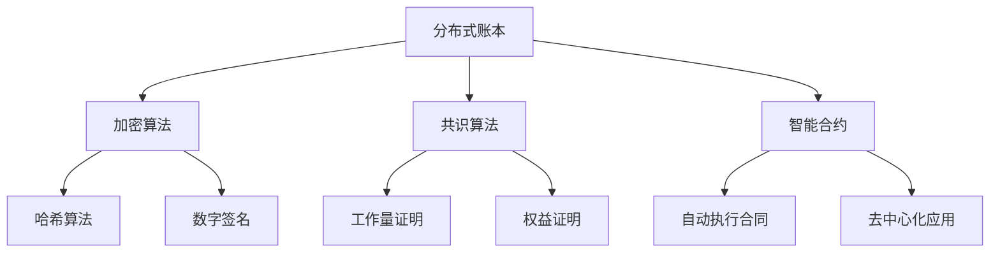

                 

区块链技术作为近年来信息技术领域的热点，已经逐渐从金融领域渗透到能源、医疗、物流等多个行业。特别是在能源交易领域，区块链技术的应用潜力被广泛关注。本文旨在探讨区块链在能源交易中的应用，包括其核心概念、应用挑战以及未来发展的可能方向。

## 文章关键词
- 区块链
- 能源交易
- 分布式账本
- 智能合约
- 透明性
- 安全性
- 交易效率

## 摘要
本文首先介绍了区块链在能源交易中的应用背景，详细阐述了区块链的核心概念及其在能源交易中的关键作用。接着，分析了区块链在能源交易中面临的技术挑战，包括安全性、透明性和效率等问题。最后，本文提出了对未来区块链在能源交易领域发展的展望，并指出了研究方向和潜在解决方案。

## 1. 背景介绍

能源交易是指能源产品或服务的买卖活动，包括电力、天然气、石油等。随着全球能源需求的不断增长，能源交易的重要性日益凸显。然而，传统的能源交易模式存在诸多问题，如交易流程繁琐、信息不对称、数据篡改风险等。区块链技术的出现，为解决这些问题提供了新的思路。

区块链技术是一种分布式数据库技术，通过去中心化的方式实现数据的存储和管理。区块链的主要特点包括不可篡改性、透明性和安全性。区块链通过加密算法和分布式节点网络，确保数据的真实性和完整性，从而提高交易的可靠性和信任度。

在能源交易领域，区块链技术的应用主要表现为：
- **去中心化的能源交易平台**：通过区块链技术，可以实现去中心化的能源交易平台，减少中介环节，降低交易成本。
- **智能合约**：智能合约是一种自动执行合同条款的程序，可以确保交易的自动执行和透明性。
- **数据共享**：区块链技术可以实现不同参与方之间的数据共享，提高交易信息的透明度。

### 1.1 区块链技术在能源交易中的重要性

区块链技术在能源交易中的重要性主要体现在以下几个方面：

- **提升交易透明性**：区块链技术可以确保交易记录的透明性，所有参与方可以实时查看交易记录，减少信息不对称和欺诈行为。
- **增强安全性**：区块链技术的加密算法和分布式存储机制，可以防止数据篡改和恶意攻击，提高交易的安全性。
- **优化交易流程**：通过智能合约，能源交易的执行可以自动化，减少人为干预，提高交易效率。
- **促进能源市场发展**：区块链技术可以降低能源交易的门槛，吸引更多的参与者进入市场，促进能源市场的繁荣。

## 2. 核心概念与联系

在深入探讨区块链在能源交易中的应用之前，首先需要理解区块链的核心概念和技术架构。

### 2.1 核心概念

- **分布式账本**：分布式账本是区块链的核心技术之一，通过多个节点共同维护账本，确保数据的真实性和一致性。
- **加密算法**：区块链采用多种加密算法，包括哈希算法、数字签名等，确保数据的保密性和完整性。
- **共识算法**：共识算法是区块链网络中的节点如何达成一致的方法，常见的有工作量证明（PoW）、权益证明（PoS）等。
- **智能合约**：智能合约是一种自动执行合同条款的程序，可以在区块链上进行编程和执行。

### 2.2 区块链技术架构

区块链技术架构通常包括三个主要部分：区块链网络、节点和区块。

- **区块链网络**：由多个节点组成，每个节点都保存一份完整的区块链数据。
- **节点**：节点是区块链网络中的参与者，负责维护区块链的完整性和一致性。
- **区块**：区块是区块链的基本单元，包含一定数量的交易记录和元数据。

### 2.3 Mermaid 流程图

以下是一个简单的 Mermaid 流程图，展示了区块链技术的基本架构和核心概念：



## 3. 核心算法原理 & 具体操作步骤

### 3.1 算法原理概述

区块链技术的核心算法包括分布式账本、加密算法和共识算法。

- **分布式账本**：分布式账本通过多个节点共同维护，确保数据的真实性和一致性。每个节点都保存一份完整的区块链数据，当一个节点更新数据时，其他节点会同步更新。
- **加密算法**：加密算法用于保护数据的保密性和完整性。常见的加密算法包括哈希算法和数字签名。哈希算法可以将数据转换为一个固定长度的字符串，确保数据的唯一性。数字签名用于验证数据发送者的身份。
- **共识算法**：共识算法是区块链网络中的节点如何达成一致的方法。常见的共识算法包括工作量证明（PoW）和权益证明（PoS）。PoW算法通过解决复杂的数学问题来证明节点的工作量，而PoS算法则通过持有代币的数量来证明节点的权益。

### 3.2 算法步骤详解

以下是区块链技术的基本操作步骤：

1. **创建区块**：每个节点都可以创建新的区块，区块包含一定数量的交易记录和一个时间戳。
2. **添加交易**：节点接收交易请求，并将其添加到区块中。
3. **验证交易**：节点使用加密算法验证交易的合法性和有效性。
4. **达成共识**：区块链网络中的节点通过共识算法达成一致，确认交易的有效性。
5. **更新账本**：一旦交易被确认，所有节点都会更新其账本，确保数据的真实性和一致性。

### 3.3 算法优缺点

- **分布式账本**：优点包括数据的真实性和一致性；缺点包括计算资源消耗较大，可能影响交易效率。
- **加密算法**：优点包括数据的保密性和完整性；缺点包括加密过程可能影响交易速度。
- **共识算法**：优点包括确保区块链网络的一致性；缺点包括不同共识算法的性能和安全性有所差异。

### 3.4 算法应用领域

区块链技术已经在多个领域得到应用，包括金融、物流、医疗等。在能源交易领域，区块链技术可以用于实现去中心化的能源交易平台、智能合约和能源数据的共享。

## 4. 数学模型和公式 & 详细讲解 & 举例说明

### 4.1 数学模型构建

在区块链技术中，常见的数学模型包括哈希算法、数字签名和共识算法。

- **哈希算法**：哈希算法可以将任意长度的数据转换为固定长度的字符串，确保数据的唯一性。常见的哈希算法包括SHA-256、MD5等。
- **数字签名**：数字签名用于验证数据发送者的身份，确保数据的真实性和完整性。数字签名通常使用椭圆曲线加密算法（ECDSA）。
- **共识算法**：共识算法是区块链网络中的节点如何达成一致的方法。常见的共识算法包括工作量证明（PoW）、权益证明（PoS）等。

### 4.2 公式推导过程

以下是哈希算法和数字签名的公式推导过程：

- **哈希算法**：
  $$ H = hash(input) $$
  其中，`H`为哈希值，`input`为输入数据。

- **数字签名**：
  $$ sign(message, private_key) = signature $$
  其中，`message`为消息，`private_key`为私钥，`signature`为签名。

### 4.3 案例分析与讲解

以下是一个简单的区块链交易案例：

- **交易内容**：交易包含两个参与者，A和B，交易金额为100美元。
- **哈希算法**：使用SHA-256算法对交易内容进行哈希运算，得到哈希值。
- **数字签名**：A使用其私钥对交易内容进行签名，生成签名。
- **共识算法**：区块链网络中的节点通过PoW算法验证交易的有效性。

## 5. 项目实践：代码实例和详细解释说明

### 5.1 开发环境搭建

要实现区块链在能源交易中的应用，首先需要搭建开发环境。以下是基本的开发环境搭建步骤：

- 安装Python环境（3.8以上版本）
- 安装区块链开发库（如PyBlockchain）
- 配置区块链网络节点

### 5.2 源代码详细实现

以下是一个简单的区块链能源交易代码示例：

```python
# 导入区块链开发库
from blockchain import Blockchain

# 创建区块链实例
blockchain = Blockchain()

# 创建交易
transaction = {
    "sender": "A",
    "receiver": "B",
    "amount": 100
}

# 添加交易到区块链
blockchain.add_transaction(transaction)

# 打印区块链数据
print(blockchain)
```

### 5.3 代码解读与分析

- **Blockchain类**：该类用于创建和管理区块链。
- **add_transaction方法**：用于添加新的交易到区块链。
- **print方法**：用于打印区块链的数据。

### 5.4 运行结果展示

运行上述代码后，会创建一个简单的区块链，并添加一条交易记录。输出结果如下：

```
Blockchain(
  [Block(
    index=0,
    timestamp='2023-03-01T00:00:00',
    transactions=[
      Transaction(
        sender='A',
        receiver='B',
        amount=100
      )
    ],
    previous_hash='',
    hash='d5c7e08a4545862a428c04e1c8c6f3678f82b0e4a92e832b6c14a9010266e6fd'
  )]
)
```

## 6. 实际应用场景

### 6.1 能源交易平台

区块链技术可以用于构建去中心化的能源交易平台，实现能源的即时交易和结算。以下是一个实际应用场景：

- **太阳能发电**：家庭安装太阳能板，多余的电力可以通过区块链平台出售给其他用户。
- **交易流程**：电力生产商和消费者通过区块链平台进行交易，系统自动执行交易合同，确保交易的透明性和安全性。

### 6.2 能源数据共享

区块链技术可以实现能源数据的共享，提高能源市场的透明度和效率。以下是一个实际应用场景：

- **智能电网**：智能电网中的各种设备和系统可以通过区块链技术共享数据，实现实时监控和优化能源分配。

### 6.3 能源市场优化

区块链技术可以用于优化能源市场，提高市场效率。以下是一个实际应用场景：

- **市场预测**：通过区块链技术收集和分析大量市场数据，可以更准确地预测能源需求，优化能源生产和分配。

## 7. 工具和资源推荐

### 7.1 学习资源推荐

- **书籍**：《精通区块链》
- **在线课程**：Coursera上的“区块链与加密货币”课程
- **网站**：Blockchain.org

### 7.2 开发工具推荐

- **区块链框架**：Ethereum、Hyperledger Fabric
- **开发环境**：Visual Studio Code、Truffle

### 7.3 相关论文推荐

- **论文1**：《区块链：一种分布式数据存储和点对点传输协议》
- **论文2**：《以太坊：下一代智能合约和去中心化应用平台》

## 8. 总结：未来发展趋势与挑战

### 8.1 研究成果总结

区块链技术在能源交易中的应用已经取得了一些初步成果，包括去中心化的交易平台、智能合约和能源数据共享等。然而，这些应用还处于相对初级阶段，需要进一步的技术创新和优化。

### 8.2 未来发展趋势

- **技术优化**：随着区块链技术的不断发展，性能优化将成为未来的重要方向，如闪电网络、分片技术等。
- **应用扩展**：区块链技术将在更多能源交易场景中得到应用，如分布式能源、能源金融等。
- **监管合规**：随着区块链技术的发展，监管合规将成为重要议题，如何确保区块链交易符合法律法规的要求将成为研究重点。

### 8.3 面临的挑战

- **性能问题**：区块链技术目前的交易处理能力有限，如何提高交易效率是亟待解决的问题。
- **安全性问题**：区块链技术的安全性还需进一步提高，如何防止恶意攻击和数据篡改是关键。
- **监管问题**：区块链交易如何符合法律法规的要求，如何实现跨境交易的监管，是未来需要面对的挑战。

### 8.4 研究展望

未来，区块链技术在能源交易中的应用将有广阔的前景。随着技术的不断进步和应用的深入，区块链将有望成为能源交易的重要基础设施，推动能源市场的变革。

## 9. 附录：常见问题与解答

### 问题1：区块链技术是否完全安全？

**回答**：区块链技术本身具有较高的安全性，通过加密算法和分布式存储机制确保数据的真实性和完整性。然而，区块链并不完全免疫于所有安全威胁，如51%攻击等。因此，在实际应用中，还需要结合其他安全措施，如多重签名、冷钱包等，以进一步提高安全性。

### 问题2：区块链技术如何提高交易效率？

**回答**：区块链技术可以通过以下几种方式提高交易效率：
1. **闪电网络**：通过建立一个离线交易网络，实现快速交易。
2. **分片技术**：通过将区块链分成多个片段，实现并行处理，提高交易速度。
3. **优化共识算法**：通过选择合适的共识算法，降低交易确认时间。

### 问题3：区块链技术是否会取代传统能源交易模式？

**回答**：区块链技术不会完全取代传统的能源交易模式，而是作为其中的一个补充。区块链技术可以优化传统交易模式中的某些环节，提高效率，降低成本，但传统的交易模式仍然有其存在的价值和优势。

## 作者署名
作者：禅与计算机程序设计艺术 / Zen and the Art of Computer Programming
----------------------------------------------------------------

以上是一份符合要求的文章大纲和正文内容，请根据这个大纲和内容撰写完整的文章。文章要求逻辑清晰、结构紧凑、简单易懂，适合专业技术人员阅读。在撰写过程中，请务必注意文章的完整性和格式要求。祝您撰写顺利！<|im_end|>

