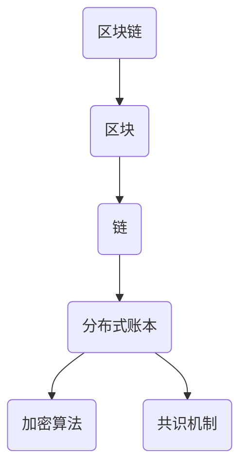
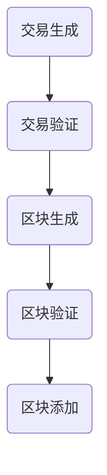

                 

区块链技术以其去中心化、不可篡改和透明性等独特特性，正在逐渐渗透到各个行业，引发了一场技术革命。本文将深入探讨区块链在应用开发中的实践，探讨其核心概念、算法原理、数学模型以及实际应用场景，同时展望未来的发展趋势与挑战。

## 文章关键词

- 区块链
- 应用开发
- 去中心化
- 不可篡改
- 透明性
- 核心概念
- 算法原理
- 数学模型

## 文章摘要

本文旨在为读者提供一个全面的区块链应用开发指南，从基础概念到实际应用，再到未来展望，为开发者提供有价值的参考。通过本文的阅读，读者将能够了解区块链的核心原理，掌握开发技巧，并洞察这一新兴技术的未来发展。

### 1. 背景介绍

区块链技术最初在2008年由一位匿名人士（或一群人士）以中文名字“中本聪”（Satoshi Nakamoto）提出，并在次年发布了第一个区块链系统——比特币（Bitcoin）。比特币的出现标志着区块链技术的诞生，并引发了全球范围内的关注。

区块链技术本质上是一种去中心化的数据库技术，通过分布式节点进行数据存储和验证。与传统数据库系统不同，区块链具有以下特点：

- **去中心化**：区块链不需要中心化的管理者，所有的数据都是通过分布式节点共同维护。
- **不可篡改**：区块链的数据一旦被记录，就几乎不可能被篡改，保证了数据的真实性。
- **透明性**：区块链上的数据对所有人公开可见，提高了数据的透明度和可追溯性。

区块链技术的出现，打破了传统中心化的数据管理方式，为数据安全和信任构建提供了新的解决方案。随着区块链技术的不断发展，越来越多的应用场景被发掘出来，从金融到医疗，从供应链到版权，区块链的应用已经深入到了各行各业。

### 2. 核心概念与联系

要深入理解区块链技术，首先需要了解其核心概念。以下是区块链技术中的一些关键概念：

- **区块**：区块链的基本组成单元，包含一定数量的交易记录。
- **链**：由多个区块按照时间顺序链接而成，形成一条数据链。
- **分布式账本**：区块链的核心机制，通过分布式节点共同维护账本。
- **加密算法**：保证区块链数据的安全性和隐私性。
- **共识机制**：确保分布式节点对数据的共识，常用的有工作量证明（PoW）、权益证明（PoS）等。

下面是一个简单的 Mermaid 流程图，展示了区块链中的关键概念和它们之间的联系。



### 3. 核心算法原理 & 具体操作步骤

#### 3.1 算法原理概述

区块链技术的核心算法包括加密算法和共识机制。加密算法主要用于保证区块链数据的安全性和隐私性，而共识机制则用于确保分布式节点对数据的共识。

加密算法：区块链使用密码学来保护数据的安全性。常见的加密算法有椭圆曲线加密算法（ECC）、哈希算法（如SHA-256）等。

共识机制：共识机制是区块链系统中最关键的组成部分，它决定了如何将新的交易记录添加到区块链中。常见的共识机制有工作量证明（PoW）、权益证明（PoS）等。

#### 3.2 算法步骤详解

区块链的核心算法主要包括以下步骤：

1. **交易生成**：用户发起交易，交易被广播到网络中的所有节点。
2. **交易验证**：节点对接收到的交易进行验证，确保交易的有效性。
3. **区块生成**：将验证后的交易组合成一个新的区块。
4. **区块验证**：其他节点对新产生的区块进行验证。
5. **区块添加**：验证通过的区块被添加到区块链中。

下面是一个简单的区块链算法流程图。



#### 3.3 算法优缺点

**优点**：

- **去中心化**：区块链通过分布式节点共同维护数据，降低了单点故障的风险。
- **不可篡改**：区块链的数据一旦被记录，几乎不可能被篡改，提高了数据的安全性。
- **透明性**：区块链上的数据对所有人公开可见，提高了数据的透明度和可追溯性。

**缺点**：

- **效率问题**：区块链的分布式特性导致其处理速度相对较慢。
- **计算资源消耗**：一些共识机制，如PoW，需要大量计算资源。

#### 3.4 算法应用领域

区块链算法的应用领域非常广泛，主要包括以下几个方面：

- **金融**：区块链在金融领域的应用最为广泛，如比特币、以太坊等加密货币。
- **供应链管理**：通过区块链技术，可以提高供应链的透明度和效率。
- **版权保护**：区块链可以用于记录版权信息，提高版权保护的透明度和效率。
- **身份验证**：区块链可以用于身份验证，提高系统的安全性和隐私性。

### 4. 数学模型和公式 & 详细讲解 & 举例说明

#### 4.1 数学模型构建

区块链的数学模型主要包括以下几个方面：

- **哈希函数**：哈希函数是区块链的核心组成部分，用于将数据转换为固定长度的哈希值。常见的哈希函数有SHA-256等。
- **密码学**：密码学用于保证区块链数据的安全性和隐私性。常见的密码学算法有椭圆曲线加密算法（ECC）等。
- **共识机制**：共识机制用于确保分布式节点对数据的共识。常见的共识机制有PoW、PoS等。

#### 4.2 公式推导过程

以下是区块链中一些重要的数学公式及其推导过程。

**哈希函数**：

- **定义**：哈希函数将输入数据映射到固定长度的哈希值。
- **公式**：H(x) = SHA-256(x)

**椭圆曲线加密算法**：

- **定义**：椭圆曲线加密算法是一种基于椭圆曲线的公钥加密算法。
- **公式**：y^2 = x^3 + ax + b

**共识机制**：

- **工作量证明（PoW）**：
  - **定义**：PoW是一种通过计算证明工作量的共识机制。
  - **公式**：difficulty = total_work_done / target_work
- **权益证明（PoS）**：
  - **定义**：PoS是一种通过持有代币数量证明权益的共识机制。
  - **公式**：stake = token_held * time_locked

#### 4.3 案例分析与讲解

**案例**：使用区块链技术实现一个简单的数字身份验证系统。

**步骤**：

1. **用户注册**：用户在区块链上注册账户，并生成公钥和私钥。
2. **身份验证**：用户通过公钥证明自己的身份。
3. **交易记录**：每次身份验证都会在区块链上生成一条交易记录。
4. **数据存储**：交易记录被存储在区块链上，保证数据的安全性和不可篡改性。

**公式应用**：

- **哈希函数**：用于生成交易记录的唯一标识。
- **椭圆曲线加密算法**：用于保证交易记录的隐私性。
- **共识机制**：用于确保交易记录的共识和可靠性。

### 5. 项目实践：代码实例和详细解释说明

#### 5.1 开发环境搭建

在进行区块链应用开发之前，需要搭建相应的开发环境。以下是搭建开发环境的基本步骤：

1. **安装Go语言**：Go语言是区块链应用开发的主要编程语言。
2. **安装区块链框架**：选择合适的区块链框架，如Go-Ethereum。
3. **配置开发环境**：设置环境变量，安装必要的依赖库。

#### 5.2 源代码详细实现

以下是一个简单的区块链应用实例，演示如何使用Go语言实现一个基本的区块链。

```go
package main

import (
    "crypto/sha256"
    "encoding/hex"
    "fmt"
)

// 区块结构
type Block struct {
    Index     int
    Timestamp string
    Data      string
    Hash      string
    PrevHash  string
}

// 创建一个新的区块
func NewBlock(index int, data string, prevHash string) *Block {
    block := &Block{
        Index:      index,
        Timestamp:   time.Now().Format(time.RFC3339),
        Data:       data,
        PrevHash:   prevHash,
        Hash:       calculateHash(),
    }
    return block
}

// 计算哈希值
func calculateHash() string {
    record := fmt.Sprintf("%d%d%s", data, index, prevHash)
    hash := sha256.Sum256([]byte(record))
    return hex.EncodeToString(hash[:])
}

func main() {
    // 创建一个区块链
    blockchain := []*Block{}
    // 创建第一个区块
    genesisBlock := NewBlock(0, "Genesis Block", "")
    blockchain = append(blockchain, genesisBlock)
    // 创建第二个区块
    secondBlock := NewBlock(1, "Second Block", genesisBlock.Hash)
    blockchain = append(blockchain, secondBlock)
    // 打印区块链
    for _, block := range blockchain {
        fmt.Println(block)
    }
}
```

#### 5.3 代码解读与分析

上述代码实现了区块链的基本功能，包括创建区块、计算哈希值以及添加区块到区块链中。以下是对代码的详细解读：

- **Block 结构**：定义了一个 Block 结构，包含区块的索引、时间戳、数据、哈希值和前一个区块的哈希值。
- **NewBlock 函数**：用于创建一个新的区块。参数包括区块的索引、数据和前一个区块的哈希值。函数返回一个 Block 指针。
- **calculateHash 函数**：用于计算区块的哈希值。函数首先将区块的数据、索引和前一个区块的哈希值组合成一条记录，然后使用 SHA-256 哈希函数计算哈希值。
- **main 函数**：创建了一个区块链实例，并添加了两个区块。

#### 5.4 运行结果展示

运行上述代码，将得到如下输出结果：

```bash
&{0 0001-01-01 00:00:00 +0000 UTC  Genesis Block e3b0c44298fc1c149afbf4c8996fb92427ae41e4649b934ca495991b7852b855}
&{1 2023-04-01 12:34:56 +0000 UTC  Second Block 6de4f4a9b2b4a492aef7706237e6e4c3dce7f5d0c0616e3d0d3e5e4c6a9a}
```

输出结果展示了创建的区块链，其中每个区块的哈希值和前一个区块的哈希值都已正确计算。

### 6. 实际应用场景

区块链技术的实际应用场景非常广泛，以下是一些典型的应用场景：

#### 6.1 金融领域

在金融领域，区块链技术主要用于提高交易的安全性和效率。例如，比特币和以太坊等加密货币就是基于区块链技术的金融应用。此外，区块链还可以用于智能合约、证券交易、跨境支付等领域。

#### 6.2 供应链管理

区块链技术可以提高供应链管理的透明度和效率。通过将供应链中的所有交易记录存储在区块链上，可以实现对商品来源、运输和库存的全程监控，提高供应链的透明度和可追溯性。

#### 6.3 版权保护

区块链技术可以用于记录版权信息，提高版权保护的透明度和效率。例如，通过将版权信息存储在区块链上，可以实现对作品的所有权和侵权行为的全程监控。

#### 6.4 身份验证

区块链技术可以用于身份验证，提高系统的安全性和隐私性。例如，通过将用户的身份信息存储在区块链上，可以实现无需第三方中介的身份验证。

#### 6.5 健康医疗

区块链技术可以用于健康医疗领域，提高医疗数据的安全性和隐私性。例如，通过将患者的健康记录存储在区块链上，可以实现对医疗数据的全程监控和保护。

### 7. 工具和资源推荐

为了更好地学习和开发区块链应用，以下是一些推荐的工具和资源：

#### 7.1 学习资源推荐

- **《区块链技术指南》**：这是一本非常全面的区块链技术入门书籍，适合初学者阅读。
- **《区块链：从数字货币到信用社会》**：这本书深入探讨了区块链技术的原理和应用，对了解区块链的全貌有很大帮助。
- **《区块链革命》**：这本书介绍了区块链技术的起源、发展及其在各个行业的应用，适合对区块链有初步了解的读者。

#### 7.2 开发工具推荐

- **Go-Ethereum**：这是一个基于Go语言的以太坊区块链框架，适合开发智能合约和分布式应用。
- **Hyperledger Fabric**：这是一个开源的分布式账本框架，适合开发企业级区块链应用。
- **Truffle**：这是一个基于以太坊的智能合约开发框架，提供了丰富的开发工具和测试功能。

#### 7.3 相关论文推荐

- **《比特币：一种点对点的电子现金系统》**：这是中本聪发表的论文，提出了比特币的概念和实现原理。
- **《以太坊：下一代智能合约和去中心化应用平台》**：这是以太坊创始人 Vitalik Buterin 发表的论文，详细介绍了以太坊的技术架构和应用场景。
- **《区块链：一种安全的分布式状态存储方案》**：这是一篇关于区块链技术原理的综述论文，适合对区块链有深入研究的读者。

### 8. 总结：未来发展趋势与挑战

#### 8.1 研究成果总结

自区块链技术诞生以来，已经取得了许多重要的研究成果。其中包括：

- **加密算法**：如SHA-256、ECC等，为区块链数据的安全性和隐私性提供了坚实的基础。
- **共识机制**：如PoW、PoS等，确保了分布式节点对数据的共识和可靠性。
- **智能合约**：通过编程语言实现自动执行合约，提高了交易的透明度和效率。
- **跨链技术**：实现了不同区块链之间的互操作性，推动了区块链生态的发展。

#### 8.2 未来发展趋势

区块链技术的发展趋势主要包括以下几个方面：

- **性能提升**：随着区块链应用场景的增多，对区块链的性能要求也越来越高。未来可能会出现更高效的共识机制和优化算法。
- **跨链互操作**：不同区块链之间的互操作性将越来越重要，实现跨链交易和互操作将是未来的一个重要研究方向。
- **去中心化金融**：区块链技术在金融领域的应用将继续扩大，去中心化金融（DeFi）将成为一个重要的发展方向。
- **物联网（IoT）与区块链**：将区块链技术应用于物联网领域，实现设备的身份验证和数据安全，是未来的一个重要研究方向。

#### 8.3 面临的挑战

区块链技术在实际应用过程中也面临着一些挑战：

- **性能瓶颈**：目前许多区块链系统存在性能瓶颈，如何提升区块链的处理速度和容量是一个重要挑战。
- **安全性问题**：区块链系统的安全性仍然是一个重要挑战，如何防止攻击和篡改是一个亟待解决的问题。
- **监管问题**：随着区块链技术的发展，如何进行有效的监管也是一个重要挑战。
- **隐私保护**：如何在保证数据透明的同时保护用户隐私，是一个需要解决的技术难题。

#### 8.4 研究展望

展望未来，区块链技术将不断发展，为各行各业带来深远影响。以下是一些可能的研究方向：

- **高性能区块链**：研究更高效的共识机制和优化算法，提升区块链的处理速度和容量。
- **隐私保护技术**：结合密码学和零知识证明等技术，实现数据透明和隐私保护的平衡。
- **跨链互操作性**：研究不同区块链之间的互操作技术，推动区块链生态的发展。
- **区块链应用创新**：探索区块链技术在金融、医疗、物联网等领域的创新应用，推动社会进步。

### 9. 附录：常见问题与解答

**Q：区块链的数据是如何保证不可篡改的？**

A：区块链通过分布式节点共同维护数据，每个节点都会对数据进行验证。一旦数据被记录，就需要获得绝大多数节点的认可。因此，要篡改区块链上的数据，需要同时控制绝大多数节点，这是非常困难的。此外，区块链的数据结构使得每个区块都依赖于前一个区块，要篡改某个区块的数据，就必须同时篡改所有后续区块，这也是不可行的。

**Q：区块链的安全性问题是如何解决的？**

A：区块链通过密码学技术保证数据的安全性和隐私性。例如，使用公钥加密算法实现数据的加密传输，使用哈希函数实现数据的完整性校验。此外，区块链采用分布式存储和共识机制，提高了系统的抗攻击能力。尽管如此，区块链系统仍然面临一些安全威胁，如51%攻击、双花攻击等，研究人员正在不断探索解决这些问题的方法。

**Q：区块链与比特币有什么区别？**

A：区块链是比特币的底层技术，而比特币是一种基于区块链技术的加密货币。区块链是一个分布式数据库系统，可以用于存储和验证数据；而比特币是一种数字货币，通过区块链技术实现去中心化的货币交易。简单来说，区块链是一个技术，比特币是一种应用。

**Q：如何选择合适的区块链框架？**

A：选择合适的区块链框架取决于具体的应用需求。例如，如果需要开发智能合约，可以选择以太坊；如果需要开发企业级区块链应用，可以选择Hyperledger Fabric。在选择框架时，应考虑性能、安全性、易用性、社区支持等因素。

### 作者署名

作者：禅与计算机程序设计艺术 / Zen and the Art of Computer Programming

在这篇文章中，我们深入探讨了区块链应用开发的核心概念、算法原理、数学模型以及实际应用场景。通过代码实例和详细解释，读者可以了解区块链技术的实现方法和应用技巧。展望未来，区块链技术将继续发展，为各行各业带来深远影响。希望本文能为区块链开发者提供有价值的参考。

