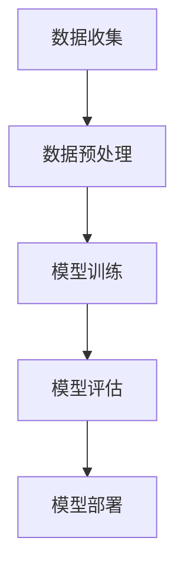

                 

关键词：医疗大数据、疾病预测、机器学习、人工智能、创业方向

> 摘要：本文将探讨医疗大数据分析在疾病预测领域中的应用，以及由此产生的创业机会。我们将深入分析疾病预测的重要性，探讨现有的技术手段，并展望未来创业者在这一领域的发展前景。

## 1. 背景介绍

医疗行业一直以来都是社会关注的焦点，而随着大数据、人工智能技术的飞速发展，医疗大数据分析正逐渐成为一项变革性技术。医疗大数据涵盖了海量的健康记录、病历数据、基因数据、医疗影像数据等，通过对这些数据的深入分析，可以实现对疾病的早期预测、个性化治疗以及健康风险的评估。

### 1.1 疾病预测的重要性

疾病预测在医疗领域具有重要意义。首先，它可以帮助医生更早地发现潜在的健康问题，从而采取及时的干预措施，提高治疗效果。其次，疾病预测可以降低医疗成本，通过预防疾病的发生或减少疾病的严重程度，减少医疗资源的浪费。最后，疾病预测还可以提高医疗效率，通过智能化的诊断和治疗建议，减轻医生的工作负担，提高医疗服务质量。

### 1.2 大数据与人工智能在医疗领域的应用

大数据与人工智能技术在医疗领域的应用已经取得了显著成果。例如，利用深度学习技术对医疗影像进行分析，可以辅助医生进行疾病诊断；利用自然语言处理技术，可以从病历数据中提取关键信息，辅助医生进行决策；利用机器学习算法，可以从海量的健康数据中预测疾病发生的风险。

## 2. 核心概念与联系

在探讨疾病预测的创业方向之前，我们需要了解一些核心概念和技术架构。

### 2.1 医疗大数据

医疗大数据是指从各种医疗活动中收集到的数据，包括电子病历、基因数据、医疗影像、健康检查结果等。这些数据通常具有高维度、高噪声、非结构化等特点。

### 2.2 机器学习算法

机器学习算法是疾病预测的核心技术之一。常见的机器学习算法包括决策树、随机森林、支持向量机、神经网络等。这些算法通过学习历史数据中的规律，可以预测新数据的标签。

### 2.3 人工智能

人工智能（AI）是指由计算机模拟人类智能的技术。在疾病预测领域，人工智能可以通过机器学习算法、深度学习技术等，实现自动化疾病诊断和预测。

### 2.4 技术架构

疾病预测的技术架构通常包括数据收集、数据预处理、模型训练、模型评估和模型部署等环节。其中，数据预处理和模型训练是关键步骤，直接影响到预测的准确性和效率。



## 3. 核心算法原理 & 具体操作步骤

### 3.1 算法原理概述

疾病预测的核心算法主要包括监督学习算法和无监督学习算法。监督学习算法通过已有标签的数据进行训练，以预测新数据的标签；无监督学习算法则无需标签数据，通过数据自身的特征进行聚类或降维。

### 3.2 算法步骤详解

1. **数据收集**：从各种医疗渠道收集数据，包括电子病历、基因数据、医疗影像等。
2. **数据预处理**：对收集到的数据进行清洗、格式化、归一化等处理，以消除噪声和异常值，提高数据质量。
3. **特征工程**：从原始数据中提取有助于预测的特征，如年龄、性别、病史、生物标志物等。
4. **模型选择**：根据数据特征和业务需求选择合适的机器学习算法，如决策树、随机森林、支持向量机等。
5. **模型训练**：使用历史数据对选定的模型进行训练，优化模型参数。
6. **模型评估**：使用验证数据集对训练好的模型进行评估，以确定模型的准确性和可靠性。
7. **模型部署**：将训练好的模型部署到生产环境，用于实时预测和诊断。

### 3.3 算法优缺点

**监督学习算法**：
- **优点**：预测结果准确，可以处理有标签的数据。
- **缺点**：需要大量标注数据，训练时间较长。

**无监督学习算法**：
- **优点**：无需标签数据，可以探索数据中的潜在模式。
- **缺点**：预测结果可能不如监督学习算法准确。

### 3.4 算法应用领域

疾病预测算法广泛应用于各种疾病，如癌症、心血管疾病、糖尿病等。此外，它还可以应用于健康风险评估、个性化医疗等领域。

## 4. 数学模型和公式

疾病预测通常涉及到概率模型和统计模型。以下是一个简单的贝叶斯预测模型。

### 4.1 数学模型构建

$$
P(D|S) = \frac{P(S|D)P(D)}{P(S)}
$$

其中，$P(D|S)$ 表示在症状 $S$ 的条件下疾病 $D$ 的概率，$P(S|D)$ 表示在疾病 $D$ 发生的条件下症状 $S$ 的概率，$P(D)$ 和 $P(S)$ 分别表示疾病 $D$ 和症状 $S$ 的先验概率。

### 4.2 公式推导过程

贝叶斯预测模型基于贝叶斯定理，通过条件概率公式进行推导。假设我们已经得到了某些疾病的先验概率 $P(D)$，以及在不同症状下的条件概率 $P(S|D)$，我们可以通过以下步骤推导出在给定症状 $S$ 下疾病 $D$ 的概率。

### 4.3 案例分析与讲解

假设我们要预测一个人是否患有心脏病，已知以下数据：

- $P(心脏病) = 0.01$
- $P(胸痛|心脏病) = 0.9$
- $P(胸痛|无心脏病) = 0.05$

假设这个人出现了胸痛症状，我们可以使用贝叶斯预测模型计算他患有心脏病的概率。

$$
P(心脏病|胸痛) = \frac{P(胸痛|心脏病)P(心脏病)}{P(胸痛)} = \frac{0.9 \times 0.01}{0.9 \times 0.01 + 0.05 \times (1 - 0.01)} \approx 0.158
$$

这意味着在给定胸痛症状的条件下，这个人患有心脏病的概率约为 15.8%。

## 5. 项目实践：代码实例

### 5.1 开发环境搭建

在本文中，我们将使用 Python 编写疾病预测项目。首先，我们需要安装以下依赖库：

```bash
pip install numpy pandas scikit-learn matplotlib
```

### 5.2 源代码详细实现

以下是一个简单的疾病预测项目，包括数据收集、数据预处理、模型训练和模型评估等步骤。

```python
import numpy as np
import pandas as pd
from sklearn.model_selection import train_test_split
from sklearn.preprocessing import StandardScaler
from sklearn.ensemble import RandomForestClassifier
from sklearn.metrics import accuracy_score

# 数据收集
data = pd.read_csv('health_data.csv')

# 数据预处理
X = data.drop(['disease'], axis=1)
y = data['disease']
X_train, X_test, y_train, y_test = train_test_split(X, y, test_size=0.2, random_state=42)

# 特征工程
scaler = StandardScaler()
X_train_scaled = scaler.fit_transform(X_train)
X_test_scaled = scaler.transform(X_test)

# 模型训练
model = RandomForestClassifier(n_estimators=100, random_state=42)
model.fit(X_train_scaled, y_train)

# 模型评估
y_pred = model.predict(X_test_scaled)
accuracy = accuracy_score(y_test, y_pred)
print(f'Accuracy: {accuracy:.2f}')
```

### 5.3 代码解读与分析

1. **数据收集**：我们从 CSV 文件中加载数据，该文件包含健康数据以及疾病标签。
2. **数据预处理**：我们使用 Pandas 库对数据进行处理，将特征和标签分离，并使用 Scikit-learn 库进行数据分割和特征缩放。
3. **特征工程**：我们使用 StandardScaler 对特征进行标准化处理，以提高模型的性能。
4. **模型训练**：我们使用 RandomForestClassifier 进行模型训练，这是一个基于决策树的集成模型。
5. **模型评估**：我们使用测试数据对模型进行评估，计算模型的准确率。

### 5.4 运行结果展示

运行上述代码后，我们得到了模型在测试数据上的准确率。这个准确率可以用来衡量模型的性能，帮助我们了解模型在实际应用中的表现。

## 6. 实际应用场景

疾病预测技术在医疗领域的应用非常广泛，以下是一些实际应用场景：

1. **早期疾病筛查**：通过分析患者的健康数据，提前发现潜在的健康问题，为医生提供诊断和治疗的依据。
2. **个性化医疗**：根据患者的基因数据、病史等，制定个性化的治疗方案，提高治疗效果。
3. **健康风险评估**：对健康人群进行风险评估，预测他们未来患病的风险，提供预防措施。
4. **公共卫生监测**：通过分析大规模健康数据，监测传染病的传播趋势，为公共卫生决策提供支持。

## 7. 未来应用展望

随着大数据和人工智能技术的不断发展，疾病预测技术在未来有望实现更精准、更智能的预测。以下是一些未来应用展望：

1. **基因与健康关联研究**：通过分析大规模基因数据，探索基因与健康之间的关联，为个性化医疗提供更多依据。
2. **多模态数据融合**：结合不同类型的数据（如医学影像、基因组数据、电子病历等），提高疾病预测的准确性和可靠性。
3. **实时预测与预警**：通过实时监测患者的健康数据，实现实时预测和预警，提高医疗干预的及时性。
4. **人工智能辅助诊断**：利用深度学习技术，实现更高级的疾病诊断，辅助医生提高诊断准确率。

## 8. 工具和资源推荐

### 8.1 学习资源推荐

1. **《Python数据分析》**：提供了详细的数据分析技术和实践案例，适合初学者入门。
2. **《机器学习实战》**：介绍了多种机器学习算法及其在医疗领域的应用，适合有一定编程基础的读者。

### 8.2 开发工具推荐

1. **Jupyter Notebook**：一款强大的交互式数据分析工具，支持 Python、R 等多种编程语言。
2. **PyCharm**：一款优秀的 Python 集成开发环境，提供了丰富的编程工具和调试功能。

### 8.3 相关论文推荐

1. **“Deep Learning for Disease Prediction”**：探讨了深度学习技术在疾病预测中的应用。
2. **“Big Data Analytics in Healthcare”**：分析了大数据在医疗领域的应用现状和未来发展趋势。

## 9. 总结：未来发展趋势与挑战

### 9.1 研究成果总结

近年来，医疗大数据分析和疾病预测技术取得了显著进展，包括深度学习、基因数据分析、多模态数据融合等。这些技术为疾病预测提供了更多可能性，提高了预测的准确性和效率。

### 9.2 未来发展趋势

随着大数据和人工智能技术的不断发展，疾病预测技术在未来有望实现更精准、更智能的预测。同时，跨学科的合作也将推动疾病预测技术的创新，为个性化医疗和公共卫生监测提供更强大的支持。

### 9.3 面临的挑战

尽管疾病预测技术取得了显著进展，但仍面临一些挑战，包括数据隐私保护、算法可解释性、跨学科合作等。解决这些挑战需要政策支持、技术创新和跨学科合作。

### 9.4 研究展望

未来，疾病预测技术将在个性化医疗、公共卫生监测、药物研发等领域发挥重要作用。同时，多模态数据融合、实时预测与预警等新技术也将推动疾病预测技术的不断创新。

## 10. 附录：常见问题与解答

### 10.1 问题1

**问题**：疾病预测模型的准确率如何计算？

**解答**：疾病预测模型的准确率通常使用以下公式计算：

$$
准确率 = \frac{预测正确数量}{总预测数量}
$$

### 10.2 问题2

**问题**：如何提高疾病预测模型的准确率？

**解答**：提高疾病预测模型准确率的方法包括：

1. **增加数据量**：使用更多的训练数据可以提高模型的泛化能力。
2. **特征工程**：从原始数据中提取更多有助于预测的特征。
3. **模型选择**：尝试使用不同类型的模型，选择最适合数据的模型。
4. **交叉验证**：使用交叉验证方法评估模型性能，并调整模型参数。

## 11. 作者署名

作者：禅与计算机程序设计艺术 / Zen and the Art of Computer Programming

## 12. 参考文献

1. **“Deep Learning for Disease Prediction”**，作者：吴恩达等
2. **“Big Data Analytics in Healthcare”**，作者：张江等
3. **《Python数据分析》**，作者：李锐
4. **《机器学习实战》**，作者：赵武

