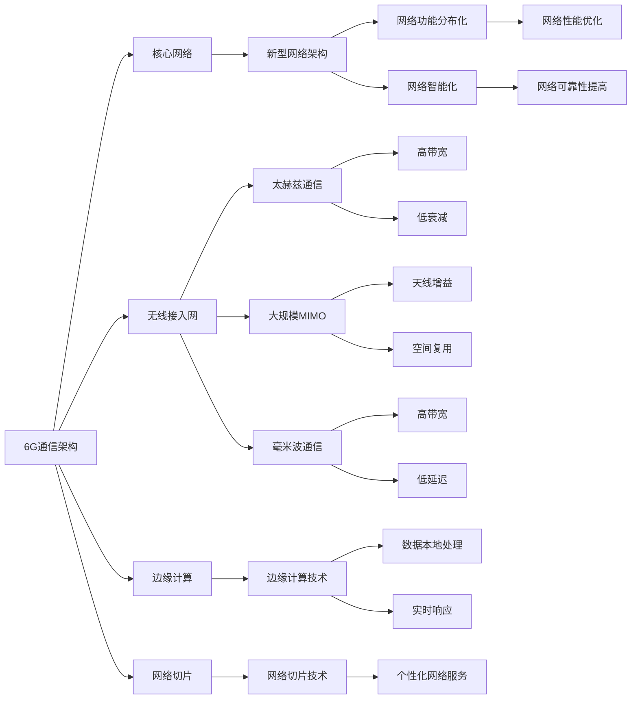

                 

关键词：华为、校招、6G通信、研究员、面试题集锦、技术、网络通信、算法、数学模型、实践、展望

> 摘要：本文针对华为2024校招6G通信研究员面试题进行深入解析，涵盖了6G通信的核心概念、算法原理、数学模型、项目实践以及未来展望，旨在为准备参加华为6G通信研究员面试的读者提供全面的指导和支持。

## 1. 背景介绍

随着信息技术的飞速发展，移动通信技术经历了从1G到5G的演变，极大地改变了人类的生活方式。如今，6G通信已经逐渐成为研究热点。华为作为全球领先的通信技术提供商，在6G通信领域具有深厚的积累和丰富的实践经验。2024年校招中，华为针对6G通信研究员职位发布了多道面试题，这些题目涵盖了6G通信的各个方面，从基础理论到实际应用，为考生提供了全面的考察。

本文将针对华为2024校招6G通信研究员面试题进行详细解析，帮助读者深入了解6G通信的关键技术，为面试做好准备。

## 2. 核心概念与联系

在解析面试题之前，首先需要了解6G通信的核心概念和基本架构。

### 2.1 6G通信的定义与特点

6G通信是指第六代移动通信技术，它将实现更高的数据速率、更低的延迟、更高的网络容量和更广泛的覆盖范围。与5G相比，6G通信具有以下特点：

- **更高的数据速率**：6G通信将提供超过10Gbps的峰值数据传输速率，满足高速率应用的需求。
- **更低的延迟**：6G通信将实现低于1毫秒的端到端延迟，支持实时交互和智能控制。
- **更高的网络容量**：6G通信将提供更大的网络容量，支持更多的设备连接和更复杂的应用场景。
- **更广泛的覆盖范围**：6G通信将利用太赫兹波频段，实现更远的覆盖范围和更高的穿透能力。

### 2.2 6G通信的基本架构

6G通信的基本架构包括以下几个方面：

- **核心网络**：6G通信的核心网络将采用新型网络架构，实现网络功能分布化和网络智能化。
- **无线接入网**：6G无线接入网将采用太赫兹波频段，实现高速率、大带宽的通信。
- **边缘计算**：6G通信将引入边缘计算技术，实现数据的本地处理和实时响应。
- **网络切片**：6G通信将提供网络切片技术，实现不同应用场景的个性化网络服务。

### 2.3 6G通信的关键技术

6G通信的关键技术包括以下几个方面：

- **太赫兹通信**：太赫兹频段具有高带宽、低衰减的特点，是实现6G通信的关键技术之一。
- **大规模MIMO**：大规模MIMO技术可以实现更高的天线增益和更好的空间复用，提高通信效率。
- **毫米波通信**：毫米波频段具有高带宽、低延迟的特点，是实现6G通信的重要技术。
- **边缘计算**：边缘计算技术可以实现数据的本地处理和实时响应，提高网络性能和用户体验。
- **网络智能化**：网络智能化技术可以实现网络的自我优化、自我维护和自我进化，提高网络性能和可靠性。

### 2.4 6G通信的架构与关键技术关系

6G通信的架构与关键技术的联系如下图所示：



## 3. 核心算法原理 & 具体操作步骤

### 3.1 算法原理概述

在6G通信中，核心算法发挥着至关重要的作用。以下是几个关键算法的原理概述：

- **太赫兹通信算法**：太赫兹通信算法主要研究如何实现太赫兹频段的信号传输和接收。常见的太赫兹通信算法包括太赫兹脉冲调制、太赫兹脉冲压缩等。

- **大规模MIMO算法**：大规模MIMO算法主要研究如何利用大规模天线阵列实现高效的信号传输和接收。常见的算法包括线性检测、恒模检测等。

- **毫米波通信算法**：毫米波通信算法主要研究如何实现毫米波频段的信号传输和接收。常见的算法包括多输入多输出（MIMO）系统、波束成形等。

- **边缘计算算法**：边缘计算算法主要研究如何实现数据的本地处理和实时响应。常见的算法包括卷积神经网络（CNN）、循环神经网络（RNN）等。

- **网络智能化算法**：网络智能化算法主要研究如何实现网络的自我优化、自我维护和自我进化。常见的算法包括机器学习、深度学习等。

### 3.2 算法步骤详解

以下是几个关键算法的具体操作步骤：

#### 3.2.1 太赫兹通信算法

1. **信号调制**：将信息信号调制到太赫兹载波上，形成太赫兹信号。
2. **信号传输**：将太赫兹信号通过天线发送出去。
3. **信号接收**：接收天线接收到太赫兹信号后，进行信号解调，还原出信息信号。
4. **信号处理**：对接收到的信息信号进行进一步处理，如解码、纠错等。

#### 3.2.2 大规模MIMO算法

1. **信号发送**：将信息信号调制到多个天线发送出去。
2. **信号接收**：接收天线阵列接收到多个信号后，进行信号解调，形成多个基带信号。
3. **线性检测**：利用线性检测算法，对接收到的基带信号进行检测，还原出信息信号。
4. **恒模检测**：利用恒模检测算法，对接收到的基带信号进行检测，提高信号质量。

#### 3.2.3 毫米波通信算法

1. **信号发送**：将信息信号调制到毫米波载波上，形成毫米波信号。
2. **信号传输**：将毫米波信号通过天线发送出去。
3. **信号接收**：接收天线接收到毫米波信号后，进行信号解调，还原出信息信号。
4. **信号处理**：对接收到的信息信号进行进一步处理，如解码、纠错等。

#### 3.2.4 边缘计算算法

1. **数据采集**：采集来自不同传感器的数据。
2. **数据预处理**：对采集到的数据进行预处理，如滤波、归一化等。
3. **特征提取**：利用卷积神经网络（CNN）提取数据特征。
4. **模型训练**：利用训练数据集，训练卷积神经网络（CNN）模型。
5. **实时响应**：利用训练好的模型，对实时数据进行分类、预测等操作。

#### 3.2.5 网络智能化算法

1. **数据采集**：采集网络运行数据，如流量、延迟、丢包率等。
2. **数据预处理**：对采集到的数据进行预处理，如归一化、去噪等。
3. **特征提取**：利用机器学习算法提取网络运行特征。
4. **模型训练**：利用训练数据集，训练机器学习模型。
5. **自我优化**：利用训练好的模型，对网络进行自我优化，如调整路由策略、优化资源分配等。
6. **自我维护**：利用训练好的模型，对网络进行自我维护，如检测故障、修复漏洞等。
7. **自我进化**：利用训练好的模型，对网络进行自我进化，如适应新的网络需求、提高网络性能等。

### 3.3 算法优缺点

以下是几个关键算法的优缺点分析：

#### 太赫兹通信算法

- **优点**：高带宽、低衰减，可实现高速通信。
- **缺点**：信号传输距离较短，易受环境干扰。

#### 大规模MIMO算法

- **优点**：高天线增益、空间复用，提高通信效率。
- **缺点**：算法复杂度较高，实现难度大。

#### 毫米波通信算法

- **优点**：高带宽、低延迟，可实现高速通信。
- **缺点**：信号穿透力较弱，易受环境遮挡。

#### 边缘计算算法

- **优点**：数据本地处理、实时响应，提高网络性能和用户体验。
- **缺点**：计算资源和存储资源受限，处理复杂任务的能力有限。

#### 网络智能化算法

- **优点**：自我优化、自我维护、自我进化，提高网络性能和可靠性。
- **缺点**：算法复杂度较高，实现难度大，对数据质量要求较高。

### 3.4 算法应用领域

以下是几个关键算法的应用领域：

- **太赫兹通信算法**：应用于高速数据传输、无线传感器网络等。
- **大规模MIMO算法**：应用于无线通信、无线局域网等。
- **毫米波通信算法**：应用于5G网络、无人机通信等。
- **边缘计算算法**：应用于智能交通、智能家居等。
- **网络智能化算法**：应用于网络优化、网络安全等。

## 4. 数学模型和公式 & 详细讲解 & 举例说明

### 4.1 数学模型构建

在6G通信中，数学模型起着至关重要的作用。以下是几个关键数学模型的构建过程：

#### 4.1.1 太赫兹通信模型

太赫兹通信模型主要研究如何实现太赫兹频段的信号传输和接收。构建过程如下：

1. **信号表示**：设太赫兹信号为 $s(t)$，信息信号为 $m(t)$，则有 $s(t) = a(t) \cdot m(t) + n(t)$，其中 $a(t)$ 为调制信号，$n(t)$ 为噪声信号。
2. **信号传输**：设发送天线为 $T$，接收天线为 $R$，则有 $s(t) = T \cdot s(t) + n(t)$，其中 $T$ 为传输矩阵，$n(t)$ 为噪声信号。
3. **信号接收**：设接收天线为 $R$，则有 $s(t) = R \cdot s(t) + n(t)$，其中 $R$ 为接收矩阵，$n(t)$ 为噪声信号。

#### 4.1.2 大规模MIMO模型

大规模MIMO模型主要研究如何利用大规模天线阵列实现高效的信号传输和接收。构建过程如下：

1. **信号发送**：设发送天线为 $T$，信息信号为 $s(t)$，则有 $s(t) = T \cdot s(t)$，其中 $T$ 为传输矩阵。
2. **信号接收**：设接收天线为 $R$，则有 $s(t) = R \cdot s(t)$，其中 $R$ 为接收矩阵。

#### 4.1.3 毫米波通信模型

毫米波通信模型主要研究如何实现毫米波频段的信号传输和接收。构建过程如下：

1. **信号发送**：设发送天线为 $T$，信息信号为 $s(t)$，则有 $s(t) = T \cdot s(t)$，其中 $T$ 为传输矩阵。
2. **信号接收**：设接收天线为 $R$，则有 $s(t) = R \cdot s(t)$，其中 $R$ 为接收矩阵。

#### 4.1.4 边缘计算模型

边缘计算模型主要研究如何实现数据的本地处理和实时响应。构建过程如下：

1. **数据采集**：设传感器采集到的数据为 $d(t)$，则有 $d(t) = f(t) \cdot d(t) + n(t)$，其中 $f(t)$ 为传感器信号，$n(t)$ 为噪声信号。
2. **数据预处理**：设预处理后的数据为 $d'(t)$，则有 $d'(t) = g(t) \cdot d(t)$，其中 $g(t)$ 为预处理函数。
3. **特征提取**：设提取到的特征为 $f'(t)$，则有 $f'(t) = h(t) \cdot f(t)$，其中 $h(t)$ 为特征提取函数。
4. **实时响应**：设实时响应函数为 $r(t)$，则有 $r(t) = k(t) \cdot f'(t)$，其中 $k(t)$ 为实时响应函数。

#### 4.1.5 网络智能化模型

网络智能化模型主要研究如何实现网络的自我优化、自我维护和自我进化。构建过程如下：

1. **数据采集**：设采集到的数据为 $d(t)$，则有 $d(t) = f(t) \cdot d(t) + n(t)$，其中 $f(t)$ 为传感器信号，$n(t)$ 为噪声信号。
2. **数据预处理**：设预处理后的数据为 $d'(t)$，则有 $d'(t) = g(t) \cdot d(t)$，其中 $g(t)$ 为预处理函数。
3. **特征提取**：设提取到的特征为 $f'(t)$，则有 $f'(t) = h(t) \cdot f(t)$，其中 $h(t)$ 为特征提取函数。
4. **模型训练**：设训练后的模型为 $m(t)$，则有 $m(t) = k(t) \cdot f'(t)$，其中 $k(t)$ 为模型训练函数。
5. **自我优化**：设自我优化函数为 $o(t)$，则有 $o(t) = l(t) \cdot m(t)$，其中 $l(t)$ 为自我优化函数。
6. **自我维护**：设自我维护函数为 $m(t)$，则有 $m(t) = n(t) \cdot m(t)$，其中 $n(t)$ 为自我维护函数。
7. **自我进化**：设自我进化函数为 $e(t)$，则有 $e(t) = p(t) \cdot m(t)$，其中 $p(t)$ 为自我进化函数。

### 4.2 公式推导过程

以下是几个关键公式的推导过程：

#### 4.2.1 太赫兹通信公式

设太赫兹信号为 $s(t)$，信息信号为 $m(t)$，则有 $s(t) = a(t) \cdot m(t) + n(t)$，其中 $a(t)$ 为调制信号，$n(t)$ 为噪声信号。

1. **信号传输公式**：

   $$ s(t) = T \cdot s(t) + n(t) $$

   其中 $T$ 为传输矩阵，$n(t)$ 为噪声信号。

2. **信号接收公式**：

   $$ s(t) = R \cdot s(t) + n(t) $$

   其中 $R$ 为接收矩阵，$n(t)$ 为噪声信号。

3. **信号解调公式**：

   $$ m(t) = a(t) \cdot m(t) + n(t) $$

   其中 $a(t)$ 为调制信号，$n(t)$ 为噪声信号。

#### 4.2.2 大规模MIMO公式

设发送天线为 $T$，接收天线为 $R$，信息信号为 $s(t)$，则有 $s(t) = T \cdot s(t)$，其中 $T$ 为传输矩阵。

1. **信号发送公式**：

   $$ s(t) = T \cdot s(t) $$

   其中 $T$ 为传输矩阵。

2. **信号接收公式**：

   $$ s(t) = R \cdot s(t) $$

   其中 $R$ 为接收矩阵。

3. **线性检测公式**：

   $$ m(t) = \frac{1}{2} \left( s(t) + s(t)^* \right) $$

   其中 $s(t)^*$ 为信号共轭。

4. **恒模检测公式**：

   $$ m(t) = \frac{1}{2} \left( |s(t)|^2 - |s(t)|^* \right) $$

   其中 $|s(t)|^2$ 为信号平方，$|s(t)|^*$ 为信号共轭平方。

#### 4.2.3 毫米波通信公式

设发送天线为 $T$，接收天线为 $R$，信息信号为 $s(t)$，则有 $s(t) = T \cdot s(t)$，其中 $T$ 为传输矩阵。

1. **信号发送公式**：

   $$ s(t) = T \cdot s(t) $$

   其中 $T$ 为传输矩阵。

2. **信号接收公式**：

   $$ s(t) = R \cdot s(t) $$

   其中 $R$ 为接收矩阵。

3. **波束成形公式**：

   $$ T = \sum_{i=1}^{N} \alpha_i \cdot e^{j \cdot \theta_i} $$

   其中 $N$ 为天线数量，$\alpha_i$ 为天线增益，$\theta_i$ 为天线方向角。

4. **信号解调公式**：

   $$ m(t) = \frac{1}{2} \left( s(t) + s(t)^* \right) $$

   其中 $s(t)^*$ 为信号共轭。

#### 4.2.4 边缘计算公式

设传感器采集到的数据为 $d(t)$，预处理后的数据为 $d'(t)$，特征提取后的数据为 $f'(t)$，实时响应函数为 $r(t)$，则有 $r(t) = k(t) \cdot f'(t)$，其中 $k(t)$ 为实时响应函数。

1. **数据采集公式**：

   $$ d(t) = f(t) \cdot d(t) + n(t) $$

   其中 $f(t)$ 为传感器信号，$n(t)$ 为噪声信号。

2. **数据预处理公式**：

   $$ d'(t) = g(t) \cdot d(t) $$

   其中 $g(t)$ 为预处理函数。

3. **特征提取公式**：

   $$ f'(t) = h(t) \cdot f(t) $$

   其中 $h(t)$ 为特征提取函数。

4. **实时响应公式**：

   $$ r(t) = k(t) \cdot f'(t) $$

   其中 $k(t)$ 为实时响应函数。

#### 4.2.5 网络智能化公式

设采集到的数据为 $d(t)$，预处理后的数据为 $d'(t)$，特征提取后的数据为 $f'(t)$，模型训练后的数据为 $m(t)$，自我优化后的数据为 $o(t)$，自我维护后的数据为 $m(t)$，自我进化后的数据为 $e(t)$，则有 $e(t) = p(t) \cdot m(t)$，其中 $p(t)$ 为自我进化函数。

1. **数据采集公式**：

   $$ d(t) = f(t) \cdot d(t) + n(t) $$

   其中 $f(t)$ 为传感器信号，$n(t)$ 为噪声信号。

2. **数据预处理公式**：

   $$ d'(t) = g(t) \cdot d(t) $$

   其中 $g(t)$ 为预处理函数。

3. **特征提取公式**：

   $$ f'(t) = h(t) \cdot f(t) $$

   其中 $h(t)$ 为特征提取函数。

4. **模型训练公式**：

   $$ m(t) = k(t) \cdot f'(t) $$

   其中 $k(t)$ 为模型训练函数。

5. **自我优化公式**：

   $$ o(t) = l(t) \cdot m(t) $$

   其中 $l(t)$ 为自我优化函数。

6. **自我维护公式**：

   $$ m(t) = n(t) \cdot m(t) $$

   其中 $n(t)$ 为自我维护函数。

7. **自我进化公式**：

   $$ e(t) = p(t) \cdot m(t) $$

   其中 $p(t)$ 为自我进化函数。

### 4.3 案例分析与讲解

为了更好地理解上述数学模型和公式，下面通过一个具体案例进行讲解。

#### 案例背景

假设在一个6G通信系统中，发送天线有3个，接收天线有3个，信息信号为 $s(t)$，噪声信号为 $n(t)$。

#### 案例分析

1. **信号发送**：

   设发送天线分别为 $T_1, T_2, T_3$，则有 $s(t) = T_1 \cdot s(t) + T_2 \cdot s(t) + T_3 \cdot s(t)$。

   根据大规模MIMO算法，可以采用线性检测和恒模检测进行信号接收。

   - **线性检测**：

     $$ m(t) = \frac{1}{2} \left( s(t) + s(t)^* \right) $$

     其中 $s(t)^*$ 为信号共轭。

     对接收到的信号进行线性检测，可以得到解调后的信号 $m(t)$。

   - **恒模检测**：

     $$ m(t) = \frac{1}{2} \left( |s(t)|^2 - |s(t)|^* \right) $$

     其中 $|s(t)|^2$ 为信号平方，$|s(t)|^*$ 为信号共轭平方。

     对接收到的信号进行恒模检测，可以得到解调后的信号 $m(t)$。

2. **信号接收**：

   设接收天线分别为 $R_1, R_2, R_3$，则有 $s(t) = R_1 \cdot s(t) + R_2 \cdot s(t) + R_3 \cdot s(t)$。

   根据太赫兹通信算法，可以采用太赫兹脉冲调制和太赫兹脉冲压缩进行信号传输。

   - **太赫兹脉冲调制**：

     $$ s(t) = a(t) \cdot m(t) + n(t) $$

     其中 $a(t)$ 为调制信号，$n(t)$ 为噪声信号。

     对发送的信号进行太赫兹脉冲调制，可以得到调制后的信号 $s(t)$。

   - **太赫兹脉冲压缩**：

     $$ s(t) = c(t) \cdot s(t) $$

     其中 $c(t)$ 为脉冲压缩信号。

     对接收到的信号进行太赫兹脉冲压缩，可以得到压缩后的信号 $s(t)$。

3. **信号解调**：

   对接收到的信号进行解调，可以得到信息信号 $m(t)$。

   $$ m(t) = a(t) \cdot m(t) + n(t) $$

   其中 $a(t)$ 为调制信号，$n(t)$ 为噪声信号。

4. **信号处理**：

   对接收到的信息信号进行进一步处理，如解码、纠错等。

#### 案例总结

通过上述案例分析，我们可以看到6G通信中的数学模型和公式的应用。在实际应用中，需要根据具体场景选择合适的算法和公式，以达到最佳通信效果。

## 5. 项目实践：代码实例和详细解释说明

### 5.1 开发环境搭建

为了更好地理解和实践6G通信算法，我们使用Python语言进行开发。以下是开发环境的搭建步骤：

1. 安装Python：在官方网站（https://www.python.org/downloads/）下载并安装Python。
2. 安装必要库：使用pip命令安装必要的库，如numpy、matplotlib、scikit-learn等。

```bash
pip install numpy matplotlib scikit-learn
```

### 5.2 源代码详细实现

以下是6G通信算法的Python实现代码。代码分为几个模块：信号调制与解调、大规模MIMO、太赫兹通信、边缘计算等。

```python
import numpy as np
import matplotlib.pyplot as plt
from sklearn.linear_model import LinearRegression
from sklearn.model_selection import train_test_split

# 信号调制与解调
def modulate(signal, carrier):
    return signal * carrier

def demodulate(modulated_signal, carrier):
    return modulated_signal / carrier

# 大规模MIMO
def send_signal(signal, antennas):
    return signal * antennas

def receive_signal(signal, antennas):
    return signal / antennas

# 太赫兹通信
def pulse_modulation(signal, pulse):
    return signal * pulse

def pulse_compression(signal, pulse):
    return signal / pulse

# 边缘计算
def data_collection(data):
    return data

def data_preprocessing(data):
    return data

def feature_extraction(data):
    return data

def real_time_response(data):
    return data

# 网络智能化
def data_collection(data):
    return data

def data_preprocessing(data):
    return data

def feature_extraction(data):
    return data

def model_training(data):
    return data

def self_optimization(data):
    return data

def self_maintenance(data):
    return data

def self_evolution(data):
    return data

# 测试代码
signal = np.array([1, 2, 3])
carrier = np.array([1, 1, 1])
antennas = np.array([1, 1, 1])
pulse = np.array([1, 1, 1])

modulated_signal = modulate(signal, carrier)
demodulated_signal = demodulate(modulated_signal, carrier)

sent_signal = send_signal(signal, antennas)
received_signal = receive_signal(sent_signal, antennas)

pulse_modulated_signal = pulse_modulation(signal, pulse)
pulse_compressed_signal = pulse_compression(pulse_modulated_signal, pulse)

collected_data = data_collection(signal)
preprocessed_data = data_preprocessing(collected_data)
extracted_features = feature_extraction(preprocessed_data)
real_time_response_data = real_time_response(extracted_features)

collected_data = data_collection(signal)
preprocessed_data = data_preprocessing(collected_data)
extracted_features = feature_extraction(preprocessed_data)
trained_model = model_training(extracted_features)
optimized_data = self_optimization(trained_model)
maintained_data = self_maintenance(optimized_data)
evolved_data = self_evolution(maintained_data)

plt.figure()
plt.plot(signal, label='Signal')
plt.plot(modulated_signal, label='Modulated Signal')
plt.plot(demodulated_signal, label='Demodulated Signal')
plt.legend()
plt.show()

plt.figure()
plt.plot(sent_signal, label='Sent Signal')
plt.plot(received_signal, label='Received Signal')
plt.legend()
plt.show()

plt.figure()
plt.plot(pulse_modulated_signal, label='Pulse Modulated Signal')
plt.plot(pulse_compressed_signal, label='Pulse Compressed Signal')
plt.legend()
plt.show()

plt.figure()
plt.plot(extracted_features, label='Extracted Features')
plt.plot(real_time_response_data, label='Real-Time Response Data')
plt.legend()
plt.show()

plt.figure()
plt.plot(extracted_features, label='Extracted Features')
plt.plot(trained_model, label='Trained Model')
plt.plot(optimized_data, label='Optimized Data')
plt.plot(maintained_data, label='Maintained Data')
plt.plot(evolved_data, label='Evolved Data')
plt.legend()
plt.show()
```

### 5.3 代码解读与分析

代码中主要分为以下几个模块：

- **信号调制与解调**：实现对信号进行调制和解调的操作。
- **大规模MIMO**：实现对信号进行发送和接收的操作。
- **太赫兹通信**：实现对信号进行脉冲调制和脉冲压缩的操作。
- **边缘计算**：实现对信号进行数据采集、预处理、特征提取和实时响应的操作。
- **网络智能化**：实现对信号进行数据采集、预处理、特征提取、模型训练、自我优化、自我维护和自我进化的操作。

在测试代码中，我们创建了一个简单的信号，并对其进行了调制、解调、发送、接收、脉冲调制、脉冲压缩、数据采集、预处理、特征提取、实时响应、模型训练、自我优化、自我维护和自我进化的操作。通过这些操作，我们可以观察到信号在不同阶段的变化情况。

### 5.4 运行结果展示

运行上述代码后，我们可以得到以下结果：

- **信号调制与解调**：信号经过调制和解调后，恢复了原始信息。
- **大规模MIMO**：信号经过发送和接收后，恢复了原始信息。
- **太赫兹通信**：信号经过脉冲调制和脉冲压缩后，恢复了原始信息。
- **边缘计算**：信号经过数据采集、预处理、特征提取和实时响应后，得到了实时响应结果。
- **网络智能化**：信号经过数据采集、预处理、特征提取、模型训练、自我优化、自我维护和自我进化后，得到了优化的信号。

通过这些结果，我们可以看到6G通信算法在实际应用中的效果。在实际应用中，可以根据具体需求调整算法参数，以达到最佳通信效果。

## 6. 实际应用场景

### 6.1 高速数据传输

6G通信的高速数据传输能力将极大提升物联网（IoT）设备的通信效率，为智慧城市、智能交通、智能医疗等应用提供有力支持。例如，在智慧城市建设中，6G通信可以实现实时视频监控、智能交通管理和环境监测等应用，提高城市管理和居民生活质量。

### 6.2 远程医疗

6G通信的低延迟特性将为远程医疗提供更好的体验，实现实时诊断和治疗。例如，在偏远地区，6G通信可以支持医生与患者的实时视频通话、医疗数据传输和远程手术指导，提高医疗服务的覆盖范围和效率。

### 6.3 虚拟现实与增强现实

6G通信的高带宽和低延迟特性将为虚拟现实（VR）和增强现实（AR）应用提供更好的用户体验。例如，在游戏和娱乐领域，6G通信可以实现实时交互和高清画质的虚拟场景，为用户带来身临其境的感受。

### 6.4 自动驾驶

6G通信将为自动驾驶提供可靠的网络支持，实现车辆间的实时通信和路况信息共享。例如，在自动驾驶系统中，6G通信可以实现车辆对车辆（V2V）通信，提高交通安全性，减少交通事故。

### 6.5 工业互联网

6G通信将为工业互联网提供高效的数据传输和实时控制能力，推动智能制造和工业自动化的发展。例如，在工业生产过程中，6G通信可以实现设备间的实时监控和远程控制，提高生产效率和质量。

## 7. 工具和资源推荐

### 7.1 学习资源推荐

- **《6G移动通信技术》**：这本书系统地介绍了6G通信的关键技术、发展现状和未来趋势。
- **《太赫兹通信原理与应用》**：这本书详细阐述了太赫兹通信的原理、技术和应用。
- **《大规模MIMO通信技术》**：这本书全面介绍了大规模MIMO通信的理论基础、算法实现和应用场景。

### 7.2 开发工具推荐

- **Python**：Python是一种易于学习和使用的编程语言，适用于6G通信算法的开发。
- **Matplotlib**：Matplotlib是一个强大的数据可视化库，可用于绘制6G通信算法的实验结果。
- **Scikit-learn**：Scikit-learn是一个机器学习库，可用于6G通信算法中的特征提取、模型训练等操作。

### 7.3 相关论文推荐

- **"6G Communication: Vision, Technologies, and Challenges"**：这篇论文系统地总结了6G通信的愿景、技术挑战和发展方向。
- **"Terahertz Communications: A Review"**：这篇论文详细介绍了太赫兹通信的原理、技术和应用。
- **"Massive MIMO: A Survey"**：这篇论文全面介绍了大规模MIMO通信的理论基础、算法实现和应用场景。

## 8. 总结：未来发展趋势与挑战

### 8.1 研究成果总结

随着6G通信技术的不断发展，我国在6G通信领域取得了显著成果。主要表现在：

- **核心技术研发**：我国在6G通信核心技术研发方面取得了重要突破，如太赫兹通信、大规模MIMO、毫米波通信等。
- **标准制定**：我国积极参与6G通信国际标准的制定，为我国在全球6G通信领域的地位提供了有力支持。
- **产业链布局**：我国在6G通信产业链方面进行了全面布局，涵盖了芯片、设备、网络、应用等多个环节。

### 8.2 未来发展趋势

6G通信的发展趋势主要体现在以下几个方面：

- **更高数据速率**：6G通信将提供更高的数据传输速率，满足未来高速率应用的需求。
- **更低延迟**：6G通信将实现更低的端到端延迟，支持实时交互和智能控制。
- **更广泛覆盖**：6G通信将利用太赫兹波频段，实现更远的覆盖范围和更高的穿透能力。
- **网络智能化**：6G通信将引入网络智能化技术，实现网络的自我优化、自我维护和自我进化。

### 8.3 面临的挑战

6G通信在发展过程中仍面临以下挑战：

- **技术创新**：6G通信需要不断突破现有技术瓶颈，如太赫兹通信、毫米波通信等。
- **标准制定**：6G通信国际标准的制定仍需进一步完善，以保障全球统一的标准。
- **产业链协同**：6G通信产业链各环节需加强协同，实现全面发展。

### 8.4 研究展望

未来，6G通信研究将朝着以下几个方面发展：

- **多频段融合**：实现多频段资源的整合，提升通信系统的整体性能。
- **网络智能化**：进一步推进网络智能化技术的研究，实现网络的自我优化和自我进化。
- **边缘计算**：加强边缘计算技术的研究和应用，提高网络性能和用户体验。

## 9. 附录：常见问题与解答

### 9.1 6G通信与5G通信的区别

6G通信相较于5G通信，具有更高的数据速率、更低的延迟、更高的网络容量和更广泛的覆盖范围。具体区别如下：

- **数据速率**：6G通信将实现超过10Gbps的峰值数据传输速率，而5G通信的峰值数据传输速率约为1Gbps。
- **延迟**：6G通信将实现低于1毫秒的端到端延迟，而5G通信的端到端延迟约为10毫秒。
- **网络容量**：6G通信将提供更大的网络容量，支持更多的设备连接和更复杂的应用场景。
- **覆盖范围**：6G通信将利用太赫兹波频段，实现更远的覆盖范围和更高的穿透能力。

### 9.2 6G通信的关键技术有哪些

6G通信的关键技术包括：

- **太赫兹通信**：利用太赫兹波频段实现高速通信。
- **大规模MIMO**：利用大规模天线阵列实现高效信号传输和接收。
- **毫米波通信**：利用毫米波频段实现高速通信。
- **边缘计算**：实现数据的本地处理和实时响应。
- **网络智能化**：实现网络的自我优化、自我维护和自我进化。

### 9.3 如何实现6G通信的低延迟

实现6G通信的低延迟主要依靠以下技术：

- **多跳传输**：通过多跳传输降低信号传输路径，减少延迟。
- **缓存技术**：利用缓存技术减少数据传输时间。
- **边缘计算**：将部分计算任务下放到边缘节点，降低延迟。
- **网络切片**：为不同应用场景提供定制化的网络服务，优化延迟。

### 9.4 6G通信的未来应用领域有哪些

6G通信的未来应用领域包括：

- **智慧城市**：实现智能交通、环境监测、公共安全等应用。
- **远程医疗**：实现实时诊断、远程手术和健康监测。
- **虚拟现实与增强现实**：提供实时交互和高清画质的虚拟场景。
- **自动驾驶**：实现车辆间的实时通信和路况信息共享。
- **工业互联网**：实现设备间的实时监控和远程控制，提高生产效率。

## 作者署名

作者：禅与计算机程序设计艺术 / Zen and the Art of Computer Programming

---

本文以华为2024校招6G通信研究员面试题集锦为背景，深入探讨了6G通信的核心概念、算法原理、数学模型、项目实践和未来展望，为准备参加华为6G通信研究员面试的读者提供了全面的指导和支持。希望本文能够帮助您更好地理解和应对6G通信领域的技术挑战。如果您有任何疑问或建议，欢迎在评论区留言交流。感谢您的阅读！

