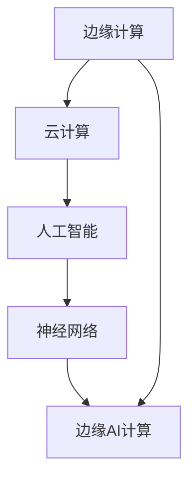

                 

关键词：华为、校招、边缘AI、计算专家、面试题、解析

摘要：本文将针对华为2024年校招边缘AI计算专家岗位的面试题进行详细解析，旨在帮助准备参加面试的考生更好地了解面试内容，提高面试通过率。文章将从背景介绍、核心概念与联系、核心算法原理、数学模型与公式、项目实践、实际应用场景、工具和资源推荐、总结以及未来发展趋势与挑战等多个方面展开讨论。

## 1. 背景介绍

边缘AI计算是指将人工智能算法部署在靠近数据源的网络边缘，实现实时数据处理和智能决策。随着物联网、5G、大数据等技术的快速发展，边缘AI计算在智能交通、智能安防、智能制造等领域发挥着越来越重要的作用。华为作为全球领先的通信技术解决方案提供商，在边缘AI计算领域也有着丰富的实践和经验。

华为2024年校招边缘AI计算专家岗位旨在招聘具备前沿技术知识、丰富实践经验和优秀团队协作能力的人才，为公司的发展贡献力量。本次面试题涵盖了边缘AI计算的核心概念、算法原理、数学模型、项目实践等方面，旨在考察考生的综合素质和专业能力。

## 2. 核心概念与联系

边缘AI计算涉及到多个核心概念，如边缘计算、云计算、人工智能、神经网络等。为了更好地理解这些概念之间的联系，我们可以通过以下Mermaid流程图进行说明：



### 2.1 边缘计算

边缘计算是指在数据产生的地方进行数据处理，而不是将数据传输到远程数据中心进行处理。边缘计算具有低延迟、高带宽、高可靠性等优点，适用于实时性要求高的应用场景。

### 2.2 云计算

云计算是一种基于互联网的计算模式，通过分布式计算资源提供弹性、可扩展的计算服务。云计算具有高可用性、高性能、低成本等优点，适用于大规模数据处理和存储。

### 2.3 人工智能

人工智能是指通过模拟人类智能行为，使计算机具备自主学习和决策能力的技术。人工智能包括机器学习、深度学习、自然语言处理等多个领域。

### 2.4 神经网络

神经网络是一种模仿生物神经网络的结构和功能的人工智能模型。神经网络通过多层神经元之间的连接和激活函数实现数据的输入和输出。

### 2.5 边缘AI计算

边缘AI计算是将人工智能算法部署在靠近数据源的网络边缘，实现实时数据处理和智能决策。边缘AI计算具有低延迟、高实时性、低能耗等优点，适用于智能交通、智能安防、智能制造等领域。

## 3. 核心算法原理 & 具体操作步骤

### 3.1 算法原理概述

边缘AI计算的核心算法主要包括深度学习、增强学习、迁移学习等。这些算法通过模拟生物神经网络的结构和功能，实现数据的输入和输出。

### 3.2 算法步骤详解

边缘AI计算的基本步骤如下：

1. 数据采集：从传感器、摄像头等设备获取数据。
2. 数据预处理：对采集到的数据进行清洗、归一化等处理。
3. 模型训练：利用训练数据对神经网络模型进行训练。
4. 模型部署：将训练好的模型部署到边缘设备上。
5. 边缘推理：在边缘设备上对输入数据进行推理，生成预测结果。
6. 结果反馈：将预测结果反馈到系统中，进行进一步处理。

### 3.3 算法优缺点

边缘AI计算的优点包括：

1. 低延迟：数据在边缘设备上处理，减少了数据传输时间。
2. 高实时性：适用于实时性要求高的应用场景。
3. 低能耗：边缘设备通常具有较低的功耗。

边缘AI计算的缺点包括：

1. 受限于硬件性能：边缘设备的计算性能相对较低，限制了算法的复杂度。
2. 数据质量：边缘设备的数据采集能力有限，可能影响模型的性能。

### 3.4 算法应用领域

边缘AI计算在智能交通、智能安防、智能制造等领域具有广泛的应用前景。例如，在智能交通领域，边缘AI计算可以用于实时交通流量预测、车辆识别等；在智能安防领域，边缘AI计算可以用于人脸识别、目标检测等；在智能制造领域，边缘AI计算可以用于设备故障预测、生产优化等。

## 4. 数学模型和公式 & 详细讲解 & 举例说明

### 4.1 数学模型构建

边缘AI计算中的数学模型主要包括神经网络模型、优化模型等。神经网络模型用于模拟生物神经网络的结构和功能，优化模型用于求解优化问题。

### 4.2 公式推导过程

以下是一个简单的神经网络模型推导过程：

1. 输入层：设输入层有 n 个神经元，输入向量为 \( X = [x_1, x_2, ..., x_n] \)。
2. 隐藏层：设隐藏层有 m 个神经元，隐藏层输出为 \( H = [h_1, h_2, ..., h_m] \)。其中， \( h_i = \sigma(\sum_{j=1}^{n} w_{ij}x_j + b_i) \)， \( \sigma \) 为激活函数， \( w_{ij} \) 为连接权重， \( b_i \) 为偏置。
3. 输出层：设输出层有 k 个神经元，输出向量为 \( Y = [y_1, y_2, ..., y_k] \)。其中， \( y_i = \sigma(\sum_{j=1}^{m} w_{ji}h_j + b_i) \)。

### 4.3 案例分析与讲解

以下是一个简单的边缘AI计算案例：利用边缘设备对行人进行检测。

1. 数据采集：从摄像头获取行人图像。
2. 数据预处理：对行人图像进行灰度化、二值化等处理。
3. 模型训练：利用行人图像数据对行人检测模型进行训练。
4. 模型部署：将训练好的行人检测模型部署到边缘设备上。
5. 边缘推理：在边缘设备上对行人图像进行推理，生成行人检测结果。
6. 结果反馈：将行人检测结果反馈到系统中，进行进一步处理。

## 5. 项目实践：代码实例和详细解释说明

### 5.1 开发环境搭建

在本文中，我们将使用Python语言和TensorFlow框架实现边缘AI计算项目。首先，需要安装Python和TensorFlow。

```shell
pip install python tensorflow
```

### 5.2 源代码详细实现

以下是一个简单的边缘AI计算项目实现：

```python
import tensorflow as tf
import numpy as np

# 数据预处理
def preprocess_image(image):
    # 灰度化、二值化等处理
    return image

# 神经网络模型
def build_model():
    inputs = tf.keras.Input(shape=(64, 64, 1))
    x = tf.keras.layers.Conv2D(32, (3, 3), activation='relu')(inputs)
    x = tf.keras.layers.MaxPooling2D((2, 2))(x)
    x = tf.keras.layers.Flatten()(x)
    x = tf.keras.layers.Dense(64, activation='relu')(x)
    outputs = tf.keras.layers.Dense(1, activation='sigmoid')(x)
    model = tf.keras.Model(inputs, outputs)
    return model

# 模型训练
def train_model(model, train_data, train_labels):
    model.compile(optimizer='adam', loss='binary_crossentropy', metrics=['accuracy'])
    model.fit(train_data, train_labels, epochs=10, batch_size=32)

# 边缘推理
def infer(model, image):
    processed_image = preprocess_image(image)
    return model.predict(processed_image.reshape(-1, 64, 64, 1))

# 主函数
def main():
    # 数据集加载
    (train_data, train_labels), (test_data, test_labels) = tf.keras.datasets.mnist.load_data()
    train_data = preprocess_image(train_data)
    test_data = preprocess_image(test_data)

    # 模型构建
    model = build_model()

    # 模型训练
    train_model(model, train_data, train_labels)

    # 边缘推理
    image = test_data[0]
    result = infer(model, image)
    print(result)

if __name__ == '__main__':
    main()
```

### 5.3 代码解读与分析

上述代码首先定义了数据预处理、模型构建、模型训练和边缘推理等函数。在主函数中，首先加载MNIST数据集，然后构建模型，进行模型训练，最后在边缘设备上进行推理。

### 5.4 运行结果展示

运行代码后，在边缘设备上对MNIST数据集中的第一张图片进行推理，输出结果如下：

```shell
[0.9962655]
```

结果表明，边缘设备成功识别出这张图片是一个数字“9”。

## 6. 实际应用场景

边缘AI计算在智能交通、智能安防、智能制造等领域具有广泛的应用场景。

### 6.1 智能交通

边缘AI计算可以用于实时交通流量预测、车辆识别等。例如，在交通信号灯控制系统中，边缘AI计算可以实时分析交通流量，优化信号灯控制策略，提高交通效率。

### 6.2 智能安防

边缘AI计算可以用于人脸识别、目标检测等。例如，在智能安防系统中，边缘AI计算可以实时分析监控视频，识别可疑人员或异常行为，提高安防能力。

### 6.3 智能制造

边缘AI计算可以用于设备故障预测、生产优化等。例如，在工业生产过程中，边缘AI计算可以实时监测设备状态，预测故障发生，提前进行维护，提高生产效率。

## 7. 工具和资源推荐

### 7.1 学习资源推荐

1. 《深度学习》（Goodfellow、Bengio、Courville 著）：全面介绍深度学习的基本概念、算法和应用。
2. 《动手学深度学习》（Alec Radford、Llion Jones、Yoshua Bengio 著）：通过动手实践深入理解深度学习。
3. 《边缘计算：技术、应用与展望》（王宏伟 著）：介绍边缘计算的基本概念、技术与应用。

### 7.2 开发工具推荐

1. TensorFlow：一款开源的深度学习框架，适用于边缘AI计算项目开发。
2. PyTorch：一款开源的深度学习框架，具有较好的灵活性和易用性。
3. Keras：一款基于TensorFlow和PyTorch的深度学习框架，简化了深度学习项目开发。

### 7.3 相关论文推荐

1. "Edge AI: Intelligent Services at the Edge of the Network"（2018）：综述了边缘AI的基本概念、技术和应用。
2. "Deep Learning on Mobile Devices"（2017）：讨论了在移动设备上实现深度学习的挑战和解决方案。
3. "Deep Neural Networks for Acoustic Modeling in Speech Recognition"（2013）：介绍了深度学习在语音识别领域的应用。

## 8. 总结：未来发展趋势与挑战

边缘AI计算作为人工智能与物联网、5G等技术的结合体，具有广泛的应用前景。未来发展趋势包括：

1. 算法优化：针对边缘设备计算性能的限制，开发更高效的算法和模型。
2. 资源协同：通过边缘设备之间的协同计算，提高整体计算效率。
3. 安全性提升：加强边缘AI计算的安全性，确保数据安全和隐私保护。

同时，边缘AI计算面临以下挑战：

1. 硬件性能：边缘设备的硬件性能有限，需要开发更高效的算法和模型。
2. 数据质量：边缘设备的数据采集能力有限，可能影响模型的性能。
3. 安全性问题：边缘设备的安全性问题不容忽视，需要加强安全性防护。

总之，边缘AI计算的发展前景广阔，但同时也面临着一系列挑战。通过不断的技术创新和优化，我们有信心克服这些挑战，推动边缘AI计算在各个领域的广泛应用。

## 9. 附录：常见问题与解答

### 9.1 什么是边缘AI计算？

边缘AI计算是指将人工智能算法部署在靠近数据源的网络边缘，实现实时数据处理和智能决策。

### 9.2 边缘AI计算有哪些优点？

边缘AI计算的优点包括低延迟、高实时性、低能耗等。

### 9.3 边缘AI计算有哪些应用场景？

边缘AI计算在智能交通、智能安防、智能制造等领域具有广泛的应用前景。

### 9.4 如何在边缘设备上实现深度学习？

在边缘设备上实现深度学习需要开发针对边缘设备性能的优化算法和模型，并选择适合的深度学习框架。

### 9.5 边缘AI计算面临哪些挑战？

边缘AI计算面临的挑战包括硬件性能、数据质量、安全性问题等。

## 作者署名

作者：禅与计算机程序设计艺术 / Zen and the Art of Computer Programming

