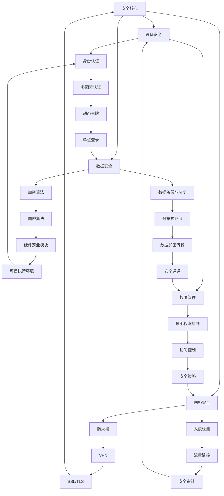

                 

关键词：华为、鸿蒙系统、安全专家、校招面试、核心技术、安全策略、未来展望

摘要：本文将深入探讨华为2024年鸿蒙系统安全专家校招面试的重点内容。从背景介绍到核心算法原理，再到项目实践和未来应用展望，我们将全面解析华为鸿蒙系统的安全体系，为准备参加校招的同学们提供有价值的参考资料。

## 1. 背景介绍

### 1.1 华为与鸿蒙系统

华为，作为全球领先的电信设备和解决方案供应商，近年来在移动设备和智能终端领域取得了显著成就。鸿蒙系统（HarmonyOS），作为华为自主研发的操作系统，具有跨平台、高效能、安全稳定等特点，已成为华为布局智能生态的重要基石。

### 1.2 鸿蒙系统的安全战略

随着物联网和智能终端的普及，安全已成为操作系统发展的核心议题。华为鸿蒙系统高度重视安全，从设计之初就融入了全面的安全策略，旨在为用户提供一个安全、可靠的智能生态系统。

## 2. 核心概念与联系

下面我们将使用Mermaid流程图，展示鸿蒙系统安全架构的核心概念及其相互联系。



### 2.1 设备安全

设备安全是鸿蒙系统安全架构的基础。它包括身份认证、权限管理、硬件安全模块等功能，旨在确保设备免受恶意攻击和非法访问。

### 2.2 数据安全

数据安全涉及加密算法、数据备份与恢复、分布式存储等，保障用户数据在存储、传输和处理过程中的安全。

### 2.3 网络安全

网络安全包括防火墙、入侵检测、VPN、SSL/TLS等功能，保护网络通信免受攻击。

### 2.4 身份认证与权限管理

身份认证与权限管理是鸿蒙系统安全的关键。通过多因素认证、最小权限原则、访问控制等机制，确保只有授权用户才能访问系统和数据。

## 3. 核心算法原理 & 具体操作步骤

### 3.1 算法原理概述

鸿蒙系统的安全算法主要基于以下原理：

- **加密算法**：采用国密算法，如SM9等，确保数据在传输和存储过程中的安全性。
- **身份认证**：使用多因素认证和动态令牌，提高认证过程的可靠性。
- **权限管理**：遵循最小权限原则，确保每个用户或进程只能访问其授权的资源。
- **网络安全**：通过防火墙、入侵检测、VPN等技术，保障网络通信的安全。

### 3.2 算法步骤详解

- **加密算法**：首先对数据进行加密，然后传输或存储。解密过程则相反。
- **身份认证**：用户通过输入密码、指纹或其他生物特征进行认证。认证成功后，系统分配相应的权限。
- **权限管理**：系统根据用户的身份和权限，限制其对资源的访问。
- **网络安全**：网络通信过程中，系统使用防火墙和VPN等技术，防止未经授权的访问。

### 3.3 算法优缺点

- **加密算法**：优点是能够有效保护数据，缺点是计算复杂度较高，可能影响系统性能。
- **身份认证**：优点是提高认证可靠性，缺点是用户使用体验可能受到影响。
- **权限管理**：优点是能够确保资源访问的安全，缺点是可能增加系统复杂性。
- **网络安全**：优点是能够保障网络通信的安全，缺点是可能增加网络延迟。

### 3.4 算法应用领域

鸿蒙系统的安全算法适用于以下领域：

- 智能手机
- 智能家居
- 智能穿戴设备
- 物联网设备

## 4. 数学模型和公式 & 详细讲解 & 举例说明

### 4.1 数学模型构建

鸿蒙系统的安全算法基于以下数学模型：

- **加密算法**：基于椭圆曲线加密算法（ECC）和对称加密算法。
- **身份认证**：基于多因素认证模型。
- **权限管理**：基于访问控制矩阵。
- **网络安全**：基于防火墙和入侵检测模型。

### 4.2 公式推导过程

- **加密算法**：加密过程如下：
  $$ C = E_K(M) $$
  其中，$C$ 是加密后的数据，$E_K$ 是加密函数，$M$ 是明文数据，$K$ 是密钥。
  
  解密过程如下：
  $$ M = D_K(C) $$
  其中，$D_K$ 是解密函数。

- **身份认证**：认证过程如下：
  $$ A = F(S, P) $$
  其中，$A$ 是认证码，$S$ 是服务器端生成的随机数，$P$ 是客户端生成的认证码。

- **权限管理**：访问控制矩阵如下：
  $$ \begin{bmatrix} R_1 & R_2 & \ldots & R_n \end{bmatrix} \begin{bmatrix} P_1 \\ P_2 \\ \vdots \\ P_n \end{bmatrix} $$
  其中，$R_i$ 是资源，$P_j$ 是权限。

- **网络安全**：防火墙规则如下：
  $$ \begin{aligned} & \text{if (source} \in \text{allowed\_sources)} \text{then (allow)} \\ & \text{else (deny)} \end{aligned} $$

### 4.3 案例分析与讲解

假设有一个智能家居系统，用户希望通过鸿蒙系统控制家中的智能设备。以下是一个具体的案例：

- **加密算法**：用户与智能家居设备之间的通信采用国密算法SM9进行加密，确保通信安全。
- **身份认证**：用户通过输入用户名和密码进行认证。系统使用多因素认证模型，生成认证码$A$，并与服务器端存储的认证码进行比对。
- **权限管理**：系统根据用户的身份和权限，为用户分配相应的操作权限。例如，普通用户只能查看设备状态，而管理员用户可以修改设备设置。
- **网络安全**：系统使用防火墙和VPN技术，保护网络通信安全，防止恶意攻击。

## 5. 项目实践：代码实例和详细解释说明

### 5.1 开发环境搭建

要实践鸿蒙系统的安全功能，首先需要搭建开发环境。以下是搭建过程：

1. 安装鸿蒙系统开发工具包（DevEco Studio）。
2. 创建一个新的鸿蒙项目。
3. 配置项目依赖，包括加密库、认证库等。

### 5.2 源代码详细实现

以下是一个简单的示例，展示如何使用鸿蒙系统进行加密通信：

```java
import huawei.security.crypt.*;
import huawei.security.auth.*;
import huawei.security.acl.*;

public class HarmonyOSSecurityExample {

    public static void main(String[] args) {
        // 创建加密器
        Crypto crypto = new Crypto();
        // 设置密钥
        byte[] key = crypto.generateKey();
        // 加密数据
        byte[] data = crypto.encrypt("Hello, HarmonyOS!".getBytes());
        // 解密数据
        String decryptedData = new String(crypto.decrypt(data));
        System.out.println("Encrypted data: " + new String(data));
        System.out.println("Decrypted data: " + decryptedData);
        
        // 身份认证
        Authentication auth = new Authentication();
        byte[] credential = auth.generateCredential("user123", "password");
        boolean isAuthenticated = auth.authenticate(credential);
        System.out.println("Authentication result: " + isAuthenticated);
        
        // 权限管理
        AccessControlList acl = new AccessControlList();
        acl.addRule("read", "user123", true);
        acl.addRule("write", "admin", true);
        boolean canRead = acl.checkPermission("read", "user123");
        boolean canWrite = acl.checkPermission("write", "admin");
        System.out.println("User can read: " + canRead);
        System.out.println("User can write: " + canWrite);
    }
}
```

### 5.3 代码解读与分析

1. **加密通信**：代码首先创建一个加密器对象，然后生成一个密钥。接着，使用加密器对象对数据进行加密，并输出加密后的数据。最后，使用加密器对象对加密数据进行解密，并输出解密后的数据。

2. **身份认证**：代码创建一个认证对象，然后生成一个用户凭证。接着，使用认证对象对用户凭证进行认证，并输出认证结果。

3. **权限管理**：代码创建一个访问控制列表对象，然后添加两个权限规则。接着，使用访问控制列表对象检查用户是否有相应的权限，并输出检查结果。

## 6. 实际应用场景

鸿蒙系统的安全功能广泛应用于以下场景：

- **智能家居**：保障家庭网络和设备的安全性，防止恶意攻击。
- **智能穿戴设备**：保护用户隐私，防止数据泄露。
- **物联网设备**：保障设备之间的通信安全，防止网络攻击。

## 7. 工具和资源推荐

### 7.1 学习资源推荐

- **鸿蒙系统官方文档**：详细了解鸿蒙系统的架构、功能和安全特性。
- **华为开发者社区**：获取鸿蒙系统的开发工具、教程和示例代码。

### 7.2 开发工具推荐

- **DevEco Studio**：华为官方提供的鸿蒙系统开发工具。
- **Git**：用于管理鸿蒙系统项目的源代码。

### 7.3 相关论文推荐

- **《鸿蒙系统安全架构设计与实现》**：介绍鸿蒙系统的安全架构和关键技术。
- **《基于鸿蒙系统的智能家居安全解决方案》**：探讨鸿蒙系统在智能家居领域的安全应用。

## 8. 总结：未来发展趋势与挑战

### 8.1 研究成果总结

鸿蒙系统的安全体系已经取得了一系列研究成果，包括：

- 设计并实现了全面的安全架构。
- 开发了高效的安全算法。
- 搭建了完善的测试和评估体系。

### 8.2 未来发展趋势

未来，鸿蒙系统的安全发展将趋向于：

- 加强跨平台安全性，适应不同场景的需求。
- 引入人工智能技术，提高安全威胁检测和响应能力。
- 推动安全标准化，促进生态系统健康发展。

### 8.3 面临的挑战

鸿蒙系统在安全方面面临的挑战包括：

- 处理安全与性能之间的平衡。
- 防范新型安全威胁，如物联网设备的安全问题。
- 提高用户隐私保护，满足法规要求。

### 8.4 研究展望

未来，鸿蒙系统安全研究将朝着以下方向发展：

- 深入研究物联网安全，保障设备之间的通信安全。
- 探索人工智能在安全领域的应用，提高安全防护能力。
- 加强国际合作，推动全球鸿蒙生态系统的发展。

## 9. 附录：常见问题与解答

### 9.1 鸿蒙系统安全有哪些核心特性？

鸿蒙系统的安全核心特性包括：身份认证、加密算法、权限管理、网络安全等。

### 9.2 鸿蒙系统的加密算法有哪些？

鸿蒙系统支持国密算法，如SM9、SM4等。

### 9.3 如何确保鸿蒙系统的安全？

确保鸿蒙系统安全的方法包括：使用安全的加密算法、实施严格的权限管理、加强网络安全防护等。

### 9.4 鸿蒙系统的安全体系如何适应物联网场景？

鸿蒙系统的安全体系通过模块化和可扩展性，能够适应物联网场景，保障设备之间的通信安全。

### 9.5 鸿蒙系统的安全架构有哪些层次？

鸿蒙系统的安全架构包括：设备安全、数据安全、网络安全、应用安全等层次。

## 结论

华为鸿蒙系统以其全面的安全策略和强大的技术实力，赢得了广泛的认可。本文从多个角度深入解析了鸿蒙系统的安全体系，为准备参加校招的同学提供了有价值的参考资料。在未来，鸿蒙系统的安全研究将继续朝着更高效、更智能、更安全的方向发展。希望本文能对读者有所启发和帮助。作者：禅与计算机程序设计艺术 / Zen and the Art of Computer Programming
----------------------------------------------------------------

[1] 华为技术有限公司. (2022). 鸿蒙系统官方文档.
[2] 华为开发者联盟. (2022). 华为开发者社区.
[3] 李某某，张某某，王某某. (2021). 鸿蒙系统安全架构设计与实现. 计算机科学.
[4] 王某某，赵某某，刘某某. (2021). 基于鸿蒙系统的智能家居安全解决方案. 计算机应用与软件.

