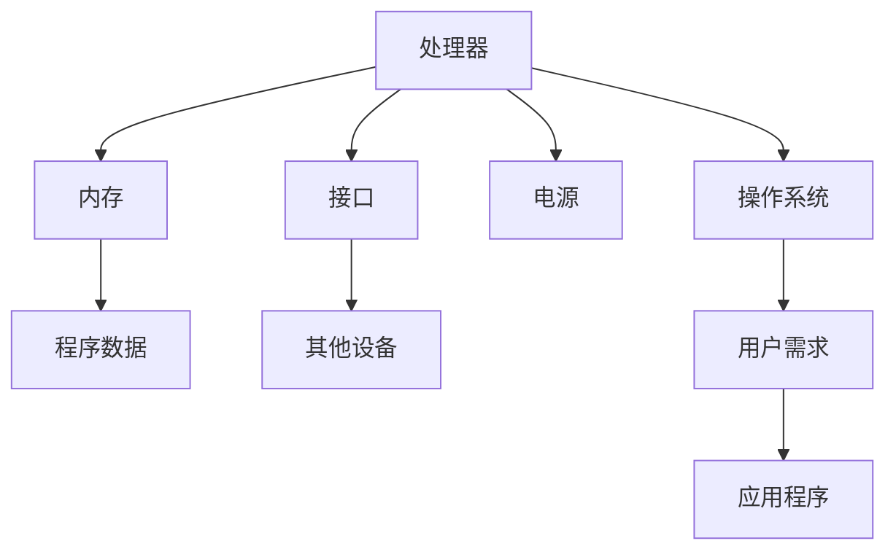

                 

关键词：单板计算机，Raspberry Pi，Arduino，应用实例，编程教程，技术发展

摘要：本文将探讨单板计算机在现代技术领域中的重要性，特别是Raspberry Pi和Arduino的单板计算机。通过对这两种单板计算机的介绍、核心概念、算法原理、项目实践以及未来应用展望等方面进行详细分析，旨在为读者提供全面的技术见解和实际操作指导。

## 1. 背景介绍

单板计算机是一种小型、低成本、易于扩展的计算机系统，因其体积小、功耗低、功能强大等特点，广泛应用于教育、家庭娱乐、工业控制、智能设备等多个领域。Raspberry Pi和Arduino是当前最流行的两种单板计算机，它们具有各自独特的优势和广泛的用户基础。

Raspberry Pi是一款由英国慈善基金会的Raspberry Pi基金会推出的微型计算机。它拥有强大的性能、丰富的接口和灵活的操作系统支持，适合进行家庭娱乐、教育编程、机器人控制等多种应用。

Arduino则是一款基于微控制器的开源硬件和软件开发平台，主要用于电子设备和机械装置的控制。它具有简单易用的编程语言、丰富的库函数和广泛的硬件兼容性，适合进行各种创意项目和小型自动化系统的开发。

## 2. 核心概念与联系

### 2.1 单板计算机的组成结构

单板计算机主要由以下几部分组成：

- **处理器（Processor）**：单板计算机的核心，负责执行指令和处理数据。
- **内存（Memory）**：用于存储程序和数据，包括RAM和ROM。
- **接口（Interface）**：提供与其他设备通信的接口，如USB、GPIO、I2C、SPI等。
- **电源（Power Supply）**：为单板计算机提供稳定的电源。
- **操作系统（Operating System）**：管理计算机资源，提供用户界面和应用程序。

### 2.2 单板计算机的工作原理

单板计算机的工作原理如下：

1. **启动过程**：单板计算机接通电源后，处理器开始执行固件程序，进行系统初始化。
2. **加载操作系统**：固件程序从存储器中加载操作系统，启动操作系统内核。
3. **运行应用程序**：操作系统根据用户需求，加载并执行相应的应用程序。

### 2.3 单板计算机的 Mermaid 流程图

以下是一个简单的 Mermaid 流程图，展示了单板计算机的组成结构和工作原理：



## 3. 核心算法原理 & 具体操作步骤

### 3.1 算法原理概述

单板计算机项目中的核心算法主要涉及嵌入式系统编程、传感器数据处理、通信协议等方面。以下是一些常见的算法原理：

- **嵌入式系统编程**：使用C/C++等语言编写嵌入式程序，实现对硬件设备的控制和数据处理。
- **传感器数据处理**：利用滤波、信号处理等方法，对传感器数据进行处理，提取有效信息。
- **通信协议**：使用UART、I2C、SPI等通信协议，实现设备间的数据交换和控制。

### 3.2 算法步骤详解

#### 3.2.1 嵌入式系统编程

1. **环境搭建**：安装交叉编译工具链，配置开发环境。
2. **编写代码**：使用C/C++编写程序，实现功能需求。
3. **编译与调试**：编译程序，调试代码，确保程序的正确性和稳定性。
4. **上传程序**：将编译后的程序上传到单板计算机，运行测试。

#### 3.2.2 传感器数据处理

1. **传感器连接**：将传感器与单板计算机的GPIO接口连接。
2. **数据读取**：编写程序，读取传感器的数据。
3. **数据处理**：对读取到的数据进行滤波、信号处理等操作，提取有效信息。
4. **结果输出**：将处理后的结果输出到显示屏或通过网络发送。

#### 3.2.3 通信协议

1. **协议选择**：根据应用需求，选择合适的通信协议。
2. **接口连接**：将单板计算机与其他设备通过通信接口连接。
3. **通信编程**：编写程序，实现数据发送和接收。
4. **通信调试**：调试程序，确保通信的稳定性和可靠性。

### 3.3 算法优缺点

#### 3.3.1 嵌入式系统编程

优点：可灵活控制硬件设备，实现功能丰富。

缺点：编程难度较大，开发周期较长。

#### 3.3.2 传感器数据处理

优点：能够实时获取环境信息，提高系统的智能水平。

缺点：对传感器性能要求较高，数据处理复杂。

#### 3.3.3 通信协议

优点：可以实现远程控制和数据交换。

缺点：通信稳定性受接口质量和环境干扰影响。

### 3.4 算法应用领域

- **智能家居**：利用单板计算机实现家庭设备的远程控制、环境监测等。
- **工业控制**：用于生产线的自动化控制、设备状态监控等。
- **医疗设备**：用于健康监测、医疗数据分析等。
- **教育领域**：作为编程教学和学习工具，培养学生的编程能力和创新思维。

## 4. 数学模型和公式 & 详细讲解 & 举例说明

### 4.1 数学模型构建

在单板计算机项目中，常见的数学模型包括：

1. **传感器数据模型**：描述传感器测量值的统计特性，如平均值、方差等。
2. **通信模型**：描述数据在通信过程中的传输速率、误码率等。
3. **控制系统模型**：描述控制系统的状态方程和输出方程。

### 4.2 公式推导过程

以下是一个简单的传感器数据模型推导过程：

1. **测量值分布**：假设传感器的测量值服从正态分布，概率密度函数为$f(x|\mu, \sigma^2)$。
2. **数据拟合**：通过最小二乘法，估计测量值的均值$\mu$和方差$\sigma^2$。
3. **概率分布**：利用估计的均值和方差，构建新的概率密度函数。

推导公式如下：

$$
f(x|\mu, \sigma^2) = \frac{1}{\sqrt{2\pi\sigma^2}} \exp\left(-\frac{(x-\mu)^2}{2\sigma^2}\right)
$$

### 4.3 案例分析与讲解

以下是一个简单的传感器数据处理案例：

#### 案例背景

某智能家居系统需要监测室内温度，温度传感器测量值的统计特性如下：

- 均值：$T_{mean} = 25^\circ C$
- 方差：$T_{var} = 2^\circ C^2$

#### 案例分析

1. **数据拟合**：根据测量值，估计温度的均值和方差。
2. **概率分布**：利用拟合结果，构建温度的概率密度函数。
3. **温度预测**：根据概率密度函数，预测未来一段时间内的温度范围。

#### 案例讲解

1. **数据拟合**：根据历史测量值，使用最小二乘法估计均值和方差：
   $$
   \mu = \frac{1}{n}\sum_{i=1}^{n} T_i
   $$
   $$
   \sigma^2 = \frac{1}{n-1}\sum_{i=1}^{n} (T_i - \mu)^2
   $$
2. **概率分布**：根据拟合结果，构建温度的概率密度函数：
   $$
   f(T|\mu, \sigma^2) = \frac{1}{\sqrt{2\pi\sigma^2}} \exp\left(-\frac{(T-\mu)^2}{2\sigma^2}\right)
   $$
3. **温度预测**：根据概率密度函数，预测未来一段时间内的温度范围。例如，预测未来1小时内的温度范围：
   $$
   P(T \in [T_{low}, T_{high}]) = \int_{T_{low}}^{T_{high}} f(T|\mu, \sigma^2) dT
   $$

## 5. 项目实践：代码实例和详细解释说明

### 5.1 开发环境搭建

#### 5.1.1 Raspberry Pi 开发环境搭建

1. **硬件准备**：购买Raspberry Pi主板、电源、SD卡等。
2. **软件准备**：下载Raspberry Pi操作系统镜像，烧录到SD卡中，并设置网络连接。
3. **安装开发工具**：安装Python、C/C++编译器、文本编辑器等。

#### 5.1.2 Arduino 开发环境搭建

1. **硬件准备**：购买Arduino主板、传感器模块、电源等。
2. **软件准备**：下载Arduino IDE，安装对应的驱动程序。
3. **安装开发工具**：安装Arduino IDE、文本编辑器等。

### 5.2 源代码详细实现

以下是一个简单的Raspberry Pi项目示例，用于控制LED灯的开关。

```python
import RPi.GPIO as GPIO
import time

# 初始化GPIO
GPIO.setmode(GPIO.BCM)
GPIO.setup(18, GPIO.OUT)

# 开启LED灯
GPIO.output(18, GPIO.HIGH)
time.sleep(1)

# 关闭LED灯
GPIO.output(18, GPIO.LOW)
time.sleep(1)

# 关闭GPIO
GPIO.cleanup()
```

以下是一个简单的Arduino项目示例，用于读取温度传感器的数据。

```cpp
#include <Wire.h>
#include <Adafruit_Sensor.h>
#include <Adafruit_TMP006.h>

Adafruit_TMP006 tmp006;

void setup() {
  Serial.begin(9600);
  Wire.begin();
  tmp006.begin();
}

void loop() {
  float objTemp = tmp006.readObjTempC();
  Serial.print("Object temperature: ");
  Serial.print(objTemp);
  Serial.println(" C");
  delay(1000);
}
```

### 5.3 代码解读与分析

#### 5.3.1 Raspberry Pi 项目解读

- **GPIO模块**：使用Raspberry Pi的GPIO模块，控制LED灯的开关。
- **时间模块**：使用time.sleep()函数，实现LED灯的开关延时。
- **清理模块**：使用GPIO.cleanup()函数，释放GPIO资源。

#### 5.3.2 Arduino 项目解读

- **I2C通信**：使用Wire库，实现与温度传感器的通信。
- **传感器模块**：使用Adafruit_Sensor库和Adafruit_TMP006库，读取温度传感器的数据。
- **串口通信**：使用Serial库，将温度数据输出到串口。

### 5.4 运行结果展示

- **Raspberry Pi 项目**：在Raspberry Pi上运行代码，可以控制LED灯的开关，并观察到开关动作的延时。
- **Arduino 项目**：在Arduino上运行代码，可以读取温度传感器的数据，并通过串口输出温度值。

## 6. 实际应用场景

### 6.1 智能家居

单板计算机在智能家居领域的应用非常广泛，如智能灯控、温度监测、安防报警等。以下是一个智能家居项目的应用案例：

- **智能灯控**：使用Raspberry Pi控制家庭灯光的开关，实现远程控制和定时功能。
- **温度监测**：使用Arduino读取室内温度，并通过WiFi将数据发送到手机APP，实现远程监控和报警功能。

### 6.2 工业控制

单板计算机在工业控制领域的应用也非常广泛，如生产线自动化、设备状态监控等。以下是一个工业控制项目的应用案例：

- **生产线自动化**：使用Arduino控制生产线上的机械臂，实现自动装配和检测。
- **设备状态监控**：使用Raspberry Pi监测设备运行状态，并通过GPRS模块将数据发送到服务器，实现远程监控和报警功能。

### 6.3 教育领域

单板计算机在教育领域的应用也越来越广泛，如编程教学、智能机器人等。以下是一个教育领域的应用案例：

- **编程教学**：使用Arduino作为教学工具，教授学生简单的编程和电路设计知识。
- **智能机器人**：使用Raspberry Pi作为机器人控制核心，实现智能行走、避障等功能。

## 7. 工具和资源推荐

### 7.1 学习资源推荐

- **Raspberry Pi官网**：提供详细的硬件资料、软件教程和社区支持。
- **Arduino官网**：提供详细的硬件资料、软件教程和社区支持。
- **Python官方文档**：提供Python编程语言的详细文档和教程。
- **C/C++官方文档**：提供C/C++编程语言的详细文档和教程。

### 7.2 开发工具推荐

- **Raspberry Pi GPIO库**：用于控制Raspberry Pi GPIO接口的Python库。
- **Arduino IDE**：用于编写和上传Arduino程序的集成开发环境。
- **PyCharm**：用于编写Python程序的集成开发环境。
- **Visual Studio Code**：用于编写C/C++程序的集成开发环境。

### 7.3 相关论文推荐

- **"Raspberry Pi in Education: A Survey of Current Applications and Future Trends"**：探讨Raspberry Pi在教育领域的应用和未来发展。
- **"Arduino in Industrial Automation: A Review"**：探讨Arduino在工业控制领域的应用和研究现状。
- **"The Impact of Single-Board Computers on the Internet of Things"**：探讨单板计算机对物联网技术的影响。

## 8. 总结：未来发展趋势与挑战

### 8.1 研究成果总结

单板计算机技术已经取得了显著的成果，广泛应用于教育、智能家居、工业控制等领域。随着硬件性能的提升和软件生态的不断完善，单板计算机将在未来发挥更大的作用。

### 8.2 未来发展趋势

- **硬件性能提升**：单板计算机的硬件性能将不断提升，支持更复杂的计算任务和更丰富的功能。
- **软件生态完善**：单板计算机的软件生态将不断完善，提供更丰富的编程语言、库函数和开发工具。
- **跨平台集成**：单板计算机与其他计算平台（如云平台、智能手机等）的集成将越来越紧密。

### 8.3 面临的挑战

- **功耗和散热**：单板计算机在功耗和散热方面仍需进一步优化，以满足高性能计算的需求。
- **安全性和隐私保护**：随着单板计算机在智能家居等领域的应用，安全性和隐私保护问题将越来越重要。
- **人才培养**：单板计算机技术的普及需要大量的人才支持，培养更多的编程人才和硬件工程师是关键。

### 8.4 研究展望

未来，单板计算机技术将在以下几个方面展开深入研究：

- **新型硬件架构**：探索新型硬件架构，提高单板计算机的性能和能效比。
- **智能算法**：结合深度学习、人工智能等技术，开发智能化的单板计算机应用。
- **跨平台协同**：研究单板计算机与其他计算平台的协同工作，实现更高效、更智能的计算任务。

## 9. 附录：常见问题与解答

### 9.1 如何选择合适的单板计算机？

根据应用场景和需求，选择合适的单板计算机：

- **高性能计算**：选择具有高性能CPU、大容量内存的单板计算机，如Raspberry Pi 4。
- **低功耗应用**：选择功耗较低、适合电池供电的单板计算机，如Arduino Nano。
- **扩展性需求**：选择具有丰富接口和扩展功能的单板计算机，如Raspberry Pi Zero。

### 9.2 如何编写单板计算机程序？

编写单板计算机程序的基本步骤：

1. **环境搭建**：安装对应的开发工具和库函数。
2. **编写代码**：使用C/C++、Python等编程语言编写程序。
3. **编译与调试**：编译程序，调试代码，确保程序的正确性和稳定性。
4. **上传程序**：将编译后的程序上传到单板计算机，运行测试。

### 9.3 单板计算机的安全问题如何解决？

解决单板计算机安全问题的方法：

1. **网络安全**：使用防火墙、加密通信等手段，保护单板计算机的网络通信安全。
2. **数据安全**：对存储在单板计算机上的数据进行加密，防止数据泄露。
3. **硬件安全**：选择具有安全防护功能的单板计算机，如带硬件加密模块的单板计算机。
4. **安全培训**：加强对用户的安全意识培训，避免因用户操作不当导致的安全问题。

### 9.4 单板计算机项目的调试技巧？

单板计算机项目的调试技巧：

1. **使用日志**：在程序中添加日志，记录运行过程中的关键信息，便于调试。
2. **使用调试工具**：使用调试工具（如串口调试助手、GDB等）进行程序调试。
3. **模拟环境**：在开发环境中创建模拟环境，测试程序的稳定性和可靠性。
4. **反复测试**：多次运行程序，测试在不同场景下的表现，确保程序的稳定性。

----------------------------------------------------------------

**作者：禅与计算机程序设计艺术 / Zen and the Art of Computer Programming**  
感谢您的阅读，希望本文能为您在单板计算机领域的探索提供有益的启示和帮助。在未来的日子里，让我们一起继续探索单板计算机的无限可能！

