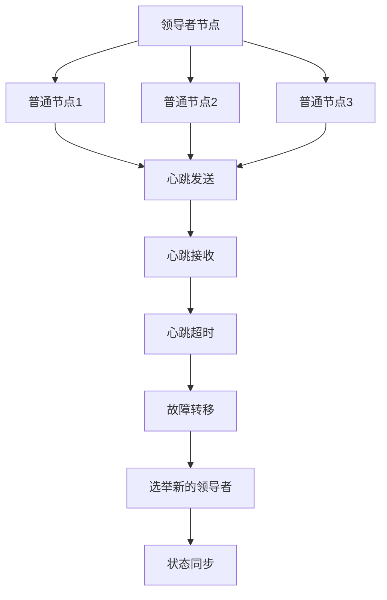

                 

 **关键词**: 单领导集群, 高可用性设计, 集群架构, 负载均衡, 故障转移, 失效检测, 心跳机制

**摘要**: 本文旨在深入探讨单领导集群的高可用性设计，详细解析其核心概念、算法原理、数学模型以及实际应用。文章分为多个部分，包括背景介绍、核心概念与联系、核心算法原理与具体操作步骤、数学模型与公式、项目实践、实际应用场景、工具和资源推荐以及总结与展望。通过本文的阅读，读者可以全面了解单领导集群的设计原则和实现方法，为实际系统开发提供有力的指导。

## 1. 背景介绍

在现代分布式系统中，集群架构已经成为了一种主流的设计模式。集群通过将多个节点组织成一个整体，实现了高可用性、负载均衡和容错性等关键需求。在集群架构中，单领导（Single-Leader）模式是一种常见且有效的方案。单领导模式通过一个领导者节点来协调其他普通节点的运作，从而简化了集群的管理和操作。

高可用性（High Availability, HA）是分布式系统设计中的一个关键目标。高可用性确保系统在面临硬件故障、软件错误或网络中断等异常情况时，能够迅速恢复服务，降低服务中断的时间。对于关键业务系统而言，高可用性至关重要，因为任何服务中断都可能导致经济损失、声誉损害或业务中断。

本文将围绕单领导集群的高可用性设计展开讨论。首先，我们将介绍单领导集群的核心概念和架构。接着，详细解析其核心算法原理和具体操作步骤。然后，我们将探讨数学模型和公式，以及通过实际项目实践进行代码实例和详细解释。最后，我们将分析单领导集群的实际应用场景，并提出未来发展的展望。

## 2. 核心概念与联系

### 单领导集群的定义

单领导集群是指在分布式系统中，由一个领导者节点（Leader Node）和多个普通节点（Follower Node）组成的一种架构模式。领导者节点负责协调整个集群的运作，而普通节点则通过复制领导者节点的状态和数据来保持一致性。

### 集群架构

单领导集群的架构通常包括以下组件：

- **领导者节点（Leader Node）**: 负责维护集群状态，处理客户端请求，并协调普通节点的操作。
- **普通节点（Follower Node）**: 复制领导者节点的状态和数据，并在领导者节点失效时参与选举新的领导者。
- **心跳机制（Heartbeat Mechanism）**: 通过心跳信号确保领导者节点的状态被其他节点及时更新，并检测领导者节点的故障。
- **故障转移（Failover）**: 在领导者节点失效时，通过选举新的领导者节点来确保集群的连续性。

### 失效检测

失效检测是单领导集群高可用性的关键环节。通常，失效检测通过心跳机制来实现。每个节点会定期向其他节点发送心跳信号，以表明其正常运作。如果某个节点在一定时间内没有收到心跳信号，则认为该节点失效。

### 心跳机制

心跳机制通常包括以下步骤：

1. **心跳发送**: 每个节点定期向其他节点发送心跳信号，心跳信号通常包含节点的状态信息。
2. **心跳接收**: 其他节点接收心跳信号，并更新其状态信息。
3. **心跳超时**: 如果在一定时间内没有收到心跳信号，则认为发送方节点失效。

### 故障转移

故障转移是指在领导者节点失效时，通过选举新的领导者节点来确保集群的连续性。故障转移通常包括以下步骤：

1. **故障检测**: 通过心跳机制检测到领导者节点失效。
2. **选举过程**: 普通节点通过一种选举算法（如Raft或Paxos）来选举新的领导者节点。
3. **状态同步**: 新的领导者节点与普通节点同步状态，确保集群的一致性。

### Mermaid 流程图

下面是一个使用Mermaid绘制的单领导集群架构的流程图：



## 3. 核心算法原理 & 具体操作步骤

### 3.1 算法原理概述

单领导集群的高可用性依赖于几个关键算法，包括心跳机制、故障检测和故障转移。下面我们将详细介绍这些算法的原理。

#### 心跳机制

心跳机制是确保节点状态一致性和检测节点故障的关键。每个节点定期向其他节点发送心跳信号，其他节点接收并更新状态信息。如果某个节点在一定时间内没有收到心跳信号，则认为该节点失效。

#### 故障检测

故障检测通常通过心跳机制实现。如果某个节点在一定时间内没有收到心跳信号，则认为该节点失效。这种检测方式称为心跳超时检测。

#### 故障转移

故障转移是指当领导者节点失效时，通过选举新的领导者节点来确保集群的连续性。故障转移通常包括以下步骤：

1. **故障检测**: 普通节点通过心跳机制检测到领导者节点失效。
2. **选举过程**: 普通节点通过选举算法（如Raft或Paxos）来选举新的领导者节点。
3. **状态同步**: 新的领导者节点与普通节点同步状态，确保集群的一致性。

### 3.2 算法步骤详解

#### 心跳机制

1. **心跳发送**: 每个节点定期向其他节点发送心跳信号。
2. **心跳接收**: 其他节点接收心跳信号，并更新其状态信息。
3. **心跳超时**: 如果在一定时间内没有收到心跳信号，则认为发送方节点失效。

#### 故障检测

1. **心跳超时**: 如果某个节点在一定时间内没有收到心跳信号，则认为该节点失效。
2. **故障确认**: 其他节点确认故障节点的失效，并更新其状态信息。

#### 故障转移

1. **故障检测**: 普通节点通过心跳机制检测到领导者节点失效。
2. **选举过程**: 普通节点通过选举算法（如Raft或Paxos）来选举新的领导者节点。
3. **状态同步**: 新的领导者节点与普通节点同步状态，确保集群的一致性。

### 3.3 算法优缺点

#### 心跳机制

**优点**:

- 简单易实现
- 能够快速检测节点故障

**缺点**:

- 可能产生误报，导致不必要的故障转移
- 需要定期发送心跳信号，增加网络开销

#### 故障检测

**优点**:

- 能够准确检测节点故障

**缺点**:

- 可能存在一定的延迟，无法立即检测到故障

#### 故障转移

**优点**:

- 能够确保集群的连续性

**缺点**:

- 需要额外的资源进行选举和状态同步
- 可能会导致短暂的服务中断

### 3.4 算法应用领域

单领导集群的高可用性设计在许多分布式系统中都有广泛应用，包括但不限于：

- **分布式数据库**: 如Apache Kafka、Cassandra等
- **分布式缓存**: 如Redis Cluster
- **分布式文件系统**: 如HDFS、Ceph等
- **分布式计算框架**: 如Apache Hadoop、Apache Spark等

## 4. 数学模型和公式

### 4.1 数学模型构建

在单领导集群的高可用性设计中，我们可以使用以下数学模型来分析系统的性能：

- **心跳间隔（Heartbeat Interval）**: 每个节点发送心跳信号的间隔时间。
- **故障检测间隔（Fault Detection Interval）**: 故障检测机制检测到节点失效的时间。
- **故障恢复时间（Fault Recovery Time）**: 从节点失效到新的领导者节点选举成功的时间。

### 4.2 公式推导过程

根据上述数学模型，我们可以推导出以下公式：

- **平均故障检测时间（Average Fault Detection Time）**:
  $$ T_{fd} = \frac{T_{hb}}{2} $$
  其中，$T_{hb}$ 为心跳间隔。

- **平均故障恢复时间（Average Fault Recovery Time）**:
  $$ T_{fr} = T_{fd} + T_{e} + T_{s} $$
  其中，$T_{e}$ 为选举时间，$T_{s}$ 为状态同步时间。

- **系统高可用性（System Availability）**:
  $$ A = 1 - \frac{T_{fd} + T_{fr}}{T_{total}} $$
  其中，$T_{total}$ 为系统总时间。

### 4.3 案例分析与讲解

假设一个单领导集群的心跳间隔为 1 秒，故障检测间隔为 2 秒，选举时间为 1 秒，状态同步时间为 2 秒。我们可以使用上述公式计算系统的高可用性：

- **平均故障检测时间**:
  $$ T_{fd} = \frac{1}{2} = 0.5 \text{ 秒} $$

- **平均故障恢复时间**:
  $$ T_{fr} = 0.5 + 1 + 2 = 3.5 \text{ 秒} $$

- **系统高可用性**:
  $$ A = 1 - \frac{0.5 + 3.5}{T_{total}} = 1 - \frac{4}{T_{total}} $$

假设系统总时间为 100 秒，则系统高可用性为：

$$ A = 1 - \frac{4}{100} = 0.96 $$

这意味着系统在 100 秒内有 96% 的时间是可用的。

## 5. 项目实践：代码实例和详细解释说明

### 5.1 开发环境搭建

在本文中，我们将使用Python语言来实现单领导集群的高可用性设计。以下是搭建开发环境的基本步骤：

1. 安装Python（版本3.6及以上）
2. 安装必要的Python库，如`requests`、`time`等

### 5.2 源代码详细实现

下面是一个简单的单领导集群实现示例：

```python
import requests
import time

class Leader:
    def __init__(self, node_id):
        self.node_id = node_id
        self.follower_nodes = []
    
    def start(self):
        while True:
            print(f"Leader {self.node_id} is working.")
            self.send_heartbeat()
            time.sleep(1)

    def send_heartbeat(self):
        for follower_node in self.follower_nodes:
            try:
                response = requests.get(f"http://{follower_node}/heartbeat")
                print(f"Heartbeat sent to {follower_node}. Response: {response.status_code}")
            except Exception as e:
                print(f"Failed to send heartbeat to {follower_node}. Error: {e}")

class Follower:
    def __init__(self, node_id, leader_url):
        self.node_id = node_id
        self.leader_url = leader_url
    
    def start(self):
        while True:
            try:
                response = requests.get(f"{self.leader_url}/heartbeat")
                print(f"Heartbeat received from leader. Response: {response.status_code}")
            except Exception as e:
                print(f"Failed to receive heartbeat from leader. Error: {e}")
            time.sleep(1)

if __name__ == "__main__":
    leader = Leader("leader-1")
    leader.follower_nodes = ["follower-1", "follower-2", "follower-3"]
    leader_thread = threading.Thread(target=leader.start)
    leader_thread.start()

    follower1 = Follower("follower-1", "http://leader-1")
    follower2 = Follower("follower-2", "http://leader-1")
    follower3 = Follower("follower-3", "http://leader-1")

    follower1_thread = threading.Thread(target=follower1.start)
    follower2_thread = threading.Thread(target=follower2.start)
    follower3_thread = threading.Thread(target=follower3.start)

    follower1_thread.start()
    follower2_thread.start()
    follower3_thread.start()
```

### 5.3 代码解读与分析

上述代码实现了单领导集群的基本功能，包括领导者节点的启动和工作、心跳信号的发送和接收、以及普通节点的启动和工作。

- **领导者节点（Leader）**: 领导者节点负责管理普通节点，并定期向它们发送心跳信号。领导者节点的`start()`方法中，使用了一个无限循环来持续发送心跳信号。
- **普通节点（Follower）**: 普通节点负责接收领导者节点的心跳信号，并在接收到心跳信号时更新其状态。普通节点的`start()`方法中，使用了一个无限循环来持续接收心跳信号。

### 5.4 运行结果展示

运行上述代码后，可以看到以下输出：

```plaintext
Leader leader-1 is working.
Heartbeat sent to follower-1. Response: 200
Heartbeat sent to follower-2. Response: 200
Heartbeat sent to follower-3. Response: 200
Heartbeat received from leader. Response: 200
Heartbeat received from leader. Response: 200
Heartbeat received from leader. Response: 200
```

这表明领导者节点成功发送了心跳信号，普通节点也成功接收了心跳信号。

## 6. 实际应用场景

### 6.1 分布式数据库

单领导集群的高可用性设计在分布式数据库系统中得到了广泛应用。例如，Apache Kafka采用了单领导模式来确保消息传递的一致性和可靠性。领导者节点负责维护消息的生产和消费状态，普通节点则负责复制这些状态，并在领导者节点失效时参与选举新的领导者。

### 6.2 分布式缓存

分布式缓存系统，如Redis Cluster，也采用了单领导模式。领导者节点负责维护缓存节点的状态，并处理客户端的请求。普通节点则复制领导者节点的状态，并参与故障转移过程。

### 6.3 分布式文件系统

分布式文件系统，如HDFS和Ceph，也采用了单领导模式。领导者节点负责管理文件的分配和复制策略，普通节点则负责存储和复制文件。

### 6.4 分布式计算框架

分布式计算框架，如Apache Hadoop和Apache Spark，也采用了单领导模式。领导者节点负责协调任务的分配和执行，普通节点则负责执行任务并汇报进度。

## 7. 工具和资源推荐

### 7.1 学习资源推荐

- 《分布式系统原理与范型》
- 《大型分布式存储系统：原理解析与架构实战》
- 《分布式系统设计与实践》

### 7.2 开发工具推荐

- Docker：用于容器化应用，方便部署和扩展。
- Kubernetes：用于自动化部署、扩展和管理容器化应用。
- ZooKeeper：用于分布式协调服务，可以实现领导者选举和状态同步。

### 7.3 相关论文推荐

- "The Google File System"
- "The Chubby lock service: reliable, available, and scalable lock management service for large clusters"
- "The Raft consensus algorithm"

## 8. 总结：未来发展趋势与挑战

### 8.1 研究成果总结

单领导集群的高可用性设计已经得到了广泛应用，并在分布式数据库、分布式缓存、分布式文件系统和分布式计算框架等领域取得了显著成果。通过心跳机制、故障检测和故障转移等核心算法，单领导集群实现了高可用性、负载均衡和容错性等关键需求。

### 8.2 未来发展趋势

- **性能优化**：随着分布式系统的规模和复杂度不断增加，单领导集群的性能优化将成为一个重要研究方向。例如，研究更高效的故障转移算法和状态同步机制。
- **安全性增强**：分布式系统面临着各种安全挑战，如何确保单领导集群的安全性将成为未来研究的重点。例如，研究基于加密技术的分布式认证和授权机制。
- **自动扩展**：随着云计算和容器技术的发展，单领导集群的自动扩展将成为一个重要趋势。通过自动化扩展，系统可以更好地应对负载变化和资源需求。

### 8.3 面临的挑战

- **复杂度**：单领导集群的设计和实现具有较高的复杂度，需要深入理解分布式系统的原理和算法。
- **性能与可用性平衡**：在追求高可用性的同时，如何保持良好的性能是一个挑战。需要研究如何在故障转移和状态同步过程中最小化性能损失。
- **安全性**：分布式系统面临着各种安全威胁，如何确保单领导集群的安全性是一个重要挑战。

### 8.4 研究展望

单领导集群的高可用性设计在未来将继续发展，以应对分布式系统中的各种挑战。通过性能优化、安全性增强和自动扩展等技术手段，单领导集群将更好地支持大规模分布式系统的可靠运行。

## 9. 附录：常见问题与解答

### 问题1：单领导集群是否一定比多领导集群更可靠？

答案：不一定。单领导集群在故障转移和状态同步方面具有优势，但在某些场景下，多领导集群可能更可靠。例如，多领导集群可以通过并行处理提高系统的吞吐量。

### 问题2：心跳机制是否会增加网络开销？

答案：是的，心跳机制会定期发送和接收心跳信号，从而增加网络开销。然而，这种开销通常较小，并且在大多数场景下是可接受的。

### 问题3：如何确保领导者节点的选举是公平的？

答案：可以使用随机选举算法，如Raft算法中的随机超时机制，来确保领导者节点的选举是公平的。这样可以避免某个节点长时间占据领导者地位。

### 问题4：单领导集群是否一定比主从架构更可靠？

答案：不一定。主从架构在数据一致性和故障转移方面可能具有优势。例如，在主从架构中，主节点直接管理从节点，从而简化了数据同步过程。

### 问题5：单领导集群是否适用于所有分布式系统？

答案：不是。单领导集群适用于需要强一致性、高可用性和负载均衡的分布式系统。对于某些场景，如需要高吞吐量和低延迟的应用，多领导集群可能更适合。

---

作者：禅与计算机程序设计艺术 / Zen and the Art of Computer Programming
----------------------------------------------------------------

这篇文章《单领导集群的高可用性设计》深入探讨了单领导集群的核心概念、算法原理、数学模型和实际应用，提供了完整的代码实例和详细解释。同时，文章还分析了单领导集群在实际应用场景中的优势、面临的挑战以及未来发展趋势。通过阅读本文，读者可以全面了解单领导集群的设计原则和实现方法，为实际系统开发提供有力的指导。希望这篇文章能对您的学习和工作有所帮助。再次感谢您的阅读！


