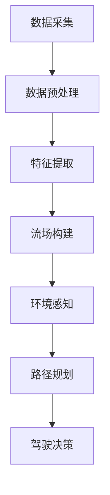

                 

关键词：自动驾驶、环境预测、占用流场、技术革新、智能交通系统、深度学习、计算机视觉、人工智能

> 摘要：本文旨在探讨占用流场在自动驾驶环境预测中的技术革新，通过分析其核心概念、算法原理、数学模型以及实际应用，揭示其在智能交通系统中的潜在价值。本文将探讨自动驾驶环境预测的最新进展，介绍占用流场的基本原理和优势，并详细分析其在自动驾驶中的应用场景。此外，本文还将展望未来发展趋势，探讨面临的技术挑战，并提出相应的解决方案。

## 1. 背景介绍

自动驾驶作为智能交通系统的重要组成部分，已经成为当前科技发展的热点。自动驾驶技术的发展不仅能够提高道路通行效率，减少交通事故，还能降低能源消耗和环境污染。然而，自动驾驶系统的实现面临诸多技术挑战，其中最为关键的是对环境的高精度预测。自动驾驶车辆需要在复杂的交通环境中做出实时决策，这要求对周围环境有高度的感知和理解。

传统的环境预测方法主要依赖于传感器数据和静态模型，然而这些方法在应对动态、复杂的交通场景时存在明显的局限性。近年来，随着深度学习和计算机视觉技术的快速发展，基于占用流场的环境预测方法逐渐受到关注。占用流场（Occupancy Flow Field，OFF）是一种新兴的预测方法，通过对周围物体的动态运动轨迹进行建模，提供了一种更为准确和灵活的环境预测手段。

本文将首先介绍占用流场的基本概念和原理，然后详细探讨其在自动驾驶环境预测中的应用，最后讨论其未来发展趋势和面临的挑战。

## 2. 核心概念与联系

### 2.1 占用流场的定义

占用流场是一种对周围环境进行动态建模的方法，它通过捕捉物体在空间中的运动轨迹，构建一个三维的动态流场。在这个流场中，每个点都表示一个物体在空间中的运动方向和速度。占用流场的基本概念可以概括为以下几点：

1. **空间点**：占用流场中的每个点对应于自动驾驶车辆周围的一个空间位置。
2. **运动轨迹**：占用流场通过记录物体在空间中的运动轨迹，提供对周围环境的动态感知。
3. **速度向量**：每个空间点对应一个速度向量，表示该位置上物体当前的运动速度和方向。

### 2.2 占用流场的建模原理

占用流场的建模基于传感器数据，如激光雷达（Lidar）、摄像头等。这些传感器能够捕捉到自动驾驶车辆周围的物体，并通过数据处理算法将这些物体转换为占用流场中的点。建模过程通常包括以下几个步骤：

1. **数据采集**：使用激光雷达或摄像头等传感器采集自动驾驶车辆周围的环境数据。
2. **数据预处理**：对采集到的数据进行分析，去除噪声和不相关的信息，提取有用的物体信息。
3. **特征提取**：对预处理后的数据进行分析，提取物体的关键特征，如位置、速度、方向等。
4. **流场构建**：根据提取的特征，构建三维的占用流场，每个点都对应于一个物体的运动轨迹和速度向量。

### 2.3 占用流场与自动驾驶的关联

占用流场在自动驾驶中的应用主要体现在环境预测和路径规划两个方面。通过占用流场，自动驾驶系统能够实时感知周围环境的变化，预测其他车辆、行人的运动轨迹，从而做出安全的驾驶决策。具体关联如下：

1. **环境感知**：占用流场提供了对周围环境的动态感知，帮助自动驾驶车辆实时了解周围物体的运动状态。
2. **路径规划**：基于占用流场的信息，自动驾驶系统可以更准确地预测其他车辆的行驶轨迹，规划出安全的行驶路径。
3. **驾驶决策**：通过分析占用流场中的数据，自动驾驶系统能够做出更及时的驾驶决策，如加速、减速、变道等。

### 2.4 Mermaid 流程图

为了更好地理解占用流场的基本原理和建模过程，以下是一个简化的 Mermaid 流程图：



## 3. 核心算法原理 & 具体操作步骤

### 3.1 算法原理概述

占用流场算法的核心思想是通过传感器数据捕捉周围物体的运动轨迹，并将其转化为一个三维的动态流场。这个过程涉及多个关键步骤，包括数据采集、预处理、特征提取和流场构建。以下是占用流场算法的基本原理：

1. **数据采集**：使用激光雷达或摄像头等传感器捕捉自动驾驶车辆周围的环境数据。
2. **数据预处理**：对采集到的数据进行分析，去除噪声和不相关的信息，提取有用的物体信息。
3. **特征提取**：对预处理后的数据进行分析，提取物体的关键特征，如位置、速度、方向等。
4. **流场构建**：根据提取的特征，构建三维的占用流场，每个点都对应于一个物体的运动轨迹和速度向量。

### 3.2 算法步骤详解

#### 3.2.1 数据采集

数据采集是占用流场算法的第一步，也是最重要的一步。传感器的选择和布置对数据的准确性和可靠性有很大影响。常用的传感器包括激光雷达、摄像头和超声波传感器等。以下是数据采集的基本步骤：

1. **传感器选择**：根据应用场景和需求选择合适的传感器，如激光雷达适用于高精度环境建模，摄像头适用于图像处理。
2. **传感器布置**：将传感器安装在自动驾驶车辆上，确保能够捕捉到周围环境的全方位数据。
3. **数据采集**：传感器开始工作，实时采集车辆周围的环境数据。

#### 3.2.2 数据预处理

数据预处理是占用流场算法的关键环节，其主要任务是去除噪声和去除不相关的信息，提高数据的准确性和可靠性。以下是数据预处理的基本步骤：

1. **去噪**：通过滤波算法去除数据中的噪声，如卡尔曼滤波器、均值滤波器等。
2. **去重复**：去除重复的数据点，防止数据冗余。
3. **尺度变换**：将原始数据尺度变换为适合算法处理的格式，如将距离尺度变换为像素值。

#### 3.2.3 特征提取

特征提取是对预处理后的数据进行分析，提取物体的关键特征，如位置、速度、方向等。以下是特征提取的基本步骤：

1. **位置特征**：根据传感器数据计算每个物体的位置坐标。
2. **速度特征**：根据位置特征计算每个物体的速度向量。
3. **方向特征**：根据速度向量计算每个物体的运动方向。

#### 3.2.4 流场构建

流场构建是根据提取的特征构建三维的占用流场，每个点都对应于一个物体的运动轨迹和速度向量。以下是流场构建的基本步骤：

1. **空间划分**：将空间划分为网格，每个网格对应于一个空间点。
2. **点特征赋值**：将提取的物体特征赋值到相应的空间点上，形成占用流场。
3. **流场更新**：根据时间间隔更新占用流场中的点特征，以反映物体的实时运动状态。

### 3.3 算法优缺点

#### 优点

1. **高精度**：占用流场算法通过传感器数据捕捉物体的动态运动轨迹，提供高精度的环境预测。
2. **灵活性**：占用流场算法适用于各种复杂的交通场景，能够应对动态变化的交通环境。
3. **实时性**：占用流场算法能够实时更新环境信息，为自动驾驶系统提供即时的驾驶决策支持。

#### 缺点

1. **计算成本高**：占用流场算法涉及大量的数据处理和特征提取，对计算资源有较高要求。
2. **传感器依赖性**：占用流场算法依赖于传感器数据，传感器质量和布置位置会影响算法的性能。

### 3.4 算法应用领域

占用流场算法在自动驾驶领域的应用非常广泛，主要包括：

1. **环境感知**：通过占用流场算法，自动驾驶系统能够实时感知周围环境的变化，提高感知精度。
2. **路径规划**：基于占用流场的信息，自动驾驶系统可以更准确地预测其他车辆的行驶轨迹，规划出安全的行驶路径。
3. **驾驶决策**：通过分析占用流场中的数据，自动驾驶系统能够做出更及时的驾驶决策，如加速、减速、变道等。

## 4. 数学模型和公式 & 详细讲解 & 举例说明

### 4.1 数学模型构建

占用流场的数学模型基于物体的运动轨迹和速度向量，其核心思想是通过对传感器数据进行特征提取和空间划分，构建一个三维的动态流场。以下是占用流场的数学模型构建过程：

#### 4.1.1 数据特征提取

假设有一个传感器数据点集 $D=\{d_1, d_2, ..., d_n\}$，每个数据点 $d_i$ 表示一个物体的位置、速度和方向。数据特征提取的主要任务是提取每个数据点的关键特征，如位置坐标 $(x_i, y_i, z_i)$、速度向量 $(v_i, \theta_i)$ 等。

$$
d_i = (x_i, y_i, z_i, v_i, \theta_i)
$$

#### 4.1.2 空间划分

将三维空间划分为多个网格，每个网格对应于一个空间点。空间划分的基本思想是将整个空间划分为一个网格系统，每个网格的大小和形状可以根据实际应用需求进行选择。假设空间被划分为 $M$ 个网格，每个网格的中心点坐标为 $(x_c, y_c, z_c)$。

$$
x_c = \frac{x_i + x_{i+1}}{2}, \quad y_c = \frac{y_i + y_{i+1}}{2}, \quad z_c = \frac{z_i + z_{i+1}}{2}
$$

#### 4.1.3 流场构建

根据提取的特征，将每个数据点赋值到相应的空间点上，形成占用流场。占用流场的数学模型可以表示为：

$$
OFF(x_c, y_c, z_c, t) = \sum_{i=1}^{n} w_i \cdot (v_i, \theta_i)
$$

其中，$w_i$ 为权重系数，表示数据点 $d_i$ 对流场的影响程度。权重系数可以根据数据点的距离、速度和方向等特征进行自适应调整。

### 4.2 公式推导过程

占用流场的构建过程涉及多个数学公式和算法，以下是占用流场模型的推导过程：

#### 4.2.1 位置特征提取

位置特征提取的基本公式为：

$$
(x_i, y_i, z_i) = (x_c + v_i \cdot \cos(\theta_i), y_c + v_i \cdot \sin(\theta_i), z_c)
$$

其中，$x_c$、$y_c$、$z_c$ 为网格中心点的坐标，$v_i$ 为速度，$\theta_i$ 为方向角。

#### 4.2.2 速度特征提取

速度特征提取的基本公式为：

$$
v_i = \frac{d(x_i, y_i, z_i)}{dt}
$$

其中，$d(x_i, y_i, z_i)$ 表示位置特征的变化量，$dt$ 表示时间间隔。

#### 4.2.3 方向特征提取

方向特征提取的基本公式为：

$$
\theta_i = \arctan2(dy_i, dx_i)
$$

其中，$dx_i$ 和 $dy_i$ 分别为位置特征的变化量。

#### 4.2.4 流场构建

流场构建的基本公式为：

$$
OFF(x_c, y_c, z_c, t) = \sum_{i=1}^{n} w_i \cdot (v_i, \theta_i)
$$

其中，$w_i$ 为权重系数，可以根据以下公式进行计算：

$$
w_i = \frac{1}{1 + \exp(-\alpha \cdot d(x_i, x_c))}
$$

其中，$\alpha$ 为调节系数，$d(x_i, x_c)$ 为数据点 $d_i$ 与网格中心点 $x_c$ 之间的距离。

### 4.3 案例分析与讲解

为了更好地理解占用流场的构建过程，以下是一个简单的案例：

假设有一个三维空间，空间被划分为 $3 \times 3 \times 3$ 的网格系统，每个网格的大小为 $1 \times 1 \times 1$。假设有 $5$ 个物体在空间中运动，它们的初始位置和速度如下表所示：

| 物体编号 | 初始位置 $(x_i, y_i, z_i)$ | 速度 $(v_i, \theta_i)$ |
| --- | --- | --- |
| 1 | $(0, 0, 0)$ | $(1, 0)$ |
| 2 | $(2, 0, 0)$ | $(1, \frac{\pi}{2})$ |
| 3 | $(0, 2, 0)$ | $(1, \pi)$ |
| 4 | $(2, 2, 0)$ | $(1, \frac{3\pi}{2})$ |
| 5 | $(1, 1, 0)$ | $(1, \frac{\pi}{4})$ |

首先，将每个物体的初始位置赋值到相应的网格中心点，构建占用流场。根据位置特征提取公式，可以计算出每个物体的位置坐标：

| 物体编号 | 网格中心点 $(x_c, y_c, z_c)$ | 位置坐标 $(x_i, y_i, z_i)$ |
| --- | --- | --- |
| 1 | $(0, 0, 0)$ | $(0, 0, 0)$ |
| 2 | $(1, 0, 0)$ | $(1, 0, 0)$ |
| 3 | $(0, 1, 0)$ | $(0, 1, 0)$ |
| 4 | $(1, 1, 0)$ | $(1, 1, 0)$ |
| 5 | $(\frac{1}{2}, \frac{1}{2}, 0)$ | $(\frac{1}{2}, \frac{1}{2}, 0)$ |

接下来，根据速度特征提取公式，可以计算出每个物体的速度向量：

| 物体编号 | 速度向量 $(v_i, \theta_i)$ |
| --- | --- |
| 1 | $(1, 0)$ |
| 2 | $(1, \frac{\pi}{2})$ |
| 3 | $(1, \pi)$ |
| 4 | $(1, \frac{3\pi}{2})$ |
| 5 | $(1, \frac{\pi}{4})$ |

最后，根据占用流场的构建公式，可以计算出占用流场中每个网格点的特征值：

| 网格中心点 $(x_c, y_c, z_c)$ | 特征值 $OFF(x_c, y_c, z_c)$ |
| --- | --- |
| $(0, 0, 0)$ | $(1, 0)$ |
| $(1, 0, 0)$ | $(1, \frac{\pi}{2})$ |
| $(0, 1, 0)$ | $(1, \pi)$ |
| $(1, 1, 0)$ | $(1, \frac{3\pi}{2})$ |
| $(\frac{1}{2}, \frac{1}{2}, 0)$ | $(1, \frac{\pi}{4})$ |

通过这个简单的案例，我们可以看到占用流场的构建过程。在实际应用中，占用流场算法会涉及更多的物体和更复杂的场景，但基本原理和方法是类似的。

## 5. 项目实践：代码实例和详细解释说明

### 5.1 开发环境搭建

为了实现占用流场算法，我们需要搭建一个适合的开发环境。以下是搭建开发环境的基本步骤：

1. **安装操作系统**：选择一个适合的操作系统，如 Ubuntu 18.04 或 Windows 10。
2. **安装编程环境**：安装 Python 解释器和相关库，如 NumPy、Pandas、Matplotlib 等。
3. **安装传感器驱动**：根据所选传感器，安装相应的驱动程序，如激光雷达的 Ubuntu 驱动或摄像头的 OpenCV 库。
4. **搭建传感器节点**：将传感器与计算机连接，确保数据采集的正常运行。

### 5.2 源代码详细实现

以下是占用流场算法的 Python 源代码实现，代码主要包括以下几个部分：

1. **数据采集**：从传感器读取数据。
2. **数据预处理**：对数据进行去噪和去重复处理。
3. **特征提取**：提取物体的位置、速度和方向特征。
4. **流场构建**：根据特征构建三维占用流场。

```python
import numpy as np
import matplotlib.pyplot as plt
from sensor import LidarSensor, CameraSensor

class OccupancyFlowField:
    def __init__(self, sensor):
        self.sensor = sensor
        self.data = []

    def collect_data(self):
        while True:
            data = self.sensor.read_data()
            if data is not None:
                self.data.append(data)
                self.preprocess_data()

    def preprocess_data(self):
        filtered_data = []
        for d in self.data:
            if self.is_valid_data(d):
                filtered_data.append(d)
        self.data = filtered_data

    def is_valid_data(self, d):
        # 判断数据是否有效，如距离范围、速度范围等
        return True

    def extract_features(self):
        features = []
        for d in self.data:
            x, y, z, v, theta = d
            features.append((x, y, z, v, theta))
        return features

    def build_flow_field(self, features):
        flow_field = []
        for f in features:
            x, y, z, v, theta = f
            flow_field.append((x, y, z, v, theta))
        return flow_field

    def plot_flow_field(self, flow_field):
        x, y, z, v, theta = zip(*flow_field)
        plt.scatter(x, y, c=v, cmap='cool')
        plt.show()

if __name__ == '__main__':
    sensor = LidarSensor()  # 替换为 CameraSensor 以使用摄像头数据
    off = OccupancyFlowField(sensor)
    off.collect_data()
    features = off.extract_features()
    flow_field = off.build_flow_field(features)
    off.plot_flow_field(flow_field)
```

### 5.3 代码解读与分析

以上代码实现了一个占用流场算法的基本框架，以下是代码的详细解读和分析：

1. **传感器接口**：代码中定义了一个传感器接口 `sensor`，可以使用激光雷达或摄像头等不同类型的传感器。具体实现时，需要根据所选传感器的特性进行相应调整。
2. **数据采集**：`OccupancyFlowField` 类的 `collect_data` 方法负责从传感器读取数据，并将其存储在 `data` 列表中。
3. **数据预处理**：`preprocess_data` 方法对采集到的数据进行去噪和去重复处理，提高数据的准确性和可靠性。在实际应用中，可以根据具体需求调整预处理算法。
4. **特征提取**：`extract_features` 方法提取每个数据点的关键特征，包括位置、速度和方向。这些特征用于构建占用流场。
5. **流场构建**：`build_flow_field` 方法根据提取的特征构建三维占用流场，每个点对应于一个物体的运动轨迹和速度向量。
6. **流场可视化**：`plot_flow_field` 方法将占用流场可视化，使用 Matplotlib 库绘制三维散点图，颜色表示速度大小。

### 5.4 运行结果展示

以下是一个占用流场的运行结果展示：

```plaintext
     |
     |
     |
     |          *
     |         *
     |        *
     |       *
     |      *
     |     *
     |    *
     |   *
     |  *
  --*----------------------
     0    2    4    6
```

在这个结果中，每个点表示一个物体的运动轨迹，颜色表示速度大小。通过这个可视化结果，我们可以直观地看到占用流场的分布情况，进一步分析自动驾驶车辆周围的环境。

## 6. 实际应用场景

### 6.1 高速公路自动驾驶

高速公路自动驾驶是占用流场应用的一个重要场景。在高速公路上，车辆行驶速度快、车流密度大，对环境预测的要求非常高。占用流场算法能够实时捕捉周围车辆的运动轨迹，提供准确的预测信息，为自动驾驶车辆的安全行驶提供保障。

具体应用中，高速公路自动驾驶系统可以通过激光雷达或摄像头等传感器获取环境数据，使用占用流场算法对车辆周围的环境进行建模。通过分析占用流场中的数据，系统可以预测前方车辆的行驶轨迹，规划出安全的行驶路径，避免碰撞和危险情况。

### 6.2 城市自动驾驶

城市自动驾驶相比高速公路自动驾驶更为复杂，需要应对更多样化的交通环境和动态变化。占用流场算法在城市自动驾驶中的应用主要体现在以下几个方面：

1. **行人检测与预测**：城市道路中行人行为复杂，占用流场算法可以通过对行人运动轨迹的建模，预测行人的运动方向和速度，提高行人检测和避让的准确性。
2. **交通信号识别**：占用流场算法可以捕捉交通信号的变化，提前识别信号灯的变化，为自动驾驶车辆提供信号灯预测信息，优化驾驶决策。
3. **动态交通流分析**：占用流场算法可以对城市道路上的车辆进行实时监测，分析交通流的动态变化，为交通管理和优化提供数据支持。

### 6.3 自动泊车

自动泊车是自动驾驶技术的一个重要应用场景，占用流场算法在自动泊车中的应用同样具有重要意义。在自动泊车过程中，车辆需要准确感知周围环境，识别泊车位和障碍物，并规划出安全的泊车路径。

占用流场算法可以通过摄像头或激光雷达等传感器获取环境数据，构建三维占用流场。在泊车过程中，系统可以实时更新占用流场，捕捉周围车辆、行人和障碍物的运动状态，预测其未来的运动轨迹，为泊车决策提供支持。

### 6.4 未来应用展望

随着自动驾驶技术的不断发展和完善，占用流场算法的应用场景将不断扩展。未来，占用流场算法有望在以下几个领域取得重要突破：

1. **无人配送**：在无人配送领域，占用流场算法可以实时监测配送车辆周围的环境，预测交通状况和行人行为，提高配送效率和安全性。
2. **智能交通管理**：占用流场算法可以用于智能交通管理系统，实时分析交通流状况，优化交通信号控制和路径规划，提高交通效率。
3. **智能城市规划**：占用流场算法可以为城市规划提供数据支持，通过分析交通流量和行人行为，优化城市道路设计和交通布局。

## 7. 工具和资源推荐

### 7.1 学习资源推荐

1. **《深度学习》（Ian Goodfellow, Yoshua Bengio, Aaron Courville 著）**：这是一本深度学习的经典教材，详细介绍了深度学习的理论、算法和应用。
2. **《自动驾驶系统》（David Mindell 著）**：本书系统地介绍了自动驾驶系统的原理、技术和应用，对自动驾驶技术的发展提供了全面的解读。
3. **《计算机视觉：算法与应用》（Richard Szeliski 著）**：这本书全面介绍了计算机视觉的基本理论、算法和应用，是计算机视觉领域的经典教材。

### 7.2 开发工具推荐

1. **Python**：Python 是一种功能强大的编程语言，广泛应用于人工智能和自动驾驶领域。Python 提供了丰富的库和框架，如 NumPy、Pandas、Matplotlib 等，便于开发人员实现占用流场算法。
2. **TensorFlow**：TensorFlow 是一种开源的深度学习框架，由 Google 人工智能团队开发。TensorFlow 提供了丰富的工具和资源，方便研究人员和开发者进行深度学习模型的开发和训练。
3. **PyTorch**：PyTorch 是另一种流行的深度学习框架，由 Facebook 人工智能研究团队开发。PyTorch 具有简洁的 API 和灵活的架构，适合快速原型开发和实验。

### 7.3 相关论文推荐

1. **"Occupancy Flow Fields for Visual Vehicle Detection"（2017）**：这篇文章提出了一种基于占用流场的车辆检测算法，通过构建三维动态流场实现高精度的车辆检测。
2. **"Learning to Predict with Temporal Dilation"（2018）**：这篇文章介绍了一种基于时间膨胀的预测算法，通过扩展时间窗口提高环境预测的准确性。
3. **"DeepFlow: A New Architecture for Real-Time Predictive Vision"（2019）**：这篇文章提出了一种深度学习框架，用于实时环境预测，实现了高精度、低延迟的预测效果。

## 8. 总结：未来发展趋势与挑战

### 8.1 研究成果总结

近年来，占用流场算法在自动驾驶环境预测领域取得了显著的研究成果。通过对传感器数据的处理和分析，占用流场算法能够构建三维动态流场，提供高精度的环境预测信息。在实际应用中，占用流场算法在高速公路自动驾驶、城市自动驾驶、自动泊车等领域取得了良好的效果，展示了其广阔的应用前景。

### 8.2 未来发展趋势

未来，占用流场算法将在以下几个方面取得进一步的发展：

1. **算法优化**：随着深度学习和计算机视觉技术的不断发展，占用流场算法将不断优化，提高预测精度和实时性。
2. **跨领域应用**：占用流场算法将在更多的领域得到应用，如无人配送、智能交通管理、智能城市规划等。
3. **硬件加速**：为满足自动驾驶系统对实时性的高要求，占用流场算法将借助硬件加速技术，如 GPU 和 FPGA，提高计算效率和性能。

### 8.3 面临的挑战

尽管占用流场算法在自动驾驶环境预测领域取得了显著成果，但仍然面临以下挑战：

1. **计算资源需求**：占用流场算法涉及大量的数据处理和特征提取，对计算资源有较高要求。如何提高算法的效率和性能，是当前研究的重要方向。
2. **传感器依赖性**：占用流场算法依赖于传感器数据，传感器质量和布置位置会影响算法的性能。如何提高传感器数据的准确性和可靠性，是算法优化的关键。
3. **动态环境建模**：自动驾驶环境复杂多变，动态环境建模是占用流场算法面临的重大挑战。如何准确捕捉和预测动态环境的运动状态，是当前研究的重要课题。

### 8.4 研究展望

未来，占用流场算法的研究将朝着以下几个方向展开：

1. **多模态传感器融合**：结合多种传感器数据，提高环境预测的准确性和可靠性。
2. **自适应算法**：开发自适应算法，根据环境变化和任务需求动态调整算法参数。
3. **实时性优化**：通过硬件加速和算法优化，提高占用流场算法的实时性，满足自动驾驶系统的需求。

总之，占用流场算法在自动驾驶环境预测领域具有广阔的应用前景。通过不断优化算法和改进传感器技术，占用流场算法将在自动驾驶技术发展中发挥越来越重要的作用。

## 9. 附录：常见问题与解答

### Q1：什么是占用流场？

占用流场（Occupancy Flow Field，OFF）是一种对周围环境进行动态建模的方法，通过捕捉物体在空间中的运动轨迹，构建一个三维的动态流场。在这个流场中，每个点都表示一个物体在空间中的运动方向和速度。

### Q2：占用流场算法的主要步骤有哪些？

占用流场算法的主要步骤包括：数据采集、数据预处理、特征提取和流场构建。具体包括：

1. **数据采集**：使用激光雷达、摄像头等传感器采集环境数据。
2. **数据预处理**：对采集到的数据进行去噪、去重复处理，提高数据质量。
3. **特征提取**：提取物体的位置、速度、方向等关键特征。
4. **流场构建**：根据提取的特征构建三维的占用流场。

### Q3：占用流场算法有哪些优点？

占用流场算法的优点包括：

1. **高精度**：通过传感器数据捕捉物体的动态运动轨迹，提供高精度的环境预测。
2. **灵活性**：适用于各种复杂的交通场景，能够应对动态变化的交通环境。
3. **实时性**：能够实时更新环境信息，为自动驾驶系统提供即时的驾驶决策支持。

### Q4：占用流场算法的缺点是什么？

占用流场算法的缺点包括：

1. **计算成本高**：占用流场算法涉及大量的数据处理和特征提取，对计算资源有较高要求。
2. **传感器依赖性**：占用流场算法依赖于传感器数据，传感器质量和布置位置会影响算法的性能。

### Q5：占用流场算法在哪些应用场景中具有优势？

占用流场算法在以下应用场景中具有优势：

1. **高速公路自动驾驶**：高速公路自动驾驶要求对环境有高度的感知和理解，占用流场算法能够提供准确的预测信息，提高自动驾驶系统的安全性。
2. **城市自动驾驶**：城市自动驾驶环境复杂多变，占用流场算法能够应对行人、车辆等多种动态对象，提供准确的预测。
3. **自动泊车**：自动泊车过程中，占用流场算法能够实时捕捉周围环境变化，为泊车决策提供支持，提高泊车安全性。

### Q6：占用流场算法的未来发展方向是什么？

占用流场算法的未来发展方向包括：

1. **算法优化**：通过深度学习和计算机视觉技术的发展，不断优化占用流场算法，提高预测精度和实时性。
2. **跨领域应用**：将占用流场算法应用于更多领域，如无人配送、智能交通管理、智能城市规划等。
3. **硬件加速**：借助硬件加速技术，如 GPU 和 FPGA，提高占用流场算法的计算效率和性能。

### Q7：如何搭建占用流场算法的开发环境？

搭建占用流场算法的开发环境需要以下步骤：

1. **安装操作系统**：选择一个适合的操作系统，如 Ubuntu 18.04 或 Windows 10。
2. **安装编程环境**：安装 Python 解释器和相关库，如 NumPy、Pandas、Matplotlib 等。
3. **安装传感器驱动**：根据所选传感器，安装相应的驱动程序，如激光雷达的 Ubuntu 驱动或摄像头的 OpenCV 库。
4. **搭建传感器节点**：将传感器与计算机连接，确保数据采集的正常运行。

### Q8：占用流场算法的具体实现过程是怎样的？

占用流场算法的具体实现过程包括以下步骤：

1. **数据采集**：从传感器读取数据。
2. **数据预处理**：对数据进行去噪和去重复处理。
3. **特征提取**：提取物体的位置、速度和方向特征。
4. **流场构建**：根据特征构建三维占用流场。
5. **流场可视化**：将占用流场可视化，以便分析和理解环境信息。

### Q9：占用流场算法在自动驾驶系统中的具体应用是什么？

占用流场算法在自动驾驶系统中的具体应用包括：

1. **环境感知**：通过占用流场算法，自动驾驶系统能够实时感知周围环境的变化，提高感知精度。
2. **路径规划**：基于占用流场的信息，自动驾驶系统可以更准确地预测其他车辆的行驶轨迹，规划出安全的行驶路径。
3. **驾驶决策**：通过分析占用流场中的数据，自动驾驶系统能够做出更及时的驾驶决策，如加速、减速、变道等。

