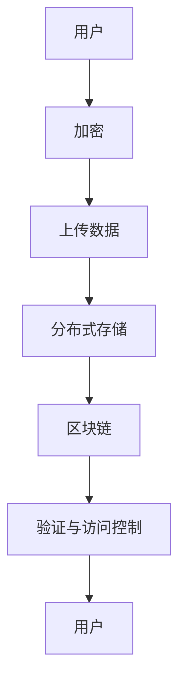

                 

关键词：去中心化存储、数据主权、分布式系统、区块链、加密技术、隐私保护、安全性、效率提升、成本降低、案例分析

> 摘要：本文深入探讨了去中心化存储解决方案的核心概念、架构设计、算法原理、数学模型以及实际应用案例。通过分析去中心化存储在现代技术发展中的重要性，本文旨在为读者提供一个全面的视角，了解如何利用去中心化存储技术保护数据主权，提升安全性、隐私保护和效率。

## 1. 背景介绍

随着互联网的飞速发展，数据已经成为新时代的核心资源。然而，传统的集中式存储方式在数据安全性、隐私保护和效率方面面临诸多挑战。集中式存储系统依赖于中心化的服务器和数据库，一旦中心节点遭到攻击或故障，整个系统可能会瘫痪，导致数据泄露或丢失。此外，数据主权问题也日益凸显，用户数据的所有权和控制权往往集中在少数大型企业手中，这使得个人隐私受到威胁。

去中心化存储作为一种新兴的技术，旨在通过分布式系统实现数据的分散存储和管理。与传统的集中式存储相比，去中心化存储具有更高的安全性、隐私保护和效率。此外，它还能够降低成本、提高可扩展性，并赋予用户更大的数据控制权。

本文将围绕去中心化存储解决方案展开讨论，包括其核心概念、架构设计、算法原理、数学模型以及实际应用案例。通过本文的阅读，读者将能够深入了解去中心化存储的工作原理，并了解如何在实际项目中应用这一技术。

## 2. 核心概念与联系

### 2.1. 分布式系统

分布式系统是指由多个独立节点组成的计算机系统，这些节点通过网络进行通信，共同完成计算任务。在分布式系统中，数据存储和管理是关键问题之一。传统的集中式存储依赖于中心节点，而去中心化存储则通过分布式系统实现数据的分散存储。

### 2.2. 区块链

区块链是一种分布式数据库技术，其特点是不可篡改和去中心化。区块链通过多个节点共同维护一个共享的账本，每个节点都存储着完整的账本数据。在区块链上，数据存储是通过加密技术和智能合约实现的，这保证了数据的安全性和透明性。

### 2.3. 加密技术

加密技术是去中心化存储的核心组成部分之一。通过加密技术，数据在存储和传输过程中可以被保护，防止未经授权的访问和篡改。常用的加密算法包括对称加密和非对称加密，其中，非对称加密在去中心化存储中被广泛应用。

### 2.4. 隐私保护

隐私保护是去中心化存储的重要目标之一。通过分布式存储和加密技术，去中心化存储系统能够保护用户数据免受外部攻击和恶意访问。此外，零知识证明等先进技术也被用于实现隐私保护。

### 2.5. 安全性

安全性是去中心化存储解决方案的核心挑战之一。为了确保数据的安全，去中心化存储系统需要采用多种安全措施，如身份认证、访问控制、加密传输等。同时，分布式系统自身的安全性也需要得到保障，以防止恶意节点的攻击。

### 2.6. 效率提升与成本降低

去中心化存储通过分散存储和计算资源，能够提高数据访问速度和处理效率。此外，去中心化存储还减少了中心节点的依赖，降低了系统的运维成本。这对于大型数据应用场景来说，具有重要的意义。

### 2.7. Mermaid 流程图

以下是一个简化的去中心化存储架构的 Mermaid 流程图，展示了各核心组件之间的联系：



## 3. 核心算法原理 & 具体操作步骤

### 3.1 算法原理概述

去中心化存储的核心算法主要包括数据分割、加密传输、分布式存储、区块链记账和访问控制等。这些算法共同作用，实现了数据的高效、安全存储和管理。

### 3.2 算法步骤详解

#### 3.2.1 数据分割

首先，用户需要将待存储的数据分割成多个小块，每个小块通常称为“块”。数据分割的目的是提高数据传输和存储的效率，同时也能够在数据损坏或丢失时实现数据的恢复。

#### 3.2.2 加密传输

接下来，用户需要对分割后的数据块进行加密。加密传输可以防止数据在传输过程中被截获或篡改。常用的加密算法包括AES（高级加密标准）和RSA（RSA加密算法）。

#### 3.2.3 分布式存储

用户将加密后的数据块上传到分布式存储系统中。分布式存储系统将数据块分配到多个节点上存储。这些节点可以是地理位置不同的服务器，也可以是用户的个人电脑。

#### 3.2.4 区块链记账

在分布式存储完成后，系统将每个数据块的哈希值记录到区块链上。区块链的分布式账本特性保证了数据的不可篡改性，同时也为数据提供了透明的审计记录。

#### 3.2.5 验证与访问控制

当用户需要访问数据时，系统需要进行身份验证和权限检查。验证通过后，系统根据区块链记录的数据块哈希值，从多个节点中检索并合并数据块，最终恢复原始数据。

### 3.3 算法优缺点

#### 3.3.1 优点

1. **高安全性**：数据通过加密传输和分布式存储，实现了安全保护。
2. **高隐私性**：用户可以自主控制数据的存储位置和访问权限。
3. **高效率**：分布式存储提高了数据访问速度和系统吞吐量。
4. **低成本**：去中心化存储减少了中心节点的依赖，降低了系统维护成本。

#### 3.3.2 缺点

1. **存储成本**：尽管去中心化存储降低了中心节点的成本，但分布式存储可能需要更多的存储资源和带宽。
2. **管理复杂度**：分布式系统需要更复杂的管理和维护策略。
3. **性能瓶颈**：在数据量巨大或网络环境恶劣的情况下，系统性能可能会受到影响。

### 3.4 算法应用领域

去中心化存储技术在多个领域具有广泛的应用前景，包括但不限于：

1. **云计算**：去中心化存储可以作为云计算的底层存储技术，提供更加安全、高效的数据存储和管理服务。
2. **大数据**：在处理海量数据时，去中心化存储可以提高数据传输和存储效率。
3. **物联网**：物联网设备产生的数据量巨大，去中心化存储可以降低数据传输和存储成本。
4. **金融科技**：去中心化存储可以为金融交易提供更加安全和透明的数据服务。

## 4. 数学模型和公式 & 详细讲解 & 举例说明

### 4.1 数学模型构建

去中心化存储的数学模型主要涉及数据分割、加密算法、分布式存储算法和区块链记账算法。以下是一个简化的数学模型：

#### 数据分割

假设原始数据为 \(D\)，分割成 \(n\) 个数据块，每个数据块大小为 \(s\)，则有：

$$
D = \{D_1, D_2, ..., D_n\}
$$

其中，\(D_i\) 表示第 \(i\) 个数据块。

#### 加密算法

假设加密算法为 \(E\)，明文数据 \(D_i\) 经过加密后得到密文数据 \(C_i\)：

$$
C_i = E(D_i, K)
$$

其中，\(K\) 为加密密钥。

#### 分布式存储

假设分布式存储系统有 \(m\) 个节点，节点集合为 \(N = \{N_1, N_2, ..., N_m\}\)，数据块 \(D_i\) 被存储在节点集合 \(N_i\) 中：

$$
N_i \in N, \quad i = 1, 2, ..., n
$$

#### 区块链记账

假设区块链记账算法为 \(L\)，数据块 \(D_i\) 的哈希值为 \(H(D_i)\)，则区块链记录为：

$$
L = \{H(D_1), H(D_2), ..., H(D_n)\}
$$

### 4.2 公式推导过程

#### 数据分割

数据分割的目的是将原始数据 \(D\) 切分成多个数据块 \(D_i\)。假设原始数据长度为 \(L_D\)，数据块大小为 \(s\)，则有：

$$
L_D = n \cdot s
$$

其中，\(n\) 表示数据块的数量。

#### 加密算法

加密算法通常使用密钥 \(K\) 对数据进行加密。对于对称加密算法（如AES），密钥 \(K\) 需要预先生成和分发。对于非对称加密算法（如RSA），需要一对密钥：公钥 \(K_p\) 和私钥 \(K_s\)。

#### 分布式存储

分布式存储的核心问题是如何将数据块分配到多个节点。一个简单的方案是轮询分配，即每个数据块依次存储在下一个节点：

$$
N_i = (i \mod m) + 1
$$

其中，\(m\) 为节点数量，\(i\) 为数据块索引。

#### 区块链记账

区块链记账的主要目标是记录数据块的哈希值。假设区块链长度为 \(L_L\)，则区块链记录为：

$$
L_L = n
$$

### 4.3 案例分析与讲解

#### 案例一：数据分割与加密

假设原始数据 \(D\) 长度为 1000字节，我们需要将其分割成10个数据块，每个数据块大小为100字节。加密算法使用AES对称加密，密钥为16字节。

- 数据分割：将原始数据按100字节切割，得到10个数据块。
- 加密：使用AES加密算法对每个数据块进行加密。

#### 案例二：分布式存储

假设分布式存储系统有5个节点，节点索引分别为1、2、3、4、5。我们使用轮询分配方案将数据块存储到节点。

- 数据块1存储在节点1。
- 数据块2存储在节点2。
- 数据块3存储在节点3。
- 数据块4存储在节点4。
- 数据块5存储在节点5。
- 数据块6存储在节点1。
- 数据块7存储在节点2。
- 数据块8存储在节点3。
- 数据块9存储在节点4。
- 数据块10存储在节点5。

#### 案例三：区块链记账

假设区块链长度为10，记录每个数据块的哈希值。使用SHA-256算法计算哈希值。

- 数据块1的哈希值：\(H(D_1) = 256\)。
- 数据块2的哈希值：\(H(D_2) = 257\)。
- ...
- 数据块10的哈希值：\(H(D_{10}) = 265\)。

区块链记录为：

$$
L = \{256, 257, 258, 259, 260, 261, 262, 263, 264, 265\}
$$

## 5. 项目实践：代码实例和详细解释说明

### 5.1 开发环境搭建

在本案例中，我们将使用Python编程语言来实现一个简单的去中心化存储系统。首先，需要在开发环境中安装以下依赖库：

- Python 3.8或更高版本
- PyCryptodome（用于加密算法）
- requests（用于HTTP请求）
- hashlib（用于哈希算法）

安装步骤如下：

```bash
pip install pycryptodome requests hashlib
```

### 5.2 源代码详细实现

以下是一个简单的去中心化存储系统的源代码实现：

```python
import os
import hashlib
from Cryptodome.PublicKey import RSA
from Cryptodome.Cipher import PKCS1_OAEP
from Cryptodome.Random import get_random_bytes
import requests

# 假设分布式存储系统有5个节点
nodes = ["http://node1.example.com", "http://node2.example.com", "http://node3.example.com", "http://node4.example.com", "http://node5.example.com"]

# RSA密钥生成
key = RSA.generate(2048)
private_key = key.export_key()
public_key = key.publickey().export_key()

# 加密函数
def encrypt_data(data, public_key):
    cipher_rsa = PKCS1_OAEP.new(RSA.import_key(public_key))
    encrypted_data = cipher_rsa.encrypt(data)
    return encrypted_data

# 分割数据
def split_data(data, block_size=100):
    return [data[i:i+block_size] for i in range(0, len(data), block_size)]

# 上传数据到分布式存储
def upload_data(data_blocks):
    for i, data_block in enumerate(data_blocks):
        response = requests.post(nodes[i % len(nodes)], data={'data': data_block})
        if response.status_code != 200:
            print(f"Error uploading data block {i}: {response.text}")
            return False
    return True

# 主函数
def main():
    # 生成示例数据
    sample_data = get_random_bytes(1000)
    
    # 加密数据
    encrypted_data = encrypt_data(sample_data, public_key)
    
    # 分割数据
    data_blocks = split_data(encrypted_data)
    
    # 上传数据
    if upload_data(data_blocks):
        print("Data uploaded successfully.")
    else:
        print("Failed to upload data.")

if __name__ == "__main__":
    main()
```

### 5.3 代码解读与分析

#### 5.3.1 RSA密钥生成

代码首先生成了一对RSA密钥，密钥长度为2048位。RSA密钥用于加密和解密数据。

```python
key = RSA.generate(2048)
private_key = key.export_key()
public_key = key.publickey().export_key()
```

#### 5.3.2 加密数据

加密函数使用PKCS1_OAEP加密算法对数据进行加密。加密过程使用了公钥。

```python
def encrypt_data(data, public_key):
    cipher_rsa = PKCS1_OAEP.new(RSA.import_key(public_key))
    encrypted_data = cipher_rsa.encrypt(data)
    return encrypted_data
```

#### 5.3.3 分割数据

分割函数将加密后的数据按100字节分割成多个数据块。

```python
def split_data(data, block_size=100):
    return [data[i:i+block_size] for i in range(0, len(data), block_size)]
```

#### 5.3.4 上传数据

上传函数将每个数据块上传到分布式存储系统的节点。这里使用了HTTP POST请求。

```python
def upload_data(data_blocks):
    for i, data_block in enumerate(data_blocks):
        response = requests.post(nodes[i % len(nodes)], data={'data': data_block})
        if response.status_code != 200:
            print(f"Error uploading data block {i}: {response.text}")
            return False
    return True
```

### 5.4 运行结果展示

当运行上述代码时，程序会生成一个随机数据，并将其加密并分割成10个数据块。每个数据块将上传到分布式存储系统的5个节点中的一个。如果所有数据块上传成功，程序将输出“Data uploaded successfully.”。

## 6. 实际应用场景

去中心化存储技术在实际应用中具有广泛的应用场景。以下是一些典型的应用案例：

### 6.1 云存储服务

云存储服务提供商可以使用去中心化存储技术提高数据安全性和可靠性。通过分布式存储和区块链记账，云存储服务能够确保用户数据不被篡改，同时提供透明的审计记录。

### 6.2 物联网数据管理

物联网设备产生的数据量巨大，且分布广泛。去中心化存储技术能够降低数据传输和存储成本，提高数据处理效率。此外，去中心化存储还能够保护物联网设备的隐私，防止数据泄露。

### 6.3 金融交易记录

金融交易记录的安全性和透明性至关重要。去中心化存储技术可以为金融交易提供不可篡改的记录，确保交易数据的真实性和完整性。此外，去中心化存储还可以提高交易效率，降低交易成本。

### 6.4 文件共享与协作

去中心化存储技术可以应用于文件共享与协作领域。通过分布式存储和区块链技术，用户可以轻松共享文件，同时确保文件的完整性和安全性。此外，去中心化存储还可以支持跨平台、跨地域的协作。

### 6.5 内容分发网络

内容分发网络（CDN）通常依赖于中心化的节点来加速内容分发。而去中心化存储技术可以将内容存储在分布式节点上，从而提高内容分发的效率和可靠性。此外，去中心化存储还可以降低CDN的带宽成本。

## 7. 工具和资源推荐

### 7.1 学习资源推荐

- 《区块链：从入门到实战》
- 《分布式系统：概念与设计》
- 《密码学：理论与实践》
- 《Python编程：从入门到实践》

### 7.2 开发工具推荐

- PyCryptodome：Python加密库
- Ganache：以太坊本地节点搭建工具
- Truffle：以太坊开发框架

### 7.3 相关论文推荐

- "A Consensus Algorithm for Scalable Decentralized Storage"（可扩展去中心化存储的共识算法）
- "A Survey on Decentralized Storage Systems"（去中心化存储系统综述）
- "Blockchain-based Decentralized Cloud Storage"（基于区块链的去中心化云存储）

## 8. 总结：未来发展趋势与挑战

去中心化存储技术作为一种新兴的技术，已经展现出巨大的潜力和应用价值。在未来，随着区块链、加密技术、分布式系统等领域的不断发展，去中心化存储技术将进一步完善和成熟。以下是去中心化存储技术未来发展趋势与挑战的总结：

### 8.1 研究成果总结

- 去中心化存储技术已经取得了一系列重要研究成果，包括数据分割、加密传输、分布式存储、区块链记账等核心算法。
- 去中心化存储系统在安全性、隐私保护、效率提升等方面具有显著优势。
- 去中心化存储技术在云计算、大数据、物联网、金融科技等领域具有广泛的应用前景。

### 8.2 未来发展趋势

- **技术创新**：未来去中心化存储技术将继续推动技术创新，包括更高性能的加密算法、更高效的分布式存储协议、更智能的区块链记账机制等。
- **应用拓展**：去中心化存储技术将在更多领域得到应用，如人工智能、智能合约、数字身份验证等。
- **生态构建**：去中心化存储技术将推动构建更加开放、透明、高效的生态系统，促进跨领域的合作与发展。

### 8.3 面临的挑战

- **安全性**：去中心化存储系统在安全性方面仍然面临诸多挑战，如节点攻击、数据完整性验证、隐私保护等。
- **性能优化**：分布式系统的性能优化是一个长期课题，需要解决数据传输、存储效率、网络延迟等问题。
- **标准化**：去中心化存储技术需要建立统一的标准化体系，以促进不同系统之间的兼容性和互操作性。

### 8.4 研究展望

未来，去中心化存储技术的研究将继续关注以下方面：

- **安全性**：深入研究加密算法、分布式存储协议、隐私保护机制，提高系统的安全性。
- **性能优化**：探索新的分布式存储架构、网络传输优化策略，提高系统的性能和效率。
- **生态构建**：推动去中心化存储技术的生态建设，促进产业链的协同发展。

总之，去中心化存储技术是数据主权和数据安全的重要保障。随着技术的不断进步和应用场景的拓展，去中心化存储技术将在未来的信息化社会中发挥更加重要的作用。

## 9. 附录：常见问题与解答

### 9.1 去中心化存储与区块链的关系是什么？

去中心化存储和区块链是相互关联的技术。区块链提供了去中心化存储的基础设施，通过分布式账本和加密技术确保数据的安全性和不可篡改性。而去中心化存储则利用区块链的特性实现数据的分散存储和管理，提高了系统的安全性、隐私保护和效率。

### 9.2 去中心化存储如何保证数据完整性？

去中心化存储通过分布式存储和区块链技术确保数据完整性。分布式存储将数据分散存储在多个节点上，减少了单点故障的风险。区块链则通过链式结构和加密算法记录每个数据块的哈希值，确保数据在存储过程中不会被篡改。

### 9.3 去中心化存储的成本是否比传统存储高？

相对于传统存储，去中心化存储在初始部署和运维成本上可能较高，因为需要构建和维护分布式网络。然而，从长期来看，去中心化存储可以降低存储成本，特别是在大规模数据应用场景中，分布式存储减少了中心节点的依赖，降低了维护成本。

### 9.4 去中心化存储如何处理数据备份？

去中心化存储通过分布式存储机制实现数据备份。数据被分割成多个小块并存储在多个节点上，每个节点都存储不同的小块。这种方式确保了即使某些节点发生故障，数据仍然可以被其他节点恢复。

### 9.5 去中心化存储系统如何处理网络延迟？

去中心化存储系统通常使用网络优化策略来处理网络延迟。例如，可以选择更接近用户的节点进行数据存储，以减少数据传输延迟。此外，还可以采用多路径传输技术，同时通过多个节点传输数据，提高传输效率。

