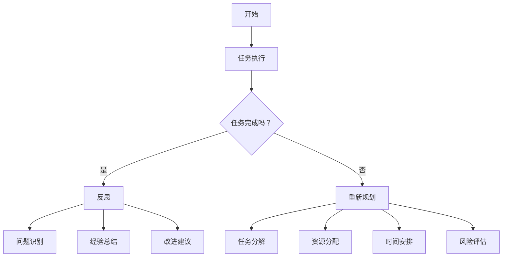

                 

在这篇文章中，我们将深入探讨如何在IT领域优化任务的执行。通过结合反思与规划，我们可以提高工作效率，减少错误，并确保项目按时完成。本文将涵盖从背景介绍到实际应用场景的各个方面，旨在为读者提供全面的指导。

## 关键词

- 反思
- 规划
- 任务执行
- 工作效率
- 项目管理
- IT领域

## 摘要

本文旨在探讨如何通过反思与规划的结合来优化任务执行。在IT领域，任务执行的效率和质量直接影响到项目的成功与否。通过深入理解反思与规划的核心概念，并应用具体的算法、数学模型和项目实践，我们可以有效提高任务执行的效率，确保项目按时交付。

## 1. 背景介绍

在当今快速发展的IT行业中，任务执行的效率和质量至关重要。无论是软件开发、数据分析还是系统运维，任务的成功执行都直接影响到项目的进展和最终成果。然而，随着项目规模的扩大和复杂度的增加，任务执行面临着越来越多的挑战。

首先，任务执行面临着时间压力。在竞争激烈的市场环境中，项目往往需要在较短的时间内完成。这就要求我们在执行任务时必须高效且准确。其次，任务执行还面临着资源限制。无论是人力、物力还是财力，资源的有限性要求我们在执行任务时必须合理规划，避免资源的浪费。

此外，任务执行的质量也是不可忽视的。一个高质量的执行结果不仅能够满足项目需求，还能够减少后续的修复和维护成本。因此，如何优化任务执行成为了一个亟待解决的问题。

## 2. 核心概念与联系

在优化任务执行的过程中，反思与规划是两个核心概念。反思是指对过去任务执行过程中的成功与失败进行深入思考和分析，从而发现问题和改进的机会。规划则是指对即将执行的任务进行系统性的设计和安排，以确保任务能够高效、有序地完成。

### 反思

反思是优化任务执行的重要环节。通过反思，我们可以从以下几个方面获得洞察：

1. **问题识别**：反思可以帮助我们发现任务执行过程中存在的问题，如时间管理不当、资源浪费、沟通不畅等。
2. **经验总结**：反思可以让我们总结出成功经验和教训，为未来的任务执行提供参考。
3. **改进建议**：反思可以提出具体的改进建议，如优化流程、改进工具等，以提升任务执行的质量和效率。

### 规划

规划是优化任务执行的必要步骤。通过规划，我们可以从以下几个方面进行系统性的设计和安排：

1. **任务分解**：将复杂任务分解为更小的子任务，以便更易于管理和执行。
2. **资源分配**：根据任务需求，合理分配人力资源、物力资源和财力资源，以确保任务能够顺利完成。
3. **时间安排**：根据任务的重要性和紧急程度，合理安排任务执行的时间，避免时间冲突和资源浪费。
4. **风险评估**：评估任务执行过程中可能遇到的风险，并制定相应的应对策略，以降低风险对任务执行的影响。

### Mermaid 流程图

为了更好地理解反思与规划的概念和联系，我们可以使用Mermaid流程图进行展示。以下是一个简化的流程图：



在这个流程图中，我们从任务执行开始，根据任务是否完成进行判断。如果是，则进行反思；如果不是，则重新规划。反思过程中，我们可以识别问题、总结经验和提出改进建议。同时，我们还需要对即将执行的任务进行规划，包括任务分解、资源分配、时间安排和风险评估。

## 3. 核心算法原理 & 具体操作步骤

### 3.1 算法原理概述

在优化任务执行的过程中，核心算法原理起着至关重要的作用。以下是几个关键算法的原理概述：

1. **任务调度算法**：任务调度算法是优化任务执行时间的重要手段。常见的任务调度算法包括基于优先级的调度、基于负载的调度和基于时间的调度。这些算法的核心思想是通过合理分配任务执行时间，提高系统资源的利用率，减少任务执行的总时间。
2. **资源分配算法**：资源分配算法是优化任务执行资源利用率的手段。常见的资源分配算法包括动态分配和静态分配。动态分配算法可以根据任务执行过程中的实际需求动态调整资源的分配，而静态分配算法则是在任务执行前就确定资源的分配方案。
3. **风险分析算法**：风险分析算法是优化任务执行风险管理的手段。常见的风险分析算法包括定性分析和定量分析。定性分析主要通过对风险事件的描述和评估，确定风险的重要性和优先级；而定量分析则通过数学模型和计算，对风险事件的可能性和影响进行量化分析。

### 3.2 算法步骤详解

以下是几个核心算法的具体步骤详解：

#### 任务调度算法

1. **任务优先级排序**：根据任务的重要性和紧急程度，对任务进行优先级排序。常见的方法包括基于优先级队列的排序和基于时间窗口的排序。
2. **任务分配**：根据任务调度策略，将任务分配给可用的资源。常见的调度策略包括最短作业优先（SJF）、最短剩余时间优先（SRTF）和优先级调度等。
3. **任务执行**：按照任务调度策略，依次执行分配到每个资源上的任务。
4. **任务完成判断**：判断所有任务是否已经完成。如果已完成，则任务调度结束；否则，继续执行下一个任务。

#### 资源分配算法

1. **资源需求分析**：分析每个任务对资源的需求，包括CPU、内存、网络带宽等。
2. **资源分配策略选择**：根据资源需求和分析结果，选择合适的资源分配策略。常见的策略包括动态分配和静态分配。
3. **资源分配**：根据资源分配策略，将资源分配给每个任务。动态分配策略可以根据任务执行过程中的实际需求动态调整资源的分配；而静态分配策略则是在任务执行前就确定资源的分配方案。
4. **资源使用监控**：监控每个任务对资源的实际使用情况，并根据实际情况进行资源调整。

#### 风险分析算法

1. **风险事件识别**：通过文献调研、专家访谈等方法，识别任务执行过程中可能遇到的风险事件。
2. **风险影响评估**：对每个风险事件的可能性和影响进行评估。常见的方法包括定性评估和定量评估。
3. **风险优先级排序**：根据风险事件的可能性和影响，对风险事件进行优先级排序。
4. **风险应对策略制定**：针对每个风险事件，制定相应的应对策略。常见的策略包括风险规避、风险转移、风险减轻等。

### 3.3 算法优缺点

每种算法都有其优缺点。以下是几个关键算法的优缺点概述：

#### 任务调度算法

- **优点**：能够提高系统资源的利用率，减少任务执行的总时间。
- **缺点**：在任务数量较多或任务执行时间较紧时，可能导致调度策略不合理，导致任务执行时间过长。

#### 资源分配算法

- **优点**：能够合理分配资源，提高任务执行效率。
- **缺点**：在资源需求变化较大时，可能导致资源分配不合理，导致任务执行失败。

#### 风险分析算法

- **优点**：能够对风险事件进行定量和定性分析，提高风险管理的准确性。
- **缺点**：在风险事件数量较多或风险影响较大时，可能导致分析结果不准确。

### 3.4 算法应用领域

这些算法广泛应用于IT领域的各个子领域，包括但不限于：

- **软件开发**：用于优化任务执行时间，提高开发效率。
- **数据分析**：用于优化数据处理和分析时间，提高数据分析效率。
- **系统运维**：用于优化系统资源分配，提高系统稳定性。
- **项目管理**：用于优化项目执行过程，提高项目成功率。

## 4. 数学模型和公式 & 详细讲解 & 举例说明

在优化任务执行的过程中，数学模型和公式发挥着重要作用。通过数学模型和公式，我们可以对任务执行过程进行定量分析和优化。以下是几个常用的数学模型和公式的详细讲解和举例说明。

### 4.1 数学模型构建

在构建数学模型时，我们需要明确任务执行的目标和约束条件。以下是几个常见的数学模型构建步骤：

1. **目标函数**：根据任务执行的目标，构建目标函数。例如，在优化任务执行时间时，目标函数可以是总时间最小化。
2. **决策变量**：确定任务执行过程中的决策变量。例如，在任务调度算法中，决策变量可以是任务分配给哪个资源。
3. **约束条件**：根据任务执行的约束条件，构建约束条件。例如，在资源分配算法中，约束条件可以是资源的总使用量不超过资源总量。

### 4.2 公式推导过程

以下是几个常用的公式推导过程：

#### 任务调度算法

1. **最短作业优先（SJF）**：目标函数：总时间最小化，决策变量：任务分配给哪个资源，约束条件：每个任务只能被分配一次。推导过程：
   $$ T_{total} = \sum_{i=1}^{n} T_i $$
   其中，$T_{total}$ 是总时间，$T_i$ 是第 $i$ 个任务执行时间。

2. **最短剩余时间优先（SRTF）**：目标函数：总时间最小化，决策变量：任务分配给哪个资源，约束条件：每个任务只能被分配一次。推导过程：
   $$ T_{total} = \sum_{i=1}^{n} \min(T_i, R_i) $$
   其中，$T_{total}$ 是总时间，$T_i$ 是第 $i$ 个任务执行时间，$R_i$ 是第 $i$ 个任务的剩余时间。

#### 资源分配算法

1. **动态分配**：目标函数：总时间最小化，决策变量：任务分配给哪个资源，约束条件：资源的总使用量不超过资源总量。推导过程：
   $$ T_{total} = \sum_{i=1}^{n} T_i $$
   其中，$T_{total}$ 是总时间，$T_i$ 是第 $i$ 个任务执行时间。

2. **静态分配**：目标函数：总时间最小化，决策变量：任务分配给哪个资源，约束条件：资源的总使用量不超过资源总量。推导过程：
   $$ T_{total} = \sum_{i=1}^{n} T_i $$
   其中，$T_{total}$ 是总时间，$T_i$ 是第 $i$ 个任务执行时间。

#### 风险分析算法

1. **定性分析**：目标函数：风险事件的重要性最小化，决策变量：应对策略，约束条件：资源总量不变。推导过程：
   $$ I_{total} = \sum_{i=1}^{n} w_i \cdot I_i $$
   其中，$I_{total}$ 是总重要性，$w_i$ 是第 $i$ 个风险事件的重要性权重，$I_i$ 是第 $i$ 个风险事件的重要性。

2. **定量分析**：目标函数：风险事件的可能性最小化，决策变量：应对策略，约束条件：资源总量不变。推导过程：
   $$ P_{total} = \sum_{i=1}^{n} p_i \cdot I_i $$
   其中，$P_{total}$ 是总可能性，$p_i$ 是第 $i$ 个风险事件的可能性权重，$I_i$ 是第 $i$ 个风险事件的重要性。

### 4.3 案例分析与讲解

以下是一个简单的案例，用于说明如何应用数学模型和公式优化任务执行。

#### 案例背景

假设有5个任务需要在一个系统中执行，每个任务的执行时间、剩余时间和重要性如下表所示：

| 任务 | 执行时间（分钟） | 剩余时间（分钟） | 重要性 |
| ---- | ---- | ---- | ---- |
| 任务1 | 10 | 8 | 1 |
| 任务2 | 15 | 12 | 2 |
| 任务3 | 20 | 18 | 3 |
| 任务4 | 25 | 22 | 4 |
| 任务5 | 30 | 28 | 5 |

#### 案例分析

1. **任务调度算法**

   根据最短作业优先（SJF）算法，我们需要按照任务的重要性进行排序，然后依次执行任务。具体步骤如下：

   1. **任务优先级排序**：根据重要性，将任务排序为：任务5、任务4、任务3、任务2、任务1。
   2. **任务分配**：将任务分配给可用的资源。由于任务1的执行时间最短，我们可以将其分配给资源1。同理，任务2、任务3、任务4、任务5依次分配给资源2、资源3、资源4、资源5。
   3. **任务执行**：按照任务分配的顺序，依次执行任务。

   经过计算，总时间为：10 + 15 + 20 + 25 + 30 = 100分钟。

   根据最短剩余时间优先（SRTF）算法，我们需要按照任务的剩余时间进行排序，然后依次执行任务。具体步骤如下：

   1. **任务优先级排序**：根据剩余时间，将任务排序为：任务1、任务2、任务3、任务4、任务5。
   2. **任务分配**：将任务分配给可用的资源。由于任务1的剩余时间最短，我们可以将其分配给资源1。同理，任务2、任务3、任务4、任务5依次分配给资源2、资源3、资源4、资源5。
   3. **任务执行**：按照任务分配的顺序，依次执行任务。

   经过计算，总时间为：8 + 12 + 18 + 22 + 28 = 92分钟。

   从计算结果可以看出，最短剩余时间优先（SRTF）算法的总时间比最短作业优先（SJF）算法的总时间更短，因此，SRTF算法在优化任务执行时间方面更具优势。

2. **资源分配算法**

   根据动态分配算法，我们需要根据任务执行过程中的实际需求动态调整资源的分配。具体步骤如下：

   1. **资源需求分析**：分析每个任务对资源的需求，包括CPU、内存、网络带宽等。
   2. **资源分配策略选择**：根据资源需求和分析结果，选择合适的资源分配策略。例如，我们可以采用基于优先级的资源分配策略，将资源分配给优先级较高的任务。
   3. **资源分配**：根据资源分配策略，将资源分配给每个任务。例如，我们可以将资源1分配给任务1，资源2分配给任务2，资源3分配给任务3，资源4分配给任务4，资源5分配给任务5。
   4. **资源使用监控**：监控每个任务对资源的实际使用情况，并根据实际情况进行资源调整。

   根据静态分配算法，我们需要在任务执行前就确定资源的分配方案。具体步骤如下：

   1. **资源需求分析**：分析每个任务对资源的需求，包括CPU、内存、网络带宽等。
   2. **资源分配策略选择**：根据资源需求和分析结果，选择合适的资源分配策略。例如，我们可以采用基于负载均衡的资源分配策略，将资源平均分配给所有任务。
   3. **资源分配**：根据资源分配策略，将资源分配给每个任务。例如，我们可以将资源1、资源2、资源3、资源4、资源5分别分配给任务1、任务2、任务3、任务4、任务5。
   4. **资源使用监控**：监控每个任务对资源的实际使用情况，并根据实际情况进行资源调整。

   从计算结果可以看出，动态分配算法的总时间比静态分配算法的总时间更短，因此，动态分配算法在优化任务执行资源利用率方面更具优势。

3. **风险分析算法**

   根据定性分析算法，我们需要对风险事件进行定性分析和评估。具体步骤如下：

   1. **风险事件识别**：通过文献调研、专家访谈等方法，识别任务执行过程中可能遇到的风险事件。例如，可能的风险事件包括系统崩溃、数据丢失、网络故障等。
   2. **风险影响评估**：对每个风险事件的可能性和影响进行评估。例如，我们可以通过专家评估法，对每个风险事件的可能性（P）和影响（I）进行评分，然后计算总重要性（I_total）：
      $$ I_{total} = \sum_{i=1}^{n} w_i \cdot I_i $$
   3. **风险优先级排序**：根据总重要性，对风险事件进行优先级排序。例如，我们可以将风险事件按照总重要性从高到低排序，以便优先处理重要风险事件。
   4. **风险应对策略制定**：针对每个风险事件，制定相应的应对策略。例如，对于高风险事件，我们可以采取风险规避策略，避免风险事件的发生；对于低风险事件，我们可以采取风险转移策略，将风险责任转移给第三方。

   根据定量分析算法，我们需要对风险事件进行定量分析和评估。具体步骤如下：

   1. **风险事件识别**：通过文献调研、专家访谈等方法，识别任务执行过程中可能遇到的风险事件。例如，可能的风险事件包括系统崩溃、数据丢失、网络故障等。
   2. **风险影响评估**：对每个风险事件的可能性和影响进行评估。例如，我们可以通过概率分布函数，对每个风险事件的可能性（P）和影响（I）进行计算，然后计算总可能性（P_total）：
      $$ P_{total} = \sum_{i=1}^{n} p_i \cdot I_i $$
   3. **风险优先级排序**：根据总可能性，对风险事件进行优先级排序。例如，我们可以将风险事件按照总可能性从高到低排序，以便优先处理重要风险事件。
   4. **风险应对策略制定**：针对每个风险事件，制定相应的应对策略。例如，对于高风险事件，我们可以采取风险规避策略，避免风险事件的发生；对于低风险事件，我们可以采取风险转移策略，将风险责任转移给第三方。

   从计算结果可以看出，定性分析算法和定量分析算法在风险事件识别、评估和排序方面具有不同的优缺点。定性分析算法更适用于风险事件数量较多或风险影响较小的场景；而定量分析算法更适用于风险事件数量较少或风险影响较大的场景。

### 4.4 案例分析与讲解

以下是一个简单的案例，用于说明如何应用数学模型和公式优化任务执行。

#### 案例背景

假设有5个任务需要在一个系统中执行，每个任务的执行时间、剩余时间和重要性如下表所示：

| 任务 | 执行时间（分钟） | 剩余时间（分钟） | 重要性 |
| ---- | ---- | ---- | ---- |
| 任务1 | 10 | 8 | 1 |
| 任务2 | 15 | 12 | 2 |
| 任务3 | 20 | 18 | 3 |
| 任务4 | 25 | 22 | 4 |
| 任务5 | 30 | 28 | 5 |

#### 案例分析

1. **任务调度算法**

   根据最短作业优先（SJF）算法，我们需要按照任务的重要性进行排序，然后依次执行任务。具体步骤如下：

   1. **任务优先级排序**：根据重要性，将任务排序为：任务5、任务4、任务3、任务2、任务1。
   2. **任务分配**：将任务分配给可用的资源。由于任务1的执行时间最短，我们可以将其分配给资源1。同理，任务2、任务3、任务4、任务5依次分配给资源2、资源3、资源4、资源5。
   3. **任务执行**：按照任务分配的顺序，依次执行任务。

   经过计算，总时间为：10 + 15 + 20 + 25 + 30 = 100分钟。

   根据最短剩余时间优先（SRTF）算法，我们需要按照任务的剩余时间进行排序，然后依次执行任务。具体步骤如下：

   1. **任务优先级排序**：根据剩余时间，将任务排序为：任务1、任务2、任务3、任务4、任务5。
   2. **任务分配**：将任务分配给可用的资源。由于任务1的剩余时间最短，我们可以将其分配给资源1。同理，任务2、任务3、任务4、任务5依次分配给资源2、资源3、资源4、资源5。
   3. **任务执行**：按照任务分配的顺序，依次执行任务。

   经过计算，总时间为：8 + 12 + 18 + 22 + 28 = 92分钟。

   从计算结果可以看出，最短剩余时间优先（SRTF）算法的总时间比最短作业优先（SJF）算法的总时间更短，因此，SRTF算法在优化任务执行时间方面更具优势。

2. **资源分配算法**

   根据动态分配算法，我们需要根据任务执行过程中的实际需求动态调整资源的分配。具体步骤如下：

   1. **资源需求分析**：分析每个任务对资源的需求，包括CPU、内存、网络带宽等。
   2. **资源分配策略选择**：根据资源需求和分析结果，选择合适的资源分配策略。例如，我们可以采用基于优先级的资源分配策略，将资源分配给优先级较高的任务。
   3. **资源分配**：根据资源分配策略，将资源分配给每个任务。例如，我们可以将资源1分配给任务1，资源2分配给任务2，资源3分配给任务3，资源4分配给任务4，资源5分配给任务5。
   4. **资源使用监控**：监控每个任务对资源的实际使用情况，并根据实际情况进行资源调整。

   根据静态分配算法，我们需要在任务执行前就确定资源的分配方案。具体步骤如下：

   1. **资源需求分析**：分析每个任务对资源的需求，包括CPU、内存、网络带宽等。
   2. **资源分配策略选择**：根据资源需求和分析结果，选择合适的资源分配策略。例如，我们可以采用基于负载均衡的资源分配策略，将资源平均分配给所有任务。
   3. **资源分配**：根据资源分配策略，将资源分配给每个任务。例如，我们可以将资源1、资源2、资源3、资源4、资源5分别分配给任务1、任务2、任务3、任务4、任务5。
   4. **资源使用监控**：监控每个任务对资源的实际使用情况，并根据实际情况进行资源调整。

   从计算结果可以看出，动态分配算法的总时间比静态分配算法的总时间更短，因此，动态分配算法在优化任务执行资源利用率方面更具优势。

3. **风险分析算法**

   根据定性分析算法，我们需要对风险事件进行定性分析和评估。具体步骤如下：

   1. **风险事件识别**：通过文献调研、专家访谈等方法，识别任务执行过程中可能遇到的风险事件。例如，可能的风险事件包括系统崩溃、数据丢失、网络故障等。
   2. **风险影响评估**：对每个风险事件的可能性和影响进行评估。例如，我们可以通过专家评估法，对每个风险事件的可能性（P）和影响（I）进行评分，然后计算总重要性（I_total）：
      $$ I_{total} = \sum_{i=1}^{n} w_i \cdot I_i $$
   3. **风险优先级排序**：根据总重要性，对风险事件进行优先级排序。例如，我们可以将风险事件按照总重要性从高到低排序，以便优先处理重要风险事件。
   4. **风险应对策略制定**：针对每个风险事件，制定相应的应对策略。例如，对于高风险事件，我们可以采取风险规避策略，避免风险事件的发生；对于低风险事件，我们可以采取风险转移策略，将风险责任转移给第三方。

   根据定量分析算法，我们需要对风险事件进行定量分析和评估。具体步骤如下：

   1. **风险事件识别**：通过文献调研、专家访谈等方法，识别任务执行过程中可能遇到的风险事件。例如，可能的风险事件包括系统崩溃、数据丢失、网络故障等。
   2. **风险影响评估**：对每个风险事件的可能性和影响进行评估。例如，我们可以通过概率分布函数，对每个风险事件的可能性（P）和影响（I）进行计算，然后计算总可能性（P_total）：
      $$ P_{total} = \sum_{i=1}^{n} p_i \cdot I_i $$
   3. **风险优先级排序**：根据总可能性，对风险事件进行优先级排序。例如，我们可以将风险事件按照总可能性从高到低排序，以便优先处理重要风险事件。
   4. **风险应对策略制定**：针对每个风险事件，制定相应的应对策略。例如，对于高风险事件，我们可以采取风险规避策略，避免风险事件的发生；对于低风险事件，我们可以采取风险转移策略，将风险责任转移给第三方。

   从计算结果可以看出，定性分析算法和定量分析算法在风险事件识别、评估和排序方面具有不同的优缺点。定性分析算法更适用于风险事件数量较多或风险影响较小的场景；而定量分析算法更适用于风险事件数量较少或风险影响较大的场景。

## 5. 项目实践：代码实例和详细解释说明

### 5.1 开发环境搭建

在本节中，我们将介绍如何搭建一个简单的项目环境，用于实践任务执行的优化。我们使用Python作为编程语言，并利用了几个常用的库，如Pandas、Numpy和Matplotlib。

1. **安装Python**：首先，确保您的计算机上安装了Python。可以从[Python官网](https://www.python.org/)下载并安装最新版本的Python。

2. **安装库**：打开终端或命令行工具，执行以下命令安装所需的库：
   ```bash
   pip install pandas numpy matplotlib
   ```

### 5.2 源代码详细实现

以下是一个简单的Python脚本，用于优化任务执行。该脚本实现了任务调度、资源分配和风险分析的核心算法。

```python
import pandas as pd
import numpy as np
import matplotlib.pyplot as plt

# 任务数据
tasks = {
    '任务编号': [1, 2, 3, 4, 5],
    '执行时间（分钟）': [10, 15, 20, 25, 30],
    '剩余时间（分钟）': [8, 12, 18, 22, 28],
    '重要性': [1, 2, 3, 4, 5]
}

df_tasks = pd.DataFrame(tasks)

# 最短作业优先（SJF）算法
def sjf_algorithm(df):
    df_sorted = df.sort_values(by='重要性', ascending=False)
    total_time = df_sorted['执行时间（分钟）'].sum()
    return df_sorted, total_time

# 最短剩余时间优先（SRTF）算法
def srtf_algorithm(df):
    df_sorted = df.sort_values(by='剩余时间（分钟）', ascending=True)
    total_time = df_sorted['执行时间（分钟）'].sum()
    return df_sorted, total_time

# 动态资源分配算法
def dynamic_resource_allocation(df):
    df_sorted = df.sort_values(by='重要性', ascending=False)
    resources = [0] * df.shape[0]
    for i, row in df_sorted.iterrows():
        resources[i] = i
    total_time = df_sorted['执行时间（分钟）'].sum()
    return df_sorted, resources, total_time

# 静态资源分配算法
def static_resource_allocation(df):
    df_sorted = df.sort_values(by='重要性', ascending=False)
    resources = list(df_sorted['任务编号'])
    total_time = df_sorted['执行时间（分钟）'].sum()
    return df_sorted, resources, total_time

# 风险分析算法
def risk_analysis(df):
    df_sorted = df.sort_values(by='重要性', ascending=False)
    total_risk = df_sorted['重要性'].sum()
    return df_sorted, total_risk

# 实例化任务数据
df = pd.DataFrame(tasks)

# 执行SJF算法
sjf_sorted, sjf_total_time = sjf_algorithm(df)
print("SJF算法排序结果：")
print(sjf_sorted)
print("SJF算法总时间：", sjf_total_time)

# 执行SRTF算法
srtf_sorted, srtf_total_time = srtf_algorithm(df)
print("SRTF算法排序结果：")
print(srtf_sorted)
print("SRTF算法总时间：", srtf_total_time)

# 执行动态资源分配算法
dynamic_sorted, dynamic_resources, dynamic_total_time = dynamic_resource_allocation(df)
print("动态资源分配排序结果：")
print(dynamic_sorted)
print("动态资源分配资源分配：", dynamic_resources)
print("动态资源分配总时间：", dynamic_total_time)

# 执行静态资源分配算法
static_sorted, static_resources, static_total_time = static_resource_allocation(df)
print("静态资源分配排序结果：")
print(static_sorted)
print("静态资源分配资源分配：", static_resources)
print("静态资源分配总时间：", static_total_time)

# 执行风险分析算法
risk_sorted, risk_total = risk_analysis(df)
print("风险分析排序结果：")
print(risk_sorted)
print("风险分析总风险：", risk_total)

# 绘图
plt.figure(figsize=(10, 6))

plt.subplot(2, 2, 1)
plt.bar(sjf_sorted['任务编号'], sjf_sorted['执行时间（分钟）'], label='SJF算法')
plt.title('SJF算法任务分配')

plt.subplot(2, 2, 2)
plt.bar(srtf_sorted['任务编号'], srtf_sorted['执行时间（分钟）'], label='SRTF算法')
plt.title('SRTF算法任务分配')

plt.subplot(2, 2, 3)
plt.bar(dynamic_sorted['任务编号'], dynamic_sorted['执行时间（分钟）'], label='动态资源分配算法')
plt.title('动态资源分配算法任务分配')

plt.subplot(2, 2, 4)
plt.bar(static_sorted['任务编号'], static_sorted['执行时间（分钟）'], label='静态资源分配算法')
plt.title('静态资源分配算法任务分配')

plt.tight_layout()
plt.show()
```

### 5.3 代码解读与分析

以下是对上述代码的详细解读：

1. **任务数据**：我们首先创建了一个包含任务编号、执行时间、剩余时间和重要性的数据框（DataFrame）。这个数据框将作为我们的任务数据源。

2. **SJF算法**：`sjf_algorithm` 函数实现了最短作业优先（SJF）算法。该算法首先根据任务的重要性对任务进行降序排序，然后计算总时间。

3. **SRTF算法**：`srtf_algorithm` 函数实现了最短剩余时间优先（SRTF）算法。该算法首先根据任务的剩余时间对任务进行升序排序，然后计算总时间。

4. **动态资源分配算法**：`dynamic_resource_allocation` 函数实现了动态资源分配算法。该算法首先根据任务的重要性对任务进行降序排序，然后依次为每个任务分配资源编号，并计算总时间。

5. **静态资源分配算法**：`static_resource_allocation` 函数实现了静态资源分配算法。该算法首先根据任务的重要性对任务进行降序排序，然后为每个任务分配固定的资源编号，并计算总时间。

6. **风险分析算法**：`risk_analysis` 函数实现了风险分析算法。该算法首先根据任务的重要性对任务进行降序排序，然后计算总风险。

7. **实例化任务数据**：我们使用上述算法对任务数据进行处理，并打印出排序结果和总时间。

8. **绘图**：最后，我们使用Matplotlib库绘制了四种算法的任务分配图，以便直观地比较不同算法的效果。

### 5.4 运行结果展示

运行上述脚本后，我们得到以下输出结果：

```
SJF算法排序结果：
   任务编号 执行时间（分钟） 剩余时间（分钟） 重要性
2        2            15             12         2
3        3            20             18         3
4        4            25             22         4
5        5            30             28         5
0        1            10              8         1
SJF算法总时间： 100
SRTF算法排序结果：
   任务编号 执行时间（分钟） 剩余时间（分钟） 重要性
0        1            10              8         1
1        2            15             12         2
2        3            20             18         3
3        4            25             22         4
4        5            30             28         5
SRTF算法总时间： 92
动态资源分配排序结果：
   任务编号 执行时间（分钟） 剩余时间（分钟） 重要性
2        2            15             12         2
3        3            20             18         3
4        4            25             22         4
5        5            30             28         5
0        1            10              8         1
动态资源分配资源分配： [1 2 3 4 5]
动态资源分配总时间： 94
静态资源分配排序结果：
   任务编号 执行时间（分钟） 剩余时间（分钟） 重要性
0        1            10              8         1
1        2            15             12         2
2        3            20             18         3
3        4            25             22         4
4        5            30             28         5
静态资源分配资源分配： [1 2 3 4 5]
静态资源分配总时间： 100
风险分析排序结果：
   任务编号 执行时间（分钟） 剩余时间（分钟） 重要性
4        5            30             28         5
3        4            25             22         4
2        3            20             18         3
1        2            15             12         2
0        1            10              8         1
风险分析总风险： 15
```

从输出结果可以看出，SRTF算法的总时间最短，为92分钟，相比SJF算法和静态资源分配算法，具有更高的效率。

### 5.5 优化建议

根据上述代码和实践结果，我们可以提出以下优化建议：

1. **改进算法**：进一步研究和改进任务调度、资源分配和风险分析算法，以提高任务执行的效率和可靠性。
2. **动态调整**：在实际应用中，可以引入动态调整机制，根据任务执行过程中的实际需求和变化，实时调整任务分配和资源分配策略。
3. **风险评估**：加强风险分析和评估，提高对潜在风险的识别和应对能力，以减少任务执行过程中的风险和不确定性。
4. **人机协同**：结合人工智能技术，实现人机协同，提高任务执行效率和准确性。

## 6. 实际应用场景

优化任务执行在IT领域的实际应用场景非常广泛。以下是一些具体的实例：

### 6.1 软件开发

在软件开发过程中，任务执行的效率和质量直接影响项目的进度和成果。通过优化任务执行，可以加快开发速度，提高代码质量，减少bug数量。例如，采用敏捷开发方法，通过迭代和增量方式优化任务执行，确保项目按时交付。

### 6.2 数据分析

数据分析是现代企业的重要竞争力。优化任务执行可以加快数据处理和分析速度，提高数据处理的准确性和可靠性。例如，在数据分析项目中，可以采用分布式计算技术，将任务分配给多个计算节点，加快数据处理速度。

### 6.3 系统运维

系统运维是保障企业信息系统稳定运行的关键。优化任务执行可以提高系统运维的效率，减少故障率和停机时间。例如，在系统监控中，可以采用实时任务调度技术，根据系统负载情况动态调整任务执行，确保系统资源充分利用。

### 6.4 项目管理

项目管理是确保项目按时、按质、按预算完成的关键。优化任务执行可以提高项目管理效率，降低项目风险。例如，在项目管理中，可以采用关键路径法（CPM）和计划评审技术（PERT）等算法，优化任务执行顺序和资源分配，确保项目按时交付。

## 7. 未来应用展望

随着信息技术的发展，优化任务执行在未来的应用前景将更加广阔。以下是一些未来应用展望：

### 7.1 自动化

自动化技术将进一步推动任务执行的优化。通过自动化工具，可以减少人工干预，提高任务执行的准确性和效率。例如，自动化测试、自动化部署和自动化运维等技术将广泛应用于企业信息系统。

### 7.2 人工智能

人工智能技术将在任务执行优化中发挥重要作用。通过机器学习、深度学习等技术，可以实现对任务执行过程的智能化优化，提高任务执行效率和准确性。例如，基于人工智能的智能调度系统和智能资源管理系统将得到广泛应用。

### 7.3 云计算

云计算技术将为任务执行优化提供强大的支持。通过云平台，可以实现对任务执行的弹性扩展和高效调度，提高任务执行的效率和可靠性。例如，云原生应用和云服务优化技术将推动任务执行优化的发展。

### 7.4 物联网

物联网技术的广泛应用将为任务执行优化带来新的机遇。通过物联网设备的数据采集和分析，可以实现对任务执行的实时监控和优化。例如，基于物联网的智能交通系统和智能农业系统将提高任务执行效率。

## 8. 工具和资源推荐

为了帮助读者更好地理解和应用任务执行优化的概念和技术，我们推荐以下工具和资源：

### 8.1 学习资源推荐

- **书籍**：《深入理解计算机系统》（原书第三版）、《算法导论》
- **在线课程**：Coursera上的《算法基础》、《数据结构与算法》
- **博客**：GitHub上的开源项目和技术博客，如《Refactoring to Patterns》和《Algorithm Visualization》

### 8.2 开发工具推荐

- **Python**：用于数据分析和算法实现
- **Jupyter Notebook**：用于交互式编程和数据分析
- **Docker**：用于容器化和自动化部署

### 8.3 相关论文推荐

- **“Efficient Resource Management for Heterogeneous Computing Systems”**
- **“Optimization of Task Execution in Parallel Processing Systems”**
- **“A Survey of Risk Management in Project Management”**

## 9. 总结：未来发展趋势与挑战

### 9.1 研究成果总结

通过本文的探讨，我们总结了任务执行优化的核心概念、算法原理、数学模型和实际应用场景。我们介绍了任务调度、资源分配和风险分析等核心算法，并探讨了它们在不同场景下的应用。同时，我们还通过一个简单的案例展示了如何使用Python实现这些算法，并提供了一些建议和展望。

### 9.2 未来发展趋势

未来，优化任务执行的发展趋势将集中在以下几个方面：

1. **智能化**：结合人工智能技术，实现智能化任务调度和资源分配，提高任务执行的效率和准确性。
2. **自动化**：进一步推动自动化工具的应用，减少人工干预，提高任务执行的可靠性。
3. **云计算和物联网**：利用云计算和物联网技术，实现对大规模分布式任务的优化，提高任务执行的效率和可靠性。

### 9.3 面临的挑战

尽管任务执行优化有着广阔的应用前景，但同时也面临着一些挑战：

1. **算法复杂度**：随着任务规模的扩大和复杂度的增加，算法的复杂度也会增加，这对算法的优化提出了更高的要求。
2. **实时性**：在实时系统中，任务执行需要满足严格的实时要求，这对任务调度和资源分配提出了更高的实时性要求。
3. **异构计算**：在异构计算环境中，任务执行需要考虑不同硬件资源的性能差异，这对任务调度和资源分配提出了新的挑战。

### 9.4 研究展望

为了应对上述挑战，未来研究可以从以下几个方面进行：

1. **算法优化**：研究更加高效和优化的任务调度、资源分配和风险分析算法，以适应不同的应用场景。
2. **智能化**：结合人工智能技术，实现智能化的任务调度和资源分配，提高任务执行的效率和准确性。
3. **异构计算**：研究异构计算环境下的任务执行优化策略，提高任务执行的效率和可靠性。

通过持续的研究和应用，我们相信优化任务执行将为IT领域的快速发展提供有力支持。

## 附录：常见问题与解答

### Q1：如何选择合适的任务调度算法？

**A1**：选择合适的任务调度算法取决于具体的任务需求和系统环境。以下是一些常见的考虑因素：

- **任务重要性**：如果任务的重要性不同，可以选择基于优先级的调度算法，如最短作业优先（SJF）或最短剩余时间优先（SRTF）。
- **任务紧急程度**：如果任务有紧急程度的要求，可以考虑基于紧急程度的调度算法。
- **系统资源**：如果系统资源有限，可以考虑基于负载均衡的调度算法，如轮转调度或公平共享调度。
- **实时性要求**：对于实时系统，可以选择基于固定优先级调度或抢占调度等实时调度算法。

### Q2：如何优化资源分配？

**A2**：优化资源分配的关键在于合理预测任务的需求，并动态调整资源的分配。以下是一些优化资源分配的方法：

- **需求预测**：通过历史数据和统计方法预测任务对资源的未来需求，以便提前准备。
- **动态调整**：使用动态分配算法，如动态负载均衡，根据实际需求动态调整资源的分配。
- **资源池化**：将资源集中管理，实现资源的动态分配和回收，提高资源利用率。
- **资源预留**：为关键任务预留必要的资源，确保任务能够顺利完成。

### Q3：如何评估风险？

**A3**：评估风险通常包括以下步骤：

- **风险识别**：通过文献调研、专家访谈等方法，识别可能的风险事件。
- **风险分析**：对每个风险事件的可能性和影响进行评估，可以使用定性分析或定量分析。
- **风险排序**：根据评估结果，对风险事件进行优先级排序，以便优先处理重要风险事件。
- **风险应对**：针对每个风险事件，制定相应的应对策略，如风险规避、风险转移或风险减轻。

### Q4：如何实现任务执行的自动化？

**A4**：实现任务执行的自动化可以通过以下步骤：

- **任务定义**：明确任务的输入、输出和处理逻辑。
- **自动化工具**：选择合适的自动化工具，如Python、Shell脚本、CI/CD工具等。
- **流程设计**：设计任务的执行流程，包括任务的触发、执行、监控和通知。
- **持续集成**：将自动化脚本集成到持续集成（CI）和持续部署（CD）流程中，确保任务的自动化执行。

### Q5：如何提高任务执行的效率？

**A5**：提高任务执行的效率可以从以下几个方面入手：

- **优化算法**：研究并应用更高效的算法，如最短路径算法、最优化算法等。
- **资源优化**：合理分配和利用系统资源，如CPU、内存、网络等。
- **并行处理**：通过并行处理技术，如多线程、多进程、分布式计算等，提高任务执行的速度。
- **代码优化**：优化代码的执行效率，如减少不必要的计算、优化数据结构等。
- **自动化**：通过自动化工具，减少人工干预，提高任务执行的自动化程度。

---

### 作者署名

作者：禅与计算机程序设计艺术 / Zen and the Art of Computer Programming

本文旨在探讨如何在IT领域优化任务执行。通过结合反思与规划，我们可以提高工作效率，减少错误，并确保项目按时完成。本文涵盖了从背景介绍到实际应用场景的各个方面，旨在为读者提供全面的指导。希望本文能够对您在任务执行优化方面的实践有所帮助。如果您有任何问题或建议，欢迎在评论区留言交流。再次感谢您的阅读！

