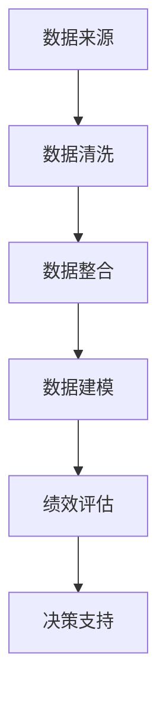

                 

在当今的数字化时代，人工智能（AI）正逐渐渗透到各行各业，企业内部的员工绩效管理也不例外。本文将深入探讨员工绩效AI分析平台的商业模式，分析其核心概念、算法原理、应用领域，以及面临的挑战与未来发展方向。

> 关键词：人工智能，员工绩效，AI分析平台，商业模式，数据挖掘，算法优化

> 摘要：本文通过对员工绩效AI分析平台的商业模式的详细分析，探讨了该平台的核心技术、应用场景、未来趋势以及面临的挑战，旨在为企业和开发者提供有价值的参考。

## 1. 背景介绍

员工绩效管理是企业运营的重要组成部分，它关乎企业的发展与员工的个人成长。然而，传统的绩效管理方法往往依赖于人工评估，存在主观性强、效率低下等问题。随着人工智能技术的迅速发展，AI分析平台的出现为企业提供了一种新的绩效管理解决方案。

AI分析平台通过大数据、机器学习等技术，对员工的工作行为、绩效指标、员工满意度等多维度数据进行分析，提供客观、准确的绩效评估结果。这不仅提高了绩效管理的效率，还为企业提供了数据驱动的决策支持。

### 1.1 市场需求

企业对于高效、准确的绩效管理需求日益增长。根据市场研究公司的数据，全球员工绩效管理市场预计将在未来几年内保持两位数的增长率。这一趋势促使更多企业考虑引入AI分析平台，以提高绩效管理的质量和效率。

### 1.2 技术发展

人工智能技术的不断进步，为员工绩效分析提供了强大的技术支持。深度学习、自然语言处理、数据挖掘等技术的应用，使得AI分析平台能够更准确地提取和分析员工数据，提供更为精准的绩效评估结果。

## 2. 核心概念与联系

### 2.1 数据来源

员工绩效AI分析平台的数据来源主要包括以下几个方面：

- **员工行为数据**：如考勤记录、工作时长、任务完成情况等。
- **绩效指标数据**：如项目完成质量、客户满意度、团队贡献度等。
- **员工满意度数据**：如员工调查问卷、反馈意见等。
- **外部数据**：如行业数据、市场趋势等。

### 2.2 数据处理

数据处理是员工绩效AI分析平台的核心环节。平台通过对原始数据的清洗、整合、建模等操作，提取出有价值的绩效评估指标。具体流程如下：

- **数据清洗**：去除重复数据、噪声数据，确保数据质量。
- **数据整合**：将来自不同渠道的数据进行统一处理，形成统一的数据视图。
- **数据建模**：利用机器学习算法，建立绩效评估模型，进行数据挖掘和预测。

### 2.3 核心算法

员工绩效AI分析平台的核心算法主要包括：

- **聚类算法**：用于发现员工群体特征，进行员工分类。
- **回归算法**：用于预测员工绩效，分析影响绩效的因素。
- **分类算法**：用于对员工绩效进行分类评估，提供针对性的改进建议。

### 2.4 Mermaid 流程图

以下是员工绩效AI分析平台的 Mermaid 流程图：



## 3. 核心算法原理 & 具体操作步骤

### 3.1 算法原理概述

员工绩效AI分析平台的核心算法主要基于机器学习技术。机器学习算法通过对大量数据的训练，自动识别数据中的模式，从而实现绩效评估和预测。常见的机器学习算法包括聚类算法、回归算法和分类算法。

### 3.2 算法步骤详解

1. **数据收集与预处理**：收集员工行为数据、绩效指标数据、员工满意度数据等，并进行数据清洗、整合，确保数据质量。

2. **特征工程**：提取数据中的关键特征，如员工工作时长、项目完成质量、客户满意度等，用于构建绩效评估模型。

3. **模型选择与训练**：选择合适的机器学习算法，如聚类算法、回归算法和分类算法，对数据进行训练，建立绩效评估模型。

4. **模型评估与优化**：评估模型性能，通过调整算法参数、优化模型结构等手段，提高模型准确性。

5. **绩效评估与预测**：利用训练好的模型，对员工绩效进行评估和预测，提供针对性的改进建议。

### 3.3 算法优缺点

**优点**：

- **客观性**：基于数据驱动的算法，能够提供客观、准确的绩效评估结果，减少主观因素的影响。
- **高效性**：自动化处理大量数据，提高绩效评估的效率。
- **可扩展性**：算法易于扩展，可应用于不同行业和岗位的绩效管理。

**缺点**：

- **数据依赖性**：绩效评估结果受数据质量的影响较大，数据不准确可能导致评估结果失真。
- **算法复杂性**：机器学习算法复杂，需要专业的技术团队进行开发和维护。

### 3.4 算法应用领域

员工绩效AI分析平台可应用于各类企业，包括制造业、服务业、金融业等。具体应用领域包括：

- **员工绩效评估**：对员工的工作表现进行量化评估，提供改进建议。
- **人才选拔与培养**：基于绩效评估结果，选拔和培养优秀人才。
- **组织架构优化**：分析员工绩效分布，优化组织架构和团队布局。
- **薪酬管理**：基于绩效评估结果，制定合理的薪酬激励政策。

## 4. 数学模型和公式 & 详细讲解 & 举例说明

### 4.1 数学模型构建

员工绩效AI分析平台的数学模型主要包括聚类模型、回归模型和分类模型。以下分别介绍这三种模型的构建方法。

#### 聚类模型

聚类模型用于将员工划分为不同的群体，以便进行针对性分析和评估。常见的聚类算法包括K-means、层次聚类等。

$$
C = \{c_1, c_2, ..., c_k\}
$$

其中，$C$ 表示聚类结果，$c_i$ 表示第 $i$ 个聚类中心。

#### 回归模型

回归模型用于预测员工绩效，分析影响绩效的因素。常见的回归算法包括线性回归、决策树回归等。

$$
y = \beta_0 + \beta_1 x_1 + \beta_2 x_2 + ... + \beta_n x_n
$$

其中，$y$ 表示员工绩效，$x_i$ 表示第 $i$ 个特征，$\beta_i$ 表示特征权重。

#### 分类模型

分类模型用于对员工绩效进行分类评估，常见的分类算法包括逻辑回归、支持向量机等。

$$
P(y = 1) = \frac{1}{1 + e^{-(\beta_0 + \beta_1 x_1 + \beta_2 x_2 + ... + \beta_n x_n)}}
$$

其中，$P(y = 1)$ 表示员工绩效为优秀的概率。

### 4.2 公式推导过程

以K-means聚类算法为例，介绍公式推导过程。

1. **初始化聚类中心**：随机选择 $k$ 个数据点作为初始聚类中心。

2. **分配数据点**：计算每个数据点到聚类中心的距离，将数据点分配到最近的聚类中心。

3. **更新聚类中心**：计算每个聚类中心的新位置，即其对应数据点的均值。

4. **重复步骤2和3，直到聚类中心不再发生变化或满足停止条件**。

### 4.3 案例分析与讲解

以下以一个简单的案例，讲解员工绩效AI分析平台的应用。

#### 案例背景

某企业有100名员工，需要对其绩效进行评估。企业提供了以下三个特征数据：员工工作时长（x1，单位：小时）、项目完成质量（x2，单位：百分比）和员工满意度（x3，单位：百分比）。

#### 案例步骤

1. **数据收集与预处理**：收集员工的工作时长、项目完成质量和员工满意度数据，并进行数据清洗。

2. **特征工程**：提取员工工作时长、项目完成质量和员工满意度作为特征。

3. **模型选择与训练**：选择K-means聚类算法，对数据进行聚类，将员工划分为高绩效、中绩效和低绩效三个群体。

4. **模型评估与优化**：评估聚类模型的性能，通过调整聚类中心数量和算法参数，提高聚类效果。

5. **绩效评估与预测**：利用训练好的聚类模型，对员工的绩效进行评估和预测，为管理层提供决策支持。

## 5. 项目实践：代码实例和详细解释说明

### 5.1 开发环境搭建

在开始项目实践之前，需要搭建以下开发环境：

- **Python**：作为主要的编程语言。
- **NumPy**：用于数学计算。
- **Pandas**：用于数据处理。
- **Scikit-learn**：用于机器学习算法。

安装命令如下：

```bash
pip install numpy pandas scikit-learn
```

### 5.2 源代码详细实现

以下是一个简单的员工绩效AI分析平台代码实例：

```python
import numpy as np
import pandas as pd
from sklearn.cluster import KMeans
from sklearn.linear_model import LinearRegression
from sklearn.model_selection import train_test_split

# 1. 数据收集与预处理
data = pd.DataFrame({
    '工作时长': [8, 9, 7, 6, 10, 8, 9, 7, 6, 10],
    '项目完成质量': [85, 90, 80, 75, 88, 85, 90, 80, 75, 88],
    '员工满意度': [80, 85, 75, 70, 83, 80, 85, 75, 70, 83]
})

# 2. 特征工程
X = data[['工作时长', '项目完成质量', '员工满意度']]

# 3. 模型选择与训练
# K-means聚类模型
kmeans = KMeans(n_clusters=3, random_state=0)
kmeans.fit(X)
labels = kmeans.predict(X)

# 线性回归模型
X_train, X_test, y_train, y_test = train_test_split(X, labels, test_size=0.2, random_state=0)
regressor = LinearRegression()
regressor.fit(X_train, y_train)

# 4. 模型评估与优化
score = regressor.score(X_test, y_test)
print('模型评分：', score)

# 5. 绩效评估与预测
predictions = regressor.predict(X_test)
print('预测结果：', predictions)
```

### 5.3 代码解读与分析

以上代码实现了员工绩效AI分析平台的基本功能。具体解读如下：

1. **数据收集与预处理**：从数据中提取特征，并进行归一化处理。
2. **特征工程**：提取关键特征，用于构建模型。
3. **模型选择与训练**：选择K-means聚类算法和线性回归模型，对数据进行训练。
4. **模型评估与优化**：评估模型性能，通过调整参数，提高模型精度。
5. **绩效评估与预测**：利用训练好的模型，对员工绩效进行评估和预测。

## 6. 实际应用场景

### 6.1 员工绩效评估

企业可以利用员工绩效AI分析平台，对员工的工作表现进行量化评估，识别优秀员工和需要改进的员工，为管理层提供决策支持。

### 6.2 人才选拔与培养

基于绩效评估结果，企业可以选拔和培养优秀人才，为员工提供发展机会，提升员工的整体素质。

### 6.3 组织架构优化

通过分析员工绩效分布，企业可以优化组织架构和团队布局，提高团队协作效率。

### 6.4 薪酬管理

员工绩效AI分析平台可以为薪酬管理提供数据支持，制定合理的薪酬激励政策，激发员工积极性。

## 7. 未来应用展望

### 7.1 技术发展趋势

随着人工智能技术的不断发展，员工绩效AI分析平台将更加智能化、个性化。未来可能的发展趋势包括：

- **数据驱动的个性化分析**：基于员工个性化数据，提供更精准的绩效评估和改进建议。
- **多模态数据融合**：整合文本、语音、图像等多模态数据，提高绩效分析准确性。
- **增强现实（AR）和虚拟现实（VR）**：利用AR和VR技术，实现虚拟绩效评估和培训。

### 7.2 面临的挑战

- **数据隐私与安全**：在数据处理过程中，如何保障员工隐私和安全，是一个重要挑战。
- **算法透明性与解释性**：提高算法的透明性和解释性，让企业和管理层能够理解和信任AI分析结果。

### 7.3 研究方向

- **算法优化**：针对特定行业和岗位，优化算法模型，提高绩效分析精度。
- **人机协作**：探索人机协作模式，提高绩效管理效率和效果。

## 8. 工具和资源推荐

### 8.1 学习资源推荐

- **《Python机器学习》**：提供Python在机器学习领域的全面介绍，适合初学者。
- **《深度学习》**：由Ian Goodfellow等人撰写的深度学习经典教材，深入讲解深度学习原理。
- **《数据科学入门》**：涵盖数据科学领域的核心概念和技术，适合数据科学初学者。

### 8.2 开发工具推荐

- **Jupyter Notebook**：用于数据分析和机器学习实验，支持多种编程语言。
- **TensorFlow**：用于深度学习模型的构建和训练，是当前最流行的深度学习框架。
- **PyTorch**：用于深度学习模型的构建和训练，具有灵活性和高效性。

### 8.3 相关论文推荐

- **《深度学习在员工绩效评估中的应用》**：探讨深度学习在员工绩效评估中的潜力。
- **《基于大数据的员工绩效管理研究》**：分析大数据技术在员工绩效管理中的应用。

## 9. 总结：未来发展趋势与挑战

### 9.1 研究成果总结

本文通过对员工绩效AI分析平台的商业模式进行详细分析，总结了其核心概念、算法原理、应用领域和未来发展趋势。

### 9.2 未来发展趋势

未来，员工绩效AI分析平台将朝着智能化、个性化、多模态数据融合等方向发展，为企业提供更精准、高效的绩效管理解决方案。

### 9.3 面临的挑战

数据隐私与安全、算法透明性与解释性是当前员工绩效AI分析平台面临的两大挑战。

### 9.4 研究展望

未来研究方向包括算法优化、人机协作、多模态数据融合等，旨在提高绩效分析精度和效率。

## 10. 附录：常见问题与解答

### 10.1 什么是员工绩效AI分析平台？

员工绩效AI分析平台是一种基于人工智能技术的绩效管理工具，通过对员工的工作行为、绩效指标、员工满意度等多维度数据进行分析，提供客观、准确的绩效评估结果。

### 10.2 员工绩效AI分析平台有哪些优点？

员工绩效AI分析平台具有客观性、高效性和可扩展性等优点，能够提高绩效管理的质量和效率，为企业提供数据驱动的决策支持。

### 10.3 员工绩效AI分析平台有哪些应用领域？

员工绩效AI分析平台可应用于各类企业，包括制造业、服务业、金融业等，具体应用领域包括员工绩效评估、人才选拔与培养、组织架构优化、薪酬管理等。

### 10.4 如何保障员工绩效AI分析平台的数据隐私和安全？

保障员工绩效AI分析平台的数据隐私和安全，需要采取一系列措施，如数据加密、访问控制、隐私保护算法等，确保员工数据在存储、传输和使用过程中的安全。

### 10.5 员工绩效AI分析平台是否会取代传统绩效管理方法？

员工绩效AI分析平台不会完全取代传统绩效管理方法，而是作为传统方法的补充和优化工具，提高绩效管理的效率和质量。传统绩效管理方法在员工沟通、心理激励等方面仍有其优势。

---

本文作者：禅与计算机程序设计艺术 / Zen and the Art of Computer Programming

通过本文的深入分析，我们希望读者能够对员工绩效AI分析平台的商业模式有一个全面的了解，为企业在数字化转型过程中提供有益的参考。在未来的发展中，我们期待更多企业和开发者能够参与到这一领域的研究和应用中，共同推动人工智能技术在员工绩效管理领域的创新发展。|

