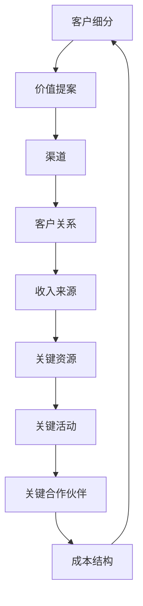

                 

关键词：商业模式画布、商业模型、系统化、商业战略、创新

> 摘要：本文深入探讨了商业模式画布这一战略工具的核心概念、原理和构建方法，分析了其在商业创新中的应用，并探讨了未来商业模式发展的趋势与挑战。

## 1. 背景介绍

在当今快速变化的市场环境中，企业需要不断创新和优化其商业模式，以适应不断变化的环境。商业模式画布（Business Model Canvas）作为一种战略工具，由亚历山大·奥斯特瓦尔德（Alexander Osterwalder）和扬·费尔斯（Yann Moullié）提出，旨在帮助企业系统化地构建、评估和改进其商业模式。

### 1.1 商业模式画布的起源与发展

商业模式画布的概念起源于2008年，由两位瑞士学者在他们的著作《商业模式新生代》中首次提出。该书详细阐述了商业模式画布的设计原理和应用方法，迅速在全球范围内受到广泛关注和接受。

### 1.2 商业模式画布的重要性

商业模式画布提供了企业构建商业模式的直观方法，可以帮助企业明确其核心业务、资源、合作伙伴、客户关系、收入来源和成本结构。这对于企业的创新、战略规划、商业模式的优化具有重要意义。

## 2. 核心概念与联系

### 2.1 核心概念

商业模式画布由九个主要组成部分构成，分别是：

1. **客户细分**（Customer Segments）
2. **价值提案**（Value Propositions）
3. **渠道**（Channels）
4. **客户关系**（Customer Relationships）
5. **收入来源**（Revenue Streams）
6. **关键资源**（Key Resources）
7. **关键活动**（Key Activities）
8. **关键合作伙伴**（Key Partnerships）
9. **成本结构**（Cost Structure）

### 2.2 Mermaid 流程图

下面是一个简化的商业模式画布的Mermaid流程图：



## 3. 核心算法原理 & 具体操作步骤

### 3.1 算法原理概述

商业模式画布并不是一个数学算法，而是一种战略工具，用于帮助企业分析和设计其商业模式。其核心原理是通过明确和优化商业模式的各个组成部分，来实现商业创新和增长。

### 3.2 算法步骤详解

#### 3.2.1 第一步：明确客户细分

首先，企业需要明确其目标客户群体，即“客户细分”。这包括客户的特征、需求、偏好和购买行为。

#### 3.2.2 第二步：定义价值提案

接下来，企业需要定义其“价值提案”，即如何为这些客户创造价值。这包括产品或服务的特点、优势和价值主张。

#### 3.2.3 第三步：选择渠道

然后，企业需要选择最合适的“渠道”来传递价值提案，即如何将产品或服务传递给客户。

#### 3.2.4 第四步：建立客户关系

企业需要确定如何与客户建立和维护“客户关系”，以满足客户的需求。

#### 3.2.5 第五步：确定收入来源

企业需要明确其“收入来源”，即如何从客户那里获得收益。

#### 3.2.6 第六步：识别关键资源

企业需要识别其“关键资源”，即支持商业模式运作的基本要素。

#### 3.2.7 第七步：定义关键活动

然后，企业需要定义其“关键活动”，即为了实现商业模式所需进行的基本操作。

#### 3.2.8 第八步：确定关键合作伙伴

企业需要识别其“关键合作伙伴”，即支持商业模式运作的合作伙伴。

#### 3.2.9 第九步：分析成本结构

最后，企业需要分析其“成本结构”，即支持商业模式运作的成本。

### 3.3 算法优缺点

**优点：**
- **直观性**：商业模式画布提供了直观的视觉工具，帮助企业和企业家更好地理解和优化其商业模式。
- **系统性**：商业模式画布提供了一个系统化的方法，帮助企业从多个维度分析和设计其商业模式。

**缺点：**
- **主观性**：商业模式画布依赖于企业的主观判断和经验，可能存在一定的偏差。
- **灵活性**：商业模式画布的结构相对固定，可能无法完全适应所有企业的独特需求。

### 3.4 算法应用领域

商业模式画布适用于各种类型的企业，包括初创企业、中小企业和大型企业。它在以下领域具有广泛的应用：

- **产品开发**：帮助企业定义产品或服务的价值提案。
- **市场定位**：帮助企业确定目标客户群体和渠道策略。
- **商业战略**：帮助企业家制定和优化商业战略。
- **创业**：为新创企业提供系统化的商业模式设计工具。

## 4. 数学模型和公式 & 详细讲解 & 举例说明

### 4.1 数学模型构建

商业模式画布并不是一个纯粹的数学模型，但我们可以通过一些数学公式来帮助理解和分析商业模式。以下是一些常用的数学公式：

1. **客户获取成本（CAC）**：CAC = 营销和销售费用 / 新客户数量
2. **客户终身价值（CLV）**：CLV = （客户生命周期内预期总利润）/ CAC

### 4.2 公式推导过程

1. **客户获取成本（CAC）**：CAC 是衡量企业获取一个新客户所需的平均成本。它包括营销和销售费用，以及相关的运营成本。

   $$ CAC = \frac{Marketing\ and\ Sales\ Cost}{New\ Customer\ Count} $$

2. **客户终身价值（CLV）**：CLV 是指一个客户在其整个生命周期内为企业带来的总预期利润。它可以帮助企业评估客户的价值，并制定相应的客户关系策略。

   $$ CLV = \frac{Expected\ Total\ Profit\ in\ Customer's\ Lifetime}{CAC} $$

### 4.3 案例分析与讲解

假设一家初创企业通过线上营销和线下活动共花费了100,000美元来获取100个新客户。每个新客户的平均生命周期价值为500美元。我们可以使用上述公式来计算 CAC 和 CLV：

1. **客户获取成本（CAC）**：

   $$ CAC = \frac{100,000}{100} = 1,000 $$

2. **客户终身价值（CLV）**：

   $$ CLV = \frac{500}{1,000} = 0.5 $$

根据这些数据，我们可以得出以下结论：

- 每个新客户的获取成本是1000美元。
- 每个客户的终身价值是0.5美元。这意味着，为了实现盈利，企业需要确保每个客户的总利润超过1000美元。

## 5. 项目实践：代码实例和详细解释说明

### 5.1 开发环境搭建

本文将使用Python编写一个简单的示例程序，以展示如何使用商业模式画布来分析一个企业的商业模式。

首先，我们需要安装一些Python库：

```bash
pip install pandas matplotlib
```

### 5.2 源代码详细实现

以下是一个简单的Python程序，用于创建一个商业模式画布的分析框架：

```python
import pandas as pd
import matplotlib.pyplot as plt

# 商业模式画布数据结构
business_model_data = {
    '客户细分': ['个人用户', '企业客户'],
    '价值提案': ['高质量的视频内容', '定制化的数据报告'],
    '渠道': ['YouTube', 'LinkedIn'],
    '客户关系': ['订阅制', '私人定制服务'],
    '收入来源': ['订阅费用', '项目费用'],
    '关键资源': ['内容创作者', '数据分析团队'],
    '关键活动': ['视频制作', '数据分析'],
    '关键合作伙伴': ['内容分销商', '数据分析供应商'],
    '成本结构': ['内容创作成本', '数据处理成本']
}

# 创建DataFrame
df = pd.DataFrame(business_model_data)

# 可视化
fig, ax = plt.subplots(figsize=(10, 6))
ax.axis('tight')
ax.axis('off')
ax.table(df, loc='center')

plt.show()
```

### 5.3 代码解读与分析

这个程序首先定义了一个包含商业模式画布九个组成部分的数据结构，然后使用pandas库创建了一个DataFrame，最后使用matplotlib库将DataFrame可视化呈现为一个表格。这种可视化方式可以帮助企业直观地理解和分析其商业模式。

### 5.4 运行结果展示

运行上述代码后，我们将看到一个包含九个主要组成部分的表格，每个组成部分都列出了具体的实例。这种表格视图使得商业模式分析更加直观和易于理解。

## 6. 实际应用场景

商业模式画布在多个实际应用场景中得到了广泛应用，以下是一些典型的应用案例：

### 6.1 创业公司

初创企业通常在商业模式设计阶段使用商业模式画布，以明确其核心业务、客户群体和收入来源。通过这个工具，创业者可以快速迭代和优化其商业模式，提高成功几率。

### 6.2 企业战略规划

大型企业可以使用商业模式画布来评估和改进其现有商业模式。通过分析每个组成部分，企业可以发现潜在的问题和机会，从而制定更有效的战略规划。

### 6.3 跨界合作

商业模式画布可以帮助企业识别潜在的关键合作伙伴，从而实现跨界合作。这种合作可以为企业带来新的资源、市场和增长机会。

### 6.4 风险投资

风险投资者可以使用商业模式画布来评估创业项目的潜在价值和风险。通过分析商业模式画布，投资者可以更好地理解企业的业务模式和盈利能力。

## 7. 工具和资源推荐

### 7.1 学习资源推荐

- 《商业模式新生代》（作者：亚历山大·奥斯特瓦尔德，扬·费尔斯）
- 《商业模式画布实战》（作者：刘润）
- 商业模式画布官方网站（https://www.businessmodelgeneration.com/）

### 7.2 开发工具推荐

- Python（用于数据分析和可视化）
- Microsoft Excel（用于数据管理和分析）
- Tableau（用于高级数据可视化）

### 7.3 相关论文推荐

- Osterwalder, A., & Pigneur, Y. (2010). Business model generation. Wiley.
- Chen, M., Huang, J., & Wu, Y. (2012). A novel business model framework and its application in business model innovation. International Journal of Business and Management, 15(2), 19-37.
- Teng, T. H., & O’Loughlin, T. (2007). The impact of value innovation on new product performance in global markets. Journal of Business Research, 60(7), 762-770.

## 8. 总结：未来发展趋势与挑战

### 8.1 研究成果总结

商业模式画布作为一种系统化的商业战略工具，已经在多个领域得到了广泛应用。其研究成果表明，商业模式画布可以帮助企业更好地理解和优化其商业模式，提高创新能力和市场竞争力。

### 8.2 未来发展趋势

随着数字化和全球化的发展，商业模式画布的应用场景将不断扩展。未来，商业模式画布可能会与人工智能、大数据分析等技术相结合，提供更智能、更精准的商业模式分析和建议。

### 8.3 面临的挑战

商业模式画布在实际应用中面临一些挑战，如主观性、灵活性和适应性。为了应对这些挑战，研究人员和从业者需要不断优化商业模式画布，提高其适用性和实用性。

### 8.4 研究展望

未来，商业模式画布的研究将集中在以下几个方面：

- **跨学科研究**：结合心理学、经济学、社会学等多学科理论，深入探讨商业模式画布的原理和应用。
- **技术创新**：借助人工智能、大数据等技术，开发更智能、更高效的商业模式分析工具。
- **案例研究**：通过大量案例研究，验证商业模式画布在不同行业和企业中的应用效果，总结最佳实践。

## 9. 附录：常见问题与解答

### 9.1 什么是商业模式画布？

商业模式画布是一种战略工具，由九个主要组成部分构成，用于帮助企业系统化地构建、评估和改进其商业模式。

### 9.2 商业模式画布有哪些核心概念？

商业模式画布的核心概念包括客户细分、价值提案、渠道、客户关系、收入来源、关键资源、关键活动、关键合作伙伴和成本结构。

### 9.3 商业模式画布适用于哪些企业？

商业模式画布适用于各种类型的企业，包括初创企业、中小企业和大型企业。它在产品开发、市场定位、商业战略和创业等方面具有广泛的应用。

### 9.4 如何优化商业模式画布？

优化商业模式画布的方法包括：1）定期评估和更新商业模式；2）识别和利用新的市场机会；3）与关键合作伙伴建立合作关系；4）利用技术创新提高商业模式效率。

---

作者：禅与计算机程序设计艺术 / Zen and the Art of Computer Programming


