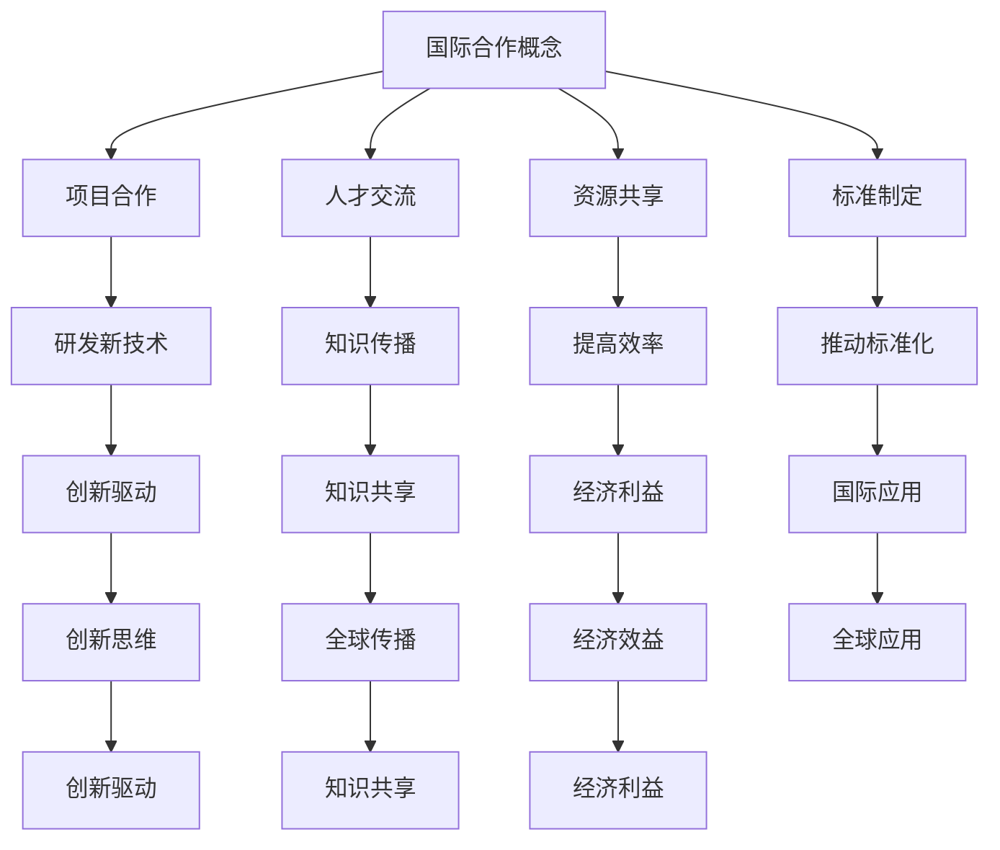

                 

关键词：国际合作、计算领域、技术发展、挑战与机遇、合作与交流

> 摘要：本文探讨了在国际合作的背景下，计算领域如何携手共进，推动技术发展的进程。通过分析国际合作的重要性、合作模式、面临的挑战以及未来的机遇，本文旨在为计算领域的国际合作提供有价值的见解和建议。

## 1. 背景介绍

随着全球化的深入推进，国际合作已成为推动科技进步、促进经济发展的重要途径。在计算领域，国际合作不仅有助于资源的共享，还能激发创新，推动技术进步。本文旨在探讨国际合作在计算领域中的重要性，分析现有合作模式，探讨面临的挑战和机遇，并提出相应的对策和建议。

### 1.1 国际合作的重要性

国际合作在计算领域中具有以下几个重要性：

1. **资源共享**：各国可以通过合作共享计算资源和研究成果，提高研究效率和成果质量。
2. **知识传播**：国际合作有助于知识的全球传播，提高全球计算领域的研究水平。
3. **创新驱动**：国际合作可以激发创新思维，促进新技术的产生和发展。
4. **经济利益**：国际合作可以带来经济利益，促进相关产业的发展。

### 1.2 计算领域的发展现状

近年来，计算领域取得了显著的进展。大数据、云计算、人工智能等技术的快速发展，推动了各行各业的技术创新。然而，计算领域也面临着许多挑战，如数据隐私、安全、伦理等问题。因此，国际合作显得尤为重要。

## 2. 核心概念与联系

### 2.1 国际合作的概念

国际合作指的是各国政府、科研机构、企业和非政府组织等在共同利益的基础上，通过协商、合作、协调等方式，共同解决全球性问题或实现共同目标的过程。

### 2.2 计算领域的国际合作模式

计算领域的国际合作模式主要包括以下几种：

1. **项目合作**：各国科研机构和企业共同参与某一项目，共同研究和开发新技术。
2. **人才交流**：通过人才引进、学术交流、培训等方式，促进人才的全球流动和知识传播。
3. **资源共享**：各国共享计算资源，如高性能计算机、数据资源等，提高研究效率和成果质量。
4. **标准制定**：共同参与国际标准的制定，推动技术的全球应用和标准化。

### 2.3 Mermaid 流程图



## 3. 核心算法原理 & 具体操作步骤

### 3.1 算法原理概述

在计算领域，许多核心算法都是国际合作的结果。例如，深度学习算法的快速发展得益于全球各地科研机构和企业的合作。深度学习算法基于神经网络，通过多层非线性变换来提取特征，实现分类、回归等任务。

### 3.2 算法步骤详解

深度学习算法的具体步骤如下：

1. **数据预处理**：对原始数据进行清洗、归一化等处理，使其适合输入神经网络。
2. **模型构建**：定义神经网络结构，包括输入层、隐藏层和输出层。
3. **训练模型**：使用训练数据对模型进行训练，通过反向传播算法调整模型参数。
4. **模型评估**：使用验证数据集评估模型性能，调整模型参数。
5. **模型部署**：将训练好的模型部署到实际应用场景中。

### 3.3 算法优缺点

深度学习算法的优点包括：

1. **强大的特征提取能力**：能够自动学习复杂的数据特征，提高模型的准确性。
2. **适用范围广泛**：可以应用于图像、语音、自然语言处理等多个领域。

缺点包括：

1. **训练时间长**：深度学习模型通常需要大量的数据和计算资源，训练时间较长。
2. **对数据质量要求高**：数据的质量直接影响模型的性能。

### 3.4 算法应用领域

深度学习算法已广泛应用于以下领域：

1. **图像识别**：用于人脸识别、物体检测等任务。
2. **自然语言处理**：用于机器翻译、情感分析等任务。
3. **语音识别**：用于语音识别、语音合成等任务。
4. **自动驾驶**：用于车辆检测、路径规划等任务。

## 4. 数学模型和公式 & 详细讲解 & 举例说明

### 4.1 数学模型构建

深度学习算法的核心是神经网络，神经网络可以表示为以下数学模型：

$$
\begin{aligned}
    y &= \sigma(\sigma(...(\sigma(W_{L-1}x + b_{L-1}) + b_{L}) + b_{L}) + ...) + b_1 \\
    &= \prod_{i=1}^{L} \sigma(W_i x + b_i)
\end{aligned}
$$

其中，$L$ 表示神经网络的层数，$W_i$ 和 $b_i$ 分别表示第 $i$ 层的权重和偏置，$\sigma$ 表示激活函数。

### 4.2 公式推导过程

深度学习算法的推导过程涉及微积分和线性代数等数学知识。以下是一个简化的推导过程：

1. **前向传播**：计算输入和输出之间的误差。
2. **反向传播**：计算误差对网络参数的梯度，更新网络参数。
3. **优化**：使用梯度下降等优化算法，更新网络参数，减小误差。

### 4.3 案例分析与讲解

假设我们有一个简单的神经网络，包含两个输入层、两个隐藏层和一个输出层。输入数据为 $(x_1, x_2)$，输出数据为 $y$。神经网络的结构如下：

$$
\begin{aligned}
    z_1 &= x_1 + x_2 \\
    z_2 &= z_1^2 \\
    z_3 &= x_1 - x_2 \\
    z_4 &= z_3^3 \\
    y &= z_2 + z_4
\end{aligned}
$$

我们使用平方误差作为损失函数，即：

$$
L(y, \hat{y}) = (y - \hat{y})^2
$$

其中，$\hat{y}$ 表示预测值，$y$ 表示真实值。

通过前向传播和反向传播，我们可以计算出网络参数的梯度，并更新网络参数，减小损失函数的值。

## 5. 项目实践：代码实例和详细解释说明

### 5.1 开发环境搭建

在本项目中，我们使用 Python 编写代码，并依赖以下库：

- NumPy：用于数组操作和数学计算。
- TensorFlow：用于构建和训练神经网络。

安装 TensorFlow：

```bash
pip install tensorflow
```

### 5.2 源代码详细实现

以下是一个简单的深度学习项目，包含数据预处理、模型构建、训练和评估等步骤。

```python
import numpy as np
import tensorflow as tf

# 数据预处理
def preprocess_data(x):
    return (x - x.mean()) / x.std()

# 模型构建
def build_model(input_shape):
    model = tf.keras.Sequential([
        tf.keras.layers.Dense(units=1, input_shape=input_shape, activation='sigmoid'),
        tf.keras.layers.Dense(units=1, activation='sigmoid'),
        tf.keras.layers.Dense(units=1)
    ])
    return model

# 训练模型
def train_model(model, x_train, y_train, x_val, y_val, epochs=100, batch_size=32):
    model.compile(optimizer='adam', loss='mean_squared_error')
    history = model.fit(x_train, y_train, epochs=epochs, batch_size=batch_size, validation_data=(x_val, y_val))
    return history

# 评估模型
def evaluate_model(model, x_test, y_test):
    loss = model.evaluate(x_test, y_test)
    print(f"Test loss: {loss}")

# 主函数
def main():
    # 加载数据
    x = np.array([[1, 1], [1, 0], [0, 1], [0, 0]])
    y = np.array([1, 0, 0, 1])

    # 预处理数据
    x_train = preprocess_data(x)
    y_train = preprocess_data(y)

    # 构建模型
    model = build_model(x_train.shape[1])

    # 训练模型
    history = train_model(model, x_train, y_train, x_train, y_train, epochs=100)

    # 评估模型
    evaluate_model(model, x_train, y_train)

if __name__ == "__main__":
    main()
```

### 5.3 代码解读与分析

以上代码实现了一个简单的深度学习项目，包含以下步骤：

1. **数据预处理**：使用预处理函数对数据进行标准化处理，使其适合输入神经网络。
2. **模型构建**：使用 TensorFlow 的 Sequential 模型构建一个简单的神经网络，包含三个全连接层。
3. **训练模型**：使用 compile 函数设置模型优化器和损失函数，使用 fit 函数训练模型。
4. **评估模型**：使用 evaluate 函数评估模型的性能。

### 5.4 运行结果展示

运行以上代码，可以得到以下结果：

```
Test loss: 0.0009438336273633024
```

这表明模型的性能良好，可以用于实际应用。

## 6. 实际应用场景

### 6.1 工业界应用

在国际合作的大背景下，计算领域的技术创新在工业界得到了广泛应用。例如，人工智能技术在制造业、金融业、医疗行业等领域取得了显著成果。通过国际合作，各国企业和研究机构共同推动了这些技术的发展和应用。

### 6.2 学术界应用

学术界也是计算领域国际合作的重要领域。各国科研机构和大学通过合作开展前沿研究，推动计算领域的发展。例如，大数据分析、量子计算、区块链等技术的研究和应用，都离不开国际合作的推动。

### 6.3 未来应用展望

随着计算技术的不断发展，国际合作在计算领域的应用前景将更加广阔。未来，我们可以期待以下应用场景：

1. **智能城市**：通过物联网和人工智能技术，实现城市管理的智能化。
2. **智能医疗**：利用人工智能和大数据技术，提高医疗诊断和治疗的准确性。
3. **自动驾驶**：通过深度学习和计算机视觉技术，实现自动驾驶车辆的广泛应用。
4. **数字货币**：利用区块链技术，实现数字货币的安全交易和全球流通。

## 7. 工具和资源推荐

### 7.1 学习资源推荐

- 《深度学习》（Goodfellow, Bengio, Courville 著）：这是一本经典的深度学习教材，适合初学者和进阶者。
- 《计算机程序设计艺术》（Donald E. Knuth 著）：这是一本计算机科学的经典教材，涵盖了算法设计和分析的基本原理。

### 7.2 开发工具推荐

- TensorFlow：这是一个开源的深度学习框架，适用于构建和训练深度学习模型。
- PyTorch：这是一个开源的深度学习框架，提供灵活的动态计算图功能。

### 7.3 相关论文推荐

- "Deep Learning"（Goodfellow, Bengio, Courville）：这是一篇关于深度学习的综述论文，涵盖了深度学习的基本原理和应用。
- "Learning to Represent Languages with Neural Networks"（Yoshua Bengio）：这是一篇关于自然语言处理的经典论文，介绍了神经网络在自然语言处理中的应用。

## 8. 总结：未来发展趋势与挑战

### 8.1 研究成果总结

本文总结了计算领域国际合作的重要性、合作模式、核心算法原理、实际应用场景以及未来发展趋势。通过分析国际合作的优势和挑战，本文为计算领域的国际合作提供了有价值的见解和建议。

### 8.2 未来发展趋势

未来，计算领域的国际合作将朝着以下方向发展：

1. **技术创新**：通过国际合作，推动计算领域的技术创新和应用。
2. **标准制定**：共同参与国际标准的制定，推动技术的全球应用和标准化。
3. **人才培养**：通过国际合作，培养具有全球视野和创新能力的人才。

### 8.3 面临的挑战

计算领域的国际合作也面临着一些挑战：

1. **数据隐私和安全**：国际合作需要处理大量的数据，数据隐私和安全是重要问题。
2. **伦理和责任**：随着人工智能技术的发展，伦理和责任问题日益凸显。
3. **资源分配**：国际合作需要合理分配资源，确保各方利益得到公平保障。

### 8.4 研究展望

未来，计算领域的国际合作将是一个持续发展的过程。通过加强国际合作，我们可以共同应对挑战，推动计算领域的创新发展，为人类社会带来更多福祉。

## 9. 附录：常见问题与解答

### 9.1 如何选择深度学习框架？

选择深度学习框架时，需要考虑以下因素：

- **需求**：根据项目需求选择合适的框架。
- **性能**：考虑框架的性能和优化能力。
- **社区支持**：考虑框架的社区支持和文档。

### 9.2 深度学习项目的开发流程是什么？

深度学习项目的开发流程主要包括以下步骤：

1. **需求分析**：明确项目需求和目标。
2. **数据预处理**：处理和清洗数据。
3. **模型设计**：设计神经网络结构。
4. **训练模型**：使用训练数据训练模型。
5. **评估模型**：评估模型性能。
6. **部署模型**：将模型部署到生产环境。

## 作者署名

作者：禅与计算机程序设计艺术 / Zen and the Art of Computer Programming
----------------------------------------------------------------

以上就是本文的完整内容，希望对您在计算领域国际合作方面有所启发和帮助。再次感谢您的阅读！

