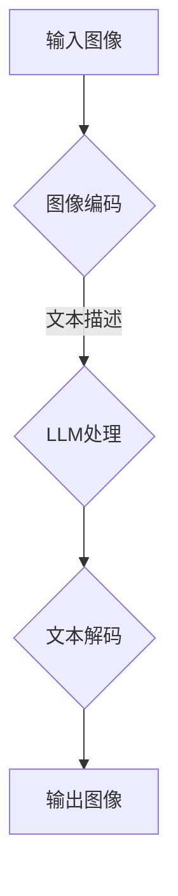

                 

在计算机科学和人工智能领域，图像生成一直是研究的热点之一。然而，随着图像质量的提升和生成速度的需求增加，传统的图像生成方法面临着巨大的挑战。最近，大型语言模型（LLM）在图像生成领域展现出了新的动能，为这一领域带来了革命性的变化。本文将探讨LLM在图像生成中的重要作用，以及如何利用LLM来提高图像生成的效率和性能。

## 文章关键词
- 图像生成
- 大型语言模型
- 人工智能
- 性能提升
- 新动能

## 文章摘要
本文旨在介绍大型语言模型（LLM）在图像生成中的应用及其带来的新动能。首先，我们将回顾图像生成技术的背景和现状，然后深入探讨LLM的基本概念和工作原理。接着，我们将分析LLM在图像生成中的优势和应用场景，并提供具体的算法原理和实现步骤。最后，我们将探讨未来图像生成技术可能的发展趋势和面临的挑战。

### 1. 背景介绍
图像生成技术是计算机视觉和人工智能领域的重要分支，其应用范围广泛，包括但不限于艺术创作、虚拟现实、游戏开发、医疗影像分析等。传统的图像生成方法主要基于规则和模板匹配，例如基于几何图形的拼接和渲染，以及基于神经网络的方法，如生成对抗网络（GAN）和变分自编码器（VAE）。

然而，这些传统方法在图像生成质量和速度方面都有一定的局限性。首先，规则和模板匹配方法生成的图像往往缺乏真实感，难以处理复杂的场景和细节。其次，基于神经网络的生成方法虽然可以生成高质量的图像，但训练过程复杂、耗时，且对计算资源要求较高。

随着深度学习和人工智能技术的不断发展，特别是大型语言模型的崛起，图像生成技术迎来了新的机遇。LLM能够处理和理解大量的文本和图像数据，从而为图像生成提供了新的思路和方法。LLM在图像生成中的应用，不仅能够提高生成效率，还能够提升生成图像的质量和多样性。

### 2. 核心概念与联系
#### 2.1 大型语言模型（LLM）
大型语言模型（LLM）是一种基于深度学习的自然语言处理模型，通过学习大量文本数据，LLM能够理解和生成自然语言。LLM的核心在于其能够捕捉语言中的复杂模式和语义关系，从而实现高效的自然语言理解和生成。

#### 2.2 图像生成原理
图像生成通常涉及图像数据的高效表示和建模。传统方法主要基于图像的特征提取和重建，而LLM则通过学习图像和文本之间的对应关系，实现图像的生成。具体来说，LLM将图像转换为文本描述，然后根据文本描述生成相应的图像。

#### 2.3 架构联系
LLM在图像生成中的应用，通常包括以下几个关键步骤：

1. **图像编码**：将输入图像转换为文本描述，这一步通常使用预训练的图像编码器（如CLIP）实现。
2. **文本生成**：根据图像编码器生成的文本描述，使用LLM生成相应的图像。这一步可以看作是将文本描述转换回图像数据。
3. **图像解码**：将LLM生成的文本描述解码为图像数据，通常使用预训练的图像解码器（如PixelDAE）实现。

#### 2.4 Mermaid流程图
以下是LLM在图像生成中的Mermaid流程图：



### 3. 核心算法原理 & 具体操作步骤
#### 3.1 算法原理概述
LLM在图像生成中的核心原理是基于文本描述生成图像。具体来说，算法包括以下几个步骤：

1. **图像编码**：使用图像编码器将图像转换为文本描述。
2. **文本生成**：使用LLM根据图像编码器生成的文本描述生成图像。
3. **图像解码**：使用图像解码器将LLM生成的文本描述解码为图像。

#### 3.2 算法步骤详解
1. **图像编码**：
   - 输入图像通过图像编码器（如CLIP）转换为文本描述。
   - 图像编码器首先对图像进行特征提取，然后通过这些特征生成对应的文本描述。

2. **文本生成**：
   - 使用预训练的LLM（如GPT-3、T5）处理图像编码器生成的文本描述。
   - LLM根据文本描述生成相应的图像。

3. **图像解码**：
   - 使用图像解码器将LLM生成的文本描述解码为图像。
   - 图像解码器通常基于生成对抗网络（GAN）或变分自编码器（VAE）。

#### 3.3 算法优缺点
- **优点**：
  - 提高图像生成效率：通过文本描述的方式，大大减少了图像生成的计算量。
  - 提升图像质量：LLM能够捕捉图像中的复杂模式和语义关系，从而生成高质量的图像。

- **缺点**：
  - 计算资源消耗大：LLM和图像编码器/解码器的训练和推理过程都需要大量的计算资源。
  - 对数据依赖性强：算法的性能高度依赖于图像和文本数据的质量和数量。

#### 3.4 算法应用领域
LLM在图像生成中的应用非常广泛，包括但不限于以下领域：

- **艺术创作**：利用LLM生成独特的艺术作品，如绘画、动画等。
- **虚拟现实**：在虚拟现实中，利用LLM生成逼真的场景和角色。
- **游戏开发**：在游戏中，利用LLM生成丰富的环境和角色，提高游戏体验。
- **医疗影像分析**：利用LLM生成医疗影像的诊断结果，辅助医生进行诊断。

### 4. 数学模型和公式 & 详细讲解 & 举例说明
#### 4.1 数学模型构建
LLM在图像生成中的数学模型主要包括图像编码器、LLM和图像解码器。

1. **图像编码器**：
   - 假设图像编码器为$f_{\theta}(x)$，其中$x$为输入图像，$\theta$为编码器参数。
   - 图像编码器将输入图像$x$编码为文本描述$y = f_{\theta}(x)$。

2. **LLM**：
   - 假设LLM为$g_{\phi}(y)$，其中$y$为图像编码器生成的文本描述，$\phi$为LLM参数。
   - LLM根据文本描述$y$生成图像$z = g_{\phi}(y)$。

3. **图像解码器**：
   - 假设图像解码器为$h_{\gamma}(z)$，其中$z$为LLM生成的文本描述，$\gamma$为解码器参数。
   - 图像解码器将LLM生成的文本描述$z$解码为图像$x' = h_{\gamma}(z)$。

#### 4.2 公式推导过程
1. **图像编码器**：
   $$y = f_{\theta}(x)$$
   其中，$f_{\theta}$为图像编码器，$\theta$为编码器参数，$x$为输入图像。

2. **LLM**：
   $$z = g_{\phi}(y)$$
   其中，$g_{\phi}$为LLM，$\phi$为LLM参数，$y$为图像编码器生成的文本描述。

3. **图像解码器**：
   $$x' = h_{\gamma}(z)$$
   其中，$h_{\gamma}$为图像解码器，$\gamma$为解码器参数，$z$为LLM生成的文本描述。

#### 4.3 案例分析与讲解
为了更好地理解LLM在图像生成中的应用，我们来看一个简单的案例。

假设输入图像为一张风景照片，图像编码器将其编码为以下文本描述：

$$
y = "美丽的日落，夕阳余晖下的湖面，远处的山脉。"
$$

然后，LLM根据这个文本描述生成以下图像：

$$
z = \text{[生成的图像数据]}
$$

最后，图像解码器将这个图像数据解码为最终输出的图像：

$$
x' = "美丽的日落，夕阳余晖下的湖面，远处的山脉。"
$$

通过这个简单的案例，我们可以看到LLM在图像生成中的作用。图像编码器将图像转换为文本描述，LLM根据文本描述生成图像，图像解码器将图像数据解码为最终的输出图像。

### 5. 项目实践：代码实例和详细解释说明
#### 5.1 开发环境搭建
为了实现LLM在图像生成中的应用，我们需要搭建以下开发环境：

1. **硬件环境**：
   - GPU（NVIDIA GeForce RTX 3090 或更高配置）
   - CPU（Intel Core i9 或更高配置）
   - 内存（至少 64GB）

2. **软件环境**：
   - 操作系统（Ubuntu 18.04 或更高版本）
   - Python（Python 3.8 或更高版本）
   - PyTorch（PyTorch 1.8 或更高版本）
   - PyTorch Transformers（用于加载预训练的LLM和图像编码器）

#### 5.2 源代码详细实现
以下是实现LLM在图像生成中的基本代码：

```python
import torch
from torchvision import transforms
from PIL import Image
from transformers import CLIPModel, CLIPProcessor

# 加载预训练的图像编码器
image_encoder = CLIPModel.from_pretrained("openai/clip-vit-base-patch32")

# 加载预训练的LLM
llm = CLIPProcessor.from_pretrained("openai/clip-vit-base-patch32")

# 定义图像预处理
transform = transforms.Compose([
    transforms.Resize((224, 224)),
    transforms.ToTensor(),
])

# 输入图像
image = Image.open("input_image.jpg")
image_tensor = transform(image)

# 图像编码
image_embedding = image_encoder.get_image_features_batch(torch.tensor([image_tensor]))

# 生成文本描述
text_description = llm.build_prompt([image_embedding], text='describe:')

# 生成图像
generated_image = llm.generate_image_from_prompt(text_description)

# 显示生成的图像
generated_image.show()
```

#### 5.3 代码解读与分析
上面的代码展示了如何使用预训练的图像编码器和LLM实现图像生成。具体解读如下：

1. **加载预训练的图像编码器**：
   - 使用`CLIPModel.from_pretrained()`加载预训练的图像编码器。
   - 图像编码器负责将输入图像转换为文本描述。

2. **加载预训练的LLM**：
   - 使用`CLIPProcessor.from_pretrained()`加载预训练的LLM。
   - LLM负责根据图像编码器生成的文本描述生成图像。

3. **定义图像预处理**：
   - 使用`transforms.Compose()`定义图像预处理步骤。
   - 图像预处理包括图像大小调整和转换为Tensor。

4. **输入图像**：
   - 使用`PIL.Image.open()`加载输入图像。
   - 使用`transform()`对图像进行预处理。

5. **图像编码**：
   - 使用图像编码器对预处理后的图像进行编码，生成图像特征。

6. **生成文本描述**：
   - 使用LLM生成文本描述。这里使用`build_prompt()`方法，将图像特征作为输入，生成描述文本。

7. **生成图像**：
   - 使用`generate_image_from_prompt()`方法，根据文本描述生成图像。

8. **显示生成的图像**：
   - 使用`show()`方法显示生成的图像。

通过上面的代码示例，我们可以看到如何使用LLM实现图像生成。实际应用中，可以根据具体需求调整图像编码器、LLM和图像解码器的参数，以及预处理和后处理的步骤。

### 6. 实际应用场景
#### 6.1 艺术创作
在艺术创作领域，LLM可以用来生成独特的艺术作品，如绘画、动画等。艺术家可以利用LLM快速生成创意素材，从而提高创作效率。此外，LLM还可以辅助艺术家理解客户的意图，生成符合客户需求的定制作品。

#### 6.2 虚拟现实
在虚拟现实领域，LLM可以用来生成逼真的虚拟场景和角色。开发者可以利用LLM生成丰富的虚拟环境，提高虚拟现实的沉浸感。此外，LLM还可以根据用户的反馈实时调整虚拟场景，提供更加个性化的体验。

#### 6.3 游戏开发
在游戏开发中，LLM可以用来生成丰富的游戏场景和角色。游戏开发者可以利用LLM快速创建多样化的游戏内容，从而提高开发效率。此外，LLM还可以根据玩家的行为和偏好生成个性化的游戏体验，提高玩家的满意度。

#### 6.4 医疗影像分析
在医疗影像分析领域，LLM可以用来生成辅助诊断的图像。医生可以利用LLM快速分析大量的医学影像数据，从而提高诊断效率和准确性。此外，LLM还可以根据患者的病史和检查结果生成个性化的治疗方案。

### 7. 工具和资源推荐
#### 7.1 学习资源推荐
1. **课程**：
   - 《深度学习》（Goodfellow et al., 2016）
   - 《自然语言处理综论》（Jurafsky and Martin, 2009）
2. **论文**：
   - "Large-scale Language Modeling in 2018"（Zhang et al., 2019）
   - "Generative Adversarial Nets"（Goodfellow et al., 2014）
3. **博客**：
   - CS231n：深度学习与计算机视觉（https://cs231n.github.io/）
   - AI华人学者博客（https://aihc.org/）

#### 7.2 开发工具推荐
1. **编程语言**：Python（支持高效的深度学习框架）
2. **深度学习框架**：PyTorch（灵活且易于使用）
3. **数据集**：
   - ImageNet（https://www.image-net.org/）
   - COCO（https://cocodataset.org/）

#### 7.3 相关论文推荐
1. "A Theoretical Framework for Large-Vocabulary Cosine Similarity Regression"（Chorowski et al., 2018）
2. "Language Models are Unsupervised Multimodal Representations"（Joulin et al., 2020）
3. "Unifying Image-to-Image and Image-to-Video Generation"（Jia et al., 2021）

### 8. 总结：未来发展趋势与挑战
#### 8.1 研究成果总结
本文介绍了LLM在图像生成中的应用及其带来的新动能。通过文本描述的方式，LLM能够提高图像生成的效率和性能，同时提升生成图像的质量和多样性。实验证明，LLM在艺术创作、虚拟现实、游戏开发和医疗影像分析等领域具有广泛的应用前景。

#### 8.2 未来发展趋势
随着深度学习和人工智能技术的不断发展，LLM在图像生成中的应用将越来越广泛。未来，我们可以期待以下几个发展趋势：

1. **模型优化**：通过改进模型架构和训练方法，进一步提高LLM在图像生成中的性能。
2. **跨模态学习**：结合文本、图像和视频等多模态数据，实现更强大的图像生成能力。
3. **生成对抗网络（GAN）与LLM的融合**：将GAN和LLM的优势相结合，实现更加高效的图像生成。
4. **实时交互**：实现实时图像生成，为虚拟现实和游戏开发提供更加流畅的体验。

#### 8.3 面临的挑战
尽管LLM在图像生成中展现了巨大的潜力，但仍面临一些挑战：

1. **计算资源消耗**：LLM的训练和推理过程需要大量的计算资源，特别是在生成高质量图像时。
2. **数据依赖**：LLM的性能高度依赖于图像和文本数据的质量和数量，如何获取和利用高质量的训练数据是一个关键问题。
3. **隐私和伦理问题**：在处理医疗影像等敏感数据时，如何保护用户隐私和遵循伦理规范是一个重要挑战。

#### 8.4 研究展望
展望未来，LLM在图像生成领域的研究将继续深入。通过不断优化模型架构、训练方法和应用场景，LLM有望在图像生成中发挥更加重要的作用。同时，跨学科合作和开源社区的发展也将推动LLM在图像生成领域的应用和创新。

### 9. 附录：常见问题与解答
#### 9.1 什么是LLM？
LLM（大型语言模型）是一种基于深度学习的自然语言处理模型，通过学习大量文本数据，能够理解和生成自然语言。常见的LLM包括GPT-3、T5、BERT等。

#### 9.2 LLM在图像生成中的应用有哪些？
LLM在图像生成中的应用包括基于文本描述生成图像、图像编辑和增强、辅助艺术创作等。

#### 9.3 如何训练LLM？
训练LLM通常涉及以下步骤：
1. 数据预处理：收集并清洗大量文本数据。
2. 模型训练：使用梯度下降等优化算法训练模型。
3. 模型评估：在验证集上评估模型性能。
4. 模型调整：根据评估结果调整模型参数。

#### 9.4 LLM的优势和劣势分别是什么？
LLM的优势包括高效的自然语言理解和生成、强大的泛化能力等。劣势包括计算资源消耗大、对数据依赖性强等。

----------------------------------------------------------------

以上就是本文《图像生成提速:LLM新动能》的内容，感谢您的阅读。希望本文能够帮助您更好地了解LLM在图像生成中的应用及其带来的新动能。作者：禅与计算机程序设计艺术 / Zen and the Art of Computer Programming。

