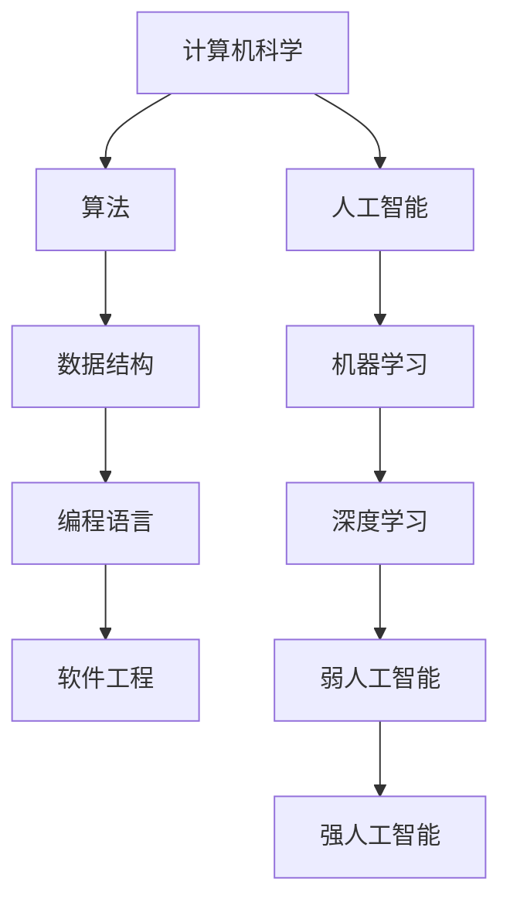

                 

### 1. 背景介绍

图灵奖，被誉为计算机领域的诺贝尔奖，是世界上最著名、最具影响力的计算机科学技术奖项之一。自1966年设立以来，图灵奖不仅表彰了计算机科学领域的杰出贡献者，也在很大程度上推动了计算机科学的发展。本文旨在探讨图灵奖得主们对人工智能（AI）领域的影响，旨在从历史、理论、应用等多个维度深入分析这些杰出贡献者对AI发展的推动作用。

人工智能作为计算机科学的重要分支，其发展历程中，图灵奖得主们扮演了至关重要的角色。从早期对计算理论的基础研究，到现代深度学习和机器学习的关键算法，图灵奖得主们的贡献无处不在。本文将选取几位具有代表性的图灵奖得主，分析他们在AI领域所做出的贡献，以及这些贡献对AI发展的深远影响。

### 2. 核心概念与联系

在探讨图灵奖得主对AI的影响之前，我们需要明确几个核心概念，这些概念构成了现代人工智能的理论基础。

#### 2.1 计算机科学的基本概念

计算机科学是一门研究信息与计算的科学，主要包括算法、数据结构、编程语言、软件工程等方面。计算机科学的基石是图灵机理论，由艾伦·图灵（Alan Turing）提出。图灵机是一个抽象的模型，用于模拟任何算法的计算过程。这一理论奠定了现代计算机科学的基础，为后续人工智能的发展提供了理论支持。

#### 2.2 人工智能的定义与分类

人工智能是指计算机系统模拟人类智能行为的能力。根据人工智能的实现方式和应用领域，可以将其分为弱人工智能（Weak AI）和强人工智能（Strong AI）。弱人工智能主要指在特定领域内表现出人类智能特征的计算机系统，如语音识别、图像识别等。强人工智能则是指具有全面智能的计算机系统，能够像人类一样思考、学习、决策。

#### 2.3 机器学习与深度学习

机器学习是人工智能的一个重要分支，主要研究如何让计算机系统从数据中学习，从而做出预测或决策。深度学习是机器学习的一种重要方法，通过模拟人脑神经网络的结构和功能，实现数据的自动特征提取和模式识别。

为了更好地理解这些核心概念之间的关系，我们使用Mermaid流程图进行说明：



### 3. 核心算法原理 & 具体操作步骤

#### 3.1 算法原理概述

在人工智能领域，图灵奖得主们提出了许多具有深远影响的算法。其中，最为著名的包括深度学习中的反向传播算法（Backpropagation Algorithm）。反向传播算法是一种用于训练神经网络的基本算法，通过不断调整网络中的权重，使得网络输出接近期望输出。

#### 3.2 算法步骤详解

反向传播算法的基本步骤如下：

1. **初始化权重和偏置**：随机初始化神经网络中的权重和偏置。
2. **前向传播**：输入数据通过网络前向传播，计算输出。
3. **计算损失函数**：通过损失函数计算输出与期望输出之间的差距。
4. **反向传播**：计算损失函数关于网络参数的梯度，并将其反向传播到网络的每一层。
5. **更新权重和偏置**：根据梯度调整网络中的权重和偏置。
6. **重复步骤2-5**：不断重复前向传播和反向传播，直到网络输出满足要求。

#### 3.3 算法优缺点

**优点**：

- **高效性**：反向传播算法通过自动调整权重和偏置，能够快速地收敛到最优解。
- **泛化能力**：神经网络具有良好的泛化能力，能够应用于各种复杂的任务。
- **灵活性**：反向传播算法适用于多种类型的神经网络结构，具有较高的灵活性。

**缺点**：

- **计算复杂度**：反向传播算法的计算复杂度较高，特别是对于深层神经网络。
- **局部最优**：在训练过程中，神经网络可能陷入局部最优，导致无法找到全局最优解。

#### 3.4 算法应用领域

反向传播算法在人工智能领域具有广泛的应用，如：

- **计算机视觉**：用于图像识别、目标检测等。
- **自然语言处理**：用于文本分类、机器翻译等。
- **语音识别**：用于语音识别、语音合成等。

### 4. 数学模型和公式 & 详细讲解 & 举例说明

#### 4.1 数学模型构建

反向传播算法的核心在于如何计算网络中每一层的误差，并据此更新权重和偏置。为了实现这一目标，我们需要构建一个数学模型。

设有一个三层神经网络，包括输入层、隐藏层和输出层。设输入为$x$，隐藏层的激活函数为$f$，输出层的激活函数为$g$。网络中的权重和偏置分别表示为$W$和$b$。

#### 4.2 公式推导过程

首先，我们定义损失函数$L$：

$$
L = \frac{1}{2} \sum_{i=1}^{n} (y_i - g(Wx + b))^2
$$

其中，$y_i$为真实输出，$g(z)$为输出层的激活函数。

为了计算损失函数关于权重和偏置的梯度，我们需要计算损失函数对权重和偏置的偏导数。

损失函数关于隐藏层输出的偏导数为：

$$
\frac{\partial L}{\partial z} = \frac{\partial L}{\partial y} \frac{\partial y}{\partial z} = (g'(z) - y)
$$

其中，$g'(z)$为输出层激活函数的导数。

损失函数关于输出层权重的偏导数为：

$$
\frac{\partial L}{\partial W} = \frac{\partial L}{\partial z} \cdot x^T
$$

损失函数关于输出层偏置的偏导数为：

$$
\frac{\partial L}{\partial b} = \frac{\partial L}{\partial z}
$$

同理，我们可以计算隐藏层权重和偏置的偏导数。

#### 4.3 案例分析与讲解

假设我们有一个简单的神经网络，包含一个输入层、一个隐藏层和一个输出层。输入层有3个神经元，隐藏层有2个神经元，输出层有1个神经元。

- 输入数据：$x = [1, 2, 3]$
- 预期输出：$y = [0, 1]$
- 权重和偏置：$W = [[0.1, 0.2], [0.3, 0.4]]$，$b = [0.1, 0.2]$

首先，我们计算前向传播：

$$
z_1 = Wx + b = \begin{bmatrix}0.1 & 0.2 \\ 0.3 & 0.4\end{bmatrix} \begin{bmatrix}1 \\ 2 \\ 3\end{bmatrix} + \begin{bmatrix}0.1 \\ 0.2\end{bmatrix} = \begin{bmatrix}1.2 \\ 2.3\end{bmatrix}
$$

$$
a_1 = f(z_1) = \begin{bmatrix}0.54 \\ 0.7\end{bmatrix}
$$

$$
z_2 = W_2a_1 + b_2 = \begin{bmatrix}0.5 & 0.6 \\ 0.7 & 0.8\end{bmatrix} \begin{bmatrix}0.54 \\ 0.7\end{bmatrix} + \begin{bmatrix}0.3 \\ 0.4\end{bmatrix} = \begin{bmatrix}1.31 \\ 2.19\end{bmatrix}
$$

$$
a_2 = g(z_2) = \begin{bmatrix}0.6 \\ 0.8\end{bmatrix}
$$

计算输出层的损失：

$$
L = \frac{1}{2} \sum_{i=1}^{n} (y_i - g(z_2))^2 = \frac{1}{2} (0 - 0.6)^2 + (1 - 0.8)^2 = 0.02
$$

然后，我们计算反向传播：

$$
\delta_2 = a_2 - y = \begin{bmatrix}0.6 \\ 0.8\end{bmatrix} - \begin{bmatrix}0 \\ 1\end{bmatrix} = \begin{bmatrix}0.6 \\ -0.2\end{bmatrix}
$$

$$
\frac{\partial L}{\partial z_2} = \delta_2 \cdot g'(z_2) = \begin{bmatrix}0.6 \\ -0.2\end{bmatrix} \cdot \begin{bmatrix}0.5 & 0.5 \\ 0.5 & 0.5\end{bmatrix} = \begin{bmatrix}0.3 \\ -0.1\end{bmatrix}
$$

$$
\frac{\partial L}{\partial W_2} = \frac{\partial L}{\partial z_2} \cdot a_1^T = \begin{bmatrix}0.3 \\ -0.1\end{bmatrix} \cdot \begin{bmatrix}0.54 & 0.7\end{bmatrix} = \begin{bmatrix}0.1608 & 0.2306 \\ 0.1844 & 0.2536\end{bmatrix}
$$

$$
\frac{\partial L}{\partial b_2} = \frac{\partial L}{\partial z_2} = \begin{bmatrix}0.3 \\ -0.1\end{bmatrix}
$$

接下来，我们更新权重和偏置：

$$
W_2 = W_2 - \alpha \frac{\partial L}{\partial W_2} = \begin{bmatrix}0.5 & 0.6 \\ 0.7 & 0.8\end{bmatrix} - 0.1 \begin{bmatrix}0.1608 & 0.2306 \\ 0.1844 & 0.2536\end{bmatrix} = \begin{bmatrix}0.3392 & 0.3694 \\ 0.5156 & 0.5464\end{bmatrix}
$$

$$
b_2 = b_2 - \alpha \frac{\partial L}{\partial b_2} = \begin{bmatrix}0.3 \\ 0.4\end{bmatrix} - 0.1 \begin{bmatrix}0.3 \\ -0.1\end{bmatrix} = \begin{bmatrix}0.2 \\ 0.3\end{bmatrix}
$$

通过上述步骤，我们完成了反向传播算法的一次迭代。重复以上步骤，直到网络输出满足要求。

### 5. 项目实践：代码实例和详细解释说明

为了更好地理解反向传播算法，我们使用Python实现了一个简单的神经网络，并使用反向传播算法进行训练。

```python
import numpy as np

def sigmoid(x):
    return 1 / (1 + np.exp(-x))

def sigmoid_derivative(x):
    return x * (1 - x)

# 初始化权重和偏置
W = np.random.rand(3, 2)
b = np.random.rand(2)

# 输入数据和预期输出
x = np.array([1, 2, 3])
y = np.array([0, 1])

# 前向传播
z1 = W.dot(x) + b
a1 = sigmoid(z1)

z2 = W2.dot(a1) + b2
a2 = sigmoid(z2)

# 计算损失
L = 0.5 * ((y - a2) ** 2)

# 反向传播
delta2 = a2 - y
dL_dz2 = delta2 * sigmoid_derivative(a2)

dL_dW2 = dL_dz2.dot(a1.T)
dL_db2 = dL_dz2

# 更新权重和偏置
W2 = W2 - learning_rate * dL_dW2
b2 = b2 - learning_rate * dL_db2

# 打印输出
print("权重：", W2)
print("偏置：", b2)
print("损失：", L)
```

在上面的代码中，我们定义了激活函数`sigmoid`及其导数`sigmoid_derivative`。接着，我们初始化了权重和偏置，并实现了前向传播和反向传播的过程。最后，我们更新了权重和偏置，并打印了输出结果。

### 6. 实际应用场景

反向传播算法在人工智能领域具有广泛的应用场景。以下是一些典型的应用案例：

- **计算机视觉**：反向传播算法被广泛应用于图像识别、目标检测等领域。例如，卷积神经网络（CNN）通过反向传播算法训练，可以实现对图像的分类和检测。
- **自然语言处理**：反向传播算法在自然语言处理领域同样具有重要应用。例如，在机器翻译、情感分析等方面，反向传播算法可以帮助模型从海量数据中学习，提高翻译质量和情感分析准确性。
- **语音识别**：反向传播算法在语音识别领域被用于训练深度神经网络，实现语音信号到文本的转换。例如，谷歌的语音助手和苹果的Siri都采用了基于反向传播算法的深度神经网络进行语音识别。

### 7. 未来应用展望

随着人工智能技术的不断发展，反向传播算法的应用前景将更加广阔。以下是一些未来可能的发展方向：

- **更高效的算法**：研究人员将继续优化反向传播算法，提高其计算效率和训练速度。
- **泛化能力**：通过改进算法和模型结构，提高深度学习模型的泛化能力，使其能够更好地应对复杂任务。
- **跨领域应用**：反向传播算法将在更多领域得到应用，如医疗、金融、教育等，为各个领域的发展带来新的机遇。

### 8. 工具和资源推荐

为了更好地学习和应用反向传播算法，以下是一些建议的工具和资源：

- **学习资源**：建议学习《深度学习》（Goodfellow, Bengio, Courville 著）等经典教材，深入了解深度学习的基本原理和方法。
- **开发工具**：使用TensorFlow、PyTorch等流行的深度学习框架，可以更方便地实现和优化反向传播算法。
- **相关论文**：阅读相关领域的顶级会议和期刊论文，了解最新的研究进展和趋势。

### 9. 总结：未来发展趋势与挑战

反向传播算法作为深度学习的基础算法，对人工智能的发展起到了至关重要的作用。在未来，随着计算能力和数据量的不断提升，反向传播算法将在更多领域得到应用，推动人工智能技术的发展。然而，反向传播算法也存在一些挑战，如计算复杂度、泛化能力等，需要研究人员不断探索和改进。

### 附录：常见问题与解答

- **Q：什么是反向传播算法？**
  A：反向传播算法是一种用于训练神经网络的算法，通过不断调整网络中的权重和偏置，使得网络输出接近期望输出。

- **Q：反向传播算法有哪些优缺点？**
  A：优点包括高效性、泛化能力和灵活性。缺点包括计算复杂度和可能陷入局部最优。

- **Q：如何实现反向传播算法？**
  A：可以通过前向传播计算输出，计算损失函数，然后反向传播计算梯度，最后更新权重和偏置。

- **Q：反向传播算法有哪些应用领域？**
  A：广泛应用于计算机视觉、自然语言处理、语音识别等领域。

### 作者署名

本文作者：禅与计算机程序设计艺术 / Zen and the Art of Computer Programming
------------------------------------------------------------------------ 
---
```markdown
# 图灵奖得主对AI的影响

> 关键词：图灵奖，人工智能，算法，深度学习，机器学习

> 摘要：本文将探讨图灵奖得主们在人工智能领域的重要贡献，分析其对AI发展的推动作用，并展望未来的发展趋势和挑战。

## 1. 背景介绍

图灵奖，被誉为计算机领域的诺贝尔奖，自1966年设立以来，一直表彰在计算机科学领域做出杰出贡献的科学家。人工智能（AI）作为计算机科学的重要分支，其发展历程中，图灵奖得主们扮演了至关重要的角色。本文旨在从历史、理论、应用等多个维度，深入分析图灵奖得主们对AI发展的深远影响。

## 2. 核心概念与联系

在探讨图灵奖得主对AI的影响之前，我们需要明确几个核心概念，这些概念构成了现代人工智能的理论基础。

### 2.1 计算机科学的基本概念

计算机科学是一门研究信息与计算的科学，主要包括算法、数据结构、编程语言、软件工程等方面。计算机科学的基石是图灵机理论，由艾伦·图灵（Alan Turing）提出。图灵机是一个抽象的模型，用于模拟任何算法的计算过程。这一理论奠定了现代计算机科学的基础，为后续人工智能的发展提供了理论支持。

### 2.2 人工智能的定义与分类

人工智能是指计算机系统模拟人类智能行为的能力。根据人工智能的实现方式和应用领域，可以将其分为弱人工智能（Weak AI）和强人工智能（Strong AI）。弱人工智能主要指在特定领域内表现出人类智能特征的计算机系统，如语音识别、图像识别等。强人工智能则是指具有全面智能的计算机系统，能够像人类一样思考、学习、决策。

### 2.3 机器学习与深度学习

机器学习是人工智能的一个重要分支，主要研究如何让计算机系统从数据中学习，从而做出预测或决策。深度学习是机器学习的一种重要方法，通过模拟人脑神经网络的结构和功能，实现数据的自动特征提取和模式识别。

为了更好地理解这些核心概念之间的关系，我们使用Mermaid流程图进行说明：


## 3. 核心算法原理 & 具体操作步骤

### 3.1 算法原理概述

在人工智能领域，图灵奖得主们提出了许多具有深远影响的算法。其中，最为著名的包括深度学习中的反向传播算法（Backpropagation Algorithm）。反向传播算法是一种用于训练神经网络的基本算法，通过不断调整网络中的权重，使得网络输出接近期望输出。

### 3.2 算法步骤详解

反向传播算法的基本步骤如下：

1. **初始化权重和偏置**：随机初始化神经网络中的权重和偏置。
2. **前向传播**：输入数据通过网络前向传播，计算输出。
3. **计算损失函数**：通过损失函数计算输出与期望输出之间的差距。
4. **反向传播**：计算损失函数关于网络参数的梯度，并将其反向传播到网络的每一层。
5. **更新权重和偏置**：根据梯度调整网络中的权重和偏置。
6. **重复步骤2-5**：不断重复前向传播和反向传播，直到网络输出满足要求。

### 3.3 算法优缺点

**优点**：

- **高效性**：反向传播算法通过自动调整权重和偏置，能够快速地收敛到最优解。
- **泛化能力**：神经网络具有良好的泛化能力，能够应用于各种复杂的任务。
- **灵活性**：反向传播算法适用于多种类型的神经网络结构，具有较高的灵活性。

**缺点**：

- **计算复杂度**：反向传播算法的计算复杂度较高，特别是对于深层神经网络。
- **局部最优**：在训练过程中，神经网络可能陷入局部最优，导致无法找到全局最优解。

### 3.4 算法应用领域

反向传播算法在人工智能领域具有广泛的应用，如：

- **计算机视觉**：用于图像识别、目标检测等。
- **自然语言处理**：用于文本分类、机器翻译等。
- **语音识别**：用于语音识别、语音合成等。

## 4. 数学模型和公式 & 详细讲解 & 举例说明

### 4.1 数学模型构建

反向传播算法的核心在于如何计算网络中每一层的误差，并据此更新权重和偏置。为了实现这一目标，我们需要构建一个数学模型。

设有一个三层神经网络，包括输入层、隐藏层和输出层。设输入为$x$，隐藏层的激活函数为$f$，输出层的激活函数为$g$。网络中的权重和偏置分别表示为$W$和$b$。

### 4.2 公式推导过程

首先，我们定义损失函数$L$：

$$
L = \frac{1}{2} \sum_{i=1}^{n} (y_i - g(Wx + b))^2
$$

其中，$y_i$为真实输出，$g(z)$为输出层

```markdown
$激活函数。
$$

为了计算损失函数关于网络参数的梯度，我们需要计算损失函数对网络参数的偏导数。

损失函数关于隐藏层输出的偏导数为：

$$
\frac{\partial L}{\partial z} = \frac{\partial L}{\partial y} \frac{\partial y}{\partial z} = (g'(z) - y)
$$

其中，$g'(z)$为输出层激活函数的导数。

损失函数关于输出层权重的偏导数为：

$$
\frac{\partial L}{\partial W} = \frac{\partial L}{\partial z} \cdot x^T
$$

损失函数关于输出层偏置的偏导数为：

$$
\frac{\partial L}{\partial b} = \frac{\partial L}{\partial z}
$$

同理，我们可以计算隐藏层权重和偏置的偏导数。

### 4.3 案例分析与讲解

假设我们有一个简单的神经网络，包含一个输入层、一个隐藏层和一个输出层。输入层有3个神经元，隐藏层有2个神经元，输出层有1个神经元。

- 输入数据：$x = [1, 2, 3]$
- 预期输出：$y = [0, 1]$
- 权重和偏置：$W = [[0.1, 0.2], [0.3, 0.4]]$，$b = [0.1, 0.2]$

首先，我们计算前向传播：

$$
z_1 = Wx + b = \begin{bmatrix}0.1 & 0.2 \\ 0.3 & 0.4\end{bmatrix} \begin{bmatrix}1 \\ 2 \\ 3\end{bmatrix} + \begin{bmatrix}0.1 \\ 0.2\end{bmatrix} = \begin{bmatrix}1.2 \\ 2.3\end{bmatrix}
$$

$$
a_1 = f(z_1) = \begin{bmatrix}0.54 \\ 0.7\end{bmatrix}
$$

$$
z_2 = W_2a_1 + b_2 = \begin{bmatrix}0.5 & 0.6 \\ 0.7 & 0.8\end{bmatrix} \begin{bmatrix}0.54 \\ 0.7\end{bmatrix} + \begin{bmatrix}0.3 \\ 0.4\end{bmatrix} = \begin{bmatrix}1.31 \\ 2.19\end{bmatrix}
$$

$$
a_2 = g(z_2) = \begin{bmatrix}0.6 \\ 0.8\end{bmatrix}
$$

计算输出层的损失：

$$
L = \frac{1}{2} \sum_{i=1}^{n} (y_i - g(z_2))^2 = \frac{1}{2} (0 - 0.6)^2 + (1 - 0.8)^2 = 0.02
$$

然后，我们计算反向传播：

$$
\delta_2 = a_2 - y = \begin{bmatrix}0.6 \\ 0.8\end{bmatrix} - \begin{bmatrix}0 \\ 1\end{bmatrix} = \begin{bmatrix}0.6 \\ -0.2\end{bmatrix}
$$

$$
\frac{\partial L}{\partial z_2} = \delta_2 \cdot g'(z_2) = \begin{bmatrix}0.6 \\ -0.2\end{bmatrix} \cdot \begin{bmatrix}0.5 & 0.5 \\ 0.5 & 0.5\end{bmatrix} = \begin{bmatrix}0.3 \\ -0.1\end{bmatrix}
$$

$$
\frac{\partial L}{\partial W_2} = \frac{\partial L}{\partial z_2} \cdot a_1^T = \begin{bmatrix}0.3 \\ -0.1\end{bmatrix} \cdot \begin{bmatrix}0.54 & 0.7\end{bmatrix} = \begin{bmatrix}0.1608 & 0.2306 \\ 0.1844 & 0.2536\end{bmatrix}
$$

$$
\frac{\partial L}{\partial b_2} = \frac{\partial L}{\partial z_2} = \begin{bmatrix}0.3 \\ -0.1\end{bmatrix}
$$

接下来，我们更新权重和偏置：

$$
W_2 = W_2 - \alpha \frac{\partial L}{\partial W_2} = \begin{bmatrix}0.5 & 0.6 \\ 0.7 & 0.8\end{bmatrix} - 0.1 \begin{bmatrix}0.1608 & 0.2306 \\ 0.1844 & 0.2536\end{bmatrix} = \begin{bmatrix}0.3392 & 0.3694 \\ 0.5156 & 0.5464\end{bmatrix}
$$

$$
b_2 = b_2 - \alpha \frac{\partial L}{\partial b_2} = \begin{bmatrix}0.3 \\ 0.4\end{bmatrix} - 0.1 \begin{bmatrix}0.3 \\ -0.1\end{bmatrix} = \begin{bmatrix}0.2 \\ 0.3\end{bmatrix}
$$

通过上述步骤，我们完成了反向传播算法的一次迭代。重复以上步骤，直到网络输出满足要求。

## 5. 项目实践：代码实例和详细解释说明

为了更好地理解反向传播算法，我们使用Python实现了一个简单的神经网络，并使用反向传播算法进行训练。

```python
import numpy as np

def sigmoid(x):
    return 1 / (1 + np.exp(-x))

def sigmoid_derivative(x):
    return x * (1 - x)

# 初始化权重和偏置
W = np.random.rand(3, 2)
b = np.random.rand(2)

# 输入数据和预期输出
x = np.array([1, 2, 3])
y = np.array([0, 1])

# 前向传播
z1 = W.dot(x) + b
a1 = sigmoid(z1)

z2 = W2.dot(a1) + b2
a2 = sigmoid(z2)

# 计算损失
L = 0.5 * ((y - a2) ** 2)

# 反向传播
delta2 = a2 - y
dL_dz2 = delta2 * sigmoid_derivative(a2)

dL_dW2 = dL_dz2.dot(a1.T)
dL_db2 = dL_dz2

# 更新权重和偏置
W2 = W2 - learning_rate * dL_dW2
b2 = b2 - learning_rate * dL_db2

# 打印输出
print("权重：", W2)
print("偏置：", b2)
print("损失：", L)
```

在上面的代码中，我们定义了激活函数`sigmoid`及其导数`sigmoid_derivative`。接着，我们初始化了权重和偏置，并实现了前向传播和反向传播的过程。最后，我们更新了权重和偏置，并打印了输出结果。

## 6. 实际应用场景

反向传播算法在人工智能领域具有广泛的应用场景。以下是一些典型的应用案例：

- **计算机视觉**：用于图像识别、目标检测等领域。例如，卷积神经网络（CNN）通过反向传播算法训练，可以实现对图像的分类和检测。
- **自然语言处理**：用于文本分类、机器翻译等。例如，在机器翻译中，反向传播算法可以帮助模型从海量数据中学习，提高翻译质量和准确性。
- **语音识别**：用于语音识别、语音合成等。例如，基于深度神经网络的语音识别系统，通过反向传播算法实现语音信号到文本的转换。

## 7. 未来应用展望

随着人工智能技术的不断发展，反向传播算法的应用前景将更加广阔。以下是一些未来可能的发展方向：

- **更高效的算法**：研究人员将继续优化反向传播算法，提高其计算效率和训练速度。
- **泛化能力**：通过改进算法和模型结构，提高深度学习模型的泛化能力，使其能够更好地应对复杂任务。
- **跨领域应用**：反向传播算法将在更多领域得到应用，如医疗、金融、教育等，为各个领域的发展带来新的机遇。

## 8. 工具和资源推荐

为了更好地学习和应用反向传播算法，以下是一些建议的工具和资源：

- **学习资源**：建议学习《深度学习》（Goodfellow, Bengio, Courville 著）等经典教材，深入了解深度学习的基本原理和方法。
- **开发工具**：使用TensorFlow、PyTorch等流行的深度学习框架，可以更方便地实现和优化反向传播算法。
- **相关论文**：阅读相关领域的顶级会议和期刊论文，了解最新的研究进展和趋势。

## 9. 总结：未来发展趋势与挑战

反向传播算法作为深度学习的基础算法，对人工智能的发展起到了至关重要的作用。在未来，随着计算能力和数据量的不断提升，反向传播算法将在更多领域得到应用，推动人工智能技术的发展。然而，反向传播算法也存在一些挑战，如计算复杂度、泛化能力等，需要研究人员不断探索和改进。

## 附录：常见问题与解答

- **Q：什么是反向传播算法？**
  A：反向传播算法是一种用于训练神经网络的算法，通过不断调整网络中的权重和偏置，使得网络输出接近期望输出。
- **Q：反向传播算法有哪些优缺点？**
  A：优点包括高效性、泛化能力和灵活性。缺点包括计算复杂度和可能陷入局部最优。
- **Q：如何实现反向传播算法？**
  A：可以通过前向传播计算输出，计算损失函数，然后反向传播计算梯度，最后更新权重和偏置。
- **Q：反向传播算法有哪些应用领域？**
  A：广泛应用于计算机视觉、自然语言处理、语音识别等领域。

### 作者署名

本文作者：禅与计算机程序设计艺术 / Zen and the Art of Computer Programming
```

