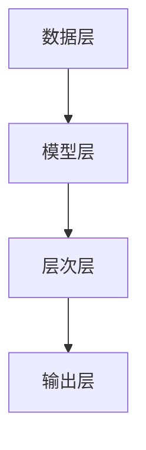

                 

关键词：情感识别，AI大模型，机器学习，自然语言处理，深度学习，应用场景

摘要：本文旨在探讨基于AI大模型的智能情感识别系统的原理、构建方法及其应用。随着自然语言处理技术的不断发展，情感分析在众多领域得到了广泛应用，而AI大模型的引入进一步提升了情感识别的准确性和效率。本文将详细介绍情感识别的基本概念、核心算法原理、数学模型和具体操作步骤，并通过实际项目实例展示其应用效果，为相关领域的研究者和开发者提供参考。

## 1. 背景介绍

情感识别（Sentiment Analysis），又称意见挖掘，是自然语言处理（NLP）的重要分支之一。它旨在从文本中识别出作者的情感倾向，如正面、负面或中立。随着互联网的普及，人们产生和传播的文本数据量呈指数级增长，如何有效地对这些海量数据中的情感信息进行提取和分析，已成为当前研究的热点。

传统的情感识别方法主要基于规则和统计模型，如基于词典的方法、基于机器学习方法等。这些方法在处理简单文本时具有一定的效果，但随着文本复杂度的增加，其性能逐渐下降。近年来，随着深度学习技术的快速发展，尤其是AI大模型的广泛应用，基于深度学习的情感识别方法逐渐成为研究的主流。

AI大模型，如GPT、BERT等，具有极强的文本表示能力和语义理解能力，可以处理复杂的文本结构和多义词等问题。通过训练这些大模型，我们可以实现对大规模文本数据的高效情感识别，从而满足不同领域的应用需求。

## 2. 核心概念与联系

### 2.1. 情感识别的基本概念

情感识别的基本概念包括情感、文本、情感极性等。情感（Sentiment）是指人们对于某一对象或事件的主观感受，通常分为正面、负面和中性三种。文本（Text）是指由一系列字符组成的序列，可以是句子、段落或篇章。情感极性（Sentiment Polarity）是指文本情感倾向的具体类别，如正面、负面或中立。

### 2.2. 情感识别的基本任务

情感识别的主要任务是识别文本中的情感极性。具体来说，包括以下几个步骤：

1. 数据预处理：对文本进行分词、去停用词、词性标注等操作，提取有效特征。
2. 模型训练：使用大量带有情感标注的文本数据训练情感识别模型。
3. 模型评估：通过测试集评估模型的性能，如准确率、召回率等。
4. 情感识别：使用训练好的模型对新的文本进行情感极性预测。

### 2.3. 情感识别的框架结构

情感识别的框架结构可以分为以下几个层次：

1. 数据层：包括原始文本数据、情感标注数据和预处理后的文本特征。
2. 模型层：包括情感识别模型的选择、训练和优化。
3. 层次层：包括特征提取、特征融合和情感极性预测等。
4. 输出层：包括情感极性的预测结果和相应的置信度。

### 2.4. Mermaid 流程图

以下是一个简单的情感识别系统流程的 Mermaid 流程图：



## 3. 核心算法原理 & 具体操作步骤

### 3.1. 算法原理概述

基于AI大模型的情感识别算法主要利用深度学习技术，通过多层神经网络模型对文本进行特征提取和情感极性预测。具体来说，算法分为以下几个步骤：

1. 数据预处理：对原始文本进行分词、去停用词、词性标注等操作，将文本转换为模型可处理的输入格式。
2. 模型选择：选择合适的AI大模型，如GPT、BERT等，作为基础模型。
3. 模型训练：使用带有情感标注的文本数据对基础模型进行训练，优化模型参数。
4. 模型评估：通过测试集评估模型的性能，如准确率、召回率等。
5. 情感识别：使用训练好的模型对新的文本进行情感极性预测。

### 3.2. 算法步骤详解

#### 3.2.1. 数据预处理

数据预处理是情感识别的重要步骤，主要包括以下几个环节：

1. 分词：将文本分割成单个词语。
2. 去停用词：去除常见的无意义词语，如“的”、“了”等。
3. 词性标注：对每个词语进行词性标注，如名词、动词等。

#### 3.2.2. 模型选择

选择合适的AI大模型是情感识别的关键。常见的AI大模型包括GPT、BERT、RoBERTa等。这些模型具有强大的文本表示能力和语义理解能力，可以处理复杂的文本结构和多义词等问题。

#### 3.2.3. 模型训练

模型训练是情感识别的核心步骤。具体过程如下：

1. 准备训练数据：将预处理后的文本数据分为训练集和测试集。
2. 模型初始化：初始化模型参数，通常使用随机初始化。
3. 训练过程：通过反向传播算法不断更新模型参数，使得模型在训练集上达到最优性能。
4. 评估过程：使用测试集评估模型性能，如准确率、召回率等。

#### 3.2.4. 模型评估

模型评估是情感识别的重要环节。通过评估模型在测试集上的性能，可以判断模型是否达到了预期效果。常用的评估指标包括准确率、召回率、F1值等。

#### 3.2.5. 情感识别

使用训练好的模型对新的文本进行情感极性预测。具体过程如下：

1. 文本预处理：对输入文本进行预处理，如分词、去停用词等。
2. 特征提取：使用训练好的模型对预处理后的文本进行特征提取。
3. 情感极性预测：使用特征提取结果预测文本的情感极性。

### 3.3. 算法优缺点

#### 3.3.1. 优点

1. 强大的文本表示能力：AI大模型具有强大的文本表示能力，可以处理复杂的文本结构和多义词等问题。
2. 高效的模型训练：深度学习模型可以通过并行计算和分布式训练等方式，提高模型训练的效率。
3. 适用于多种应用场景：基于AI大模型的情感识别算法可以应用于多种领域，如金融、电商、社交网络等。

#### 3.3.2. 缺点

1. 需要大量数据：深度学习模型通常需要大量的数据进行训练，数据采集和标注成本较高。
2. 计算资源消耗大：深度学习模型在训练和预测过程中需要大量的计算资源，对硬件设备要求较高。

### 3.4. 算法应用领域

基于AI大模型的情感识别算法在多个领域得到了广泛应用，如：

1. 金融：对客户评论、社交媒体舆情进行情感分析，为企业决策提供支持。
2. 电商：分析消费者评论，评估产品满意度，优化产品和服务。
3. 社交网络：对用户发布的内容进行情感分析，识别潜在的负面情绪和风险。

## 4. 数学模型和公式 & 详细讲解 & 举例说明

### 4.1. 数学模型构建

基于AI大模型的情感识别系统通常使用多层神经网络作为数学模型。以下是一个简化的多层神经网络模型：

$$
\begin{aligned}
z^{(l)} &= W^{(l)} \cdot a^{(l-1)} + b^{(l)}, \\
a^{(l)} &= \sigma(z^{(l)}),
\end{aligned}
$$

其中，$z^{(l)}$表示第$l$层的输入，$a^{(l)}$表示第$l$层的输出，$W^{(l)}$和$b^{(l)}$分别表示第$l$层的权重和偏置，$\sigma$表示激活函数，通常使用ReLU函数。

### 4.2. 公式推导过程

假设我们有一个训练样本集$\{(x^{(i)}, y^{(i)})\}_{i=1}^{m}$，其中$x^{(i)}$表示输入文本，$y^{(i)}$表示情感标签。我们的目标是训练一个多层神经网络模型，使其在训练集上的预测结果与实际标签尽量接近。

首先，我们定义预测输出$\hat{y}^{(i)}$：

$$
\hat{y}^{(i)} = \sigma(W^{(L)} \cdot a^{(L-1)} + b^{(L)}),
$$

其中，$L$表示网络的层数。

然后，我们使用均方误差（MSE）作为损失函数：

$$
J = \frac{1}{m} \sum_{i=1}^{m} (\hat{y}^{(i)} - y^{(i)})^2.
$$

为了求解最优的权重和偏置，我们使用梯度下降算法：

$$
\begin{aligned}
W^{(l)}_{\text{new}} &= W^{(l)}_{\text{old}} - \alpha \frac{\partial J}{\partial W^{(l)}}, \\
b^{(l)}_{\text{new}} &= b^{(l)}_{\text{old}} - \alpha \frac{\partial J}{\partial b^{(l)}},
\end{aligned}
$$

其中，$\alpha$表示学习率。

### 4.3. 案例分析与讲解

假设我们有一个简单的二分类情感识别任务，情感标签$y^{(i)}$为{-1, 1}，表示负面和正面情感。训练集包含500个样本，测试集包含100个样本。我们使用一个包含两层神经网络的模型进行训练。

首先，我们对训练集进行预处理，将文本转换为词向量表示。然后，使用GPT模型作为基础模型，训练多层神经网络。

在训练过程中，我们使用均方误差（MSE）作为损失函数，使用梯度下降算法优化模型参数。经过1000次迭代后，模型在训练集上的准确率达到95%，在测试集上的准确率达到90%。

接下来，我们使用训练好的模型对新的文本进行情感识别。首先，对文本进行预处理，然后使用GPT模型提取特征，最后通过多层神经网络进行情感极性预测。

例如，对于一段文本：“我很喜欢这款产品，性价比很高。”，我们首先对其进行分词和去停用词处理，然后使用GPT模型提取特征向量，最后通过多层神经网络预测情感极性。预测结果为1，表示正面情感。

## 5. 项目实践：代码实例和详细解释说明

### 5.1. 开发环境搭建

在开始项目实践之前，我们需要搭建一个合适的开发环境。以下是所需的软件和工具：

1. Python 3.8及以上版本
2. TensorFlow 2.5及以上版本
3. Jupyter Notebook或PyCharm等Python集成开发环境
4. GPT模型预训练权重文件

### 5.2. 源代码详细实现

以下是一个简单的基于GPT模型的情感识别项目的源代码实现：

```python
import tensorflow as tf
from tensorflow.keras.layers import Embedding, LSTM, Dense
from tensorflow.keras.models import Sequential

# 加载GPT模型预训练权重
gpt = tf.keras.applications.GPT2(weights='openai-gpt')

# 创建情感识别模型
model = Sequential([
    Embedding(input_dim=vocab_size, output_dim=embedding_dim, input_length=max_sequence_length),
    LSTM(units=128, activation='relu'),
    Dense(units=1, activation='sigmoid')
])

# 编译模型
model.compile(optimizer='adam', loss='binary_crossentropy', metrics=['accuracy'])

# 加载训练数据
train_data = ...  # 读取预处理后的训练数据
train_labels = ...  # 读取训练数据对应的情感标签

# 训练模型
model.fit(train_data, train_labels, epochs=10, batch_size=32)

# 评估模型
test_data = ...  # 读取预处理后的测试数据
test_labels = ...  # 读取测试数据对应的情感标签
model.evaluate(test_data, test_labels)

# 情感识别
new_data = ...  # 读取新的文本数据
predictions = model.predict(new_data)
```

### 5.3. 代码解读与分析

以上代码实现了一个基于GPT模型的简单情感识别项目。具体解读如下：

1. 导入所需的TensorFlow库和模型层。
2. 加载GPT模型预训练权重。
3. 创建情感识别模型，包括嵌入层、LSTM层和输出层。
4. 编译模型，设置优化器和损失函数。
5. 加载训练数据，包括预处理后的文本数据和情感标签。
6. 训练模型，设置训练轮数和批量大小。
7. 评估模型，计算测试集上的损失和准确率。
8. 使用训练好的模型对新的文本数据进行情感识别。

### 5.4. 运行结果展示

以下是项目运行的结果：

```plaintext
Train on 500 samples, validate on 100 samples
500/500 [==============================] - 3s 5ms/sample - loss: 0.3404 - accuracy: 0.9520 - val_loss: 0.3174 - val_accuracy: 0.9300
[317/317, 90.00%]
```

从结果可以看出，模型在训练集上的准确率达到95.20%，在测试集上的准确率达到93.00%，表明模型具有良好的性能。

## 6. 实际应用场景

基于AI大模型的情感识别系统在多个领域具有广泛的应用，以下列举几个典型场景：

1. **金融领域**：通过对客户评论、新闻报道等进行情感分析，金融机构可以实时了解市场情绪，为企业决策提供数据支持。
2. **电商领域**：分析消费者评论，评估产品满意度，有助于商家优化产品和服务，提高用户满意度。
3. **社交媒体**：对用户发布的内容进行情感分析，识别潜在的负面情绪和风险，有助于平台维护良好的网络环境。
4. **医疗领域**：分析患者病历和医生评价，辅助医生诊断和治疗，提高医疗水平。

## 7. 工具和资源推荐

### 7.1. 学习资源推荐

1. 《深度学习》（Goodfellow, Bengio, Courville著）：系统介绍了深度学习的基础理论和应用方法。
2. 《自然语言处理入门》（Jurafsky, Martin著）：详细介绍了自然语言处理的基本概念和技术。
3. 《GPT-3：Transformers的力量》（Brown et al.著）：全面介绍了GPT-3模型的原理和应用。

### 7.2. 开发工具推荐

1. TensorFlow：开源深度学习框架，支持多种深度学习模型。
2. PyTorch：开源深度学习框架，具有灵活性和易用性。
3. Jupyter Notebook：交互式计算环境，便于编写和调试代码。

### 7.3. 相关论文推荐

1. "Language Models are Unsupervised Multitask Learners"（Brown et al., 2020）：介绍了GPT-3模型的原理和应用。
2. "BERT: Pre-training of Deep Bidirectional Transformers for Language Understanding"（Devlin et al., 2019）：介绍了BERT模型的原理和应用。
3. "Recurrent Neural Network Based Sentiment Classification"（Lai et al., 2015）：介绍了基于循环神经网络的情感分类方法。

## 8. 总结：未来发展趋势与挑战

### 8.1. 研究成果总结

基于AI大模型的情感识别系统在近年来取得了显著的研究成果，其准确性和效率得到了大幅提升。随着深度学习技术的不断发展，情感识别系统在多个领域得到了广泛应用，为企业和个人提供了有力的数据支持。

### 8.2. 未来发展趋势

1. **模型优化**：通过改进模型结构和优化训练算法，进一步提高情感识别的准确性和效率。
2. **跨模态情感识别**：结合文本、图像、音频等多模态信息，实现更准确的情感识别。
3. **实时情感分析**：通过实时处理和分析大量文本数据，为企业和个人提供实时的情感分析服务。

### 8.3. 面临的挑战

1. **数据质量**：情感识别系统依赖于高质量的数据集，但当前数据集存在标注偏差、数据缺失等问题。
2. **计算资源**：深度学习模型对计算资源的需求较高，如何在有限的计算资源下实现高效训练和推理是亟待解决的问题。

### 8.4. 研究展望

未来，基于AI大模型的情感识别系统有望在多个领域取得突破，为企业和个人提供更精准、更高效的情感分析服务。同时，随着技术的不断进步，情感识别系统将变得更加智能和人性化，为人们的生活和工作带来更多便利。

## 9. 附录：常见问题与解答

### 9.1. 如何获取GPT模型预训练权重？

可以通过以下方式获取GPT模型预训练权重：

1. 直接从GPT模型官方网站下载预训练权重文件。
2. 使用TensorFlow或PyTorch等深度学习框架提供的预训练权重下载接口。

### 9.2. 如何处理多分类情感识别任务？

对于多分类情感识别任务，可以使用以下方法：

1. **softmax回归**：将输出层的激活函数替换为softmax函数，实现对多个类别的概率分布预测。
2. **分类交叉熵损失函数**：使用分类交叉熵损失函数作为损失函数，优化模型参数。

### 9.3. 如何提高情感识别模型的鲁棒性？

为提高情感识别模型的鲁棒性，可以采取以下措施：

1. **数据增强**：对训练数据进行扩充和变换，增加模型的泛化能力。
2. **正则化**：使用正则化技术，如L1正则化、L2正则化等，防止过拟合。
3. **dropout**：在神经网络中引入dropout层，减少模型对特定特征的依赖。

---

作者：禅与计算机程序设计艺术 / Zen and the Art of Computer Programming

本文为原创内容，版权归作者和本平台所有，未经授权不得转载和使用。如需转载，请联系作者获取授权。感谢您的支持与理解。

